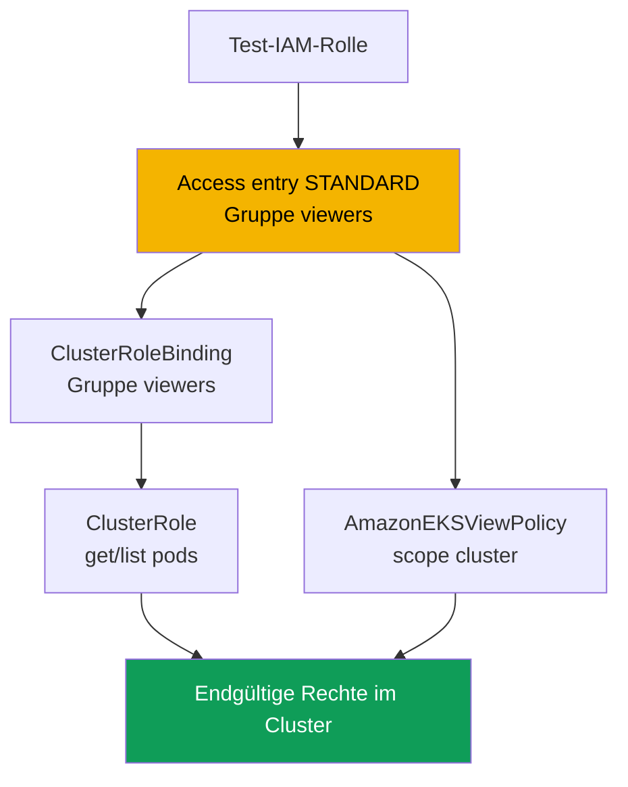
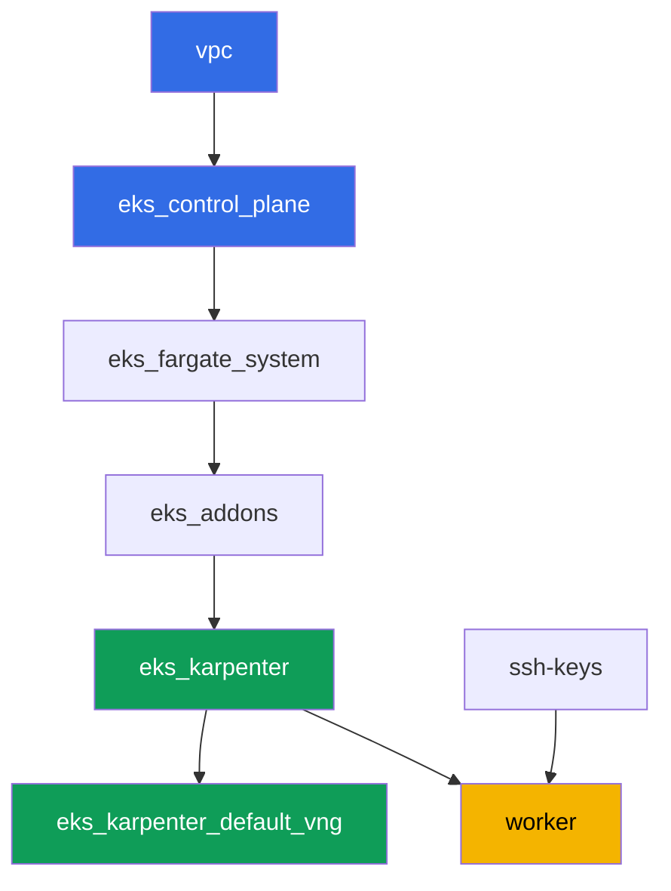

[Русская версия](README_RU.MD) · [Eng version](README.MD) · [Versión en español](README_ES.MD) · [Version française](README_FR.MD) · [ქართული ვერსია](README_GE.MD) · [繁體中文版](README_TW.MD) · [日本語版](README_JP.MD)

# Lab 102 - Zugriff auf den Cluster: IAM und RBAC, Access Entries und Access Policies

## Beschreibung

Der Cluster ist bereits erstellt (Lab 101), und die nächste Frage lautet: wer bekommt
Zugriff darauf und mit welchen Rechten. In diesem Lab arbeiten Sie sich durch die
Schnittstelle zwischen zwei Schichten: Authentifizierung über IAM und Autorisierung über
RBAC. Sie legen einen zweiten IAM-Principal an, geben ihm Zugriff über eine Access Entry,
vergeben Rechte auf zwei Wegen - über eigenes RBAC und über eine fertige Access Policy -
und sehen in der Praxis den Unterschied zwischen `Unauthorized` (Authentifizierung
fehlgeschlagen) und `Forbidden` (erfolgreich authentifiziert, aber RBAC hat die Aktion
nicht erlaubt).

Die Aufgaben sind im Produktionsstil geschrieben: eine kurze Aufgabenstellung plus
Abnahmekriterien. Die Prüfung erfolgt automatisch über den Befehl `check_result`, plus
einigen manuellen Schritten mit assume-role, die Sie selbst ausführen müssen, um den
Unterschied live zu sehen.

## Ziel

Den Stoff des Kurskapitels vertiefen:

- [Kapitel 5. Zugriff auf den Cluster: IAM und RBAC, Access Entries](../../course/05/de.md) -
  Migration von aws-auth

## Was wir erstellen

Der Cluster ist bereits als Code deployt (wie in Lab 101) und läuft im Modus
`authenticationMode = API`. Sie erstellen einen zweiten IAM-Principal und richten ihm
Zugriff auf zwei parallelen Wegen ein: RBAC über eine Access Entry und eine fertige
Access Policy.

| Objekt | Was es ist | Wofür in diesem Lab |
|--------|---------|-------------------|
| Test-IAM-Rolle | zweiter Principal, nur von der worker-Rolle assumable | Principal zum Testen der Access Entry, ohne Rechte in anderen Labs |
| Access Entry (`STANDARD`, Gruppe `viewers`) | Abbildung der Rolle auf eine Kubernetes-Gruppe | verbindet den IAM-Principal mit einem RBAC-Subjekt |
| `ClusterRole`/`ClusterRoleBinding viewers-pod-reader` | RBAC für die Gruppe `viewers` | Rechte `get`/`list` auf pods, klassisches RBAC über der Access Entry |
| Assoziation `AmazonEKSViewPolicy` (Scope `cluster`) | AWS Access Policy | zweite, parallele Rechtequelle, ohne eigenes RBAC |
| Artefakte `1/accessconfig.json`, `7/...txt`, `8/...txt` | Konfigurationsauszüge und Erklärungen | halten den Zugriffsmodus und den Unterschied Unauthorized/Forbidden fest |



## Infrastruktur

Die Umgebung wird in AWS (`eu-central-1`) über Terragrunt deployt, wie in Lab 101. Jedes
Lab-Verzeichnis ist eine Komponente mit eigenem `terragrunt.hcl`, das auf ein gemeinsames
Modul in `terraform/modules/` verweist und seine Abhängigkeiten über `dependency`-Blöcke
deklariert. Spezielle Komponenten für den Zugriff braucht dieses Lab nicht: Der Cluster
wird bereits vom Modul `eks_v2_control_plane` (`terraform-aws-modules/eks/aws` v21) im
Modus `API` erstellt, und alle Aufgaben werden über die `aws eks` CLI und gewöhnliche
RBAC-Manifeste von der Worker-Maschine aus ausgeführt.

### Module und Abhängigkeiten

| Verzeichnis (Komponente) | Modul (`terraform/modules/`) | Abhängig von | Was es erstellt |
|---------------------|-------------------------------|------------|-------------|
| `vpc` | `vpc_v3` | - | VPC `10.10.0.0/16`, öffentliche und private Subnetze in zwei AZ, NAT |
| `ssh-keys` | `ssh-keys` | - | ein SSH-Schlüsselpaar für die Worker-Maschine und die Nodes |
| `eks_control_plane` | `eks_v2_control_plane` | `vpc` | EKS Control Plane `1.36`, Zugriffsmodus `API`, OIDC |
| `eks_fargate_system` | `eks_v2_fargate` | `vpc`, `eks_control_plane` | Fargate-Profil für `kube-system` und `karpenter` |
| `eks_addons` | `eks_v2_addons` | `eks_control_plane`, `eks_fargate_system` | Add-ons coredns, kube-proxy, vpc-cni, pod-identity |
| `eks_karpenter` | `eks_v2_karpenter` | `vpc`, `eks_control_plane`, `eks_addons`, `eks_fargate_system` | Karpenter-Controller, IAM-Rolle der Nodes |
| `eks_karpenter_default_vng` | `eks_v2_karpenter_vng` | `vpc`, `eks_control_plane`, `eks_karpenter` | Standard-NodePool `default` und EC2NodeClass auf AL2023 |
| `worker` | `eks_v2_work_pc` | `ssh-keys`, `vpc`, `eks_control_plane`, `eks_karpenter` | Worker-Maschine mit kubectl, Tests und `check_result` |

Der Abhängigkeitsgraph (was früher angewendet wird, steht weiter unten am Pfeil) ist
derselbe wie in Lab 101:



### Zweiter Principal und Rechte des workers

Die Node-Rolle von Karpenter eignet sich nicht als "zweiter Principal": Das
Karpenter-Submodul erstellt für sie automatisch eine eigene Access Entry vom Typ
`EC2_LINUX`, und ein IAM-Principal kann nicht in zwei Access Entries gleichzeitig stehen.
Deshalb erstellt dieses Lab eine separate Test-IAM-Rolle direkt auf dem worker über die
AWS CLI (ohne Änderungen am Terraform-Code des Clusters).

Die worker-Rolle (`eks_v2_work_pc/iam.tf`) hatte bereits `eks:*` - das reicht für alle
Befehle wie `create-access-entry`, `associate-access-policy` und ähnliche. Für die
Erstellung der Testrolle (Aufgabe 2) erhielt worker gezielte Rechte `iam:CreateRole`,
`iam:GetRole`, `iam:DeleteRole`, `iam:PutRolePolicy` und `sts:AssumeRole`, beschränkt auf
die Ressource `arn:aws:iam::<account>:role/*-test-*` - das heißt, worker kann nur Rollen
mit `-test-` im Namen verwalten und nur diese assumen, ohne sich weitere Rechte auf
irgendetwas anderes zu verschaffen.

## Deployment

```bash
TASK=102 make run_eks_task
```

Das Deployment dauert etwa 15-20 Minuten. Suchen Sie in der Ausgabe die Zeile mit der
SSH-Verbindung zur Worker-Maschine und verbinden Sie sich damit. kubectl ist dort bereits
für den richtigen Cluster konfiguriert.

Nützliche Befehle auf der Worker-Maschine:

```bash
time_left       # verbleibende Zeit der Umgebung
check_result    # Lösung prüfen
```

> Sicherheit der Testumgebung. In `env.hcl` sind `ssh_password_enable = true` und
> `access_cidrs = ["0.0.0.0/0"]` aktiviert - praktisch für eine Lernumgebung, aber so sollte
> man es in Produktion nicht machen. Nach den Standards des Kurses wird der Zugriff auf
> Worker-Maschinen über AWS SSM Session Manager geöffnet, ohne öffentliche SSH-Ports nach
> außen, und `access_cidrs` wird auf konkrete Adressen eingeschränkt. Hier bleibt
> öffentliches SSH nur der Einfachheit halber bestehen.

## Aufgaben

---
|        **1**        | **Inventur: Zugriffsmodus des Clusters**                  |
| :-----------------: | :---------------------------------------------------------- |
| Was wir tun          | Speichern Sie `aws eks describe-cluster --name <cluster> --query 'cluster.accessConfig'` in die Datei `/var/work/tests/artifacts/1/accessconfig.json`. Bestätigen Sie, dass `authenticationMode` gleich `API` ist. |
| Abnahmekriterien    | - die Datei ist nicht leer;<br/>- sie enthält `"authenticationMode": "API"`. |
---
|        **2**        | **Zweiter IAM-Principal für den Test**                          |
| :-----------------: | :---------------------------------------------------------- |
| Was wir tun          | Erstellen Sie eine Test-IAM-Rolle (der Name muss `-test-` enthalten, z. B. `eks-task102-test-viewer`) mit einer Trust Policy, die `sts:AssumeRole` nur für den ARN der worker-Rolle erlaubt. Speichern Sie den ARN der Rolle in die Datei `/var/work/tests/artifacts/2/test_role_arn.txt`. |
| Abnahmekriterien    | - die Datei ist nicht leer und enthält den ARN einer Rolle mit `test` im Namen;<br/>- die Rolle existiert (`aws iam get-role`). |
---
|        **3**        | **Access Entry für den Test-Principal**                   |
| :-----------------: | :---------------------------------------------------------- |
| Was wir tun          | Erstellen Sie eine Access Entry vom Typ `STANDARD` für die Testrolle mit `kubernetesGroups` gleich `viewers`, ohne expliziten `username` (EKS soll ihn selbst vergeben). |
| Abnahmekriterien    | - `aws eks describe-access-entry` liefert `type=STANDARD`;<br/>- `kubernetesGroups` enthält `viewers`. |
---
|        **4**        | **RBAC über der Access Entry: nur Pods lesen**            |
| :-----------------: | :---------------------------------------------------------- |
| Was wir tun          | Erstellen Sie die `ClusterRole` `viewers-pod-reader` mit ausschließlich den Rechten `get` und `list` auf `pods`, sowie das `ClusterRoleBinding` `viewers-pod-reader`, das sie an die Gruppe `viewers` bindet. Das ist klassisches RBAC über der Access Entry, ohne Access Policy. |
| Abnahmekriterien    | - die `ClusterRole` gewährt nur `get`/`list` auf `pods` (ohne `create`, `delete`);<br/>- das `ClusterRoleBinding` ist an die Gruppe `viewers` gebunden. |
---
|        **5**        | **Manuelle Prüfung der Rechte über assume-role**                  |
| :-----------------: | :---------------------------------------------------------- |
| Was wir tun          | Führen Sie auf dem worker `aws sts assume-role --role-arn <test_role_arn> --role-session-name test-viewer-session` aus, exportieren Sie die temporären Credentials und holen Sie sich ein separates kubeconfig über `aws eks update-kubeconfig --alias test-viewer --kubeconfig /tmp/test-viewer.kubeconfig`. Prüfen Sie `kubectl --kubeconfig /tmp/test-viewer.kubeconfig get pods -A` (sollte funktionieren) und `kubectl --kubeconfig /tmp/test-viewer.kubeconfig create namespace test` (sollte mit `Forbidden` fehlschlagen). Speichern Sie beide Befehle und ihre Ergebnisse in die Datei `/var/work/tests/artifacts/5/rbac_check.txt`. |
| Abnahmekriterien    | - die Datei ist nicht leer und erwähnt `get pods` und `Forbidden`. |
---
|        **6**        | **Access Policy über der Access Entry**                       |
| :-----------------: | :---------------------------------------------------------- |
| Was wir tun          | Assoziieren Sie mit der Testrolle die Access Policy `AmazonEKSViewPolicy` mit Scope `cluster`. Stellen Sie über `aws eks list-associated-access-policies` sicher, dass die Assoziation vorhanden ist. |
| Abnahmekriterien    | - `list-associated-access-policies` enthält `AmazonEKSViewPolicy` mit `accessScope.type=cluster`. |
---
|        **7**        | **Diagnose: Unauthorized versus Forbidden**              |
| :-----------------: | :---------------------------------------------------------- |
| Was wir tun          | Legen Sie eine weitere Testrolle an (Name mit `-test-`) ohne jede Access Entry, holen Sie sich ihr kubeconfig über assume-role genauso wie in Aufgabe 5, und führen Sie `kubectl get pods -A` aus - stellen Sie sicher, dass die Antwort `Unauthorized` ist und nicht `Forbidden`, weil der Cluster diesen ARN überhaupt nicht kennt (prüfen Sie das über `aws eks list-access-entries`). Vergleichen Sie das mit dem `Forbidden` aus Aufgabe 5. Speichern Sie die Erklärung des Unterschieds in die Datei `/var/work/tests/artifacts/7/unauthorized_vs_forbidden.txt` und erwähnen Sie beide Fehler sowie den Befehl `list-access-entries`. |
| Abnahmekriterien    | - die Datei ist nicht leer und erwähnt `Unauthorized`, `Forbidden` und `list-access-entries`. |
---
|        **8**        | **Zugriffsentzug: Löschen und Wiederherstellen der Access Entry**   |
| :-----------------: | :---------------------------------------------------------- |
| Was wir tun          | Löschen Sie die Access Entry der Testrolle aus Aufgabe 3 (`aws eks delete-access-entry`), prüfen Sie über `test-viewer.kubeconfig`, dass der Zugriff weg ist (`Unauthorized`), und legen Sie dann den Eintrag mit derselben Gruppe `viewers` erneut an, damit die Umgebung in einem funktionsfähigen Zustand für die Prüfung bleibt. Halten Sie den Ablauf des Experiments in der Datei `/var/work/tests/artifacts/8/delete_recreate.txt` fest. |
| Abnahmekriterien    | - die Access Entry der Testrolle existiert wieder, Typ `STANDARD`;<br/>- die Datei erwähnt `Unauthorized`, `delete-access-entry` und `create-access-entry`. |
---

## Ergebnis prüfen

Führen Sie auf der Worker-Maschine die automatische Prüfung aus:

```bash
check_result
```

Das Skript führt die Tests aus und zeigt den Prozentsatz erledigter Aufgaben. Die Aufgaben
5, 7 und 8 erfordern ein echtes assume-role mit temporären Credentials, daher prüft der
Autotest nur die resultierende Konfiguration (Access Entry, RBAC, Access Policy) und die
Artefakte mit der Erklärung - den tatsächlichen Unterschied zwischen
`Unauthorized`/`Forbidden` müssen Sie sich mit den Befehlen aus der Lösung selbst ansehen.

## Lösung

Referenzlösung: [worker/files/solutions/1_DE.MD](worker/files/solutions/1_DE.MD)

## Cluster und Ressourcen löschen

> **Entfernen Sie zuerst die Test-IAM-Rollen.** Die Rollen `eks-task102-test-viewer` und
> `eks-task102-test-nobody` haben Sie manuell über die AWS CLI erstellt, sie stehen nicht im
> Terraform-State, und `destroy` rührt sie nicht an. IAM-Rollen existieren außerhalb der
> Region und außerhalb des Clusters, daher bleiben sie im Account, und bei einem erneuten
> Start des Labs schlägt `aws iam create-role` mit `EntityAlreadyExists` fehl. Access
> Entries müssen Sie nicht separat löschen (sie verschwinden mit dem Cluster), aber wenn Sie
> das Lab auf demselben Cluster noch einmal durchlaufen möchten, entfernen Sie auch diese.

```bash
CLUSTER=$(aws eks list-clusters --query 'clusters[0]' --output text)

for ROLE in eks-task102-test-viewer eks-task102-test-nobody; do
  ARN=$(aws iam get-role --role-name "$ROLE" --query 'Role.Arn' --output text 2>/dev/null) || continue
  # Access Entry dieser Rolle (nötig, wenn Sie das Lab erneut durchlaufen)
  aws eks delete-access-entry --cluster-name "$CLUSTER" --principal-arn "$ARN" 2>/dev/null
  # Inline- und angehängte Policies, falls Sie sie hinzugefügt haben
  for P in $(aws iam list-role-policies --role-name "$ROLE" --query 'PolicyNames' --output text); do
    aws iam delete-role-policy --role-name "$ROLE" --policy-name "$P"
  done
  for P in $(aws iam list-attached-role-policies --role-name "$ROLE" \
      --query 'AttachedPolicies[].PolicyArn' --output text); do
    aws iam detach-role-policy --role-name "$ROLE" --policy-arn "$P"
  done
  aws iam delete-role --role-name "$ROLE"
done
```

> **Entfernen Sie die Workload.** Falls die Pods des Labs Karpenter dazu gebracht haben,
> einen EC2-Node hochzufahren, entfernen Sie die Workload und warten Sie, bis der Node
> verschwindet: sonst schafft es VPC CNI nicht, seine sekundären ENIs zu entfernen, das
> verwaiste ENI bleibt im Zustand `available`, hält die Security Group der Nodes fest, und
> `destroy` hängt bei `module.eks.aws_security_group.node[0]: Still destroying...`.

```bash
while kubectl get nodes --no-headers 2>/dev/null | grep -qv fargate; do
  echo "Der Karpenter-EC2-Node lebt noch, warte..."; sleep 15
done
```

```bash
TASK=102 make delete_eks_task
```

Bleibt `destroy` trotzdem bei der Security Group hängen, finden und löschen Sie das
verwaiste ENI:

```bash
aws ec2 describe-network-interfaces --filters Name=status,Values=available \
  --query 'NetworkInterfaces[].[NetworkInterfaceId,Description,Groups[0].GroupName]' --output table
aws ec2 delete-network-interface --network-interface-id <eni-id>
```
