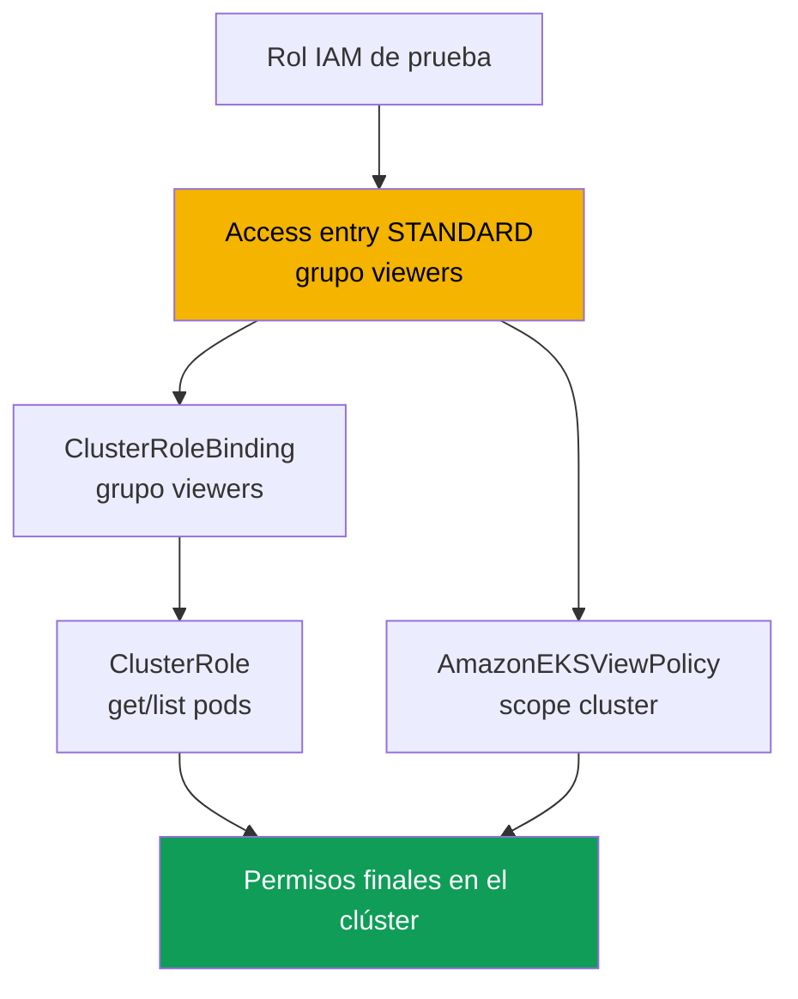
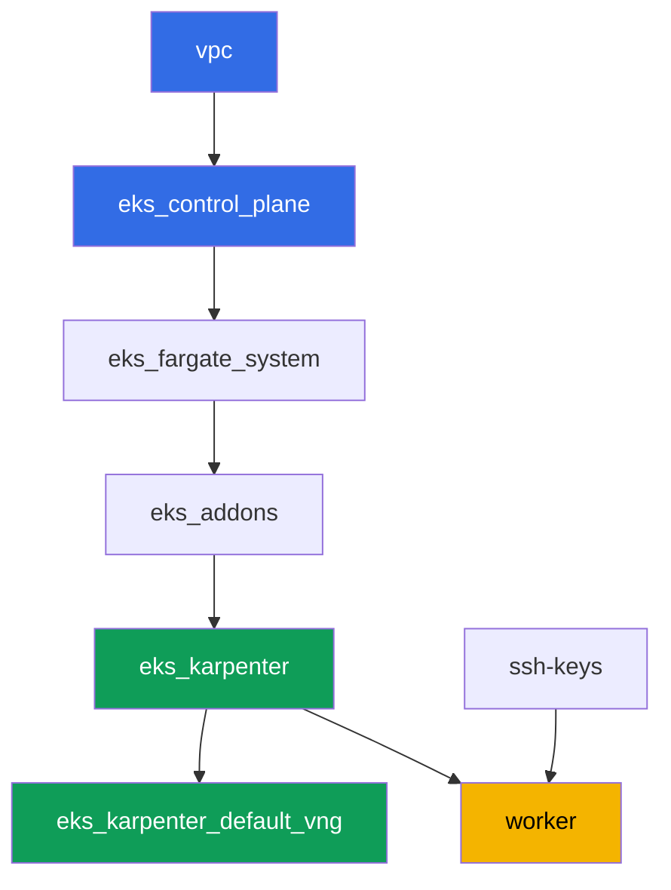

[Русская версия](README_RU.MD) · [Eng version](README.MD) · [Version française](README_FR.MD) · [Deutsche Version](README_DE.MD) · [ქართული ვერსია](README_GE.MD) · [繁體中文版](README_TW.MD) · [日本語版](README_JP.MD)

# Lab 102 - Acceso al clúster: IAM y RBAC, access entries y access policies

## Descripción

El clúster ya está creado (laboratorio 101), y la siguiente pregunta es quién entra en él y
con qué permisos. En este laboratorio analizas la unión de dos capas: la autenticación
mediante IAM y la autorización mediante RBAC. Creas un segundo principal de IAM, le das
acceso mediante una access entry, otorgas permisos de dos formas - tu propio RBAC y una
access policy ya lista -, y ves en la práctica la diferencia entre `Unauthorized` (la
autenticación no pasó) y `Forbidden` (pasó, pero RBAC no permitió la acción).

Las tareas están escritas en estilo de producción: un enunciado breve más criterios de
aceptación. La verificación es automática, mediante el comando `check_result`, más varios
pasos manuales con assume-role que debes ejecutar tú mismo para ver la diferencia en vivo.

## Objetivo

Reforzar el material de este capítulo del curso:

- [Capítulo 5. Acceso al clúster: IAM y RBAC, access entries](../../course/05/ru.md) -
  migración desde aws-auth

## Qué vamos a crear

El clúster ya está desplegado como código (igual que en el laboratorio 101) y funciona en
modo `authenticationMode = API`. Creas un segundo principal de IAM y le configuras el acceso
por dos caminos paralelos: RBAC sobre una access entry y una access policy ya lista.

| Objeto | Qué es | Para qué sirve en este laboratorio |
|--------|---------|-------------------|
| Rol IAM de prueba | segundo principal, solo puede ser assumido por el rol worker | principal para probar la access entry sin permisos en otros laboratorios |
| Access entry (`STANDARD`, grupo `viewers`) | mapeo del rol a un grupo de Kubernetes | conecta el principal de IAM con un sujeto de RBAC |
| `ClusterRole`/`ClusterRoleBinding viewers-pod-reader` | RBAC sobre el grupo `viewers` | permisos `get`/`list` sobre pods, RBAC clásico encima de la access entry |
| Asociación de `AmazonEKSViewPolicy` (scope `cluster`) | access policy de AWS | segunda fuente de permisos, paralela, sin RBAC propio |
| Artefactos `1/accessconfig.json`, `7/...txt`, `8/...txt` | instantáneas de configuración y explicaciones | registramos el modo de acceso y la diferencia Unauthorized/Forbidden |



## Infraestructura

El entorno se despliega en AWS (`eu-central-1`) mediante Terragrunt, igual que en el
laboratorio 101. Cada carpeta del laboratorio es un componente con su propio
`terragrunt.hcl`, que hace referencia a un módulo compartido en `terraform/modules/` y
declara sus dependencias mediante bloques `dependency`. Este laboratorio no necesita
componentes especiales para el acceso: el clúster ya se crea con el módulo
`eks_v2_control_plane` (`terraform-aws-modules/eks/aws` v21) en modo `API`, y todas las
tareas se ejecutan mediante la CLI `aws eks` y manifiestos RBAC normales desde la máquina de
trabajo.

### Módulos y dependencias

| Carpeta (componente) | Módulo (`terraform/modules/`) | Depende de | Qué crea |
|---------------------|-------------------------------|------------|-------------|
| `vpc` | `vpc_v3` | - | VPC `10.10.0.0/16`, subredes públicas y privadas en dos AZ, NAT |
| `ssh-keys` | `ssh-keys` | - | un par de claves SSH para la máquina de trabajo y los nodos |
| `eks_control_plane` | `eks_v2_control_plane` | `vpc` | control plane de EKS `1.36`, modo de acceso `API`, OIDC |
| `eks_fargate_system` | `eks_v2_fargate` | `vpc`, `eks_control_plane` | perfil de Fargate para `kube-system` y `karpenter` |
| `eks_addons` | `eks_v2_addons` | `eks_control_plane`, `eks_fargate_system` | add-ons de coredns, kube-proxy, vpc-cni, pod-identity |
| `eks_karpenter` | `eks_v2_karpenter` | `vpc`, `eks_control_plane`, `eks_addons`, `eks_fargate_system` | controlador de Karpenter, rol IAM de los nodos |
| `eks_karpenter_default_vng` | `eks_v2_karpenter_vng` | `vpc`, `eks_control_plane`, `eks_karpenter` | NodePool por defecto `default` y EC2NodeClass sobre AL2023 |
| `worker` | `eks_v2_work_pc` | `ssh-keys`, `vpc`, `eks_control_plane`, `eks_karpenter` | máquina de trabajo con kubectl, tests y `check_result` |

Grafo de dependencias (lo que se aplica antes está más abajo en la flecha), igual que en el
laboratorio 101:



### El segundo principal y los permisos de worker

El rol del nodo de Karpenter no sirve como "segundo principal": el submódulo de Karpenter
crea automáticamente para él su propia access entry de tipo `EC2_LINUX`, y un mismo
principal de IAM no puede estar en dos access entries. Por eso el laboratorio crea un rol
IAM de prueba independiente directamente en el worker mediante la AWS CLI (sin cambios en
el terraform del clúster).

El rol worker (`eks_v2_work_pc/iam.tf`) ya tenía `eks:*` - suficiente para todos los
comandos `create-access-entry`, `associate-access-policy` y similares. Para crear el rol de
prueba (tarea 2) worker recibió permisos puntuales `iam:CreateRole`, `iam:GetRole`,
`iam:DeleteRole`, `iam:PutRolePolicy` y `sts:AssumeRole`, limitados al recurso
`arn:aws:iam::<account>:role/*-test-*` - es decir, worker solo puede gestionar roles con
`-test-` en el nombre y solo puede assumir esos, sin ampliar sus permisos sobre nada más.

## Despliegue

```bash
TASK=102 make run_eks_task
```

El despliegue tarda aproximadamente 15-20 minutos. En la salida, busca la línea con la
conexión SSH a la máquina de trabajo y conéctate a ella. kubectl ya está configurado allí
para el clúster correcto.

Comandos útiles en la máquina de trabajo:

```bash
time_left       # cuánto tiempo queda del entorno
check_result    # verificar la solución
```

> Seguridad del entorno. En `env.hcl` están activados `ssh_password_enable = true` y
> `access_cidrs = ["0.0.0.0/0"]` - cómodo para un entorno de formación, pero no es algo que
> se deba hacer en producción. Según los estándares del curso, el acceso a las máquinas de
> trabajo se abre mediante AWS SSM Session Manager sin puertos SSH públicos hacia el
> exterior, y `access_cidrs` se restringe a direcciones concretas. Aquí se deja SSH público
> solo para simplificar el arranque.

## Tareas

---
|        **1**        | **Inventario: modo de acceso del clúster**                  |
| :-----------------: | :---------------------------------------------------------- |
| Qué hacemos          | Guarda `aws eks describe-cluster --name <cluster> --query 'cluster.accessConfig'` en el archivo `/var/work/tests/artifacts/1/accessconfig.json`. Confirma que `authenticationMode` es igual a `API`. |
| Criterios de aceptación    | - el archivo no está vacío;<br/>- contiene `"authenticationMode": "API"`. |
---
|        **2**        | **Segundo principal de IAM para la prueba**                          |
| :-----------------: | :---------------------------------------------------------- |
| Qué hacemos          | Crea un rol IAM de prueba (el nombre debe contener `-test-`, por ejemplo `eks-task102-test-viewer`) con una trust policy que permita `sts:AssumeRole` solo al ARN del rol worker. Guarda el ARN del rol en el archivo `/var/work/tests/artifacts/2/test_role_arn.txt`. |
| Criterios de aceptación    | - el archivo no está vacío y contiene el ARN de un rol con `test` en el nombre;<br/>- el rol existe (`aws iam get-role`). |
---
|        **3**        | **Access entry para el principal de prueba**                   |
| :-----------------: | :---------------------------------------------------------- |
| Qué hacemos          | Crea una access entry de tipo `STANDARD` para el rol de prueba con `kubernetesGroups` igual a `viewers`, sin indicar `username` de forma explícita (deja que EKS lo asigne automáticamente). |
| Criterios de aceptación    | - `aws eks describe-access-entry` devuelve `type=STANDARD`;<br/>- `kubernetesGroups` contiene `viewers`. |
---
|        **4**        | **RBAC sobre la access entry: solo lectura de pods**            |
| :-----------------: | :---------------------------------------------------------- |
| Qué hacemos          | Crea el `ClusterRole` `viewers-pod-reader` con permisos únicamente `get` y `list` sobre `pods`, y el `ClusterRoleBinding` `viewers-pod-reader`, que lo vincula al grupo `viewers`. Esto es RBAC clásico encima de la access entry, sin access policy. |
| Criterios de aceptación    | - el `ClusterRole` otorga solo `get`/`list` sobre `pods` (sin `create`, `delete`);<br/>- el `ClusterRoleBinding` está vinculado al grupo `viewers`. |
---
|        **5**        | **Comprobación manual de permisos mediante assume-role**                  |
| :-----------------: | :---------------------------------------------------------- |
| Qué hacemos          | Desde worker ejecuta `aws sts assume-role --role-arn <test_role_arn> --role-session-name test-viewer-session`, exporta las credenciales temporales y obtén un kubeconfig aparte con `aws eks update-kubeconfig --alias test-viewer --kubeconfig /tmp/test-viewer.kubeconfig`. Comprueba `kubectl --kubeconfig /tmp/test-viewer.kubeconfig get pods -A` (debe funcionar) y `kubectl --kubeconfig /tmp/test-viewer.kubeconfig create namespace test` (debe fallar con `Forbidden`). Guarda ambos comandos y su resultado en el archivo `/var/work/tests/artifacts/5/rbac_check.txt`. |
| Criterios de aceptación    | - el archivo no está vacío y menciona `get pods` y `Forbidden`. |
---
|        **6**        | **Access policy sobre la access entry**                       |
| :-----------------: | :---------------------------------------------------------- |
| Qué hacemos          | Asocia al rol de prueba la access policy `AmazonEKSViewPolicy` con scope `cluster`. Verifica mediante `aws eks list-associated-access-policies` que la asociación existe. |
| Criterios de aceptación    | - `list-associated-access-policies` contiene `AmazonEKSViewPolicy` con `accessScope.type=cluster`. |
---
|        **7**        | **Diagnóstico: Unauthorized frente a Forbidden**              |
| :-----------------: | :---------------------------------------------------------- |
| Qué hacemos          | Crea otro rol de prueba (nombre con `-test-`) sin ninguna access entry, obtén su kubeconfig mediante assume-role igual que en la tarea 5, y ejecuta `kubectl get pods -A` - confirma que la respuesta es `Unauthorized`, y no `Forbidden`, porque el clúster no conoce en absoluto ese ARN (compruébalo con `aws eks list-access-entries`). Compáralo con el `Forbidden` de la tarea 5. Guarda la explicación de la diferencia en el archivo `/var/work/tests/artifacts/7/unauthorized_vs_forbidden.txt`, mencionando ambos errores y el comando `list-access-entries`. |
| Criterios de aceptación    | - el archivo no está vacío y menciona `Unauthorized`, `Forbidden` y `list-access-entries`. |
---
|        **8**        | **Revocación de acceso: eliminación y restauración de la access entry**   |
| :-----------------: | :---------------------------------------------------------- |
| Qué hacemos          | Elimina la access entry del rol de prueba de la tarea 3 (`aws eks delete-access-entry`), comprueba mediante `test-viewer.kubeconfig` que el acceso desapareció (`Unauthorized`), y luego crea la entrada de nuevo con el mismo grupo `viewers`, para que el entorno quede en estado funcional para la verificación. Guarda el desarrollo del experimento en el archivo `/var/work/tests/artifacts/8/delete_recreate.txt`. |
| Criterios de aceptación    | - la access entry del rol de prueba existe de nuevo, con tipo `STANDARD`;<br/>- el archivo menciona `Unauthorized`, `delete-access-entry` y `create-access-entry`. |
---

## Verificación del resultado

En la máquina de trabajo, ejecuta la verificación automática:

```bash
check_result
```

El script ejecutará los tests y mostrará el porcentaje de tareas completadas. Las tareas 5,
7 y 8 requieren un assume-role real con credenciales temporales, por lo que el autotest solo
verifica la configuración final (access entry, RBAC, access policy) y los artefactos con la
explicación - la diferencia real entre `Unauthorized`/`Forbidden` hay que verla con tus
propias manos siguiendo los comandos de la solución.

## Solución

Solución de referencia: [worker/files/solutions/1_ES.MD](worker/files/solutions/1_ES.MD)

## Eliminación del clúster y los recursos

> **Primero retira los roles IAM de prueba.** Los roles `eks-task102-test-viewer` y
> `eks-task102-test-nobody` los creaste a mano mediante la AWS CLI, no están en el state de
> terraform, y `destroy` no los tocará. Los roles IAM viven fuera de la región y fuera del
> clúster, así que permanecerán en la cuenta, y si vuelves a ejecutar el laboratorio,
> `aws iam create-role` fallará con `EntityAlreadyExists`. No es obligatorio eliminar las
> access entries por separado (desaparecen junto con el clúster), pero si quieres repetir el
> laboratorio en el mismo clúster, retíralas también.

```bash
CLUSTER=$(aws eks list-clusters --query 'clusters[0]' --output text)

for ROLE in eks-task102-test-viewer eks-task102-test-nobody; do
  ARN=$(aws iam get-role --role-name "$ROLE" --query 'Role.Arn' --output text 2>/dev/null) || continue
  # access entry de este rol (necesario si repites el laboratorio)
  aws eks delete-access-entry --cluster-name "$CLUSTER" --principal-arn "$ARN" 2>/dev/null
  # políticas en línea y adjuntas, si las agregaste
  for P in $(aws iam list-role-policies --role-name "$ROLE" --query 'PolicyNames' --output text); do
    aws iam delete-role-policy --role-name "$ROLE" --policy-name "$P"
  done
  for P in $(aws iam list-attached-role-policies --role-name "$ROLE" \
      --query 'AttachedPolicies[].PolicyArn' --output text); do
    aws iam detach-role-policy --role-name "$ROLE" --policy-arn "$P"
  done
  aws iam delete-role --role-name "$ROLE"
done
```

> **Retira la carga de trabajo.** Si los pods del laboratorio hicieron que Karpenter
> levantara un nodo EC2, elimina la carga y espera a que el nodo se vaya: de lo contrario
> VPC CNI no tendrá tiempo de retirar sus ENI secundarios, el ENI huérfano quedará en estado
> `available`, retendrá el security group de los nodos, y `destroy` se quedará colgado en
> `module.eks.aws_security_group.node[0]: Still destroying...`.

```bash
while kubectl get nodes --no-headers 2>/dev/null | grep -qv fargate; do
  echo "El nodo EC2 de Karpenter sigue vivo, esperando..."; sleep 15
done
```

```bash
TASK=102 make delete_eks_task
```

Si `destroy` sigue atascándose en el security group, encuentra y elimina el ENI huérfano:

```bash
aws ec2 describe-network-interfaces --filters Name=status,Values=available \
  --query 'NetworkInterfaces[].[NetworkInterfaceId,Description,Groups[0].GroupName]' --output table
aws ec2 delete-network-interface --network-interface-id <eni-id>
```
