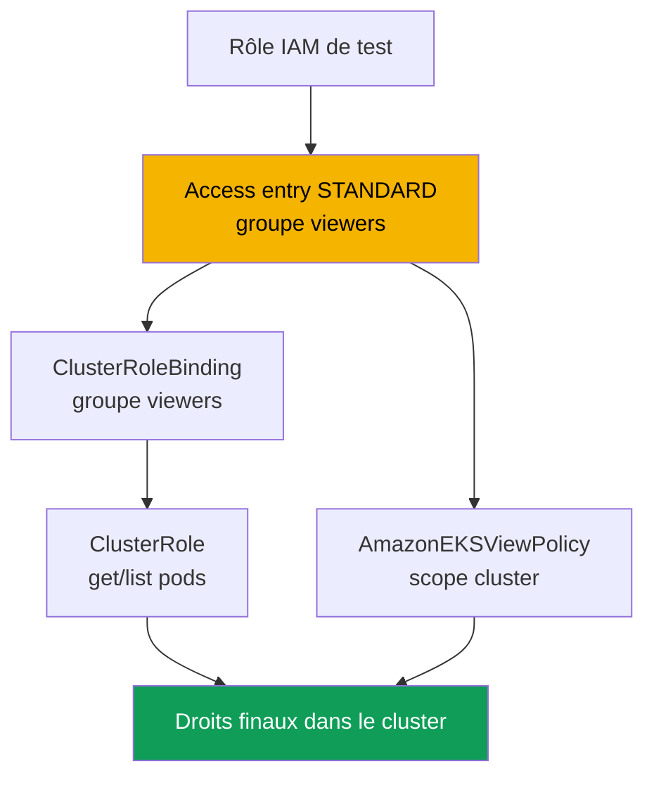
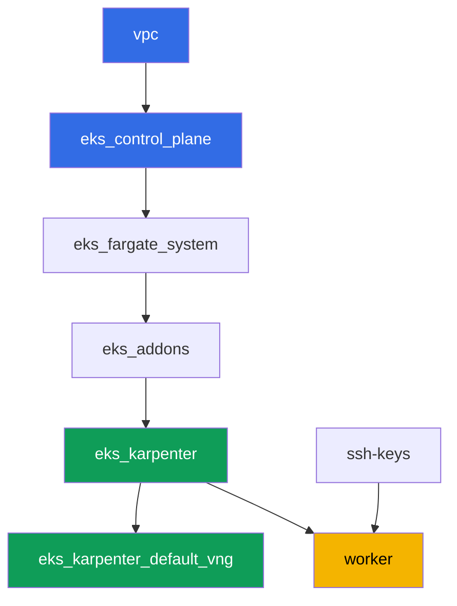

[Русская версия](README_RU.MD) · [Eng version](README.MD) · [Versión en español](README_ES.MD) · [Deutsche Version](README_DE.MD) · [ქართული ვერსია](README_GE.MD) · [繁體中文版](README_TW.MD) · [日本語版](README_JP.MD)

# Lab 102 - Accès au cluster : IAM et RBAC, access entries et access policies

## Description

Le cluster est créé (lab 101), et la question suivante est qui y entre et avec quels
droits. Dans ce lab, vous explorez la jonction entre deux couches : l'authentification via
IAM et l'autorisation via RBAC. Vous créez un second principal IAM, lui donnez accès via
une access entry, distribuez des droits de deux façons - votre propre RBAC et une access
policy toute faite - et voyez en pratique la différence entre `Unauthorized`
(authentification échouée) et `Forbidden` (authentification réussie, mais RBAC n'a pas
autorisé l'action).

Les tâches sont écrites dans un style de production : un énoncé court plus des critères
d'acceptation. La vérification est automatique, via la commande `check_result`, plus
quelques étapes manuelles avec assume-role que vous devez exécuter vous-même pour voir la
différence en direct.

## Objectif

Consolider le contenu du chapitre suivant du cours :

- [Chapitre 5. Accès au cluster : IAM et RBAC, access entries](../../course/05/fr.md) -
  migration depuis aws-auth

## Ce que nous créons

Le cluster est déjà déployé en tant que code (comme au lab 101) et fonctionne en mode
`authenticationMode = API`. Vous créez un second principal IAM et configurez son accès par
deux voies parallèles : RBAC par-dessus une access entry, et une access policy toute faite.

| Objet | Ce que c'est | Pourquoi dans ce lab |
|--------|---------|-------------------|
| Rôle IAM de test | second principal, assumable uniquement par le rôle worker | un principal pour tester une access entry sans toucher aux droits des autres labs |
| Access entry (`STANDARD`, groupe `viewers`) | fait correspondre le rôle à un groupe Kubernetes | relie le principal IAM à un sujet RBAC |
| `ClusterRole`/`ClusterRoleBinding viewers-pod-reader` | RBAC pour le groupe `viewers` | droits `get`/`list` sur les pods, RBAC classique par-dessus une access entry |
| Association `AmazonEKSViewPolicy` (scope `cluster`) | access policy AWS | une seconde source de droits, parallèle, sans RBAC propre |
| Artefacts `1/accessconfig.json`, `7/...txt`, `8/...txt` | instantanés de configuration et explications | consignent le mode d'accès et la différence Unauthorized/Forbidden |



## Infrastructure

L'environnement est déployé sur AWS (`eu-central-1`) via Terragrunt, comme au lab 101.
Chaque dossier du lab est un composant avec son propre `terragrunt.hcl`, qui référence un
module partagé dans `terraform/modules/` et déclare ses dépendances via des blocs
`dependency`. Ce lab n'a besoin d'aucun composant spécial pour l'accès : le cluster est
déjà créé par le module `eks_v2_control_plane` (`terraform-aws-modules/eks/aws` v21) en
mode `API`, et toutes les tâches s'exécutent via la CLI `aws eks` et de simples manifestes
RBAC depuis la machine worker.

### Modules et dépendances

| Dossier (composant) | Module (`terraform/modules/`) | Dépend de | Ce qu'il crée |
|---------------------|-------------------------------|------------|-------------|
| `vpc` | `vpc_v3` | - | VPC `10.10.0.0/16`, sous-réseaux publics et privés dans deux AZ, NAT |
| `ssh-keys` | `ssh-keys` | - | une paire de clés SSH pour la machine worker et les nœuds |
| `eks_control_plane` | `eks_v2_control_plane` | `vpc` | control plane EKS `1.36`, mode d'accès `API`, OIDC |
| `eks_fargate_system` | `eks_v2_fargate` | `vpc`, `eks_control_plane` | profil Fargate pour `kube-system` et `karpenter` |
| `eks_addons` | `eks_v2_addons` | `eks_control_plane`, `eks_fargate_system` | add-ons coredns, kube-proxy, vpc-cni, pod-identity |
| `eks_karpenter` | `eks_v2_karpenter` | `vpc`, `eks_control_plane`, `eks_addons`, `eks_fargate_system` | contrôleur Karpenter, rôle IAM des nœuds |
| `eks_karpenter_default_vng` | `eks_v2_karpenter_vng` | `vpc`, `eks_control_plane`, `eks_karpenter` | NodePool par défaut `default` et EC2NodeClass sur AL2023 |
| `worker` | `eks_v2_work_pc` | `ssh-keys`, `vpc`, `eks_control_plane`, `eks_karpenter` | machine worker avec kubectl, tests et `check_result` |

Graphe de dépendances (ce qui est appliqué en premier est plus bas dans la flèche), le
même qu'au lab 101 :



### Le second principal et les droits du worker

Le rôle de nœud Karpenter ne convient pas comme "second principal" : le submodule
Karpenter crée automatiquement pour lui sa propre access entry de type `EC2_LINUX`, et un
même principal IAM ne peut pas figurer dans deux access entries. Le lab crée donc un rôle
IAM de test séparé directement sur le worker via l'AWS CLI (sans modification du terraform
du cluster).

Le rôle worker (`eks_v2_work_pc/iam.tf`) avait déjà `eks:*` - suffisant pour toutes les
commandes `create-access-entry`, `associate-access-policy` et similaires. Pour créer le
rôle de test (tâche 2), le worker a reçu des droits ciblés `iam:CreateRole`, `iam:GetRole`,
`iam:DeleteRole`, `iam:PutRolePolicy` et `sts:AssumeRole`, limités à la ressource
`arn:aws:iam::<account>:role/*-test-*` - c'est-à-dire que le worker ne peut gérer que les
rôles portant `-test-` dans leur nom, et ne peut les assumer qu'eux, sans étendre ses
propres droits à quoi que ce soit d'autre.

## Déploiement

```bash
TASK=102 make run_eks_task
```

Le déploiement prend environ 15-20 minutes. Dans la sortie, repérez la ligne avec la
connexion SSH vers la machine worker et connectez-vous. kubectl y est déjà configuré pour
le bon cluster.

Commandes utiles sur la machine worker :

```bash
time_left       # temps restant de l'environnement
check_result    # vérifier la solution
```

> Sécurité du banc de test. Dans `env.hcl`, `ssh_password_enable = true` et
> `access_cidrs = ["0.0.0.0/0"]` sont activés - pratique pour un environnement de
> formation, mais à ne pas faire en production. Selon les standards du cours, l'accès aux
> machines worker passe par AWS SSM Session Manager sans port SSH public exposé, et
> `access_cidrs` est restreint à des adresses précises. Ici, le SSH public est laissé
> uniquement pour simplifier le démarrage.

## Tâches

---
|        **1**        | **Inventaire : mode d'accès du cluster**                  |
| :-----------------: | :---------------------------------------------------------- |
| Ce qu'on fait          | Enregistrez `aws eks describe-cluster --name <cluster> --query 'cluster.accessConfig'` dans le fichier `/var/work/tests/artifacts/1/accessconfig.json`. Confirmez que `authenticationMode` vaut `API`. |
| Critères d'acceptation    | - le fichier n'est pas vide ;<br/>- il contient `"authenticationMode": "API"`. |
---
|        **2**        | **Un second principal IAM pour le test**                          |
| :-----------------: | :---------------------------------------------------------- |
| Ce qu'on fait          | Créez un rôle IAM de test (le nom doit contenir `-test-`, par exemple `eks-task102-test-viewer`) avec une trust policy qui n'autorise `sts:AssumeRole` que pour l'ARN du rôle worker. Enregistrez l'ARN du rôle dans le fichier `/var/work/tests/artifacts/2/test_role_arn.txt`. |
| Critères d'acceptation    | - le fichier n'est pas vide, contient un ARN de rôle avec `test` dans le nom ;<br/>- le rôle existe (`aws iam get-role`). |
---
|        **3**        | **Access entry pour le principal de test**                   |
| :-----------------: | :---------------------------------------------------------- |
| Ce qu'on fait          | Créez une access entry de type `STANDARD` pour le rôle de test avec `kubernetesGroups` égal à `viewers`, sans `username` explicite (laissez EKS le renseigner lui-même). |
| Critères d'acceptation    | - `aws eks describe-access-entry` renvoie `type=STANDARD` ;<br/>- `kubernetesGroups` contient `viewers`. |
---
|        **4**        | **RBAC par-dessus l'access entry : lecture seule des pods**            |
| :-----------------: | :---------------------------------------------------------- |
| Ce qu'on fait          | Créez `ClusterRole` `viewers-pod-reader` avec uniquement les droits `get` et `list` sur `pods`, et `ClusterRoleBinding` `viewers-pod-reader` le liant au groupe `viewers`. C'est le RBAC classique par-dessus une access entry, sans access policy. |
| Critères d'acceptation    | - `ClusterRole` n'accorde que `get`/`list` sur `pods` (pas de `create`, `delete`) ;<br/>- `ClusterRoleBinding` est lié au groupe `viewers`. |
---
|        **5**        | **Vérification manuelle des droits via assume-role**                  |
| :-----------------: | :---------------------------------------------------------- |
| Ce qu'on fait          | Depuis le worker, exécutez `aws sts assume-role --role-arn <test_role_arn> --role-session-name test-viewer-session`, exportez les identifiants temporaires et obtenez un kubeconfig séparé via `aws eks update-kubeconfig --alias test-viewer --kubeconfig /tmp/test-viewer.kubeconfig`. Vérifiez `kubectl --kubeconfig /tmp/test-viewer.kubeconfig get pods -A` (doit fonctionner) et `kubectl --kubeconfig /tmp/test-viewer.kubeconfig create namespace test` (doit échouer avec `Forbidden`). Enregistrez les deux commandes et leur résultat dans le fichier `/var/work/tests/artifacts/5/rbac_check.txt`. |
| Critères d'acceptation    | - le fichier n'est pas vide, mentionne `get pods` et `Forbidden`. |
---
|        **6**        | **Access policy par-dessus l'access entry**                       |
| :-----------------: | :---------------------------------------------------------- |
| Ce qu'on fait          | Associez l'access policy `AmazonEKSViewPolicy` avec le scope `cluster` au rôle de test. Confirmez via `aws eks list-associated-access-policies` que l'association existe. |
| Critères d'acceptation    | - `list-associated-access-policies` contient `AmazonEKSViewPolicy` avec `accessScope.type=cluster`. |
---
|        **7**        | **Diagnostic : Unauthorized contre Forbidden**              |
| :-----------------: | :---------------------------------------------------------- |
| Ce qu'on fait          | Créez un autre rôle de test (nom avec `-test-`) sans aucune access entry, obtenez son kubeconfig via assume-role de la même façon qu'à la tâche 5, et exécutez `kubectl get pods -A` - confirmez que la réponse est `Unauthorized`, pas `Forbidden`, car le cluster ne connaît pas du tout cet ARN (vérifiez via `aws eks list-access-entries`). Comparez avec le `Forbidden` de la tâche 5. Enregistrez une explication de la différence dans le fichier `/var/work/tests/artifacts/7/unauthorized_vs_forbidden.txt`, en mentionnant les deux erreurs et la commande `list-access-entries`. |
| Critères d'acceptation    | - le fichier n'est pas vide, mentionne `Unauthorized`, `Forbidden` et `list-access-entries`. |
---
|        **8**        | **Révocation d'accès : suppression et restauration de l'access entry**   |
| :-----------------: | :---------------------------------------------------------- |
| Ce qu'on fait          | Supprimez l'access entry du rôle de test de la tâche 3 (`aws eks delete-access-entry`), vérifiez via `test-viewer.kubeconfig` que l'accès a disparu (`Unauthorized`), puis recréez l'entry avec le même groupe `viewers` afin que l'environnement reste dans un état fonctionnel pour la correction. Enregistrez le déroulé de l'expérience dans le fichier `/var/work/tests/artifacts/8/delete_recreate.txt`. |
| Critères d'acceptation    | - l'access entry du rôle de test existe à nouveau, type `STANDARD` ;<br/>- le fichier mentionne `Unauthorized`, `delete-access-entry` et `create-access-entry`. |
---

## Vérification du résultat

Sur la machine worker, lancez la vérification automatique :

```bash
check_result
```

Le script exécutera les tests et affichera le pourcentage de tâches accomplies. Les
tâches 5, 7 et 8 nécessitent un assume-role réel avec des identifiants temporaires, donc le
test automatique ne vérifie que la configuration finale (access entry, RBAC, access
policy) et les artefacts d'explication - vous devez voir vous-même la véritable différence
`Unauthorized`/`Forbidden` en exécutant les commandes de la solution.

## Solution

Solution de référence : [worker/files/solutions/1_FR.MD](worker/files/solutions/1_FR.MD)

## Suppression du cluster et des ressources

> **Retirez d'abord les rôles IAM de test.** Vous avez créé les rôles
> `eks-task102-test-viewer` et `eks-task102-test-nobody` à la main via l'AWS CLI, ils ne
> sont pas dans le state terraform, et `destroy` ne les touchera pas. Les rôles IAM vivent
> en dehors de la région et en dehors du cluster, donc ils resteront dans le compte, et au
> prochain lancement du lab `aws iam create-role` échouera avec `EntityAlreadyExists`.
> Supprimer les access entries séparément n'est pas obligatoire (elles disparaissent avec
> le cluster), mais si vous voulez refaire le lab sur le même cluster, retirez-les aussi.

```bash
CLUSTER=$(aws eks list-clusters --query 'clusters[0]' --output text)

for ROLE in eks-task102-test-viewer eks-task102-test-nobody; do
  ARN=$(aws iam get-role --role-name "$ROLE" --query 'Role.Arn' --output text 2>/dev/null) || continue
  # access entry de ce rôle (nécessaire si vous refaites le lab)
  aws eks delete-access-entry --cluster-name "$CLUSTER" --principal-arn "$ARN" 2>/dev/null
  # policies inline et attachées, si vous en avez ajouté
  for P in $(aws iam list-role-policies --role-name "$ROLE" --query 'PolicyNames' --output text); do
    aws iam delete-role-policy --role-name "$ROLE" --policy-name "$P"
  done
  for P in $(aws iam list-attached-role-policies --role-name "$ROLE" \
      --query 'AttachedPolicies[].PolicyArn' --output text); do
    aws iam detach-role-policy --role-name "$ROLE" --policy-arn "$P"
  done
  aws iam delete-role --role-name "$ROLE"
done
```

> **Retirez la charge de travail.** Si les pods du lab ont fait monter un nœud EC2 par
> Karpenter, retirez la charge et attendez que le nœud disparaisse : sinon VPC CNI n'aura
> pas le temps de retirer ses ENI secondaires, un ENI orphelin reste à l'état `available`,
> retient le security group des nœuds, et `destroy` reste bloqué sur
> `module.eks.aws_security_group.node[0]: Still destroying...`.

```bash
while kubectl get nodes --no-headers 2>/dev/null | grep -qv fargate; do
  echo "Le nœud EC2 de Karpenter est encore vivant, on attend..."; sleep 15
done
```

```bash
TASK=102 make delete_eks_task
```

Si `destroy` reste bloqué sur le security group, trouvez et supprimez l'ENI orphelin :

```bash
aws ec2 describe-network-interfaces --filters Name=status,Values=available \
  --query 'NetworkInterfaces[].[NetworkInterfaceId,Description,Groups[0].GroupName]' --output table
aws ec2 delete-network-interface --network-interface-id <eni-id>
```
