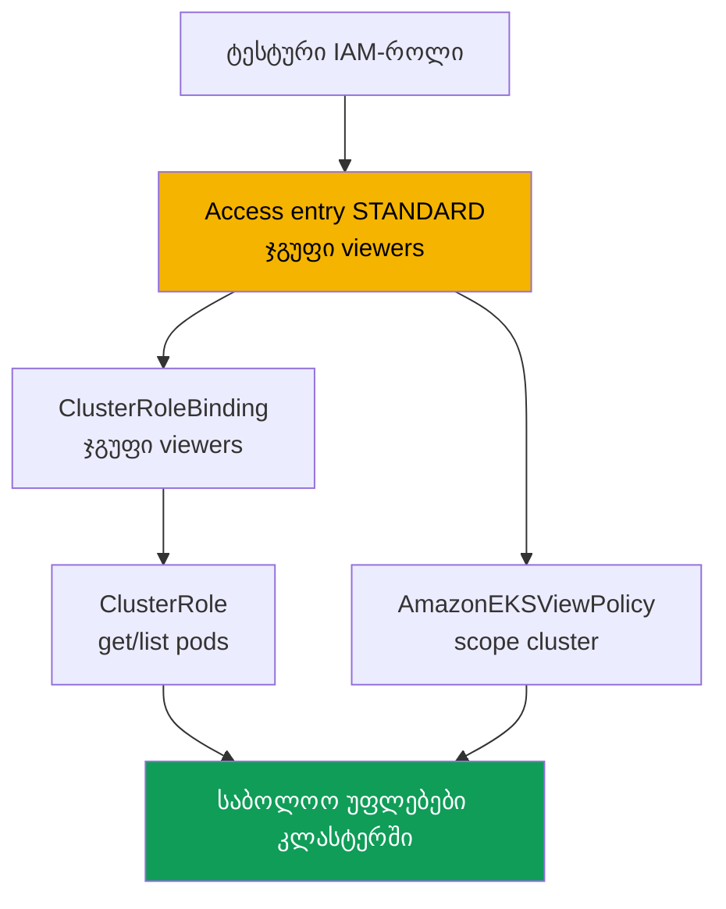
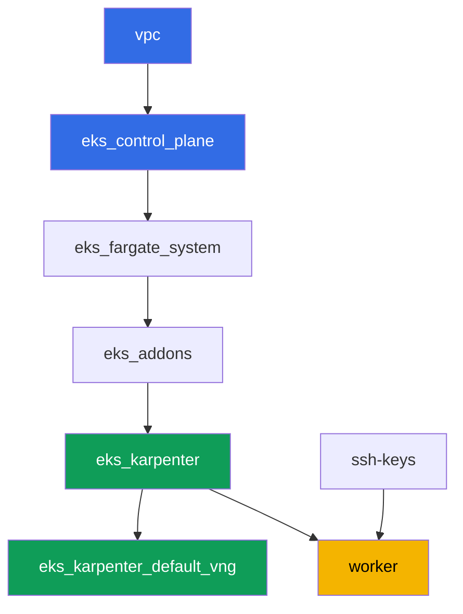

[Русская версия](README_RU.MD) · [Eng version](README.MD) · [Versión en español](README_ES.MD) · [Version française](README_FR.MD) · [Deutsche Version](README_DE.MD) · [繁體中文版](README_TW.MD) · [日本語版](README_JP.MD)

# ლაბა 102 - წვდომა კლასტერზე: IAM და RBAC, access entries და access policies

## აღწერა

კლასტერი შექმნილია (ლაბა 101), და შემდეგი საკითხია - ვინ შედის მასში და რა უფლებებით. ამ
ლაბაში თქვენ ანალიზს უკეთებთ ორი შრის შეხვედრას: აუთენტიფიკაცია IAM-ის მეშვეობით და
ავტორიზაცია RBAC-ის მეშვეობით. თქვენ ამზადებთ მეორე IAM-პრინციპალს, ანიჭებთ მას წვდომას
access entry-ის მეშვეობით, გასცემთ უფლებებს ორი გზით - საკუთარი RBAC-ითა და მზა access
policy-ით, - და პრაქტიკაში ხედავთ განსხვავებას `Unauthorized`-სა (აუთენტიფიკაცია არ
გავიდა) და `Forbidden`-ს (გავიდა, მაგრამ RBAC-მა არ დაუშვა მოქმედება) შორის.

დავალებები დაწერილია production-სტილში: მოკლე დავალება პლუს მიღების კრიტერიუმები.
შემოწმება ავტომატურია, ბრძანებით `check_result`, პლუს რამდენიმე ხელით შესასრულებელი ნაბიჯი
assume-role-ით, რომლებიც თავად უნდა გავიაროთ, რომ განსხვავება ცოცხლად დავინახოთ.

## მიზანი

გავამყაროთ კურსის ამ თავის მასალა:

- [თავი 5. წვდომა კლასტერზე: IAM და RBAC, access entries](../../course/05/ru.md) -
  მიგრაცია aws-auth-იდან

## რას ვქმნით

კლასტერი უკვე დეპლოირებულია როგორც კოდი (როგორც ლაბა 101-ში) და მუშაობს რეჯიმში
`authenticationMode = API`. თქვენ ქმნით მეორე IAM-პრინციპალს და უსტამბებთ მას წვდომას ორი
პარალელური გზით: RBAC access entry-ის ზემოთ და მზა access policy.

| ობიექტი | რა არის ეს | რისთვის ამ ლაბაში |
|--------|---------|-------------------|
| ტესტური IAM-როლი | მეორე პრინციპალი, ასუმებელი მხოლოდ worker-ის როლით | პრინციპალი access entry-ის გადამოწმებისთვის, სხვა ლაბებში უფლებების გარეშე |
| Access entry (`STANDARD`, ჯგუფი `viewers`) | როლის ჩავენება Kubernetes-ჯგუფზე | აკავშირებს IAM-პრინციპალს RBAC-სუბიექტთან |
| `ClusterRole`/`ClusterRoleBinding viewers-pod-reader` | RBAC ჯგუფზე `viewers` | უფლებები `get`/`list` pods-ზე, კლასიკური RBAC access entry-ის ზემოთ |
| ასოციაცია `AmazonEKSViewPolicy` (scope `cluster`) | AWS-ის access policy | მეორე, პარალელური უფლებების წყარო, საკუთარი RBAC-ის გარეშე |
| არტეფაქტები `1/accessconfig.json`, `7/...txt`, `8/...txt` | კონფიგურაციის ასლები და განმარტებები | ვაფიქსირებთ წვდომის რეჯიმს და Unauthorized/Forbidden-ის განსხვავებას |



## ინფრასტრუქტურა

გარემო დეპლოირდება AWS-ში (`eu-central-1`) Terragrunt-ის მეშვეობით, როგორც ლაბა 101-ში.
ლაბის ყოველი დირექტორია ერთი კომპონენტია საკუთარი `terragrunt.hcl`-ით, რომელიც მიმართავს
საერთო მოდულს `terraform/modules/`-ში და აცხადებს დამოკიდებულებებს `dependency`
ბლოკებით. წვდომისთვის ლაბას სპეციალური კომპონენტები არ სჭირდება: კლასტერი უკვე იქმნება
მოდულით `eks_v2_control_plane` (`terraform-aws-modules/eks/aws` v21) რეჯიმში `API`, ხოლო
ყველა დავალება სრულდება `aws eks` CLI-ისა და ჩვეულებრივი RBAC-მანიფესტების მეშვეობით
სამუშაო მანქანიდან.

### მოდულები და დამოკიდებულებები

| დირექტორია (კომპონენტი) | მოდული (`terraform/modules/`) | დამოკიდებულია | რას ქმნის |
|---------------------|-------------------------------|------------|-------------|
| `vpc` | `vpc_v3` | - | VPC `10.10.0.0/16`, საჯარო და პრივატული ქვექსელები ორ AZ-ში, NAT |
| `ssh-keys` | `ssh-keys` | - | SSH-გასაღებების წყვილი სამუშაო მანქანისა და ნოუდებისთვის |
| `eks_control_plane` | `eks_v2_control_plane` | `vpc` | EKS control plane `1.36`, წვდომის რეჯიმი `API`, OIDC |
| `eks_fargate_system` | `eks_v2_fargate` | `vpc`, `eks_control_plane` | Fargate-პროფილი `kube-system`-ისთვის და `karpenter`-ისთვის |
| `eks_addons` | `eks_v2_addons` | `eks_control_plane`, `eks_fargate_system` | დამატებები coredns, kube-proxy, vpc-cni, pod-identity |
| `eks_karpenter` | `eks_v2_karpenter` | `vpc`, `eks_control_plane`, `eks_addons`, `eks_fargate_system` | Karpenter-ის კონტროლერი, ნოუდების IAM-როლი |
| `eks_karpenter_default_vng` | `eks_v2_karpenter_vng` | `vpc`, `eks_control_plane`, `eks_karpenter` | ნაგულისხმევი NodePool `default` და EC2NodeClass AL2023-ზე |
| `worker` | `eks_v2_work_pc` | `ssh-keys`, `vpc`, `eks_control_plane`, `eks_karpenter` | სამუშაო მანქანა kubectl-ით, ტესტებით და `check_result`-ით |

დამოკიდებულებების გრაფი (რაც უფრო ადრე აპლიცირდება, ის ხრიხისკენ ქვემოთაა), ისეთივე,
როგორც ლაბა 101-ში:



### მეორე პრინციპალი და worker-ის უფლებები

Karpenter-ის ნოუდის როლი არ ვარგა "მეორე პრინციპალის" როლისთვის: Karpenter-ის submodule-ი
მისთვის ავტომატურად ქმნის საკუთარ access entry-ს ტიპით `EC2_LINUX`, ხოლო ერთი
IAM-პრინციპალი ორ access entry-ში ერთდროულად ვერ ხვდება. ამიტომ ლაბა ქმნის ცალკე ტესტურ
IAM-როლს პირდაპირ worker-ზე AWS CLI-ის მეშვეობით (კლასტერის terraform-ში ცვლილებების
გარეშე).

Worker-ის როლს (`eks_v2_work_pc/iam.tf`) უკვე ჰქონდა `eks:*` - ეს საკმარისია ყველა ბრძანების
`create-access-entry`, `associate-access-policy` და მსგავსების შესასრულებლად. ტესტური
როლის შესაქმნელად (დავალება 2) worker-მა მიიღო წერტილოვანი უფლებები
`iam:CreateRole`, `iam:GetRole`, `iam:DeleteRole`, `iam:PutRolePolicy` და `sts:AssumeRole`,
შეზღუდული რესურსით `arn:aws:iam::<account>:role/*-test-*` - ანუ worker-ს შეუძლია
მართოს მხოლოდ როლები `-test-`-ის მქონე სახელით და ასუმებოს მხოლოდ ისინი, სხვა რამეზე
თავისთვის უფლებების გაფართოების გარეშე.

## განლაგება

```bash
TASK=102 make run_eks_task
```

განლაგება გრძელდება დაახლოებით 15-20 წუთი. output-ში მოძებნეთ ხაზი SSH-შეერთებით
სამუშაო მანქანასთან და დაუკავშირდით მას. kubectl იქ უკვე კონფიგურირებულია საჭირო
კლასტერზე.

სასარგებლო ბრძანებები სამუშაო მანქანაზე:

```bash
time_left       # რამდენი დრო დარჩა გარემოს
check_result    # გადამოწმება
```

> სტენდის უსაფრთხოება. `env.hcl`-ში ჩართულია `ssh_password_enable = true` და
> `access_cidrs = ["0.0.0.0/0"]` - ეს მოსახერხებელია სასწავლო გარემოსთვის, მაგრამ ასე არ
> უნდა გავხადოთ production-ში. კურსის სტანდარტების მიხედვით სამუშაო მანქანებზე წვდომა
> იხსნება AWS SSM Session Manager-ის მეშვეობით, საჯარო SSH-პორტების გარეთ გამოტანის
> გარეშე, ხოლო `access_cidrs` ვიწროვდება კონკრეტულ მისამართებზე. აქ საჯარო SSH
> დარჩენილია მხოლოდ გაშვების გასამარტივებლად.

## დავალებები

---
|        **1**        | **ინვენტარიზაცია: კლასტერის წვდომის რეჯიმი**                  |
| :-----------------: | :---------------------------------------------------------- |
| რას ვაკეთებთ          | შეინახეთ `aws eks describe-cluster --name <cluster> --query 'cluster.accessConfig'` ფაილში `/var/work/tests/artifacts/1/accessconfig.json`. დაადასტურეთ, რომ `authenticationMode` უდრის `API`-ს. |
| მიღების კრიტერიუმები    | - ფაილი არ არის ცარიელი;<br/>- შეიცავს `"authenticationMode": "API"`. |
---
|        **2**        | **მეორე IAM-პრინციპალი ტესტისთვის**                          |
| :-----------------: | :---------------------------------------------------------- |
| რას ვაკეთებთ          | შექმენით ტესტური IAM-როლი (სახელი უნდა შეიცავდეს `-test-`, მაგალითად `eks-task102-test-viewer`) trust policy-ით, რომელიც `sts:AssumeRole`-ს დაუშვებს მხოლოდ worker-ის როლის ARN-ისთვის. შეინახეთ როლის ARN ფაილში `/var/work/tests/artifacts/2/test_role_arn.txt`. |
| მიღების კრიტერიუმები    | - ფაილი არ არის ცარიელი, შეიცავს როლის ARN-ს სახელში `test`-ით;<br/>- როლი არსებობს (`aws iam get-role`). |
---
|        **3**        | **Access entry ტესტური პრინციპალისთვის**                   |
| :-----------------: | :---------------------------------------------------------- |
| რას ვაკეთებთ          | შექმენით access entry ტიპით `STANDARD` ტესტური როლისთვის, `kubernetesGroups`-ით ტოლი `viewers`, გამოხატული `username`-ის გარეშე (მიეცით EKS-ს, თავად ჩაანაცხოს ის). |
| მიღების კრიტერიუმები    | - `aws eks describe-access-entry` აბრუნებს `type=STANDARD`-ს;<br/>- `kubernetesGroups` შეიცავს `viewers`-ს. |
---
|        **4**        | **RBAC access entry-ის ზემოთ: მხოლოდ pods-ის წაკითხვა**            |
| :-----------------: | :---------------------------------------------------------- |
| რას ვაკეთებთ          | შექმენით `ClusterRole` `viewers-pod-reader` მხოლოდ `get` და `list` უფლებებით `pods`-ზე, და `ClusterRoleBinding` `viewers-pod-reader`, რომელიც მას აკავშირებს ჯგუფთან `viewers`. ეს არის კლასიკური RBAC access entry-ის ზემოთ, access policy-ის გარეშე. |
| მიღების კრიტერიუმები    | - `ClusterRole` აძლევს მხოლოდ `get`/`list`-ს `pods`-ზე (`create`-ის, `delete`-ის გარეშე);<br/>- `ClusterRoleBinding` მიბმულია ჯგუფთან `viewers`. |
---
|        **5**        | **უფლებების ხელით გადამოწმება assume-role-ის მეშვეობით**                  |
| :-----------------: | :---------------------------------------------------------- |
| რას ვაკეთებთ          | worker-იდან გაუშვით `aws sts assume-role --role-arn <test_role_arn> --role-session-name test-viewer-session`, ექსპორტირება გაუკეთეთ დროებით კრედენშალებს და მიიღეთ ცალკე kubeconfig `aws eks update-kubeconfig --alias test-viewer --kubeconfig /tmp/test-viewer.kubeconfig`-ის მეშვეობით. გადაამოწმეთ `kubectl --kubeconfig /tmp/test-viewer.kubeconfig get pods -A` (უნდა გამოვა) და `kubectl --kubeconfig /tmp/test-viewer.kubeconfig create namespace test` (უნდა ჩავარდეს `Forbidden`-ით). შეინახეთ ორივე ბრძანება და მათი შედეგი ფაილში `/var/work/tests/artifacts/5/rbac_check.txt`. |
| მიღების კრიტერიუმები    | - ფაილი არ არის ცარიელი, ახსენებს `get pods`-ს და `Forbidden`-ს. |
---
|        **6**        | **Access policy access entry-ის ზემოთ**                       |
| :-----------------: | :---------------------------------------------------------- |
| რას ვაკეთებთ          | ტესტურ როლთან ასოცირებული გახადეთ access policy `AmazonEKSViewPolicy` scope-ით `cluster`. დარწმუნდით `aws eks list-associated-access-policies`-ის მეშვეობით, რომ ასოციაცია არსებობს. |
| მიღების კრიტერიუმები    | - `list-associated-access-policies` შეიცავს `AmazonEKSViewPolicy`-ს `accessScope.type=cluster`-ით. |
---
|        **7**        | **დიაგნოსტიკა: Unauthorized წინააღმდეგ Forbidden-ის**              |
| :-----------------: | :---------------------------------------------------------- |
| რას ვაკეთებთ          | შექმენით კიდევ ერთი ტესტური როლი (სახელი `-test-`-ით) ერთი access entry-ის გარეშე, მიიღეთ მისი kubeconfig assume-role-ის მეშვეობით, ისევე როგორც დავალება 5-ში, და გაუშვით `kubectl get pods -A` - დარწმუნდით, რომ პასუხი არის `Unauthorized`, არა `Forbidden`, რადგან კლასტერს ეს ARN საერთოდ არ ცნობს (გადაამოწმეთ `aws eks list-access-entries`-ის მეშვეობით). შეადარეთ დავალება 5-ის `Forbidden`-ს. შეინახეთ განსხვავების განმარტება ფაილში `/var/work/tests/artifacts/7/unauthorized_vs_forbidden.txt`, ორივე შეცდომისა და ბრძანების `list-access-entries` ხსენებით. |
| მიღების კრიტერიუმები    | - ფაილი არ არის ცარიელი, ახსენებს `Unauthorized`-ს, `Forbidden`-ს და `list-access-entries`-ს. |
---
|        **8**        | **წვდომის გაუქმება: access entry-ის წაშლა და აღდგენა**   |
| :-----------------: | :---------------------------------------------------------- |
| რას ვაკეთებთ          | წაშალეთ დავალება 3-დან ტესტური როლის access entry (`aws eks delete-access-entry`), გადამოწმეთ `test-viewer.kubeconfig`-ის მეშვეობით, რომ წვდომა გაქრა (`Unauthorized`), შემდეგ ხელახლა შექმენით ჩანაწერი იმავე ჯგუფით `viewers`, რომ გარემო დარჩეს სამუშაო მდგომარეობაში გადამოწმებისთვის. შეინახეთ ექსპერიმენტის მსვლელობა ფაილში `/var/work/tests/artifacts/8/delete_recreate.txt`. |
| მიღების კრიტერიუმები    | - ტესტური როლის access entry ხელახლა არსებობს, ტიპი `STANDARD`;<br/>- ფაილი ახსენებს `Unauthorized`-ს, `delete-access-entry`-ს და `create-access-entry`-ს. |
---

## შედეგის შემოწმება

სამუშაო მანქანაზე გაუშვით ავტომატური შემოწმება:

```bash
check_result
```

სკრიპტი გაუშვებს ტესტებს და გამოაჩენს შესრულებული დავალებების პროცენტს. დავალებები 5, 7
და 8 საჭიროებენ ცოცხალ assume-role-ს დროებითი კრედენშალებით, ამიტომ ავტოტესტი ამოწმებს
მხოლოდ საბოლოო კონფიგურაციას (access entry, RBAC, access policy) და არტეფაქტებს
განმარტებით - `Unauthorized`/`Forbidden`-ის ნამდვილი განსხვავება საკუთარი ხელით უნდა
დაინახოთ გადაწყვეტიდან ბრძანებების მიხედვით.

## გადაწყვეტა

ეტალონური გადაწყვეტა: [worker/files/solutions/1_GE.MD](worker/files/solutions/1_GE.MD)

## კლასტერისა და რესურსების წაშლა

> **ჯერ მოხსენით ტესტური IAM-როლები.** როლები `eks-task102-test-viewer` და
> `eks-task102-test-nobody` თქვენ შექმენით ხელით AWS CLI-ის მეშვეობით, terraform-ის
> state-ში ისინი არ არსებობს, და `destroy` მათ არ შეეხება. IAM-როლები ცხოვრობენ
> რეგიონისა და კლასტერის გარეთ, ამიტომ ისინი დარჩებიან ანგარიშში, ხოლო ლაბის ხელახალი
> გაშვების დროს `aws iam create-role` ჩავარდება `EntityAlreadyExists`-ით.
> Access entries ცალკე წაშლა სავალდებულო არ არის (ისინი ქრებიან კლასტერთან ერთად),
> მაგრამ თუ ლაბის ხელახლა გავლა გსურთ იმავე კლასტერზე - მოხსენით ისინიც.

```bash
CLUSTER=$(aws eks list-clusters --query 'clusters[0]' --output text)

for ROLE in eks-task102-test-viewer eks-task102-test-nobody; do
  ARN=$(aws iam get-role --role-name "$ROLE" --query 'Role.Arn' --output text 2>/dev/null) || continue
  # ამ როლის access entry (საჭირო, თუ ლაბას ხელახლა გაივლით)
  aws eks delete-access-entry --cluster-name "$CLUSTER" --principal-arn "$ARN" 2>/dev/null
  # ინლაინ და მიბმული პოლიტიკები, თუ დაამატეთ ისინი
  for P in $(aws iam list-role-policies --role-name "$ROLE" --query 'PolicyNames' --output text); do
    aws iam delete-role-policy --role-name "$ROLE" --policy-name "$P"
  done
  for P in $(aws iam list-attached-role-policies --role-name "$ROLE" \
      --query 'AttachedPolicies[].PolicyArn' --output text); do
    aws iam detach-role-policy --role-name "$ROLE" --policy-arn "$P"
  done
  aws iam delete-role --role-name "$ROLE"
done
```

> **მოხსენით დატვირთვა.** თუ ლაბის პოდებმა Karpenter-ს ააწიეს EC2-ნოუდი, წაშალეთ
> დატვირთვა და დაელოდეთ, სანამ ნოუდი წავიდოდეს: სხვაგვარად VPC CNI-ს არ ეყოფა დროდ
> საკუთარი მეორადი ENI-ების მოცილება, დაუპატრონებელი ENI დარჩება `available`
> მდგომარეობაში, დაიჭერს ნოუდების security group-ს, და `destroy` ჩერდება
> `module.eks.aws_security_group.node[0]: Still destroying...`-ზე.

```bash
while kubectl get nodes --no-headers 2>/dev/null | grep -qv fargate; do
  echo "Karpenter-ის EC2-ნოუდი ჯერ ისევ ცოცხალია, ველოდებით..."; sleep 15
done
```

```bash
TASK=102 make delete_eks_task
```

თუ `destroy` მაინც შედგა ნოუდების security group-ზე, მოძებნეთ და წაშალეთ დაუპატრონებელი ENI:

```bash
aws ec2 describe-network-interfaces --filters Name=status,Values=available \
  --query 'NetworkInterfaces[].[NetworkInterfaceId,Description,Groups[0].GroupName]' --output table
aws ec2 delete-network-interface --network-interface-id <eni-id>
```
