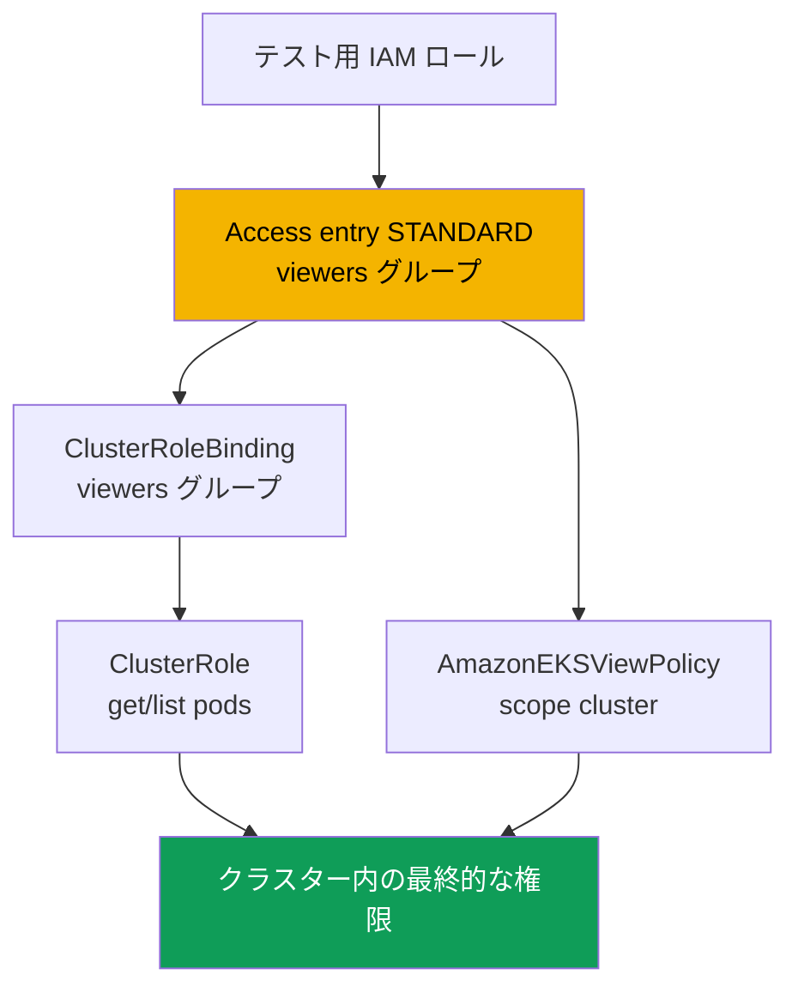
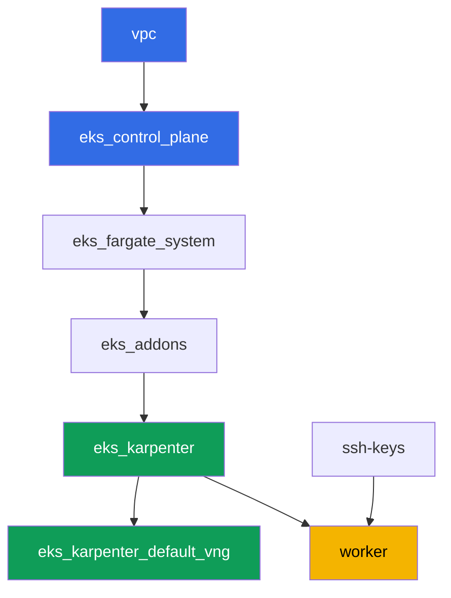

[Русская версия](README_RU.MD) · [Eng version](README.MD) · [Versión en español](README_ES.MD) · [Version française](README_FR.MD) · [Deutsche Version](README_DE.MD) · [ქართული ვერსია](README_GE.MD) · [繁體中文版](README_TW.MD)

# ラボ 102 - クラスターアクセス:IAM と RBAC、access entries と access policies

## 説明

クラスターは作成済みです(ラボ 101)。次の問いは、誰がどんな権限でクラスターに入るか
です。このラボでは、2 つのレイヤーの接点を掘り下げます:IAM による認証と RBAC による
認可です。第二の IAM プリンシパルを用意し、access entry を通じてアクセスを与え、2 つの
方法(自分の RBAC と用意された access policy)で権限を配布し、`Unauthorized`(認証が
失敗した)と `Forbidden`(認証は通ったが RBAC がそのアクションを許可しなかった)の
違いを実際に確認します。

タスクは production スタイルで書かれています:短い課題文とアクセプタンス基準。検証は
`check_result` コマンドによって自動的に行われますが、それに加えて、その違いをその場で
確認するために自分の手で実行する必要のある assume-role の手動ステップがいくつかあり
ます。

## 目的

コースの以下の章の内容を定着させます:

- [第 5 章。クラスターアクセス:IAM と RBAC、access entries](../../course/05/jp.md) -
  aws-auth からの移行

## 作成するもの

クラスターは既にコードとしてデプロイされており(ラボ 101 と同様)、`authenticationMode
= API` モードで動作しています。第二の IAM プリンシパルを作成し、2 つの並行した経路で
そのアクセスを設定します:access entry の上に乗せた RBAC と、用意された access policy
です。

| オブジェクト | 何か | このラボでの目的 |
|--------|---------|-------------------|
| テスト用 IAM ロール | 第二のプリンシパル、worker ロールのみが assume 可能 | 他のラボの権限に手を出さずに access entry をテストするためのプリンシパル |
| Access entry(`STANDARD`、`viewers` グループ) | ロールを Kubernetes グループに対応付ける | IAM プリンシパルを RBAC のサブジェクトに結び付ける |
| `ClusterRole`/`ClusterRoleBinding viewers-pod-reader` | `viewers` グループ用の RBAC | pods への `get`/`list` 権限、access entry の上に乗せた従来型 RBAC |
| `AmazonEKSViewPolicy` の関連付け(scope `cluster`) | AWS の access policy | 独自の RBAC を持たない、第二の並行した権限ソース |
| アーティファクト `1/accessconfig.json`、`7/...txt`、`8/...txt` | 設定のスナップショットと説明 | アクセスモードと Unauthorized/Forbidden の違いを記録する |



## インフラストラクチャ

環境は Terragrunt によって AWS(`eu-central-1`)にデプロイされます。ラボ 101 と同様
です。ラボの各ディレクトリは 1 つのコンポーネントであり、それぞれ独自の
`terragrunt.hcl` を持ち、`terraform/modules/` の共有モジュールを参照し、
`dependency` ブロックで依存関係を宣言します。このラボはアクセスのための特別なコンポー
ネントを必要としません:クラスターは既に `eks_v2_control_plane` モジュール
(`terraform-aws-modules/eks/aws` v21)によって `API` モードで作成されており、すべて
のタスクは `aws eks` CLI とワーカーマシンからの通常の RBAC マニフェストを通じて実行さ
れます。

### モジュールと依存関係

| ディレクトリ(コンポーネント) | モジュール(`terraform/modules/`) | 依存先 | 作成されるもの |
|---------------------|-------------------------------|------------|-------------|
| `vpc` | `vpc_v3` | - | VPC `10.10.0.0/16`、2 つの AZ にあるパブリックとプライベートのサブネット、NAT |
| `ssh-keys` | `ssh-keys` | - | ワーカーマシンとノード用の SSH キーペア |
| `eks_control_plane` | `eks_v2_control_plane` | `vpc` | EKS control plane `1.36`、アクセスモード `API`、OIDC |
| `eks_fargate_system` | `eks_v2_fargate` | `vpc`、`eks_control_plane` | `kube-system` と `karpenter` 用の Fargate profile |
| `eks_addons` | `eks_v2_addons` | `eks_control_plane`、`eks_fargate_system` | coredns、kube-proxy、vpc-cni、pod-identity のアドオン |
| `eks_karpenter` | `eks_v2_karpenter` | `vpc`、`eks_control_plane`、`eks_addons`、`eks_fargate_system` | Karpenter コントローラ、ノードの IAM ロール |
| `eks_karpenter_default_vng` | `eks_v2_karpenter_vng` | `vpc`、`eks_control_plane`、`eks_karpenter` | デフォルトの NodePool `default` と AL2023 上の EC2NodeClass |
| `worker` | `eks_v2_work_pc` | `ssh-keys`、`vpc`、`eks_control_plane`、`eks_karpenter` | kubectl、テスト、`check_result` を備えたワーカーマシン |

依存関係グラフ(先に適用されるものほど矢印の下側にある)、ラボ 101 と同様です:



### 第二のプリンシパルと worker の権限

Karpenter のノードロールは「第二のプリンシパル」には向きません:Karpenter の
submodule はデフォルトでこのロール用に `EC2_LINUX` タイプの access entry を自動作成
し、1 つの IAM プリンシパルは同時に 2 つの access entry に属することができません。その
ためこのラボでは、worker から AWS CLI を使って別のテスト用 IAM ロールを作成します
(クラスターの terraform には変更を加えません)。

worker ロール(`eks_v2_work_pc/iam.tf`)は既に `eks:*` を持っていました - これは
`create-access-entry`、`associate-access-policy` などすべてのコマンドに十分です。テス
ト用ロールを作成するため(タスク 2)、worker には限定的な `iam:CreateRole`、
`iam:GetRole`、`iam:DeleteRole`、`iam:PutRolePolicy` および `sts:AssumeRole` の権限が
付与され、リソース `arn:aws:iam::<account>:role/*-test-*` に限定されています - つまり
worker は名前に `-test-` を含むロールしか管理できず、そのロールしか assume できず、
それ以外の権限を自分自身に広げることはできません。

## デプロイ

```bash
TASK=102 make run_eks_task
```

デプロイには約 15-20 分かかります。出力の中からワーカーマシンへの SSH 接続の行を見つけ
て接続してください。そこでは kubectl が既に正しいクラスタ向けに設定されています。

ワーカーマシン上で使える便利なコマンド:

```bash
time_left       # 環境の残り時間
check_result    # 解答の確認
```

> 検証環境のセキュリティについて。`env.hcl` では `ssh_password_enable = true` と
> `access_cidrs = ["0.0.0.0/0"]` が有効になっています。学習用環境としては便利ですが、
> 本番環境ではこのようにしてはいけません。コースの標準によれば、ワーカーマシンへの
> アクセスは公開 SSH ポートを外に出さずに AWS SSM Session Manager を経由して開き、
> `access_cidrs` は具体的なアドレスに絞り込みます。ここでは、セットアップを簡単にする
> ためだけに公開 SSH を残しています。

## タスク

---
|        **1**        | **インベントリ:クラスターのアクセスモード**                  |
| :-----------------: | :---------------------------------------------------------- |
| やること          | `aws eks describe-cluster --name <cluster> --query 'cluster.accessConfig'` の出力をファイル `/var/work/tests/artifacts/1/accessconfig.json` に保存してください。`authenticationMode` が `API` であることを確認してください。 |
| アクセプタンス基準    | - ファイルが空でないこと;<br/>- `"authenticationMode": "API"` を含むこと。 |
---
|        **2**        | **テスト用の第二 IAM プリンシパル**                          |
| :-----------------: | :---------------------------------------------------------- |
| やること          | テスト用 IAM ロール(名前に `-test-` を含む必要があります、例:`eks-task102-test-viewer`)を作成してください。trust policy は worker ロールの ARN に対してのみ `sts:AssumeRole` を許可するものにしてください。ロールの ARN をファイル `/var/work/tests/artifacts/2/test_role_arn.txt` に保存してください。 |
| アクセプタンス基準    | - ファイルが空でなく、名前に `test` を含むロール ARN を含むこと;<br/>- ロールが存在すること(`aws iam get-role`)。 |
---
|        **3**        | **テスト用プリンシパルの access entry**                   |
| :-----------------: | :---------------------------------------------------------- |
| やること          | テスト用ロールに対して `STANDARD` タイプの access entry を作成してください。`kubernetesGroups` は `viewers` とし、明示的な `username` は指定しないでください(EKS 自身に設定させます)。 |
| アクセプタンス基準    | - `aws eks describe-access-entry` が `type=STANDARD` を返すこと;<br/>- `kubernetesGroups` に `viewers` が含まれること。 |
---
|        **4**        | **access entry の上に乗せる RBAC:pod の読み取りのみ**            |
| :-----------------: | :---------------------------------------------------------- |
| やること          | `pods` に対して `get` と `list` のみの権限を持つ `ClusterRole` `viewers-pod-reader` を作成し、それを `viewers` グループに結び付ける `ClusterRoleBinding` `viewers-pod-reader` を作成してください。これは access policy を使わない、access entry の上に乗せる従来型の RBAC です。 |
| アクセプタンス基準    | - `ClusterRole` が `pods` への `get`/`list` のみを許可すること(`create`、`delete` は含まない);<br/>- `ClusterRoleBinding` が `viewers` グループに結び付いていること。 |
---
|        **5**        | **assume-role による権限の手動確認**                  |
| :-----------------: | :---------------------------------------------------------- |
| やること          | worker から `aws sts assume-role --role-arn <test_role_arn> --role-session-name test-viewer-session` を実行し、一時的な認証情報をエクスポートして、`aws eks update-kubeconfig --alias test-viewer --kubeconfig /tmp/test-viewer.kubeconfig` で別の kubeconfig を取得してください。`kubectl --kubeconfig /tmp/test-viewer.kubeconfig get pods -A`(成功するはず)と `kubectl --kubeconfig /tmp/test-viewer.kubeconfig create namespace test`(`Forbidden` で失敗するはず)を確認してください。両方のコマンドとその結果をファイル `/var/work/tests/artifacts/5/rbac_check.txt` に保存してください。 |
| アクセプタンス基準    | - ファイルが空でなく、`get pods` と `Forbidden` に言及していること。 |
---
|        **6**        | **access entry の上に乗せる access policy**                       |
| :-----------------: | :---------------------------------------------------------- |
| やること          | テスト用ロールに、scope `cluster` の access policy `AmazonEKSViewPolicy` を関連付けてください。`aws eks list-associated-access-policies` でその関連付けが存在することを確認してください。 |
| アクセプタンス基準    | - `list-associated-access-policies` が `accessScope.type=cluster` を持つ `AmazonEKSViewPolicy` を含むこと。 |
---
|        **7**        | **診断:Unauthorized 対 Forbidden**              |
| :-----------------: | :---------------------------------------------------------- |
| やること          | access entry を全く持たない別のテスト用ロール(名前に `-test-` を含む)を作成し、タスク 5 と同じ方法で assume-role によりその kubeconfig を取得し、`kubectl get pods -A` を実行してください - クラスターがその ARN を全く知らないため、応答が `Forbidden` ではなく `Unauthorized` であることを確認してください(`aws eks list-access-entries` で確認できます)。タスク 5 の `Forbidden` と比較してください。両方のエラーと `list-access-entries` コマンドについて言及した説明をファイル `/var/work/tests/artifacts/7/unauthorized_vs_forbidden.txt` に保存してください。 |
| アクセプタンス基準    | - ファイルが空でなく、`Unauthorized`、`Forbidden`、`list-access-entries` に言及していること。 |
---
|        **8**        | **アクセスの取り消し:access entry の削除と復元**   |
| :-----------------: | :---------------------------------------------------------- |
| やること          | タスク 3 のテスト用ロールの access entry を削除し(`aws eks delete-access-entry`)、`test-viewer.kubeconfig` でアクセスが失われたこと(`Unauthorized`)を確認してください。その後、同じ `viewers` グループで entry を再作成し、環境を採点可能な状態に戻してください。実験の経過をファイル `/var/work/tests/artifacts/8/delete_recreate.txt` に保存してください。 |
| アクセプタンス基準    | - テスト用ロールの access entry が再び存在し、タイプが `STANDARD` であること;<br/>- ファイルが `Unauthorized`、`delete-access-entry`、`create-access-entry` に言及していること。 |
---

## 結果の確認

ワーカーマシン上で自動チェックを実行してください:

```bash
check_result
```

スクリプトがテストを実行し、完了したタスクの割合を表示します。タスク 5、7、8 は一時的な
認証情報を使った実際の assume-role を必要とするため、自動チェックは最終的な設定
(access entry、RBAC、access policy)と説明用アーティファクトのみを検証します - 実際の
`Unauthorized`/`Forbidden` の違いは、解答のコマンドを自分で実行して確認する必要があり
ます。

## 解答

参考解答:[worker/files/solutions/1_JP.MD](worker/files/solutions/1_JP.MD)

## クラスターとリソースの削除

> **まずテスト用 IAM ロールを削除してください。** ロール `eks-task102-test-viewer` と
> `eks-task102-test-nobody` は AWS CLI で手動作成したものであり、terraform の state に
> は存在せず、`destroy` はこれらに触れません。IAM ロールはリージョンの外、クラスターの
> 外に存在するため、アカウントに残り続け、次にラボを実行すると `aws iam create-role` が
> `EntityAlreadyExists` で失敗します。access entry を個別に削除することは必須ではあり
> ません(クラスターとともに消えます)が、同じクラスターでラボをやり直したい場合は、
> これらも削除してください。

```bash
CLUSTER=$(aws eks list-clusters --query 'clusters[0]' --output text)

for ROLE in eks-task102-test-viewer eks-task102-test-nobody; do
  ARN=$(aws iam get-role --role-name "$ROLE" --query 'Role.Arn' --output text 2>/dev/null) || continue
  # このロールの access entry(ラボをやり直す場合に必要)
  aws eks delete-access-entry --cluster-name "$CLUSTER" --principal-arn "$ARN" 2>/dev/null
  # 追加していた場合の inline / attached ポリシー
  for P in $(aws iam list-role-policies --role-name "$ROLE" --query 'PolicyNames' --output text); do
    aws iam delete-role-policy --role-name "$ROLE" --policy-name "$P"
  done
  for P in $(aws iam list-attached-role-policies --role-name "$ROLE" \
      --query 'AttachedPolicies[].PolicyArn' --output text); do
    aws iam detach-role-policy --role-name "$ROLE" --policy-arn "$P"
  done
  aws iam delete-role --role-name "$ROLE"
done
```

> **ワークロードを削除してください。** ラボの Pod によって Karpenter が EC2 ノードを
> 立ち上げた場合、ワークロードを削除し、ノードが消えるのを待ってください:そうしない
> と VPC CNI がセカンダリ ENI を削除する時間がなく、孤立した ENI が `available` 状態の
> まま残り、ノードの security group を保持し続け、`destroy` が
> `module.eks.aws_security_group.node[0]: Still destroying...` で止まってしまいます。

```bash
while kubectl get nodes --no-headers 2>/dev/null | grep -qv fargate; do
  echo "Karpenter の EC2 ノードはまだ残っています、待機中..."; sleep 15
done
```

```bash
TASK=102 make delete_eks_task
```

それでも `destroy` が security group で止まる場合は、孤立した ENI を見つけて削除して
ください:

```bash
aws ec2 describe-network-interfaces --filters Name=status,Values=available \
  --query 'NetworkInterfaces[].[NetworkInterfaceId,Description,Groups[0].GroupName]' --output table
aws ec2 delete-network-interface --network-interface-id <eni-id>
```
