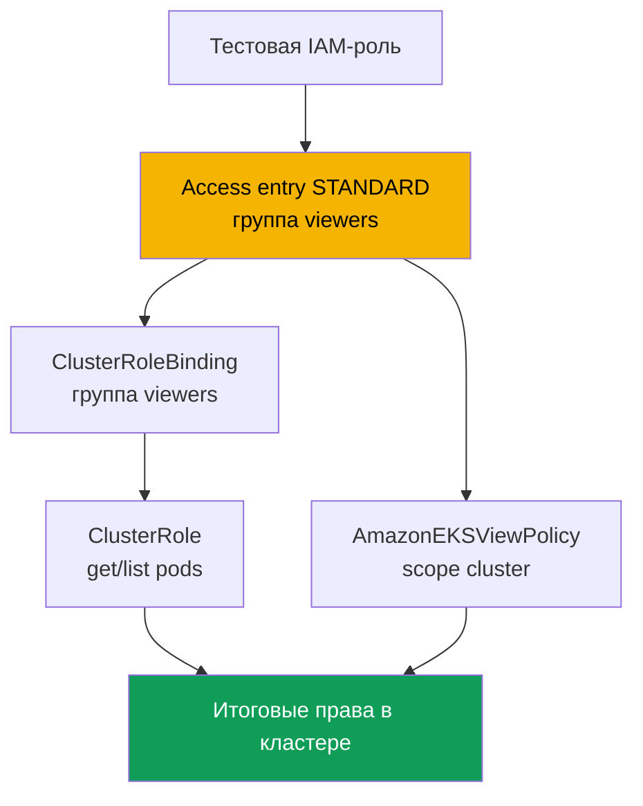
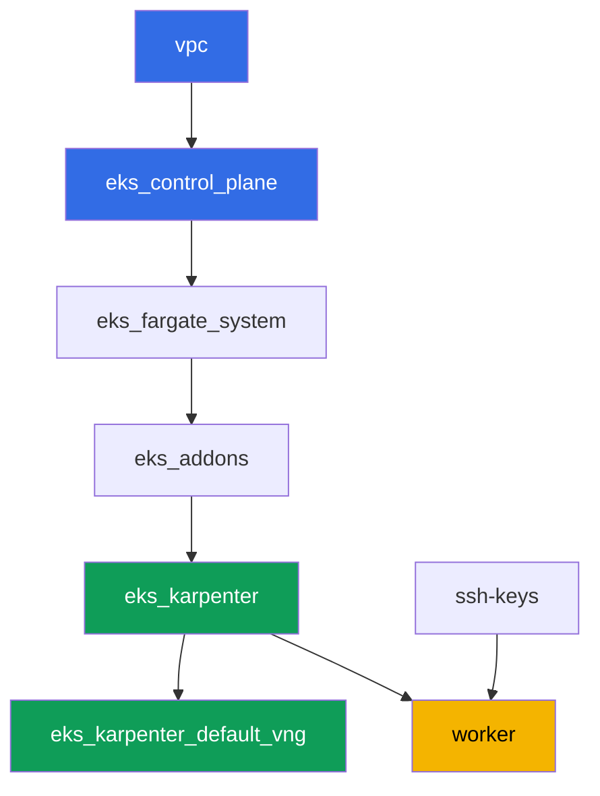

# Лаба 102 - Доступ к кластеру: IAM и RBAC, access entries и access policies

## Описание

Кластер создан (лаба 101), и следующий вопрос - кто в него войдёт и с какими правами. В
этой лабе вы разбираете стык двух слоёв: аутентификацию через IAM и авторизацию через
RBAC. Вы заводите второй IAM-принципал, даёте ему доступ через access entry, выдаёте права
двумя способами - своим RBAC и готовой access policy, - и на практике видите разницу между
`Unauthorized` (аутентификация не прошла) и `Forbidden` (прошла, но RBAC не разрешил
действие).

Задания в продакшн-стиле: короткая постановка плюс критерии приёмки. Проверка -
автоматическая, командой `check_result`, плюс несколько ручных шагов с assume-role, которые
нужно выполнить самому, чтобы увидеть разницу живьём.

## Цель

Закрепить материал главы курса:

- [Глава 5. Доступ к кластеру: IAM и RBAC, access entries](../../course/05/ru.md) -
  миграция с aws-auth

## Что мы создаём

Кластер уже развёрнут как код (как в лабе 101) и работает в режиме `authenticationMode =
API`. Вы создаёте второй IAM-принципал и настраиваете ему доступ двумя параллельными
путями: RBAC поверх access entry и готовую access policy.

| Объект | Что это | Зачем в этой лабе |
|--------|---------|-------------------|
| Тестовая IAM-роль | второй принципал, assumable только ролью worker | принципал для проверки access entry без прав в других лабах |
| Access entry (`STANDARD`, группа `viewers`) | отображение роли в Kubernetes-группу | связывает IAM-принципал с RBAC-субъектом |
| `ClusterRole`/`ClusterRoleBinding viewers-pod-reader` | RBAC на группу `viewers` | права `get`/`list` на pods, классический RBAC поверх access entry |
| Ассоциация `AmazonEKSViewPolicy` (scope `cluster`) | access policy AWS | второй, параллельный источник прав, без своего RBAC |
| Артефакты `1/accessconfig.json`, `7/...txt`, `8/...txt` | срезы конфигурации и объяснения | фиксируем режим доступа и разницу Unauthorized/Forbidden |



## Инфраструктура

Окружение разворачивается в AWS (`eu-central-1`) через Terragrunt, как в лабе 101. Каждый
каталог лабы - это один компонент со своим `terragrunt.hcl`, который ссылается на общий
модуль в `terraform/modules/` и объявляет зависимости через блоки `dependency`. Специальных
компонентов для доступа лаба не требует: кластер уже создаётся модулем
`eks_v2_control_plane` (`terraform-aws-modules/eks/aws` v21) в режиме `API`, а все задания
выполняются через `aws eks` CLI и обычные манифесты RBAC с рабочей машины.

### Модули и зависимости

| Каталог (компонент) | Модуль (`terraform/modules/`) | Зависит от | Что создаёт |
|---------------------|-------------------------------|------------|-------------|
| `vpc` | `vpc_v3` | - | VPC `10.10.0.0/16`, публичные и приватные подсети в двух AZ, NAT |
| `ssh-keys` | `ssh-keys` | - | пара SSH-ключей для рабочей машины и нод |
| `eks_control_plane` | `eks_v2_control_plane` | `vpc` | control plane EKS `1.36`, режим доступа `API`, OIDC |
| `eks_fargate_system` | `eks_v2_fargate` | `vpc`, `eks_control_plane` | Fargate-профиль для `kube-system` и `karpenter` |
| `eks_addons` | `eks_v2_addons` | `eks_control_plane`, `eks_fargate_system` | аддоны coredns, kube-proxy, vpc-cni, pod-identity |
| `eks_karpenter` | `eks_v2_karpenter` | `vpc`, `eks_control_plane`, `eks_addons`, `eks_fargate_system` | контроллер Karpenter, IAM-роль нод |
| `eks_karpenter_default_vng` | `eks_v2_karpenter_vng` | `vpc`, `eks_control_plane`, `eks_karpenter` | дефолтный NodePool `default` и EC2NodeClass на AL2023 |
| `worker` | `eks_v2_work_pc` | `ssh-keys`, `vpc`, `eks_control_plane`, `eks_karpenter` | рабочая машина с kubectl, тестами и `check_result` |

Граф зависимостей (что применяется раньше, то ниже по стрелке), такой же, как в лабе 101:



### Второй принципал и права worker

Роль ноды Karpenter не подходит на роль "второго принципала": submodule Karpenter создаёт
для неё собственную access entry типа `EC2_LINUX` автоматически, а один IAM-принципал не
может быть в двух access entry. Поэтому лаба создаёт отдельную тестовую IAM-роль прямо на
worker через AWS CLI (без изменений в terraform кластера).

Роль worker (`eks_v2_work_pc/iam.tf`) уже имела `eks:*` - этого достаточно для всех команд
`create-access-entry`, `associate-access-policy` и подобных. Для создания тестовой роли
(задание 2) worker получил точечные права `iam:CreateRole`, `iam:GetRole`, `iam:DeleteRole`,
`iam:PutRolePolicy` и `sts:AssumeRole`, ограниченные ресурсом
`arn:aws:iam::<account>:role/*-test-*` - то есть worker может управлять только ролями с
`-test-` в имени и ассьюмить только их, не расширяя себе прав на что-либо ещё.

## Развёртывание

```bash
TASK=102 make run_eks_task
```

Развёртывание занимает примерно 15-20 минут. В выводе найдите строку с SSH-подключением к
рабочей машине и подключитесь к ней. kubectl там уже настроен на нужный кластер.

Полезные команды на рабочей машине:

```bash
time_left       # сколько осталось времени окружения
check_result    # проверить решение
```

> Безопасность стенда. В `env.hcl` включены `ssh_password_enable = true` и
> `access_cidrs = ["0.0.0.0/0"]` - это удобно для учебного окружения, но так делать в
> продакшене нельзя. По стандартам курса доступ к рабочим машинам открывают через AWS SSM
> Session Manager без публичных SSH-портов наружу, а `access_cidrs` сужают до конкретных
> адресов. Здесь публичный SSH оставлен только ради простоты запуска.

## Задания

---
|        **1**        | **Инвентаризация: режим доступа кластера**                  |
| :-----------------: | :---------------------------------------------------------- |
| Что делаем          | Сохраните `aws eks describe-cluster --name <cluster> --query 'cluster.accessConfig'` в файл `/var/work/tests/artifacts/1/accessconfig.json`. Подтвердите, что `authenticationMode` равен `API`. |
| Критерии приёмки    | - файл не пуст;<br/>- содержит `"authenticationMode": "API"`. |
---
|        **2**        | **Второй IAM-принципал для теста**                          |
| :-----------------: | :---------------------------------------------------------- |
| Что делаем          | Создайте тестовую IAM-роль (имя должно содержать `-test-`, например `eks-task102-test-viewer`) с trust policy, разрешающей `sts:AssumeRole` только ARN роли worker. Сохраните ARN роли в файл `/var/work/tests/artifacts/2/test_role_arn.txt`. |
| Критерии приёмки    | - файл не пуст, содержит ARN роли с `test` в имени;<br/>- роль существует (`aws iam get-role`). |
---
|        **3**        | **Access entry для тестового принципала**                   |
| :-----------------: | :---------------------------------------------------------- |
| Что делаем          | Создайте access entry типа `STANDARD` для тестовой роли с `kubernetesGroups` равным `viewers`, без явного `username` (пусть EKS подставит его сам). |
| Критерии приёмки    | - `aws eks describe-access-entry` возвращает `type=STANDARD`;<br/>- `kubernetesGroups` содержит `viewers`. |
---
|        **4**        | **RBAC поверх access entry: только чтение подов**            |
| :-----------------: | :---------------------------------------------------------- |
| Что делаем          | Создайте `ClusterRole` `viewers-pod-reader` с правами только `get` и `list` на `pods`, и `ClusterRoleBinding` `viewers-pod-reader`, привязывающий его к группе `viewers`. Это классический RBAC поверх access entry, без access policy. |
| Критерии приёмки    | - `ClusterRole` даёт только `get`/`list` на `pods` (без `create`, `delete`);<br/>- `ClusterRoleBinding` привязан к группе `viewers`. |
---
|        **5**        | **Ручная проверка прав через assume-role**                  |
| :-----------------: | :---------------------------------------------------------- |
| Что делаем          | С worker выполните `aws sts assume-role --role-arn <test_role_arn> --role-session-name test-viewer-session`, экспортируйте временные креды и получите отдельный kubeconfig через `aws eks update-kubeconfig --alias test-viewer --kubeconfig /tmp/test-viewer.kubeconfig`. Проверьте `kubectl --kubeconfig /tmp/test-viewer.kubeconfig get pods -A` (должно сработать) и `kubectl --kubeconfig /tmp/test-viewer.kubeconfig create namespace test` (должно провалиться с `Forbidden`). Сохраните обе команды и их результат в файл `/var/work/tests/artifacts/5/rbac_check.txt`. |
| Критерии приёмки    | - файл не пуст, упоминает `get pods` и `Forbidden`. |
---
|        **6**        | **Access policy поверх access entry**                       |
| :-----------------: | :---------------------------------------------------------- |
| Что делаем          | Ассоциируйте с тестовой ролью access policy `AmazonEKSViewPolicy` со scope `cluster`. Убедитесь через `aws eks list-associated-access-policies`, что ассоциация есть. |
| Критерии приёмки    | - `list-associated-access-policies` содержит `AmazonEKSViewPolicy` с `accessScope.type=cluster`. |
---
|        **7**        | **Диагностика: Unauthorized против Forbidden**              |
| :-----------------: | :---------------------------------------------------------- |
| Что делаем          | Заведите ещё одну тестовую роль (имя с `-test-`) без единой access entry, получите её kubeconfig через assume-role так же, как в задании 5, и выполните `kubectl get pods -A` - убедитесь, что ответ `Unauthorized`, а не `Forbidden`, потому что кластер вообще не знает этот ARN (проверьте через `aws eks list-access-entries`). Сравните с `Forbidden` из задания 5. Сохраните объяснение разницы в файл `/var/work/tests/artifacts/7/unauthorized_vs_forbidden.txt`, упомянув обе ошибки и команду `list-access-entries`. |
| Критерии приёмки    | - файл не пуст, упоминает `Unauthorized`, `Forbidden` и `list-access-entries`. |
---
|        **8**        | **Отзыв доступа: удаление и восстановление access entry**   |
| :-----------------: | :---------------------------------------------------------- |
| Что делаем          | Удалите access entry тестовой роли из задания 3 (`aws eks delete-access-entry`), проверьте через `test-viewer.kubeconfig`, что доступ пропал (`Unauthorized`), затем создайте запись снова с той же группой `viewers`, чтобы окружение осталось в рабочем состоянии для проверки. Сохраните ход эксперимента в файл `/var/work/tests/artifacts/8/delete_recreate.txt`. |
| Критерии приёмки    | - access entry тестовой роли снова существует, тип `STANDARD`;<br/>- файл упоминает `Unauthorized`, `delete-access-entry` и `create-access-entry`. |
---

## Проверка результата

На рабочей машине запустите автоматическую проверку:

```bash
check_result
```

Скрипт прогонит тесты и покажет процент выполненных заданий. Задания 5, 7 и 8 требуют
живого assume-role с временными кредами, поэтому автотест проверяет только итоговую
конфигурацию (access entry, RBAC, access policy) и артефакты с объяснением - реальную
разницу `Unauthorized`/`Forbidden` нужно увидеть своими руками по командам из решения.

## Решение

Эталонное решение: [worker/files/solutions/1.MD](worker/files/solutions/1.MD)

## Удаление кластера и ресурсов

```bash
TASK=102 make delete_eks_task
```
