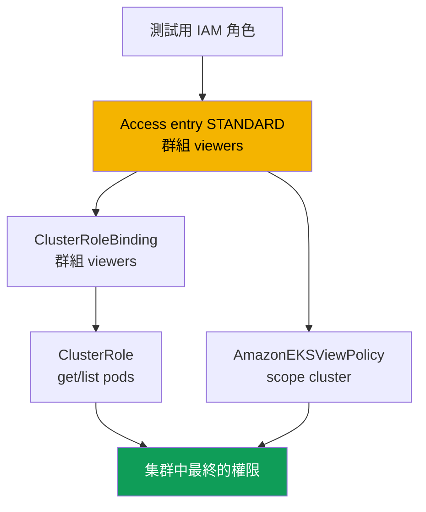
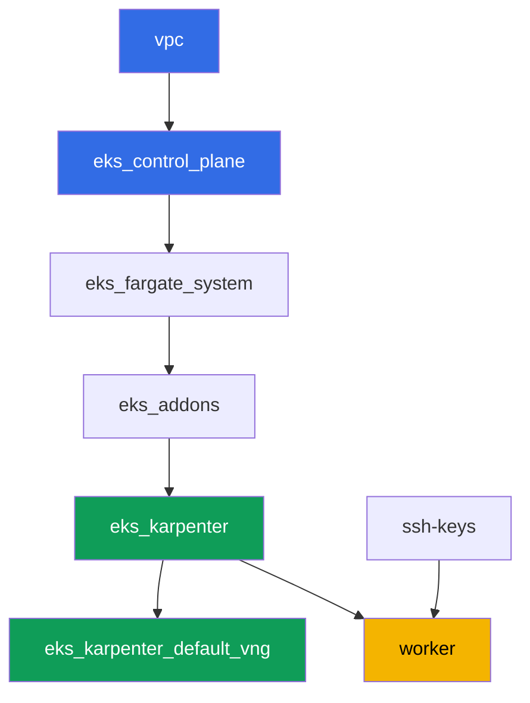

[Русская версия](README_RU.MD) · [Eng version](README.MD) · [Versión en español](README_ES.MD) · [Version française](README_FR.MD) · [Deutsche Version](README_DE.MD) · [ქართული ვერსია](README_GE.MD) · [日本語版](README_JP.MD)

# 實驗 102 - 集群存取:IAM 與 RBAC、access entries 與 access policies

## 說明

集群已經創建完成(實驗 101),接下來的問題是誰能進入這個集群,以及擁有什麼權限。在
這個實驗中,你會拆解兩個層級的接縫:透過 IAM 進行的身份驗證(authentication)與透過
RBAC 進行的授權(authorization)。你會建立第二個 IAM 主體,透過 access entry 賦予它
存取權,再用兩種方式賦予權限 - 自訂 RBAC 與現成的 access policy - 並在實踐中親眼看到
`Unauthorized`(身份驗證未通過)與 `Forbidden`(身份驗證通過,但 RBAC 未允許該操作)
之間的差異。

任務以生產風格編寫:簡短的任務描述加驗收標準。驗證是自動的,透過 `check_result` 命令
完成,另外還有幾個需要你親手執行的 assume-role 手動步驟,以便親眼看到這個差異。

## 目標

鞏固以下課程章節的內容:

- [第 5 章。集群存取:IAM 與 RBAC、access entries](../../course/05/tw.md) -
  從 aws-auth 遷移

## 我們要創建什麼

集群已經以代碼方式部署完成(如同實驗 101),並運行在 `authenticationMode = API` 模式
下。你要創建第二個 IAM 主體,並透過兩條並行路徑為它設定存取權:疊加在 access entry 之
上的 RBAC,以及一個現成的 access policy。

| 對象 | 這是什麼 | 在這個實驗中的作用 |
|--------|---------|-------------------|
| 測試用 IAM 角色 | 第二個主體,只能被 worker 角色 assume | 用於測試 access entry 的主體,不影響其他實驗的權限 |
| Access entry(`STANDARD`,群組 `viewers`) | 將角色映射到 Kubernetes 群組 | 將 IAM 主體與 RBAC 主體(subject)連接起來 |
| `ClusterRole`/`ClusterRoleBinding viewers-pod-reader` | 針對群組 `viewers` 的 RBAC | 對 pods 的 `get`/`list` 權限,疊加在 access entry 之上的經典 RBAC |
| `AmazonEKSViewPolicy` 的關聯(scope 為 `cluster`) | AWS 的 access policy | 第二個平行的權限來源,不需要自訂 RBAC |
| 產物 `1/accessconfig.json`、`7/...txt`、`8/...txt` | 配置快照與解釋 | 記錄存取模式以及 Unauthorized/Forbidden 之間的差異 |



## 基礎設施

環境透過 Terragrunt 部署在 AWS(`eu-central-1`),與實驗 101 相同。實驗中的每個目錄
都是一個組件,擁有自己的 `terragrunt.hcl`,它引用 `terraform/modules/` 中的共用模組,
並透過 `dependency` 區塊聲明依賴關係。這個實驗不需要任何專門用於存取控制的組件:集群
已經由 `eks_v2_control_plane` 模組(`terraform-aws-modules/eks/aws` v21)以 `API` 模式
創建完成,所有任務都是透過 `aws eks` CLI 和普通的 RBAC manifest,從工作機上執行的。

### 模組與依賴關係

| 目錄(組件) | 模組(`terraform/modules/`) | 依賴於 | 創建了什麼 |
|---------------------|-------------------------------|------------|-------------|
| `vpc` | `vpc_v3` | - | VPC `10.10.0.0/16`,兩個 AZ 中的公有與私有子網,NAT |
| `ssh-keys` | `ssh-keys` | - | 供工作機與節點使用的一對 SSH 金鑰 |
| `eks_control_plane` | `eks_v2_control_plane` | `vpc` | EKS control plane `1.36`、存取模式 `API`、OIDC |
| `eks_fargate_system` | `eks_v2_fargate` | `vpc`、`eks_control_plane` | `kube-system` 與 `karpenter` 的 Fargate 配置檔 |
| `eks_addons` | `eks_v2_addons` | `eks_control_plane`、`eks_fargate_system` | coredns、kube-proxy、vpc-cni、pod-identity 附加元件 |
| `eks_karpenter` | `eks_v2_karpenter` | `vpc`、`eks_control_plane`、`eks_addons`、`eks_fargate_system` | Karpenter 控制器、節點 IAM 角色 |
| `eks_karpenter_default_vng` | `eks_v2_karpenter_vng` | `vpc`、`eks_control_plane`、`eks_karpenter` | 預設 NodePool `default` 以及基於 AL2023 的 EC2NodeClass |
| `worker` | `eks_v2_work_pc` | `ssh-keys`、`vpc`、`eks_control_plane`、`eks_karpenter` | 帶有 kubectl、測試腳本和 `check_result` 的工作機 |

依賴關係圖(較早套用的組件位於箭頭下方),與實驗 101 相同:



### 第二個主體與 worker 的權限

Karpenter 節點角色不適合當作「第二個主體」:Karpenter 的 submodule 會自動為它創建自己
的 `EC2_LINUX` 類型 access entry,而一個 IAM 主體不能同時存在於兩個 access entry 中。
因此這個實驗直接在 worker 上透過 AWS CLI 創建一個獨立的測試用 IAM 角色(不對集群的
terraform 做任何修改)。

worker 角色(`eks_v2_work_pc/iam.tf`)已經擁有 `eks:*`,這對所有 `create-access-entry`、
`associate-access-policy` 之類的命令已經足夠。為了創建測試角色(任務 2),worker 獲得
了精確授權的 `iam:CreateRole`、`iam:GetRole`、`iam:DeleteRole`、`iam:PutRolePolicy` 以及
`sts:AssumeRole`,並限定在資源 `arn:aws:iam::<account>:role/*-test-*` 上 - 也就是說
worker 只能管理名稱中帶有 `-test-` 的角色,也只能 assume 這些角色,不會為自己擴大任何
其他權限。

## 部署

```bash
TASK=102 make run_eks_task
```

部署大約需要 15-20 分鐘。在輸出中找到連接工作機的 SSH 那一行並連接上去。kubectl 在那
裡已經配置好指向正確的集群。

工作機上的常用命令:

```bash
time_left       # 環境剩餘的時間
check_result    # 檢查解答
```

> 測試環境的安全性。`env.hcl` 中啟用了 `ssh_password_enable = true` 和
> `access_cidrs = ["0.0.0.0/0"]` - 這對於學習環境很方便,但在生產環境中不應該這樣做。
> 依照課程標準,對工作機的存取應透過 AWS SSM Session Manager 進行,不對外暴露公開的
> SSH 端口,並將 `access_cidrs` 限制到具體的位址。這裡保留公開 SSH 只是為了簡化啟動
> 流程。

## 任務

---
|        **1**        | **清單盤點:集群的存取模式**                  |
| :-----------------: | :---------------------------------------------------------- |
| 我們要做什麼          | 將 `aws eks describe-cluster --name <cluster> --query 'cluster.accessConfig'` 的結果保存到檔案 `/var/work/tests/artifacts/1/accessconfig.json`。確認 `authenticationMode` 等於 `API`。 |
| 驗收標準    | - 檔案不為空;<br/>- 包含 `"authenticationMode": "API"`。 |
---
|        **2**        | **用於測試的第二個 IAM 主體**                          |
| :-----------------: | :---------------------------------------------------------- |
| 我們要做什麼          | 創建一個測試用 IAM 角色(名稱必須包含 `-test-`,例如 `eks-task102-test-viewer`),trust policy 只允許 worker 角色的 ARN 執行 `sts:AssumeRole`。將角色的 ARN 保存到檔案 `/var/work/tests/artifacts/2/test_role_arn.txt`。 |
| 驗收標準    | - 檔案不為空,包含名稱中帶有 `test` 的角色 ARN;<br/>- 角色存在(`aws iam get-role`)。 |
---
|        **3**        | **測試主體的 Access entry**                   |
| :-----------------: | :---------------------------------------------------------- |
| 我們要做什麼          | 為測試角色創建一個 `STANDARD` 類型的 access entry,`kubernetesGroups` 設為 `viewers`,不明確指定 `username`(讓 EKS 自動填入)。 |
| 驗收標準    | - `aws eks describe-access-entry` 返回 `type=STANDARD`;<br/>- `kubernetesGroups` 包含 `viewers`。 |
---
|        **4**        | **疊加在 access entry 之上的 RBAC:僅讀取 pods**            |
| :-----------------: | :---------------------------------------------------------- |
| 我們要做什麼          | 創建 `ClusterRole` `viewers-pod-reader`,對 `pods` 只賦予 `get` 和 `list` 權限,再創建 `ClusterRoleBinding` `viewers-pod-reader`,將它綁定到群組 `viewers`。這是疊加在 access entry 之上的經典 RBAC,不涉及 access policy。 |
| 驗收標準    | - `ClusterRole` 只賦予對 `pods` 的 `get`/`list`(不包含 `create`、`delete`);<br/>- `ClusterRoleBinding` 綁定到群組 `viewers`。 |
---
|        **5**        | **透過 assume-role 手動驗證權限**                  |
| :-----------------: | :---------------------------------------------------------- |
| 我們要做什麼          | 在 worker 上執行 `aws sts assume-role --role-arn <test_role_arn> --role-session-name test-viewer-session`,匯出臨時憑證,並透過 `aws eks update-kubeconfig --alias test-viewer --kubeconfig /tmp/test-viewer.kubeconfig` 獲取一個獨立的 kubeconfig。驗證 `kubectl --kubeconfig /tmp/test-viewer.kubeconfig get pods -A`(應該成功)以及 `kubectl --kubeconfig /tmp/test-viewer.kubeconfig create namespace test`(應該以 `Forbidden` 失敗)。將兩條命令及其結果保存到檔案 `/var/work/tests/artifacts/5/rbac_check.txt`。 |
| 驗收標準    | - 檔案不為空,提到 `get pods` 和 `Forbidden`。 |
---
|        **6**        | **疊加在 access entry 之上的 Access policy**                       |
| :-----------------: | :---------------------------------------------------------- |
| 我們要做什麼          | 將 access policy `AmazonEKSViewPolicy`(scope 為 `cluster`)關聯到測試角色。透過 `aws eks list-associated-access-policies` 確認該關聯已存在。 |
| 驗收標準    | - `list-associated-access-policies` 包含 `AmazonEKSViewPolicy`,且 `accessScope.type=cluster`。 |
---
|        **7**        | **診斷:Unauthorized 對比 Forbidden**              |
| :-----------------: | :---------------------------------------------------------- |
| 我們要做什麼          | 建立另一個測試角色(名稱帶 `-test-`),不為它創建任何 access entry,像任務 5 那樣透過 assume-role 獲取它的 kubeconfig,並執行 `kubectl get pods -A` - 確認回應是 `Unauthorized` 而不是 `Forbidden`,因為集群根本不認識這個 ARN(透過 `aws eks list-access-entries` 驗證)。與任務 5 中的 `Forbidden` 進行對比。將這個差異的解釋保存到檔案 `/var/work/tests/artifacts/7/unauthorized_vs_forbidden.txt`,文字中必須提到這兩種錯誤以及命令 `list-access-entries`。 |
| 驗收標準    | - 檔案不為空,提到 `Unauthorized`、`Forbidden` 和 `list-access-entries`。 |
---
|        **8**        | **收回存取權:刪除並恢復 access entry**   |
| :-----------------: | :---------------------------------------------------------- |
| 我們要做什麼          | 刪除任務 3 中測試角色的 access entry(`aws eks delete-access-entry`),透過 `test-viewer.kubeconfig` 驗證存取權已經消失(`Unauthorized`),然後用同樣的群組 `viewers` 再次創建該記錄,讓環境保持在可供驗證的可用狀態。將整個實驗過程保存到檔案 `/var/work/tests/artifacts/8/delete_recreate.txt`。 |
| 驗收標準    | - 測試角色的 access entry 再次存在,類型為 `STANDARD`;<br/>- 檔案提到 `Unauthorized`、`delete-access-entry` 和 `create-access-entry`。 |
---

## 檢查結果

在工作機上執行自動檢查:

```bash
check_result
```

腳本會執行測試並顯示已完成任務的百分比。任務 5、7 和 8 需要使用臨時憑證進行實際的
assume-role,因此自動測試只會檢查最終的配置(access entry、RBAC、access policy)以及
帶有解釋的產物 - `Unauthorized`/`Forbidden` 之間的真實差異,你需要按照解答中的命令親
手驗證才能看到。

## 解答

參考解答:[worker/files/solutions/1_TW.MD](worker/files/solutions/1_TW.MD)

## 刪除集群與資源

> **先清理測試用 IAM 角色。** 角色 `eks-task102-test-viewer` 和
> `eks-task102-test-nobody` 是你透過 AWS CLI 手動創建的,terraform 的 state 中沒有它們,
> `destroy` 不會動到它們。IAM 角色存在於區域之外、集群之外,因此它們會留在帳戶中,再次
> 運行這個實驗時,`aws iam create-role` 會因為 `EntityAlreadyExists` 而失敗。Access
> entries 不一定要單獨刪除(它們會隨集群一起消失),但如果你想在同一個集群上重新做一次
> 這個實驗,也把它們清掉。

```bash
CLUSTER=$(aws eks list-clusters --query 'clusters[0]' --output text)

for ROLE in eks-task102-test-viewer eks-task102-test-nobody; do
  ARN=$(aws iam get-role --role-name "$ROLE" --query 'Role.Arn' --output text 2>/dev/null) || continue
  # 該角色的 access entry(如果你要重新做這個實驗,需要清理它)
  aws eks delete-access-entry --cluster-name "$CLUSTER" --principal-arn "$ARN" 2>/dev/null
  # 內聯與附加的政策,如果你添加過的話
  for P in $(aws iam list-role-policies --role-name "$ROLE" --query 'PolicyNames' --output text); do
    aws iam delete-role-policy --role-name "$ROLE" --policy-name "$P"
  done
  for P in $(aws iam list-attached-role-policies --role-name "$ROLE" \
      --query 'AttachedPolicies[].PolicyArn' --output text); do
    aws iam detach-role-policy --role-name "$ROLE" --policy-arn "$P"
  done
  aws iam delete-role --role-name "$ROLE"
done
```

> **卸除負載。** 如果實驗中的 Pod 讓 Karpenter 啟動了一個 EC2 節點,請刪除負載並等待
> 節點消失:否則 VPC CNI 來不及移除自己的次要 ENI,孤立的 ENI 會停留在 `available`
> 狀態,持續佔用節點的 security group,`destroy` 就會卡在
> `module.eks.aws_security_group.node[0]: Still destroying...` 上。

```bash
while kubectl get nodes --no-headers 2>/dev/null | grep -qv fargate; do
  echo "Karpenter 的 EC2 節點還活著,等待中..."; sleep 15
done
```

```bash
TASK=102 make delete_eks_task
```

如果 `destroy` 仍然卡在節點的 security group 上,找到並刪除孤立的 ENI:

```bash
aws ec2 describe-network-interfaces --filters Name=status,Values=available \
  --query 'NetworkInterfaces[].[NetworkInterfaceId,Description,Groups[0].GroupName]' --output table
aws ec2 delete-network-interface --network-interface-id <eni-id>
```
