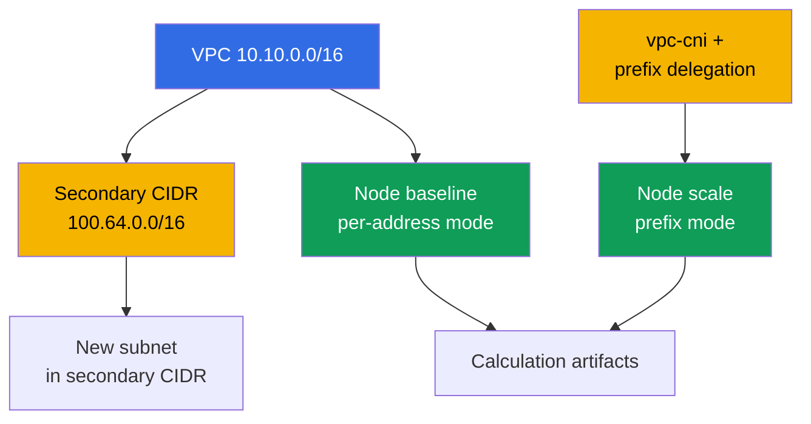
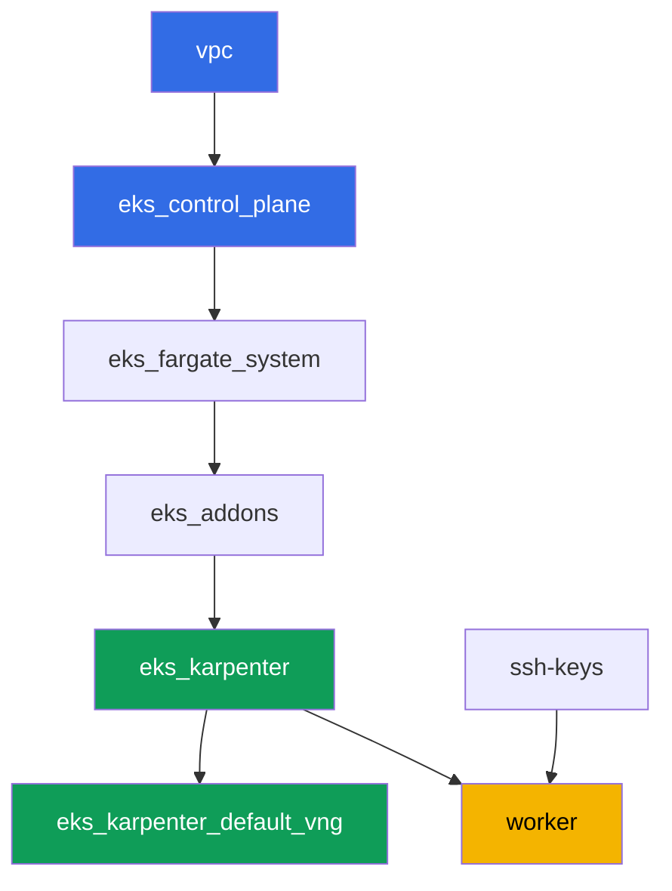

[Русская версия](README_RU.MD) · [Versión en español](README_ES.MD) · [Version française](README_FR.MD) · [Deutsche Version](README_DE.MD) · [ქართული ვერსია](README_GE.MD) · [繁體中文版](README_TW.MD) · [日本語版](README_JP.MD)

# Lab 103 - Address plan: ENI limits, prefix delegation, secondary CIDR

## Description

The cluster already knows how to deploy as code (lab 101) and let the right people in (lab
102). This lab is about something that runs out sooner or later on any live cluster: IP
addresses. You calculate the pod limit per node using the ENI and IPs-per-ENI formula,
check that against what kubelet actually reports, enable prefix delegation on the vpc-cni
addon and confirm that it doesn't change existing nodes while new ones get noticeably more
addresses. Then you plan a subnet size for cluster growth with margin for the warm pool and
rolling updates, and attach a second, secondary CIDR block to the VPC - the classic move
when the VPC's primary range is running out.

Tasks are written in a production style: a short statement plus acceptance criteria.
Checking is automatic, via the `check_result` command.

## Goal

Reinforce the material from these course chapters:

- [Chapter 6. Cluster networking: VPC CNI, ENI and IP addresses, CIDR
  planning](../../course/06/ru.md) - where pods get their addresses from and how the pod
  limit is computed
- [Chapter 7. Scaling the address plan: prefix delegation, secondary CIDR, custom
  networking](../../course/07/ru.md) - what to do when addresses run low
- [Chapter 14. Density and sizing: pods per node, ENI limits, requests and limits in the
  cloud](../../course/14/ru.md) - how the address limit lines up with the resource limit

## What we're creating

The cluster is already deployed as code (as in lab 101). You create a workload to see two
address-assignment modes on live nodes, and expand the VPC's address plan.

| Object | What it is | Why it's in this lab |
|--------|---------|-------------------|
| Deployment `baseline` | a small workload, the first EC2 node | a node in VPC CNI's regular, per-address mode (chapter 6) |
| Addon `vpc-cni` with `ENABLE_PREFIX_DELEGATION` | managed addon configuration | enables prefix mode for new nodes (chapter 7) |
| Deployment `scale` | a workload that doesn't fit on the old node | forces Karpenter to bring up a new node already in prefix mode (chapter 7) |
| Artifact `1/maxpods.txt` | formula calculation and the actual value from the node | the max-pods formula matches what kubelet reports (chapter 14) |
| Artifact `2/prefixdelegation.txt` | comparison of the old and new node | the old node doesn't change, the new one has a noticeably higher limit (chapters 6, 7) |
| Artifact `3/cidrplan.txt` | subnet size calculation | choosing a subnet prefix with margin for the warm pool and rolling updates (chapter 6) |
| Secondary CIDR `100.64.0.0/16` + subnet | a second VPC address block | what to do when the primary CIDR is running out (chapter 7) |
| Artifact `5/diagnostics.txt` | breakdown of address-shortage diagnostics | learning to read `FailedCreatePodSandBox` and `InsufficientCidrBlocks` (chapter 6) |



## Infrastructure

The environment is deployed in AWS (`eu-central-1`) via Terragrunt, same as in lab 101.
Each lab directory is one component with its own `terragrunt.hcl`, which references a
shared module in `terraform/modules/` and declares dependencies through `dependency`
blocks.

### Modules and dependencies

| Directory (component) | Module (`terraform/modules/`) | Depends on | What it creates |
|---------------------|-------------------------------|------------|-------------|
| `vpc` | `vpc_v3` | - | VPC `10.10.0.0/16`, public and private subnets in two AZs, NAT |
| `ssh-keys` | `ssh-keys` | - | an SSH key pair for the worker machine and nodes |
| `eks_control_plane` | `eks_v2_control_plane` | `vpc` | EKS control plane `1.36`, OIDC, security groups |
| `eks_fargate_system` | `eks_v2_fargate` | `vpc`, `eks_control_plane` | Fargate profile for `kube-system` and `karpenter` |
| `eks_addons` | `eks_v2_addons` | `eks_control_plane`, `eks_fargate_system` | coredns, kube-proxy, vpc-cni, pod-identity add-ons |
| `eks_karpenter` | `eks_v2_karpenter` | `vpc`, `eks_control_plane`, `eks_addons`, `eks_fargate_system` | Karpenter controller, node IAM role |
| `eks_karpenter_default_vng` | `eks_v2_karpenter_vng` | `vpc`, `eks_control_plane`, `eks_karpenter` | default NodePool `default` and EC2NodeClass on AL2023 |
| `worker` | `eks_v2_work_pc` | `ssh-keys`, `vpc`, `eks_control_plane`, `eks_karpenter` | worker machine with kubectl, tests, and `check_result` |

Dependency graph (what gets applied earlier is lower down the arrow), same as in lab 101:



All of the lab's tasks are solved from the worker machine via `kubectl` and the `aws` CLI,
with no new terraform modules: the `vpc-cni` addon itself is already deployed by the
`eks_addons` component, and changing its configuration (prefix delegation) plus working
with the VPC's CIDR is done via `aws eks update-addon` / `aws ec2
associate-vpc-cidr-block` right from the worker.

### Worker permissions for address planning

The worker role (`eks_v2_work_pc/iam.tf`) already had broad `ec2:Describe*` and `eks:*`
permissions - enough for all the diagnostics (subnets, VPC, addons). For tasks 2 and 4 of
this lab, where you need to change VPC and addon configuration (not just read it), one
additional `Sid` `VpcCidrAndSubnetPlanningForLabs` was added to the policy with the
permissions `ec2:AssociateVpcCidrBlock`, `ec2:DisassociateVpcCidrBlock`,
`ec2:CreateSubnet`, `ec2:DeleteSubnet`, `ec2:CreateTags`, `eks:UpdateAddon`,
`eks:DescribeAddon`, `eks:DescribeUpdate` - following the pattern of the `Sid`s already in
that file, without changing the rest of the policy.

## Deployment

```bash
TASK=103 make run_eks_task
```

Deployment takes roughly 15-20 minutes. In the output, find the line with the SSH
connection to the worker machine and connect to it. kubectl there is already configured
for the right cluster.

Useful commands on the worker machine:

```bash
time_left       # how much environment time is left
check_result    # check the solution
```

> Environment security. `env.hcl` has `ssh_password_enable = true` and
> `access_cidrs = ["0.0.0.0/0"]` enabled - convenient for a training environment, but this
> is not something to do in production. Per the course standards, access to worker
> machines should go through AWS SSM Session Manager without exposing public SSH ports,
> and `access_cidrs` should be narrowed down to specific addresses. Here public SSH is
> left in place only to keep the setup simple.

## Tasks

---
|        **1**        | **max-pods by formula, checked against the actual value**             |
| :-----------------: | :---------------------------------------------------------- |
| What to do          | Create namespace `eks-103`, and in it Deployment `baseline` (image `viktoruj/ping_pong:latest`, `2` replicas), wait for readiness. Karpenter will bring up an EC2 node for it in the regular, per-address VPC CNI mode. Determine that node's type: `kubectl get node <node> -o jsonpath='{.metadata.labels.node\.kubernetes\.io/instance-type}'`. Via `aws ec2 describe-instance-types --instance-types <type> --query 'InstanceTypes[].NetworkInfo.[MaximumNetworkInterfaces,Ipv4AddressesPerInterface]'` and `...--query 'InstanceTypes[].VCpuInfo.DefaultVCpus'` get the ENI count, IPs per ENI and vCPU. Compute using the formula `max-pods = ENI * (IPs per ENI - 1) + 2`, apply the managed node group cap (`110` when `vCPU < 30`, otherwise `250`) and compare the result against the actual value `kubectl get node <node> -o jsonpath='{.status.allocatable.pods}'`. Save everything to `/var/work/tests/artifacts/1/maxpods.txt` line by line as `key=value`: `node`, `instance_type`, `eni`, `ips_per_eni`, `vcpu`, `formula`, `cap`, `expected_max_pods`, `actual_allocatable_pods`. |
| Acceptance criteria    | - Deployment `baseline` in `eks-103`, `2` ready replicas, the pod is not on Fargate;<br/>- the file contains all nine keys;<br/>- `expected_max_pods` equals `actual_allocatable_pods` and both match the formula and the cap. |
---
|        **2**        | **Prefix delegation: new node vs. old node**              |
| :-----------------: | :---------------------------------------------------------- |
| What to do          | Enable prefix delegation on the `vpc-cni` addon: `aws eks update-addon --cluster-name <name> --addon-name vpc-cni --configuration-values '{"env":{"ENABLE_PREFIX_DELEGATION":"true","WARM_PREFIX_TARGET":"1"}}' --resolve-conflicts PRESERVE`. Then create Deployment `scale` in `eks-103` (image `viktoruj/ping_pong:latest`, `6` replicas, the container has `resources.requests.cpu: "1"`) - this workload doesn't fit on the `baseline` node, so Karpenter brings up a new node already in prefix mode. Wait for `kubectl rollout status deployment/scale -n eks-103`. Identify the new node (any node from `kubectl get po -n eks-103 -l app=scale -o jsonpath='{.items[*].spec.nodeName}'` different from the `baseline` node) and compare `status.allocatable.pods` between the old and new node. Save to `/var/work/tests/artifacts/2/prefixdelegation.txt` line by line as `key=value`: `old_node`, `old_node_allocatable_pods`, `new_node`, `new_node_instance_type`, `new_node_allocatable_pods`, plus a text explanation (at least one line) of why `old_node_allocatable_pods` didn't change - kubelet already computed the limit when the old node started, and prefix delegation only concerns new nodes. |
| Acceptance criteria    | - the `vpc-cni` addon contains `ENABLE_PREFIX_DELEGATION` set to `true`;<br/>- Deployment `scale` is ready (`6` replicas);<br/>- `new_node` differs from `old_node`, `new_node_allocatable_pods` is greater than `old_node_allocatable_pods`;<br/>- the file mentions `prefix` and explains that the old node didn't change. |
---
|        **3**        | **Planning subnet size for growth**                    |
| :-----------------: | :---------------------------------------------------------- |
| What to do          | At peak, the cluster needs to hand out addresses to roughly `850` pods, with a `20%` margin for Karpenter's warm pool and another `15%` for a concurrent rolling update (the margins multiply sequentially). Compute the final address requirement and pick a subnet prefix from the table: `/24` - total `256`, available `251`; `/22` - total `1024`, available `1019`; `/20` - total `4096`, available `4091` (AWS reserves `5` addresses per subnet). Save the calculation and the reasoning behind the choice to `/var/work/tests/artifacts/3/cidrplan.txt`: the final address requirement, why `/24` and `/22` don't fit, why `/20` was chosen, and by what factor the available addresses exceed the requirement. |
| Acceptance criteria    | - the file is not empty, it contains the final address requirement;<br/>- it mentions `251`, `1019` and `4091`;<br/>- it concludes with `/20` as the chosen subnet prefix;<br/>- it mentions `warm pool` and `rolling update`. |
---
|        **4**        | **Secondary CIDR: expanding the VPC's address plan**              |
| :-----------------: | :---------------------------------------------------------- |
| What to do          | Find the cluster's `vpc-id` (`aws eks describe-cluster ... --query 'cluster.resourcesVpcConfig.vpcId'`). Attach a second, secondary CIDR block to the VPC from the RFC 6598 shared address space: `aws ec2 associate-vpc-cidr-block --vpc-id <id> --cidr-block 100.64.0.0/16`. Wait for `associated` state (`aws ec2 describe-vpcs --vpc-ids <id> --query 'Vpcs[].CidrBlockAssociationSet[].{CIDR:CidrBlock,State:CidrBlockState.State}'`). Create a subnet `100.64.1.0/24` in the new block (`aws ec2 create-subnet --vpc-id <id> --cidr-block 100.64.1.0/24 --availability-zone eu-central-1a`). Save the `describe-vpcs` output (showing `associated` status) and the new subnet's id to `/var/work/tests/artifacts/4/secondary_cidr.txt`. |
| Acceptance criteria    | - the VPC has a `CidrBlockAssociationSet` entry with `100.64.0.0/16` in `associated` state;<br/>- a subnet with CIDR `100.64.1.0/24` exists in this VPC;<br/>- the file mentions `100.64.0.0/16` and `associated`. |
---
|        **5**        | **Diagnosing address shortage (without a real failure)**      |
| :-----------------: | :---------------------------------------------------------- |
| What to do          | Don't break the lab's infrastructure. Study how an IP address shortage is diagnosed on a live cluster, and describe it using real commands against the current cluster. Run `aws ec2 describe-subnets --query 'Subnets[].[SubnetId,AvailabilityZone,CidrBlock,AvailableIpAddressCount]'` for the cluster's subnets and record the current `AvailableIpAddressCount` values. In the file `/var/work/tests/artifacts/5/diagnostics.txt` write an explanation: if a pod can't get an address, `kubectl describe pod` will show a `FailedCreatePodSandBox` event from `aws-cni`; if the subnet has no contiguous `/28` block for a prefix, the `ipamd`/`aws-node` logs will show an `InsufficientCidrBlocks` error, even if the subnet's `AvailableIpAddressCount` is large (that's a sign of fragmentation, not overall shortage); and `0` in a given AZ's `AvailableIpAddressCount` is a direct diagnosis of address exhaustion. |
| Acceptance criteria    | - the file is not empty;<br/>- it mentions `FailedCreatePodSandBox`, `InsufficientCidrBlocks` and `AvailableIpAddressCount`. |
---

## Checking the result

On the worker machine, run the automatic check:

```bash
check_result
```

The script will run the tests and show the percentage of completed tasks.

## Solution

Reference solution: [worker/files/solutions/1.MD](worker/files/solutions/1.MD)

## Deleting the cluster and resources

> Before deleting. Subnet `100.64.1.0/24` and secondary CIDR `100.64.0.0/16` from task 4
> were created by hand via the AWS CLI, not by terraform - the state knows nothing about
> them. Delete them yourself, otherwise `terragrunt destroy` will refuse to remove the VPC
> because of the leftover dependent subnet. Get the cluster name - `<cluster>` in the
> example below - like this: `aws eks list-clusters --query 'clusters[0]' --output text`.
>
> ```bash
> CLUSTER=$(aws eks list-clusters --query 'clusters[0]' --output text)
> VPC=$(aws eks describe-cluster --name "$CLUSTER" \
>   --query 'cluster.resourcesVpcConfig.vpcId' --output text)
> SUBNET=$(aws ec2 describe-subnets \
>   --filters "Name=vpc-id,Values=$VPC" "Name=cidr-block,Values=100.64.1.0/24" \
>   --query 'Subnets[0].SubnetId' --output text)
> aws ec2 delete-subnet --subnet-id "$SUBNET"
>
> ASSOC=$(aws ec2 describe-vpcs --vpc-ids "$VPC" \
>   --query "Vpcs[].CidrBlockAssociationSet[?CidrBlock=='100.64.0.0/16'].AssociationId" \
>   --output text)
> aws ec2 disassociate-vpc-cidr-block --association-id "$ASSOC"
> ```

```bash
TASK=103 make delete_eks_task
```
