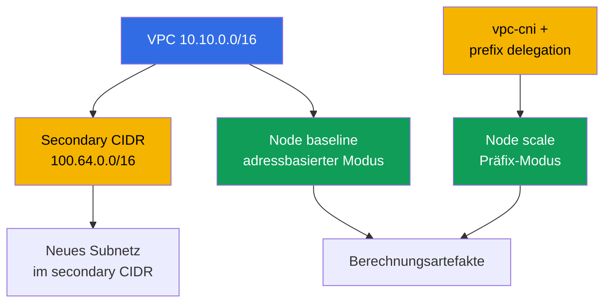
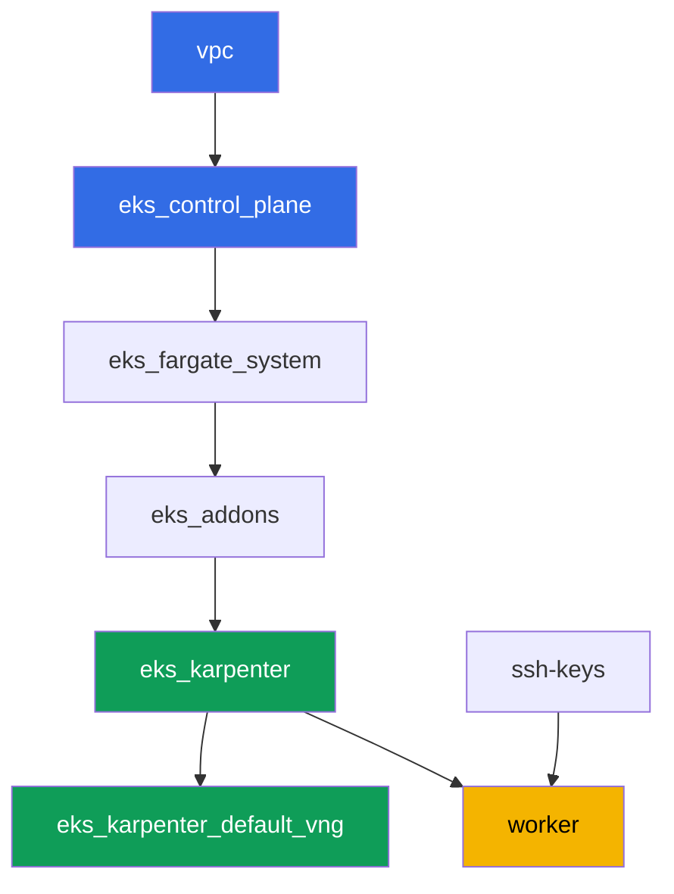

[Русская версия](README_RU.MD) · [Eng version](README.MD) · [Versión en español](README_ES.MD) · [Version française](README_FR.MD) · [ქართული ვერსია](README_GE.MD) · [繁體中文版](README_TW.MD) · [日本語版](README_JP.MD)

# Lab 103 - Adressplan: ENI-Limits, prefix delegation, secondary CIDR

## Beschreibung

Der Cluster kann sich bereits als Code deployen (Lab 101) und die richtigen Leute
hereinlassen (Lab 102). Dieses Lab dreht sich um etwas, das auf jedem produktiven Cluster
früher oder später knapp wird: IP-Adressen. Sie berechnen das Pod-Limit pro Node anhand der
Formel für ENI und IPs pro ENI, vergleichen die Berechnung mit dem, was kubelet tatsächlich
anzeigt, aktivieren prefix delegation im vpc-cni-Addon und stellen sicher, dass sich
bestehende Nodes dadurch nicht ändern, während neue Nodes deutlich mehr Adressen erhalten.
Anschließend planen Sie die Größe eines Subnetzes für das Wachstum des Clusters mit Puffer
für den Warm Pool und Rolling Updates, und hängen dem VPC einen zweiten, secondary CIDR-
Block an - der klassische Kniff, wenn der primäre Adressbereich des VPC knapp wird.

Die Aufgaben sind im Produktionsstil geschrieben: eine kurze Aufgabenstellung plus
Abnahmekriterien. Die Prüfung erfolgt automatisch über den Befehl `check_result`.

## Ziel

Den Stoff dieser Kurskapitel vertiefen:

- [Kapitel 6. Cluster-Netzwerk: VPC CNI, ENI und IP-Adressen, CIDR-
  Planung](../../course/06/ru.md) - woher Pods ihre Adressen bekommen und wie das
  Pod-Limit berechnet wird
- [Kapitel 7. Den Adressplan skalieren: prefix delegation, secondary CIDR, custom
  networking](../../course/07/ru.md) - was zu tun ist, wenn Adressen knapp werden
- [Kapitel 14. Dichte und Sizing: pods per node, ENI-Limits, requests und limits in der
  Cloud](../../course/14/ru.md) - wie das Adresslimit mit dem Ressourcenlimit
  zusammenpasst

## Was wir erstellen

Der Cluster ist bereits als Code deployt (wie in Lab 101). Sie erstellen eine Last, um zwei
Adressvergabe-Modi auf laufenden Nodes zu sehen, und erweitern den Adressplan des VPC.

| Objekt | Was es ist | Wofür in diesem Lab |
|--------|---------|-------------------|
| Deployment `baseline` | eine kleine Last, der erste EC2-Node | ein Node im normalen, adressbasierten Modus von VPC CNI (Kapitel 6) |
| Addon `vpc-cni` mit `ENABLE_PREFIX_DELEGATION` | Konfiguration des managed Addons | aktiviert den Präfix-Modus für neue Nodes (Kapitel 7) |
| Deployment `scale` | eine Last, die nicht auf den alten Node passt | zwingt Karpenter, einen neuen Node bereits im Präfix-Modus zu starten (Kapitel 7) |
| Artefakt `1/maxpods.txt` | Berechnung nach Formel und Ist-Wert vom Node | die max-pods-Formel stimmt mit dem überein, was kubelet sieht (Kapitel 14) |
| Artefakt `2/prefixdelegation.txt` | Vergleich zwischen altem und neuem Node | der alte Node ändert sich nicht, der neue hat ein deutlich höheres Limit (Kapitel 6, 7) |
| Artefakt `3/cidrplan.txt` | Berechnung der Subnetzgröße | Wahl eines Subnetz-Präfixes mit Puffer für Warm Pool und Rolling Updates (Kapitel 6) |
| Secondary CIDR `100.64.0.0/16` + Subnetz | ein zweiter Adressblock des VPC | was zu tun ist, wenn der primäre CIDR knapp wird (Kapitel 7) |
| Artefakt `5/diagnostics.txt` | Aufschlüsselung der Diagnose bei Adressmangel | lernen, `FailedCreatePodSandBox` und `InsufficientCidrBlocks` zu lesen (Kapitel 6) |



## Infrastruktur

Die Umgebung wird in AWS (`eu-central-1`) über Terragrunt deployt, wie in Lab 101. Jedes
Lab-Verzeichnis ist eine Komponente mit eigener `terragrunt.hcl`, die auf ein gemeinsames
Modul in `terraform/modules/` verweist und Abhängigkeiten über `dependency`-Blöcke
deklariert.

### Module und Abhängigkeiten

| Verzeichnis (Komponente) | Modul (`terraform/modules/`) | Abhängig von | Was es erstellt |
|---------------------|-------------------------------|------------|-------------|
| `vpc` | `vpc_v3` | - | VPC `10.10.0.0/16`, öffentliche und private Subnetze in zwei AZ, NAT |
| `ssh-keys` | `ssh-keys` | - | ein SSH-Schlüsselpaar für die Worker-Maschine und die Nodes |
| `eks_control_plane` | `eks_v2_control_plane` | `vpc` | EKS control plane `1.36`, OIDC, security groups |
| `eks_fargate_system` | `eks_v2_fargate` | `vpc`, `eks_control_plane` | Fargate-Profil für `kube-system` und `karpenter` |
| `eks_addons` | `eks_v2_addons` | `eks_control_plane`, `eks_fargate_system` | Addons coredns, kube-proxy, vpc-cni, pod-identity |
| `eks_karpenter` | `eks_v2_karpenter` | `vpc`, `eks_control_plane`, `eks_addons`, `eks_fargate_system` | Karpenter-Controller, IAM-Rolle der Nodes |
| `eks_karpenter_default_vng` | `eks_v2_karpenter_vng` | `vpc`, `eks_control_plane`, `eks_karpenter` | Standard-NodePool `default` und EC2NodeClass auf AL2023 |
| `worker` | `eks_v2_work_pc` | `ssh-keys`, `vpc`, `eks_control_plane`, `eks_karpenter` | Worker-Maschine mit kubectl, Tests und `check_result` |

Abhängigkeitsgraph (was früher angewendet wird, steht weiter unten am Pfeil), wie in Lab
101:



Alle Aufgaben des Labs werden von der Worker-Maschine aus über `kubectl` und die `aws`-CLI
gelöst, ohne neue Terraform-Module: das Addon `vpc-cni` selbst ist bereits über die
Komponente `eks_addons` deployt, und das Ändern seiner Konfiguration (prefix delegation)
sowie die Arbeit mit dem CIDR des VPC erfolgen über `aws eks update-addon` /
`aws ec2 associate-vpc-cidr-block` direkt vom Worker aus.

### Worker-Rechte für die Adressplanung

Die Worker-Rolle (`eks_v2_work_pc/iam.tf`) hatte bereits breite `ec2:Describe*`- und
`eks:*`-Rechte - das reicht für die gesamte Diagnose (Subnetze, VPC, Addons). Für die
Aufgaben 2 und 4 dieses Labs, bei denen man die Konfiguration von VPC und Addon ändern
muss (nicht nur lesen), wurde der Policy ein zusätzlicher `Sid`
`VpcCidrAndSubnetPlanningForLabs` mit den Rechten `ec2:AssociateVpcCidrBlock`,
`ec2:DisassociateVpcCidrBlock`, `ec2:CreateSubnet`, `ec2:DeleteSubnet`, `ec2:CreateTags`,
`eks:UpdateAddon`, `eks:DescribeAddon`, `eks:DescribeUpdate` hinzugefügt - nach dem Muster
der bereits vorhandenen `Sid`s in dieser Datei, ohne den Rest der Policy zu verändern.

## Deployment

```bash
TASK=103 make run_eks_task
```

Das Deployment dauert etwa 15-20 Minuten. Suchen Sie in der Ausgabe die Zeile mit der
SSH-Verbindung zur Worker-Maschine und verbinden Sie sich damit. kubectl ist dort bereits
für den richtigen Cluster konfiguriert.

Nützliche Befehle auf der Worker-Maschine:

```bash
time_left       # wie viel Umgebungszeit noch übrig ist
check_result    # die Lösung prüfen
```

> Sicherheit der Umgebung. In `env.hcl` sind `ssh_password_enable = true` und
> `access_cidrs = ["0.0.0.0/0"]` aktiviert - praktisch für eine Lernumgebung, aber so
> etwas sollte man in Produktion nicht tun. Nach den Standards des Kurses wird der Zugang
> zu Worker-Maschinen über AWS SSM Session Manager geöffnet, ohne öffentliche SSH-Ports
> nach außen freizugeben, und `access_cidrs` wird auf konkrete Adressen eingeschränkt.
> Hier bleibt öffentliches SSH nur zur Vereinfachung des Starts erhalten.

## Aufgaben

---
|        **1**        | **Berechnung von max-pods per Formel und Abgleich mit dem Ist-Wert**             |
| :-----------------: | :---------------------------------------------------------- |
| Was zu tun ist          | Erstellen Sie den Namespace `eks-103`, darin das Deployment `baseline` (Image `viktoruj/ping_pong:latest`, `2` Replicas), und warten Sie auf Bereitschaft. Karpenter startet dafür einen EC2-Node im normalen, adressbasierten Modus von VPC CNI. Bestimmen Sie den Typ dieses Nodes: `kubectl get node <node> -o jsonpath='{.metadata.labels.node\.kubernetes\.io/instance-type}'`. Ermitteln Sie über `aws ec2 describe-instance-types --instance-types <type> --query 'InstanceTypes[].NetworkInfo.[MaximumNetworkInterfaces,Ipv4AddressesPerInterface]'` und `...--query 'InstanceTypes[].VCpuInfo.DefaultVCpus'` die Anzahl der ENI, die IPs pro ENI und die vCPU. Berechnen Sie mit der Formel `max-pods = ENI * (IPs pro ENI - 1) + 2`, wenden Sie den Cap der managed node group an (`110` bei `vCPU < 30`, sonst `250`) und vergleichen Sie das Ergebnis mit dem Ist-Wert `kubectl get node <node> -o jsonpath='{.status.allocatable.pods}'`. Speichern Sie alles zeilenweise im Format `schlüssel=wert` in `/var/work/tests/artifacts/1/maxpods.txt`: `node`, `instance_type`, `eni`, `ips_per_eni`, `vcpu`, `formula`, `cap`, `expected_max_pods`, `actual_allocatable_pods`. |
| Abnahmekriterien    | - Deployment `baseline` in `eks-103`, `2` bereite Replicas, der Pod läuft nicht auf Fargate;<br/>- die Datei enthält alle neun Schlüssel;<br/>- `expected_max_pods` ist gleich `actual_allocatable_pods` und beide passen zur Formel und zum Cap. |
---
|        **2**        | **Prefix delegation: neuer Node gegen alten Node**              |
| :-----------------: | :---------------------------------------------------------- |
| Was zu tun ist          | Aktivieren Sie prefix delegation im Addon `vpc-cni`: `aws eks update-addon --cluster-name <name> --addon-name vpc-cni --configuration-values '{"env":{"ENABLE_PREFIX_DELEGATION":"true","WARM_PREFIX_TARGET":"1"}}' --resolve-conflicts PRESERVE`. Erstellen Sie danach das Deployment `scale` in `eks-103` (Image `viktoruj/ping_pong:latest`, `6` Replicas, der Container hat `resources.requests.cpu: "1"`) - diese Last passt nicht auf den Node `baseline`, sodass Karpenter dafür einen neuen Node bereits im Präfix-Modus startet. Warten Sie auf `kubectl rollout status deployment/scale -n eks-103`. Bestimmen Sie den neuen Node (ein beliebiger Node aus `kubectl get po -n eks-103 -l app=scale -o jsonpath='{.items[*].spec.nodeName}'`, der sich vom Node `baseline` unterscheidet) und vergleichen Sie `status.allocatable.pods` zwischen altem und neuem Node. Speichern Sie in `/var/work/tests/artifacts/2/prefixdelegation.txt` zeilenweise im Format `schlüssel=wert`: `old_node`, `old_node_allocatable_pods`, `new_node`, `new_node_instance_type`, `new_node_allocatable_pods`, sowie eine Texterklärung (mindestens eine Zeile), warum sich `old_node_allocatable_pods` nicht geändert hat - kubelet hat das Limit bereits beim Start des alten Nodes berechnet, und prefix delegation betrifft nur neue Nodes. |
| Abnahmekriterien    | - das Addon `vpc-cni` enthält `ENABLE_PREFIX_DELEGATION` mit dem Wert `true`;<br/>- das Deployment `scale` ist bereit (`6` Replicas);<br/>- `new_node` unterscheidet sich von `old_node`, `new_node_allocatable_pods` ist größer als `old_node_allocatable_pods`;<br/>- die Datei erwähnt `prefix` und erklärt, dass sich der alte Node nicht geändert hat. |
---
|        **3**        | **Planung der Subnetzgröße für Wachstum**                    |
| :-----------------: | :---------------------------------------------------------- |
| Was zu tun ist          | Auf dem Höhepunkt muss der Cluster Adressen an etwa `850` Pods verteilen, mit einem Puffer von `20%` für den Warm Pool von Karpenter und weiteren `15%` für ein gleichzeitiges Rolling Update (die Puffer multiplizieren sich sequenziell). Berechnen Sie den endgültigen Adressbedarf und wählen Sie einen Subnetz-Präfix aus der Tabelle: `/24` - insgesamt `256`, verfügbar `251`; `/22` - insgesamt `1024`, verfügbar `1019`; `/20` - insgesamt `4096`, verfügbar `4091` (AWS reserviert `5` Adressen pro Subnetz). Speichern Sie die Berechnung und die Begründung der Wahl in `/var/work/tests/artifacts/3/cidrplan.txt`: den endgültigen Adressbedarf, warum `/24` und `/22` nicht passen, warum `/20` gewählt wird, und um das Wievielfache die verfügbaren Adressen den Bedarf übersteigen. |
| Abnahmekriterien    | - die Datei ist nicht leer, sie enthält den endgültigen Adressbedarf;<br/>- sie erwähnt `251`, `1019` und `4091`;<br/>- sie schließt mit `/20` als gewähltem Subnetz-Präfix;<br/>- sie erwähnt `warm pool` und `rolling update`. |
---
|        **4**        | **Secondary CIDR: wir erweitern den Adressplan des VPC**              |
| :-----------------: | :---------------------------------------------------------- |
| Was zu tun ist          | Ermitteln Sie die `vpc-id` des Clusters (`aws eks describe-cluster ... --query 'cluster.resourcesVpcConfig.vpcId'`). Hängen Sie dem VPC einen zweiten, secondary CIDR-Block aus dem shared address space von RFC 6598 an: `aws ec2 associate-vpc-cidr-block --vpc-id <id> --cidr-block 100.64.0.0/16`. Warten Sie auf den Status `associated` (`aws ec2 describe-vpcs --vpc-ids <id> --query 'Vpcs[].CidrBlockAssociationSet[].{CIDR:CidrBlock,State:CidrBlockState.State}'`). Erstellen Sie im neuen Block das Subnetz `100.64.1.0/24` (`aws ec2 create-subnet --vpc-id <id> --cidr-block 100.64.1.0/24 --availability-zone eu-central-1a`). Speichern Sie die Ausgabe von `describe-vpcs` (mit dem Status `associated`) und die id des neuen Subnetzes in `/var/work/tests/artifacts/4/secondary_cidr.txt`. |
| Abnahmekriterien    | - das VPC hat einen `CidrBlockAssociationSet`-Eintrag mit `100.64.0.0/16` im Status `associated`;<br/>- ein Subnetz mit dem CIDR `100.64.1.0/24` existiert in diesem VPC;<br/>- die Datei erwähnt `100.64.0.0/16` und `associated`. |
---
|        **5**        | **Diagnose eines Adressmangels (ohne echten Ausfall)**      |
| :-----------------: | :---------------------------------------------------------- |
| Was zu tun ist          | Beschädigen Sie nicht die Infrastruktur des Labs. Untersuchen Sie, wie ein Mangel an IP-Adressen auf einem laufenden Cluster diagnostiziert wird, und beschreiben Sie es anhand echter Befehle gegen den aktuellen Cluster. Führen Sie `aws ec2 describe-subnets --query 'Subnets[].[SubnetId,AvailabilityZone,CidrBlock,AvailableIpAddressCount]'` für die Subnetze des Clusters aus und notieren Sie die aktuellen Werte von `AvailableIpAddressCount`. Schreiben Sie in die Datei `/var/work/tests/artifacts/5/diagnostics.txt` eine Erklärung: wenn ein Pod keine Adresse bekommen kann, zeigt `kubectl describe pod` ein Ereignis `FailedCreatePodSandBox` von `aws-cni`; wenn im Subnetz kein zusammenhängender `/28`-Block für ein Präfix vorhanden ist, erscheint in den Logs von `ipamd`/`aws-node` ein Fehler `InsufficientCidrBlocks`, selbst wenn das `AvailableIpAddressCount` des Subnetzes groß erscheint (das ist ein Zeichen für Fragmentierung, nicht für einen generellen Mangel); und eine `0` im `AvailableIpAddressCount` einer AZ ist eine direkte Diagnose für erschöpfte Adressen. |
| Abnahmekriterien    | - die Datei ist nicht leer;<br/>- sie erwähnt `FailedCreatePodSandBox`, `InsufficientCidrBlocks` und `AvailableIpAddressCount`. |
---

## Prüfung des Ergebnisses

Führen Sie auf der Worker-Maschine die automatische Prüfung aus:

```bash
check_result
```

Das Skript führt die Tests aus und zeigt den Prozentsatz der abgeschlossenen Aufgaben.

## Lösung

Musterlösung: [worker/files/solutions/1_DE.MD](worker/files/solutions/1_DE.MD)

## Löschen des Clusters und der Ressourcen

> Vor dem Löschen. Das Subnetz `100.64.1.0/24` und der secondary CIDR
> `100.64.0.0/16` aus Aufgabe 4 wurden manuell über die AWS-CLI erstellt, nicht über
> Terraform - der State weiß nichts davon. Löschen Sie sie selbst, sonst verweigert
> `terragrunt destroy` das Löschen des VPC wegen des verbleibenden abhängigen Subnetzes.
> Ermitteln Sie den Cluster-Namen - `<cluster>` im folgenden Beispiel - so:
> `aws eks list-clusters --query 'clusters[0]' --output text`.
>
> ```bash
> CLUSTER=$(aws eks list-clusters --query 'clusters[0]' --output text)
> VPC=$(aws eks describe-cluster --name "$CLUSTER" \
>   --query 'cluster.resourcesVpcConfig.vpcId' --output text)
> SUBNET=$(aws ec2 describe-subnets \
>   --filters "Name=vpc-id,Values=$VPC" "Name=cidr-block,Values=100.64.1.0/24" \
>   --query 'Subnets[0].SubnetId' --output text)
> aws ec2 delete-subnet --subnet-id "$SUBNET"
>
> ASSOC=$(aws ec2 describe-vpcs --vpc-ids "$VPC" \
>   --query "Vpcs[].CidrBlockAssociationSet[?CidrBlock=='100.64.0.0/16'].AssociationId" \
>   --output text)
> aws ec2 disassociate-vpc-cidr-block --association-id "$ASSOC"
> ```

```bash
TASK=103 make delete_eks_task
```
