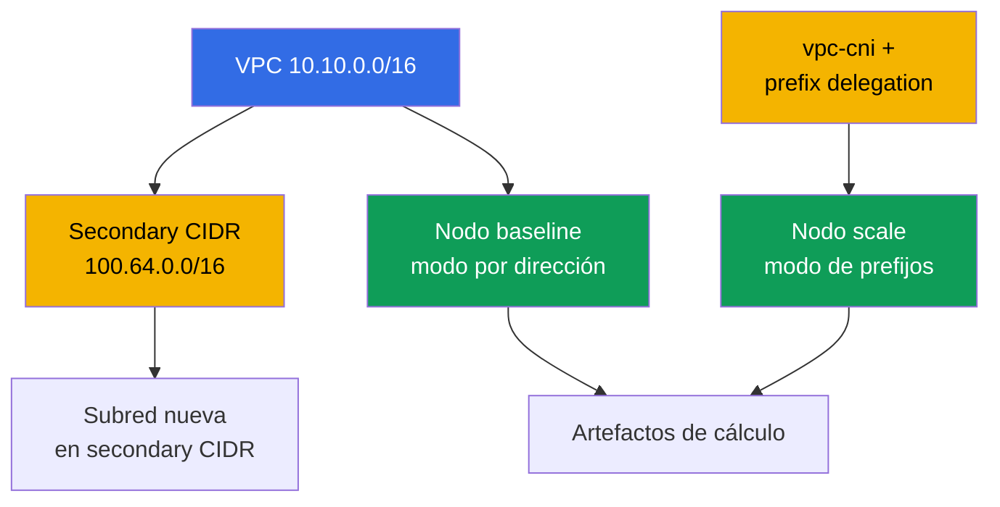
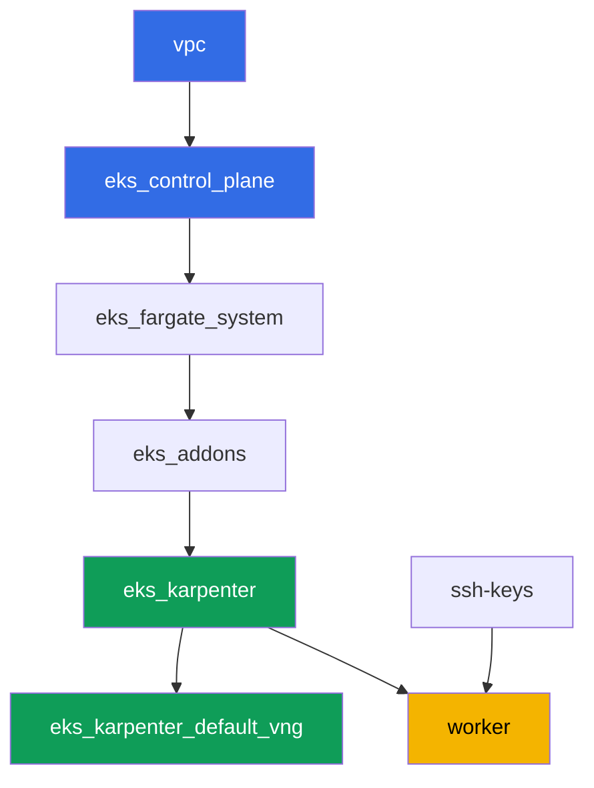

[Русская версия](README_RU.MD) · [Eng version](README.MD) · [Version française](README_FR.MD) · [Deutsche Version](README_DE.MD) · [ქართული ვერსია](README_GE.MD) · [繁體中文版](README_TW.MD) · [日本語版](README_JP.MD)

# Lab 103 - Plan de direcciones: límites de ENI, prefix delegation, secondary CIDR

## Descripción

El clúster ya sabe desplegarse como código (laboratorio 101) y dejar entrar a las personas
correctas (laboratorio 102). Este laboratorio trata sobre algo que, tarde o temprano, se
agota en cualquier clúster en producción: las direcciones IP. Calculas el límite de pods por
nodo con la fórmula de ENI e IPs por ENI, comparas el cálculo con lo que realmente muestra
kubelet, activas prefix delegation en el add-on vpc-cni y confirmas que no cambia los nodos
existentes, mientras que los nuevos obtienen visiblemente más direcciones. Después
planificas el tamaño de una subred para el crecimiento del clúster con margen para el warm
pool y los rolling updates, y conectas a la VPC un segundo bloque CIDR, el secondary CIDR -
la solución clásica cuando el rango primario de la VPC se está agotando.

Las tareas están escritas en estilo de producción: un enunciado breve más criterios de
aceptación. La verificación es automática, mediante el comando `check_result`.

## Objetivo

Reforzar el material de estos capítulos del curso:

- [Capítulo 6. Red del clúster: VPC CNI, ENI y direcciones IP, planificación de
  CIDR](../../course/06/ru.md) - de dónde vienen las direcciones de los pods y cómo se
  calcula el límite de pods
- [Capítulo 7. Escalar el plan de direcciones: prefix delegation, secondary CIDR, custom
  networking](../../course/07/ru.md) - qué hacer cuando las direcciones empiezan a
  escasear
- [Capítulo 14. Densidad y sizing: pods per node, límites de ENI, requests y limits en la
  nube](../../course/14/ru.md) - cómo el límite de direcciones coincide con el límite de
  recursos

## Qué vamos a crear

El clúster ya está desplegado como código (como en el laboratorio 101). Creas una carga de
trabajo para ver dos modos de asignación de direcciones en nodos reales, y amplías el plan
de direcciones de la VPC.

| Objeto | Qué es | Para qué sirve en este laboratorio |
|--------|---------|-------------------|
| Deployment `baseline` | una carga de trabajo pequeña, el primer nodo EC2 | un nodo en el modo normal, por dirección, de VPC CNI (capítulo 6) |
| Add-on `vpc-cni` con `ENABLE_PREFIX_DELEGATION` | configuración del add-on gestionado | activa el modo de prefijos para los nodos nuevos (capítulo 7) |
| Deployment `scale` | una carga de trabajo que no cabe en el nodo antiguo | obliga a Karpenter a levantar un nodo nuevo ya en modo de prefijos (capítulo 7) |
| Artefacto `1/maxpods.txt` | cálculo con la fórmula y el valor real del nodo | la fórmula de max-pods coincide con lo que ve kubelet (capítulo 14) |
| Artefacto `2/prefixdelegation.txt` | comparación entre el nodo antiguo y el nuevo | el nodo antiguo no cambia, el nuevo tiene un límite visiblemente mayor (capítulos 6, 7) |
| Artefacto `3/cidrplan.txt` | cálculo del tamaño de la subred | elegir un prefijo de subred con margen para el warm pool y los rolling updates (capítulo 6) |
| Secondary CIDR `100.64.0.0/16` + subred | un segundo bloque de direcciones de la VPC | qué hacer cuando el CIDR primario se está agotando (capítulo 7) |
| Artefacto `5/diagnostics.txt` | análisis del diagnóstico de escasez de direcciones | aprender a leer `FailedCreatePodSandBox` e `InsufficientCidrBlocks` (capítulo 6) |



## Infraestructura

El entorno se despliega en AWS (`eu-central-1`) mediante Terragrunt, igual que en el
laboratorio 101. Cada carpeta del laboratorio es un componente con su propio
`terragrunt.hcl`, que hace referencia a un módulo compartido en `terraform/modules/` y
declara sus dependencias mediante bloques `dependency`.

### Módulos y dependencias

| Carpeta (componente) | Módulo (`terraform/modules/`) | Depende de | Qué crea |
|---------------------|-------------------------------|------------|-------------|
| `vpc` | `vpc_v3` | - | VPC `10.10.0.0/16`, subredes públicas y privadas en dos AZ, NAT |
| `ssh-keys` | `ssh-keys` | - | un par de claves SSH para la máquina de trabajo y los nodos |
| `eks_control_plane` | `eks_v2_control_plane` | `vpc` | control plane de EKS `1.36`, OIDC, security groups |
| `eks_fargate_system` | `eks_v2_fargate` | `vpc`, `eks_control_plane` | perfil de Fargate para `kube-system` y `karpenter` |
| `eks_addons` | `eks_v2_addons` | `eks_control_plane`, `eks_fargate_system` | add-ons de coredns, kube-proxy, vpc-cni, pod-identity |
| `eks_karpenter` | `eks_v2_karpenter` | `vpc`, `eks_control_plane`, `eks_addons`, `eks_fargate_system` | controlador de Karpenter, rol IAM de los nodos |
| `eks_karpenter_default_vng` | `eks_v2_karpenter_vng` | `vpc`, `eks_control_plane`, `eks_karpenter` | NodePool por defecto `default` y EC2NodeClass sobre AL2023 |
| `worker` | `eks_v2_work_pc` | `ssh-keys`, `vpc`, `eks_control_plane`, `eks_karpenter` | máquina de trabajo con kubectl, tests y `check_result` |

Grafo de dependencias (lo que se aplica antes está más abajo en la flecha), igual que en el
laboratorio 101:



Todas las tareas del laboratorio se resuelven desde la máquina de trabajo mediante
`kubectl` y el CLI de `aws`, sin nuevos módulos de terraform: el propio add-on `vpc-cni` ya
está desplegado por el componente `eks_addons`, y el cambio de su configuración (prefix
delegation) y el trabajo con el CIDR de la VPC se hacen mediante `aws eks update-addon` /
`aws ec2 associate-vpc-cidr-block` directamente desde el worker.

### Permisos del worker para la planificación de direcciones

El rol del worker (`eks_v2_work_pc/iam.tf`) ya tenía permisos amplios `ec2:Describe*` y
`eks:*` - suficientes para todo el diagnóstico (subredes, VPC, add-ons). Para las tareas 2 y
4 de este laboratorio, donde hay que cambiar la configuración de la VPC y del add-on (no
solo leerla), se añadió a la política un `Sid` adicional
`VpcCidrAndSubnetPlanningForLabs` con los permisos `ec2:AssociateVpcCidrBlock`,
`ec2:DisassociateVpcCidrBlock`, `ec2:CreateSubnet`, `ec2:DeleteSubnet`, `ec2:CreateTags`,
`eks:UpdateAddon`, `eks:DescribeAddon`, `eks:DescribeUpdate` - siguiendo el patrón de los
`Sid` que ya existían en ese archivo, sin cambiar el resto de la política.

## Despliegue

```bash
TASK=103 make run_eks_task
```

El despliegue tarda aproximadamente 15-20 minutos. En la salida, busca la línea con la
conexión SSH a la máquina de trabajo y conéctate a ella. kubectl ya está configurado allí
para el clúster correcto.

Comandos útiles en la máquina de trabajo:

```bash
time_left       # cuánto tiempo queda del entorno
check_result    # verificar la solución
```

> Seguridad del entorno. En `env.hcl` están activados `ssh_password_enable = true` y
> `access_cidrs = ["0.0.0.0/0"]` - cómodo para un entorno de formación, pero no es algo que
> se deba hacer en producción. Según los estándares del curso, el acceso a las máquinas de
> trabajo se abre mediante AWS SSM Session Manager sin puertos SSH públicos hacia el
> exterior, y `access_cidrs` se restringe a direcciones concretas. Aquí se deja SSH público
> solo para simplificar el arranque.

## Tareas

---
|        **1**        | **Cálculo de max-pods con la fórmula y comprobación con el valor real**             |
| :-----------------: | :---------------------------------------------------------- |
| Qué hacemos          | Crea el namespace `eks-103`, y en él el Deployment `baseline` (imagen `viktoruj/ping_pong:latest`, `2` réplicas), espera a que esté listo. Karpenter levantará para él un nodo EC2 en el modo normal, por dirección, de VPC CNI. Determina el tipo de ese nodo: `kubectl get node <node> -o jsonpath='{.metadata.labels.node\.kubernetes\.io/instance-type}'`. Mediante `aws ec2 describe-instance-types --instance-types <type> --query 'InstanceTypes[].NetworkInfo.[MaximumNetworkInterfaces,Ipv4AddressesPerInterface]'` y `...--query 'InstanceTypes[].VCpuInfo.DefaultVCpus'` obtén el número de ENI, las IP por ENI y las vCPU. Calcula con la fórmula `max-pods = ENI * (IP por ENI - 1) + 2`, aplica el tope del managed node group (`110` si `vCPU < 30`, si no `250`) y compara el resultado con el valor real `kubectl get node <node> -o jsonpath='{.status.allocatable.pods}'`. Guarda todo en `/var/work/tests/artifacts/1/maxpods.txt` línea por línea en formato `clave=valor`: `node`, `instance_type`, `eni`, `ips_per_eni`, `vcpu`, `formula`, `cap`, `expected_max_pods`, `actual_allocatable_pods`. |
| Criterios de aceptación    | - Deployment `baseline` en `eks-103`, `2` réplicas listas, el pod no está en Fargate;<br/>- el archivo contiene las nueve claves;<br/>- `expected_max_pods` es igual a `actual_allocatable_pods` y ambos coinciden con la fórmula y el tope. |
---
|        **2**        | **Prefix delegation: nodo nuevo frente a nodo antiguo**              |
| :-----------------: | :---------------------------------------------------------- |
| Qué hacemos          | Activa prefix delegation en el add-on `vpc-cni`: `aws eks update-addon --cluster-name <name> --addon-name vpc-cni --configuration-values '{"env":{"ENABLE_PREFIX_DELEGATION":"true","WARM_PREFIX_TARGET":"1"}}' --resolve-conflicts PRESERVE`. Después crea el Deployment `scale` en `eks-103` (imagen `viktoruj/ping_pong:latest`, `6` réplicas, el contenedor con `resources.requests.cpu: "1"`) - esta carga no cabe en el nodo `baseline`, y Karpenter levanta para ella un nodo nuevo ya en modo de prefijos. Espera a `kubectl rollout status deployment/scale -n eks-103`. Identifica el nodo nuevo (cualquier nodo de `kubectl get po -n eks-103 -l app=scale -o jsonpath='{.items[*].spec.nodeName}'` distinto del nodo `baseline`) y compara `status.allocatable.pods` entre el nodo antiguo y el nuevo. Guarda en `/var/work/tests/artifacts/2/prefixdelegation.txt` línea por línea en formato `clave=valor`: `old_node`, `old_node_allocatable_pods`, `new_node`, `new_node_instance_type`, `new_node_allocatable_pods`, y una explicación en texto (al menos una línea) de por qué `old_node_allocatable_pods` no cambió - kubelet ya calculó el límite cuando arrancó el nodo antiguo, y prefix delegation solo afecta a los nodos nuevos. |
| Criterios de aceptación    | - el add-on `vpc-cni` contiene `ENABLE_PREFIX_DELEGATION` con valor `true`;<br/>- el Deployment `scale` está listo (`6` réplicas);<br/>- `new_node` es distinto de `old_node`, `new_node_allocatable_pods` es mayor que `old_node_allocatable_pods`;<br/>- el archivo menciona `prefix` y explica que el nodo antiguo no cambió. |
---
|        **3**        | **Planificación del tamaño de la subred para el crecimiento**                    |
| :-----------------: | :---------------------------------------------------------- |
| Qué hacemos          | En el pico, el clúster necesita repartir direcciones a unos `850` pods, con un margen del `20%` para el warm pool de Karpenter y otro `15%` más para un rolling update simultáneo (los márgenes se multiplican de forma secuencial). Calcula la necesidad final de direcciones y elige un prefijo de subred de la tabla: `/24` - total `256`, disponibles `251`; `/22` - total `1024`, disponibles `1019`; `/20` - total `4096`, disponibles `4091` (AWS reserva `5` direcciones por subred). Guarda el cálculo y la justificación de la elección en `/var/work/tests/artifacts/3/cidrplan.txt`: la necesidad final de direcciones, por qué `/24` y `/22` no valen, por qué se elige `/20`, y cuántas veces más direcciones disponibles hay respecto a la necesidad. |
| Criterios de aceptación    | - el archivo no está vacío, contiene la necesidad final de direcciones;<br/>- menciona `251`, `1019` y `4091`;<br/>- concluye con `/20` como prefijo de subred elegido;<br/>- menciona `warm pool` y `rolling update`. |
---
|        **4**        | **Secondary CIDR: ampliamos el plan de direcciones de la VPC**              |
| :-----------------: | :---------------------------------------------------------- |
| Qué hacemos          | Averigua el `vpc-id` del clúster (`aws eks describe-cluster ... --query 'cluster.resourcesVpcConfig.vpcId'`). Conecta a la VPC un segundo bloque CIDR, secondary CIDR, del shared address space de RFC 6598: `aws ec2 associate-vpc-cidr-block --vpc-id <id> --cidr-block 100.64.0.0/16`. Espera al estado `associated` (`aws ec2 describe-vpcs --vpc-ids <id> --query 'Vpcs[].CidrBlockAssociationSet[].{CIDR:CidrBlock,State:CidrBlockState.State}'`). Crea en el bloque nuevo la subred `100.64.1.0/24` (`aws ec2 create-subnet --vpc-id <id> --cidr-block 100.64.1.0/24 --availability-zone eu-central-1a`). Guarda la salida de `describe-vpcs` (con el estado `associated`) y el id de la subred nueva en `/var/work/tests/artifacts/4/secondary_cidr.txt`. |
| Criterios de aceptación    | - la VPC tiene un `CidrBlockAssociationSet` con `100.64.0.0/16` en estado `associated`;<br/>- existe en esta VPC una subred con CIDR `100.64.1.0/24`;<br/>- el archivo menciona `100.64.0.0/16` y `associated`. |
---
|        **5**        | **Diagnóstico de escasez de direcciones (sin un fallo real)**      |
| :-----------------: | :---------------------------------------------------------- |
| Qué hacemos          | No rompas la infraestructura del laboratorio. Estudia cómo se diagnostica la escasez de direcciones IP en un clúster real, y descríbelo con comandos reales sobre el clúster actual. Ejecuta `aws ec2 describe-subnets --query 'Subnets[].[SubnetId,AvailabilityZone,CidrBlock,AvailableIpAddressCount]'` para las subredes del clúster y anota los valores actuales de `AvailableIpAddressCount`. En el archivo `/var/work/tests/artifacts/5/diagnostics.txt` escribe una explicación: si un pod no puede obtener una dirección, `kubectl describe pod` mostrará un evento `FailedCreatePodSandBox` de `aws-cni`; si en la subred no hay un bloque contiguo `/28` para un prefijo, en los logs de `ipamd`/`aws-node` aparecerá un error `InsufficientCidrBlocks`, aunque el `AvailableIpAddressCount` de la subred parezca grande (es un síntoma de fragmentación, no de escasez general); y un `0` en el `AvailableIpAddressCount` de una AZ es un diagnóstico directo de agotamiento de direcciones. |
| Criterios de aceptación    | - el archivo no está vacío;<br/>- menciona `FailedCreatePodSandBox`, `InsufficientCidrBlocks` y `AvailableIpAddressCount`. |
---

## Verificación del resultado

En la máquina de trabajo, ejecuta la verificación automática:

```bash
check_result
```

El script ejecutará los tests y mostrará el porcentaje de tareas completadas.

## Solución

Solución de referencia: [worker/files/solutions/1_ES.MD](worker/files/solutions/1_ES.MD)

## Eliminación del clúster y los recursos

> Antes de eliminar. La subred `100.64.1.0/24` y el secondary CIDR `100.64.0.0/16` de la
> tarea 4 se crearon a mano mediante el CLI de AWS, no mediante terraform - el state no
> sabe nada de ellos. Elimínalos tú mismo, de lo contrario `terragrunt destroy` se negará a
> eliminar la VPC por la subred dependiente que queda. Obtén el nombre del clúster -
> `<cluster>` en el ejemplo de abajo - así:
> `aws eks list-clusters --query 'clusters[0]' --output text`.
>
> ```bash
> CLUSTER=$(aws eks list-clusters --query 'clusters[0]' --output text)
> VPC=$(aws eks describe-cluster --name "$CLUSTER" \
>   --query 'cluster.resourcesVpcConfig.vpcId' --output text)
> SUBNET=$(aws ec2 describe-subnets \
>   --filters "Name=vpc-id,Values=$VPC" "Name=cidr-block,Values=100.64.1.0/24" \
>   --query 'Subnets[0].SubnetId' --output text)
> aws ec2 delete-subnet --subnet-id "$SUBNET"
>
> ASSOC=$(aws ec2 describe-vpcs --vpc-ids "$VPC" \
>   --query "Vpcs[].CidrBlockAssociationSet[?CidrBlock=='100.64.0.0/16'].AssociationId" \
>   --output text)
> aws ec2 disassociate-vpc-cidr-block --association-id "$ASSOC"
> ```

```bash
TASK=103 make delete_eks_task
```
