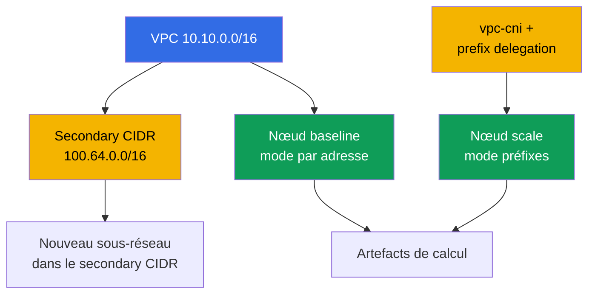
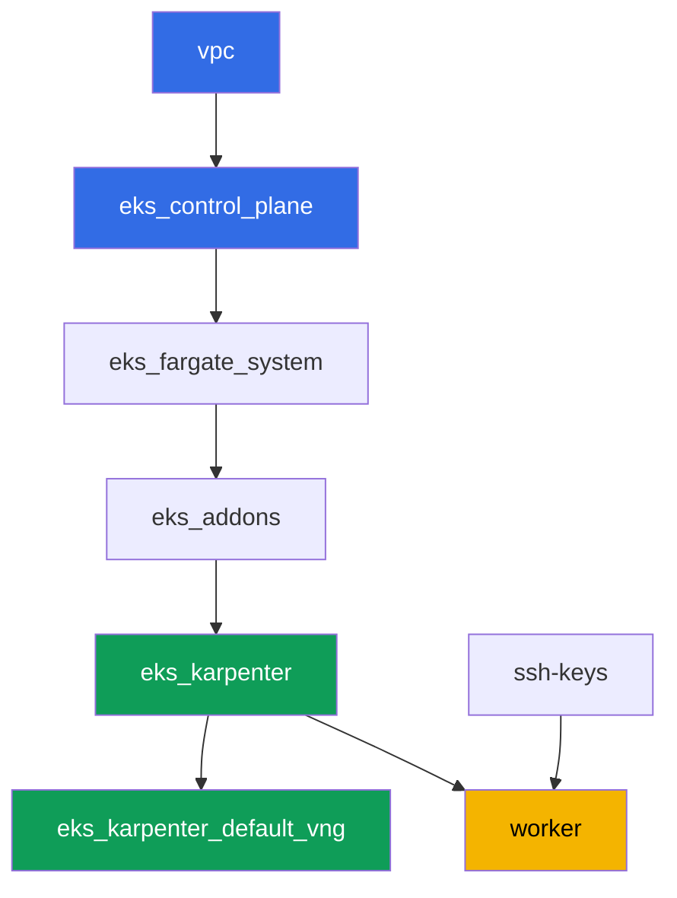

[Русская версия](README_RU.MD) · [Eng version](README.MD) · [Versión en español](README_ES.MD) · [Deutsche Version](README_DE.MD) · [ქართული ვერსია](README_GE.MD) · [繁體中文版](README_TW.MD) · [日本語版](README_JP.MD)

# Lab 103 - Plan d'adressage : limites d'ENI, prefix delegation, secondary CIDR

## Description

Le cluster sait déjà se déployer comme du code (lab 101) et laisser entrer les bonnes
personnes (lab 102). Ce lab traite d'une chose qui finit tôt ou tard par manquer sur tout
cluster en production : les adresses IP. Vous calculez la limite de pods par nœud avec la
formule ENI et IP par ENI, vous comparez ce calcul avec ce que kubelet indique réellement,
vous activez prefix delegation sur l'addon vpc-cni et vous vérifiez que cela ne change rien
aux nœuds existants, tandis que les nouveaux obtiennent nettement plus d'adresses. Ensuite
vous planifiez la taille d'un sous-réseau pour la croissance du cluster avec une marge pour
le warm pool et les rolling updates, et vous rattachez au VPC un second bloc CIDR, le
secondary CIDR - la solution classique quand la plage primaire du VPC arrive à épuisement.

Les tâches sont écrites dans un style production : un énoncé court plus des critères
d'acceptation. La vérification est automatique, via la commande `check_result`.

## Objectif

Consolider le contenu de ces chapitres du cours :

- [Chapitre 6. Réseau du cluster : VPC CNI, ENI et adresses IP, planification du
  CIDR](../../course/06/ru.md) - d'où viennent les adresses des pods et comment la limite
  de pods est calculée
- [Chapitre 7. Faire évoluer le plan d'adressage : prefix delegation, secondary CIDR,
  custom networking](../../course/07/ru.md) - quoi faire quand les adresses commencent à
  manquer
- [Chapitre 14. Densité et sizing : pods per node, limites d'ENI, requests et limits dans
  le cloud](../../course/14/ru.md) - comment la limite d'adresses correspond à la limite
  de ressources

## Ce que nous créons

Le cluster est déjà déployé comme du code (comme dans le lab 101). Vous créez une charge de
travail pour observer deux modes d'attribution d'adresses sur des nœuds réels, et vous
étendez le plan d'adressage du VPC.

| Objet | Ce que c'est | Pourquoi dans ce lab |
|--------|---------|-------------------|
| Deployment `baseline` | une petite charge de travail, le premier nœud EC2 | un nœud dans le mode normal, par adresse, de VPC CNI (chapitre 6) |
| Addon `vpc-cni` avec `ENABLE_PREFIX_DELEGATION` | configuration de l'addon géré | active le mode préfixes pour les nouveaux nœuds (chapitre 7) |
| Deployment `scale` | une charge de travail qui ne tient pas sur l'ancien nœud | force Karpenter à lever un nouveau nœud déjà en mode préfixes (chapitre 7) |
| Artefact `1/maxpods.txt` | calcul selon la formule et valeur réelle du nœud | la formule max-pods correspond à ce que voit kubelet (chapitre 14) |
| Artefact `2/prefixdelegation.txt` | comparaison entre l'ancien et le nouveau nœud | l'ancien nœud ne change pas, le nouveau a une limite nettement plus élevée (chapitres 6, 7) |
| Artefact `3/cidrplan.txt` | calcul de la taille du sous-réseau | choix d'un préfixe de sous-réseau avec marge pour le warm pool et les rolling updates (chapitre 6) |
| Secondary CIDR `100.64.0.0/16` + sous-réseau | un second bloc d'adresses du VPC | que faire quand le CIDR primaire arrive à épuisement (chapitre 7) |
| Artefact `5/diagnostics.txt` | analyse du diagnostic de pénurie d'adresses | apprendre à lire `FailedCreatePodSandBox` et `InsufficientCidrBlocks` (chapitre 6) |



## Infrastructure

L'environnement est déployé sur AWS (`eu-central-1`) via Terragrunt, comme dans le lab 101.
Chaque dossier du lab est un composant avec son propre `terragrunt.hcl`, qui référence un
module partagé dans `terraform/modules/` et déclare ses dépendances via des blocs
`dependency`.

### Modules et dépendances

| Dossier (composant) | Module (`terraform/modules/`) | Dépend de | Ce qu'il crée |
|---------------------|-------------------------------|------------|-------------|
| `vpc` | `vpc_v3` | - | VPC `10.10.0.0/16`, sous-réseaux publics et privés dans deux AZ, NAT |
| `ssh-keys` | `ssh-keys` | - | une paire de clés SSH pour la machine de travail et les nœuds |
| `eks_control_plane` | `eks_v2_control_plane` | `vpc` | control plane EKS `1.36`, OIDC, security groups |
| `eks_fargate_system` | `eks_v2_fargate` | `vpc`, `eks_control_plane` | profil Fargate pour `kube-system` et `karpenter` |
| `eks_addons` | `eks_v2_addons` | `eks_control_plane`, `eks_fargate_system` | addons coredns, kube-proxy, vpc-cni, pod-identity |
| `eks_karpenter` | `eks_v2_karpenter` | `vpc`, `eks_control_plane`, `eks_addons`, `eks_fargate_system` | contrôleur Karpenter, rôle IAM des nœuds |
| `eks_karpenter_default_vng` | `eks_v2_karpenter_vng` | `vpc`, `eks_control_plane`, `eks_karpenter` | NodePool par défaut `default` et EC2NodeClass sur AL2023 |
| `worker` | `eks_v2_work_pc` | `ssh-keys`, `vpc`, `eks_control_plane`, `eks_karpenter` | machine de travail avec kubectl, tests et `check_result` |

Graphe de dépendances (ce qui est appliqué en premier est plus bas dans la flèche), comme
dans le lab 101 :



Toutes les tâches du lab se résolvent depuis la machine de travail via `kubectl` et le CLI
`aws`, sans nouveau module terraform : l'addon `vpc-cni` lui-même est déjà déployé par le
composant `eks_addons`, et le changement de sa configuration (prefix delegation) ainsi que
le travail sur le CIDR du VPC se font via `aws eks update-addon` /
`aws ec2 associate-vpc-cidr-block` directement depuis le worker.

### Droits du worker pour la planification d'adresses

Le rôle du worker (`eks_v2_work_pc/iam.tf`) avait déjà de larges droits `ec2:Describe*` et
`eks:*` - suffisants pour tout le diagnostic (sous-réseaux, VPC, addons). Pour les tâches 2
et 4 de ce lab, où il faut modifier la configuration du VPC et de l'addon (pas seulement la
lire), un `Sid` supplémentaire `VpcCidrAndSubnetPlanningForLabs` a été ajouté à la
politique avec les droits `ec2:AssociateVpcCidrBlock`, `ec2:DisassociateVpcCidrBlock`,
`ec2:CreateSubnet`, `ec2:DeleteSubnet`, `ec2:CreateTags`, `eks:UpdateAddon`,
`eks:DescribeAddon`, `eks:DescribeUpdate` - sur le modèle des `Sid` déjà présents dans ce
fichier, sans changer le reste de la politique.

## Déploiement

```bash
TASK=103 make run_eks_task
```

Le déploiement prend environ 15-20 minutes. Dans la sortie, trouvez la ligne avec la
connexion SSH à la machine de travail et connectez-vous. kubectl y est déjà configuré pour
le bon cluster.

Commandes utiles sur la machine de travail :

```bash
time_left       # temps restant de l'environnement
check_result    # vérifier la solution
```

> Sécurité de l'environnement. Dans `env.hcl`, `ssh_password_enable = true` et
> `access_cidrs = ["0.0.0.0/0"]` sont activés - pratique pour un environnement
> d'apprentissage, mais à ne surtout pas faire en production. Selon les standards du
> cours, l'accès aux machines de travail doit passer par AWS SSM Session Manager sans
> exposer de ports SSH publics, et `access_cidrs` doit être restreint à des adresses
> précises. Ici, le SSH public est laissé uniquement pour simplifier le démarrage.

## Tâches

---
|        **1**        | **Calcul de max-pods par formule et comparaison avec la valeur réelle**             |
| :-----------------: | :---------------------------------------------------------- |
| Ce qu'il faut faire          | Créez le namespace `eks-103`, puis dans celui-ci le Deployment `baseline` (image `viktoruj/ping_pong:latest`, `2` réplicas), attendez qu'il soit prêt. Karpenter lèvera pour lui un nœud EC2 dans le mode normal, par adresse, de VPC CNI. Déterminez le type de ce nœud : `kubectl get node <node> -o jsonpath='{.metadata.labels.node\.kubernetes\.io/instance-type}'`. Via `aws ec2 describe-instance-types --instance-types <type> --query 'InstanceTypes[].NetworkInfo.[MaximumNetworkInterfaces,Ipv4AddressesPerInterface]'` et `...--query 'InstanceTypes[].VCpuInfo.DefaultVCpus'` obtenez le nombre d'ENI, les IP par ENI et les vCPU. Calculez avec la formule `max-pods = ENI * (IP par ENI - 1) + 2`, appliquez le plafond du managed node group (`110` si `vCPU < 30`, sinon `250`) et comparez le résultat avec la valeur réelle `kubectl get node <node> -o jsonpath='{.status.allocatable.pods}'`. Enregistrez tout dans `/var/work/tests/artifacts/1/maxpods.txt` ligne par ligne au format `clé=valeur` : `node`, `instance_type`, `eni`, `ips_per_eni`, `vcpu`, `formula`, `cap`, `expected_max_pods`, `actual_allocatable_pods`. |
| Critères d'acceptation    | - Deployment `baseline` dans `eks-103`, `2` réplicas prêts, le pod n'est pas sur Fargate;<br/>- le fichier contient les neuf clés;<br/>- `expected_max_pods` est égal à `actual_allocatable_pods` et les deux correspondent à la formule et au plafond. |
---
|        **2**        | **Prefix delegation : nouveau nœud contre ancien nœud**              |
| :-----------------: | :---------------------------------------------------------- |
| Ce qu'il faut faire          | Activez prefix delegation sur l'addon `vpc-cni` : `aws eks update-addon --cluster-name <name> --addon-name vpc-cni --configuration-values '{"env":{"ENABLE_PREFIX_DELEGATION":"true","WARM_PREFIX_TARGET":"1"}}' --resolve-conflicts PRESERVE`. Créez ensuite le Deployment `scale` dans `eks-103` (image `viktoruj/ping_pong:latest`, `6` réplicas, le conteneur a `resources.requests.cpu: "1"`) - cette charge ne tient pas sur le nœud `baseline`, et Karpenter lève pour elle un nouveau nœud déjà en mode préfixes. Attendez `kubectl rollout status deployment/scale -n eks-103`. Identifiez le nouveau nœud (n'importe quel nœud de `kubectl get po -n eks-103 -l app=scale -o jsonpath='{.items[*].spec.nodeName}'` différent du nœud `baseline`) et comparez `status.allocatable.pods` entre l'ancien et le nouveau nœud. Enregistrez dans `/var/work/tests/artifacts/2/prefixdelegation.txt` ligne par ligne au format `clé=valeur` : `old_node`, `old_node_allocatable_pods`, `new_node`, `new_node_instance_type`, `new_node_allocatable_pods`, et une explication en texte (au moins une ligne) expliquant pourquoi `old_node_allocatable_pods` n'a pas changé - kubelet a déjà calculé la limite au démarrage de l'ancien nœud, et prefix delegation ne concerne que les nouveaux nœuds. |
| Critères d'acceptation    | - l'addon `vpc-cni` contient `ENABLE_PREFIX_DELEGATION` avec la valeur `true`;<br/>- le Deployment `scale` est prêt (`6` réplicas);<br/>- `new_node` diffère de `old_node`, `new_node_allocatable_pods` est supérieur à `old_node_allocatable_pods`;<br/>- le fichier mentionne `prefix` et explique que l'ancien nœud n'a pas changé. |
---
|        **3**        | **Planification de la taille du sous-réseau pour la croissance**                    |
| :-----------------: | :---------------------------------------------------------- |
| Ce qu'il faut faire          | Au pic, le cluster doit distribuer des adresses à environ `850` pods, avec une marge de `20%` pour le warm pool de Karpenter et encore `15%` pour un rolling update simultané (les marges se multiplient de façon séquentielle). Calculez le besoin final d'adresses et choisissez un préfixe de sous-réseau dans le tableau : `/24` - total `256`, disponibles `251`; `/22` - total `1024`, disponibles `1019`; `/20` - total `4096`, disponibles `4091` (AWS réserve `5` adresses par sous-réseau). Enregistrez le calcul et la justification du choix dans `/var/work/tests/artifacts/3/cidrplan.txt` : le besoin final d'adresses, pourquoi `/24` et `/22` ne conviennent pas, pourquoi `/20` est choisi, et de combien de fois les adresses disponibles dépassent le besoin. |
| Critères d'acceptation    | - le fichier n'est pas vide, il contient le besoin final d'adresses;<br/>- il mentionne `251`, `1019` et `4091`;<br/>- il conclut avec `/20` comme préfixe de sous-réseau choisi;<br/>- il mentionne `warm pool` et `rolling update`. |
---
|        **4**        | **Secondary CIDR : nous étendons le plan d'adressage du VPC**              |
| :-----------------: | :---------------------------------------------------------- |
| Ce qu'il faut faire          | Trouvez le `vpc-id` du cluster (`aws eks describe-cluster ... --query 'cluster.resourcesVpcConfig.vpcId'`). Rattachez au VPC un second bloc CIDR, secondary CIDR, issu du shared address space RFC 6598 : `aws ec2 associate-vpc-cidr-block --vpc-id <id> --cidr-block 100.64.0.0/16`. Attendez l'état `associated` (`aws ec2 describe-vpcs --vpc-ids <id> --query 'Vpcs[].CidrBlockAssociationSet[].{CIDR:CidrBlock,State:CidrBlockState.State}'`). Créez dans le nouveau bloc le sous-réseau `100.64.1.0/24` (`aws ec2 create-subnet --vpc-id <id> --cidr-block 100.64.1.0/24 --availability-zone eu-central-1a`). Enregistrez la sortie de `describe-vpcs` (avec le statut `associated`) et l'id du nouveau sous-réseau dans `/var/work/tests/artifacts/4/secondary_cidr.txt`. |
| Critères d'acceptation    | - le VPC a un `CidrBlockAssociationSet` avec `100.64.0.0/16` à l'état `associated`;<br/>- un sous-réseau avec le CIDR `100.64.1.0/24` existe dans ce VPC;<br/>- le fichier mentionne `100.64.0.0/16` et `associated`. |
---
|        **5**        | **Diagnostic d'une pénurie d'adresses (sans panne réelle)**      |
| :-----------------: | :---------------------------------------------------------- |
| Ce qu'il faut faire          | Ne cassez pas l'infrastructure du lab. Étudiez comment diagnostiquer une pénurie d'adresses IP sur un cluster réel, et décrivez-le avec de vraies commandes sur le cluster actuel. Exécutez `aws ec2 describe-subnets --query 'Subnets[].[SubnetId,AvailabilityZone,CidrBlock,AvailableIpAddressCount]'` pour les sous-réseaux du cluster et notez les valeurs actuelles de `AvailableIpAddressCount`. Dans le fichier `/var/work/tests/artifacts/5/diagnostics.txt`, écrivez une explication : si un pod ne peut pas obtenir d'adresse, `kubectl describe pod` affichera un événement `FailedCreatePodSandBox` venant de `aws-cni`; si le sous-réseau n'a pas de bloc contigu `/28` pour un préfixe, les logs `ipamd`/`aws-node` afficheront une erreur `InsufficientCidrBlocks`, même si l'`AvailableIpAddressCount` du sous-réseau paraît élevé (c'est un signe de fragmentation, pas de pénurie globale); et un `0` dans l'`AvailableIpAddressCount` d'une AZ est un diagnostic direct d'épuisement des adresses. |
| Critères d'acceptation    | - le fichier n'est pas vide;<br/>- il mentionne `FailedCreatePodSandBox`, `InsufficientCidrBlocks` et `AvailableIpAddressCount`. |
---

## Vérification du résultat

Sur la machine de travail, lancez la vérification automatique :

```bash
check_result
```

Le script exécutera les tests et affichera le pourcentage de tâches accomplies.

## Solution

Solution de référence : [worker/files/solutions/1_FR.MD](worker/files/solutions/1_FR.MD)

## Suppression du cluster et des ressources

> Avant de supprimer. Le sous-réseau `100.64.1.0/24` et le secondary CIDR
> `100.64.0.0/16` de la tâche 4 ont été créés à la main via le CLI AWS, pas via
> terraform - le state n'en sait rien. Supprimez-les vous-même, sinon
> `terragrunt destroy` refusera de supprimer le VPC en raison du sous-réseau
> dépendant restant. Récupérez le nom du cluster - `<cluster>` dans l'exemple ci-dessous
> - ainsi : `aws eks list-clusters --query 'clusters[0]' --output text`.
>
> ```bash
> CLUSTER=$(aws eks list-clusters --query 'clusters[0]' --output text)
> VPC=$(aws eks describe-cluster --name "$CLUSTER" \
>   --query 'cluster.resourcesVpcConfig.vpcId' --output text)
> SUBNET=$(aws ec2 describe-subnets \
>   --filters "Name=vpc-id,Values=$VPC" "Name=cidr-block,Values=100.64.1.0/24" \
>   --query 'Subnets[0].SubnetId' --output text)
> aws ec2 delete-subnet --subnet-id "$SUBNET"
>
> ASSOC=$(aws ec2 describe-vpcs --vpc-ids "$VPC" \
>   --query "Vpcs[].CidrBlockAssociationSet[?CidrBlock=='100.64.0.0/16'].AssociationId" \
>   --output text)
> aws ec2 disassociate-vpc-cidr-block --association-id "$ASSOC"
> ```

```bash
TASK=103 make delete_eks_task
```
