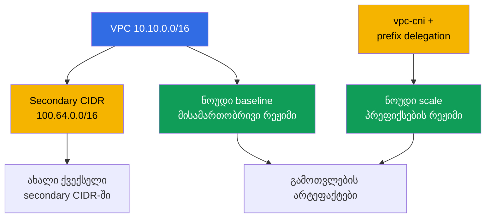
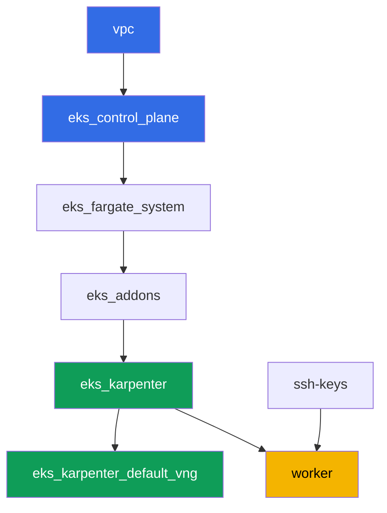

[Русская версия](README_RU.MD) · [Eng version](README.MD) · [Versión en español](README_ES.MD) · [Version française](README_FR.MD) · [Deutsche Version](README_DE.MD) · [繁體中文版](README_TW.MD) · [日本語版](README_JP.MD)

# ლაბა 103 - მისამართების გეგმა: ENI-ის ლიმიტები, prefix delegation, secondary CIDR

## აღწერა

კლასტერს უკვე შეუძლია დეპლოირება როგორც კოდი (ლაბა 101) და სწორი ხალხის შეშვება (ლაბა
102). ეს ლაბა იმაზეა, რაც ადრე თუ გვიან მთავრდება ნებისმიერ ცოცხალ კლასტერზე:
IP-მისამართებზე. თქვენ ითვლით პოდების ლიმიტს ნოუდზე ENI-ისა და IP-ის ENI-ზე ფორმულით,
ადარებთ გამოთვლილს იმას, რასაც რეალურად აჩვენებს kubelet, ჩართავთ prefix delegation-ს
vpc-cni აddon-ზე და ადასტურებთ, რომ ეს ძველ ნოუდებს არ ეხება, ხოლო ახლები საგრძნობლად
მეტ მისამართს იღებენ. შემდეგ თქვენ გეგმავთ ქვექსელის ზომას კლასტერის ზრდისთვის, მარგინით
warm pool-ისა და rolling update-ისთვის, და აერთებთ VPC-ს მეორე, secondary CIDR-ბლოკს -
კლასიკური ხერხი, როცა VPC-ის პირველადი დიაპაზონი ამოიწურება.

დავალებები დაწერილია production-სტილში: მოკლე დავალება პლუს მიღების კრიტერიუმები.
შემოწმება ავტომატურია, ბრძანებით `check_result`.

## მიზანი

გავამყაროთ კურსის ამ თავების მასალა:

- [თავი 6. კლასტერის ქსელი: VPC CNI, ENI და IP-მისამართები, CIDR-ის
  დაგეგმვა](../../course/06/ge.md) - საიდან იღებენ პოდები მისამართებს და როგორ ითვლება
  პოდების ლიმიტი
- [თავი 7. მისამართების გეგმის მასშტაბირება: prefix delegation, secondary CIDR, custom
  networking](../../course/07/ge.md) - რა ვქნათ, როცა მისამართები აღარ არის საკმარისი
- [თავი 14. სიმჭვრეტე და sizing: pods per node, ENI-ის ლიმიტები, requests და limits
  ღრუბელში](../../course/14/ge.md) - როგორ ემთხვევა მისამართების ლიმიტი რესურსების
  ლიმიტს

## რას ვქმნით

კლასტერი უკვე დეპლოირებულია როგორც კოდი (როგორც ლაბა 101-ში). თქვენ ქმნით დატვირთვას,
რომ ნახოთ ორი მისამართის გამოყოფის რეჟიმი ცოცხალ ნოუდებზე, და აფართოებთ VPC-ის
მისამართების გეგმას.

| ობიექტი | რა არის ეს | რისთვის ამ ლაბაში |
|--------|---------|-------------------|
| Deployment `baseline` | მცირე დატვირთვა, პირველი EC2-ნოუდი | ნოუდი VPC CNI-ის ჩვეულ, მისამართობრივ რეჟიმში (თავი 6) |
| Addon `vpc-cni` `ENABLE_PREFIX_DELEGATION`-ით | managed addon-ის კონფიგურაცია | ჩართავს პრეფიქსების რეჟიმს ახალი ნოუდებისთვის (თავი 7) |
| Deployment `scale` | დატვირთვა, რომელიც ძველ ნოუდზე არ ეხერხება | აიძულებს Karpenter-ს ასწიოს ახალი ნოუდი უკვე პრეფიქსების რეჟიმში (თავი 7) |
| არტეფაქტი `1/maxpods.txt` | ფორმულით გამოთვლა და ფაქტი ნოუდიდან | max-pods-ის ფორმულა ემთხვევა იმას, რასაც ხედავს kubelet (თავი 14) |
| არტეფაქტი `2/prefixdelegation.txt` | ძველი და ახალი ნოუდის შედარება | ძველი ნოუდი არ იცვლება, ახალს საგრძნობლად მაღალი ლიმიტი აქვს (თავები 6, 7) |
| არტეფაქტი `3/cidrplan.txt` | ქვექსელის ზომის გამოთვლა | ქვექსელის პრეფიქსის შერჩევა მარგინით warm pool-ისა და rolling update-ისთვის (თავი 6) |
| Secondary CIDR `100.64.0.0/16` + ქვექსელი | VPC-ის მეორე მისამართების ბლოკი | რა ვქნათ, როცა პირველადი CIDR ამოიწურება (თავი 7) |
| არტეფაქტი `5/diagnostics.txt` | მისამართების უკმარისობის დიაგნოსტიკის ანალიზი | ვსწავლობთ `FailedCreatePodSandBox`-ისა და `InsufficientCidrBlocks`-ის წაკითხვას (თავი 6) |



## ინფრასტრუქტურა

გარემო დეპლოირდება AWS-ში (`eu-central-1`) Terragrunt-ის მეშვეობით, როგორც ლაბა 101-ში.
ლაბის ყოველი დირექტორია ერთი კომპონენტია საკუთარი `terragrunt.hcl`-ით, რომელიც მიმართავს
საერთო მოდულს `terraform/modules/`-ში და აცხადებს დამოკიდებულებებს `dependency`
ბლოკებით.

### მოდულები და დამოკიდებულებები

| დირექტორია (კომპონენტი) | მოდული (`terraform/modules/`) | დამოკიდებულია | რას ქმნის |
|---------------------|-------------------------------|------------|-------------|
| `vpc` | `vpc_v3` | - | VPC `10.10.0.0/16`, საჯარო და პრივატული ქვექსელები ორ AZ-ში, NAT |
| `ssh-keys` | `ssh-keys` | - | SSH-გასაღებების წყვილი სამუშაო მანქანისა და ნოუდებისთვის |
| `eks_control_plane` | `eks_v2_control_plane` | `vpc` | EKS control plane `1.36`, OIDC, security groups |
| `eks_fargate_system` | `eks_v2_fargate` | `vpc`, `eks_control_plane` | Fargate-პროფილი `kube-system`-ისთვის და `karpenter`-ისთვის |
| `eks_addons` | `eks_v2_addons` | `eks_control_plane`, `eks_fargate_system` | დამატებები coredns, kube-proxy, vpc-cni, pod-identity |
| `eks_karpenter` | `eks_v2_karpenter` | `vpc`, `eks_control_plane`, `eks_addons`, `eks_fargate_system` | Karpenter-ის კონტროლერი, ნოუდების IAM-როლი |
| `eks_karpenter_default_vng` | `eks_v2_karpenter_vng` | `vpc`, `eks_control_plane`, `eks_karpenter` | ნაგულისხმევი NodePool `default` და EC2NodeClass AL2023-ზე |
| `worker` | `eks_v2_work_pc` | `ssh-keys`, `vpc`, `eks_control_plane`, `eks_karpenter` | სამუშაო მანქანა kubectl-ით, ტესტებით და `check_result`-ით |

დამოკიდებულებების გრაფი (რაც უფრო ადრე აპლიცირდება, ის ხრიხისკენ ქვემოთაა), როგორც ლაბა
101-ში:



ლაბის ყველა დავალება წყდება სამუშაო მანქანიდან `kubectl`-ითა და `aws` CLI-ით, ახალი
terraform-მოდულების გარეშე: თავად addon `vpc-cni` უკვე დეპლოირებულია კომპონენტ
`eks_addons`-ის მიერ, ხოლო მისი კონფიგურაციის ცვლილება (prefix delegation) და VPC-ის
CIDR-თან მუშაობა სრულდება `aws eks update-addon` / `aws ec2 associate-vpc-cidr-block`
ბრძანებებით პირდაპირ worker-იდან.

### Worker-ის უფლებები მისამართების დაგეგმვისთვის

Worker-ის როლს (`eks_v2_work_pc/iam.tf`) უკვე ჰქონდა ფართო `ec2:Describe*` და `eks:*`
უფლებები - ეს საკმარისია ყველა დიაგნოსტიკისთვის (ქვექსელები, VPC, addon-ები). ამ ლაბის 2
და 4 დავალებისთვის, სადაც საჭიროა VPC-ისა და addon-ის კონფიგურაციის შეცვლა (არა მხოლოდ
წაკითხვა), პოლიტიკას დაემატა ერთი დამატებითი `Sid`
`VpcCidrAndSubnetPlanningForLabs` უფლებებით `ec2:AssociateVpcCidrBlock`,
`ec2:DisassociateVpcCidrBlock`, `ec2:CreateSubnet`, `ec2:DeleteSubnet`, `ec2:CreateTags`,
`eks:UpdateAddon`, `eks:DescribeAddon`, `eks:DescribeUpdate` - ამ ფაილში უკვე
არსებული `Sid`-ების ანალოგიით, დანარჩენი პოლიტიკის შეცვლის გარეშე.

## განლაგება

```bash
TASK=103 make run_eks_task
```

განლაგება გრძელდება დაახლოებით 15-20 წუთი. output-ში მოძებნეთ ხაზი SSH-შეერთებით
სამუშაო მანქანასთან და დაუკავშირდით მას. kubectl იქ უკვე კონფიგურირებულია საჭირო
კლასტერზე.

სასარგებლო ბრძანებები სამუშაო მანქანაზე:

```bash
time_left       # რამდენი დრო დარჩა გარემოს
check_result    # გადამოწმება
```

> სტენდის უსაფრთხოება. `env.hcl`-ში ჩართულია `ssh_password_enable = true` და
> `access_cidrs = ["0.0.0.0/0"]` - ეს მოსახერხებელია სასწავლო გარემოსთვის, მაგრამ ასე არ
> უნდა გავხადოთ production-ში. კურსის სტანდარტების მიხედვით სამუშაო მანქანებზე წვდომა
> იხსნება AWS SSM Session Manager-ის მეშვეობით, საჯარო SSH-პორტების გარეთ გამოტანის
> გარეშე, ხოლო `access_cidrs` ვიწროვდება კონკრეტულ მისამართებზე. აქ საჯარო SSH
> დარჩენილია მხოლოდ გაშვების გასამარტივებლად.

## დავალებები

---
|        **1**        | **max-pods-ის გამოთვლა ფორმულით და ფაქტთან შედარება**             |
| :-----------------: | :---------------------------------------------------------- |
| რას ვაკეთებთ          | შექმენით namespace `eks-103`, მასში Deployment `baseline` (image `viktoruj/ping_pong:latest`, `2` რეპლიკა) და დაელოდეთ მზაობას. Karpenter მისთვის ასწევს EC2-ნოუდს VPC CNI-ის ჩვეულ, მისამართობრივ რეჟიმში. დაადგინეთ ამ ნოუდის ტიპი: `kubectl get node <node> -o jsonpath='{.metadata.labels.node\.kubernetes\.io/instance-type}'`. `aws ec2 describe-instance-types --instance-types <type> --query 'InstanceTypes[].NetworkInfo.[MaximumNetworkInterfaces,Ipv4AddressesPerInterface]'`-ითა და `...--query 'InstanceTypes[].VCpuInfo.DefaultVCpus'`-ით მიიღეთ ENI-ის რაოდენობა, IP ENI-ზე და vCPU. გამოთვალეთ ფორმულით `max-pods = ENI * (IP ENI-ზე - 1) + 2`, გამოიყენეთ managed node group-ის cap (`110`, თუ `vCPU < 30`, სხვაგვარად `250`) და შეადარეთ შედეგი ფაქტს `kubectl get node <node> -o jsonpath='{.status.allocatable.pods}'`-იდან. შეინახეთ ყველაფერი ხაზ-ხაზ ფორმატში `key=value` ფაილში `/var/work/tests/artifacts/1/maxpods.txt`: `node`, `instance_type`, `eni`, `ips_per_eni`, `vcpu`, `formula`, `cap`, `expected_max_pods`, `actual_allocatable_pods`. |
| მიღების კრიტერიუმები    | - Deployment `baseline` `eks-103`-ში, `2` მზა რეპლიკა, პოდი არ არის Fargate-ზე;<br/>- ფაილი შეიცავს ცხრავე გასაღებს;<br/>- `expected_max_pods` ტოლია `actual_allocatable_pods`-ის და ორივე ემთხვევა ფორმულასა და cap-ს. |
---
|        **2**        | **Prefix delegation: ახალი ნოუდი ძველის წინააღმდეგ**              |
| :-----------------: | :---------------------------------------------------------- |
| რას ვაკეთებთ          | ჩართეთ prefix delegation addon `vpc-cni`-ზე: `aws eks update-addon --cluster-name <name> --addon-name vpc-cni --configuration-values '{"env":{"ENABLE_PREFIX_DELEGATION":"true","WARM_PREFIX_TARGET":"1"}}' --resolve-conflicts PRESERVE`. შემდეგ შექმენით Deployment `scale` `eks-103`-ში (image `viktoruj/ping_pong:latest`, `6` რეპლიკა, კონტეინერს `resources.requests.cpu: "1"`) - ასეთი დატვირთვა ნოუდ `baseline`-ზე არ ეხერხება, და Karpenter მისთვის ასწევს ახალ ნოუდს უკვე პრეფიქსების რეჟიმში. დაელოდეთ `kubectl rollout status deployment/scale -n eks-103`-ს. დაადგინეთ ახალი ნოუდი (ნებისმიერი ნოუდი `kubectl get po -n eks-103 -l app=scale -o jsonpath='{.items[*].spec.nodeName}'`-იდან, რომელიც განსხვავდება ნოუდ `baseline`-სგან) და შეადარეთ `status.allocatable.pods` ძველი და ახალი ნოუდის. შეინახეთ `/var/work/tests/artifacts/2/prefixdelegation.txt`-ში ხაზ-ხაზ ფორმატში `key=value`: `old_node`, `old_node_allocatable_pods`, `new_node`, `new_node_instance_type`, `new_node_allocatable_pods`, და ტექსტური განმარტება (მინიმუმ ერთი ხაზი), თუ რატომ არ შეიცვალა `old_node_allocatable_pods` - kubelet-მა უკვე გამოთვალა ლიმიტი ძველი ნოუდის სტარტისას, და prefix delegation მხოლოდ ახალ ნოუდებს ეხება. |
| მიღების კრიტერიუმები    | - addon `vpc-cni` შეიცავს `ENABLE_PREFIX_DELEGATION`-ს მნიშვნელობით `true`;<br/>- Deployment `scale` მზადაა (`6` რეპლიკა);<br/>- `new_node` განსხვავდება `old_node`-სგან, `new_node_allocatable_pods` მეტია `old_node_allocatable_pods`-ზე;<br/>- ფაილი ახსენებს `prefix`-ს და განმარტავს, რომ ძველი ნოუდი არ შეცვლილა. |
---
|        **3**        | **ქვექსელის ზომის დაგეგმვა ზრდისთვის**                    |
| :-----------------: | :---------------------------------------------------------- |
| რას ვაკეთებთ          | პიკზე კლასტერს საჭიროებს დაუნაწილოს მისამართები დაახლოებით `850` პოდისთვის, მარგინით `20%` Karpenter-ის warm pool-ისთვის და კიდევ `15%` პარალელური rolling update-ისთვის (მარგინები ერთმანეთზე მიმდევრობით მრავლდება). გამოთვალეთ მისამართების საბოლოო საჭიროება და შერჩიეთ ქვექსელის პრეფიქსი ცხრილიდან: `/24` - სულ `256`, ხელმისაწვდომი `251`; `/22` - სულ `1024`, ხელმისაწვდომი `1019`; `/20` - სულ `4096`, ხელმისაწვდომი `4091` (AWS რეზერვირებს `5` მისამართს ქვექსელზე). შეინახეთ გამოთვლა და არჩევანის დასაბუთება `/var/work/tests/artifacts/3/cidrplan.txt`-ში: მისამართების საბოლოო საჭიროება, რატომ არ ეხერხება `/24` და `/22`, რატომ შეირჩა `/20`, და რამდენჯერ მეტია ხელმისაწვდომი მისამართები საჭიროებაზე. |
| მიღების კრიტერიუმები    | - ფაილი არ არის ცარიელი, შეიცავს მისამართების საბოლოო საჭიროებას;<br/>- ახსენებს `251`, `1019` და `4091`-ს;<br/>- შეიცავს დასკვნას `/20`-ზე, როგორც შერჩეულ ქვექსელის პრეფიქსზე;<br/>- ახსენებს `warm pool`-ს და `rolling update`-ს. |
---
|        **4**        | **Secondary CIDR: ვაფართოებთ VPC-ის მისამართების გეგმას**              |
| :-----------------: | :---------------------------------------------------------- |
| რას ვაკეთებთ          | გაარკვიეთ კლასტერის `vpc-id` (`aws eks describe-cluster ... --query 'cluster.resourcesVpcConfig.vpcId'`). შეაერთეთ VPC-ს მეორე, secondary CIDR-ბლოკი RFC 6598 shared address space-იდან: `aws ec2 associate-vpc-cidr-block --vpc-id <id> --cidr-block 100.64.0.0/16`. დაელოდეთ სტატუსს `associated` (`aws ec2 describe-vpcs --vpc-ids <id> --query 'Vpcs[].CidrBlockAssociationSet[].{CIDR:CidrBlock,State:CidrBlockState.State}'`). ახალ ბლოკში შექმენით ქვექსელი `100.64.1.0/24` (`aws ec2 create-subnet --vpc-id <id> --cidr-block 100.64.1.0/24 --availability-zone eu-central-1a`). შეინახეთ `describe-vpcs`-ის output (სტატუსით `associated`) და ახალი ქვექსელის id `/var/work/tests/artifacts/4/secondary_cidr.txt`-ში. |
| მიღების კრიტერიუმები    | - VPC-ს აქვს `CidrBlockAssociationSet` `100.64.0.0/16`-ით სტატუსში `associated`;<br/>- ამ VPC-ში არსებობს ქვექსელი CIDR-ით `100.64.1.0/24`;<br/>- ფაილი ახსენებს `100.64.0.0/16`-ს და `associated`-ს. |
---
|        **5**        | **მისამართების უკმარისობის დიაგნოსტიკა (რეალური გაუმართაობის გარეშე)**      |
| :-----------------: | :---------------------------------------------------------- |
| რას ვაკეთებთ          | არ დააზიანოთ ლაბის ინფრასტრუქტურა. შეისწავლეთ, როგორ დაიდიაგნოსტიკება IP-მისამართების უკმარისობა ცოცხალ კლასტერზე, და აღწერეთ ეს მიმდინარე კლასტერზე რეალური ბრძანებების მაგალითზე. გაუშვით `aws ec2 describe-subnets --query 'Subnets[].[SubnetId,AvailabilityZone,CidrBlock,AvailableIpAddressCount]'` კლასტერის ქვექსელებისთვის და ჩაწერეთ `AvailableIpAddressCount`-ის მიმდინარე მნიშვნელობები. ფაილში `/var/work/tests/artifacts/5/diagnostics.txt` ჩაწერეთ განმარტება: თუ პოდი არ ახერხებს მისამართის მიღებას, `kubectl describe pod` აჩვენებს ივენთს `FailedCreatePodSandBox` `aws-cni`-დან; თუ ქვექსელში არ არსებობს უწყვეტი `/28` ბლოკი პრეფიქსისთვის, `ipamd`/`aws-node`-ის ლოგებში იქნება შეცდომა `InsufficientCidrBlocks`, მაშინაც, როცა ქვექსელის `AvailableIpAddressCount` დიდი ჩანს (ეს ფრაგმენტაციის ნიშანია, არა ზოგადი უკმარისობის); ხოლო `0` საკუთარი AZ-ის `AvailableIpAddressCount`-ში - მისამართების ამოწურვის პირდაპირი დიაგნოზია. |
| მიღების კრიტერიუმები    | - ფაილი არ არის ცარიელი;<br/>- ახსენებს `FailedCreatePodSandBox`-ს, `InsufficientCidrBlocks`-ს და `AvailableIpAddressCount`-ს. |
---

## შედეგის შემოწმება

სამუშაო მანქანაზე გაუშვით ავტომატური შემოწმება:

```bash
check_result
```

სკრიპტი გაუშვებს ტესტებს და გამოაჩენს შესრულებული დავალებების პროცენტს.

## გადაწყვეტა

ეტალონური გადაწყვეტა: [worker/files/solutions/1_GE.MD](worker/files/solutions/1_GE.MD)

## კლასტერისა და რესურსების წაშლა

> წაშლის წინ. ქვექსელი `100.64.1.0/24` და secondary CIDR `100.64.0.0/16` დავალება 4-იდან
> შექმნილია ხელით AWS CLI-ის მეშვეობით, არა terraform-ით - state მათ შესახებ არაფერს
> იცის. წაშალეთ ისინი თავად, სხვაგვარად `terragrunt destroy` არ დათმობს VPC-ის წაშლას
> დარჩენილი დამოკიდებული ქვექსელის გამო. კლასტერის სახელი - `<cluster>` ქვემოთ
> მაგალითში - მიიღეთ ასე: `aws eks list-clusters --query 'clusters[0]' --output text`.
>
> ```bash
> CLUSTER=$(aws eks list-clusters --query 'clusters[0]' --output text)
> VPC=$(aws eks describe-cluster --name "$CLUSTER" \
>   --query 'cluster.resourcesVpcConfig.vpcId' --output text)
> SUBNET=$(aws ec2 describe-subnets \
>   --filters "Name=vpc-id,Values=$VPC" "Name=cidr-block,Values=100.64.1.0/24" \
>   --query 'Subnets[0].SubnetId' --output text)
> aws ec2 delete-subnet --subnet-id "$SUBNET"
>
> ASSOC=$(aws ec2 describe-vpcs --vpc-ids "$VPC" \
>   --query "Vpcs[].CidrBlockAssociationSet[?CidrBlock=='100.64.0.0/16'].AssociationId" \
>   --output text)
> aws ec2 disassociate-vpc-cidr-block --association-id "$ASSOC"
> ```

```bash
TASK=103 make delete_eks_task
```
