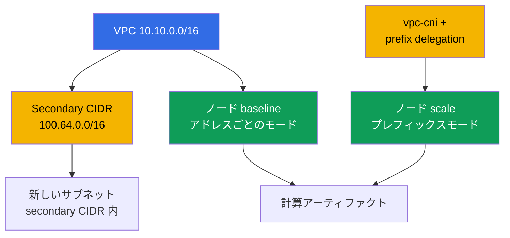
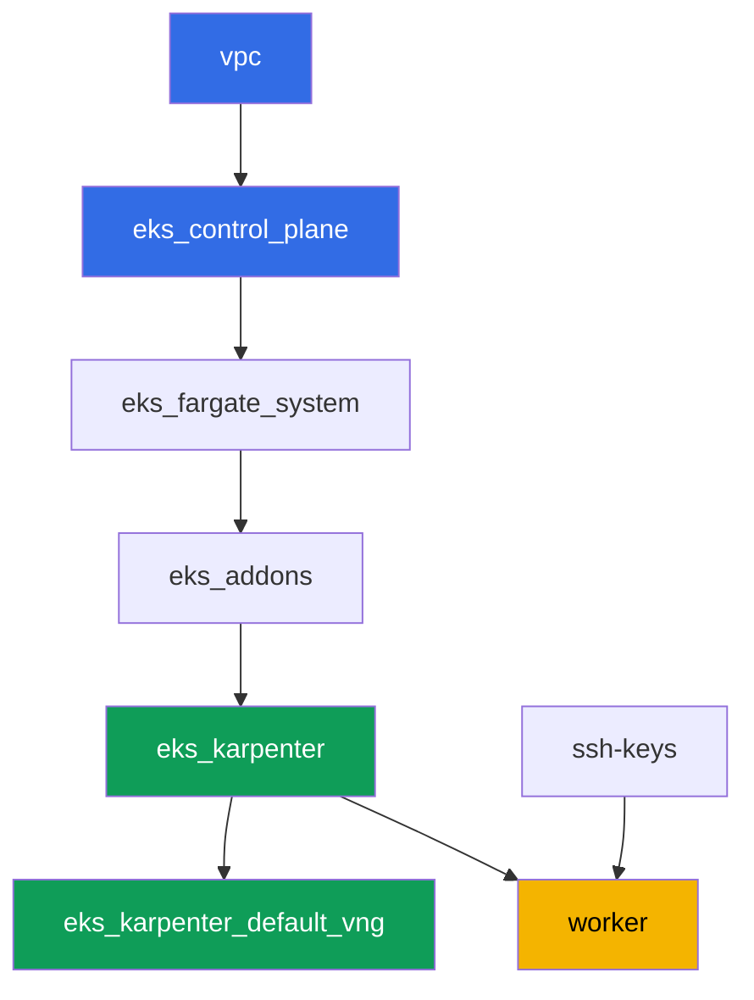

[Русская версия](README_RU.MD) · [Eng version](README.MD) · [Versión en español](README_ES.MD) · [Version française](README_FR.MD) · [Deutsche Version](README_DE.MD) · [ქართული ვერსია](README_GE.MD) · [繁體中文版](README_TW.MD)

# ラボ 103 - アドレスプラン:ENI 上限、prefix delegation、secondary CIDR

## 説明

クラスタはすでにコードとしてデプロイできる(ラボ 101)し、適切な人だけを入れることも
できます(ラボ 102)。このラボは、どんな稼働中のクラスタでも遅かれ早かれ尽きるもの、
つまり IP アドレスについてです。ENI と ENI あたりの IP 数の式でノードあたりの Pod 上限
を計算し、その計算結果を kubelet が実際に示す値と照合し、vpc-cni アドオンで prefix
delegation を有効化して、既存のノードには変化がなく、新しいノードは明らかに多くの
アドレスを得られることを確認します。その後、warm pool と rolling update のため
の余裕を持ってクラスタの成長に合わせたサブネットサイズを計画し、VPC に 2 つ目の
アドレスブロック、secondary CIDR を接続します - VPC のプライマリレンジが尽きかけた
ときの定番の対処法です。

タスクは production スタイルで書かれています:短い課題文とアクセプタンス基準。検証は
`check_result` コマンドによって自動的に行われます。

## 目的

コースの以下の章の内容を定着させます:

- [第 6 章。クラスタネットワーク:VPC CNI、ENI、IP アドレス、CIDR
  計画](../../course/06/jp.md) - Pod のアドレスがどこから来るか、Pod 上限がどう計算
  されるか
- [第 7 章。アドレスプランのスケール:prefix delegation、secondary CIDR、custom
  networking](../../course/07/jp.md) - アドレスが足りなくなったときにどうするか
- [第 14 章。密度とサイジング:pods per node、ENI 上限、クラウドにおける requests と
  limits](../../course/14/jp.md) - アドレス上限がリソース上限とどう対応するか

## 作成するもの

このラボでは、クラスタは既にコードとしてデプロイされています(ラボ 101 と同様)。稼働中
のノードで 2 つのアドレス割り当てモードを観察するためのワークロードを作成し、VPC の
アドレスプランを拡張します。

| オブジェクト | 何か | このラボでの目的 |
|--------|---------|-------------------|
| Deployment `baseline` | 小さなワークロード、最初の EC2 ノード | VPC CNI の通常の、アドレスごとのモードにあるノード(第 6 章) |
| `ENABLE_PREFIX_DELEGATION` を持つアドオン `vpc-cni` | managed addon の設定 | 新しいノード向けにプレフィックスモードを有効化する(第 7 章) |
| Deployment `scale` | 古いノードに収まらないワークロード | Karpenter に、すでにプレフィックスモードの新しいノードを立ち上げさせる(第 7 章) |
| アーティファクト `1/maxpods.txt` | 式による計算とノードからの実際の値 | max-pods の式が kubelet の見ている値と一致する(第 14 章) |
| アーティファクト `2/prefixdelegation.txt` | 古いノードと新しいノードの比較 | 古いノードは変わらず、新しいノードの上限は明らかに高い(第 6、7 章) |
| アーティファクト `3/cidrplan.txt` | サブネットサイズの計算 | warm pool と rolling update の余裕を持ったサブネットプレフィックスの選定(第 6 章) |
| Secondary CIDR `100.64.0.0/16` + サブネット | VPC の 2 つ目のアドレスブロック | プライマリ CIDR が尽きかけたときにどうするか(第 7 章) |
| アーティファクト `5/diagnostics.txt` | アドレス不足診断の整理 | `FailedCreatePodSandBox` と `InsufficientCidrBlocks` の読み方を学ぶ(第 6 章) |



## インフラストラクチャ

環境は Terragrunt によって AWS(`eu-central-1`)にデプロイされます。ラボ 101 と同様
です。ラボの各ディレクトリは 1 つのコンポーネントであり、それぞれ独自の
`terragrunt.hcl` を持ち、`terraform/modules/` の共有モジュールを参照し、
`dependency` ブロックで依存関係を宣言します。

### モジュールと依存関係

| ディレクトリ(コンポーネント) | モジュール(`terraform/modules/`) | 依存先 | 作成されるもの |
|---------------------|-------------------------------|------------|-------------|
| `vpc` | `vpc_v3` | - | VPC `10.10.0.0/16`、2 つの AZ にあるパブリックとプライベートのサブネット、NAT |
| `ssh-keys` | `ssh-keys` | - | ワーカーマシンとノード用の SSH キーペア |
| `eks_control_plane` | `eks_v2_control_plane` | `vpc` | EKS control plane `1.36`、OIDC、security groups |
| `eks_fargate_system` | `eks_v2_fargate` | `vpc`、`eks_control_plane` | `kube-system` と `karpenter` 用の Fargate profile |
| `eks_addons` | `eks_v2_addons` | `eks_control_plane`、`eks_fargate_system` | coredns、kube-proxy、vpc-cni、pod-identity のアドオン |
| `eks_karpenter` | `eks_v2_karpenter` | `vpc`、`eks_control_plane`、`eks_addons`、`eks_fargate_system` | Karpenter コントローラ、ノードの IAM ロール |
| `eks_karpenter_default_vng` | `eks_v2_karpenter_vng` | `vpc`、`eks_control_plane`、`eks_karpenter` | デフォルトの NodePool `default` と AL2023 上の EC2NodeClass |
| `worker` | `eks_v2_work_pc` | `ssh-keys`、`vpc`、`eks_control_plane`、`eks_karpenter` | kubectl、テスト、`check_result` を備えたワーカーマシン |

依存関係グラフ(先に適用されるものほど矢印の下側にある)、ラボ 101 と同様です:



このラボのタスクはすべてワーカーマシンから `kubectl` と `aws` CLI で解決します。新しい
terraform モジュールは不要です:アドオン `vpc-cni` 自体はすでに `eks_addons`
コンポーネントによってデプロイされており、その設定変更(prefix delegation)と VPC の
CIDR に関する作業は、worker から直接 `aws eks update-addon` /
`aws ec2 associate-vpc-cidr-block` で行います。

### アドレス計画のための worker の権限

worker のロール(`eks_v2_work_pc/iam.tf`)は既に広範な `ec2:Describe*` と `eks:*` を
持っていました - これは診断作業すべて(サブネット、VPC、アドオン)に十分です。このラボ
のタスク 2 と 4 では、VPC とアドオンの設定を(読み取るだけでなく)変更する必要がある
ため、ポリシーに追加の `Sid` `VpcCidrAndSubnetPlanningForLabs` が追加され、
`ec2:AssociateVpcCidrBlock`、`ec2:DisassociateVpcCidrBlock`、`ec2:CreateSubnet`、
`ec2:DeleteSubnet`、`ec2:CreateTags`、`eks:UpdateAddon`、`eks:DescribeAddon`、
`eks:DescribeUpdate` の権限が付与されています - このファイルに既にある `Sid` の
パターンに従い、ポリシーの他の部分は変更していません。

## デプロイ

```bash
TASK=103 make run_eks_task
```

デプロイには約 15-20 分かかります。出力の中からワーカーマシンへの SSH 接続の行を見つけ
て接続してください。そこでは kubectl が既に正しいクラスタ向けに設定されています。

ワーカーマシン上で使える便利なコマンド:

```bash
time_left       # 環境の残り時間
check_result    # 解答の確認
```

> 検証環境のセキュリティについて。`env.hcl` では `ssh_password_enable = true` と
> `access_cidrs = ["0.0.0.0/0"]` が有効になっています。学習用環境としては便利ですが、
> 本番環境ではこのようにしてはいけません。コースの標準によれば、ワーカーマシンへの
> アクセスは公開 SSH ポートを外に出さずに AWS SSM Session Manager を経由して開き、
> `access_cidrs` は具体的なアドレスに絞り込みます。ここでは、セットアップを簡単にする
> ためだけに公開 SSH を残しています。

## タスク

---
|        **1**        | **式による max-pods の計算と実際の値との照合**             |
| :-----------------: | :---------------------------------------------------------- |
| やること          | namespace `eks-103` を作成し、その中に Deployment `baseline`(イメージ `viktoruj/ping_pong:latest`、`2` レプリカ)を作成して、準備完了を待ってください。Karpenter はそのために VPC CNI の通常の、アドレスごとのモードで EC2 ノードを立ち上げます。このノードのタイプを特定してください:`kubectl get node <node> -o jsonpath='{.metadata.labels.node\.kubernetes\.io/instance-type}'`。`aws ec2 describe-instance-types --instance-types <type> --query 'InstanceTypes[].NetworkInfo.[MaximumNetworkInterfaces,Ipv4AddressesPerInterface]'` と `...--query 'InstanceTypes[].VCpuInfo.DefaultVCpus'` で ENI 数、ENI あたりの IP 数、vCPU を取得してください。式 `max-pods = ENI * (ENI あたりの IP 数 - 1) + 2` で計算し、managed node group の cap(`vCPU < 30` のとき `110`、それ以外は `250`)を適用し、その結果を実際の値 `kubectl get node <node> -o jsonpath='{.status.allocatable.pods}'` と比較してください。すべてを `key=value` 形式で 1 行ずつ `/var/work/tests/artifacts/1/maxpods.txt` に保存してください:`node`、`instance_type`、`eni`、`ips_per_eni`、`vcpu`、`formula`、`cap`、`expected_max_pods`、`actual_allocatable_pods`。 |
| アクセプタンス基準    | - Deployment `baseline` が `eks-103` にあり、`2` 個の Ready なレプリカ、その Pod は Fargate 上にない;<br/>- ファイルが 9 つのキーすべてを含む;<br/>- `expected_max_pods` が `actual_allocatable_pods` と等しく、両方が式と cap に一致する。 |
---
|        **2**        | **Prefix delegation:新しいノード対古いノード**              |
| :-----------------: | :---------------------------------------------------------- |
| やること          | アドオン `vpc-cni` で prefix delegation を有効化してください:`aws eks update-addon --cluster-name <name> --addon-name vpc-cni --configuration-values '{"env":{"ENABLE_PREFIX_DELEGATION":"true","WARM_PREFIX_TARGET":"1"}}' --resolve-conflicts PRESERVE`。次に `eks-103` に Deployment `scale`(イメージ `viktoruj/ping_pong:latest`、`6` レプリカ、コンテナに `resources.requests.cpu: "1"`)を作成してください - このワークロードは `baseline` ノードに収まらないため、Karpenter はそのためにすでにプレフィックスモードの新しいノードを立ち上げます。`kubectl rollout status deployment/scale -n eks-103` を待ってください。新しいノード(`kubectl get po -n eks-103 -l app=scale -o jsonpath='{.items[*].spec.nodeName}'` のうち、`baseline` ノードとは異なる任意のノード)を特定し、古いノードと新しいノードの `status.allocatable.pods` を比較してください。`/var/work/tests/artifacts/2/prefixdelegation.txt` に `key=value` 形式で 1 行ずつ保存してください:`old_node`、`old_node_allocatable_pods`、`new_node`、`new_node_instance_type`、`new_node_allocatable_pods`、そして `old_node_allocatable_pods` が変わらなかった理由についてのテキストによる説明(最低 1 行) - kubelet は古いノードの起動時点でその上限を既に計算しており、prefix delegation は新しいノードにのみ関係します。 |
| アクセプタンス基準    | - アドオン `vpc-cni` に `ENABLE_PREFIX_DELEGATION` が `true` として含まれている;<br/>- Deployment `scale` が準備完了している(`6` レプリカ);<br/>- `new_node` が `old_node` と異なり、`new_node_allocatable_pods` が `old_node_allocatable_pods` より大きい;<br/>- ファイルが `prefix` について言及し、古いノードが変わらなかったことを説明している。 |
---
|        **3**        | **成長を見据えたサブネットサイズの計画**                    |
| :-----------------: | :---------------------------------------------------------- |
| やること          | ピーク時、クラスタは約 `850` 個の Pod にアドレスを配布する必要があり、Karpenter の warm pool のために `20%` の余裕、さらに同時進行の rolling update のために `15%` の余裕を持たせます(余裕は逐次的に乗算されます)。最終的なアドレス需要を計算し、次の表からサブネットプレフィックスを選んでください:`/24` - 合計 `256`、利用可能 `251`;`/22` - 合計 `1024`、利用可能 `1019`;`/20` - 合計 `4096`、利用可能 `4091`(AWS はサブネットごとに `5` 個のアドレスを予約します)。計算内容と選択理由を `/var/work/tests/artifacts/3/cidrplan.txt` に保存してください:最終的なアドレス需要、`/24` と `/22` が合わない理由、`/20` が選ばれた理由、利用可能なアドレスが需要の何倍か。 |
| アクセプタンス基準    | - ファイルが空でなく、最終的なアドレス需要が書かれている;<br/>- `251`、`1019`、`4091` に言及している;<br/>- `/20` を選定されたサブネットプレフィックスとする結論を含む;<br/>- `warm pool` と `rolling update` に言及している。 |
---
|        **4**        | **Secondary CIDR:VPC のアドレスプランを拡張する**              |
| :-----------------: | :---------------------------------------------------------- |
| やること          | クラスタの `vpc-id` を確認してください(`aws eks describe-cluster ... --query 'cluster.resourcesVpcConfig.vpcId'`)。RFC 6598 の shared address space から、2 つ目の secondary CIDR ブロックを VPC に接続してください:`aws ec2 associate-vpc-cidr-block --vpc-id <id> --cidr-block 100.64.0.0/16`。`associated` 状態になるまで待ってください(`aws ec2 describe-vpcs --vpc-ids <id> --query 'Vpcs[].CidrBlockAssociationSet[].{CIDR:CidrBlock,State:CidrBlockState.State}'`)。新しいブロック内にサブネット `100.64.1.0/24` を作成してください(`aws ec2 create-subnet --vpc-id <id> --cidr-block 100.64.1.0/24 --availability-zone eu-central-1a`)。`describe-vpcs` の出力(`associated` ステータスを含む)と新しいサブネットの id を `/var/work/tests/artifacts/4/secondary_cidr.txt` に保存してください。 |
| アクセプタンス基準    | - VPC に `100.64.0.0/16` が `associated` 状態である `CidrBlockAssociationSet` が存在する;<br/>- この VPC に CIDR `100.64.1.0/24` を持つサブネットが存在する;<br/>- ファイルが `100.64.0.0/16` と `associated` に言及している。 |
---
|        **5**        | **アドレス不足の診断(実際の障害を起こさずに)**      |
| :-----------------: | :---------------------------------------------------------- |
| やること          | ラボのインフラストラクチャを壊さないでください。稼働中のクラスタで IP アドレス不足がどう診断されるかを調べ、現在のクラスタに対する実際のコマンドの例で説明してください。クラスタのサブネットに対して `aws ec2 describe-subnets --query 'Subnets[].[SubnetId,AvailabilityZone,CidrBlock,AvailableIpAddressCount]'` を実行し、現在の `AvailableIpAddressCount` の値を記録してください。ファイル `/var/work/tests/artifacts/5/diagnostics.txt` に説明を書いてください:Pod がアドレスを取得できない場合、`kubectl describe pod` は `aws-cni` からの `FailedCreatePodSandBox` イベントを表示します;サブネットにプレフィックス用の連続した `/28` ブロックがない場合、`ipamd`/`aws-node` のログに `InsufficientCidrBlocks` エラーが出ます。これはサブネットの `AvailableIpAddressCount` が大きく見えていても起こります(全体的な不足ではなく断片化の徴候です);そして、あるAZ の `AvailableIpAddressCount` が `0` であることは、アドレス枯渇の直接的な診断結果です。 |
| アクセプタンス基準    | - ファイルが空でない;<br/>- `FailedCreatePodSandBox`、`InsufficientCidrBlocks`、`AvailableIpAddressCount` に言及している。 |
---

## 結果の確認

ワーカーマシン上で自動チェックを実行してください:

```bash
check_result
```

スクリプトがテストを実行し、完了したタスクの割合を表示します。

## 解答

参考解答:[worker/files/solutions/1_JP.MD](worker/files/solutions/1_JP.MD)

## クラスタとリソースの削除

> 削除の前に。タスク 4 のサブネット `100.64.1.0/24` と secondary CIDR
> `100.64.0.0/16` は terraform ではなく AWS CLI で手動作成されたものです - state は
> これらについて何も知りません。自分で削除してください。そうしないと、残った依存
> サブネットのために `terragrunt destroy` が VPC の削除を拒否します。クラスタ名(以下
> の例の `<cluster>`)は次のように取得してください:
> `aws eks list-clusters --query 'clusters[0]' --output text`。
>
> ```bash
> CLUSTER=$(aws eks list-clusters --query 'clusters[0]' --output text)
> VPC=$(aws eks describe-cluster --name "$CLUSTER" \
>   --query 'cluster.resourcesVpcConfig.vpcId' --output text)
> SUBNET=$(aws ec2 describe-subnets \
>   --filters "Name=vpc-id,Values=$VPC" "Name=cidr-block,Values=100.64.1.0/24" \
>   --query 'Subnets[0].SubnetId' --output text)
> aws ec2 delete-subnet --subnet-id "$SUBNET"
>
> ASSOC=$(aws ec2 describe-vpcs --vpc-ids "$VPC" \
>   --query "Vpcs[].CidrBlockAssociationSet[?CidrBlock=='100.64.0.0/16'].AssociationId" \
>   --output text)
> aws ec2 disassociate-vpc-cidr-block --association-id "$ASSOC"
> ```

```bash
TASK=103 make delete_eks_task
```
