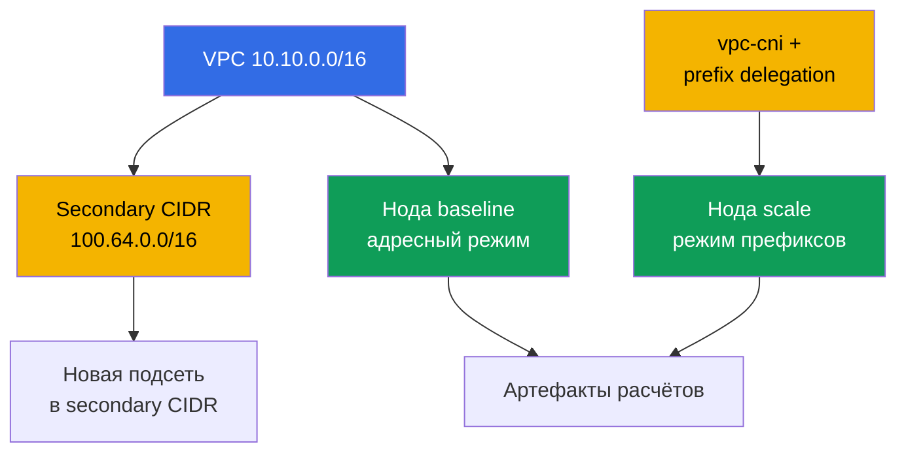
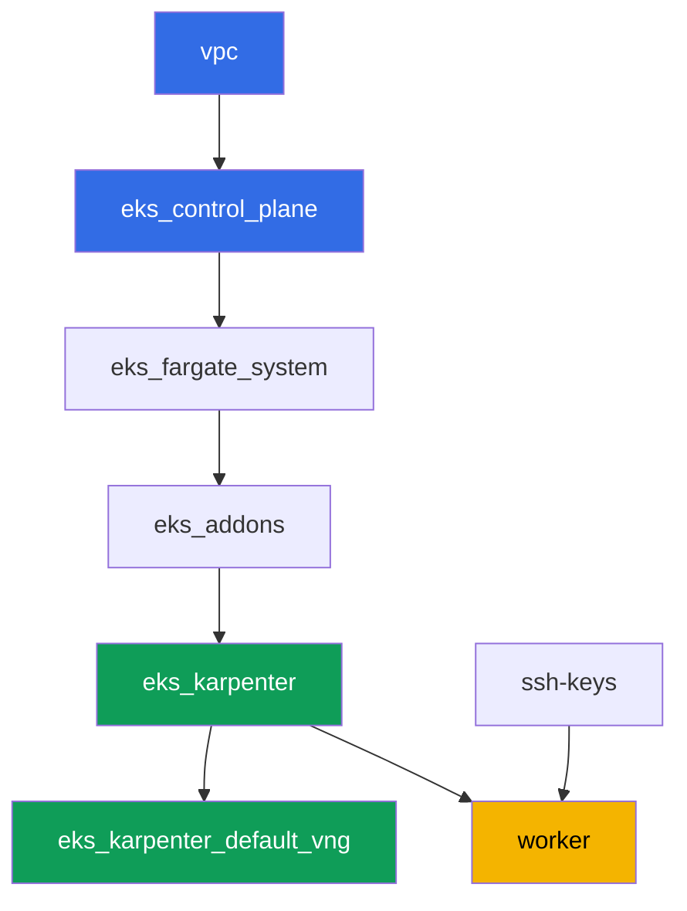

[Eng version](README.MD) · [Versión en español](README_ES.MD) · [Version française](README_FR.MD) · [Deutsche Version](README_DE.MD) · [ქართული ვერსია](README_GE.MD) · [繁體中文版](README_TW.MD) · [日本語版](README_JP.MD)

# Лаба 103 - Адресный план: лимиты ENI, prefix delegation, secondary CIDR

## Описание

Кластер уже умеет разворачиваться как код (лаба 101) и пускать нужных людей (лаба 102).
Эта лаба - про то, что рано или поздно заканчивается на любом живом кластере: IP-адреса.
Вы считаете лимит подов на ноду по формуле ENI и IP на ENI, сверяете расчёт с тем, что
реально показывает kubelet, включаете prefix delegation на аддоне vpc-cni и убеждаетесь,
что старые ноды это не меняет, а новые получают заметно больше адресов. Дальше вы
планируете размер подсети под рост кластера с запасом на warm pool и rolling update и
подключаете к VPC второй, secondary CIDR-блок - классический приём, когда первичный
диапазон VPC подходит к концу.

Задания в продакшн-стиле: короткая постановка плюс критерии приёмки. Проверка -
автоматическая, командой `check_result`.

## Цель

Закрепить материал глав курса:

- [Глава 6. Сеть кластера: VPC CNI, ENI и IP-адреса, планирование
  CIDR](../../course/06/ru.md) - откуда у подов адреса и как считается лимит подов
- [Глава 7. Масштаб адресного плана: prefix delegation, secondary CIDR, custom
  networking](../../course/07/ru.md) - что делать, когда адресов стало мало
- [Глава 14. Плотность и сайзинг: pods per node, лимиты ENI, requests и limits в
  облаке](../../course/14/ru.md) - как лимит адресов сходится с лимитом ресурсов

## Что мы создаём

Кластер уже развёрнут как код (как в лабе 101). Вы создаёте нагрузку, чтобы увидеть два
режима выдачи адресов на живых нодах, и расширяете адресный план VPC.

| Объект | Что это | Зачем в этой лабе |
|--------|---------|-------------------|
| Deployment `baseline` | небольшая нагрузка, первая EC2-нода | нода в обычном, адресном режиме VPC CNI (глава 6) |
| Аддон `vpc-cni` с `ENABLE_PREFIX_DELEGATION` | конфигурация managed addon | включаем режим префиксов для новых нод (глава 7) |
| Deployment `scale` | нагрузка, не влезающая в старую ноду | заставляет Karpenter поднять новую ноду уже в режиме префиксов (глава 7) |
| Артефакт `1/maxpods.txt` | расчёт по формуле и факт с ноды | формула max-pods сходится с тем, что видит kubelet (глава 14) |
| Артефакт `2/prefixdelegation.txt` | сравнение старой и новой ноды | старая нода не меняется, у новой лимит заметно выше (главы 6, 7) |
| Артефакт `3/cidrplan.txt` | расчёт размера подсети | выбор префикса подсети с запасом на warm pool и rolling update (глава 6) |
| Secondary CIDR `100.64.0.0/16` + подсеть | второй адресный блок VPC | что делать, когда первичный CIDR подходит к концу (глава 7) |
| Артефакт `5/diagnostics.txt` | разбор диагностики нехватки адресов | учимся читать `FailedCreatePodSandBox` и `InsufficientCidrBlocks` (глава 6) |



## Инфраструктура

Окружение разворачивается в AWS (`eu-central-1`) через Terragrunt, как в лабе 101. Каждый
каталог лабы - это один компонент со своим `terragrunt.hcl`, который ссылается на общий
модуль в `terraform/modules/` и объявляет зависимости через блоки `dependency`.

### Модули и зависимости

| Каталог (компонент) | Модуль (`terraform/modules/`) | Зависит от | Что создаёт |
|---------------------|-------------------------------|------------|-------------|
| `vpc` | `vpc_v3` | - | VPC `10.10.0.0/16`, публичные и приватные подсети в двух AZ, NAT |
| `ssh-keys` | `ssh-keys` | - | пара SSH-ключей для рабочей машины и нод |
| `eks_control_plane` | `eks_v2_control_plane` | `vpc` | control plane EKS `1.36`, OIDC, security groups |
| `eks_fargate_system` | `eks_v2_fargate` | `vpc`, `eks_control_plane` | Fargate-профиль для `kube-system` и `karpenter` |
| `eks_addons` | `eks_v2_addons` | `eks_control_plane`, `eks_fargate_system` | аддоны coredns, kube-proxy, vpc-cni, pod-identity |
| `eks_karpenter` | `eks_v2_karpenter` | `vpc`, `eks_control_plane`, `eks_addons`, `eks_fargate_system` | контроллер Karpenter, IAM-роль нод |
| `eks_karpenter_default_vng` | `eks_v2_karpenter_vng` | `vpc`, `eks_control_plane`, `eks_karpenter` | дефолтный NodePool `default` и EC2NodeClass на AL2023 |
| `worker` | `eks_v2_work_pc` | `ssh-keys`, `vpc`, `eks_control_plane`, `eks_karpenter` | рабочая машина с kubectl, тестами и `check_result` |

Граф зависимостей (что применяется раньше, то ниже по стрелке), такой же, как в лабе 101:



Все задания лабы решаются с рабочей машины через `kubectl` и `aws` CLI, без новых
terraform-модулей: сам аддон `vpc-cni` уже развёрнут компонентом `eks_addons`, а
изменение его конфигурации (prefix delegation) и работу с CIDR VPC выполняет `aws eks
update-addon` / `aws ec2 associate-vpc-cidr-block` прямо с worker.

### Права worker для планирования адресов

Роль worker (`eks_v2_work_pc/iam.tf`) уже имела широкие `ec2:Describe*` и `eks:*` - этого
достаточно для всей диагностики (подсети, VPC, аддоны). Для заданий 2 и 4 этой лабы, где
нужно менять конфигурацию VPC и аддона (а не только читать её), в политику добавлен один
дополнительный `Sid` `VpcCidrAndSubnetPlanningForLabs` с правами `ec2:AssociateVpcCidrBlock`,
`ec2:DisassociateVpcCidrBlock`, `ec2:CreateSubnet`, `ec2:DeleteSubnet`, `ec2:CreateTags`,
`eks:UpdateAddon`, `eks:DescribeAddon`, `eks:DescribeUpdate` - по аналогии с уже
существующими `Sid` в этом файле, без изменения остальной политики.

## Развёртывание

```bash
TASK=103 make run_eks_task
```

Развёртывание занимает примерно 15-20 минут. В выводе найдите строку с SSH-подключением к
рабочей машине и подключитесь к ней. kubectl там уже настроен на нужный кластер.

Полезные команды на рабочей машине:

```bash
time_left       # сколько осталось времени окружения
check_result    # проверить решение
```

> Безопасность стенда. В `env.hcl` включены `ssh_password_enable = true` и
> `access_cidrs = ["0.0.0.0/0"]` - это удобно для учебного окружения, но так делать в
> продакшене нельзя. По стандартам курса доступ к рабочим машинам открывают через AWS SSM
> Session Manager без публичных SSH-портов наружу, а `access_cidrs` сужают до конкретных
> адресов. Здесь публичный SSH оставлен только ради простоты запуска.

## Задания

---
|        **1**        | **Расчёт max-pods по формуле и сверка с фактом**             |
| :-----------------: | :---------------------------------------------------------- |
| Что делаем          | Создайте namespace `eks-103`, в нём Deployment `baseline` (образ `viktoruj/ping_pong:latest`, `2` реплики) и дождитесь готовности. Karpenter поднимет для него EC2-ноду в обычном, адресном режиме VPC CNI. Определите тип этой ноды: `kubectl get node <node> -o jsonpath='{.metadata.labels.node\.kubernetes\.io/instance-type}'`. Через `aws ec2 describe-instance-types --instance-types <type> --query 'InstanceTypes[].NetworkInfo.[MaximumNetworkInterfaces,Ipv4AddressesPerInterface]'` и `...--query 'InstanceTypes[].VCpuInfo.DefaultVCpus'` получите число ENI, IP на ENI и vCPU. Посчитайте по формуле `max-pods = ENI * (IP на ENI - 1) + 2`, примените кэп managed node group (`110` при `vCPU < 30`, иначе `250`) и сравните итог с фактом `kubectl get node <node> -o jsonpath='{.status.allocatable.pods}'`. Сохраните всё в `/var/work/tests/artifacts/1/maxpods.txt` построчно в виде `ключ=значение`: `node`, `instance_type`, `eni`, `ips_per_eni`, `vcpu`, `formula`, `cap`, `expected_max_pods`, `actual_allocatable_pods`. |
| Критерии приёмки    | - Deployment `baseline` в `eks-103`, `2` готовые реплики, под не на Fargate;<br/>- файл содержит все девять ключей;<br/>- `expected_max_pods` равен `actual_allocatable_pods` и обоим сходится с формулой и кэпом. |
---
|        **2**        | **Prefix delegation: новая нода против старой**              |
| :-----------------: | :---------------------------------------------------------- |
| Что делаем          | Включите prefix delegation на аддоне `vpc-cni`: `aws eks update-addon --cluster-name <name> --addon-name vpc-cni --configuration-values '{"env":{"ENABLE_PREFIX_DELEGATION":"true","WARM_PREFIX_TARGET":"1"}}' --resolve-conflicts PRESERVE`. Затем создайте Deployment `scale` в `eks-103` (образ `viktoruj/ping_pong:latest`, `6` реплик, у контейнера `resources.requests.cpu: "1"`) - такая нагрузка не влезает в ноду `baseline`, и Karpenter поднимает под неё новую ноду уже в режиме префиксов. Дождитесь `kubectl rollout status deployment/scale -n eks-103`. Определите новую ноду (любая нода из `kubectl get po -n eks-103 -l app=scale -o jsonpath='{.items[*].spec.nodeName}'`, отличная от ноды `baseline`) и сравните `status.allocatable.pods` старой и новой ноды. Сохраните в `/var/work/tests/artifacts/2/prefixdelegation.txt` построчно `ключ=значение`: `old_node`, `old_node_allocatable_pods`, `new_node`, `new_node_instance_type`, `new_node_allocatable_pods`, и текстовое объяснение (минимум одна строка), почему `old_node_allocatable_pods` не изменился - kubelet уже посчитал лимит при старте старой ноды, и prefix delegation касается только новых нод. |
| Критерии приёмки    | - аддон `vpc-cni` содержит `ENABLE_PREFIX_DELEGATION` со значением `true`;<br/>- Deployment `scale` готов (`6` реплик);<br/>- `new_node` отличается от `old_node`, `new_node_allocatable_pods` больше `old_node_allocatable_pods`;<br/>- файл упоминает `prefix` и объясняет, что старая нода не изменилась. |
---
|        **3**        | **Планирование размера подсети под рост**                    |
| :-----------------: | :---------------------------------------------------------- |
| Что делаем          | На пике кластеру нужно раздать адреса примерно `850` подам, с запасом `20%` на warm pool Karpenter и ещё `15%` на одновременный rolling update (запасы умножаются последовательно). Посчитайте итоговую потребность в адресах и подберите префикс подсети из таблицы: `/24` - всего `256`, доступно `251`; `/22` - всего `1024`, доступно `1019`; `/20` - всего `4096`, доступно `4091` (AWS резервирует `5` адресов на подсеть). Сохраните расчёт и обоснование выбора в `/var/work/tests/artifacts/3/cidrplan.txt`: итоговая потребность в адресах, почему `/24` и `/22` не подходят, почему выбран `/20`, и во сколько раз доступных адресов больше потребности. |
| Критерии приёмки    | - файл не пуст, содержит итоговую потребность в адресах;<br/>- упоминает `251`, `1019` и `4091`;<br/>- содержит вывод `/20` как выбранный префикс подсети;<br/>- упоминает `warm pool` и `rolling update`. |
---
|        **4**        | **Secondary CIDR: расширяем адресный план VPC**              |
| :-----------------: | :---------------------------------------------------------- |
| Что делаем          | Узнайте `vpc-id` кластера (`aws eks describe-cluster ... --query 'cluster.resourcesVpcConfig.vpcId'`). Подключите к VPC второй, secondary CIDR-блок из RFC 6598 shared address space: `aws ec2 associate-vpc-cidr-block --vpc-id <id> --cidr-block 100.64.0.0/16`. Дождитесь состояния `associated` (`aws ec2 describe-vpcs --vpc-ids <id> --query 'Vpcs[].CidrBlockAssociationSet[].{CIDR:CidrBlock,State:CidrBlockState.State}'`). Создайте в новом блоке подсеть `100.64.1.0/24` (`aws ec2 create-subnet --vpc-id <id> --cidr-block 100.64.1.0/24 --availability-zone eu-central-1a`). Сохраните вывод `describe-vpcs` (со статусом `associated`) и id новой подсети в `/var/work/tests/artifacts/4/secondary_cidr.txt`. |
| Критерии приёмки    | - у VPC есть `CidrBlockAssociationSet` с `100.64.0.0/16` в состоянии `associated`;<br/>- подсеть с CIDR `100.64.1.0/24` существует в этой VPC;<br/>- файл упоминает `100.64.0.0/16` и `associated`. |
---
|        **5**        | **Диагностика нехватки адресов (без реального отказа)**      |
| :-----------------: | :---------------------------------------------------------- |
| Что делаем          | Не ломайте инфраструктуру лабы. Изучите, как диагностируется нехватка IP-адресов на живом кластере, и опишите это на примере реальных команд к текущему кластеру. Выполните `aws ec2 describe-subnets --query 'Subnets[].[SubnetId,AvailabilityZone,CidrBlock,AvailableIpAddressCount]'` для подсетей кластера и запишите текущие значения `AvailableIpAddressCount`. В файл `/var/work/tests/artifacts/5/diagnostics.txt` запишите объяснение: если под не может получить адрес, `kubectl describe pod` покажет событие `FailedCreatePodSandBox` от `aws-cni`; если в подсети нет непрерывного блока `/28` для префикса, в логах `ipamd`/`aws-node` будет ошибка `InsufficientCidrBlocks`, даже если `AvailableIpAddressCount` подсети большой (это признак фрагментации, а не общей нехватки); а `0` в `AvailableIpAddressCount` своей AZ - прямой диагноз исчерпания адресов. |
| Критерии приёмки    | - файл не пуст;<br/>- упоминает `FailedCreatePodSandBox`, `InsufficientCidrBlocks` и `AvailableIpAddressCount`. |
---

## Проверка результата

На рабочей машине запустите автоматическую проверку:

```bash
check_result
```

Скрипт прогонит тесты и покажет процент выполненных заданий.

## Решение

Эталонное решение: [worker/files/solutions/1_RU.MD](worker/files/solutions/1_RU.MD)

## Удаление кластера и ресурсов

> Перед удалением. Подсеть `100.64.1.0/24` и secondary CIDR `100.64.0.0/16` из задания 4
> созданы вручную через AWS CLI, а не terraform - state о них ничего не знает. Удалите их
> сами, иначе `terragrunt destroy` откажется удалять VPC из-за оставшейся зависимой
> подсети. Имя кластера - `<cluster>` в примере ниже - получите так:
> `aws eks list-clusters --query 'clusters[0]' --output text`.
>
> ```bash
> CLUSTER=$(aws eks list-clusters --query 'clusters[0]' --output text)
> VPC=$(aws eks describe-cluster --name "$CLUSTER" \
>   --query 'cluster.resourcesVpcConfig.vpcId' --output text)
> SUBNET=$(aws ec2 describe-subnets \
>   --filters "Name=vpc-id,Values=$VPC" "Name=cidr-block,Values=100.64.1.0/24" \
>   --query 'Subnets[0].SubnetId' --output text)
> aws ec2 delete-subnet --subnet-id "$SUBNET"
>
> ASSOC=$(aws ec2 describe-vpcs --vpc-ids "$VPC" \
>   --query "Vpcs[].CidrBlockAssociationSet[?CidrBlock=='100.64.0.0/16'].AssociationId" \
>   --output text)
> aws ec2 disassociate-vpc-cidr-block --association-id "$ASSOC"
> ```

```bash
TASK=103 make delete_eks_task
```
