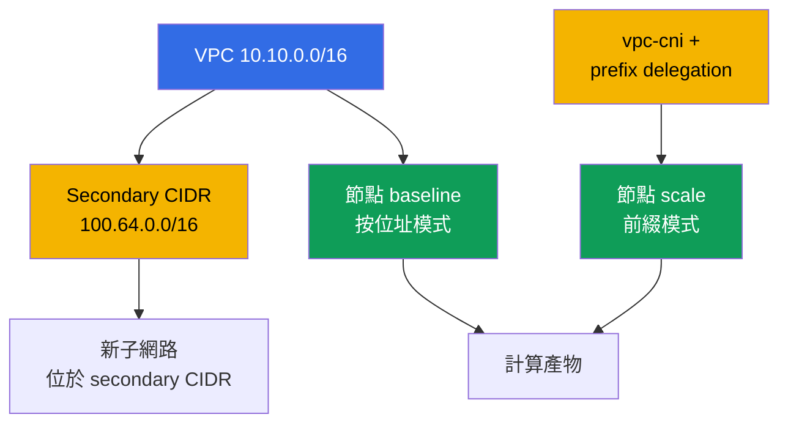
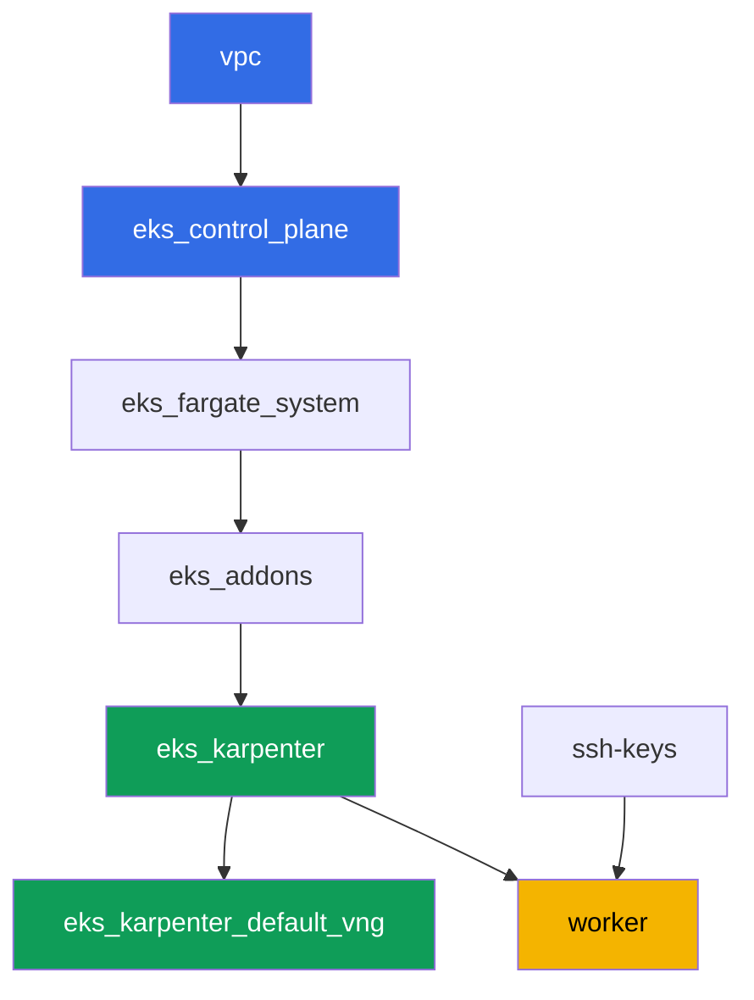

[Русская версия](README_RU.MD) · [Eng version](README.MD) · [Versión en español](README_ES.MD) · [Version française](README_FR.MD) · [Deutsche Version](README_DE.MD) · [ქართული ვერსია](README_GE.MD) · [日本語版](README_JP.MD)

# Lab 103 - 位址規劃:ENI 限制、prefix delegation、secondary CIDR

## 說明

叢集已經會以程式碼的方式部署(第 101 課)並讓合適的人進來(第 102 課)。這一課要討論的是
任何一個正在運行的叢集遲早都會遇到的問題:IP 位址。你會用 ENI 數量與每個 ENI 的 IP 數
公式計算每個節點的 pod 上限,並將計算結果與 kubelet 實際回報的數值對照,接著在 vpc-cni
add-on 上啟用 prefix delegation,確認舊節點不受影響,而新節點會取得明顯更多的位址。之後
你會為叢集的成長規劃子網路大小,預留 warm pool 與 rolling update 所需的緩衝空間,並為
VPC 掛上第二個、secondary CIDR 區塊 - 這是 VPC 主要位址範圍即將用盡時的經典做法。

任務以生產風格撰寫:簡短的任務說明加上驗收標準。檢查方式是自動化的,透過
`check_result` 指令進行。

## 目標

鞏固課程以下章節的內容:

- [第 6 章。叢集網路:VPC CNI、ENI 與 IP 位址、CIDR
  規劃](../../course/06/ru.md) - pod 的位址從何而來,以及 pod 上限如何計算
- [第 7 章。擴展位址規劃:prefix delegation、secondary CIDR、custom
  networking](../../course/07/ru.md) - 位址不足時該怎麼辦
- [第 14 章。密度與 sizing:pods per node、ENI 限制、雲端中的 requests 與
  limits](../../course/14/ru.md) - 位址上限如何與資源上限相互呼應

## 我們要建立什麼

叢集已經以程式碼的方式部署完成(如第 101 課)。你會建立一個工作負載,觀察正在運行的節點
上兩種位址分配模式,並擴展 VPC 的位址規劃。

| 物件 | 這是什麼 | 為什麼在這一課裡 |
|--------|---------|-------------------|
| Deployment `baseline` | 小型工作負載,第一個 EC2 節點 | 處於 VPC CNI 一般、按位址分配模式的節點(第 6 章) |
| 帶有 `ENABLE_PREFIX_DELEGATION` 的 `vpc-cni` add-on | managed add-on 的設定 | 為新節點啟用前綴模式(第 7 章) |
| Deployment `scale` | 塞不進舊節點的工作負載 | 迫使 Karpenter 直接以前綴模式建立新節點(第 7 章) |
| 產物 `1/maxpods.txt` | 公式計算結果與節點上的實際值 | max-pods 公式與 kubelet 看到的結果一致(第 14 章) |
| 產物 `2/prefixdelegation.txt` | 新舊節點的比較 | 舊節點沒有改變,新節點的上限明顯更高(第 6、7 章) |
| 產物 `3/cidrplan.txt` | 子網路大小的計算 | 選擇子網路前綴時預留 warm pool 與 rolling update 的緩衝(第 6 章) |
| Secondary CIDR `100.64.0.0/16` + 子網路 | VPC 的第二個位址區塊 | 主要 CIDR 即將用盡時該怎麼辦(第 7 章) |
| 產物 `5/diagnostics.txt` | 位址不足診斷的整理 | 學會讀懂 `FailedCreatePodSandBox` 和 `InsufficientCidrBlocks`(第 6 章) |



## 基礎設施

環境透過 Terragrunt 部署在 AWS(`eu-central-1`),與第 101 課相同。這一課的每個目錄都是
一個元件,擁有自己的 `terragrunt.hcl`,參照 `terraform/modules/` 中的共用模組,並透過
`dependency` 區塊宣告依賴關係。

### 模組與依賴關係

| 目錄(元件) | 模組(`terraform/modules/`) | 依賴於 | 建立什麼 |
|---------------------|-------------------------------|------------|-------------|
| `vpc` | `vpc_v3` | - | VPC `10.10.0.0/16`,兩個 AZ 中的公開與私有子網路,NAT |
| `ssh-keys` | `ssh-keys` | - | 工作機與節點用的 SSH 金鑰對 |
| `eks_control_plane` | `eks_v2_control_plane` | `vpc` | EKS control plane `1.36`,OIDC,security groups |
| `eks_fargate_system` | `eks_v2_fargate` | `vpc`、`eks_control_plane` | `kube-system` 與 `karpenter` 的 Fargate profile |
| `eks_addons` | `eks_v2_addons` | `eks_control_plane`、`eks_fargate_system` | coredns、kube-proxy、vpc-cni、pod-identity 等 add-on |
| `eks_karpenter` | `eks_v2_karpenter` | `vpc`、`eks_control_plane`、`eks_addons`、`eks_fargate_system` | Karpenter 控制器,節點的 IAM 角色 |
| `eks_karpenter_default_vng` | `eks_v2_karpenter_vng` | `vpc`、`eks_control_plane`、`eks_karpenter` | 預設 NodePool `default` 與基於 AL2023 的 EC2NodeClass |
| `worker` | `eks_v2_work_pc` | `ssh-keys`、`vpc`、`eks_control_plane`、`eks_karpenter` | 帶有 kubectl、測試與 `check_result` 的工作機 |

依賴關係圖(愈早套用的元件在箭頭愈下方),與第 101 課相同:



這一課的所有任務都是從工作機透過 `kubectl` 和 `aws` CLI 完成的,不需要新的 terraform
模組:`vpc-cni` add-on 本身已經由 `eks_addons` 元件部署好了,而變更它的設定(prefix
delegation)以及處理 VPC 的 CIDR,都是直接從 worker 透過 `aws eks update-addon` /
`aws ec2 associate-vpc-cidr-block` 完成的。

### 用於位址規劃的 worker 權限

worker 角色(`eks_v2_work_pc/iam.tf`)原本就有廣泛的 `ec2:Describe*` 與 `eks:*` 權限 -
足以應付所有診斷工作(子網路、VPC、add-on)。針對這一課的第 2 和第 4 項任務,需要變更
VPC 與 add-on 的設定(不只是讀取),政策中新增了一個額外的 `Sid`
`VpcCidrAndSubnetPlanningForLabs`,授予 `ec2:AssociateVpcCidrBlock`、
`ec2:DisassociateVpcCidrBlock`、`ec2:CreateSubnet`、`ec2:DeleteSubnet`、
`ec2:CreateTags`、`eks:UpdateAddon`、`eks:DescribeAddon`、`eks:DescribeUpdate` 等權限 -
仿照該檔案中已有的 `Sid` 寫法,不改動政策的其餘部分。

## 部署

```bash
TASK=103 make run_eks_task
```

部署大約需要 15-20 分鐘。在輸出中找到連接工作機的 SSH 連線那一行並連上去。kubectl 在
那裡已經設定好正確的叢集。

工作機上的實用指令:

```bash
time_left       # 環境剩餘時間
check_result    # 檢查解答
```

> 環境安全性。`env.hcl` 中啟用了 `ssh_password_enable = true` 和
> `access_cidrs = ["0.0.0.0/0"]` - 這對訓練環境很方便,但在生產環境中不應該這樣做。根據
> 課程標準,存取工作機應該透過 AWS SSM Session Manager,不對外開放公開的 SSH 埠,而
> `access_cidrs` 應該限縮到特定的位址。這裡保留公開 SSH 只是為了簡化啟動流程。

## 任務

---
|        **1**        | **用公式計算 max-pods 並與實際值核對**             |
| :-----------------: | :---------------------------------------------------------- |
| 該做什麼          | 建立 namespace `eks-103`,在其中建立 Deployment `baseline`(映像 `viktoruj/ping_pong:latest`,`2` 個副本),等待就緒。Karpenter 會為它建立一個處於 VPC CNI 一般、按位址分配模式的 EC2 節點。確定這個節點的類型:`kubectl get node <node> -o jsonpath='{.metadata.labels.node\.kubernetes\.io/instance-type}'`。透過 `aws ec2 describe-instance-types --instance-types <type> --query 'InstanceTypes[].NetworkInfo.[MaximumNetworkInterfaces,Ipv4AddressesPerInterface]'` 和 `...--query 'InstanceTypes[].VCpuInfo.DefaultVCpus'` 取得 ENI 數量、每個 ENI 的 IP 數與 vCPU。用公式 `max-pods = ENI * (每個 ENI 的 IP 數 - 1) + 2` 計算,套用 managed node group 的上限(`vCPU < 30` 時為 `110`,否則為 `250`),並將結果與實際值 `kubectl get node <node> -o jsonpath='{.status.allocatable.pods}'` 比較。將所有內容以 `key=value` 格式逐行儲存到 `/var/work/tests/artifacts/1/maxpods.txt`:`node`、`instance_type`、`eni`、`ips_per_eni`、`vcpu`、`formula`、`cap`、`expected_max_pods`、`actual_allocatable_pods`。 |
| 驗收標準    | - Deployment `baseline` 在 `eks-103` 中,`2` 個就緒副本,該 pod 不在 Fargate 上;<br/>- 檔案包含全部九個鍵;<br/>- `expected_max_pods` 等於 `actual_allocatable_pods`,兩者都與公式和上限一致。 |
---
|        **2**        | **Prefix delegation:新節點對比舊節點**              |
| :-----------------: | :---------------------------------------------------------- |
| 該做什麼          | 在 `vpc-cni` add-on 上啟用 prefix delegation:`aws eks update-addon --cluster-name <name> --addon-name vpc-cni --configuration-values '{"env":{"ENABLE_PREFIX_DELEGATION":"true","WARM_PREFIX_TARGET":"1"}}' --resolve-conflicts PRESERVE`。然後在 `eks-103` 中建立 Deployment `scale`(映像 `viktoruj/ping_pong:latest`,`6` 個副本,容器設有 `resources.requests.cpu: "1"`)- 這個工作負載塞不進 `baseline` 節點,於是 Karpenter 會為它建立一個已經處於前綴模式的新節點。等待 `kubectl rollout status deployment/scale -n eks-103`。找出新節點(從 `kubectl get po -n eks-103 -l app=scale -o jsonpath='{.items[*].spec.nodeName}'` 中任何一個與 `baseline` 節點不同的節點),並比較新舊節點的 `status.allocatable.pods`。以 `key=value` 格式逐行儲存到 `/var/work/tests/artifacts/2/prefixdelegation.txt`:`old_node`、`old_node_allocatable_pods`、`new_node`、`new_node_instance_type`、`new_node_allocatable_pods`,以及一段文字說明(至少一行),解釋為什麼 `old_node_allocatable_pods` 沒有改變 - kubelet 在舊節點啟動時就已經計算好了上限,而 prefix delegation 只影響新節點。 |
| 驗收標準    | - `vpc-cni` add-on 中的 `ENABLE_PREFIX_DELEGATION` 設為 `true`;<br/>- Deployment `scale` 已就緒(`6` 個副本);<br/>- `new_node` 與 `old_node` 不同,`new_node_allocatable_pods` 大於 `old_node_allocatable_pods`;<br/>- 檔案提到 `prefix`,並說明舊節點沒有改變。 |
---
|        **3**        | **為成長規劃子網路大小**                    |
| :-----------------: | :---------------------------------------------------------- |
| 該做什麼          | 在高峰期,叢集需要為大約 `850` 個 pod 分配位址,並為 Karpenter 的 warm pool 預留 `20%` 的緩衝,再為同時進行的 rolling update 預留額外 `15%`(緩衝依序相乘)。計算最終的位址需求,並從下表中選出子網路前綴:`/24` - 總共 `256`,可用 `251`;`/22` - 總共 `1024`,可用 `1019`;`/20` - 總共 `4096`,可用 `4091`(AWS 每個子網路會保留 `5` 個位址)。將計算結果和選擇理由儲存到 `/var/work/tests/artifacts/3/cidrplan.txt`:最終的位址需求、為什麼 `/24` 和 `/22` 不合適、為什麼選擇 `/20`,以及可用位址是需求的多少倍。 |
| 驗收標準    | - 檔案不為空,包含最終的位址需求;<br/>- 提到 `251`、`1019` 和 `4091`;<br/>- 以 `/20` 作為最終選定的子網路前綴結論;<br/>- 提到 `warm pool` 和 `rolling update`。 |
---
|        **4**        | **Secondary CIDR:擴展 VPC 的位址規劃**              |
| :-----------------: | :---------------------------------------------------------- |
| 該做什麼          | 找出叢集的 `vpc-id`(`aws eks describe-cluster ... --query 'cluster.resourcesVpcConfig.vpcId'`)。為 VPC 掛上一個來自 RFC 6598 shared address space 的第二個、secondary CIDR 區塊:`aws ec2 associate-vpc-cidr-block --vpc-id <id> --cidr-block 100.64.0.0/16`。等待狀態變為 `associated`(`aws ec2 describe-vpcs --vpc-ids <id> --query 'Vpcs[].CidrBlockAssociationSet[].{CIDR:CidrBlock,State:CidrBlockState.State}'`)。在新的區塊中建立子網路 `100.64.1.0/24`(`aws ec2 create-subnet --vpc-id <id> --cidr-block 100.64.1.0/24 --availability-zone eu-central-1a`)。將 `describe-vpcs` 的輸出(顯示 `associated` 狀態)以及新子網路的 id 儲存到 `/var/work/tests/artifacts/4/secondary_cidr.txt`。 |
| 驗收標準    | - VPC 有一筆 `CidrBlockAssociationSet` 記錄,`100.64.0.0/16` 處於 `associated` 狀態;<br/>- 這個 VPC 中存在 CIDR 為 `100.64.1.0/24` 的子網路;<br/>- 檔案提到 `100.64.0.0/16` 和 `associated`。 |
---
|        **5**        | **診斷位址不足(不造成真正的失敗)**      |
| :-----------------: | :---------------------------------------------------------- |
| 該做什麼          | 不要破壞這一課的基礎設施。研究如何在正在運行的叢集上診斷 IP 位址不足的問題,並用實際的指令針對目前的叢集加以說明。對叢集的子網路執行 `aws ec2 describe-subnets --query 'Subnets[].[SubnetId,AvailabilityZone,CidrBlock,AvailableIpAddressCount]'`,記錄目前的 `AvailableIpAddressCount` 數值。在檔案 `/var/work/tests/artifacts/5/diagnostics.txt` 中寫下說明:如果 pod 無法取得位址,`kubectl describe pod` 會顯示來自 `aws-cni` 的 `FailedCreatePodSandBox` 事件;如果子網路中沒有連續的 `/28` 區塊可用作前綴,`ipamd`/`aws-node` 的日誌中會出現 `InsufficientCidrBlocks` 錯誤,即使子網路的 `AvailableIpAddressCount` 看起來很大(這是碎片化的徵兆,而不是整體不足);而某個 AZ 的 `AvailableIpAddressCount` 為 `0`,則是位址耗盡的直接診斷結論。 |
| 驗收標準    | - 檔案不為空;<br/>- 提到 `FailedCreatePodSandBox`、`InsufficientCidrBlocks` 和 `AvailableIpAddressCount`。 |
---

## 檢查結果

在工作機上執行自動檢查:

```bash
check_result
```

腳本會執行測試,並顯示已完成任務的百分比。

## 解答

參考解答:[worker/files/solutions/1_TW.MD](worker/files/solutions/1_TW.MD)

## 刪除叢集與資源

> 刪除之前。第 4 項任務中的子網路 `100.64.1.0/24` 與 secondary CIDR
> `100.64.0.0/16` 是透過 AWS CLI 手動建立的,不是 terraform 建立的 - state 對它們一無
> 所知。請自己刪除它們,否則 `terragrunt destroy` 會因為殘留的相依子網路而拒絕刪除
> VPC。取得叢集名稱(下方範例中的 `<cluster>`)的方式如下:
> `aws eks list-clusters --query 'clusters[0]' --output text`。
>
> ```bash
> CLUSTER=$(aws eks list-clusters --query 'clusters[0]' --output text)
> VPC=$(aws eks describe-cluster --name "$CLUSTER" \
>   --query 'cluster.resourcesVpcConfig.vpcId' --output text)
> SUBNET=$(aws ec2 describe-subnets \
>   --filters "Name=vpc-id,Values=$VPC" "Name=cidr-block,Values=100.64.1.0/24" \
>   --query 'Subnets[0].SubnetId' --output text)
> aws ec2 delete-subnet --subnet-id "$SUBNET"
>
> ASSOC=$(aws ec2 describe-vpcs --vpc-ids "$VPC" \
>   --query "Vpcs[].CidrBlockAssociationSet[?CidrBlock=='100.64.0.0/16'].AssociationId" \
>   --output text)
> aws ec2 disassociate-vpc-cidr-block --association-id "$ASSOC"
> ```

```bash
TASK=103 make delete_eks_task
```
