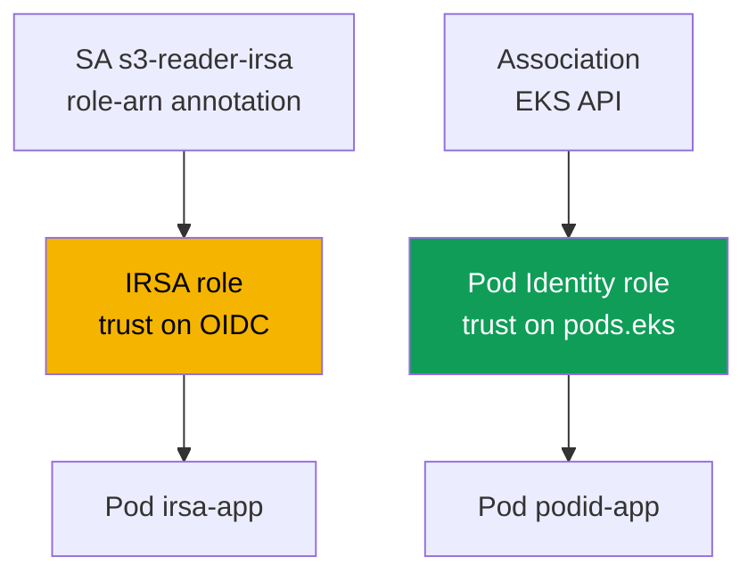
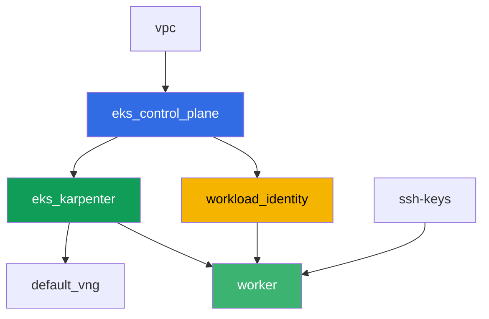

[Русская версия](README_RU.MD) · [Versión en español](README_ES.MD) · [Version française](README_FR.MD) · [Deutsche Version](README_DE.MD) · [ქართული ვერსია](README_GE.MD) · [繁體中文版](README_TW.MD) · [日本語版](README_JP.MD)

# Lab 104 - Workload identity: IRSA and Pod Identity for an application

## Description

An application in a pod needs access to S3 and Secrets Manager. In this lab you configure
both permission-granting mechanisms for a pod - IRSA and EKS Pod Identity - against real
AWS resources created by terraform in advance: an S3 bucket and a Secrets Manager secret.
You bind a `ServiceAccount` to the IRSA role via an annotation, create a Pod Identity
association through the EKS API, read an object and a secret from the corresponding pods,
and finally reproduce a symptom: a pod without a binding to IRSA or Pod Identity gets
`AccessDenied`, because the node role carries no application permissions at all.

Tasks are written in a production style: a short statement plus acceptance criteria.
Checking is automatic, via the `check_result` command.

## Goal

Reinforce the material from these course chapters:

- [Chapter 16. IRSA: the OIDC provider, trust policy, ServiceAccount annotations](../../course/16/en.md)
- [Chapter 17. EKS Pod Identity: the agent, associations, migrating from IRSA](../../course/17/en.md)

## What we're creating

Terraform creates the S3 bucket, the Secrets Manager secret and both IAM roles in advance
(with predictable names). You create the `ServiceAccount`, the pods and the Pod Identity
association to bind these roles to a specific workload.

| Object | What it is | Why it's in this lab |
|--------|---------|-------------------|
| `workload_identity` component | S3 bucket, Secrets Manager secret, IRSA role, Pod Identity role | ready-made AWS resources, their permissions are already described |
| Namespace `eks-104` | the cluster section for the lab's workload | keeps resources separate from system ones |
| ServiceAccount `s3-reader-irsa` + annotation | links the SA to the IRSA role (chapter 16) | the pod gets its role through OIDC federation |
| Pod `irsa-app` | reads an object from S3 | confirms IRSA works live |
| Pod Identity association | links `namespace + SA -> role` in the EKS API (chapter 17) | no annotations on the SA, no objects in the cluster |
| Pod `podid-app` | reads a secret from Secrets Manager | confirms Pod Identity works live |
| Pod `plain-app` | no binding to IRSA or Pod Identity | symptom: the node role grants no application permissions |

How the two pods get their permissions differently:



## Infrastructure

The environment is deployed in AWS (`eu-central-1`) via Terragrunt. The base matches lab
101 (control plane, Fargate for system pods, Karpenter for the workload, the
`eks-pod-identity-agent` addon), plus a separate component for the IRSA and Pod Identity
demo resources.

### Modules and dependencies

| Directory (component) | Module (`terraform/modules/`) | Depends on | What it creates |
|---------------------|-------------------------------|------------|-------------|
| `vpc` | `vpc_v3` | - | VPC `10.10.0.0/16`, subnets in two AZs, NAT |
| `ssh-keys` | `ssh-keys` | - | an SSH key pair for the worker machine and nodes |
| `eks_control_plane` | `eks_v2_control_plane` | `vpc` | EKS control plane `1.36`, OIDC provider |
| `eks_fargate_system` | `eks_v2_fargate` | `vpc`, `eks_control_plane` | Fargate profile for `kube-system` and `karpenter` |
| `eks_addons` | `eks_v2_addons` | `eks_control_plane`, `eks_fargate_system` | coredns, kube-proxy, vpc-cni, `eks-pod-identity-agent` |
| `eks_karpenter` | `eks_v2_karpenter` | `vpc`, `eks_control_plane`, `eks_addons`, `eks_fargate_system` | Karpenter controller, node IAM role |
| `eks_karpenter_default_vng` | `eks_v2_karpenter_vng` | `vpc`, `eks_control_plane`, `eks_karpenter` | the default `default` NodePool on AL2023 |
| `workload_identity` | `eks_v2_workload_identity_demo` | `eks_control_plane` | S3 bucket, Secrets Manager secret, IRSA role, Pod Identity role |
| `worker` | `eks_v2_work_pc` | `ssh-keys`, `vpc`, `eks_control_plane`, `eks_karpenter`, `workload_identity` | worker machine with kubectl, tests and `check_result` |

The `workload_identity` component creates the IRSA role with a trust policy bound exactly
to the SA `s3-reader-irsa` in namespace `eks-104` (the `sub` condition from chapter 16),
and a separate Pod Identity role with the common principal `pods.eks.amazonaws.com`
(chapter 17) - it's bound to a specific SA not by terraform, but by the
`aws eks create-pod-identity-association` command in task 5.

Dependency graph (what gets applied earlier is lower down the arrow):



The `eks_fargate_system` and `eks_addons` components aren't shown on the graph to keep the
8-node limit, but they actually sit between `eks_control_plane` and `eks_karpenter` (see
the table above).

### Predictable resource names

`workload_identity` assembles names from `prefix` and `app_name`, so the worker finds them
without reading terraform output. They're all available at boot in the file
`~/lab104_hints.txt`:

| Resource | Name |
|--------|-----|
| S3 bucket | `eks-task104-workload-identity-bucket` (hyphens instead of `_` - an S3 requirement) |
| Secrets Manager secret | `eks-task104-workload_identity-secret` |
| IRSA role | `eks-task104-workload_identity-irsa-role` |
| Pod Identity role | `eks-task104-workload_identity-pod-identity-role` |

### Where things are configured

`env.hcl` (shared environment parameters):

| Parameter | Value in the lab | What it affects |
|----------|-----------------|---------------|
| `region` | `eu-central-1` | the region for all resources |
| `prefix` | `eks-task104` | the resource name prefix, including the bucket and the secret |
| `stack_name` | `eks104` | used to build `env_name` - the cluster name |
| `k8_version` | `1.36.0` | the kubectl version on the worker machine |

`inputs` in each component's `terragrunt.hcl`:

| File | Key settings |
|------|--------------------|
| `eks_addons/terragrunt.hcl` | added `eks-pod-identity-agent` version `v1.3.10-eksbuild.2` |
| `workload_identity/terragrunt.hcl` | `irsa.namespace = "eks-104"`, `irsa.service_account_name = "s3-reader-irsa"` |
| `worker/terragrunt.hcl` | `test_url` and `task_script_url` pointing to the lab 104 files, dependency on `workload_identity` |

## Deployment

```bash
TASK=104 make run_eks_task
```

Deployment takes roughly 15-20 minutes. In the output, find the line with the SSH
connection to the worker machine and connect to it. kubectl there is already configured
for the right cluster, and the lab's resource names and ARNs are in the file
`~/lab104_hints.txt`.

Useful commands on the worker machine:

```bash
time_left       # how much environment time is left
check_result    # check the solution
cat ~/lab104_hints.txt   # names and ARNs of the bucket, the secret and both roles
```

> Environment security. `env.hcl` has `ssh_password_enable = true` and
> `access_cidrs = ["0.0.0.0/0"]` enabled - convenient for a training environment, but this
> is not something to do in production. Per the course standards (chapters 0.2, 2, 19),
> access to worker machines should go through AWS SSM Session Manager without exposing
> public SSH ports, and `access_cidrs` should be narrowed down to specific addresses. Here
> public SSH is left in place only to keep the setup simple.

## Tasks

---
|        **1**        | **Namespace for the lab's workload**                             |
| :-----------------: | :---------------------------------------------------------- |
| What to do          | Create a namespace named `eks-104`. All the lab's objects are created inside it. |
| Acceptance criteria    | - namespace `eks-104` exists. |
---
|        **2**        | **ServiceAccount with an IRSA annotation**                         |
| :-----------------: | :---------------------------------------------------------- |
| What to do          | Create `ServiceAccount` `s3-reader-irsa` in `eks-104` with the annotation `eks.amazonaws.com/role-arn` set to the ARN of the IRSA role (`irsa_role_arn` from `~/lab104_hints.txt`). This role was already created by terraform with a trust policy that trusts exactly this SA. |
| Acceptance criteria    | - ServiceAccount `s3-reader-irsa` in `eks-104` with the annotation `eks.amazonaws.com/role-arn` containing `irsa-role`. |
---
|        **3**        | **Pod with IRSA: checking identity**                        |
| :-----------------: | :---------------------------------------------------------- |
| What to do          | Create Pod `irsa-app` (image `amazon/aws-cli:2.15.0`, command `sleep 3600`) with `serviceAccountName: s3-reader-irsa`. From the pod, run `aws sts get-caller-identity` and save the output to `/var/work/tests/artifacts/3/irsa_identity.txt`. The `Arn` should contain an `assumed-role` for your IRSA role, not the node role. |
| Acceptance criteria    | - Pod `irsa-app` uses SA `s3-reader-irsa`;<br/>- the file `3/irsa_identity.txt` is not empty and contains `assumed-role` and `irsa-role`. |
---
|        **4**        | **Reading an object from S3 via IRSA**                          |
| :-----------------: | :---------------------------------------------------------- |
| What to do          | From the pod `irsa-app`, read the object `hello.txt` from the bucket (`bucket_name` from the hint file): `aws s3 cp s3://<bucket>/hello.txt -`. Save the output to `/var/work/tests/artifacts/4/s3_read.txt`. |
| Acceptance criteria    | - the file `4/s3_read.txt` is not empty and contains the line `hello from s3`. |
---
|        **5**        | **Pod Identity association**                                  |
| :-----------------: | :---------------------------------------------------------- |
| What to do          | Create `ServiceAccount` `secret-reader-podid` in `eks-104` (no annotations). Bind it to the Pod Identity role via `aws eks create-pod-identity-association --cluster-name <cluster> --namespace eks-104 --service-account secret-reader-podid --role-arn <pod_identity_role_arn>`. Save `aws eks list-pod-identity-associations --cluster-name <cluster> --namespace eks-104` to `/var/work/tests/artifacts/5/association.txt`. |
| Acceptance criteria    | - the file `5/association.txt` is not empty and mentions `secret-reader-podid` and `eks-104`. |
---
|        **6**        | **Pod with Pod Identity: reading a secret**                       |
| :-----------------: | :---------------------------------------------------------- |
| What to do          | Create Pod `podid-app` (image `amazon/aws-cli:2.15.0`, command `sleep 3600`) with `serviceAccountName: secret-reader-podid`. From the pod, run `aws sts get-caller-identity` and `aws secretsmanager get-secret-value --secret-id <secret_name>`, save both outputs to `/var/work/tests/artifacts/6/secret_read.txt`. The identity should show `assumed-role` for the Pod Identity role, and the secret value should be a JSON with a `username` field. |
| Acceptance criteria    | - Pod `podid-app` uses SA `secret-reader-podid`;<br/>- the file `6/secret_read.txt` is not empty, contains `pod-identity-role` and the secret value (`username` or `demo123`). |
---
|        **7**        | **Symptom: the node role grants no application permissions**                |
| :-----------------: | :---------------------------------------------------------- |
| What to do          | Create Pod `plain-app` (image `amazon/aws-cli:2.15.0`, command `sleep 3600`) without `serviceAccountName` (the regular `default` SA, no binding to IRSA or Pod Identity). From the pod, try `aws s3 ls s3://<bucket>/` - it should return an `AccessDenied` error, because the node role only carries the permissions of system components. Save the output (including the error) to `/var/work/tests/artifacts/7/node_role_denied.txt`. |
| Acceptance criteria    | - the file `7/node_role_denied.txt` is not empty and contains `AccessDenied` (or `is not authorized`). |
---

## Checking the result

On the worker machine, run the automatic check:

```bash
check_result
```

The script will run the tests and show the percentage of completed tasks.

## Solution

Reference solution: [worker/files/solutions/1.MD](worker/files/solutions/1.MD)

## Deleting the cluster and resources

> **First tear down the workload and wait for the EC2 nodes to leave, then destroy the
> stand.** Pods `irsa-app`, `podid-app` and `plain-app` go on Karpenter EC2 nodes (there's
> no Fargate profile for `eks-104`). If you delete the cluster with the workload still
> running, the EC2 node goes down with it, but the secondary ENI from the VPC CNI stays in
> `available` state and holds onto the node security group - `destroy` hangs on
> `module.eks.aws_security_group.node[0]: Still destroying...` for tens of minutes.

```bash
# 1. Tear down the lab's workload
kubectl delete namespace eks-104 --ignore-not-found

# 2. Not required, but cleaner: remove the Pod Identity association - it lives as an EKS
#    object, not in the terraform state, and would otherwise remain until the cluster
#    itself is deleted
CLUSTER=$(aws eks list-clusters --query 'clusters[0]' --output text)
ASSOC_ID=$(aws eks list-pod-identity-associations --cluster-name "$CLUSTER" \
  --namespace eks-104 --query 'associations[0].associationId' --output text)
[ "$ASSOC_ID" != "None" ] && aws eks delete-pod-identity-association \
  --cluster-name "$CLUSTER" --association-id "$ASSOC_ID"

# 3. Wait for Karpenter to remove the NodeClaim and the EC2 node (only fargate-* should
#    remain)
while kubectl get nodeclaims --no-headers 2>/dev/null | grep -q .; do
  echo "NodeClaim is still alive, waiting..."; sleep 15
done
kubectl get nodes | grep -v fargate
```

Only after that, destroy the stand (the S3 bucket, the secret and both IAM roles will go
away with the `workload_identity` component):

```bash
TASK=104 make delete_eks_task
```

If `destroy` still gets stuck on the node security group, an orphaned ENI is left behind.
Find and delete it:

```bash
aws ec2 describe-network-interfaces --filters Name=status,Values=available \
  --query 'NetworkInterfaces[?Tags[?Key==`eks:eni:owner`]].[NetworkInterfaceId,Description]' \
  --output table
aws ec2 delete-network-interface --network-interface-id <eni-id>
```
