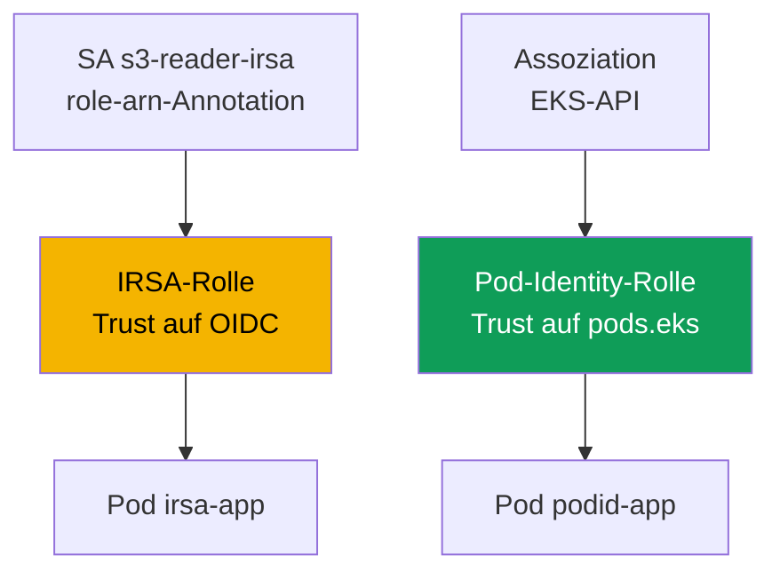
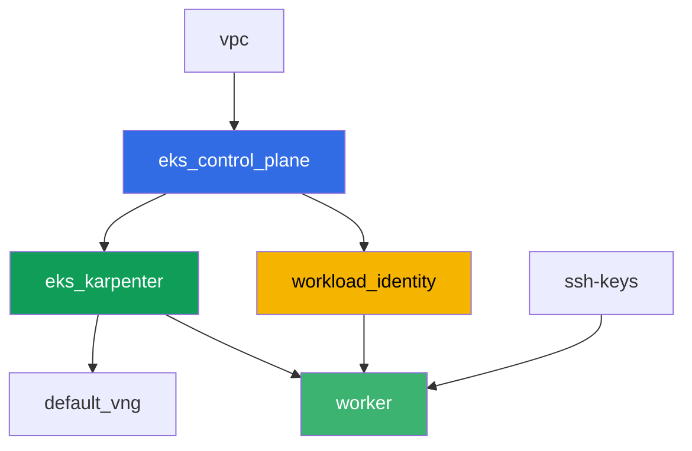

[Русская версия](README_RU.MD) · [Eng version](README.MD) · [Versión en español](README_ES.MD) · [Version française](README_FR.MD) · [ქართული ვერსია](README_GE.MD) · [繁體中文版](README_TW.MD) · [日本語版](README_JP.MD)

# Lab 104 - Workload identity: IRSA und Pod Identity für die Anwendung

## Beschreibung

Eine Anwendung in einem Pod braucht Zugriff auf S3 und Secrets Manager. In dieser Lab
konfigurieren Sie beide Mechanismen zur Rechtevergabe an einen Pod - IRSA und EKS Pod
Identity - anhand echter AWS-Ressourcen, die terraform im Voraus angelegt hat: einem
S3-Bucket und einem Secrets-Manager-Secret. Sie binden ein `ServiceAccount` per Annotation
an die IRSA-Rolle, erstellen eine Pod-Identity-Assoziation über die EKS-API, lesen ein
Objekt und ein Secret aus den entsprechenden Pods und reproduzieren am Ende ein Symptom:
ein Pod ohne Bindung an IRSA oder Pod Identity erhält `AccessDenied`, weil die Node-Rolle
keine anwendungsbezogenen Rechte trägt.

Die Aufgaben sind im Produktionsstil formuliert: eine kurze Aufgabenstellung plus
Abnahmekriterien. Die Prüfung erfolgt automatisch mit dem Befehl `check_result`.

## Ziel

Den Stoff folgender Kurskapitel vertiefen:

- [Kapitel 16. IRSA: OIDC-Provider, trust policy, ServiceAccount-Annotationen](../../course/16/de.md)
- [Kapitel 17. EKS Pod Identity: Agent, Assoziationen, Migration von IRSA](../../course/17/de.md)

## Was wir erstellen

Terraform legt im Voraus den S3-Bucket, das Secrets-Manager-Secret und beide IAM-Rollen an
(mit vorhersagbaren Namen). Sie erstellen das `ServiceAccount`, die Pods und die
Pod-Identity-Assoziation, um diese Rollen mit einer konkreten Workload zu verbinden.

| Objekt | Was es ist | Warum es in dieser Lab vorkommt |
|--------|---------|-------------------|
| Komponente `workload_identity` | S3-Bucket, Secrets-Manager-Secret, IRSA-Rolle, Pod-Identity-Rolle | fertige AWS-Ressourcen, deren Rechte bereits beschrieben sind |
| Namespace `eks-104` | der Cluster-Bereich für die Workload dieser Lab | hält die Ressourcen von den Systemressourcen getrennt |
| ServiceAccount `s3-reader-irsa` + Annotation | verbindet das SA mit der IRSA-Rolle (Kapitel 16) | der Pod erhält seine Rolle per OIDC-Federation |
| Pod `irsa-app` | liest ein Objekt aus S3 | bestätigt live, dass IRSA funktioniert |
| Pod-Identity-Assoziation | verbindet `Namespace + SA -> Rolle` in der EKS-API (Kapitel 17) | keine Annotationen am SA, keine Objekte im Cluster |
| Pod `podid-app` | liest ein Secret aus Secrets Manager | bestätigt live, dass Pod Identity funktioniert |
| Pod `plain-app` | ohne Bindung an IRSA oder Pod Identity | Symptom: die Node-Rolle gewährt keine anwendungsbezogenen Rechte |

Wie die beiden Pods ihre Rechte auf unterschiedliche Weise erhalten:



## Infrastruktur

Die Umgebung wird in AWS (`eu-central-1`) über Terragrunt bereitgestellt. Die Basis
entspricht Lab 101 (control plane, Fargate für die System-Pods, Karpenter für die
Workload, das Addon `eks-pod-identity-agent`), plus eine separate Komponente für die
Demo-Ressourcen von IRSA und Pod Identity.

### Module und Abhängigkeiten

| Verzeichnis (Komponente) | Modul (`terraform/modules/`) | Abhängig von | Was es erstellt |
|---------------------|-------------------------------|------------|-------------|
| `vpc` | `vpc_v3` | - | VPC `10.10.0.0/16`, Subnetze in zwei AZs, NAT |
| `ssh-keys` | `ssh-keys` | - | ein SSH-Schlüsselpaar für die Arbeitsmaschine und die Nodes |
| `eks_control_plane` | `eks_v2_control_plane` | `vpc` | EKS-Control-Plane `1.36`, OIDC-Provider |
| `eks_fargate_system` | `eks_v2_fargate` | `vpc`, `eks_control_plane` | Fargate-Profil für `kube-system` und `karpenter` |
| `eks_addons` | `eks_v2_addons` | `eks_control_plane`, `eks_fargate_system` | coredns, kube-proxy, vpc-cni, `eks-pod-identity-agent` |
| `eks_karpenter` | `eks_v2_karpenter` | `vpc`, `eks_control_plane`, `eks_addons`, `eks_fargate_system` | Karpenter-Controller, IAM-Rolle der Nodes |
| `eks_karpenter_default_vng` | `eks_v2_karpenter_vng` | `vpc`, `eks_control_plane`, `eks_karpenter` | der Standard-NodePool `default` auf AL2023 |
| `workload_identity` | `eks_v2_workload_identity_demo` | `eks_control_plane` | S3-Bucket, Secrets-Manager-Secret, IRSA-Rolle, Pod-Identity-Rolle |
| `worker` | `eks_v2_work_pc` | `ssh-keys`, `vpc`, `eks_control_plane`, `eks_karpenter`, `workload_identity` | Arbeitsmaschine mit kubectl, Tests und `check_result` |

Die Komponente `workload_identity` erstellt die IRSA-Rolle mit einer trust policy, die
exakt an das SA `s3-reader-irsa` im Namespace `eks-104` gebunden ist (die `sub`-Bedingung
aus Kapitel 16), sowie eine separate Pod-Identity-Rolle mit dem gemeinsamen Principal
`pods.eks.amazonaws.com` (Kapitel 17) - sie wird nicht von terraform, sondern durch den
Befehl `aws eks create-pod-identity-association` in Aufgabe 5 mit einem konkreten SA
verbunden.

Abhängigkeitsgraph (was früher angewendet wird, steht weiter unten am Pfeil):



Die Komponenten `eks_fargate_system` und `eks_addons` sind im Graphen nicht dargestellt,
um das Limit von 8 Knoten einzuhalten, sitzen aber tatsächlich zwischen
`eks_control_plane` und `eks_karpenter` (siehe Tabelle oben).

### Vorhersagbare Ressourcennamen

`workload_identity` setzt die Namen aus `prefix` und `app_name` zusammen, sodass der
Worker sie ohne Auslesen des terraform output findet. Sie stehen beim Hochfahren alle in
der Datei `~/lab104_hints.txt`:

| Ressource | Name |
|--------|-----|
| S3-Bucket | `eks-task104-workload-identity-bucket` (Bindestriche statt `_` - eine Anforderung von S3) |
| Secrets-Manager-Secret | `eks-task104-workload_identity-secret` |
| IRSA-Rolle | `eks-task104-workload_identity-irsa-role` |
| Pod-Identity-Rolle | `eks-task104-workload_identity-pod-identity-role` |

### Wo was konfiguriert wird

`env.hcl` (gemeinsame Umgebungsparameter):

| Parameter | Wert in der Lab | Was er beeinflusst |
|----------|-----------------|---------------|
| `region` | `eu-central-1` | die Region aller Ressourcen |
| `prefix` | `eks-task104` | das Namenspräfix der Ressourcen, einschließlich Bucket und Secret |
| `stack_name` | `eks104` | daraus wird `env_name` gebildet - der Cluster-Name |
| `k8_version` | `1.36.0` | die kubectl-Version auf der Arbeitsmaschine |

`inputs` in der `terragrunt.hcl` jeder Komponente:

| Datei | Wichtige Einstellungen |
|------|--------------------|
| `eks_addons/terragrunt.hcl` | `eks-pod-identity-agent` Version `v1.3.10-eksbuild.2` hinzugefügt |
| `workload_identity/terragrunt.hcl` | `irsa.namespace = "eks-104"`, `irsa.service_account_name = "s3-reader-irsa"` |
| `worker/terragrunt.hcl` | `test_url` und `task_script_url` zeigen auf die Dateien von Lab 104, Abhängigkeit von `workload_identity` |

## Bereitstellung

```bash
TASK=104 make run_eks_task
```

Die Bereitstellung dauert etwa 15-20 Minuten. Suchen Sie in der Ausgabe die Zeile mit der
SSH-Verbindung zur Arbeitsmaschine und verbinden Sie sich damit. kubectl ist dort bereits
auf den richtigen Cluster konfiguriert, und die Namen und ARNs der Ressourcen der Lab
stehen in der Datei `~/lab104_hints.txt`.

Nützliche Befehle auf der Arbeitsmaschine:

```bash
time_left       # wie viel Zeit der Umgebung noch übrig ist
check_result    # die Lösung überprüfen
cat ~/lab104_hints.txt   # Namen und ARNs des Buckets, des Secrets und beider Rollen
```

> Sicherheit des Testaufbaus. In `env.hcl` sind `ssh_password_enable = true` und
> `access_cidrs = ["0.0.0.0/0"]` aktiviert - das ist praktisch für eine Übungsumgebung,
> gehört aber nicht in die Produktion. Nach den Standards des Kurses (Kapitel 0.2, 2, 19)
> erfolgt der Zugriff auf Arbeitsmaschinen über AWS SSM Session Manager ohne öffentlich
> erreichbare SSH-Ports, und `access_cidrs` wird auf konkrete Adressen eingeschränkt. Hier
> ist öffentliches SSH nur der Einfachheit des Starts wegen belassen.

## Aufgaben

---
|        **1**        | **Namespace für die Workload der Lab**                             |
| :-----------------: | :---------------------------------------------------------- |
| Was zu tun ist          | Erstellen Sie einen Namespace mit dem Namen `eks-104`. Alle Objekte der Lab werden darin erstellt. |
| Abnahmekriterien    | - der Namespace `eks-104` existiert. |
---
|        **2**        | **ServiceAccount mit IRSA-Annotation**                         |
| :-----------------: | :---------------------------------------------------------- |
| Was zu tun ist          | Erstellen Sie das `ServiceAccount` `s3-reader-irsa` in `eks-104` mit der Annotation `eks.amazonaws.com/role-arn`, die den ARN der IRSA-Rolle enthält (`irsa_role_arn` aus `~/lab104_hints.txt`). Diese Rolle wurde bereits von terraform mit einer trust policy erstellt, die genau diesem SA vertraut. |
| Abnahmekriterien    | - ServiceAccount `s3-reader-irsa` in `eks-104` mit der Annotation `eks.amazonaws.com/role-arn`, die `irsa-role` enthält. |
---
|        **3**        | **Pod mit IRSA: Identität prüfen**                        |
| :-----------------: | :---------------------------------------------------------- |
| Was zu tun ist          | Erstellen Sie den Pod `irsa-app` (Image `amazon/aws-cli:2.15.0`, Befehl `sleep 3600`) mit `serviceAccountName: s3-reader-irsa`. Führen Sie aus dem Pod `aws sts get-caller-identity` aus und speichern Sie die Ausgabe in `/var/work/tests/artifacts/3/irsa_identity.txt`. In `Arn` sollte eine `assumed-role` Ihrer IRSA-Rolle stehen, nicht die Node-Rolle. |
| Abnahmekriterien    | - Pod `irsa-app` verwendet das SA `s3-reader-irsa`;<br/>- die Datei `3/irsa_identity.txt` ist nicht leer und enthält `assumed-role` und `irsa-role`. |
---
|        **4**        | **Objekt aus S3 über IRSA lesen**                          |
| :-----------------: | :---------------------------------------------------------- |
| Was zu tun ist          | Lesen Sie aus dem Pod `irsa-app` das Objekt `hello.txt` aus dem Bucket (`bucket_name` aus der Hinweisdatei): `aws s3 cp s3://<bucket>/hello.txt -`. Speichern Sie die Ausgabe in `/var/work/tests/artifacts/4/s3_read.txt`. |
| Abnahmekriterien    | - die Datei `4/s3_read.txt` ist nicht leer und enthält die Zeile `hello from s3`. |
---
|        **5**        | **Pod-Identity-Assoziation**                                  |
| :-----------------: | :---------------------------------------------------------- |
| Was zu tun ist          | Erstellen Sie das `ServiceAccount` `secret-reader-podid` in `eks-104` (ohne Annotationen). Verbinden Sie es mit der Pod-Identity-Rolle über `aws eks create-pod-identity-association --cluster-name <cluster> --namespace eks-104 --service-account secret-reader-podid --role-arn <pod_identity_role_arn>`. Speichern Sie `aws eks list-pod-identity-associations --cluster-name <cluster> --namespace eks-104` in `/var/work/tests/artifacts/5/association.txt`. |
| Abnahmekriterien    | - die Datei `5/association.txt` ist nicht leer und erwähnt `secret-reader-podid` und `eks-104`. |
---
|        **6**        | **Pod mit Pod Identity: Secret lesen**                       |
| :-----------------: | :---------------------------------------------------------- |
| Was zu tun ist          | Erstellen Sie den Pod `podid-app` (Image `amazon/aws-cli:2.15.0`, Befehl `sleep 3600`) mit `serviceAccountName: secret-reader-podid`. Führen Sie aus dem Pod `aws sts get-caller-identity` und `aws secretsmanager get-secret-value --secret-id <secret_name>` aus und speichern Sie beide Ausgaben in `/var/work/tests/artifacts/6/secret_read.txt`. Die Identität sollte eine `assumed-role` der Pod-Identity-Rolle zeigen, und der Wert des Secrets sollte ein JSON mit dem Feld `username` sein. |
| Abnahmekriterien    | - Pod `podid-app` verwendet das SA `secret-reader-podid`;<br/>- die Datei `6/secret_read.txt` ist nicht leer, enthält `pod-identity-role` und den Wert des Secrets (`username` oder `demo123`). |
---
|        **7**        | **Symptom: die Node-Rolle gewährt keine anwendungsbezogenen Rechte**                |
| :-----------------: | :---------------------------------------------------------- |
| Was zu tun ist          | Erstellen Sie den Pod `plain-app` (Image `amazon/aws-cli:2.15.0`, Befehl `sleep 3600`) ohne `serviceAccountName` (das gewöhnliche `default` SA, ohne Bindung an IRSA oder Pod Identity). Versuchen Sie aus dem Pod `aws s3 ls s3://<bucket>/` - es sollte der Fehler `AccessDenied` zurückkommen, weil die Node-Rolle nur die Rechte der Systemkomponenten trägt. Speichern Sie die Ausgabe (einschließlich des Fehlers) in `/var/work/tests/artifacts/7/node_role_denied.txt`. |
| Abnahmekriterien    | - die Datei `7/node_role_denied.txt` ist nicht leer und enthält `AccessDenied` (oder `is not authorized`). |
---

## Überprüfung des Ergebnisses

Führen Sie auf der Arbeitsmaschine die automatische Prüfung aus:

```bash
check_result
```

Das Skript führt die Tests aus und zeigt den Prozentsatz der abgeschlossenen Aufgaben.

## Lösung

Referenzlösung: [worker/files/solutions/1_DE.MD](worker/files/solutions/1_DE.MD)

## Löschen des Clusters und der Ressourcen

> **Nehmen Sie zuerst die Workload weg und warten Sie, bis die EC2-Nodes verschwinden,
> erst dann reißen Sie den Testaufbau ab.** Die Pods `irsa-app`, `podid-app` und
> `plain-app` laufen auf Karpenter-EC2-Nodes (für `eks-104` gibt es kein Fargate-Profil).
> Wenn Sie den Cluster mit laufender Workload löschen, geht die EC2-Node mit ihm weg, aber
> das sekundäre ENI der VPC CNI bleibt im Zustand `available` und hält die Security Group
> der Nodes fest - `destroy` hängt dann für Dutzende Minuten bei
> `module.eks.aws_security_group.node[0]: Still destroying...`.

```bash
# 1. Workload der Lab entfernen
kubectl delete namespace eks-104 --ignore-not-found

# 2. Nicht zwingend, aber sauberer: die Pod-Identity-Assoziation entfernen - sie existiert
#    als EKS-Objekt und nicht im terraform state, und würde sonst bis zum Löschen des
#    Clusters selbst bestehen bleiben
CLUSTER=$(aws eks list-clusters --query 'clusters[0]' --output text)
ASSOC_ID=$(aws eks list-pod-identity-associations --cluster-name "$CLUSTER" \
  --namespace eks-104 --query 'associations[0].associationId' --output text)
[ "$ASSOC_ID" != "None" ] && aws eks delete-pod-identity-association \
  --cluster-name "$CLUSTER" --association-id "$ASSOC_ID"

# 3. Warten, bis Karpenter den NodeClaim und die EC2-Node entfernt (nur fargate-* sollten
#    übrig bleiben)
while kubectl get nodeclaims --no-headers 2>/dev/null | grep -q .; do
  echo "NodeClaim lebt noch, warten..."; sleep 15
done
kubectl get nodes | grep -v fargate
```

Erst danach den Testaufbau abreißen (der S3-Bucket, das Secret und beide IAM-Rollen
verschwinden zusammen mit der Komponente `workload_identity`):

```bash
TASK=104 make delete_eks_task
```

Falls `destroy` trotzdem an der Security Group der Nodes hängen bleibt, ist ein
verwaistes ENI übrig geblieben. Finden und löschen Sie es:

```bash
aws ec2 describe-network-interfaces --filters Name=status,Values=available \
  --query 'NetworkInterfaces[?Tags[?Key==`eks:eni:owner`]].[NetworkInterfaceId,Description]' \
  --output table
aws ec2 delete-network-interface --network-interface-id <eni-id>
```
