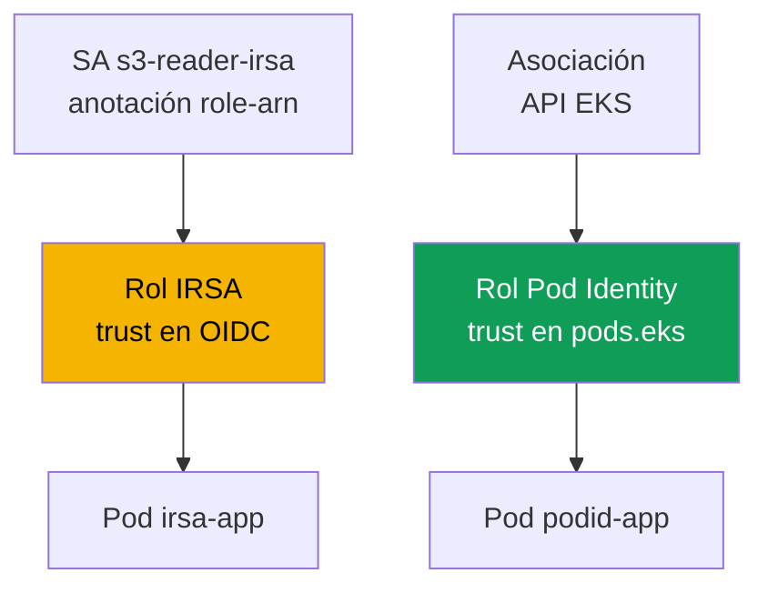
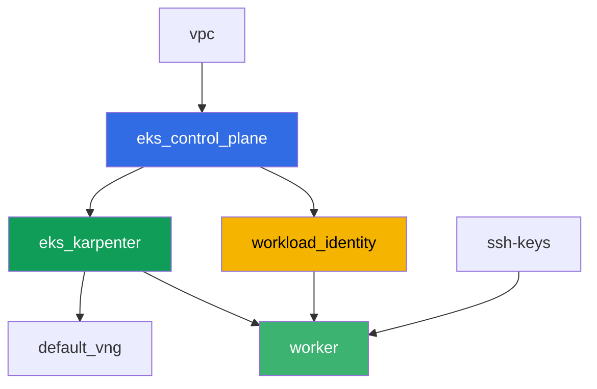

[Русская версия](README_RU.MD) · [Eng version](README.MD) · [Version française](README_FR.MD) · [Deutsche Version](README_DE.MD) · [ქართული ვერსია](README_GE.MD) · [繁體中文版](README_TW.MD) · [日本語版](README_JP.MD)

# Laboratorio 104 - Workload identity: IRSA y Pod Identity para la aplicación

## Descripción

Una aplicación en un pod necesita acceso a S3 y a Secrets Manager. En este laboratorio
configuras ambos mecanismos de asignación de permisos para un pod - IRSA y EKS Pod
Identity - contra recursos reales de AWS creados de antemano por terraform: un bucket de
S3 y un secreto de Secrets Manager. Vinculas un `ServiceAccount` con el rol de IRSA
mediante una anotación, creas una asociación de Pod Identity a través de la API de EKS,
lees un objeto y un secreto desde los pods correspondientes y, al final, reproduces un
síntoma: un pod sin vínculo a IRSA o Pod Identity recibe `AccessDenied`, porque el rol de
la nodo no lleva ningún permiso de aplicación.

Las tareas están escritas en estilo producción: un enunciado breve más criterios de
aceptación. La verificación es automática, mediante el comando `check_result`.

## Objetivo

Reforzar el material de estos capítulos del curso:

- [Capítulo 16. IRSA: el proveedor OIDC, la trust policy, las anotaciones de ServiceAccount](../../course/16/ru.md)
- [Capítulo 17. EKS Pod Identity: el agente, las asociaciones, la migración desde IRSA](../../course/17/ru.md)

## Qué vamos a crear

Terraform crea de antemano el bucket de S3, el secreto de Secrets Manager y ambos roles
de IAM (con nombres predecibles). Tú creas el `ServiceAccount`, los pods y la asociación
de Pod Identity para vincular estos roles con una carga de trabajo concreta.

| Objeto | Qué es | Para qué sirve en este laboratorio |
|--------|---------|-------------------|
| Componente `workload_identity` | S3 bucket, secreto de Secrets Manager, rol IRSA, rol Pod Identity | recursos de AWS ya listos, sus permisos ya están descritos |
| Namespace `eks-104` | la sección del clúster para la carga de trabajo del laboratorio | mantiene los recursos separados de los del sistema |
| ServiceAccount `s3-reader-irsa` + anotación | vincula el SA con el rol IRSA (capítulo 16) | el pod obtiene su rol mediante federación OIDC |
| Pod `irsa-app` | lee un objeto de S3 | confirma que IRSA funciona en vivo |
| Asociación de Pod Identity | vincula `namespace + SA -> rol` en la API de EKS (capítulo 17) | sin anotaciones en el SA, sin objetos en el clúster |
| Pod `podid-app` | lee un secreto de Secrets Manager | confirma que Pod Identity funciona en vivo |
| Pod `plain-app` | sin vínculo a IRSA ni a Pod Identity | síntoma: el rol de la nodo no otorga permisos de aplicación |

Cómo obtienen sus permisos los dos pods de forma diferente:



## Infraestructura

El entorno se despliega en AWS (`eu-central-1`) mediante Terragrunt. La base coincide con
el laboratorio 101 (control plane, Fargate para los pods de sistema, Karpenter para la
carga de trabajo, el addon `eks-pod-identity-agent`), más un componente aparte para los
recursos de demostración de IRSA y Pod Identity.

### Módulos y dependencias

| Directorio (componente) | Módulo (`terraform/modules/`) | Depende de | Qué crea |
|---------------------|-------------------------------|------------|-------------|
| `vpc` | `vpc_v3` | - | VPC `10.10.0.0/16`, subredes en dos AZ, NAT |
| `ssh-keys` | `ssh-keys` | - | un par de claves SSH para la máquina worker y las nodos |
| `eks_control_plane` | `eks_v2_control_plane` | `vpc` | control plane de EKS `1.36`, proveedor OIDC |
| `eks_fargate_system` | `eks_v2_fargate` | `vpc`, `eks_control_plane` | perfil de Fargate para `kube-system` y `karpenter` |
| `eks_addons` | `eks_v2_addons` | `eks_control_plane`, `eks_fargate_system` | coredns, kube-proxy, vpc-cni, `eks-pod-identity-agent` |
| `eks_karpenter` | `eks_v2_karpenter` | `vpc`, `eks_control_plane`, `eks_addons`, `eks_fargate_system` | controlador de Karpenter, rol IAM de las nodos |
| `eks_karpenter_default_vng` | `eks_v2_karpenter_vng` | `vpc`, `eks_control_plane`, `eks_karpenter` | NodePool por defecto `default` en AL2023 |
| `workload_identity` | `eks_v2_workload_identity_demo` | `eks_control_plane` | S3 bucket, secreto de Secrets Manager, rol IRSA, rol Pod Identity |
| `worker` | `eks_v2_work_pc` | `ssh-keys`, `vpc`, `eks_control_plane`, `eks_karpenter`, `workload_identity` | máquina worker con kubectl, las pruebas y `check_result` |

El componente `workload_identity` crea el rol IRSA con una trust policy vinculada
exactamente al SA `s3-reader-irsa` en el namespace `eks-104` (la condición `sub` del
capítulo 16), y un rol de Pod Identity aparte con el principal común
`pods.eks.amazonaws.com` (capítulo 17) - este último no lo vincula terraform a un SA
concreto, sino el comando `aws eks create-pod-identity-association` en la tarea 5.

Grafo de dependencias (lo que se aplica antes queda más abajo en la flecha):



Los componentes `eks_fargate_system` y `eks_addons` no aparecen en el grafo para respetar
el límite de 8 nodos, pero en realidad se ubican entre `eks_control_plane` y
`eks_karpenter` (ver la tabla anterior).

### Nombres predecibles de los recursos

`workload_identity` construye los nombres a partir de `prefix` y `app_name`, así que el
worker los encuentra sin leer el terraform output. Todos están disponibles al arrancar en
el archivo `~/lab104_hints.txt`:

| Recurso | Nombre |
|--------|-----|
| S3 bucket | `eks-task104-workload-identity-bucket` (guiones en vez de `_` - requisito de S3) |
| Secreto de Secrets Manager | `eks-task104-workload_identity-secret` |
| Rol IRSA | `eks-task104-workload_identity-irsa-role` |
| Rol Pod Identity | `eks-task104-workload_identity-pod-identity-role` |

### Dónde se configura cada cosa

`env.hcl` (parámetros comunes del entorno):

| Parámetro | Valor en el laboratorio | Qué afecta |
|----------|-----------------|---------------|
| `region` | `eu-central-1` | la región de todos los recursos |
| `prefix` | `eks-task104` | el prefijo de los nombres de los recursos, incluyendo el bucket y el secreto |
| `stack_name` | `eks104` | con él se construye `env_name` - el nombre del clúster |
| `k8_version` | `1.36.0` | la versión de kubectl en la máquina worker |

`inputs` en el `terragrunt.hcl` de cada componente:

| Archivo | Configuraciones clave |
|------|--------------------|
| `eks_addons/terragrunt.hcl` | se añade `eks-pod-identity-agent` versión `v1.3.10-eksbuild.2` |
| `workload_identity/terragrunt.hcl` | `irsa.namespace = "eks-104"`, `irsa.service_account_name = "s3-reader-irsa"` |
| `worker/terragrunt.hcl` | `test_url` y `task_script_url` apuntando a los archivos del laboratorio 104, dependencia de `workload_identity` |

## Despliegue

```bash
TASK=104 make run_eks_task
```

El despliegue tarda aproximadamente 15-20 minutos. En la salida, busca la línea con la
conexión SSH a la máquina worker y conéctate a ella. kubectl ya está configurado allí
para el clúster correcto, y los nombres y ARN de los recursos del laboratorio están en el
archivo `~/lab104_hints.txt`.

Comandos útiles en la máquina worker:

```bash
time_left       # cuánto tiempo le queda al entorno
check_result    # verificar la solución
cat ~/lab104_hints.txt   # nombres y ARN del bucket, el secreto y ambos roles
```

> Seguridad del stand. En `env.hcl` están habilitados `ssh_password_enable = true` y
> `access_cidrs = ["0.0.0.0/0"]` - esto es cómodo para un entorno de aprendizaje, pero no
> debe hacerse así en producción. Según los estándares del curso (capítulos 0.2, 2, 19),
> el acceso a las máquinas worker se abre a través de AWS SSM Session Manager sin puertos
> SSH públicos hacia afuera, y `access_cidrs` se restringe a direcciones concretas. Aquí
> se deja el SSH público solo por simplicidad de la puesta en marcha.

## Tareas

---
|        **1**        | **Namespace para la carga de trabajo del laboratorio**                             |
| :-----------------: | :---------------------------------------------------------- |
| Qué hacer          | Crea un namespace llamado `eks-104`. Todos los objetos del laboratorio se crean dentro de él. |
| Criterios de aceptación    | - el namespace `eks-104` existe. |
---
|        **2**        | **ServiceAccount con una anotación IRSA**                         |
| :-----------------: | :---------------------------------------------------------- |
| Qué hacer          | Crea el `ServiceAccount` `s3-reader-irsa` en `eks-104` con la anotación `eks.amazonaws.com/role-arn` igual al ARN del rol IRSA (`irsa_role_arn` de `~/lab104_hints.txt`). Este rol ya fue creado por terraform con una trust policy que confía exactamente en este SA. |
| Criterios de aceptación    | - el ServiceAccount `s3-reader-irsa` en `eks-104` con la anotación `eks.amazonaws.com/role-arn` que contiene `irsa-role`. |
---
|        **3**        | **Pod con IRSA: verificación de identidad**                        |
| :-----------------: | :---------------------------------------------------------- |
| Qué hacer          | Crea el Pod `irsa-app` (imagen `amazon/aws-cli:2.15.0`, comando `sleep 3600`) con `serviceAccountName: s3-reader-irsa`. Desde el pod, ejecuta `aws sts get-caller-identity` y guarda la salida en `/var/work/tests/artifacts/3/irsa_identity.txt`. En `Arn` debe aparecer un `assumed-role` de tu rol IRSA, no el rol de la nodo. |
| Criterios de aceptación    | - el Pod `irsa-app` usa el SA `s3-reader-irsa`;<br/>- el archivo `3/irsa_identity.txt` no está vacío y contiene `assumed-role` e `irsa-role`. |
---
|        **4**        | **Lectura de un objeto de S3 mediante IRSA**                          |
| :-----------------: | :---------------------------------------------------------- |
| Qué hacer          | Desde el pod `irsa-app`, lee el objeto `hello.txt` del bucket (`bucket_name` del archivo de pistas): `aws s3 cp s3://<bucket>/hello.txt -`. Guarda la salida en `/var/work/tests/artifacts/4/s3_read.txt`. |
| Criterios de aceptación    | - el archivo `4/s3_read.txt` no está vacío y contiene la línea `hello from s3`. |
---
|        **5**        | **Asociación de Pod Identity**                                  |
| :-----------------: | :---------------------------------------------------------- |
| Qué hacer          | Crea el `ServiceAccount` `secret-reader-podid` en `eks-104` (sin anotaciones). Vincúlalo con el rol Pod Identity mediante `aws eks create-pod-identity-association --cluster-name <cluster> --namespace eks-104 --service-account secret-reader-podid --role-arn <pod_identity_role_arn>`. Guarda `aws eks list-pod-identity-associations --cluster-name <cluster> --namespace eks-104` en `/var/work/tests/artifacts/5/association.txt`. |
| Criterios de aceptación    | - el archivo `5/association.txt` no está vacío y menciona `secret-reader-podid` y `eks-104`. |
---
|        **6**        | **Pod con Pod Identity: lectura de un secreto**                       |
| :-----------------: | :---------------------------------------------------------- |
| Qué hacer          | Crea el Pod `podid-app` (imagen `amazon/aws-cli:2.15.0`, comando `sleep 3600`) con `serviceAccountName: secret-reader-podid`. Desde el pod, ejecuta `aws sts get-caller-identity` y `aws secretsmanager get-secret-value --secret-id <secret_name>`, guarda ambas salidas en `/var/work/tests/artifacts/6/secret_read.txt`. La identidad debe mostrar `assumed-role` del rol Pod Identity, y el valor del secreto debe ser un JSON con el campo `username`. |
| Criterios de aceptación    | - el Pod `podid-app` usa el SA `secret-reader-podid`;<br/>- el archivo `6/secret_read.txt` no está vacío, contiene `pod-identity-role` y el valor del secreto (`username` o `demo123`). |
---
|        **7**        | **Síntoma: el rol de la nodo no otorga permisos de aplicación**                |
| :-----------------: | :---------------------------------------------------------- |
| Qué hacer          | Crea el Pod `plain-app` (imagen `amazon/aws-cli:2.15.0`, comando `sleep 3600`) sin `serviceAccountName` (el SA `default` habitual, sin vínculo a IRSA ni a Pod Identity). Desde el pod, intenta `aws s3 ls s3://<bucket>/` - debe devolver un error `AccessDenied`, porque el rol de la nodo solo lleva los permisos de los componentes de sistema. Guarda la salida (incluido el error) en `/var/work/tests/artifacts/7/node_role_denied.txt`. |
| Criterios de aceptación    | - el archivo `7/node_role_denied.txt` no está vacío y contiene `AccessDenied` (o `is not authorized`). |
---

## Verificación del resultado

En la máquina worker, ejecuta la verificación automática:

```bash
check_result
```

El script ejecutará las pruebas y mostrará el porcentaje de tareas completadas.

## Solución

Solución de referencia: [worker/files/solutions/1_ES.MD](worker/files/solutions/1_ES.MD)

## Eliminación del clúster y los recursos

> **Primero retira la carga de trabajo y espera a que se vayan las nodos EC2, luego
> destruye el stand.** Los pods `irsa-app`, `podid-app` y `plain-app` van a las nodos EC2
> de Karpenter (para `eks-104` no hay perfil de Fargate). Si eliminas el clúster con la
> carga de trabajo todavía en marcha, la nodo EC2 se va con él, pero el ENI secundario del
> VPC CNI queda en estado `available` y retiene el security group de las nodos - `destroy`
> se queda colgado en `module.eks.aws_security_group.node[0]: Still destroying...` durante
> decenas de minutos.

```bash
# 1. Retirar la carga de trabajo del laboratorio
kubectl delete namespace eks-104 --ignore-not-found

# 2. No es obligatorio, pero es más limpio: retirar la asociación de Pod Identity - vive
#    como un objeto de EKS, no en el terraform state, y de lo contrario permanecería hasta
#    que se elimine el propio clúster
CLUSTER=$(aws eks list-clusters --query 'clusters[0]' --output text)
ASSOC_ID=$(aws eks list-pod-identity-associations --cluster-name "$CLUSTER" \
  --namespace eks-104 --query 'associations[0].associationId' --output text)
[ "$ASSOC_ID" != "None" ] && aws eks delete-pod-identity-association \
  --cluster-name "$CLUSTER" --association-id "$ASSOC_ID"

# 3. Esperar a que Karpenter retire el NodeClaim y la nodo EC2 (solo deben quedar
#    fargate-*)
while kubectl get nodeclaims --no-headers 2>/dev/null | grep -q .; do
  echo "NodeClaim todavía vivo, esperando..."; sleep 15
done
kubectl get nodes | grep -v fargate
```

Solo después de esto destruye el stand (el bucket de S3, el secreto y ambos roles IAM se
irán junto con el componente `workload_identity`):

```bash
TASK=104 make delete_eks_task
```

Si `destroy` de todas formas se queda atascado en el security group de las nodos, es que
quedó un ENI huérfano. Búscalo y elimínalo:

```bash
aws ec2 describe-network-interfaces --filters Name=status,Values=available \
  --query 'NetworkInterfaces[?Tags[?Key==`eks:eni:owner`]].[NetworkInterfaceId,Description]' \
  --output table
aws ec2 delete-network-interface --network-interface-id <eni-id>
```
