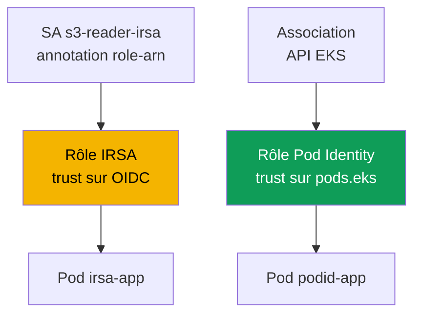
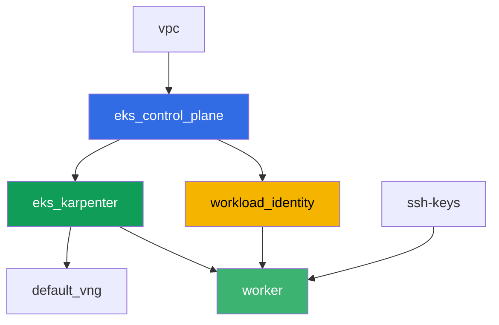

[Русская версия](README_RU.MD) · [Eng version](README.MD) · [Versión en español](README_ES.MD) · [Deutsche Version](README_DE.MD) · [ქართული ვერსია](README_GE.MD) · [繁體中文版](README_TW.MD) · [日本語版](README_JP.MD)

# Lab 104 - Workload identity: IRSA et Pod Identity pour l'application

## Description

Une application dans un pod a besoin d'accéder à S3 et à Secrets Manager. Dans cette lab,
vous configurez les deux mécanismes d'attribution de droits à un pod - IRSA et EKS Pod
Identity - sur des ressources AWS réelles, créées au préalable par terraform : un bucket S3
et un secret Secrets Manager. Vous liez un `ServiceAccount` au rôle IRSA via une annotation,
créez une association Pod Identity via l'API EKS, lisez un objet et un secret depuis les
pods correspondants, et reproduisez enfin le symptôme : un pod sans liaison à IRSA ou à
Pod Identity reçoit `AccessDenied`, car le rôle de la node ne porte aucun droit applicatif.

Les tâches sont rédigées dans un style production : un énoncé court plus des critères
d'acceptation. La vérification est automatique, via la commande `check_result`.

## Objectif

Consolider la matière des chapitres du cours :

- [Chapitre 16. IRSA : fournisseur OIDC, trust policy, annotations ServiceAccount](../../course/16/fr.md)
- [Chapitre 17. EKS Pod Identity : agent, associations, migration depuis IRSA](../../course/17/fr.md)

## Ce que nous créons

Terraform crée au préalable le bucket S3, le secret Secrets Manager et les deux rôles IAM
(avec des noms prévisibles). Vous créez le `ServiceAccount`, les pods et l'association Pod
Identity, pour lier ces rôles à une charge de travail précise.

| Objet | Ce que c'est | Pourquoi dans cette lab |
|--------|---------|-------------------|
| Composant `workload_identity` | Bucket S3, secret Secrets Manager, rôle IRSA, rôle Pod Identity | ressources AWS prêtes, droits déjà décrits |
| Namespace `eks-104` | section du cluster pour la charge de travail de la lab | garde les ressources séparées des ressources système |
| ServiceAccount `s3-reader-irsa` + annotation | liaison du SA au rôle IRSA (chapitre 16) | le pod obtient son rôle via la fédération OIDC |
| Pod `irsa-app` | lit un objet depuis S3 | confirme le fonctionnement d'IRSA en direct |
| Association Pod Identity | liaison `namespace + SA -> rôle` dans l'API EKS (chapitre 17) | pas d'annotations sur le SA, pas d'objets dans le cluster |
| Pod `podid-app` | lit un secret depuis Secrets Manager | confirme le fonctionnement de Pod Identity en direct |
| Pod `plain-app` | sans liaison à IRSA ou à Pod Identity | symptôme : le rôle de la node ne donne aucun droit applicatif |

Comment les droits sont attribués différemment aux deux pods :



## Infrastructure

L'environnement est déployé sur AWS (`eu-central-1`) via Terragrunt. La base correspond à
la lab 101 (control plane, Fargate pour les pods système, Karpenter pour la charge de
travail, l'addon `eks-pod-identity-agent`), plus un composant séparé pour les ressources de
démo IRSA et Pod Identity.

### Modules et dépendances

| Répertoire (composant) | Module (`terraform/modules/`) | Dépend de | Ce qu'il crée |
|---------------------|-------------------------------|------------|-------------|
| `vpc` | `vpc_v3` | - | VPC `10.10.0.0/16`, sous-réseaux dans deux AZ, NAT |
| `ssh-keys` | `ssh-keys` | - | paire de clés SSH pour la machine de travail et les nodes |
| `eks_control_plane` | `eks_v2_control_plane` | `vpc` | control plane EKS `1.36`, fournisseur OIDC |
| `eks_fargate_system` | `eks_v2_fargate` | `vpc`, `eks_control_plane` | profil Fargate pour `kube-system` et `karpenter` |
| `eks_addons` | `eks_v2_addons` | `eks_control_plane`, `eks_fargate_system` | coredns, kube-proxy, vpc-cni, `eks-pod-identity-agent` |
| `eks_karpenter` | `eks_v2_karpenter` | `vpc`, `eks_control_plane`, `eks_addons`, `eks_fargate_system` | contrôleur Karpenter, rôle IAM des nodes |
| `eks_karpenter_default_vng` | `eks_v2_karpenter_vng` | `vpc`, `eks_control_plane`, `eks_karpenter` | NodePool par défaut `default` sur AL2023 |
| `workload_identity` | `eks_v2_workload_identity_demo` | `eks_control_plane` | bucket S3, secret Secrets Manager, rôle IRSA, rôle Pod Identity |
| `worker` | `eks_v2_work_pc` | `ssh-keys`, `vpc`, `eks_control_plane`, `eks_karpenter`, `workload_identity` | machine de travail avec kubectl, les tests et `check_result` |

Le composant `workload_identity` crée le rôle IRSA avec une trust policy liée exactement au
SA `s3-reader-irsa` dans le namespace `eks-104` (condition `sub` du chapitre 16), et un rôle
Pod Identity séparé avec le principal commun `pods.eks.amazonaws.com` (chapitre 17) - il est
lié à un SA précis non par terraform, mais par la commande
`aws eks create-pod-identity-association` dans la tâche 5.

Graphe des dépendances (ce qui est appliqué en premier est plus bas dans la flèche) :



Les composants `eks_fargate_system` et `eks_addons` ne sont pas montrés sur le graphe pour
respecter la limite de 8 nœuds, mais ils se situent en réalité entre `eks_control_plane` et
`eks_karpenter` (voir le tableau ci-dessus).

### Noms de ressources prévisibles

`workload_identity` construit les noms à partir de `prefix` et `app_name`, si bien que le
worker les trouve sans lire la sortie terraform. Ils sont tous disponibles au démarrage
dans le fichier `~/lab104_hints.txt` :

| Ressource | Nom |
|--------|-----|
| Bucket S3 | `eks-task104-workload-identity-bucket` (tirets au lieu de `_` - exigence de S3) |
| Secret Secrets Manager | `eks-task104-workload_identity-secret` |
| Rôle IRSA | `eks-task104-workload_identity-irsa-role` |
| Rôle Pod Identity | `eks-task104-workload_identity-pod-identity-role` |

### Où tout est configuré

`env.hcl` (paramètres partagés de l'environnement) :

| Paramètre | Valeur dans la lab | Ce que ça affecte |
|----------|-----------------|---------------|
| `region` | `eu-central-1` | région de toutes les ressources |
| `prefix` | `eks-task104` | préfixe des noms de ressources, y compris le bucket et le secret |
| `stack_name` | `eks104` | sert à construire `env_name` - le nom du cluster |
| `k8_version` | `1.36.0` | version de kubectl sur la machine de travail |

`inputs` dans le `terragrunt.hcl` de chaque composant :

| Fichier | Réglages clés |
|------|--------------------|
| `eks_addons/terragrunt.hcl` | ajout d'`eks-pod-identity-agent` version `v1.3.10-eksbuild.2` |
| `workload_identity/terragrunt.hcl` | `irsa.namespace = "eks-104"`, `irsa.service_account_name = "s3-reader-irsa"` |
| `worker/terragrunt.hcl` | `test_url` et `task_script_url` vers les fichiers de la lab 104, dépendance à `workload_identity` |

## Déploiement

```bash
TASK=104 make run_eks_task
```

Le déploiement prend environ 15-20 minutes. Dans la sortie, trouvez la ligne avec la
connexion SSH à la machine de travail et connectez-vous. kubectl y est déjà configuré pour
le bon cluster, et les noms et ARN des ressources de la lab sont dans le fichier
`~/lab104_hints.txt`.

Commandes utiles sur la machine de travail :

```bash
time_left       # temps restant de l'environnement
check_result    # vérifier la solution
cat ~/lab104_hints.txt   # noms et ARN du bucket, du secret et des deux rôles
```

> Sécurité du stand. Dans `env.hcl`, `ssh_password_enable = true` et
> `access_cidrs = ["0.0.0.0/0"]` sont activés - pratique pour un environnement de
> formation, mais à ne pas faire en production. Selon les standards du cours (chapitres
> 0.2, 2, 19), l'accès aux machines de travail se fait via AWS SSM Session Manager sans
> ports SSH publics exposés, et `access_cidrs` est restreint à des adresses précises. Ici,
> le SSH public est laissé uniquement pour simplifier le démarrage.

## Tâches

---
|        **1**        | **Namespace pour la charge de travail de la lab**                             |
| :-----------------: | :---------------------------------------------------------- |
| Ce qu'il faut faire          | Créez un namespace nommé `eks-104`. Tous les objets de la lab sont créés à l'intérieur. |
| Critères d'acceptation    | - le namespace `eks-104` existe. |
---
|        **2**        | **ServiceAccount avec annotation IRSA**                         |
| :-----------------: | :---------------------------------------------------------- |
| Ce qu'il faut faire          | Créez le `ServiceAccount` `s3-reader-irsa` dans `eks-104` avec l'annotation `eks.amazonaws.com/role-arn`, égale à l'ARN du rôle IRSA (`irsa_role_arn` depuis `~/lab104_hints.txt`). Ce rôle est déjà créé par terraform avec une trust policy qui fait confiance exactement à ce SA. |
| Critères d'acceptation    | - ServiceAccount `s3-reader-irsa` dans `eks-104` avec l'annotation `eks.amazonaws.com/role-arn` contenant `irsa-role`. |
---
|        **3**        | **Pod avec IRSA : vérification de l'identité**                        |
| :-----------------: | :---------------------------------------------------------- |
| Ce qu'il faut faire          | Créez le Pod `irsa-app` (image `amazon/aws-cli:2.15.0`, commande `sleep 3600`) avec `serviceAccountName: s3-reader-irsa`. Depuis le pod, exécutez `aws sts get-caller-identity` et enregistrez la sortie dans `/var/work/tests/artifacts/3/irsa_identity.txt`. Dans `Arn`, il doit y avoir un `assumed-role` de votre rôle IRSA, pas le rôle de la node. |
| Critères d'acceptation    | - le Pod `irsa-app` utilise le SA `s3-reader-irsa` ;<br/>- le fichier `3/irsa_identity.txt` n'est pas vide et contient `assumed-role` et `irsa-role`. |
---
|        **4**        | **Lecture d'un objet depuis S3 via IRSA**                          |
| :-----------------: | :---------------------------------------------------------- |
| Ce qu'il faut faire          | Depuis le pod `irsa-app`, lisez l'objet `hello.txt` dans le bucket (`bucket_name` depuis le fichier d'indices) : `aws s3 cp s3://<bucket>/hello.txt -`. Enregistrez la sortie dans `/var/work/tests/artifacts/4/s3_read.txt`. |
| Critères d'acceptation    | - le fichier `4/s3_read.txt` n'est pas vide et contient la ligne `hello from s3`. |
---
|        **5**        | **Association Pod Identity**                                  |
| :-----------------: | :---------------------------------------------------------- |
| Ce qu'il faut faire          | Créez le `ServiceAccount` `secret-reader-podid` dans `eks-104` (sans annotations). Liez-le au rôle Pod Identity via `aws eks create-pod-identity-association --cluster-name <cluster> --namespace eks-104 --service-account secret-reader-podid --role-arn <pod_identity_role_arn>`. Enregistrez `aws eks list-pod-identity-associations --cluster-name <cluster> --namespace eks-104` dans `/var/work/tests/artifacts/5/association.txt`. |
| Critères d'acceptation    | - le fichier `5/association.txt` n'est pas vide et mentionne `secret-reader-podid` et `eks-104`. |
---
|        **6**        | **Pod avec Pod Identity : lecture d'un secret**                       |
| :-----------------: | :---------------------------------------------------------- |
| Ce qu'il faut faire          | Créez le Pod `podid-app` (image `amazon/aws-cli:2.15.0`, commande `sleep 3600`) avec `serviceAccountName: secret-reader-podid`. Depuis le pod, exécutez `aws sts get-caller-identity` et `aws secretsmanager get-secret-value --secret-id <secret_name>`, enregistrez les deux sorties dans `/var/work/tests/artifacts/6/secret_read.txt`. L'identité doit montrer un `assumed-role` du rôle Pod Identity, et la valeur du secret un JSON avec un champ `username`. |
| Critères d'acceptation    | - le Pod `podid-app` utilise le SA `secret-reader-podid` ;<br/>- le fichier `6/secret_read.txt` n'est pas vide, contient `pod-identity-role` et la valeur du secret (`username` ou `demo123`). |
---
|        **7**        | **Symptôme : le rôle de la node ne donne aucun droit applicatif**                |
| :-----------------: | :---------------------------------------------------------- |
| Ce qu'il faut faire          | Créez le Pod `plain-app` (image `amazon/aws-cli:2.15.0`, commande `sleep 3600`) sans `serviceAccountName` (SA `default` habituel, sans liaison à IRSA ou à Pod Identity). Depuis le pod, essayez `aws s3 ls s3://<bucket>/` - une erreur `AccessDenied` doit revenir, car le rôle de la node ne porte que les droits des composants système. Enregistrez la sortie (y compris l'erreur) dans `/var/work/tests/artifacts/7/node_role_denied.txt`. |
| Critères d'acceptation    | - le fichier `7/node_role_denied.txt` n'est pas vide et contient `AccessDenied` (ou `is not authorized`). |
---

## Vérification du résultat

Sur la machine de travail, lancez la vérification automatique :

```bash
check_result
```

Le script exécutera les tests et affichera le pourcentage de tâches accomplies.

## Solution

Solution de référence : [worker/files/solutions/1_FR.MD](worker/files/solutions/1_FR.MD)

## Suppression du cluster et des ressources

> **Retirez d'abord la charge de travail et attendez que les nodes EC2 disparaissent,
> ensuite seulement détruisez le stand.** Les pods `irsa-app`, `podid-app` et `plain-app`
> vont sur des nodes EC2 Karpenter (il n'y a pas de profil Fargate pour `eks-104`). Si vous
> supprimez le cluster avec une charge de travail active, la node EC2 disparaît avec lui,
> mais l'ENI secondaire du VPC CNI reste à l'état `available` et retient le security group
> des nodes - `destroy` se bloque sur
> `module.eks.aws_security_group.node[0]: Still destroying...` pendant des dizaines de
> minutes.

```bash
# 1. Retirer la charge de travail de la lab
kubectl delete namespace eks-104 --ignore-not-found

# 2. Pas obligatoire, mais plus propre : retirer l'association Pod Identity - elle vit
#    comme un objet EKS, pas dans le terraform state, et resterait sinon jusqu'à la
#    suppression du cluster lui-même
CLUSTER=$(aws eks list-clusters --query 'clusters[0]' --output text)
ASSOC_ID=$(aws eks list-pod-identity-associations --cluster-name "$CLUSTER" \
  --namespace eks-104 --query 'associations[0].associationId' --output text)
[ "$ASSOC_ID" != "None" ] && aws eks delete-pod-identity-association \
  --cluster-name "$CLUSTER" --association-id "$ASSOC_ID"

# 3. Attendre que Karpenter retire le NodeClaim et la node EC2 (ne doivent rester que les
#    fargate-*)
while kubectl get nodeclaims --no-headers 2>/dev/null | grep -q .; do
  echo "NodeClaim encore vivant, on attend..."; sleep 15
done
kubectl get nodes | grep -v fargate
```

Ce n'est qu'ensuite que vous détruisez le stand (le bucket S3, le secret et les deux rôles
IAM disparaîtront avec le composant `workload_identity`) :

```bash
TASK=104 make delete_eks_task
```

Si `destroy` reste tout de même bloqué sur le security group des nodes, c'est qu'un ENI
orphelin subsiste. Trouvez-le et supprimez-le :

```bash
aws ec2 describe-network-interfaces --filters Name=status,Values=available \
  --query 'NetworkInterfaces[?Tags[?Key==`eks:eni:owner`]].[NetworkInterfaceId,Description]' \
  --output table
aws ec2 delete-network-interface --network-interface-id <eni-id>
```
