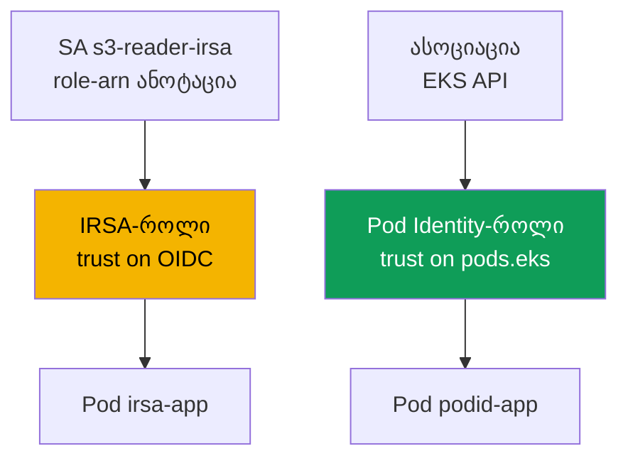
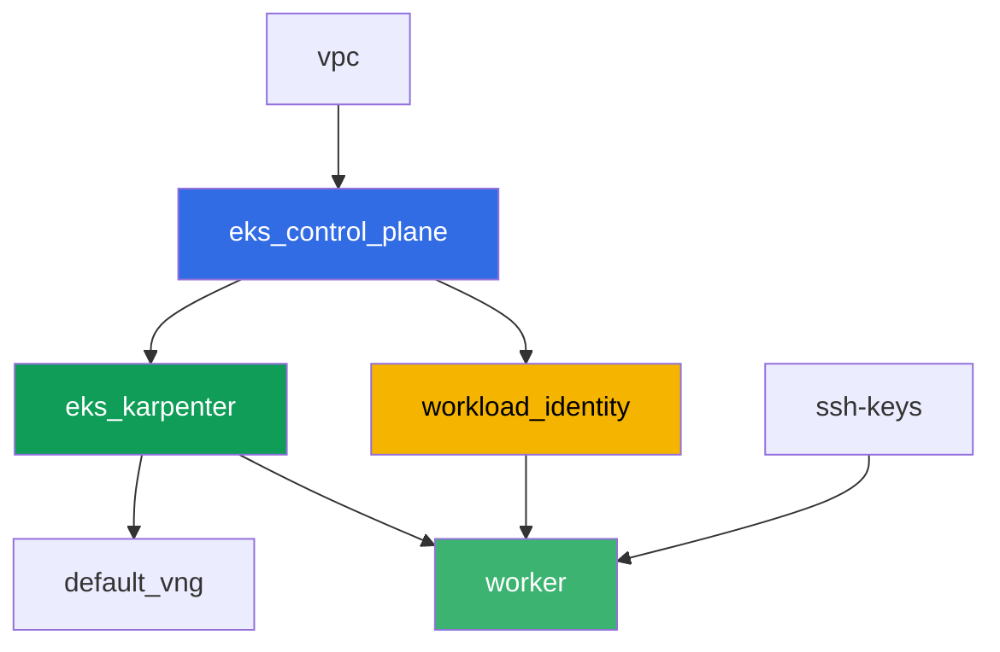

[Русская версия](README_RU.MD) · [Eng version](README.MD) · [Versión en español](README_ES.MD) · [Version française](README_FR.MD) · [Deutsche Version](README_DE.MD) · [繁體中文版](README_TW.MD) · [日本語版](README_JP.MD)

# ლაბორატორია 104 - Workload identity: IRSA და Pod Identity აპლიკაციისთვის

## აღწერა

პოდში მდებარე აპლიკაციას სჭირდება წვდომა S3-სა და Secrets Manager-ზე. ამ ლაბაში
თქვენ აწყობთ ორივე მექანიზმს პოდისთვის უფლებების გადასაცემად - IRSA-ს და EKS Pod
Identity-ს - AWS-ის რეალურ რესურსებზე, რომლებიც terraform-მა წინასწარ შექმნა: S3
bucket-სა და Secrets Manager-ის secret-ზე. თქვენ აკავშირებთ `ServiceAccount`-ს
IRSA-როლთან ანოტაციის მეშვეობით, ქმნით Pod Identity-ის ასოციაციას EKS API-ის
მეშვეობით, კითხავთ ობიექტსა და secret-ს შესაბამისი პოდებიდან და ბოლოს
ხელახლა ტესტავთ სიმპტომს: პოდი, რომელსაც IRSA-სთან ან Pod Identity-სთან
კავშირი არ აქვს, იღებს `AccessDenied`-ს, რადგან ნოუდის როლს არავითარი
პრიკლადული უფლება არ გააქვს.

დავალებები დაწერილია production-სტილში: მოკლე დავალება პლუს მიღების
კრიტერიუმები. შემოწმება ავტომატურია, ბრძანებით `check_result`.

## მიზანი

გავამყაროთ კურსის ამ თავების მასალა:

- [თავი 16. IRSA: OIDC-პროვაიდერი, trust policy, ServiceAccount-ის ანოტაციები](../../course/16/ge.md)
- [თავი 17. EKS Pod Identity: აგენტი, ასოციაციები, IRSA-დან მიგრაცია](../../course/17/ge.md)

## რას ვქმნით

Terraform წინასწარ ქმნის S3 bucket-ს, Secrets Manager-ის secret-სა და ორივე
IAM-როლს (გამოსაცნობი სახელებით). თქვენ ქმნით `ServiceAccount`-ს, პოდებსა და
Pod Identity-ის ასოციაციას, რომ დაუკავშირდეთ ეს როლები კონკრეტულ დატვირთვას.

| ობიექტი | რა არის ეს | რისთვის ამ ლაბაში |
|--------|---------|-------------------|
| კომპონენტი `workload_identity` | S3 bucket, Secrets Manager secret, IRSA-როლი, Pod Identity-როლი | მზა AWS-რესურსები, მათი უფლებები უკვე აღწერილია |
| Namespace `eks-104` | ლაბის დატვირთვის კლასტერის სექცია | რესურსების სისტემურისგან განცალკევებულად შენახვა |
| ServiceAccount `s3-reader-irsa` + ანოტაცია | SA-ს კავშირი IRSA-როლთან (თავი 16) | პოდი იღებს საკუთარ როლს OIDC federation-ის მეშვეობით |
| Pod `irsa-app` | კითხავს ობიექტს S3-დან | ვადასტურებთ IRSA-ს მუშაობას ცოცხლად |
| Pod Identity-ის ასოციაცია | კავშირი `namespace + SA -> როლი` EKS API-ში (თავი 17) | SA-ზე ანოტაციების გარეშე, კლასტერში ობიექტების გარეშე |
| Pod `podid-app` | კითხავს secret-ს Secrets Manager-იდან | ვადასტურებთ Pod Identity-ის მუშაობას ცოცხლად |
| Pod `plain-app` | IRSA-სთან ან Pod Identity-სთან კავშირის გარეშე | სიმპტომი: ნოუდის როლი პრიკლადულ უფლებებს არ იძლევა |

როგორ გადაეცემა უფლებები ორ პოდს სხვადასხვა გზით:



## ინფრასტრუქტურა

გარემო დეპლოირდება AWS-ში (`eu-central-1`) Terragrunt-ის მეშვეობით. ბაზა
ემთხვევა ლაბა 101-ს (control plane, Fargate სისტემურ პოდებზე, Karpenter
დატვირთვაზე, addon `eks-pod-identity-agent`), პლუს ცალკე კომპონენტი IRSA-სა
და Pod Identity-ის დემო-რესურსებისთვის.

### მოდულები და დამოკიდებულებები

| დირექტორია (კომპონენტი) | მოდული (`terraform/modules/`) | დამოკიდებულია | რას ქმნის |
|---------------------|-------------------------------|------------|-------------|
| `vpc` | `vpc_v3` | - | VPC `10.10.0.0/16`, ქვექსელები ორ AZ-ში, NAT |
| `ssh-keys` | `ssh-keys` | - | SSH-გასაღებების წყვილი სამუშაო მანქანისა და ნოუდებისთვის |
| `eks_control_plane` | `eks_v2_control_plane` | `vpc` | EKS control plane `1.36`, OIDC-პროვაიდერი |
| `eks_fargate_system` | `eks_v2_fargate` | `vpc`, `eks_control_plane` | Fargate-პროფილი `kube-system`-ისთვის და `karpenter`-ისთვის |
| `eks_addons` | `eks_v2_addons` | `eks_control_plane`, `eks_fargate_system` | coredns, kube-proxy, vpc-cni, `eks-pod-identity-agent` |
| `eks_karpenter` | `eks_v2_karpenter` | `vpc`, `eks_control_plane`, `eks_addons`, `eks_fargate_system` | Karpenter-ის კონტროლერი, ნოუდების IAM-როლი |
| `eks_karpenter_default_vng` | `eks_v2_karpenter_vng` | `vpc`, `eks_control_plane`, `eks_karpenter` | ნაგულისხმევი NodePool `default` AL2023-ზე |
| `workload_identity` | `eks_v2_workload_identity_demo` | `eks_control_plane` | S3 bucket, Secrets Manager secret, IRSA-როლი, Pod Identity-როლი |
| `worker` | `eks_v2_work_pc` | `ssh-keys`, `vpc`, `eks_control_plane`, `eks_karpenter`, `workload_identity` | სამუშაო მანქანა kubectl-ით, ტესტებით და `check_result`-ით |

კომპონენტი `workload_identity` ქმნის IRSA-როლს trust policy-ით, რომელიც
დაკავშირებულია ზუსტად SA `s3-reader-irsa`-ზე namespace `eks-104`-ში (პირობა
`sub` თავი 16-იდან), და ცალკე Pod Identity-როლს საერთო principal-ით
`pods.eks.amazonaws.com` (თავი 17) - მას კონკრეტულ SA-სთან აკავშირებს არა
terraform, არამედ ბრძანება `aws eks create-pod-identity-association`
დავალება 5-ში.

დამოკიდებულებების გრაფი (რაც უფრო ადრე აპლიცირდება, ის ხრიხისკენ ქვემოთაა):



კომპონენტები `eks_fargate_system` და `eks_addons` გრაფზე ნაჩვენები არ არის
8-კვანძის ლიმიტის გამო, მაგრამ ფაქტობრივად დგანან `eks_control_plane`-სა და
`eks_karpenter`-ს შორის (იხილეთ ცხრილი ზემოთ).

### გამოსაცნობი რესურსების სახელები

`workload_identity` აწყობს სახელებს `prefix`-სა და `app_name`-ისგან, ამიტომ
worker-ს ისინი terraform output-ის წაკითხვის გარეშე ეპოვნება. ისინი ყველა
ჩატანილია ფაილში `~/lab104_hints.txt`:

| რესურსი | სახელი |
|--------|-----|
| S3 bucket | `eks-task104-workload-identity-bucket` (დეფისები `_`-ის ნაცვლად - S3-ის მოთხოვნა) |
| Secrets Manager secret | `eks-task104-workload_identity-secret` |
| IRSA-როლი | `eks-task104-workload_identity-irsa-role` |
| Pod Identity-როლი | `eks-task104-workload_identity-pod-identity-role` |

### სად რა კონფიგურირდება

`env.hcl` (გარემოს საერთო პარამეტრები):

| პარამეტრი | მნიშვნელობა ლაბაში | რას ცვლის |
|----------|-----------------|---------------|
| `region` | `eu-central-1` | ყველა რესურსის რეგიონი |
| `prefix` | `eks-task104` | რესურსების სახელების პრეფიქსი, bucket-ისა და secret-ის ჩათვლით |
| `stack_name` | `eks104` | მისგან იწყობა `env_name` - კლასტერის სახელი |
| `k8_version` | `1.36.0` | kubectl-ის ვერსია სამუშაო მანქანაზე |

`inputs` თითოეული კომპონენტის `terragrunt.hcl`-ში:

| ფაილი | ძირითადი პარამეტრები |
|------|--------------------|
| `eks_addons/terragrunt.hcl` | დამატებულია `eks-pod-identity-agent` ვერსია `v1.3.10-eksbuild.2` |
| `workload_identity/terragrunt.hcl` | `irsa.namespace = "eks-104"`, `irsa.service_account_name = "s3-reader-irsa"` |
| `worker/terragrunt.hcl` | `test_url` და `task_script_url` ლაბა 104-ის ფაილებზე, დამოკიდებულება `workload_identity`-ზე |

## განლაგება

```bash
TASK=104 make run_eks_task
```

განლაგება გრძელდება დაახლოებით 15-20 წუთი. output-ში მოძებნეთ ხაზი
SSH-შეერთებით სამუშაო მანქანასთან და დაუკავშირდით მას. kubectl იქ უკვე
კონფიგურირებულია საჭირო კლასტერზე, ხოლო ლაბის რესურსების სახელები და ARN-ები
- ფაილში `~/lab104_hints.txt`.

სასარგებლო ბრძანებები სამუშაო მანქანაზე:

```bash
time_left       # რამდენი დრო დარჩა გარემოს
check_result    # გადაწყვეტის შემოწმება
cat ~/lab104_hints.txt   # bucket-ის, secret-ისა და ორივე როლის სახელები და ARN-ები
```

> სტენდის უსაფრთხოება. `env.hcl`-ში ჩართულია `ssh_password_enable = true` და
> `access_cidrs = ["0.0.0.0/0"]` - ეს მოსახერხებელია სასწავლო გარემოსთვის,
> მაგრამ ასე არ უნდა გავხადოთ production-ში. კურსის სტანდარტების მიხედვით
> (თავები 0.2, 2, 19) სამუშაო მანქანებზე წვდომა იხსნება AWS SSM Session
> Manager-ის მეშვეობით, საჯარო SSH-პორტების გარეთ გამოტანის გარეშე, ხოლო
> `access_cidrs` ვიწროვდება კონკრეტულ მისამართებზე. აქ საჯარო SSH დარჩენილია
> მხოლოდ გაშვების გასამარტივებლად.

## დავალებები

---
|        **1**        | **Namespace ლაბის დატვირთვისთვის**                             |
| :-----------------: | :---------------------------------------------------------- |
| რას ვაკეთებთ          | შექმენით namespace სახელით `eks-104`. ლაბის ყველა ობიექტი მასში ქმნება. |
| მიღების კრიტერიუმები    | - namespace `eks-104` არსებობს. |
---
|        **2**        | **ServiceAccount IRSA-ანოტაციით**                         |
| :-----------------: | :---------------------------------------------------------- |
| რას ვაკეთებთ          | შექმენით `ServiceAccount` `s3-reader-irsa` `eks-104`-ში ანოტაციით `eks.amazonaws.com/role-arn`, რომელიც ტოლია IRSA-როლის ARN-ის (`irsa_role_arn` ფაილიდან `~/lab104_hints.txt`). ეს როლი უკვე შექმნილია terraform-ის მიერ trust policy-ით, რომელიც ზუსტად ამ SA-ს ენდობა. |
| მიღების კრიტერიუმები    | - ServiceAccount `s3-reader-irsa` `eks-104`-ში ანოტაციით `eks.amazonaws.com/role-arn`, რომელიც შეიცავს `irsa-role`-ს. |
---
|        **3**        | **Pod IRSA-ით: იდენტურობის შემოწმება**                        |
| :-----------------: | :---------------------------------------------------------- |
| რას ვაკეთებთ          | შექმენით Pod `irsa-app` (image `amazon/aws-cli:2.15.0`, ბრძანება `sleep 3600`) `serviceAccountName: s3-reader-irsa`-ით. პოდიდან შეასრულეთ `aws sts get-caller-identity` და შედეგი შეინახეთ `/var/work/tests/artifacts/3/irsa_identity.txt`-ში. `Arn`-ში უნდა იყოს `assumed-role` თქვენი IRSA-როლისა, არა ნოუდის როლისა. |
| მიღების კრიტერიუმები    | - Pod `irsa-app` იყენებს SA `s3-reader-irsa`-ს;<br/>- ფაილი `3/irsa_identity.txt` ცარიელი არ არის და შეიცავს `assumed-role`-სა და `irsa-role`-ს. |
---
|        **4**        | **ობიექტის წაკითხვა S3-დან IRSA-ს მეშვეობით**                          |
| :-----------------: | :---------------------------------------------------------- |
| რას ვაკეთებთ          | პოდიდან `irsa-app` წაიკითხეთ ობიექტი `hello.txt` bucket-იდან (`bucket_name` მინიშნების ფაილიდან): `aws s3 cp s3://<bucket>/hello.txt -`. შედეგი შეინახეთ `/var/work/tests/artifacts/4/s3_read.txt`-ში. |
| მიღების კრიტერიუმები    | - ფაილი `4/s3_read.txt` ცარიელი არ არის და შეიცავს სტრიქონს `hello from s3`. |
---
|        **5**        | **Pod Identity-ის ასოციაცია**                                  |
| :-----------------: | :---------------------------------------------------------- |
| რას ვაკეთებთ          | შექმენით `ServiceAccount` `secret-reader-podid` `eks-104`-ში (ანოტაციების გარეშე). დააკავშირეთ ის Pod Identity-როლთან ბრძანებით `aws eks create-pod-identity-association --cluster-name <cluster> --namespace eks-104 --service-account secret-reader-podid --role-arn <pod_identity_role_arn>`. შეინახეთ `aws eks list-pod-identity-associations --cluster-name <cluster> --namespace eks-104`-ის შედეგი `/var/work/tests/artifacts/5/association.txt`-ში. |
| მიღების კრიტერიუმები    | - ფაილი `5/association.txt` ცარიელი არ არის და ახსენებს `secret-reader-podid`-სა და `eks-104`-ს. |
---
|        **6**        | **Pod Pod Identity-ით: secret-ის წაკითხვა**                       |
| :-----------------: | :---------------------------------------------------------- |
| რას ვაკეთებთ          | შექმენით Pod `podid-app` (image `amazon/aws-cli:2.15.0`, ბრძანება `sleep 3600`) `serviceAccountName: secret-reader-podid`-ით. პოდიდან შეასრულეთ `aws sts get-caller-identity` და `aws secretsmanager get-secret-value --secret-id <secret_name>`, ორივე შედეგი შეინახეთ `/var/work/tests/artifacts/6/secret_read.txt`-ში. იდენტურობა უნდა აჩვენებდეს `assumed-role`-ს Pod Identity-როლისთვის, ხოლო secret-ის მნიშვნელობა - JSON-ს ველით `username`. |
| მიღების კრიტერიუმები    | - Pod `podid-app` იყენებს SA `secret-reader-podid`-ს;<br/>- ფაილი `6/secret_read.txt` ცარიელი არ არის, შეიცავს `pod-identity-role`-ს და secret-ის მნიშვნელობას (`username` ან `demo123`). |
---
|        **7**        | **სიმპტომი: ნოუდის როლი პრიკლადულ უფლებებს არ იძლევა**                |
| :-----------------: | :---------------------------------------------------------- |
| რას ვაკეთებთ          | შექმენით Pod `plain-app` (image `amazon/aws-cli:2.15.0`, ბრძანება `sleep 3600`) `serviceAccountName`-ის გარეშე (ჩვეულებრივი `default` SA, IRSA-სთან ან Pod Identity-სთან კავშირის გარეშე). პოდიდან სცადეთ `aws s3 ls s3://<bucket>/` - უნდა დაბრუნდეს შეცდომა `AccessDenied`, რადგან ნოუდის როლს გააქვს მხოლოდ სისტემური კომპონენტების უფლებები. შედეგი (შეცდომის ჩათვლით) შეინახეთ `/var/work/tests/artifacts/7/node_role_denied.txt`-ში. |
| მიღების კრიტერიუმები    | - ფაილი `7/node_role_denied.txt` ცარიელი არ არის და შეიცავს `AccessDenied`-ს (ან `is not authorized`-ს). |
---

## შედეგის შემოწმება

სამუშაო მანქანაზე გაუშვით ავტომატური შემოწმება:

```bash
check_result
```

სკრიპტი გაუშვებს ტესტებს და გამოაჩენს შესრულებული დავალებების პროცენტს.

## გადაწყვეტა

ეტალონური გადაწყვეტა: [worker/files/solutions/1_GE.MD](worker/files/solutions/1_GE.MD)

## კლასტერისა და რესურსების წაშლა

> **ჯერ მოხსენით დატვირთვა და დაელოდეთ, სანამ EC2-ნოუდები წავლენ, შემდეგ
> წაშალეთ სტენდი.** პოდები `irsa-app`, `podid-app` და `plain-app` ჯდება
> Karpenter-ის EC2-ნოუდებზე (`eks-104`-ისთვის Fargate-პროფილი არ არსებობს).
> თუ კლასტერს წაშლით მოქმედი დატვირთვით, EC2-ნოუდი მასთან ერთად წაივლის,
> მაგრამ VPC CNI-ის მეორადი ENI რჩება მდგომარეობაში `available` და
> ინარჩუნებს ნოუდების security group-ს - `destroy` ჩერდება
> `module.eks.aws_security_group.node[0]: Still destroying...`-ზე ათეულ
> წუთს.

```bash
# 1. ლაბის დატვირთვის მოხსნა
kubectl delete namespace eks-104 --ignore-not-found

# 2. სავალდებულო არ არის, მაგრამ სუფთაა: Pod Identity-ის ასოციაციის მოხსნა -
#    ის ცხოვრობს როგორც EKS-ის ობიექტი, არა terraform state-ში, და
#    სხვაგვარად დარჩება თავად კლასტერის წაშლამდე
CLUSTER=$(aws eks list-clusters --query 'clusters[0]' --output text)
ASSOC_ID=$(aws eks list-pod-identity-associations --cluster-name "$CLUSTER" \
  --namespace eks-104 --query 'associations[0].associationId' --output text)
[ "$ASSOC_ID" != "None" ] && aws eks delete-pod-identity-association \
  --cluster-name "$CLUSTER" --association-id "$ASSOC_ID"

# 3. დაველოდოთ, სანამ Karpenter მოხსნის NodeClaim-სა და EC2-ნოუდს (დარჩება
#    მხოლოდ fargate-*)
while kubectl get nodeclaims --no-headers 2>/dev/null | grep -q .; do
  echo "NodeClaim ისევ ცოცხალია, ველოდებით..."; sleep 15
done
kubectl get nodes | grep -v fargate
```

მხოლოდ ამის შემდეგ წაშალეთ სტენდი (S3 bucket, secret და ორივე IAM-როლი
წავლენ კომპონენტ `workload_identity`-სთან ერთად):

```bash
TASK=104 make delete_eks_task
```

თუ `destroy` მაინც გაჩერდა ნოუდების security group-ზე, მაშინ დარჩა
ჩამორთმეული ENI. მოძებნეთ და წაშალეთ ის:

```bash
aws ec2 describe-network-interfaces --filters Name=status,Values=available \
  --query 'NetworkInterfaces[?Tags[?Key==`eks:eni:owner`]].[NetworkInterfaceId,Description]' \
  --output table
aws ec2 delete-network-interface --network-interface-id <eni-id>
```
