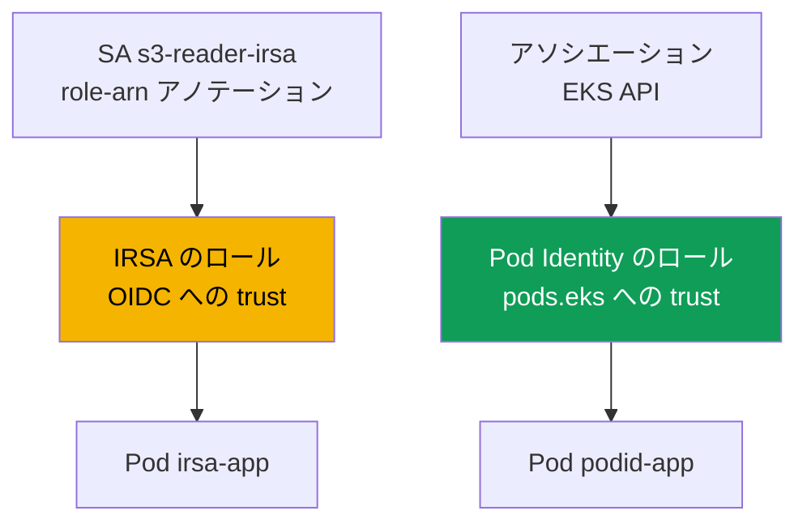
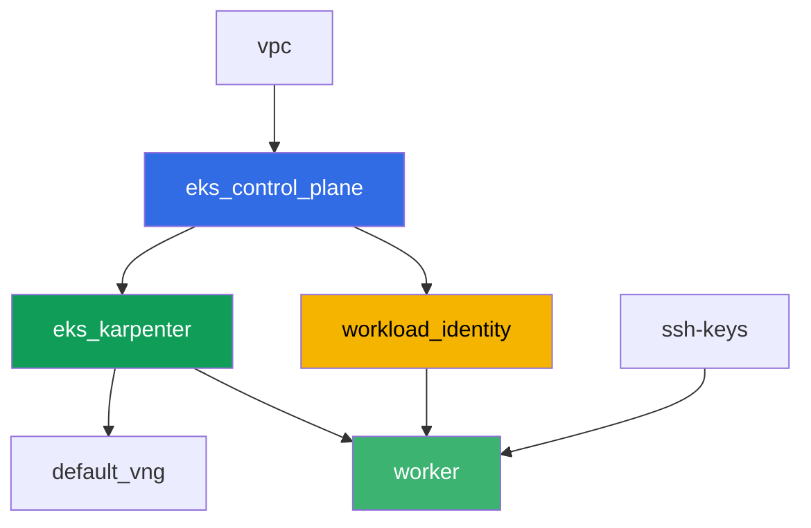

[Русская версия](README_RU.MD) · [Eng version](README.MD) · [Versión en español](README_ES.MD) · [Version française](README_FR.MD) · [Deutsche Version](README_DE.MD) · [ქართული ვერსია](README_GE.MD) · [繁體中文版](README_TW.MD)

# ラボ 104 - Workload identity: アプリケーションのための IRSA と Pod Identity

## 説明

Pod 内のアプリケーションは S3 と Secrets Manager へのアクセスを必要としています。この
ラボでは、Pod に権限を渡す 2 つの仕組み - IRSA と EKS Pod Identity - の両方を、terraform
が事前に作成した実際の AWS リソース(S3 バケットと Secrets Manager のシークレット)に
対して設定します。`ServiceAccount` をアノテーションで IRSA のロールに結びつけ、EKS の
API を通じて Pod Identity のアソシエーションを作成し、対応する Pod からオブジェクトと
シークレットを読み取り、最後に症状を再現します: IRSA も Pod Identity も紐付いていない
Pod は `AccessDenied` を受け取ります。これはノードのロールがアプリケーション向けの権限
を一切持っていないためです。

タスクは production スタイルで書かれています: 短い課題文とアクセプタンス基準。検証は
`check_result` コマンドによって自動的に行われます。

## 目的

コースの以下の章の内容を定着させます:

- [第 16 章。IRSA: OIDC プロバイダー、trust policy、ServiceAccount のアノテーション](../../course/16/ru.md)
- [第 17 章。EKS Pod Identity: エージェント、アソシエーション、IRSA からの移行](../../course/17/ru.md)

## 作成するもの

Terraform は事前に S3 バケット、Secrets Manager のシークレット、両方の IAM ロールを
(予測可能な名前で)作成します。あなたは `ServiceAccount`、Pod、そして Pod Identity の
アソシエーションを作成し、これらのロールを具体的なワークロードに結びつけます。

| オブジェクト | 何か | このラボでの目的 |
|--------|---------|-------------------|
| コンポーネント `workload_identity` | S3 bucket、Secrets Manager secret、IRSA のロール、Pod Identity のロール | 権限がすでに記述された、用意済みの AWS リソース |
| Namespace `eks-104` | ラボのワークロード用のクラスタの区画 | システムのリソースと分離しておく |
| ServiceAccount `s3-reader-irsa` + アノテーション | SA と IRSA のロールの結びつけ(第 16 章) | Pod は OIDC federation を通じて自分のロールを得る |
| Pod `irsa-app` | S3 からオブジェクトを読み取る | IRSA が実際に動くことを確認する |
| Pod Identity のアソシエーション | EKS の API における `namespace + SA -> ロール` の結びつけ(第 17 章) | SA へのアノテーションもクラスタ内のオブジェクトも不要 |
| Pod `podid-app` | Secrets Manager からシークレットを読み取る | Pod Identity が実際に動くことを確認する |
| Pod `plain-app` | IRSA も Pod Identity も紐付いていない | 症状: ノードのロールはアプリケーション向けの権限を渡さない |

2 つの Pod がどのように違う方法で権限を得るか:



## インフラストラクチャ

環境は Terragrunt によって AWS(`eu-central-1`)にデプロイされます。ベースはラボ 101 と
同じです(control plane、システム Pod 用の Fargate、ワークロード用の Karpenter、アドオン
`eks-pod-identity-agent`)、それに加えて IRSA と Pod Identity のデモ用リソースのための
独立したコンポーネントがあります。

### モジュールと依存関係

| ディレクトリ(コンポーネント) | モジュール(`terraform/modules/`) | 依存先 | 作成されるもの |
|---------------------|-------------------------------|------------|-------------|
| `vpc` | `vpc_v3` | - | VPC `10.10.0.0/16`、2 つの AZ にあるサブネット、NAT |
| `ssh-keys` | `ssh-keys` | - | ワーカーマシンとノード用の SSH キーペア |
| `eks_control_plane` | `eks_v2_control_plane` | `vpc` | EKS control plane `1.36`、OIDC プロバイダー |
| `eks_fargate_system` | `eks_v2_fargate` | `vpc`、`eks_control_plane` | `kube-system` と `karpenter` 用の Fargate profile |
| `eks_addons` | `eks_v2_addons` | `eks_control_plane`、`eks_fargate_system` | coredns、kube-proxy、vpc-cni、`eks-pod-identity-agent` |
| `eks_karpenter` | `eks_v2_karpenter` | `vpc`、`eks_control_plane`、`eks_addons`、`eks_fargate_system` | Karpenter コントローラ、ノードの IAM ロール |
| `eks_karpenter_default_vng` | `eks_v2_karpenter_vng` | `vpc`、`eks_control_plane`、`eks_karpenter` | AL2023 上のデフォルトの NodePool `default` |
| `workload_identity` | `eks_v2_workload_identity_demo` | `eks_control_plane` | S3 bucket、Secrets Manager secret、IRSA のロール、Pod Identity のロール |
| `worker` | `eks_v2_work_pc` | `ssh-keys`、`vpc`、`eks_control_plane`、`eks_karpenter`、`workload_identity` | kubectl、テスト、`check_result` を備えたワーカーマシン |

コンポーネント `workload_identity` は、namespace `eks-104` の SA `s3-reader-irsa` にちょうど
限定された trust policy を持つ IRSA のロール(第 16 章の `sub` 条件)と、共通の principal
`pods.eks.amazonaws.com` を持つ別の Pod Identity のロール(第 17 章)を作成します - この
ロールを具体的な SA に結びつけるのは terraform ではなく、タスク 5 の
`aws eks create-pod-identity-association` コマンドです。

依存関係グラフ(先に適用されるものほど矢印の下側にある):



コンポーネント `eks_fargate_system` と `eks_addons` は 8 ノードの上限のためグラフには
表示されていませんが、実際には `eks_control_plane` と `eks_karpenter` の間に位置します
(上の表を参照)。

### 予測可能なリソース名

`workload_identity` は `prefix` と `app_name` から名前を組み立てるため、worker は
terraform output を読まずにそれらを見つけられます。すべては起動時に
`~/lab104_hints.txt` ファイルに揃っています:

| リソース | 名前 |
|--------|-----|
| S3 bucket | `eks-task104-workload-identity-bucket`(`_` の代わりにハイフン - S3 の要件) |
| Secrets Manager secret | `eks-task104-workload_identity-secret` |
| IRSA のロール | `eks-task104-workload_identity-irsa-role` |
| Pod Identity のロール | `eks-task104-workload_identity-pod-identity-role` |

### どこで何を設定するか

`env.hcl`(環境全体の共通パラメータ):

| パラメータ | ラボでの値 | 何に影響するか |
|----------|-----------------|---------------|
| `region` | `eu-central-1` | すべてのリソースのリージョン |
| `prefix` | `eks-task104` | バケットとシークレットを含む、リソース名のプレフィックス |
| `stack_name` | `eks104` | ここから `env_name`(クラスタ名)が組み立てられる |
| `k8_version` | `1.36.0` | ワーカーマシン上の kubectl のバージョン |

各コンポーネントの `terragrunt.hcl` の `inputs`:

| ファイル | 主な設定 |
|------|--------------------|
| `eks_addons/terragrunt.hcl` | バージョン `v1.3.10-eksbuild.2` の `eks-pod-identity-agent` を追加 |
| `workload_identity/terragrunt.hcl` | `irsa.namespace = "eks-104"`、`irsa.service_account_name = "s3-reader-irsa"` |
| `worker/terragrunt.hcl` | `test_url` と `task_script_url` がラボ 104 のファイルを指す、`workload_identity` への依存 |

## デプロイ

```bash
TASK=104 make run_eks_task
```

デプロイには約 15-20 分かかります。出力の中からワーカーマシンへの SSH 接続の行を見つけ
て接続してください。そこでは kubectl が既に必要なクラスタ向けに設定されており、ラボの
リソースの名前と ARN は `~/lab104_hints.txt` ファイルにあります。

ワーカーマシン上で使える便利なコマンド:

```bash
time_left       # 環境の残り時間
check_result    # 解答の確認
cat ~/lab104_hints.txt   # バケット、シークレット、両方のロールの名前と ARN
```

> 検証環境のセキュリティについて。`env.hcl` では `ssh_password_enable = true` と
> `access_cidrs = ["0.0.0.0/0"]` が有効になっています - 学習用環境としては便利ですが、
> 本番環境ではこのようにしてはいけません。コースの標準(第 0.2、2、19 章)によれば、
> ワーカーマシンへのアクセスは公開 SSH ポートを外に出さずに AWS SSM Session Manager を
> 経由して開き、`access_cidrs` は具体的なアドレスに絞り込みます。ここでは、セットアップ
> を簡単にするためだけに公開 SSH を残しています。

## タスク

---
|        **1**        | **ラボのワークロード用の Namespace**                             |
| :-----------------: | :---------------------------------------------------------- |
| やること          | `eks-104` という名前の namespace を作成してください。ラボのすべてのオブジェクトはこの中に作成されます。 |
| アクセプタンス基準    | - namespace `eks-104` が存在する。 |
---
|        **2**        | **IRSA のアノテーションを持つ ServiceAccount**                         |
| :-----------------: | :---------------------------------------------------------- |
| やること          | `eks-104` に `ServiceAccount` `s3-reader-irsa` を作成し、アノテーション `eks.amazonaws.com/role-arn` に IRSA のロールの ARN(`~/lab104_hints.txt` の `irsa_role_arn`)を設定してください。このロールは terraform によってすでに作成されており、ちょうどこの SA を信頼する trust policy を持っています。 |
| アクセプタンス基準    | - `eks-104` の ServiceAccount `s3-reader-irsa` が、`irsa-role` を含むアノテーション `eks.amazonaws.com/role-arn` を持つ。 |
---
|        **3**        | **IRSA を持つ Pod: アイデンティティの確認**                        |
| :-----------------: | :---------------------------------------------------------- |
| やること          | `serviceAccountName: s3-reader-irsa` を持つ Pod `irsa-app`(イメージ `amazon/aws-cli:2.15.0`、コマンド `sleep 3600`)を作成してください。Pod から `aws sts get-caller-identity` を実行し、出力を `/var/work/tests/artifacts/3/irsa_identity.txt` に保存してください。`Arn` にはノードのロールではなく、あなたの IRSA のロールの `assumed-role` が含まれているはずです。 |
| アクセプタンス基準    | - Pod `irsa-app` が SA `s3-reader-irsa` を使用している;<br/>- ファイル `3/irsa_identity.txt` が空でなく、`assumed-role` と `irsa-role` を含む。 |
---
|        **4**        | **IRSA を通じた S3 からのオブジェクトの読み取り**                          |
| :-----------------: | :---------------------------------------------------------- |
| やること          | Pod `irsa-app` からバケット(ヒントファイルの `bucket_name`)のオブジェクト `hello.txt` を読み取ってください: `aws s3 cp s3://<bucket>/hello.txt -`。出力を `/var/work/tests/artifacts/4/s3_read.txt` に保存してください。 |
| アクセプタンス基準    | - ファイル `4/s3_read.txt` が空でなく、`hello from s3` という行を含む。 |
---
|        **5**        | **Pod Identity のアソシエーション**                                  |
| :-----------------: | :---------------------------------------------------------- |
| やること          | `eks-104` に `ServiceAccount` `secret-reader-podid`(アノテーションなし)を作成してください。`aws eks create-pod-identity-association --cluster-name <cluster> --namespace eks-104 --service-account secret-reader-podid --role-arn <pod_identity_role_arn>` によって Pod Identity のロールに結びつけてください。`aws eks list-pod-identity-associations --cluster-name <cluster> --namespace eks-104` の出力を `/var/work/tests/artifacts/5/association.txt` に保存してください。 |
| アクセプタンス基準    | - ファイル `5/association.txt` が空でなく、`secret-reader-podid` と `eks-104` に言及している。 |
---
|        **6**        | **Pod Identity を持つ Pod: シークレットの読み取り**                       |
| :-----------------: | :---------------------------------------------------------- |
| やること          | `serviceAccountName: secret-reader-podid` を持つ Pod `podid-app`(イメージ `amazon/aws-cli:2.15.0`、コマンド `sleep 3600`)を作成してください。Pod から `aws sts get-caller-identity` と `aws secretsmanager get-secret-value --secret-id <secret_name>` を実行し、両方の出力を `/var/work/tests/artifacts/6/secret_read.txt` に保存してください。アイデンティティは Pod Identity のロールの `assumed-role` を示し、シークレットの値は `username` フィールドを持つ JSON であるはずです。 |
| アクセプタンス基準    | - Pod `podid-app` が SA `secret-reader-podid` を使用している;<br/>- ファイル `6/secret_read.txt` が空でなく、`pod-identity-role` とシークレットの値(`username` または `demo123`)を含む。 |
---
|        **7**        | **症状: ノードのロールはアプリケーション向けの権限を渡さない**                |
| :-----------------: | :---------------------------------------------------------- |
| やること          | `serviceAccountName` を持たない Pod `plain-app`(イメージ `amazon/aws-cli:2.15.0`、コマンド `sleep 3600`、通常の `default` SA、IRSA も Pod Identity も紐付かない)を作成してください。Pod から `aws s3 ls s3://<bucket>/` を試してください - `AccessDenied` エラーが返るはずです。これはノードのロールがシステムコンポーネントの権限だけを持っているためです。出力(エラーを含む)を `/var/work/tests/artifacts/7/node_role_denied.txt` に保存してください。 |
| アクセプタンス基準    | - ファイル `7/node_role_denied.txt` が空でなく、`AccessDenied`(または `is not authorized`)を含む。 |
---

## 結果の確認

ワーカーマシン上で自動チェックを実行してください:

```bash
check_result
```

スクリプトがテストを実行し、完了したタスクの割合を表示します。

## 解答

参考解答: [worker/files/solutions/1_JP.MD](worker/files/solutions/1_JP.MD)

## クラスタとリソースの削除

> **まずワークロードを取り除き、EC2 ノードがいなくなるのを待ってから、スタンドを削除
> してください。** Pod `irsa-app`、`podid-app`、`plain-app` は Karpenter の EC2 ノードに
> 配置されます(`eks-104` に Fargate profile はありません)。ワークロードが稼働中の
> ままクラスタを削除すると、EC2 ノードはそれと一緒に消えますが、VPC CNI のセカンダリ
> ENI は `available` 状態のまま残り、ノードの security group を保持し続けます -
> `destroy` は `module.eks.aws_security_group.node[0]: Still destroying...` で数十分
> ハングします。

```bash
# 1. ラボのワークロードを取り除く
kubectl delete namespace eks-104 --ignore-not-found

# 2. 必須ではないが、より綺麗にするために: Pod Identity のアソシエーションを削除する -
#    これは terraform state ではなく EKS のオブジェクトとして存在しているため、
#    そうしないとクラスタ自体が削除されるまで残ってしまう
CLUSTER=$(aws eks list-clusters --query 'clusters[0]' --output text)
ASSOC_ID=$(aws eks list-pod-identity-associations --cluster-name "$CLUSTER" \
  --namespace eks-104 --query 'associations[0].associationId' --output text)
[ "$ASSOC_ID" != "None" ] && aws eks delete-pod-identity-association \
  --cluster-name "$CLUSTER" --association-id "$ASSOC_ID"

# 3. Karpenter が NodeClaim と EC2 ノードを取り除くのを待つ(fargate-* だけが残るはず)
while kubectl get nodeclaims --no-headers 2>/dev/null | grep -q .; do
  echo "NodeClaim はまだ残っています。待機中..."; sleep 15
done
kubectl get nodes | grep -v fargate
```

この後になってから初めてスタンドを削除してください(S3 バケット、シークレット、両方の
IAM ロールはコンポーネント `workload_identity` と一緒に消えます):

```bash
TASK=104 make delete_eks_task
```

それでも `destroy` がノードの security group で止まった場合、孤立した ENI が残ってい
ます。それを見つけて削除してください:

```bash
aws ec2 describe-network-interfaces --filters Name=status,Values=available \
  --query 'NetworkInterfaces[?Tags[?Key==`eks:eni:owner`]].[NetworkInterfaceId,Description]' \
  --output table
aws ec2 delete-network-interface --network-interface-id <eni-id>
```
