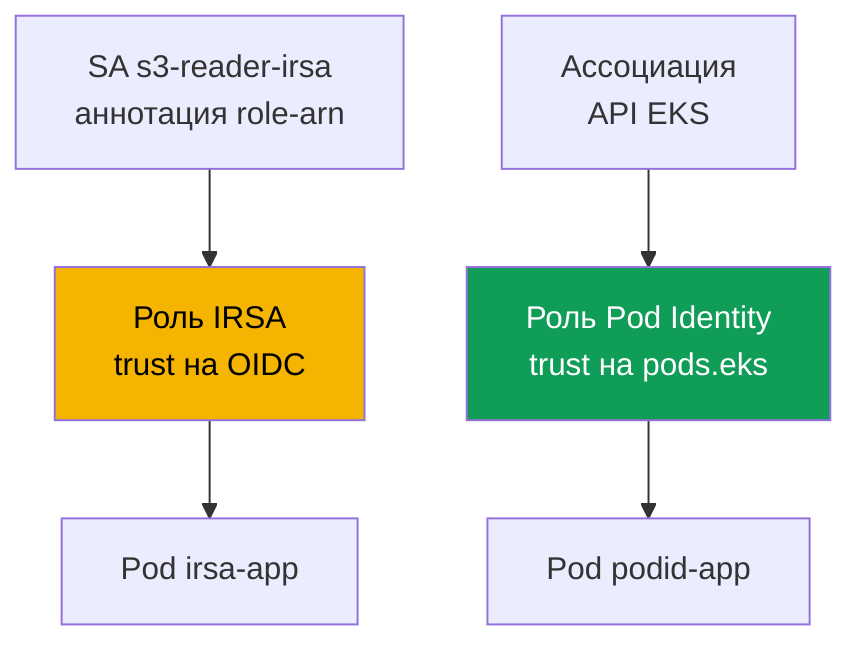
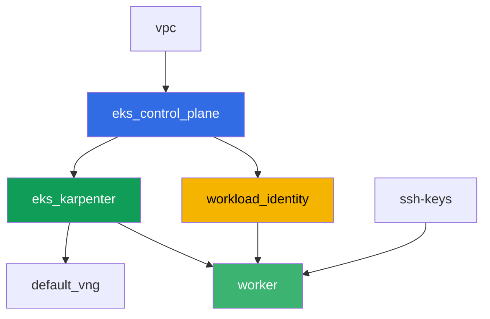

# Лаба 104 - Workload identity: IRSA и Pod Identity для приложения

## Описание

Приложению в поде нужен доступ к S3 и Secrets Manager. В этой лабе вы настраиваете оба
механизма выдачи прав поду - IRSA и EKS Pod Identity - на реальных ресурсах AWS,
созданных terraform заранее: бакете S3 и секрете Secrets Manager. Вы связываете
`ServiceAccount` с ролью IRSA через аннотацию, создаёте ассоциацию Pod Identity через API
EKS, читаете объект и секрет из соответствующих подов и в конце воспроизводите симптом:
под без привязки к IRSA или Pod Identity получает `AccessDenied`, потому что роль ноды не
несёт никаких прикладных прав.

Задания в продакшн-стиле: короткая постановка плюс критерии приёмки. Проверка -
автоматическая, командой `check_result`.

## Цель

Закрепить материал глав курса:

- [Глава 16. IRSA: OIDC-провайдер, trust policy, аннотации ServiceAccount](../../course/16/ru.md)
- [Глава 17. EKS Pod Identity: агент, ассоциации, миграция с IRSA](../../course/17/ru.md)

## Что мы создаём

Terraform заранее создаёт бакет S3, секрет Secrets Manager и обе IAM-роли (с
предсказуемыми именами). Вы создаёте `ServiceAccount`, поды и ассоциацию Pod Identity,
чтобы связать эти роли с конкретной нагрузкой.

| Объект | Что это | Зачем в этой лабе |
|--------|---------|-------------------|
| Компонент `workload_identity` | S3 bucket, Secrets Manager secret, роль IRSA, роль Pod Identity | готовые ресурсы AWS, права на них уже описаны |
| Namespace `eks-104` | раздел кластера под нагрузку лабы | держим ресурсы отдельно от системных |
| ServiceAccount `s3-reader-irsa` + аннотация | связь SA с ролью IRSA (глава 16) | под получает свою роль через OIDC federation |
| Pod `irsa-app` | читает объект из S3 | подтверждаем работу IRSA живьём |
| Ассоциация Pod Identity | связь `namespace + SA -> роль` в API EKS (глава 17) | без аннотаций на SA, без объектов в кластере |
| Pod `podid-app` | читает секрет из Secrets Manager | подтверждаем работу Pod Identity живьём |
| Pod `plain-app` | без привязки к IRSA или Pod Identity | симптом: роль ноды не даёт прикладных прав |

Как выдаются права двум подам по-разному:



## Инфраструктура

Окружение разворачивается в AWS (`eu-central-1`) через Terragrunt. База совпадает с лабой
101 (control plane, Fargate под системные поды, Karpenter под нагрузку, аддон
`eks-pod-identity-agent`), плюс отдельный компонент под демо-ресурсы IRSA и Pod Identity.

### Модули и зависимости

| Каталог (компонент) | Модуль (`terraform/modules/`) | Зависит от | Что создаёт |
|---------------------|-------------------------------|------------|-------------|
| `vpc` | `vpc_v3` | - | VPC `10.10.0.0/16`, подсети в двух AZ, NAT |
| `ssh-keys` | `ssh-keys` | - | пара SSH-ключей для рабочей машины и нод |
| `eks_control_plane` | `eks_v2_control_plane` | `vpc` | control plane EKS `1.36`, OIDC-провайдер |
| `eks_fargate_system` | `eks_v2_fargate` | `vpc`, `eks_control_plane` | Fargate-профиль для `kube-system` и `karpenter` |
| `eks_addons` | `eks_v2_addons` | `eks_control_plane`, `eks_fargate_system` | coredns, kube-proxy, vpc-cni, `eks-pod-identity-agent` |
| `eks_karpenter` | `eks_v2_karpenter` | `vpc`, `eks_control_plane`, `eks_addons`, `eks_fargate_system` | контроллер Karpenter, IAM-роль нод |
| `eks_karpenter_default_vng` | `eks_v2_karpenter_vng` | `vpc`, `eks_control_plane`, `eks_karpenter` | дефолтный NodePool `default` на AL2023 |
| `workload_identity` | `eks_v2_workload_identity_demo` | `eks_control_plane` | S3 bucket, Secrets Manager secret, роль IRSA, роль Pod Identity |
| `worker` | `eks_v2_work_pc` | `ssh-keys`, `vpc`, `eks_control_plane`, `eks_karpenter`, `workload_identity` | рабочая машина с kubectl, тестами и `check_result` |

Компонент `workload_identity` создаёт роль IRSA с trust policy, привязанной ровно к SA
`s3-reader-irsa` в namespace `eks-104` (условие `sub` из главы 16), и отдельную роль Pod
Identity с общим principal `pods.eks.amazonaws.com` (глава 17) - её связывает с конкретным
SA не terraform, а команда `aws eks create-pod-identity-association` в задании 5.

Граф зависимостей (что применяется раньше, то ниже по стрелке):



Компоненты `eks_fargate_system` и `eks_addons` на графе не показаны ради лимита в 8 узлов,
но по факту стоят между `eks_control_plane` и `eks_karpenter` (см. таблицу выше).

### Предсказуемые имена ресурсов

`workload_identity` собирает имена из `prefix` и `app_name`, поэтому worker находит их без
чтения terraform output. Все они на месте при загрузке в файле `~/lab104_hints.txt`:

| Ресурс | Имя |
|--------|-----|
| S3 bucket | `eks-task104-workload_identity-bucket` |
| Secrets Manager secret | `eks-task104-workload_identity-secret` |
| Роль IRSA | `eks-task104-workload_identity-irsa-role` |
| Роль Pod Identity | `eks-task104-workload_identity-pod-identity-role` |

### Где что настраивается

`env.hcl` (общие параметры окружения):

| Параметр | Значение в лабе | На что влияет |
|----------|-----------------|---------------|
| `region` | `eu-central-1` | регион всех ресурсов |
| `prefix` | `eks-task104` | префикс имён ресурсов, включая бакет и секрет |
| `stack_name` | `eks104` | из него собирается `env_name` - имя кластера |
| `k8_version` | `1.36.0` | версия kubectl на рабочей машине |

`inputs` в `terragrunt.hcl` каждого компонента:

| Файл | Ключевые настройки |
|------|--------------------|
| `eks_addons/terragrunt.hcl` | добавлен `eks-pod-identity-agent` версии `v1.3.10-eksbuild.2` |
| `workload_identity/terragrunt.hcl` | `irsa.namespace = "eks-104"`, `irsa.service_account_name = "s3-reader-irsa"` |
| `worker/terragrunt.hcl` | `test_url` и `task_script_url` на файлы лабы 104, зависимость от `workload_identity` |

## Развёртывание

```bash
TASK=104 make run_eks_task
```

Развёртывание занимает примерно 15-20 минут. В выводе найдите строку с SSH-подключением к
рабочей машине и подключитесь к ней. kubectl там уже настроен на нужный кластер, а имена и
ARN ресурсов лабы - в файле `~/lab104_hints.txt`.

Полезные команды на рабочей машине:

```bash
time_left       # сколько осталось времени окружения
check_result    # проверить решение
cat ~/lab104_hints.txt   # имена и ARN бакета, секрета и обеих ролей
```

> Безопасность стенда. В `env.hcl` включены `ssh_password_enable = true` и
> `access_cidrs = ["0.0.0.0/0"]` - это удобно для учебного окружения, но так делать в
> продакшене нельзя. По стандартам курса (главы 0.2, 2, 19) доступ к рабочим машинам
> открывают через AWS SSM Session Manager без публичных SSH-портов наружу, а `access_cidrs`
> сужают до конкретных адресов. Здесь публичный SSH оставлен только ради простоты запуска.

## Задания

---
|        **1**        | **Namespace для нагрузки лабы**                             |
| :-----------------: | :---------------------------------------------------------- |
| Что делаем          | Создайте namespace с именем `eks-104`. Все объекты лабы создаются внутри него. |
| Критерии приёмки    | - namespace `eks-104` существует. |
---
|        **2**        | **ServiceAccount с аннотацией IRSA**                         |
| :-----------------: | :---------------------------------------------------------- |
| Что делаем          | Создайте `ServiceAccount` `s3-reader-irsa` в `eks-104` с аннотацией `eks.amazonaws.com/role-arn`, равной ARN роли IRSA (`irsa_role_arn` из `~/lab104_hints.txt`). Эта роль уже создана terraform с trust policy, доверяющей ровно этому SA. |
| Критерии приёмки    | - ServiceAccount `s3-reader-irsa` в `eks-104` с аннотацией `eks.amazonaws.com/role-arn`, содержащей `irsa-role`. |
---
|        **3**        | **Под с IRSA: проверка идентичности**                        |
| :-----------------: | :---------------------------------------------------------- |
| Что делаем          | Создайте Pod `irsa-app` (образ `amazon/aws-cli:2.15.0`, команда `sleep 3600`) с `serviceAccountName: s3-reader-irsa`. Из пода выполните `aws sts get-caller-identity` и сохраните вывод в `/var/work/tests/artifacts/3/irsa_identity.txt`. В `Arn` должна быть `assumed-role` вашей роли IRSA, а не роль ноды. |
| Критерии приёмки    | - Pod `irsa-app` использует SA `s3-reader-irsa`;<br/>- файл `3/irsa_identity.txt` не пуст и содержит `assumed-role` и `irsa-role`. |
---
|        **4**        | **Чтение объекта из S3 через IRSA**                          |
| :-----------------: | :---------------------------------------------------------- |
| Что делаем          | Из пода `irsa-app` прочитайте объект `hello.txt` из бакета (`bucket_name` из подсказки): `aws s3 cp s3://<bucket>/hello.txt -`. Сохраните вывод в `/var/work/tests/artifacts/4/s3_read.txt`. |
| Критерии приёмки    | - файл `4/s3_read.txt` не пуст и содержит строку `hello from s3`. |
---
|        **5**        | **Ассоциация Pod Identity**                                  |
| :-----------------: | :---------------------------------------------------------- |
| Что делаем          | Создайте `ServiceAccount` `secret-reader-podid` в `eks-104` (без аннотаций). Свяжите его с ролью Pod Identity через `aws eks create-pod-identity-association --cluster-name <cluster> --namespace eks-104 --service-account secret-reader-podid --role-arn <pod_identity_role_arn>`. Сохраните `aws eks list-pod-identity-associations --cluster-name <cluster> --namespace eks-104` в `/var/work/tests/artifacts/5/association.txt`. |
| Критерии приёмки    | - файл `5/association.txt` не пуст и упоминает `secret-reader-podid` и `eks-104`. |
---
|        **6**        | **Под с Pod Identity: чтение секрета**                       |
| :-----------------: | :---------------------------------------------------------- |
| Что делаем          | Создайте Pod `podid-app` (образ `amazon/aws-cli:2.15.0`, команда `sleep 3600`) с `serviceAccountName: secret-reader-podid`. Из пода выполните `aws sts get-caller-identity` и `aws secretsmanager get-secret-value --secret-id <secret_name>`, сохраните оба вывода в `/var/work/tests/artifacts/6/secret_read.txt`. Идентичность должна показывать `assumed-role` роли Pod Identity, а значение секрета - JSON с полем `username`. |
| Критерии приёмки    | - Pod `podid-app` использует SA `secret-reader-podid`;<br/>- файл `6/secret_read.txt` не пуст, содержит `pod-identity-role` и значение секрета (`username` или `demo123`). |
---
|        **7**        | **Симптом: роль ноды не даёт прикладных прав**                |
| :-----------------: | :---------------------------------------------------------- |
| Что делаем          | Создайте Pod `plain-app` (образ `amazon/aws-cli:2.15.0`, команда `sleep 3600`) без `serviceAccountName` (обычный `default` SA, без привязки к IRSA или Pod Identity). Из пода попробуйте `aws s3 ls s3://<bucket>/` - должна вернуться ошибка `AccessDenied`, потому что роль ноды несёт только права системных компонентов. Сохраните вывод (включая ошибку) в `/var/work/tests/artifacts/7/node_role_denied.txt`. |
| Критерии приёмки    | - файл `7/node_role_denied.txt` не пуст и содержит `AccessDenied` (или `is not authorized`). |
---

## Проверка результата

На рабочей машине запустите автоматическую проверку:

```bash
check_result
```

Скрипт прогонит тесты и покажет процент выполненных заданий.

## Решение

Эталонное решение: [worker/files/solutions/1.MD](worker/files/solutions/1.MD)

## Удаление кластера и ресурсов

```bash
TASK=104 make delete_eks_task
```
