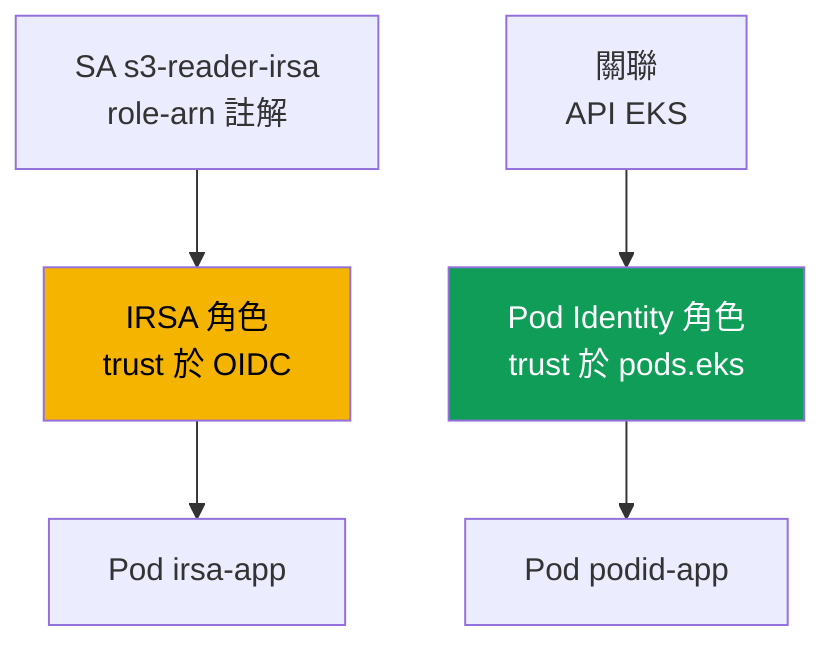
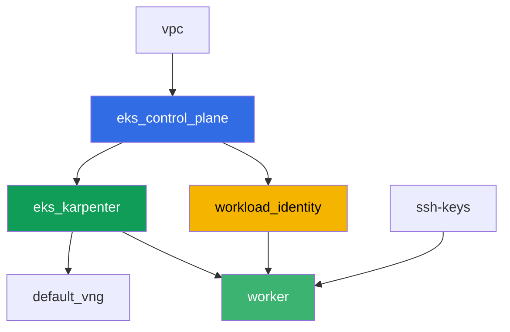

[Русская версия](README_RU.MD) · [Eng version](README.MD) · [Versión en español](README_ES.MD) · [Version française](README_FR.MD) · [Deutsche Version](README_DE.MD) · [ქართული ვერსია](README_GE.MD) · [日本語版](README_JP.MD)

# 實驗 104 - Workload identity:IRSA 和 Pod Identity 應用程式

## 說明

pod 中的應用程式需要存取 S3 和 Secrets Manager。在這一課中,你會針對 terraform 事先建立好的
真實 AWS 資源 - S3 bucket 與 Secrets Manager secret - 設定兩種賦予 pod 權限的機制:IRSA 和
EKS Pod Identity。你會透過註解將 `ServiceAccount` 與 IRSA 角色連結,透過 EKS API 建立
Pod Identity 的關聯,從對應的 pod 中讀取物件與 secret,最後重現一個症狀:沒有連結 IRSA 或
Pod Identity 的 pod 會得到 `AccessDenied`,因為節點角色完全不帶任何應用程式層級的權限。

任務以生產風格撰寫:簡短的任務說明加上驗收標準。檢查方式是自動化的,透過
`check_result` 指令進行。

## 目標

鞏固課程以下章節的內容:

- [第 16 章。IRSA:OIDC 提供者、trust policy、ServiceAccount 註解](../../course/16/ru.md)
- [第 17 章。EKS Pod Identity:代理程式、關聯、從 IRSA 遷移](../../course/17/ru.md)

## 我們要建立什麼

Terraform 會事先建立 S3 bucket、Secrets Manager secret 以及兩個 IAM 角色(名稱可
預測)。你會建立 `ServiceAccount`、pod 以及 Pod Identity 關聯,把這些角色與具體的工作
負載連結起來。

| 物件 | 這是什麼 | 為什麼在這一課裡 |
|--------|---------|-------------------|
| 元件 `workload_identity` | S3 bucket、Secrets Manager secret、IRSA 角色、Pod Identity 角色 | 現成的 AWS 資源,權限已經描述好了 |
| Namespace `eks-104` | 這一課工作負載使用的叢集分區 | 讓資源與系統資源分開 |
| ServiceAccount `s3-reader-irsa` + 註解 | SA 與 IRSA 角色的連結(第 16 章) | pod 透過 OIDC federation 取得自己的角色 |
| Pod `irsa-app` | 讀取 S3 中的物件 | 實際驗證 IRSA 是否運作 |
| Pod Identity 關聯 | API EKS 中 `namespace + SA -> 角色` 的連結(第 17 章) | SA 上不需要註解,叢集中也不需要物件 |
| Pod `podid-app` | 讀取 Secrets Manager 中的 secret | 實際驗證 Pod Identity 是否運作 |
| Pod `plain-app` | 沒有連結 IRSA 或 Pod Identity | 症狀:節點角色不會賦予應用程式層級的權限 |

兩個 pod 取得權限的方式有何不同:



## 基礎設施

環境透過 Terragrunt 部署在 AWS(`eu-central-1`)。基礎架構與第 101 課相同
(control plane、系統 pod 用的 Fargate、工作負載用的 Karpenter、`eks-pod-identity-agent`
add-on),再加上一個用於 IRSA 和 Pod Identity 示範資源的獨立元件。

### 模組與依賴關係

| 目錄(元件) | 模組(`terraform/modules/`) | 依賴於 | 建立什麼 |
|---------------------|-------------------------------|------------|-------------|
| `vpc` | `vpc_v3` | - | VPC `10.10.0.0/16`,兩個 AZ 中的子網路,NAT |
| `ssh-keys` | `ssh-keys` | - | 工作機與節點用的 SSH 金鑰對 |
| `eks_control_plane` | `eks_v2_control_plane` | `vpc` | EKS control plane `1.36`,OIDC 提供者 |
| `eks_fargate_system` | `eks_v2_fargate` | `vpc`、`eks_control_plane` | `kube-system` 與 `karpenter` 的 Fargate profile |
| `eks_addons` | `eks_v2_addons` | `eks_control_plane`、`eks_fargate_system` | coredns、kube-proxy、vpc-cni、`eks-pod-identity-agent` |
| `eks_karpenter` | `eks_v2_karpenter` | `vpc`、`eks_control_plane`、`eks_addons`、`eks_fargate_system` | Karpenter 控制器,節點的 IAM 角色 |
| `eks_karpenter_default_vng` | `eks_v2_karpenter_vng` | `vpc`、`eks_control_plane`、`eks_karpenter` | 基於 AL2023 的預設 NodePool `default` |
| `workload_identity` | `eks_v2_workload_identity_demo` | `eks_control_plane` | S3 bucket、Secrets Manager secret、IRSA 角色、Pod Identity 角色 |
| `worker` | `eks_v2_work_pc` | `ssh-keys`、`vpc`、`eks_control_plane`、`eks_karpenter`、`workload_identity` | 帶有 kubectl、測試與 `check_result` 的工作機 |

元件 `workload_identity` 會建立一個 IRSA 角色,其 trust policy 剛好綁定 `eks-104`
namespace 中的 SA `s3-reader-irsa`(第 16 章的 `sub` 條件),以及一個獨立的 Pod Identity
角色,principal 是通用的 `pods.eks.amazonaws.com`(第 17 章) - 它並不是由 terraform 與
具體的 SA 連結,而是在任務 5 中透過 `aws eks create-pod-identity-association` 指令連結的。

依賴關係圖(愈早套用的元件在箭頭愈下方):



為了不超過 8 個節點的限制,圖中沒有顯示 `eks_fargate_system` 和 `eks_addons` 這兩個
元件,但實際上它們位於 `eks_control_plane` 和 `eks_karpenter` 之間(參見上表)。

### 可預測的資源名稱

`workload_identity` 會用 `prefix` 和 `app_name` 組成名稱,因此 worker 不需要讀取
terraform output 就能找到它們。開機時,所有名稱都已經存在於檔案 `~/lab104_hints.txt`
中:

| 資源 | 名稱 |
|--------|-----|
| S3 bucket | `eks-task104-workload-identity-bucket`(用連字號取代 `_` - 這是 S3 的要求) |
| Secrets Manager secret | `eks-task104-workload_identity-secret` |
| IRSA 角色 | `eks-task104-workload_identity-irsa-role` |
| Pod Identity 角色 | `eks-task104-workload_identity-pod-identity-role` |

### 設定位置

`env.hcl`(共用的環境參數):

| 參數 | 這一課中的值 | 影響什麼 |
|----------|-----------------|---------------|
| `region` | `eu-central-1` | 所有資源的區域 |
| `prefix` | `eks-task104` | 資源名稱的前綴,包括 bucket 和 secret |
| `stack_name` | `eks104` | 用來組成 `env_name` - 也就是叢集名稱 |
| `k8_version` | `1.36.0` | 工作機上的 kubectl 版本 |

每個元件 `terragrunt.hcl` 中的 `inputs`:

| 檔案 | 關鍵設定 |
|------|--------------------|
| `eks_addons/terragrunt.hcl` | 新增了 `eks-pod-identity-agent`,版本 `v1.3.10-eksbuild.2` |
| `workload_identity/terragrunt.hcl` | `irsa.namespace = "eks-104"`、`irsa.service_account_name = "s3-reader-irsa"` |
| `worker/terragrunt.hcl` | `test_url` 和 `task_script_url` 指向第 104 課的檔案,依賴於 `workload_identity` |

## 部署

```bash
TASK=104 make run_eks_task
```

部署大約需要 15-20 分鐘。在輸出中找到連接工作機的 SSH 連線那一行並連上去。kubectl
在那裡已經設定好正確的叢集,這一課資源的名稱與 ARN 都在檔案 `~/lab104_hints.txt` 中。

工作機上的實用指令:

```bash
time_left       # 環境剩餘時間
check_result    # 檢查解答
cat ~/lab104_hints.txt   # bucket、secret 和兩個角色的名稱與 ARN
```

> 環境安全性。`env.hcl` 中啟用了 `ssh_password_enable = true` 和
> `access_cidrs = ["0.0.0.0/0"]` - 這對訓練環境很方便,但在生產環境中不應該這樣做。根據
> 課程標準(第 0.2、2、19 章),存取工作機應該透過 AWS SSM Session Manager,不對外開放
> 公開的 SSH 埠,而 `access_cidrs` 應該限縮到特定的位址。這裡保留公開 SSH 只是為了簡化
> 啟動流程。

## 任務

---
|        **1**        | **這一課工作負載的 Namespace**                             |
| :-----------------: | :---------------------------------------------------------- |
| 該做什麼          | 建立名稱為 `eks-104` 的 namespace。這一課的所有物件都建立在其中。 |
| 驗收標準    | - namespace `eks-104` 存在。 |
---
|        **2**        | **帶有 IRSA 註解的 ServiceAccount**                         |
| :-----------------: | :---------------------------------------------------------- |
| 該做什麼          | 在 `eks-104` 中建立 `ServiceAccount` `s3-reader-irsa`,並加上 `eks.amazonaws.com/role-arn` 註解,值為 IRSA 角色的 ARN(`~/lab104_hints.txt` 中的 `irsa_role_arn`)。這個角色已經由 terraform 建立好,其 trust policy 剛好信任這個 SA。 |
| 驗收標準    | - `eks-104` 中的 ServiceAccount `s3-reader-irsa` 帶有 `eks.amazonaws.com/role-arn` 註解,其中包含 `irsa-role`。 |
---
|        **3**        | **帶有 IRSA 的 Pod:驗證身分**                        |
| :-----------------: | :---------------------------------------------------------- |
| 該做什麼          | 建立 Pod `irsa-app`(映像 `amazon/aws-cli:2.15.0`,指令 `sleep 3600`),並設定 `serviceAccountName: s3-reader-irsa`。從 pod 中執行 `aws sts get-caller-identity`,並將輸出儲存到 `/var/work/tests/artifacts/3/irsa_identity.txt`。`Arn` 中應該是你 IRSA 角色的 `assumed-role`,而不是節點角色。 |
| 驗收標準    | - Pod `irsa-app` 使用 SA `s3-reader-irsa`;<br/>- 檔案 `3/irsa_identity.txt` 不為空,且包含 `assumed-role` 和 `irsa-role`。 |
---
|        **4**        | **透過 IRSA 讀取 S3 中的物件**                          |
| :-----------------: | :---------------------------------------------------------- |
| 該做什麼          | 從 pod `irsa-app` 讀取 bucket(提示檔案中的 `bucket_name`)中的物件 `hello.txt`:`aws s3 cp s3://<bucket>/hello.txt -`。將輸出儲存到 `/var/work/tests/artifacts/4/s3_read.txt`。 |
| 驗收標準    | - 檔案 `4/s3_read.txt` 不為空,且包含字串 `hello from s3`。 |
---
|        **5**        | **Pod Identity 關聯**                                  |
| :-----------------: | :---------------------------------------------------------- |
| 該做什麼          | 在 `eks-104` 中建立 `ServiceAccount` `secret-reader-podid`(不加任何註解)。透過 `aws eks create-pod-identity-association --cluster-name <cluster> --namespace eks-104 --service-account secret-reader-podid --role-arn <pod_identity_role_arn>` 將它與 Pod Identity 角色連結。將 `aws eks list-pod-identity-associations --cluster-name <cluster> --namespace eks-104` 的輸出儲存到 `/var/work/tests/artifacts/5/association.txt`。 |
| 驗收標準    | - 檔案 `5/association.txt` 不為空,且提到 `secret-reader-podid` 和 `eks-104`。 |
---
|        **6**        | **帶有 Pod Identity 的 Pod:讀取 secret**                       |
| :-----------------: | :---------------------------------------------------------- |
| 該做什麼          | 建立 Pod `podid-app`(映像 `amazon/aws-cli:2.15.0`,指令 `sleep 3600`),並設定 `serviceAccountName: secret-reader-podid`。從 pod 中執行 `aws sts get-caller-identity` 和 `aws secretsmanager get-secret-value --secret-id <secret_name>`,將兩者的輸出都儲存到 `/var/work/tests/artifacts/6/secret_read.txt`。身分應該顯示 Pod Identity 角色的 `assumed-role`,secret 的值則應該是包含 `username` 欄位的 JSON。 |
| 驗收標準    | - Pod `podid-app` 使用 SA `secret-reader-podid`;<br/>- 檔案 `6/secret_read.txt` 不為空,包含 `pod-identity-role` 以及 secret 的值(`username` 或 `demo123`)。 |
---
|        **7**        | **症狀:節點角色不會賦予應用程式層級的權限**                |
| :-----------------: | :---------------------------------------------------------- |
| 該做什麼          | 建立 Pod `plain-app`(映像 `amazon/aws-cli:2.15.0`,指令 `sleep 3600`),不設定 `serviceAccountName`(使用一般的 `default` SA,不連結 IRSA 或 Pod Identity)。從 pod 中嘗試 `aws s3 ls s3://<bucket>/` - 應該會回傳 `AccessDenied` 錯誤,因為節點角色只帶有系統元件的權限。將輸出(包括錯誤)儲存到 `/var/work/tests/artifacts/7/node_role_denied.txt`。 |
| 驗收標準    | - 檔案 `7/node_role_denied.txt` 不為空,且包含 `AccessDenied`(或 `is not authorized`)。 |
---

## 檢查結果

在工作機上執行自動檢查:

```bash
check_result
```

腳本會執行測試,並顯示已完成任務的百分比。

## 解答

參考解答:[worker/files/solutions/1_TW.MD](worker/files/solutions/1_TW.MD)

## 刪除叢集與資源

> **先移除工作負載,等 EC2 節點消失之後,再刪除環境。**
> Pod `irsa-app`、`podid-app` 和 `plain-app` 會排到 Karpenter 的 EC2 節點上(`eks-104`
> 沒有 Fargate profile)。如果在工作負載還在執行時刪除叢集,EC2 節點會跟著一起消失,但
> VPC CNI 的次要 ENI 會停留在 `available` 狀態,並卡住節點的 security group - `destroy`
> 會卡在 `module.eks.aws_security_group.node[0]: Still destroying...` 好幾十分鐘。

```bash
# 1. 移除這一課的工作負載
kubectl delete namespace eks-104 --ignore-not-found

# 2. 非必要,但比較乾淨:移除 Pod Identity 關聯 - 它是以 EKS 物件的形式存在,
#    而不是在 terraform state 中,否則會一直保留到叢集本身被刪除為止
CLUSTER=$(aws eks list-clusters --query 'clusters[0]' --output text)
ASSOC_ID=$(aws eks list-pod-identity-associations --cluster-name "$CLUSTER" \
  --namespace eks-104 --query 'associations[0].associationId' --output text)
[ "$ASSOC_ID" != "None" ] && aws eks delete-pod-identity-association \
  --cluster-name "$CLUSTER" --association-id "$ASSOC_ID"

# 3. 等待 Karpenter 移除 NodeClaim 和 EC2 節點(最後應該只剩下 fargate-*)
while kubectl get nodeclaims --no-headers 2>/dev/null | grep -q .; do
  echo "NodeClaim 還活著,等待中..."; sleep 15
done
kubectl get nodes | grep -v fargate
```

只有在這之後才能刪除環境(S3 bucket、secret 和兩個 IAM 角色會跟著
`workload_identity` 元件一起消失):

```bash
TASK=104 make delete_eks_task
```

如果 `destroy` 仍然卡在節點的 security group 上,表示留下了孤兒 ENI。找出並刪除它:

```bash
aws ec2 describe-network-interfaces --filters Name=status,Values=available \
  --query 'NetworkInterfaces[?Tags[?Key==`eks:eni:owner`]].[NetworkInterfaceId,Description]' \
  --output table
aws ec2 delete-network-interface --network-interface-id <eni-id>
```
