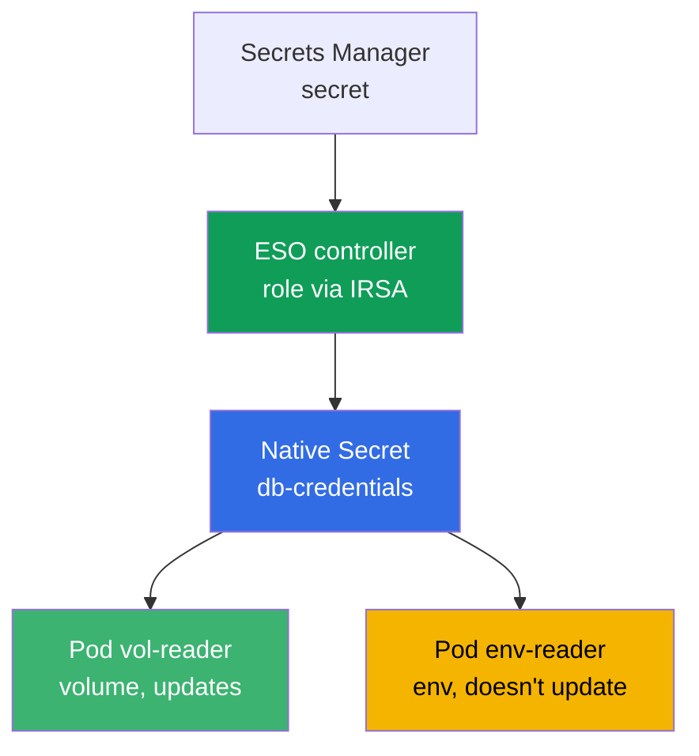
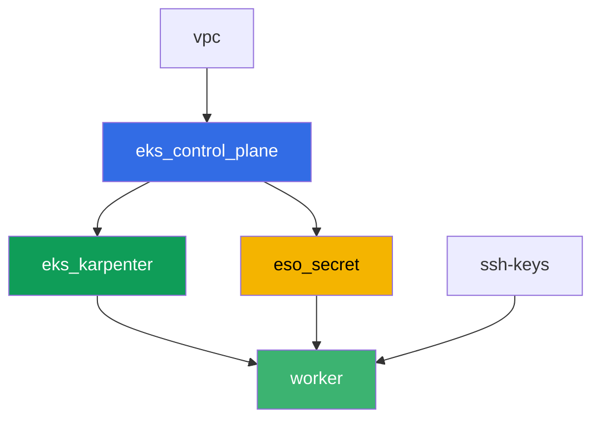

[Русская версия](README_RU.MD) · [Versión en español](README_ES.MD) · [Version française](README_FR.MD) · [Deutsche Version](README_DE.MD) · [ქართული ვერსია](README_GE.MD) · [繁體中文版](README_TW.MD) · [日本語版](README_JP.MD)

# Lab 105 - Secrets: KMS envelope encryption and External Secrets Operator

## Description

The application needs a database password, and storing it in a manifest or in git isn't
something you want to do. In this lab you close both layers of secret protection in EKS:
you confirm that the control plane encrypts `Secret` objects in etcd with a KMS key (layer
1, enabled by default), and you set up External Secrets Operator, which reads a secret from
a real AWS Secrets Manager and creates a native `Secret` from it (layer 2). At the end you
reproduce the classic rotation symptom: a volume with the secret updates itself, while a
pod that reads the same secret through an environment variable gets stuck with the old
value.

Tasks are written in a production style: a short statement plus acceptance criteria.
Checking is automatic, via the `check_result` command.

## Goal

Reinforce the material from this course chapter:

- [Chapter 18. Secrets: KMS, Secrets Manager and SSM via External Secrets](../../course/18/ru.md)

## What we're creating

Terraform pre-creates a demo Secrets Manager secret and an IRSA role for the ESO controller
(with predictable names). You install ESO via Helm, bind the role with an annotation on the
ServiceAccount, and set up delivery of the secret into the cluster.

| Object | What it is | Why it's in this lab |
|--------|---------|-------------------|
| Component `eso_secret` | Secrets Manager secret, IRSA role for ESO | ready-made AWS resources, permissions on the secret are already described |
| Namespace `eks-105` | cluster section for the lab's workload | keeps resources separate from system ones |
| Artifact `encryption_config.txt` | output of `describe-cluster` | confirms layer 1: KMS envelope encryption of secrets is enabled |
| Release `external-secrets` (Helm) | ESO controller with a role via IRSA | layer 2: reading a secret from Secrets Manager |
| `SecretStore` `aws-sm` + `ExternalSecret` `db-credentials` | link to the store and the sync rule | ESO creates a native `Secret` from the value in AWS |
| Pod `vol-reader` | reads the `Secret` through a volume | sync path that's resilient to value updates |
| Pod `env-reader` + artifact `rotation.txt` | reads the `Secret` through env, rotation symptom | env doesn't update without recreating the pod |

The secret's path from AWS to the pod:



## Infrastructure

The environment is deployed in AWS (`eu-central-1`) via Terragrunt. The base matches lab
101 (control plane, Fargate for system pods, Karpenter for workload), plus a separate
component for the secret and the IRSA role of the ESO controller.

### Modules and dependencies

| Directory (component) | Module (`terraform/modules/`) | Depends on | What it creates |
|---------------------|-------------------------------|------------|-------------|
| `vpc` | `vpc_v3` | - | VPC `10.10.0.0/16`, subnets in two AZs, NAT |
| `ssh-keys` | `ssh-keys` | - | an SSH key pair for the worker machine and nodes |
| `eks_control_plane` | `eks_v2_control_plane` | `vpc` | EKS control plane `1.36`, OIDC provider |
| `eks_fargate_system` | `eks_v2_fargate` | `vpc`, `eks_control_plane` | Fargate profile for `kube-system` and `karpenter` |
| `eks_addons` | `eks_v2_addons` | `eks_control_plane`, `eks_fargate_system` | coredns, kube-proxy, vpc-cni, pod-identity add-ons |
| `eks_karpenter` | `eks_v2_karpenter` | `vpc`, `eks_control_plane`, `eks_addons`, `eks_fargate_system` | Karpenter controller, node IAM role |
| `eks_karpenter_default_vng` | `eks_v2_karpenter_vng` | `vpc`, `eks_control_plane`, `eks_karpenter` | default NodePool `default` on AL2023 |
| `eso_secret` | `eks_v2_eso_irsa` | `eks_control_plane` | Secrets Manager secret, IRSA role for the ESO controller |
| `worker` | `eks_v2_work_pc` | `ssh-keys`, `vpc`, `eks_control_plane`, `eks_karpenter`, `eso_secret` | worker machine with kubectl, tests, and `check_result` |

The `eso_secret` component creates an IRSA role with a trust policy scoped exactly to the
`external-secrets` SA in the `external-secrets` namespace (the `sub` condition from chapter
16), plus an inline policy with `secretsmanager:GetSecretValue`/`DescribeSecret` on the
specific demo secret - this is the role you'll attach to the ESO controller with an
annotation on the ServiceAccount during the Helm install.

Dependency graph (what gets applied earlier is lower down the arrow):



The `eks_fargate_system`, `eks_addons` and `eks_karpenter_default_vng` components aren't
shown on the graph to stay within the 8-node limit, but they actually sit between
`eks_control_plane` and `eks_karpenter` (see the table above).

### Predictable resource names

`eso_secret` assembles names from `prefix`, so the worker finds them without reading
terraform output. All of them are available on load in the file `~/lab105_hints.txt`:

| Resource | Name |
|--------|-----|
| Secrets Manager secret | `eks-task105-eso-demo-secret` |
| ESO controller IRSA role | `eks-task105-eso-irsa-role` |

### What's configured where

`env.hcl` (shared environment parameters):

| Parameter | Value in the lab | What it affects |
|----------|-----------------|---------------|
| `region` | `eu-central-1` | region for all resources |
| `prefix` | `eks-task105` | prefix for resource names, including the secret and the role |
| `stack_name` | `eks105` | used to build `env_name` - the cluster name |
| `k8_version` | `1.36.0` | kubectl version on the worker machine |

`inputs` in each component's `terragrunt.hcl`:

| File | Key settings |
|------|--------------------|
| `eso_secret/terragrunt.hcl` | `eso.namespace = "external-secrets"`, `eso.service_account_name = "external-secrets"`, `kms_key_arn = null` (default `aws/secretsmanager` key) |
| `worker/terragrunt.hcl` | `test_url` and `task_script_url` pointing to lab 105 files, dependency on `eso_secret` |

## Deployment

```bash
TASK=105 make run_eks_task
```

Deployment takes roughly 15-20 minutes. In the output, find the line with the SSH connection
to the worker machine and connect to it. kubectl there is already configured for the right
cluster, and the lab's resource names and ARNs are in the file `~/lab105_hints.txt`.

Useful commands on the worker machine:

```bash
time_left       # how much environment time is left
check_result    # check the solution
cat ~/lab105_hints.txt   # names and ARNs of the secret and the IRSA role
```

> Environment security. `env.hcl` has `ssh_password_enable = true` and
> `access_cidrs = ["0.0.0.0/0"]` enabled - convenient for a training environment, but this
> is not something to do in production. Per the course standards (chapters 0.2, 2, 19),
> access to worker machines should go through AWS SSM Session Manager without exposing
> public SSH ports, and `access_cidrs` should be narrowed down to specific addresses. Here
> public SSH is left in place only to keep the setup simple.

## Tasks

---
|        **1**        | **Namespace for the lab's workload**                             |
| :-----------------: | :---------------------------------------------------------- |
| What to do          | Create a namespace named `eks-105`. All of the lab's objects are created inside it. |
| Acceptance criteria    | - namespace `eks-105` exists. |
---
|        **2**        | **Layer 1: checking KMS envelope encryption**                 |
| :-----------------: | :---------------------------------------------------------- |
| What to do          | Run `aws eks describe-cluster --name <cluster> --query 'cluster.encryptionConfig'` (the cluster name is `cluster_name` from `~/lab105_hints.txt`) and save the output to `/var/work/tests/artifacts/2/encryption_config.txt`. Confirm that the encryption configuration contains `resources` with the value `secrets` - this confirms that `Secret` objects are encrypted with a KMS key on write to etcd (enabled by default on EKS 1.28+). |
| Acceptance criteria    | - the file `2/encryption_config.txt` is not empty and contains `resources` and `secrets`. |
---
|        **3**        | **Installing External Secrets Operator via Helm**           |
| :-----------------: | :---------------------------------------------------------- |
| What to do          | Add the repository `https://charts.external-secrets.io` and install the `external-secrets` chart into the `external-secrets` namespace (flag `--create-namespace`). During install, bind the IRSA role (`role_arn` from the hint file) with an annotation: `--set serviceAccount.annotations."eks\.amazonaws\.com/role-arn"=<role_arn>`. Wait until the controller pod is `Running`. |
| Acceptance criteria    | - the ESO Deployment in `external-secrets` has at least one ready replica;<br/>- the controller's ServiceAccount carries the annotation `eks.amazonaws.com/role-arn` with a value containing `eso-irsa-role`. |
---
|        **4**        | **SecretStore and ExternalSecret**                              |
| :-----------------: | :---------------------------------------------------------- |
| What to do          | In `eks-105`, create a `SecretStore` `aws-sm` (`provider.aws.service: SecretsManager`, `region: eu-central-1`) and an `ExternalSecret` `db-credentials` referencing the demo secret (`secret_name` from the hint file), field `password`, `target.name: db-credentials`, a small `refreshInterval` (e.g. `1m`, useful in task 6). Wait for `SecretSynced` status and check that the native `Secret` `db-credentials` appeared with the correct password value (`kubectl get secret ... -o jsonpath` plus `base64 -d`). |
| Acceptance criteria    | - `ExternalSecret` `db-credentials` in `eks-105` is in `SecretSynced` status;<br/>- `Secret` `db-credentials` contains the password `S3cr3tPass123`. |
---
|        **5**        | **Pod with a volume: resilient sync path**                |
| :-----------------: | :---------------------------------------------------------- |
| What to do          | Create Pod `vol-reader` (image `amazon/aws-cli:2.15.0`, command `sleep 3600`) that mounts `Secret` `db-credentials` as a volume (`volumeMount`, NOT env). Read the password from the file in the volume and save the output to `/var/work/tests/artifacts/5/volume_password.txt`. |
| Acceptance criteria    | - Pod `vol-reader` mounts `Secret` `db-credentials` as a volume;<br/>- the file `5/volume_password.txt` is not empty and contains `S3cr3tPass123`. |
---
|        **6**        | **Pod with env: reading the secret a second way**                       |
| :-----------------: | :---------------------------------------------------------- |
| What to do          | Create Pod `env-reader` (image `amazon/aws-cli:2.15.0`, command `sleep 3600`) with a `DB_PASSWORD` variable via `secretKeyRef` on `Secret` `db-credentials`. Confirm the variable is visible inside the pod (`kubectl exec env-reader -n eks-105 -- printenv DB_PASSWORD`). |
| Acceptance criteria    | - Pod `env-reader` uses `Secret` `db-credentials` via `secretKeyRef` on the variable `DB_PASSWORD`. |
---
|        **7**        | **Rotation symptom: env doesn't update**                       |
| :-----------------: | :---------------------------------------------------------- |
| What to do          | Change the secret's value directly in Secrets Manager: `aws secretsmanager put-secret-value --secret-id <secret_name> --secret-string '{"username":"appuser","password":"RotatedPass456"}'`. Wait for `refreshInterval` plus a margin and recheck the `Secret` via kubectl - the value will update, ESO resynced it. Then check the `env-reader` pod from task 6 - it sees the old value in env. Save an explanation to `/var/work/tests/artifacts/7/rotation.txt`: why the `Secret` updated but `env-reader` sees the old value (mention the word `env` and that the value doesn't update without recreating the pod). |
| Acceptance criteria    | - the file `7/rotation.txt` is not empty, contains `env` and an explanation that the value doesn't update. |
---

## Checking the result

On the worker machine, run the automatic check:

```bash
check_result
```

The script will run the tests and show the percentage of completed tasks.

## Solution

Reference solution: [worker/files/solutions/1.MD](worker/files/solutions/1.MD)

## Deleting the cluster and resources

> **First tear down the workload and the ESO Helm release, wait for the EC2 nodes to go
> away, then remove the environment.** ESO was installed by hand via Helm, not terraform -
> `TASK=105 make delete_eks_task` doesn't know about it. If you delete the cluster while the
> `eks-105` pods and the ESO controller are still alive, the Karpenter EC2 node goes away
> along with the cluster, and the secondary ENI from VPC CNI stays in `available` state,
> holding onto the node security group - `destroy` hangs on
> `module.eks.aws_security_group.node[0]: Still destroying...` for tens of minutes.

```bash
# 1. Remove the lab's workload and ESO
kubectl delete namespace eks-105 --ignore-not-found
helm uninstall external-secrets -n external-secrets
kubectl delete namespace external-secrets --ignore-not-found

# 2. Wait for Karpenter to remove the NodeClaim and the EC2 node (only fargate-* should remain)
while kubectl get nodeclaims --no-headers 2>/dev/null | grep -q .; do
  echo "The NodeClaim is still alive, waiting..."; sleep 15
done
kubectl get nodes | grep -v fargate
```

Only after that, remove the environment (the Secrets Manager secret and the ESO IRSA role
go away along with the `eso_secret` component):

```bash
TASK=105 make delete_eks_task
```

If `destroy` still gets stuck on the node security group, an orphaned ENI is left over. Find
and delete it:

```bash
aws ec2 describe-network-interfaces --filters Name=status,Values=available \
  --query 'NetworkInterfaces[?Tags[?Key==`eks:eni:owner`]].[NetworkInterfaceId,Description]' \
  --output table
aws ec2 delete-network-interface --network-interface-id <eni-id>
```
