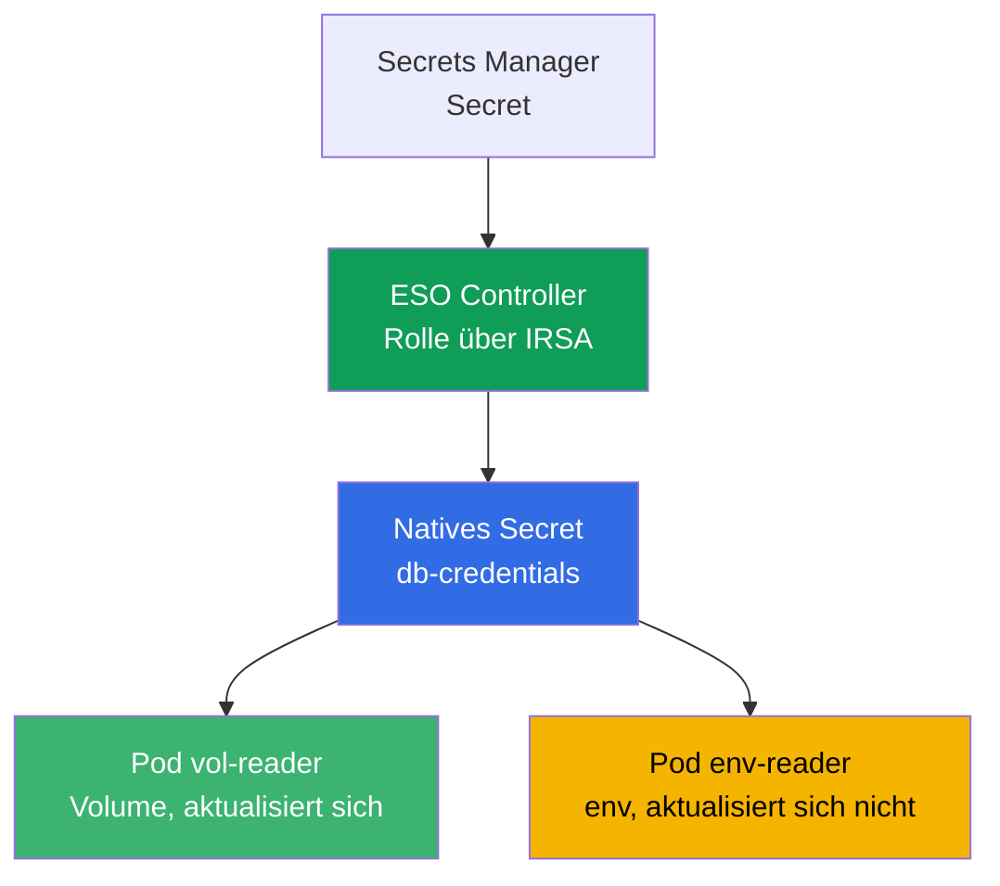
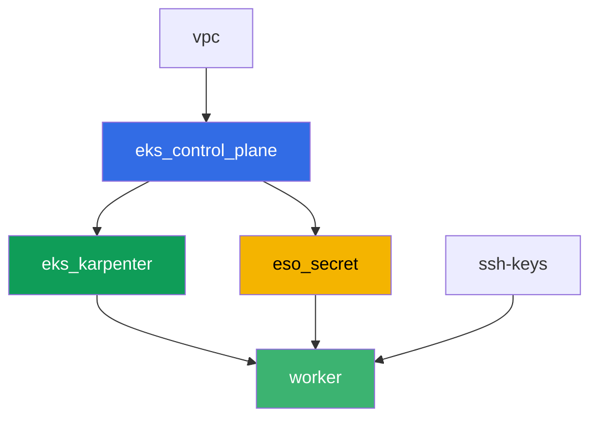

[Русская версия](README_RU.MD) · [Eng version](README.MD) · [Versión en español](README_ES.MD) · [Version française](README_FR.MD) · [ქართული ვერსია](README_GE.MD) · [繁體中文版](README_TW.MD) · [日本語版](README_JP.MD)

# Lab 105 - Secrets: KMS envelope encryption und External Secrets Operator

## Beschreibung

Die Anwendung braucht ein Datenbank-Passwort, und es im Manifest und in git zu speichern
ist keine gute Idee. In diesem Lab decken Sie beide Schutzschichten für Secrets in EKS ab:
Sie prüfen, dass die Control Plane `Secret`-Objekte in etcd mit einem KMS-Schlüssel
verschlüsselt (Schicht 1, standardmäßig aktiviert), und richten den External Secrets
Operator ein, der ein Secret aus einem echten AWS Secrets Manager liest und daraus ein
natives `Secret` erstellt (Schicht 2). Am Ende reproduzieren Sie das klassische
Rotations-Symptom: das Volume mit dem Secret aktualisiert sich selbst, während der Pod, der
dasselbe Secret über eine Umgebungsvariable liest, beim alten Wert hängen bleibt.

Die Aufgaben sind im Produktionsstil geschrieben: eine kurze Aufgabenstellung plus
Abnahmekriterien. Die Prüfung erfolgt automatisch über den Befehl `check_result`.

## Ziel

Den Stoff des Kurskapitels vertiefen:

- [Kapitel 18. Secrets: KMS, Secrets Manager und SSM über External Secrets](../../course/18/ru.md)

## Was wir erstellen

Terraform legt vorab ein Demo-Secret in Secrets Manager und eine IRSA-Rolle für den
ESO-Controller an (mit vorhersehbaren Namen). Sie installieren ESO über Helm, binden die
Rolle über eine Annotation am ServiceAccount und richten die Zustellung des Secrets in den
Cluster ein.

| Objekt | Was es ist | Wofür in diesem Lab |
|--------|---------|-------------------|
| Komponente `eso_secret` | Secret in Secrets Manager, IRSA-Rolle für ESO | fertige AWS-Ressourcen, die Rechte auf das Secret sind bereits beschrieben |
| Namespace `eks-105` | Bereich des Clusters für die Lab-Workload | hält die Ressourcen getrennt von Systemkomponenten |
| Artefakt `encryption_config.txt` | Ausgabe von `describe-cluster` | bestätigt Schicht 1: KMS envelope encryption für Secrets ist aktiviert |
| Release `external-secrets` (Helm) | ESO-Controller mit Rolle über IRSA | Schicht 2: Lesen des Secrets aus Secrets Manager |
| `SecretStore` `aws-sm` + `ExternalSecret` `db-credentials` | Verbindung zum Store und Synchronisationsregel | ESO erstellt ein natives `Secret` aus dem Wert in AWS |
| Pod `vol-reader` | liest das `Secret` über ein Volume | Synchronisationspfad, der gegen Wertänderungen robust ist |
| Pod `env-reader` + Artefakt `rotation.txt` | liest das `Secret` über env, Rotations-Symptom | env aktualisiert sich nicht ohne Neuerstellung des Pods |

Der Weg des Secrets von AWS zum Pod:



## Infrastruktur

Die Umgebung wird in AWS (`eu-central-1`) über Terragrunt deployt. Die Basis stimmt mit Lab
101 überein (Control Plane, Fargate für Systempods, Karpenter für die Workload), plus eine
separate Komponente für das Secret und die IRSA-Rolle des ESO-Controllers.

### Module und Abhängigkeiten

| Verzeichnis (Komponente) | Modul (`terraform/modules/`) | Abhängig von | Was es erstellt |
|---------------------|-------------------------------|------------|-------------|
| `vpc` | `vpc_v3` | - | VPC `10.10.0.0/16`, Subnetze in zwei AZ, NAT |
| `ssh-keys` | `ssh-keys` | - | ein SSH-Schlüsselpaar für die Worker-Maschine und die Nodes |
| `eks_control_plane` | `eks_v2_control_plane` | `vpc` | EKS Control Plane `1.36`, OIDC-Provider |
| `eks_fargate_system` | `eks_v2_fargate` | `vpc`, `eks_control_plane` | Fargate-Profil für `kube-system` und `karpenter` |
| `eks_addons` | `eks_v2_addons` | `eks_control_plane`, `eks_fargate_system` | Add-ons coredns, kube-proxy, vpc-cni, pod-identity |
| `eks_karpenter` | `eks_v2_karpenter` | `vpc`, `eks_control_plane`, `eks_addons`, `eks_fargate_system` | Karpenter-Controller, IAM-Rolle der Nodes |
| `eks_karpenter_default_vng` | `eks_v2_karpenter_vng` | `vpc`, `eks_control_plane`, `eks_karpenter` | Standard-NodePool `default` auf AL2023 |
| `eso_secret` | `eks_v2_eso_irsa` | `eks_control_plane` | Secret in Secrets Manager, IRSA-Rolle des ESO-Controllers |
| `worker` | `eks_v2_work_pc` | `ssh-keys`, `vpc`, `eks_control_plane`, `eks_karpenter`, `eso_secret` | Worker-Maschine mit kubectl, Tests und `check_result` |

Die Komponente `eso_secret` erstellt eine IRSA-Rolle mit einer Trust Policy, die genau an
das SA `external-secrets` im Namespace `external-secrets` gebunden ist (Bedingung `sub` aus
Kapitel 16), sowie eine inline Policy mit `secretsmanager:GetSecretValue`/`DescribeSecret`
auf das konkrete Demo-Secret - genau diese Rolle binden Sie an den ESO-Controller über eine
Annotation am ServiceAccount bei der Installation über Helm.

Der Abhängigkeitsgraph (was früher angewendet wird, steht weiter unten am Pfeil):



Die Komponenten `eks_fargate_system`, `eks_addons` und `eks_karpenter_default_vng` sind im
Graphen wegen der Grenze von 8 Knoten nicht dargestellt, stehen aber tatsächlich zwischen
`eks_control_plane` und `eks_karpenter` (siehe Tabelle oben).

### Vorhersehbare Ressourcennamen

`eso_secret` setzt die Namen aus `prefix` zusammen, daher findet der worker sie ohne
Lesen des terraform output. Alle liegen beim Login in der Datei `~/lab105_hints.txt`:

| Ressource | Name |
|--------|-----|
| Secrets Manager secret | `eks-task105-eso-demo-secret` |
| IRSA-Rolle des ESO-Controllers | `eks-task105-eso-irsa-role` |

### Wo was konfiguriert wird

`env.hcl` (allgemeine Umgebungsparameter):

| Parameter | Wert im Lab | Was er beeinflusst |
|----------|-----------------|---------------|
| `region` | `eu-central-1` | Region aller Ressourcen |
| `prefix` | `eks-task105` | Präfix der Ressourcennamen, einschließlich Secret und Rolle |
| `stack_name` | `eks105` | daraus wird `env_name` zusammengesetzt - der Cluster-Name |
| `k8_version` | `1.36.0` | Version von kubectl auf der Worker-Maschine |

`inputs` in `terragrunt.hcl` jeder Komponente:

| Datei | Wichtige Einstellungen |
|------|--------------------|
| `eso_secret/terragrunt.hcl` | `eso.namespace = "external-secrets"`, `eso.service_account_name = "external-secrets"`, `kms_key_arn = null` (Standardschlüssel `aws/secretsmanager`) |
| `worker/terragrunt.hcl` | `test_url` und `task_script_url` für die Dateien von Lab 105, Abhängigkeit von `eso_secret` |

## Deployment

```bash
TASK=105 make run_eks_task
```

Das Deployment dauert etwa 15-20 Minuten. Suchen Sie in der Ausgabe die Zeile mit der
SSH-Verbindung zur Worker-Maschine und verbinden Sie sich damit. kubectl ist dort bereits
für den richtigen Cluster konfiguriert, und die Namen und ARNs der Lab-Ressourcen stehen in
der Datei `~/lab105_hints.txt`.

Nützliche Befehle auf der Worker-Maschine:

```bash
time_left       # verbleibende Zeit der Umgebung
check_result    # Lösung prüfen
cat ~/lab105_hints.txt   # Namen und ARNs des Secrets und der IRSA-Rolle
```

> Sicherheit der Testumgebung. In `env.hcl` sind `ssh_password_enable = true` und
> `access_cidrs = ["0.0.0.0/0"]` aktiviert - praktisch für eine Lernumgebung, aber so sollte
> man es in Produktion nicht machen. Nach den Standards des Kurses (Kapitel 0.2, 2, 19) wird
> der Zugriff auf Worker-Maschinen über AWS SSM Session Manager geöffnet, ohne öffentliche
> SSH-Ports nach außen, und `access_cidrs` wird auf konkrete Adressen eingeschränkt. Hier
> bleibt öffentliches SSH nur der Einfachheit halber bestehen.

## Aufgaben

---
|        **1**        | **Namespace für die Lab-Workload**                             |
| :-----------------: | :---------------------------------------------------------- |
| Was wir tun          | Erstellen Sie einen Namespace mit dem Namen `eks-105`. Alle Objekte des Labs werden darin erstellt. |
| Abnahmekriterien    | - der Namespace `eks-105` existiert. |
---
|        **2**        | **Schicht 1: Prüfung von KMS envelope encryption**                 |
| :-----------------: | :---------------------------------------------------------- |
| Was wir tun          | Führen Sie `aws eks describe-cluster --name <cluster> --query 'cluster.encryptionConfig'` aus (Cluster-Name ist `cluster_name` aus `~/lab105_hints.txt`) und speichern Sie die Ausgabe in `/var/work/tests/artifacts/2/encryption_config.txt`. Stellen Sie sicher, dass die Verschlüsselungskonfiguration `resources` mit dem Wert `secrets` enthält - das bestätigt, dass `Secret`-Objekte beim Schreiben in etcd mit einem KMS-Schlüssel verschlüsselt werden (bei EKS 1.28+ standardmäßig aktiviert). |
| Abnahmekriterien    | - die Datei `2/encryption_config.txt` ist nicht leer und enthält `resources` und `secrets`. |
---
|        **3**        | **Installation des External Secrets Operator über Helm**           |
| :-----------------: | :---------------------------------------------------------- |
| Was wir tun          | Fügen Sie das Repository `https://charts.external-secrets.io` hinzu und installieren Sie den Chart `external-secrets` im Namespace `external-secrets` (Flag `--create-namespace`). Binden Sie bei der Installation die IRSA-Rolle (`role_arn` aus der Hinweisdatei) über eine Annotation: `--set serviceAccount.annotations."eks\.amazonaws\.com/role-arn"=<role_arn>`. Warten Sie, bis der Controller-Pod `Running` ist. |
| Abnahmekriterien    | - das Deployment von ESO in `external-secrets` hat mindestens eine bereite Replik;<br/>- das ServiceAccount des Controllers trägt die Annotation `eks.amazonaws.com/role-arn` mit einem Wert, der `eso-irsa-role` enthält. |
---
|        **4**        | **SecretStore und ExternalSecret**                              |
| :-----------------: | :---------------------------------------------------------- |
| Was wir tun          | Erstellen Sie in `eks-105` ein `SecretStore` `aws-sm` (`provider.aws.service: SecretsManager`, `region: eu-central-1`) und ein `ExternalSecret` `db-credentials`, das auf das Demo-Secret verweist (`secret_name` aus der Hinweisdatei), Feld `password`, `target.name: db-credentials`, ein kleines `refreshInterval` (z. B. `1m`, wird in Aufgabe 6 nützlich). Warten Sie auf den Status `SecretSynced` und prüfen Sie, dass das native `Secret` `db-credentials` mit dem richtigen Passwortwert erschienen ist (`kubectl get secret ... -o jsonpath` plus `base64 -d`). |
| Abnahmekriterien    | - das `ExternalSecret` `db-credentials` in `eks-105` hat den Status `SecretSynced`;<br/>- das `Secret` `db-credentials` enthält das Passwort `S3cr3tPass123`. |
---
|        **5**        | **Pod mit Volume: robuster Synchronisationspfad**                |
| :-----------------: | :---------------------------------------------------------- |
| Was wir tun          | Erstellen Sie den Pod `vol-reader` (Image `amazon/aws-cli:2.15.0`, Befehl `sleep 3600`), der das `Secret` `db-credentials` als Volume mountet (`volumeMount`, NICHT env). Lesen Sie das Passwort aus der Datei im Volume und speichern Sie die Ausgabe in `/var/work/tests/artifacts/5/volume_password.txt`. |
| Abnahmekriterien    | - der Pod `vol-reader` mountet das `Secret` `db-credentials` als Volume;<br/>- die Datei `5/volume_password.txt` ist nicht leer und enthält `S3cr3tPass123`. |
---
|        **6**        | **Pod mit env: das Secret ein zweites Mal lesen**                       |
| :-----------------: | :---------------------------------------------------------- |
| Was wir tun          | Erstellen Sie den Pod `env-reader` (Image `amazon/aws-cli:2.15.0`, Befehl `sleep 3600`) mit der Variable `DB_PASSWORD` über `secretKeyRef` auf das `Secret` `db-credentials`. Stellen Sie sicher, dass die Variable innerhalb des Pods sichtbar ist (`kubectl exec env-reader -n eks-105 -- printenv DB_PASSWORD`). |
| Abnahmekriterien    | - der Pod `env-reader` nutzt das `Secret` `db-credentials` über `secretKeyRef` auf die Variable `DB_PASSWORD`. |
---
|        **7**        | **Rotations-Symptom: env aktualisiert sich nicht**                       |
| :-----------------: | :---------------------------------------------------------- |
| Was wir tun          | Ändern Sie den Wert des Secrets direkt in Secrets Manager: `aws secretsmanager put-secret-value --secret-id <secret_name> --secret-string '{"username":"appuser","password":"RotatedPass456"}'`. Warten Sie das `refreshInterval` plus etwas Reserve ab und prüfen Sie das `Secret` erneut über kubectl - der Wert wird aktualisiert, ESO hat neu synchronisiert. Prüfen Sie danach den Pod `env-reader` aus Aufgabe 6 - er sieht den alten Wert in env. Speichern Sie die Erklärung in `/var/work/tests/artifacts/7/rotation.txt`: warum sich das `Secret` aktualisiert hat, `env-reader` aber den alten Wert sieht (erwähnen Sie das Wort `env` und dass sich der Wert ohne Neuerstellung des Pods nicht aktualisiert). |
| Abnahmekriterien    | - die Datei `7/rotation.txt` ist nicht leer, enthält `env` und die Erklärung, dass sich der Wert nicht aktualisiert. |
---

## Ergebnis prüfen

Führen Sie auf der Worker-Maschine die automatische Prüfung aus:

```bash
check_result
```

Das Skript führt die Tests aus und zeigt den Prozentsatz erledigter Aufgaben.

## Lösung

Referenzlösung: [worker/files/solutions/1_DE.MD](worker/files/solutions/1_DE.MD)

## Cluster und Ressourcen löschen

> **Entfernen Sie zuerst die Workload und den Helm-Release von ESO, warten Sie, bis die
> EC2-Nodes verschwinden, und löschen Sie dann die Umgebung.** ESO wurde manuell über Helm
> installiert, nicht über terraform - `TASK=105 make delete_eks_task` weiß nichts davon.
> Wenn Sie den Cluster löschen, während die Pods von `eks-105` und der ESO-Controller noch
> laufen, verschwindet der EC2-Node von Karpenter zusammen mit dem Cluster, aber das
> sekundäre ENI von VPC CNI bleibt im Zustand `available` und hält die Security Group der
> Nodes fest - `destroy` hängt für Dutzende Minuten bei
> `module.eks.aws_security_group.node[0]: Still destroying...`.

```bash
# 1. Workload des Labs und ESO entfernen
kubectl delete namespace eks-105 --ignore-not-found
helm uninstall external-secrets -n external-secrets
kubectl delete namespace external-secrets --ignore-not-found

# 2. Warten, bis Karpenter den NodeClaim und den EC2-Node entfernt (nur fargate-* bleiben übrig)
while kubectl get nodeclaims --no-headers 2>/dev/null | grep -q .; do
  echo "NodeClaim lebt noch, warte..."; sleep 15
done
kubectl get nodes | grep -v fargate
```

Erst danach löschen Sie die Umgebung (Secret in Secrets Manager und IRSA-Rolle von ESO
verschwinden zusammen mit der Komponente `eso_secret`):

```bash
TASK=105 make delete_eks_task
```

Bleibt `destroy` trotzdem bei der Security Group der Nodes hängen, bedeutet das, dass ein
verwaistes ENI übrig geblieben ist. Finden und löschen Sie es:

```bash
aws ec2 describe-network-interfaces --filters Name=status,Values=available \
  --query 'NetworkInterfaces[?Tags[?Key==`eks:eni:owner`]].[NetworkInterfaceId,Description]' \
  --output table
aws ec2 delete-network-interface --network-interface-id <eni-id>
```
