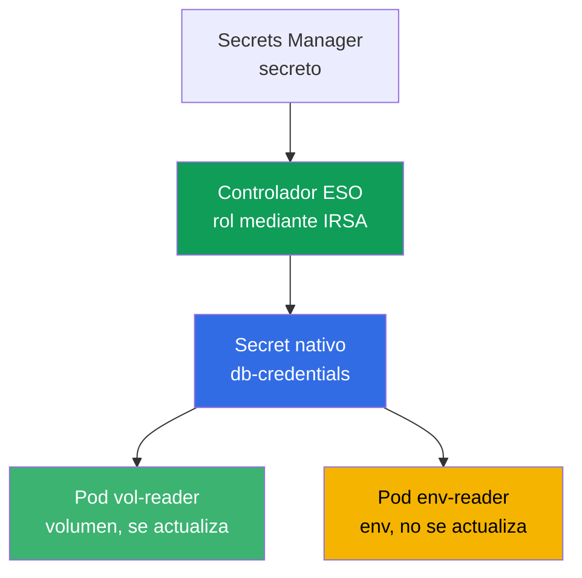
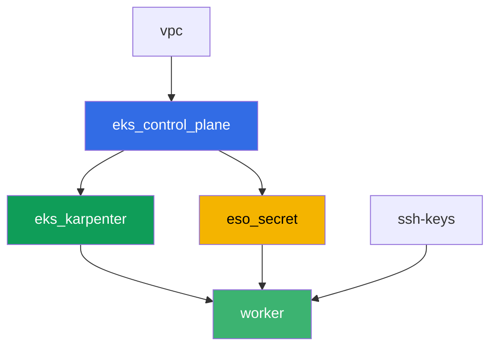

[Русская версия](README_RU.MD) · [Eng version](README.MD) · [Version française](README_FR.MD) · [Deutsche Version](README_DE.MD) · [ქართული ვერსია](README_GE.MD) · [繁體中文版](README_TW.MD) · [日本語版](README_JP.MD)

# Lab 105 - Secretos: KMS envelope encryption y External Secrets Operator

## Descripción

Una aplicación necesita una contraseña de base de datos, y no conviene guardarla en el
manifiesto ni en git. En este laboratorio cubres las dos capas de protección de secretos en
EKS: verificas que el control plane cifra los objetos `Secret` en etcd con una clave KMS
(capa 1, habilitada por defecto), y configuras External Secrets Operator, que lee el secreto
desde un AWS Secrets Manager real y crea a partir de él un `Secret` nativo (capa 2). Al
final reproduces el síntoma clásico de la rotación: un volumen con el secreto se actualiza
solo, mientras que un pod que lee el mismo secreto mediante una variable de entorno se queda
con el valor antiguo.

Las tareas están escritas en estilo de producción: un enunciado breve más criterios de
aceptación. La verificación es automática, mediante el comando `check_result`.

## Objetivo

Reforzar el material de este capítulo del curso:

- [Capítulo 18. Secretos: KMS, Secrets Manager y SSM mediante External Secrets](../../course/18/ru.md)

## Qué vamos a crear

Terraform crea de antemano un secreto de demostración en Secrets Manager y un rol IRSA para
el controlador de ESO (con nombres predecibles). Tú instalas ESO mediante Helm, vinculas el
rol con una anotación en el ServiceAccount y configuras la entrega del secreto al clúster.

| Objeto | Qué es | Para qué sirve en este laboratorio |
|--------|---------|-------------------|
| Componente `eso_secret` | secreto de Secrets Manager, rol IRSA para ESO | recursos de AWS ya listos, los permisos sobre el secreto ya están descritos |
| Namespace `eks-105` | sección del clúster para la carga del laboratorio | mantiene los recursos separados de los del sistema |
| Artefacto `encryption_config.txt` | salida de `describe-cluster` | confirma la capa 1: el KMS envelope encryption de secretos está habilitado |
| Release `external-secrets` (Helm) | controlador de ESO con rol mediante IRSA | capa 2: lectura del secreto desde Secrets Manager |
| `SecretStore` `aws-sm` + `ExternalSecret` `db-credentials` | vínculo con el almacén y regla de sincronización | ESO crea un `Secret` nativo a partir del valor en AWS |
| Pod `vol-reader` | lee el `Secret` mediante un volumen | ruta de sincronización, resistente a la actualización del valor |
| Pod `env-reader` + artefacto `rotation.txt` | lee el `Secret` mediante env, síntoma de rotación | env no se actualiza sin recrear el pod |

Ruta del secreto desde AWS hasta el pod:



## Infraestructura

El entorno se despliega en AWS (`eu-central-1`) mediante Terragrunt. La base coincide con el
laboratorio 101 (control plane, Fargate para los pods del sistema, Karpenter para la carga),
más un componente aparte para el secreto y el rol IRSA del controlador de ESO.

### Módulos y dependencias

| Carpeta (componente) | Módulo (`terraform/modules/`) | Depende de | Qué crea |
|---------------------|-------------------------------|------------|-------------|
| `vpc` | `vpc_v3` | - | VPC `10.10.0.0/16`, subredes en dos AZ, NAT |
| `ssh-keys` | `ssh-keys` | - | un par de claves SSH para la máquina de trabajo y los nodos |
| `eks_control_plane` | `eks_v2_control_plane` | `vpc` | control plane de EKS `1.36`, proveedor OIDC |
| `eks_fargate_system` | `eks_v2_fargate` | `vpc`, `eks_control_plane` | perfil de Fargate para `kube-system` y `karpenter` |
| `eks_addons` | `eks_v2_addons` | `eks_control_plane`, `eks_fargate_system` | coredns, kube-proxy, vpc-cni, pod-identity |
| `eks_karpenter` | `eks_v2_karpenter` | `vpc`, `eks_control_plane`, `eks_addons`, `eks_fargate_system` | controlador de Karpenter, rol IAM de los nodos |
| `eks_karpenter_default_vng` | `eks_v2_karpenter_vng` | `vpc`, `eks_control_plane`, `eks_karpenter` | NodePool por defecto `default` sobre AL2023 |
| `eso_secret` | `eks_v2_eso_irsa` | `eks_control_plane` | secreto de Secrets Manager, rol IRSA del controlador de ESO |
| `worker` | `eks_v2_work_pc` | `ssh-keys`, `vpc`, `eks_control_plane`, `eks_karpenter`, `eso_secret` | máquina de trabajo con kubectl, tests y `check_result` |

El componente `eso_secret` crea un rol IRSA con una trust policy vinculada exactamente al SA
`external-secrets` en el namespace `external-secrets` (condición `sub` del capítulo 16), y
una inline policy con `secretsmanager:GetSecretValue`/`DescribeSecret` sobre el secreto de
demostración concreto - precisamente este rol es el que vincularás al controlador de ESO
mediante una anotación en el ServiceAccount durante la instalación con Helm.

Grafo de dependencias (lo que se aplica antes está más abajo en la flecha):



Los componentes `eks_fargate_system`, `eks_addons` y `eks_karpenter_default_vng` no aparecen
en el grafo por el límite de 8 nodos, pero en realidad se ubican entre `eks_control_plane` y
`eks_karpenter` (ver la tabla anterior).

### Nombres predecibles de los recursos

`eso_secret` compone los nombres a partir de `prefix`, por lo que worker los encuentra sin
leer el output de terraform. Todos están disponibles al conectarte en el archivo
`~/lab105_hints.txt`:

| Recurso | Nombre |
|--------|-----|
| Secret de Secrets Manager | `eks-task105-eso-demo-secret` |
| Rol IRSA del controlador de ESO | `eks-task105-eso-irsa-role` |

### Dónde se configura cada cosa

`env.hcl` (parámetros generales del entorno):

| Parámetro | Valor en el laboratorio | Qué afecta |
|----------|-----------------|----------------|
| `region` | `eu-central-1` | región de todos los recursos |
| `prefix` | `eks-task105` | prefijo de los nombres de recursos, incluidos el secreto y el rol |
| `stack_name` | `eks105` | de él se compone `env_name` - el nombre del clúster |
| `k8_version` | `1.36.0` | versión de kubectl en la máquina de trabajo |

`inputs` en el `terragrunt.hcl` de cada componente:

| Archivo | Ajustes clave |
|------|--------------------|
| `eso_secret/terragrunt.hcl` | `eso.namespace = "external-secrets"`, `eso.service_account_name = "external-secrets"`, `kms_key_arn = null` (clave por defecto `aws/secretsmanager`) |
| `worker/terragrunt.hcl` | `test_url` y `task_script_url` apuntan a los archivos del laboratorio 105, dependencia de `eso_secret` |

## Despliegue

```bash
TASK=105 make run_eks_task
```

El despliegue tarda aproximadamente 15-20 minutos. En la salida, busca la línea con la
conexión SSH a la máquina de trabajo y conéctate a ella. kubectl ya está configurado allí
para el clúster correcto, y los nombres y ARN de los recursos del laboratorio están en el
archivo `~/lab105_hints.txt`.

Comandos útiles en la máquina de trabajo:

```bash
time_left       # cuánto tiempo queda del entorno
check_result    # verificar la solución
cat ~/lab105_hints.txt   # nombres y ARN del secreto y del rol IRSA
```

> Seguridad del entorno. En `env.hcl` están activados `ssh_password_enable = true` y
> `access_cidrs = ["0.0.0.0/0"]` - cómodo para un entorno de formación, pero no es algo que
> se deba hacer en producción. Según los estándares del curso (capítulos 0.2, 2, 19), el
> acceso a las máquinas de trabajo se abre mediante AWS SSM Session Manager sin puertos SSH
> públicos hacia el exterior, y `access_cidrs` se restringe a direcciones concretas. Aquí se
> deja SSH público solo para simplificar el arranque.

## Tareas

---
|        **1**        | **Namespace para la carga del laboratorio**                             |
| :-----------------: | :---------------------------------------------------------- |
| Qué hacemos          | Crea un namespace con el nombre `eks-105`. Todos los objetos del laboratorio se crean dentro de él. |
| Criterios de aceptación    | - el namespace `eks-105` existe. |
---
|        **2**        | **Capa 1: verificación del KMS envelope encryption**                 |
| :-----------------: | :---------------------------------------------------------- |
| Qué hacemos          | Ejecuta `aws eks describe-cluster --name <cluster> --query 'cluster.encryptionConfig'` (el nombre del clúster es `cluster_name` de `~/lab105_hints.txt`) y guarda la salida en `/var/work/tests/artifacts/2/encryption_config.txt`. Comprueba que la configuración de cifrado contiene `resources` con el valor `secrets` - esto confirma que los objetos `Secret` se cifran con una clave KMS al escribirse en etcd (habilitado por defecto en EKS 1.28+). |
| Criterios de aceptación    | - el archivo `2/encryption_config.txt` no está vacío y contiene `resources` y `secrets`. |
---
|        **3**        | **Instalación de External Secrets Operator mediante Helm**           |
| :-----------------: | :---------------------------------------------------------- |
| Qué hacemos          | Agrega el repositorio `https://charts.external-secrets.io` e instala el chart `external-secrets` en el namespace `external-secrets` (flag `--create-namespace`). Al instalar, vincula el rol IRSA (`role_arn` de la pista) mediante una anotación: `--set serviceAccount.annotations."eks\.amazonaws\.com/role-arn"=<role_arn>`. Espera a que el pod del controlador esté `Running`. |
| Criterios de aceptación    | - el Deployment de ESO en `external-secrets` tiene al menos una réplica lista;<br/>- el ServiceAccount del controlador tiene la anotación `eks.amazonaws.com/role-arn` con un valor que contiene `eso-irsa-role`. |
---
|        **4**        | **SecretStore y ExternalSecret**                              |
| :-----------------: | :---------------------------------------------------------- |
| Qué hacemos          | En `eks-105` crea un `SecretStore` `aws-sm` (`provider.aws.service: SecretsManager`, `region: eu-central-1`) y un `ExternalSecret` `db-credentials`, que referencie el secreto de demostración (`secret_name` de la pista), el campo `password`, `target.name: db-credentials`, con un `refreshInterval` pequeño (por ejemplo `1m`, será útil en la tarea 6). Espera el estado `SecretSynced` y comprueba que el `Secret` nativo `db-credentials` apareció con el valor correcto de la contraseña (`kubectl get secret ... -o jsonpath` más `base64 -d`). |
| Criterios de aceptación    | - el `ExternalSecret` `db-credentials` en `eks-105` está en estado `SecretSynced`;<br/>- el `Secret` `db-credentials` contiene la contraseña `S3cr3tPass123`. |
---
|        **5**        | **Pod con volumen: ruta de sincronización resistente**                |
| :-----------------: | :---------------------------------------------------------- |
| Qué hacemos          | Crea el Pod `vol-reader` (imagen `amazon/aws-cli:2.15.0`, comando `sleep 3600`), que monte el `Secret` `db-credentials` como volumen (`volumeMount`, NO env). Lee la contraseña desde el archivo en el volumen y guarda la salida en `/var/work/tests/artifacts/5/volume_password.txt`. |
| Criterios de aceptación    | - el Pod `vol-reader` monta el `Secret` `db-credentials` como volumen;<br/>- el archivo `5/volume_password.txt` no está vacío y contiene `S3cr3tPass123`. |
---
|        **6**        | **Pod con env: leemos el secreto por segunda vez**                       |
| :-----------------: | :---------------------------------------------------------- |
| Qué hacemos          | Crea el Pod `env-reader` (imagen `amazon/aws-cli:2.15.0`, comando `sleep 3600`) con una variable `DB_PASSWORD` mediante `secretKeyRef` sobre el `Secret` `db-credentials`. Comprueba que la variable es visible dentro del pod (`kubectl exec env-reader -n eks-105 -- printenv DB_PASSWORD`). |
| Criterios de aceptación    | - el Pod `env-reader` usa el `Secret` `db-credentials` mediante `secretKeyRef` sobre la variable `DB_PASSWORD`. |
---
|        **7**        | **Síntoma de rotación: env no se actualiza**                       |
| :-----------------: | :---------------------------------------------------------- |
| Qué hacemos          | Cambia el valor del secreto directamente en Secrets Manager: `aws secretsmanager put-secret-value --secret-id <secret_name> --secret-string '{"username":"appuser","password":"RotatedPass456"}'`. Espera el `refreshInterval` más un margen y vuelve a comprobar el `Secret` mediante kubectl - el valor se habrá actualizado, ESO lo resincronizó. Luego comprueba el pod `env-reader` de la tarea 6 - sigue viendo el valor antiguo en env. Guarda la explicación en `/var/work/tests/artifacts/7/rotation.txt`: por qué el `Secret` se actualizó pero `env-reader` ve el valor antiguo (menciona la palabra `env` y que el valor no se actualiza sin recrear el pod). |
| Criterios de aceptación    | - el archivo `7/rotation.txt` no está vacío, contiene `env` y la explicación de que el valor no se actualiza (marcador en inglés: `does not update`). |
---

## Verificación del resultado

En la máquina de trabajo, ejecuta la verificación automática:

```bash
check_result
```

El script ejecutará los tests y mostrará el porcentaje de tareas completadas.

## Solución

Solución de referencia: [worker/files/solutions/1_ES.MD](worker/files/solutions/1_ES.MD)

## Eliminación del clúster y los recursos

> **Primero retira la carga y el release de Helm de ESO, espera a que se vaya el nodo
> EC2, y luego destruye el entorno.** ESO se instaló manualmente mediante Helm, no con
> terraform - `TASK=105 make delete_eks_task` no sabe nada de él. Si se elimina el clúster
> mientras aún viven los pods de `eks-105` y el controlador de ESO, el nodo EC2 de Karpenter
> se va junto con el clúster, y el ENI secundario de VPC CNI queda en estado `available` y
> retiene el security group de los nodos - `destroy` se queda colgado en
> `module.eks.aws_security_group.node[0]: Still destroying...` durante decenas de minutos.

```bash
# 1. Retirar la carga del laboratorio y ESO
kubectl delete namespace eks-105 --ignore-not-found
helm uninstall external-secrets -n external-secrets
kubectl delete namespace external-secrets --ignore-not-found

# 2. Esperar a que Karpenter retire el NodeClaim y el nodo EC2 (solo quedarán fargate-*)
while kubectl get nodeclaims --no-headers 2>/dev/null | grep -q .; do
  echo "El NodeClaim todavía existe, esperando..."; sleep 15
done
kubectl get nodes | grep -v fargate
```

Solo después de esto destruye el entorno (el secreto de Secrets Manager y el rol IRSA de ESO
se irán junto con el componente `eso_secret`):

```bash
TASK=105 make delete_eks_task
```

Si `destroy` de todas formas se queda atascado en el security group de los nodos, significa
que quedó un ENI huérfano. Encuéntralo y elimínalo:

```bash
aws ec2 describe-network-interfaces --filters Name=status,Values=available \
  --query 'NetworkInterfaces[?Tags[?Key==`eks:eni:owner`]].[NetworkInterfaceId,Description]' \
  --output table
aws ec2 delete-network-interface --network-interface-id <eni-id>
```
