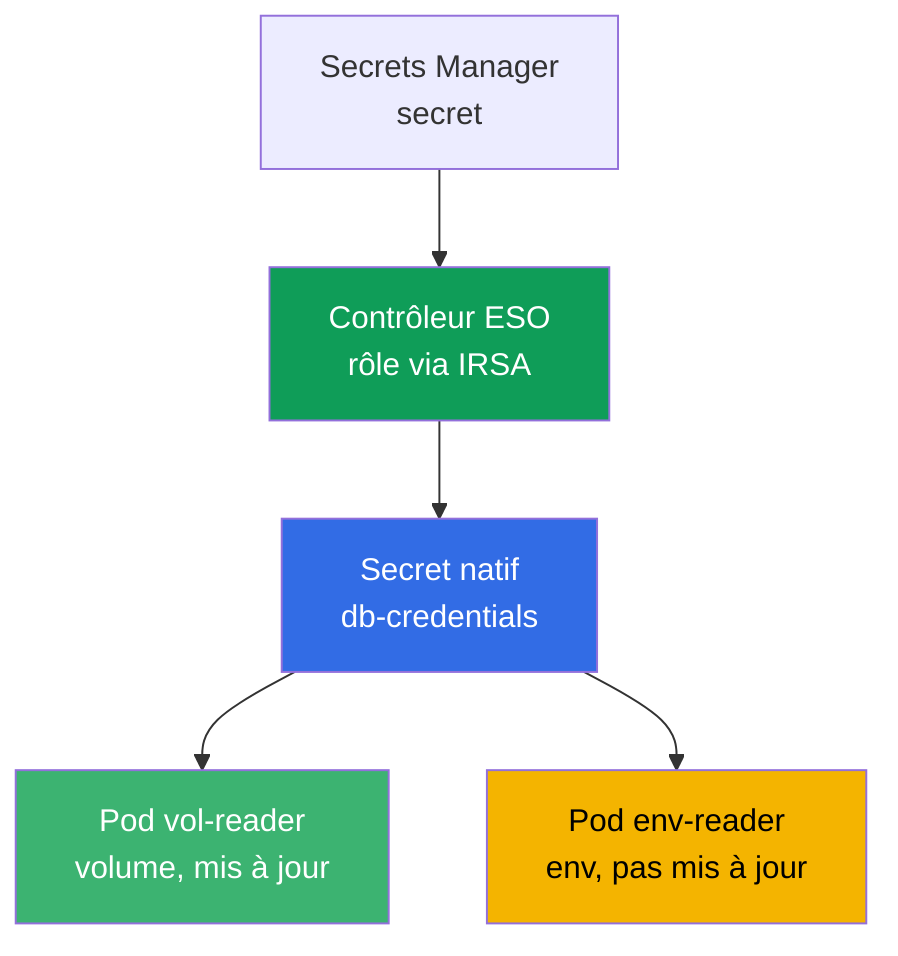
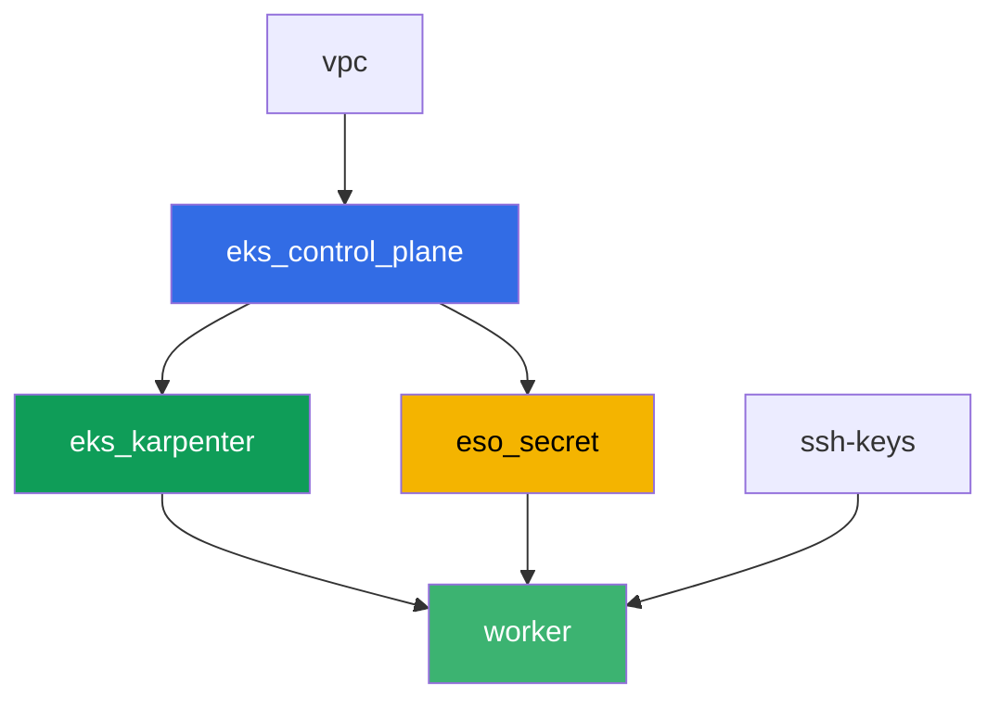

[Русская версия](README_RU.MD) · [Eng version](README.MD) · [Versión en español](README_ES.MD) · [Deutsche Version](README_DE.MD) · [ქართული ვერსია](README_GE.MD) · [繁體中文版](README_TW.MD) · [日本語版](README_JP.MD)

# Lab 105 - Secrets : KMS envelope encryption et External Secrets Operator

## Description

L'application a besoin d'un mot de passe pour la base de données, et on ne veut pas le
stocker dans un manifeste ni dans git. Dans ce lab, vous couvrez les deux couches de
protection des secrets dans EKS : vous vérifiez que le control plane chiffre les objets
`Secret` dans etcd avec une clé KMS (couche 1, activée par défaut), et vous configurez
External Secrets Operator, qui lit un secret depuis un véritable AWS Secrets Manager et
crée à partir de celui-ci un `Secret` natif (couche 2). À la fin, vous reproduisez le
symptôme classique de la rotation : un volume contenant le secret se met à jour tout seul,
tandis qu'un pod lisant le même secret via une variable d'environnement reste bloqué sur
l'ancienne valeur.

Les tâches sont écrites dans un style de production : un énoncé court plus des critères
d'acceptation. La vérification est automatique, via la commande `check_result`.

## Objectif

Consolider le contenu du chapitre suivant du cours :

- [Chapitre 18. Secrets : KMS, Secrets Manager et SSM via External Secrets](../../course/18/fr.md)

## Ce que nous créons

Terraform crée à l'avance un secret de démo dans Secrets Manager et un rôle IRSA pour le
contrôleur ESO (avec des noms prévisibles). Vous installez ESO via Helm, vous liez le rôle
par une annotation sur le ServiceAccount et vous configurez la livraison du secret dans le
cluster.

| Objet | Ce que c'est | Pourquoi dans ce lab |
|--------|---------|-------------------|
| Composant `eso_secret` | secret Secrets Manager, rôle IRSA pour ESO | ressources AWS déjà prêtes, droits sur le secret déjà décrits |
| Namespace `eks-105` | section du cluster pour la charge du lab | on garde les ressources séparées des composants système |
| Artefact `encryption_config.txt` | sortie de `describe-cluster` | confirme la couche 1 : le KMS envelope encryption des secrets est activé |
| Release `external-secrets` (Helm) | contrôleur ESO avec un rôle via IRSA | couche 2 : lecture du secret depuis Secrets Manager |
| `SecretStore` `aws-sm` + `ExternalSecret` `db-credentials` | lien avec le magasin et règle de synchronisation | ESO crée un `Secret` natif à partir de la valeur dans AWS |
| Pod `vol-reader` | lit le `Secret` via un volume | chemin de synchronisation résistant à la mise à jour de la valeur |
| Pod `env-reader` + artefact `rotation.txt` | lit le `Secret` via env, symptôme de la rotation | env ne se met pas à jour sans recréation du pod |

Le chemin du secret depuis AWS jusqu'au pod :



## Infrastructure

L'environnement est déployé sur AWS (`eu-central-1`) via Terragrunt. La base est la même
que le lab 101 (control plane, Fargate pour les pods système, Karpenter pour la charge),
plus un composant séparé pour le secret et le rôle IRSA du contrôleur ESO.

### Modules et dépendances

| Dossier (composant) | Module (`terraform/modules/`) | Dépend de | Ce qu'il crée |
|---------------------|-------------------------------|------------|-------------|
| `vpc` | `vpc_v3` | - | VPC `10.10.0.0/16`, sous-réseaux dans deux AZ, NAT |
| `ssh-keys` | `ssh-keys` | - | une paire de clés SSH pour la machine worker et les nœuds |
| `eks_control_plane` | `eks_v2_control_plane` | `vpc` | control plane EKS `1.36`, fournisseur OIDC |
| `eks_fargate_system` | `eks_v2_fargate` | `vpc`, `eks_control_plane` | profil Fargate pour `kube-system` et `karpenter` |
| `eks_addons` | `eks_v2_addons` | `eks_control_plane`, `eks_fargate_system` | coredns, kube-proxy, vpc-cni, pod-identity |
| `eks_karpenter` | `eks_v2_karpenter` | `vpc`, `eks_control_plane`, `eks_addons`, `eks_fargate_system` | contrôleur Karpenter, rôle IAM des nœuds |
| `eks_karpenter_default_vng` | `eks_v2_karpenter_vng` | `vpc`, `eks_control_plane`, `eks_karpenter` | NodePool par défaut `default` sur AL2023 |
| `eso_secret` | `eks_v2_eso_irsa` | `eks_control_plane` | secret Secrets Manager, rôle IRSA du contrôleur ESO |
| `worker` | `eks_v2_work_pc` | `ssh-keys`, `vpc`, `eks_control_plane`, `eks_karpenter`, `eso_secret` | machine worker avec kubectl, tests et `check_result` |

Le composant `eso_secret` crée un rôle IRSA avec une trust policy liée exactement au SA
`external-secrets` dans le namespace `external-secrets` (condition `sub` du chapitre 16),
et une inline policy avec `secretsmanager:GetSecretValue`/`DescribeSecret` sur un secret de
démo précis - c'est exactement ce rôle que vous attacherez au contrôleur ESO via une
annotation sur le ServiceAccount lors de l'installation via Helm.

Graphe de dépendances (ce qui est appliqué en premier est plus bas dans la flèche) :



Les composants `eks_fargate_system`, `eks_addons` et `eks_karpenter_default_vng` ne sont
pas représentés sur le graphe à cause de la limite de 8 nœuds, mais se situent en réalité
entre `eks_control_plane` et `eks_karpenter` (voir le tableau ci-dessus).

### Noms de ressources prévisibles

`eso_secret` construit les noms à partir de `prefix`, donc le worker les retrouve sans lire
la sortie de terraform. Ils sont tous disponibles au démarrage dans le fichier
`~/lab105_hints.txt` :

| Ressource | Nom |
|--------|-----|
| Secret Secrets Manager | `eks-task105-eso-demo-secret` |
| Rôle IRSA du contrôleur ESO | `eks-task105-eso-irsa-role` |

### Où se configure quoi

`env.hcl` (paramètres généraux de l'environnement) :

| Paramètre | Valeur dans le lab | Ce qu'il influence |
|----------|-----------------|---------------|
| `region` | `eu-central-1` | région de toutes les ressources |
| `prefix` | `eks-task105` | préfixe des noms de ressources, y compris le secret et le rôle |
| `stack_name` | `eks105` | c'est à partir de lui qu'est construit `env_name` - le nom du cluster |
| `k8_version` | `1.36.0` | version de kubectl sur la machine worker |

`inputs` dans le `terragrunt.hcl` de chaque composant :

| Fichier | Paramètres clés |
|------|--------------------|
| `eso_secret/terragrunt.hcl` | `eso.namespace = "external-secrets"`, `eso.service_account_name = "external-secrets"`, `kms_key_arn = null` (clé par défaut `aws/secretsmanager`) |
| `worker/terragrunt.hcl` | `test_url` et `task_script_url` vers les fichiers du lab 105, dépendance à `eso_secret` |

## Déploiement

```bash
TASK=105 make run_eks_task
```

Le déploiement prend environ 15-20 minutes. Dans la sortie, repérez la ligne avec la
connexion SSH vers la machine worker et connectez-vous. kubectl y est déjà configuré pour
le bon cluster, et les noms et ARN des ressources du lab sont dans le fichier
`~/lab105_hints.txt`.

Commandes utiles sur la machine worker :

```bash
time_left       # temps restant de l'environnement
check_result    # vérifier la solution
cat ~/lab105_hints.txt   # noms et ARN du secret et du rôle IRSA
```

> Sécurité du banc de test. Dans `env.hcl`, `ssh_password_enable = true` et
> `access_cidrs = ["0.0.0.0/0"]` sont activés - pratique pour un environnement de
> formation, mais à ne pas faire en production. Selon les standards du cours (chapitres
> 0.2, 2, 19), l'accès aux machines worker passe par AWS SSM Session Manager sans port SSH
> public exposé, et `access_cidrs` est restreint à des adresses précises. Ici, le SSH
> public est laissé uniquement pour simplifier le démarrage.

## Tâches

---
|        **1**        | **Namespace pour la charge du lab**                             |
| :-----------------: | :---------------------------------------------------------- |
| Ce qu'on fait          | Créez un namespace nommé `eks-105`. Tous les objets du lab sont créés à l'intérieur. |
| Critères d'acceptation    | - le namespace `eks-105` existe. |
---
|        **2**        | **Couche 1 : vérification du KMS envelope encryption**                 |
| :-----------------: | :---------------------------------------------------------- |
| Ce qu'on fait          | Exécutez `aws eks describe-cluster --name <cluster> --query 'cluster.encryptionConfig'` (le nom du cluster est `cluster_name` dans `~/lab105_hints.txt`) et enregistrez la sortie dans `/var/work/tests/artifacts/2/encryption_config.txt`. Assurez-vous que la configuration de chiffrement contient `resources` avec la valeur `secrets` - cela confirme que les objets `Secret` sont chiffrés avec une clé KMS lors de l'écriture dans etcd (activé par défaut sur EKS 1.28+). |
| Critères d'acceptation    | - le fichier `2/encryption_config.txt` n'est pas vide et contient `resources` et `secrets`. |
---
|        **3**        | **Installation d'External Secrets Operator via Helm**           |
| :-----------------: | :---------------------------------------------------------- |
| Ce qu'on fait          | Ajoutez le dépôt `https://charts.external-secrets.io` et installez le chart `external-secrets` dans le namespace `external-secrets` (option `--create-namespace`). Lors de l'installation, liez le rôle IRSA (`role_arn` depuis l'indice) via l'annotation : `--set serviceAccount.annotations."eks\.amazonaws\.com/role-arn"=<role_arn>`. Attendez que le pod du contrôleur soit `Running`. |
| Critères d'acceptation    | - le Deployment ESO dans `external-secrets` a au moins une réplique prête ;<br/>- le ServiceAccount du contrôleur porte l'annotation `eks.amazonaws.com/role-arn` avec une valeur contenant `eso-irsa-role`. |
---
|        **4**        | **SecretStore et ExternalSecret**                              |
| :-----------------: | :---------------------------------------------------------- |
| Ce qu'on fait          | Dans `eks-105`, créez un `SecretStore` `aws-sm` (`provider.aws.service: SecretsManager`, `region: eu-central-1`) et un `ExternalSecret` `db-credentials`, qui référence le secret de démo (`secret_name` depuis l'indice), champ `password`, `target.name: db-credentials`, `refreshInterval` court (par exemple `1m`, utile pour la tâche 6). Attendez le statut `SecretSynced` et vérifiez que le `Secret` natif `db-credentials` est apparu avec la bonne valeur de mot de passe (`kubectl get secret ... -o jsonpath` plus `base64 -d`). |
| Critères d'acceptation    | - `ExternalSecret` `db-credentials` dans `eks-105` est au statut `SecretSynced` ;<br/>- le `Secret` `db-credentials` contient le mot de passe `S3cr3tPass123`. |
---
|        **5**        | **Pod avec volume : chemin de synchronisation résistant**                |
| :-----------------: | :---------------------------------------------------------- |
| Ce qu'on fait          | Créez le Pod `vol-reader` (image `amazon/aws-cli:2.15.0`, commande `sleep 3600`), qui monte le `Secret` `db-credentials` comme un volume (`volumeMount`, PAS env). Lisez le mot de passe depuis le fichier dans le volume et enregistrez la sortie dans `/var/work/tests/artifacts/5/volume_password.txt`. |
| Critères d'acceptation    | - le Pod `vol-reader` monte le `Secret` `db-credentials` comme un volume ;<br/>- le fichier `5/volume_password.txt` n'est pas vide et contient `S3cr3tPass123`. |
---
|        **6**        | **Pod avec env : lire le secret une seconde fois**                       |
| :-----------------: | :---------------------------------------------------------- |
| Ce qu'on fait          | Créez le Pod `env-reader` (image `amazon/aws-cli:2.15.0`, commande `sleep 3600`) avec une variable `DB_PASSWORD` via `secretKeyRef` sur le `Secret` `db-credentials`. Assurez-vous que la variable est visible dans le pod (`kubectl exec env-reader -n eks-105 -- printenv DB_PASSWORD`). |
| Critères d'acceptation    | - le Pod `env-reader` utilise le `Secret` `db-credentials` via `secretKeyRef` sur la variable `DB_PASSWORD`. |
---
|        **7**        | **Symptôme de la rotation : env ne se met pas à jour**                       |
| :-----------------: | :---------------------------------------------------------- |
| Ce qu'on fait          | Modifiez la valeur du secret directement dans Secrets Manager : `aws secretsmanager put-secret-value --secret-id <secret_name> --secret-string '{"username":"appuser","password":"RotatedPass456"}'`. Attendez `refreshInterval` plus une marge et revérifiez le `Secret` via kubectl - la valeur sera mise à jour, ESO a resynchronisé. Ensuite, vérifiez le pod `env-reader` de la tâche 6 - il voit toujours l'ancienne valeur dans env. Enregistrez l'explication dans `/var/work/tests/artifacts/7/rotation.txt` : pourquoi le `Secret` a été mis à jour, mais `env-reader` voit toujours l'ancienne valeur (mentionnez le mot `env` et le fait que la valeur ne se met pas à jour sans recréer le pod). |
| Critères d'acceptation    | - le fichier `7/rotation.txt` n'est pas vide, contient `env` et une explication indiquant que la valeur ne se met pas à jour (marqueur en anglais : `does not update`). |
---

## Vérification du résultat

Sur la machine worker, lancez la vérification automatique :

```bash
check_result
```

Le script exécutera les tests et affichera le pourcentage de tâches accomplies.

## Solution

Solution de référence : [worker/files/solutions/1_FR.MD](worker/files/solutions/1_FR.MD)

## Suppression du cluster et des ressources

> **Retirez d'abord la charge de travail et la release Helm d'ESO, attendez le départ des
> nœuds EC2, puis supprimez le banc de test.** ESO a été installé à la main via Helm, pas
> via terraform - `TASK=105 make delete_eks_task` ne le connaît pas. Si vous supprimez le
> cluster pendant que les pods `eks-105` et le contrôleur ESO sont encore vivants, le nœud
> EC2 de Karpenter disparaît avec le cluster, et l'ENI secondaire de VPC CNI reste à l'état
> `available` et retient le security group des nœuds - `destroy` reste bloqué sur
> `module.eks.aws_security_group.node[0]: Still destroying...` pendant des dizaines de
> minutes.

```bash
# 1. Retirer la charge du lab et ESO
kubectl delete namespace eks-105 --ignore-not-found
helm uninstall external-secrets -n external-secrets
kubectl delete namespace external-secrets --ignore-not-found

# 2. Attendre que Karpenter retire le NodeClaim et le nœud EC2 (il ne restera que fargate-*)
while kubectl get nodeclaims --no-headers 2>/dev/null | grep -q .; do
  echo "Le NodeClaim est encore vivant, on attend..."; sleep 15
done
kubectl get nodes | grep -v fargate
```

Ce n'est qu'après cela qu'il faut supprimer le banc de test (le secret Secrets Manager et
le rôle IRSA d'ESO disparaîtront avec le composant `eso_secret`) :

```bash
TASK=105 make delete_eks_task
```

Si `destroy` reste malgré tout bloqué sur le security group des nœuds, c'est qu'il reste un
ENI orphelin. Trouvez-le et supprimez-le :

```bash
aws ec2 describe-network-interfaces --filters Name=status,Values=available \
  --query 'NetworkInterfaces[?Tags[?Key==`eks:eni:owner`]].[NetworkInterfaceId,Description]' \
  --output table
aws ec2 delete-network-interface --network-interface-id <eni-id>
```
