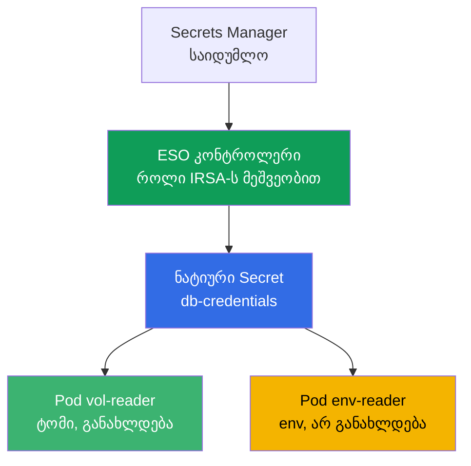
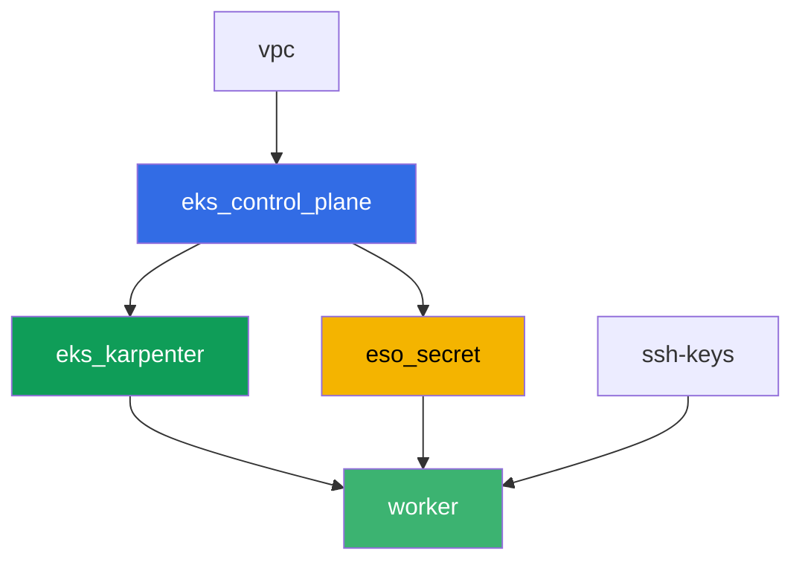

[Русская версия](README_RU.MD) · [Eng version](README.MD) · [Versión en español](README_ES.MD) · [Version française](README_FR.MD) · [Deutsche Version](README_DE.MD) · [繁體中文版](README_TW.MD) · [日本語版](README_JP.MD)

# Lab 105 - საიდუმლოებები: KMS envelope encryption და External Secrets Operator

## აღწერა

აპლიკაციას სჭირდება ბაზის პაროლი, და მის მანიფესტში ან git-ში შენახვა არ არის სასურველი.
ამ ლაბაში ხურავთ საიდუმლოებების დაცვის ორივე შრეს EKS-ში: ამოწმებთ, რომ control plane
შიფრავს `Secret` ობიექტებს etcd-ში KMS გასაღებით (შრე 1, ჩართული ნაგულისხმევად), და
აწყობთ External Secrets Operator-ს, რომელიც კითხულობს საიდუმლოს ნამდვილი AWS Secrets
Manager-იდან და მისგან ქმნის ნატიურ `Secret`-ს (შრე 2). ბოლოს ხელახლა იმეორებთ როტაციის
კლასიკურ სიმპტომს: ტომი საიდუმლოთი განახლდება თავისთავად, ხოლო podი, რომელიც კითხულობს
იმავე საიდუმლოს environment ცვლადის მეშვეობით, ჩარჩენილია ძველ მნიშვნელობაზე.

დავალებები დაწერილია production-სტილში: მოკლე დავალება პლუს acceptance criteria.
შემოწმება ავტომატურია, `check_result` ბრძანებით.

## მიზანი

კურსის თავის მასალის გამტკიცება:

- [თავი 18. საიდუმლოებები: KMS, Secrets Manager და SSM External Secrets-ის მეშვეობით](../../course/18/ru.md)

## რას ვქმნით

Terraform წინასწარ ქმნის Secrets Manager-ის დემო-საიდუმლოს და IRSA როლს ESO
კონტროლერისთვის (განსაზღვრადი სახელებით). თქვენ დგამთ ESO-ს Helm-ის მეშვეობით, ანოტაციით
ServiceAccount-ზე აკავშირებთ როლს და აწყობთ საიდუმლოს მიწოდებას კლასტერში.

| ობიექტი | რას წარმოადგენს | რისთვის ამ ლაბაში |
|--------|---------|-------------------|
| კომპონენტი `eso_secret` | Secrets Manager-ის საიდუმლო, IRSA როლი ESO-სთვის | მზა AWS რესურსები, საიდუმლოზე უფლებები უკვე აღწერილია |
| Namespace `eks-105` | კლასტერის ნაწილი ლაბის დატვირთვისთვის | რესურსებს ვინახავთ სისტემურისგან განცალკევებულად |
| არტეფაქტი `encryption_config.txt` | `describe-cluster`-ის output | ადასტურებს შრე 1-ს: KMS envelope encryption საიდუმლოებისთვის ჩართულია |
| Release `external-secrets` (Helm) | ESO კონტროლერი IRSA-ს მეშვეობით როლით | შრე 2: საიდუმლოს წაკითხვა Secrets Manager-იდან |
| `SecretStore` `aws-sm` + `ExternalSecret` `db-credentials` | კავშირი საცავთან და სინქრონიზაციის წესი | ESO ქმნის ნატიურ `Secret`-ს AWS-ში არსებული მნიშვნელობისგან |
| Pod `vol-reader` | კითხულობს `Secret`-ს ტომის მეშვეობით | სინქრონიზაციის გზა, მდგრადი მნიშვნელობის განახლების მიმართ |
| Pod `env-reader` + არტეფაქტი `rotation.txt` | კითხულობს `Secret`-ს env-ის მეშვეობით, როტაციის სიმპტომი | env არ განახლდება podის ხელახლა შექმნის გარეშე |

საიდუმლოს გზა AWS-იდან podამდე:



## ინფრასტრუქტურა

გარემო იშენება AWS-ში (`eu-central-1`) Terragrunt-ის მეშვეობით. ბაზა იმეორებს ლაბა 101-ს
(control plane, Fargate სისტემური podებისთვის, Karpenter დატვირთვისთვის), პლუს ცალკე
კომპონენტი საიდუმლოსთვის და ESO კონტროლერის IRSA როლისთვის.

### მოდულები და დამოკიდებულებები

| დირექტორია (კომპონენტი) | მოდული (`terraform/modules/`) | დამოკიდებული | რას ქმნის |
|---------------------|-------------------------------|------------|-------------|
| `vpc` | `vpc_v3` | - | VPC `10.10.0.0/16`, ქვექსელები ორ AZ-ში, NAT |
| `ssh-keys` | `ssh-keys` | - | SSH-გასაღებების წყვილი worker მანქანისთვის და node-ებისთვის |
| `eks_control_plane` | `eks_v2_control_plane` | `vpc` | EKS control plane `1.36`, OIDC პროვაიდერი |
| `eks_fargate_system` | `eks_v2_fargate` | `vpc`, `eks_control_plane` | Fargate profile `kube-system`-ისთვის და `karpenter`-ისთვის |
| `eks_addons` | `eks_v2_addons` | `eks_control_plane`, `eks_fargate_system` | coredns, kube-proxy, vpc-cni, pod-identity |
| `eks_karpenter` | `eks_v2_karpenter` | `vpc`, `eks_control_plane`, `eks_addons`, `eks_fargate_system` | Karpenter კონტროლერი, node-ების IAM როლი |
| `eks_karpenter_default_vng` | `eks_v2_karpenter_vng` | `vpc`, `eks_control_plane`, `eks_karpenter` | ნაგულისხმევი NodePool `default` AL2023-ზე |
| `eso_secret` | `eks_v2_eso_irsa` | `eks_control_plane` | Secrets Manager-ის საიდუმლო, IRSA როლი ESO კონტროლერისთვის |
| `worker` | `eks_v2_work_pc` | `ssh-keys`, `vpc`, `eks_control_plane`, `eks_karpenter`, `eso_secret` | worker მანქანა kubectl-ით, ტესტებით და `check_result`-ით |

კომპონენტი `eso_secret` ქმნის IRSA როლს trust policy-ით, რომელიც ზუსტად ენდობა SA
`external-secrets`-ს namespace `external-secrets`-ში (`sub` პირობა თავი 16-დან), და inline
policy-ს `secretsmanager:GetSecretValue`/`DescribeSecret`-ით კონკრეტულ დემო-საიდუმლოზე -
ზუსტად ამ როლს მიაბამთ ESO კონტროლერს ანოტაციით ServiceAccount-ზე Helm-ის მეშვეობით
დაყენებისას.

დამოკიდებულებების გრაფი (რაც უფრო ადრე გამოიყენება, ის ისარზე უფრო დაბლა არის):



კომპონენტები `eks_fargate_system`, `eks_addons` და `eks_karpenter_default_vng` გრაფზე არ
არის ნაჩვენები 8 node-ის ლიმიტის გამო, მაგრამ ფაქტობრივად მდებარეობენ `eks_control_plane`-სა
და `eks_karpenter`-ს შორის (იხ. ცხრილი ზემოთ).

### განსაზღვრადი რესურსების სახელები

`eso_secret` აწყობს სახელებს `prefix`-იდან, ამიტომ worker პოულობს მათ terraform output-ის
წაკითხვის გარეშე. ისინი ყველა ხელმისაწვდომია შესვლისას ფაილში `~/lab105_hints.txt`:

| რესურსი | სახელი |
|--------|-----|
| Secrets Manager secret | `eks-task105-eso-demo-secret` |
| ESO კონტროლერის IRSA როლი | `eks-task105-eso-irsa-role` |

### სად რა კონფიგურირდება

`env.hcl` (გარემოს საერთო პარამეტრები):

| პარამეტრი | მნიშვნელობა ლაბაში | რაზე ახდენს გავლენას |
|----------|-----------------|---------------|
| `region` | `eu-central-1` | ყველა რესურსის რეგიონი |
| `prefix` | `eks-task105` | რესურსების სახელების პრეფიქსი, საიდუმლოსა და როლის ჩათვლით |
| `stack_name` | `eks105` | მისგან იწყობა `env_name` - კლასტერის სახელი |
| `k8_version` | `1.36.0` | kubectl-ის ვერსია worker მანქანაზე |

`inputs` თითოეული კომპონენტის `terragrunt.hcl`-ში:

| ფაილი | ძირითადი პარამეტრები |
|------|--------------------|
| `eso_secret/terragrunt.hcl` | `eso.namespace = "external-secrets"`, `eso.service_account_name = "external-secrets"`, `kms_key_arn = null` (ნაგულისხმევი გასაღები `aws/secretsmanager`) |
| `worker/terragrunt.hcl` | `test_url` და `task_script_url` ლაბა 105-ის ფაილებზე, დამოკიდებულება `eso_secret`-ზე |

## დეპლოი

```bash
TASK=105 make run_eks_task
```

დეპლოი გრძელდება დაახლოებით 15-20 წუთი. output-ში მოძებნეთ სტრიქონი worker მანქანაზე
SSH-კავშირით და დაუკავშირდით მას. kubectl იქ უკვე კონფიგურირებულია საჭირო კლასტერზე, ხოლო
ლაბის რესურსების სახელები და ARN-ები არის ფაილში `~/lab105_hints.txt`.

სასარგებლო ბრძანებები worker მანქანაზე:

```bash
time_left       # რამდენი დროა დარჩენილი გარემოს
check_result    # გადაწყვეტის შემოწმება
cat ~/lab105_hints.txt   # საიდუმლოსა და IRSA როლის სახელები და ARN-ები
```

> სტენდის უსაფრთხოება. `env.hcl`-ში ჩართულია `ssh_password_enable = true` და
> `access_cidrs = ["0.0.0.0/0"]` - ეს კომფორტულია სასწავლო გარემოსთვის, მაგრამ production-ში
> ასე არ უნდა გავაკეთოთ. კურსის სტანდარტების მიხედვით (თავები 0.2, 2, 19) worker მანქანებზე
> წვდომა უნდა იხსნებოდეს AWS SSM Session Manager-ის მეშვეობით საჯარო SSH პორტების გარეშე, ხოლო
> `access_cidrs` უნდა შევიწროვდეს კონკრეტულ მისამართებზე. აქ საჯარო SSH დარჩენილია მხოლოდ
> გაშვების გასამარტივებლად.

## დავალებები

---
|        **1**        | **Namespace ლაბის დატვირთვისთვის**                             |
| :-----------------: | :---------------------------------------------------------- |
| რას ვაკეთებთ          | შექმენით namespace სახელით `eks-105`. ლაბის ყველა ობიექტი იქმნება მის შიგნით. |
| Acceptance criteria    | - namespace `eks-105` არსებობს. |
---
|        **2**        | **შრე 1: KMS envelope encryption-ის შემოწმება**                 |
| :-----------------: | :---------------------------------------------------------- |
| რას ვაკეთებთ          | გაუშვით `aws eks describe-cluster --name <cluster> --query 'cluster.encryptionConfig'` (კლასტერის სახელი არის `cluster_name` ფაილიდან `~/lab105_hints.txt`) და შეინახეთ output ფაილში `/var/work/tests/artifacts/2/encryption_config.txt`. დარწმუნდით, რომ დაშიფვრის კონფიგურაციაში არსებობს `resources` მნიშვნელობით `secrets` - ეს ადასტურებს, რომ `Secret` ობიექტები დაშიფრულია KMS გასაღებით etcd-ში ჩაწერისას (EKS 1.28+-ზე ჩართული ნაგულისხმევად). |
| Acceptance criteria    | - ფაილი `2/encryption_config.txt` არ არის ცარიელი და შეიცავს `resources`-სა და `secrets`-ს. |
---
|        **3**        | **External Secrets Operator-ის დაყენება Helm-ის მეშვეობით**           |
| :-----------------: | :---------------------------------------------------------- |
| რას ვაკეთებთ          | დაამატეთ რეპოზიტორი `https://charts.external-secrets.io` და დააყენეთ chart `external-secrets` namespace `external-secrets`-ში (ფლაგი `--create-namespace`). დაყენებისას ანოტაციით მიაბამთ IRSA როლს (`role_arn` მინიშნებიდან): `--set serviceAccount.annotations."eks\.amazonaws\.com/role-arn"=<role_arn>`. დაელოდეთ, სანამ კონტროლერის pod გახდება `Running`. |
| Acceptance criteria    | - ESO-ს Deployment `external-secrets`-ში აქვს მინიმუმ ერთი მზა replica;<br/>- კონტროლერის ServiceAccount-ს აქვს ანოტაცია `eks.amazonaws.com/role-arn` მნიშვნელობით, რომელიც შეიცავს `eso-irsa-role`-ს. |
---
|        **4**        | **SecretStore და ExternalSecret**                              |
| :-----------------: | :---------------------------------------------------------- |
| რას ვაკეთებთ          | `eks-105`-ში შექმენით `SecretStore` `aws-sm` (`provider.aws.service: SecretsManager`, `region: eu-central-1`) და `ExternalSecret` `db-credentials`, რომელიც მიუთითებს დემო-საიდუმლოზე (`secret_name` მინიშნებიდან), ველი `password`, `target.name: db-credentials`, `refreshInterval` მცირე (მაგალითად `1m`, გამოგადგებათ დავალება 6-ში). დაელოდეთ სტატუსს `SecretSynced` და შეამოწმეთ, რომ ნატიური `Secret` `db-credentials` გამოჩნდა სწორი პაროლის მნიშვნელობით (`kubectl get secret ... -o jsonpath` პლუს `base64 -d`). |
| Acceptance criteria    | - `ExternalSecret` `db-credentials` `eks-105`-ში სტატუსში `SecretSynced` არის;<br/>- `Secret` `db-credentials` შეიცავს პაროლს `S3cr3tPass123`. |
---
|        **5**        | **Pod ტომით: სინქრონიზაციის მდგრადი გზა**                |
| :-----------------: | :---------------------------------------------------------- |
| რას ვაკეთებთ          | შექმენით Pod `vol-reader` (image `amazon/aws-cli:2.15.0`, ბრძანება `sleep 3600`), რომელიც ამაუნთებს `Secret` `db-credentials`-ს ტომად (`volumeMount`, არ არის env). წაიკითხეთ პაროლი ტომში არსებული ფაილიდან და შეინახეთ output ფაილში `/var/work/tests/artifacts/5/volume_password.txt`. |
| Acceptance criteria    | - Pod `vol-reader` ამაუნთებს `Secret` `db-credentials`-ს ტომად;<br/>- ფაილი `5/volume_password.txt` არ არის ცარიელი და შეიცავს `S3cr3tPass123`-ს. |
---
|        **6**        | **Pod env-ით: საიდუმლოს წაკითხვა მეორედ**                       |
| :-----------------: | :---------------------------------------------------------- |
| რას ვაკეთებთ          | შექმენით Pod `env-reader` (image `amazon/aws-cli:2.15.0`, ბრძანება `sleep 3600`) ცვლადით `DB_PASSWORD` `secretKeyRef`-ის მეშვეობით `Secret` `db-credentials`-ზე. დარწმუნდით, რომ ცვლადი ჩანს pod-ის შიგნით (`kubectl exec env-reader -n eks-105 -- printenv DB_PASSWORD`). |
| Acceptance criteria    | - Pod `env-reader` იყენებს `Secret` `db-credentials`-ს `secretKeyRef`-ის მეშვეობით ცვლადზე `DB_PASSWORD`. |
---
|        **7**        | **როტაციის სიმპტომი: env არ განახლდება**                       |
| :-----------------: | :---------------------------------------------------------- |
| რას ვაკეთებთ          | შეცვალეთ საიდუმლოს მნიშვნელობა პირდაპირ Secrets Manager-ში: `aws secretsmanager put-secret-value --secret-id <secret_name> --secret-string '{"username":"appuser","password":"RotatedPass456"}'`. დაელოდეთ `refreshInterval`-ს პლუს მარაგი და ხელახლა შეამოწმეთ `Secret` kubectl-ის მეშვეობით - მნიშვნელობა განახლდება, ESO-მ ხელახლა დაასინქრონა. შემდეგ შეამოწმეთ pod `env-reader` დავალება 6-იდან - ის ხედავს ძველ მნიშვნელობას env-ში. შეინახეთ განმარტება ფაილში `/var/work/tests/artifacts/7/rotation.txt`: რატომ განახლდა `Secret`, ხოლო `env-reader` ხედავს ძველ მნიშვნელობას (ახსენეთ სიტყვა `env` და ის, რომ მნიშვნელობა არ განახლდება pod-ის ხელახლა შექმნის გარეშე). |
| Acceptance criteria    | - ფაილი `7/rotation.txt` არ არის ცარიელი, შეიცავს `env`-ს და განმარტებას, რომ მნიშვნელობა არ განახლდება. |
---

## შედეგის შემოწმება

worker მანქანაზე გაუშვით ავტომატური შემოწმება:

```bash
check_result
```

სკრიპტი გაუშვებს ტესტებს და გამოსახავს დასრულებული დავალებების პროცენტს.

## გადაწყვეტა

ეტალონური გადაწყვეტა: [worker/files/solutions/1_GE.MD](worker/files/solutions/1_GE.MD)

## კლასტერისა და რესურსების წაშლა

> **პირველად მოხსენით დატვირთვა და ESO-ს Helm-release, დაელოდეთ EC2 node-ების წასვლას,
> შემდეგ დანგრეთ სტენდი.** ESO დაყენებულია ხელით Helm-ის მეშვეობით და არა terraform-ით -
> `TASK=105 make delete_eks_task` მის შესახებ არაფერს იცის. თუ წაშლით კლასტერს, სანამ ცოცხალია
> `eks-105`-ის pod-ები და ESO კონტროლერი, Karpenter-ის EC2 node წავა კლასტერთან ერთად, ხოლო
> VPC CNI-ის მეორადი ENI დარჩება მდგომარეობაში `available` და შეაკავებს node-ების security
> group-ს - `destroy` ჩარჩება `module.eks.aws_security_group.node[0]: Still destroying...`-ზე
> ათეულობით წუთით.

```bash
# 1. ლაბის დატვირთვის და ESO-ს მოხსნა
kubectl delete namespace eks-105 --ignore-not-found
helm uninstall external-secrets -n external-secrets
kubectl delete namespace external-secrets --ignore-not-found

# 2. დაელოდეთ, სანამ Karpenter მოხსნის NodeClaim-სა და EC2 node-ს (დარჩება მხოლოდ fargate-*)
while kubectl get nodeclaims --no-headers 2>/dev/null | grep -q .; do
  echo "NodeClaim ჯერ ცოცხალია, ველოდებით..."; sleep 15
done
kubectl get nodes | grep -v fargate
```

მხოლოდ ამის შემდეგ დანგრეთ სტენდი (Secrets Manager-ის საიდუმლო და ESO-ს IRSA როლი წავა
კომპონენტ `eso_secret`-თან ერთად):

```bash
TASK=105 make delete_eks_task
```

თუ `destroy` მაინც ჩარჩება node-ების security group-ზე, ესეიგი დარჩა მიტოვებული ENI.
მოძებნეთ და წაშალეთ ის:

```bash
aws ec2 describe-network-interfaces --filters Name=status,Values=available \
  --query 'NetworkInterfaces[?Tags[?Key==`eks:eni:owner`]].[NetworkInterfaceId,Description]' \
  --output table
aws ec2 delete-network-interface --network-interface-id <eni-id>
```
