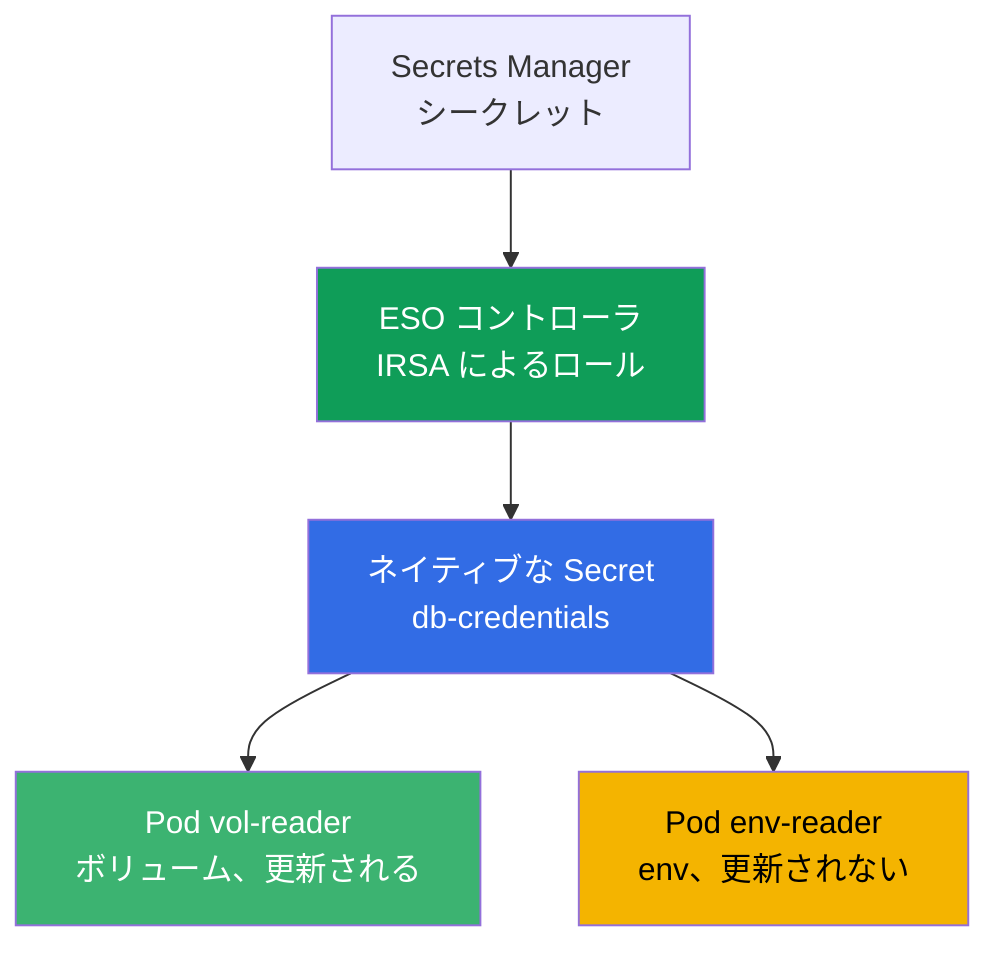
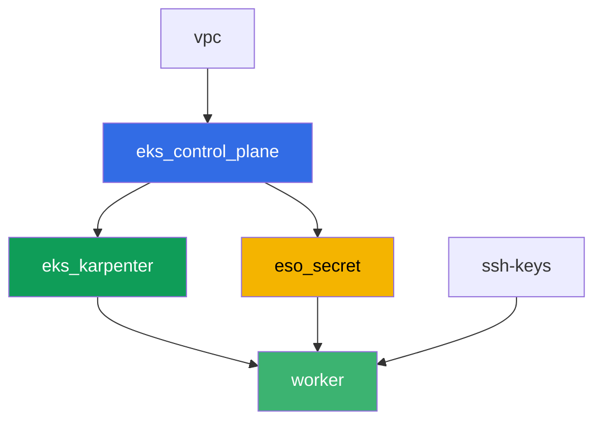

[Русская версия](README_RU.MD) · [Eng version](README.MD) · [Versión en español](README_ES.MD) · [Version française](README_FR.MD) · [Deutsche Version](README_DE.MD) · [ქართული ვერსია](README_GE.MD) · [繁體中文版](README_TW.MD)

# ラボ 105 - シークレット: KMS envelope encryption と External Secrets Operator

## 説明

アプリケーションはデータベースのパスワードを必要としますが、それをマニフェストや git に
保存したくはありません。このラボでは、EKS におけるシークレット保護の 2 つのレイヤーを
両方カバーします: control plane が etcd 内の `Secret` オブジェクトを KMS キーで暗号化して
いることを確認し(レイヤー 1、デフォルトで有効)、External Secrets Operator を設定します。
これは実際の AWS Secrets Manager からシークレットを読み取り、そこからネイティブな `Secret`
を作成します(レイヤー 2)。最後に、ローテーションの典型的な症状を再現します: シークレット
を保持するボリュームは自動的に更新されますが、同じシークレットを環境変数経由で読み取る
Pod は古い値のまま固まってしまいます。

タスクは production スタイルで書かれています: 短い課題文とアクセプタンス基準です。検証は
`check_result` コマンドによって自動的に行われます。

## 目的

コースの以下の章の内容を定着させます:

- [第 18 章。シークレット: KMS、Secrets Manager、External Secrets 経由の SSM](../../course/18/ru.md)

## 作成するもの

Terraform があらかじめ Secrets Manager のデモ用シークレットと ESO コントローラ用の IRSA
ロールを作成します(予測可能な名前付きです)。あなたは Helm 経由で ESO をインストールし、
ServiceAccount へのアノテーションでロールを結び付け、クラスターへのシークレットの配信を
設定します。

| オブジェクト | 何か | このラボでの目的 |
|--------|---------|-------------------|
| コンポーネント `eso_secret` | Secrets Manager のシークレット、ESO 用の IRSA ロール | AWS 側のリソースが用意済みで、シークレットへの権限も既に記述されている |
| Namespace `eks-105` | ラボの負荷用のクラスター区分 | ラボのリソースをシステムリソースから分離しておく |
| アーティファクト `encryption_config.txt` | `describe-cluster` の出力 | レイヤー 1 の確認: シークレットの KMS envelope encryption が有効であること |
| Release `external-secrets`(Helm) | IRSA によるロールを持つ ESO コントローラ | レイヤー 2: Secrets Manager からのシークレット読み取り |
| `SecretStore` `aws-sm` + `ExternalSecret` `db-credentials` | ストレージとの接続と同期ルール | ESO が AWS 上の値からネイティブな `Secret` を作成する |
| Pod `vol-reader` | ボリューム経由で `Secret` を読み取る | 値の更新に強い同期パス |
| Pod `env-reader` + アーティファクト `rotation.txt` | env 経由で `Secret` を読み取る、ローテーションの症状 | Pod を再作成しない限り env は更新されない |

AWS から Pod までのシークレットの経路:



## インフラストラクチャ

環境は Terragrunt によって AWS(`eu-central-1`)にデプロイされます。ベースはラボ 101 と
同じです(control plane、システム用の Pod 向け Fargate、負荷用の Karpenter)、プラス
シークレットと ESO コントローラの IRSA ロール用の別コンポーネントです。

### モジュールと依存関係

| ディレクトリ(コンポーネント) | モジュール(`terraform/modules/`) | 依存先 | 作成されるもの |
|---------------------|-------------------------------|------------|-------------|
| `vpc` | `vpc_v3` | - | VPC `10.10.0.0/16`、2 つの AZ にあるサブネット、NAT |
| `ssh-keys` | `ssh-keys` | - | ワーカーマシンとノード用の SSH キーペア |
| `eks_control_plane` | `eks_v2_control_plane` | `vpc` | EKS control plane `1.36`、OIDC プロバイダ |
| `eks_fargate_system` | `eks_v2_fargate` | `vpc`、`eks_control_plane` | `kube-system` と `karpenter` 用の Fargate profile |
| `eks_addons` | `eks_v2_addons` | `eks_control_plane`、`eks_fargate_system` | coredns、kube-proxy、vpc-cni、pod-identity |
| `eks_karpenter` | `eks_v2_karpenter` | `vpc`、`eks_control_plane`、`eks_addons`、`eks_fargate_system` | Karpenter コントローラ、ノードの IAM ロール |
| `eks_karpenter_default_vng` | `eks_v2_karpenter_vng` | `vpc`、`eks_control_plane`、`eks_karpenter` | AL2023 上のデフォルト NodePool `default` |
| `eso_secret` | `eks_v2_eso_irsa` | `eks_control_plane` | Secrets Manager のシークレット、ESO コントローラの IRSA ロール |
| `worker` | `eks_v2_work_pc` | `ssh-keys`、`vpc`、`eks_control_plane`、`eks_karpenter`、`eso_secret` | kubectl、テスト、`check_result` を備えたワーカーマシン |

コンポーネント `eso_secret` は、`external-secrets` namespace の SA `external-secrets` に
だけ結び付いた trust policy(第 16 章の `sub` 条件)を持つ IRSA ロールと、特定のデモ用
シークレットに対する `secretsmanager:GetSecretValue`/`DescribeSecret` を持つ inline policy
を作成します - まさにこのロールを、Helm 経由でのインストール時に ServiceAccount への
アノテーションで ESO コントローラに結び付けます。

依存関係グラフ(先に適用されるものほど矢印の下側にある):



コンポーネント `eks_fargate_system`、`eks_addons`、`eks_karpenter_default_vng` は、8 ノード
の上限のためグラフには表示されていませんが、実際には `eks_control_plane` と
`eks_karpenter` の間に位置します(上の表を参照)。

### 予測可能なリソース名

`eso_secret` は名前を `prefix` から組み立てるため、worker は terraform output を読まずに
それらを見つけられます。すべての名前はロード時にファイル `~/lab105_hints.txt` に書き込まれ
ています:

| リソース | 名前 |
|--------|-----|
| Secrets Manager secret | `eks-task105-eso-demo-secret` |
| ESO コントローラの IRSA ロール | `eks-task105-eso-irsa-role` |

### 何がどこで設定されているか

`env.hcl`(環境の共通パラメータ):

| パラメータ | ラボでの値 | 何に影響するか |
|----------|-----------------|---------------|
| `region` | `eu-central-1` | すべてのリソースのリージョン |
| `prefix` | `eks-task105` | シークレットとロールを含むリソース名のプレフィックス |
| `stack_name` | `eks105` | ここから `env_name`(クラスター名)が組み立てられる |
| `k8_version` | `1.36.0` | ワーカーマシンの kubectl のバージョン |

各コンポーネントの `terragrunt.hcl` の `inputs`:

| ファイル | 主な設定 |
|------|--------------------|
| `eso_secret/terragrunt.hcl` | `eso.namespace = "external-secrets"`、`eso.service_account_name = "external-secrets"`、`kms_key_arn = null`(デフォルトキー `aws/secretsmanager`) |
| `worker/terragrunt.hcl` | `test_url` と `task_script_url` はラボ 105 のファイルを指す、`eso_secret` への依存 |

## デプロイ

```bash
TASK=105 make run_eks_task
```

デプロイには約 15-20 分かかります。出力の中からワーカーマシンへの SSH 接続の行を見つけて
接続してください。そこでは kubectl が既に必要なクラスタ向けに設定されており、ラボの
リソースの名前と ARN はファイル `~/lab105_hints.txt` にあります。

ワーカーマシン上で使える便利なコマンド:

```bash
time_left       # 環境の残り時間
check_result    # 解答の確認
cat ~/lab105_hints.txt   # シークレットと IRSA ロールの名前と ARN
```

> 検証環境のセキュリティについて。`env.hcl` では `ssh_password_enable = true` と
> `access_cidrs = ["0.0.0.0/0"]` が有効になっています - 学習用環境としては便利ですが、
> 本番環境ではこのようにしてはいけません。コースの標準(第 0.2 章、第 2 章、第 19 章)
> によれば、ワーカーマシンへのアクセスは公開 SSH ポートを外に出さずに AWS SSM Session
> Manager を経由して開き、`access_cidrs` は具体的なアドレスに絞り込みます。ここでは、
> セットアップを簡単にするためだけに公開 SSH を残しています。

## タスク

---
|        **1**        | **ラボの負荷用の Namespace**                             |
| :-----------------: | :---------------------------------------------------------- |
| やること          | `eks-105` という名前の namespace を作成してください。ラボのすべてのオブジェクトはこの中に作成されます。 |
| アクセプタンス基準    | - namespace `eks-105` が存在すること。 |
---
|        **2**        | **レイヤー 1: KMS envelope encryption の確認**                 |
| :-----------------: | :---------------------------------------------------------- |
| やること          | `aws eks describe-cluster --name <cluster> --query 'cluster.encryptionConfig'`(クラスター名は `~/lab105_hints.txt` の `cluster_name`)を実行し、出力を `/var/work/tests/artifacts/2/encryption_config.txt` に保存してください。暗号化設定の中に値 `secrets` を持つ `resources` があることを確認してください - これは `Secret` オブジェクトが etcd への書き込み時に KMS キーで暗号化されていることを裏付けます(EKS 1.28 以降ではデフォルトで有効)。 |
| アクセプタンス基準    | - ファイル `2/encryption_config.txt` が空でなく、`resources` と `secrets` を含むこと。 |
---
|        **3**        | **External Secrets Operator の Helm によるインストール**           |
| :-----------------: | :---------------------------------------------------------- |
| やること          | リポジトリ `https://charts.external-secrets.io` を追加し、チャート `external-secrets` を namespace `external-secrets` にインストールしてください(フラグ `--create-namespace`)。インストール時に、アノテーションで IRSA ロール(ヒントの `role_arn`)を結び付けてください: `--set serviceAccount.annotations."eks\.amazonaws\.com/role-arn"=<role_arn>`。コントローラの Pod が `Running` になるまで待ってください。 |
| アクセプタンス基準    | - `external-secrets` の ESO Deployment に少なくとも 1 つの ready なレプリカがあること;<br/>- コントローラの ServiceAccount が `eso-irsa-role` を含む値を持つアノテーション `eks.amazonaws.com/role-arn` を持つこと。 |
---
|        **4**        | **SecretStore と ExternalSecret**                              |
| :-----------------: | :---------------------------------------------------------- |
| やること          | `eks-105` に `SecretStore` `aws-sm`(`provider.aws.service: SecretsManager`、`region: eu-central-1`)と、デモ用シークレット(ヒントの `secret_name`)を参照する `ExternalSecret` `db-credentials` を作成してください。フィールドは `password`、`target.name: db-credentials`、`refreshInterval` は小さめの値(例えば `1m`、タスク 6 で役立ちます)にしてください。ステータス `SecretSynced` を待ち、ネイティブな `Secret` `db-credentials` が正しいパスワード値で作成されたことを確認してください(`kubectl get secret ... -o jsonpath` と `base64 -d`)。 |
| アクセプタンス基準    | - `eks-105` の `ExternalSecret` `db-credentials` がステータス `SecretSynced` であること;<br/>- `Secret` `db-credentials` がパスワード `S3cr3tPass123` を含むこと。 |
---
|        **5**        | **ボリュームを使う Pod: 更新に強い同期パス**                |
| :-----------------: | :---------------------------------------------------------- |
| やること          | Pod `vol-reader`(イメージ `amazon/aws-cli:2.15.0`、コマンド `sleep 3600`)を作成し、`Secret` `db-credentials` をボリュームとしてマウントしてください(`volumeMount`、env ではありません)。ボリューム内のファイルからパスワードを読み取り、出力を `/var/work/tests/artifacts/5/volume_password.txt` に保存してください。 |
| アクセプタンス基準    | - Pod `vol-reader` が `Secret` `db-credentials` をボリュームとしてマウントしていること;<br/>- ファイル `5/volume_password.txt` が空でなく、`S3cr3tPass123` を含むこと。 |
---
|        **6**        | **env を使う Pod: シークレットを 2 度目に読み取る**                       |
| :-----------------: | :---------------------------------------------------------- |
| やること          | Pod `env-reader`(イメージ `amazon/aws-cli:2.15.0`、コマンド `sleep 3600`)を作成し、`Secret` `db-credentials` への `secretKeyRef` を持つ変数 `DB_PASSWORD` を設定してください。変数が Pod の中で見えることを確認してください(`kubectl exec env-reader -n eks-105 -- printenv DB_PASSWORD`)。 |
| アクセプタンス基準    | - Pod `env-reader` が `secretKeyRef` を経由して `Secret` `db-credentials` を変数 `DB_PASSWORD` として使用していること。 |
---
|        **7**        | **ローテーションの症状: env が更新されない**                       |
| :-----------------: | :---------------------------------------------------------- |
| やること          | Secrets Manager 上で直接シークレットの値を変更してください: `aws secretsmanager put-secret-value --secret-id <secret_name> --secret-string '{"username":"appuser","password":"RotatedPass456"}'`。`refreshInterval` プラス余裕を待ち、kubectl 経由で `Secret` を再確認してください - 値が更新され、ESO が再同期したことがわかります。次にタスク 6 の Pod `env-reader` を確認してください - env には古い値が見えています。`/var/work/tests/artifacts/7/rotation.txt` に、なぜ `Secret` は更新されたのに `env-reader` には古い値が見えるのかという説明を保存してください(`env` という単語と、Pod を再作成しない限り値が更新されないことに言及してください)。 |
| アクセプタンス基準    | - ファイル `7/rotation.txt` が空でなく、`env` と値が更新されないことの説明(英語マーカー: `does not update`)を含むこと。 |
---

## 結果の確認

ワーカーマシン上で自動チェックを実行してください:

```bash
check_result
```

スクリプトがテストを実行し、完了したタスクの割合を表示します。

## 解答

参考解答: [worker/files/solutions/1_JP.MD](worker/files/solutions/1_JP.MD)

## クラスターとリソースの削除

> **まずワークロードと ESO の Helm release を削除し、EC2 ノードが消えるのを待ってから、
> スタンドを削除してください。** ESO は terraform ではなく Helm で手動インストールされて
> いるため、`TASK=105 make delete_eks_task` はそれについて知りません。`eks-105` の Pod と
> ESO コントローラが生きたままクラスターを削除すると、Karpenter の EC2 ノードはクラスター
> と一緒に消えますが、VPC CNI のセカンダリ ENI が `available` 状態のまま残り、ノードの
> security group を保持し続けます - `destroy` が `module.eks.aws_security_group.node[0]:
> Still destroying...` で数十分止まってしまいます。

```bash
# 1. ラボの負荷と ESO を削除
kubectl delete namespace eks-105 --ignore-not-found
helm uninstall external-secrets -n external-secrets
kubectl delete namespace external-secrets --ignore-not-found

# 2. Karpenter が NodeClaim と EC2 ノードを削除するのを待つ(残るのは fargate-* のみ)
while kubectl get nodeclaims --no-headers 2>/dev/null | grep -q .; do
  echo "NodeClaim はまだ残っています、待機中..."; sleep 15
done
kubectl get nodes | grep -v fargate
```

これが完了してからスタンドを削除してください(Secrets Manager のシークレットと ESO の
IRSA ロールはコンポーネント `eso_secret` と一緒に消えます):

```bash
TASK=105 make delete_eks_task
```

それでも `destroy` がノードの security group で止まる場合は、孤立した ENI が残っている
ことになります。見つけて削除してください:

```bash
aws ec2 describe-network-interfaces --filters Name=status,Values=available \
  --query 'NetworkInterfaces[?Tags[?Key==`eks:eni:owner`]].[NetworkInterfaceId,Description]' \
  --output table
aws ec2 delete-network-interface --network-interface-id <eni-id>
```
