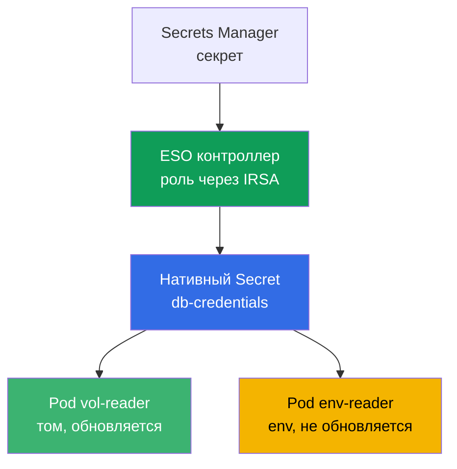
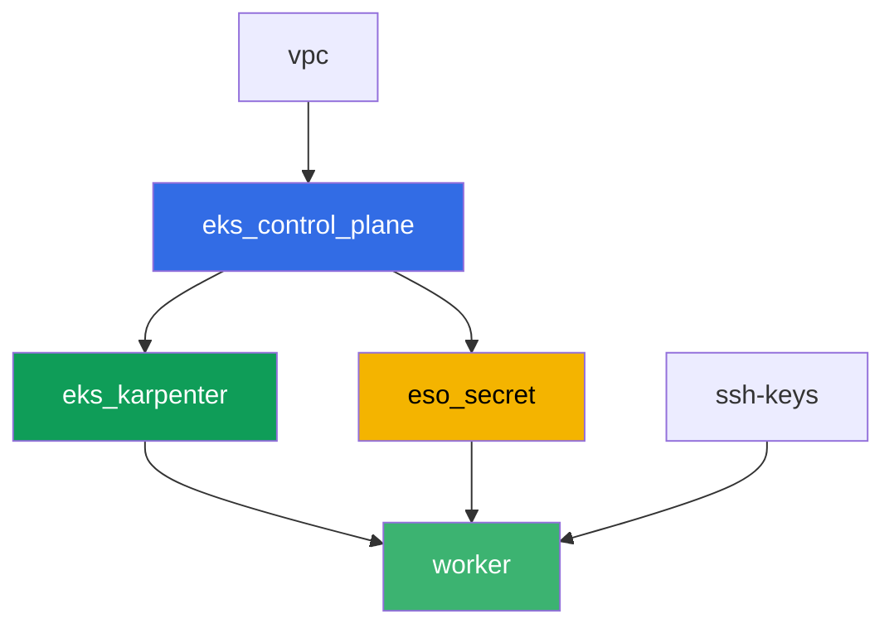

[Eng version](README.MD) · [Versión en español](README_ES.MD) · [Version française](README_FR.MD) · [Deutsche Version](README_DE.MD) · [ქართული ვერსია](README_GE.MD) · [繁體中文版](README_TW.MD) · [日本語版](README_JP.MD)

# Лаба 105 - Секреты: KMS envelope encryption и External Secrets Operator

## Описание

Приложению нужен пароль к базе, а хранить его в манифесте и в git не хочется. В этой лабе
вы закрываете оба слоя защиты секретов в EKS: проверяете, что control plane шифрует объекты
`Secret` в etcd ключом KMS (слой 1, включён по умолчанию), и настраиваете External Secrets
Operator, который читает секрет из настоящего AWS Secrets Manager и создаёт из него нативный
`Secret` (слой 2). В конце вы воспроизводите классический симптом ротации: том с секретом
обновляется сам, а под, читающий тот же секрет через переменную окружения, застревает со
старым значением.

Задания в продакшн-стиле: короткая постановка плюс критерии приёмки. Проверка -
автоматическая, командой `check_result`.

## Цель

Закрепить материал главы курса:

- [Глава 18. Секреты: KMS, Secrets Manager и SSM через External Secrets](../../course/18/ru.md)

## Что мы создаём

Terraform заранее создаёт демо-секрет Secrets Manager и роль IRSA для контроллера ESO
(с предсказуемыми именами). Вы ставите ESO через Helm, привязываете роль аннотацией на
ServiceAccount и настраиваете доставку секрета в кластер.

| Объект | Что это | Зачем в этой лабе |
|--------|---------|-------------------|
| Компонент `eso_secret` | секрет Secrets Manager, роль IRSA для ESO | готовые ресурсы AWS, права на секрет уже описаны |
| Namespace `eks-105` | раздел кластера под нагрузку лабы | держим ресурсы отдельно от системных |
| Артефакт `encryption_config.txt` | вывод `describe-cluster` | подтверждаем слой 1: KMS envelope encryption секретов включена |
| Release `external-secrets` (Helm) | контроллер ESO с ролью через IRSA | слой 2: чтение секрета из Secrets Manager |
| `SecretStore` `aws-sm` + `ExternalSecret` `db-credentials` | связь с хранилищем и правило синхронизации | ESO создаёт нативный `Secret` из значения в AWS |
| Pod `vol-reader` | читает `Secret` через том | путь синхронизации, устойчивый к обновлению значения |
| Pod `env-reader` + артефакт `rotation.txt` | читает `Secret` через env, симптом ротации | env не обновляется без пересоздания пода |

Путь секрета от AWS до пода:



## Инфраструктура

Окружение разворачивается в AWS (`eu-central-1`) через Terragrunt. База совпадает с лабой
101 (control plane, Fargate под системные поды, Karpenter под нагрузку), плюс отдельный
компонент под секрет и роль IRSA контроллера ESO.

### Модули и зависимости

| Каталог (компонент) | Модуль (`terraform/modules/`) | Зависит от | Что создаёт |
|---------------------|-------------------------------|------------|-------------|
| `vpc` | `vpc_v3` | - | VPC `10.10.0.0/16`, подсети в двух AZ, NAT |
| `ssh-keys` | `ssh-keys` | - | пара SSH-ключей для рабочей машины и нод |
| `eks_control_plane` | `eks_v2_control_plane` | `vpc` | control plane EKS `1.36`, OIDC-провайдер |
| `eks_fargate_system` | `eks_v2_fargate` | `vpc`, `eks_control_plane` | Fargate-профиль для `kube-system` и `karpenter` |
| `eks_addons` | `eks_v2_addons` | `eks_control_plane`, `eks_fargate_system` | coredns, kube-proxy, vpc-cni, pod-identity |
| `eks_karpenter` | `eks_v2_karpenter` | `vpc`, `eks_control_plane`, `eks_addons`, `eks_fargate_system` | контроллер Karpenter, IAM-роль нод |
| `eks_karpenter_default_vng` | `eks_v2_karpenter_vng` | `vpc`, `eks_control_plane`, `eks_karpenter` | дефолтный NodePool `default` на AL2023 |
| `eso_secret` | `eks_v2_eso_irsa` | `eks_control_plane` | секрет Secrets Manager, роль IRSA контроллера ESO |
| `worker` | `eks_v2_work_pc` | `ssh-keys`, `vpc`, `eks_control_plane`, `eks_karpenter`, `eso_secret` | рабочая машина с kubectl, тестами и `check_result` |

Компонент `eso_secret` создаёт роль IRSA с trust policy, привязанной ровно к SA
`external-secrets` в namespace `external-secrets` (условие `sub` из главы 16), и inline
policy с `secretsmanager:GetSecretValue`/`DescribeSecret` на конкретный демо-секрет - именно
эту роль вы прикрепите к контроллеру ESO аннотацией на ServiceAccount при установке через
Helm.

Граф зависимостей (что применяется раньше, то ниже по стрелке):



Компоненты `eks_fargate_system`, `eks_addons` и `eks_karpenter_default_vng` на графе не
показаны ради лимита в 8 узлов, но по факту стоят между `eks_control_plane` и
`eks_karpenter` (см. таблицу выше).

### Предсказуемые имена ресурсов

`eso_secret` собирает имена из `prefix`, поэтому worker находит их без чтения terraform
output. Все они на месте при загрузке в файле `~/lab105_hints.txt`:

| Ресурс | Имя |
|--------|-----|
| Secrets Manager secret | `eks-task105-eso-demo-secret` |
| Роль IRSA контроллера ESO | `eks-task105-eso-irsa-role` |

### Где что настраивается

`env.hcl` (общие параметры окружения):

| Параметр | Значение в лабе | На что влияет |
|----------|-----------------|---------------|
| `region` | `eu-central-1` | регион всех ресурсов |
| `prefix` | `eks-task105` | префикс имён ресурсов, включая секрет и роль |
| `stack_name` | `eks105` | из него собирается `env_name` - имя кластера |
| `k8_version` | `1.36.0` | версия kubectl на рабочей машине |

`inputs` в `terragrunt.hcl` каждого компонента:

| Файл | Ключевые настройки |
|------|--------------------|
| `eso_secret/terragrunt.hcl` | `eso.namespace = "external-secrets"`, `eso.service_account_name = "external-secrets"`, `kms_key_arn = null` (дефолтный ключ `aws/secretsmanager`) |
| `worker/terragrunt.hcl` | `test_url` и `task_script_url` на файлы лабы 105, зависимость от `eso_secret` |

## Развёртывание

```bash
TASK=105 make run_eks_task
```

Развёртывание занимает примерно 15-20 минут. В выводе найдите строку с SSH-подключением к
рабочей машине и подключитесь к ней. kubectl там уже настроен на нужный кластер, а имена и
ARN ресурсов лабы - в файле `~/lab105_hints.txt`.

Полезные команды на рабочей машине:

```bash
time_left       # сколько осталось времени окружения
check_result    # проверить решение
cat ~/lab105_hints.txt   # имена и ARN секрета и роли IRSA
```

> Безопасность стенда. В `env.hcl` включены `ssh_password_enable = true` и
> `access_cidrs = ["0.0.0.0/0"]` - это удобно для учебного окружения, но так делать в
> продакшене нельзя. По стандартам курса (главы 0.2, 2, 19) доступ к рабочим машинам
> открывают через AWS SSM Session Manager без публичных SSH-портов наружу, а `access_cidrs`
> сужают до конкретных адресов. Здесь публичный SSH оставлен только ради простоты запуска.

## Задания

---
|        **1**        | **Namespace для нагрузки лабы**                             |
| :-----------------: | :---------------------------------------------------------- |
| Что делаем          | Создайте namespace с именем `eks-105`. Все объекты лабы создаются внутри него. |
| Критерии приёмки    | - namespace `eks-105` существует. |
---
|        **2**        | **Слой 1: проверка KMS envelope encryption**                 |
| :-----------------: | :---------------------------------------------------------- |
| Что делаем          | Выполните `aws eks describe-cluster --name <cluster> --query 'cluster.encryptionConfig'` (имя кластера - `cluster_name` из `~/lab105_hints.txt`) и сохраните вывод в `/var/work/tests/artifacts/2/encryption_config.txt`. Убедитесь, что в конфигурации шифрования есть `resources` со значением `secrets` - это подтверждает, что объекты `Secret` шифруются ключом KMS при записи в etcd (на EKS 1.28+ включено по умолчанию). |
| Критерии приёмки    | - файл `2/encryption_config.txt` не пуст и содержит `resources` и `secrets`. |
---
|        **3**        | **Установка External Secrets Operator через Helm**           |
| :-----------------: | :---------------------------------------------------------- |
| Что делаем          | Добавьте репозиторий `https://charts.external-secrets.io` и установите чарт `external-secrets` в namespace `external-secrets` (флаг `--create-namespace`). При установке привяжите роль IRSA (`role_arn` из подсказки) аннотацией: `--set serviceAccount.annotations."eks\.amazonaws\.com/role-arn"=<role_arn>`. Дождитесь, что под контроллера `Running`. |
| Критерии приёмки    | - Deployment ESO в `external-secrets` имеет хотя бы одну готовую реплику;<br/>- ServiceAccount контроллера несёт аннотацию `eks.amazonaws.com/role-arn` со значением, содержащим `eso-irsa-role`. |
---
|        **4**        | **SecretStore и ExternalSecret**                              |
| :-----------------: | :---------------------------------------------------------- |
| Что делаем          | В `eks-105` создайте `SecretStore` `aws-sm` (`provider.aws.service: SecretsManager`, `region: eu-central-1`) и `ExternalSecret` `db-credentials`, ссылающийся на демо-секрет (`secret_name` из подсказки), поле `password`, `target.name: db-credentials`, `refreshInterval` небольшой (например `1m`, пригодится в задании 6). Дождитесь статуса `SecretSynced` и проверьте, что нативный `Secret` `db-credentials` появился с правильным значением пароля (`kubectl get secret ... -o jsonpath` плюс `base64 -d`). |
| Критерии приёмки    | - `ExternalSecret` `db-credentials` в `eks-105` в статусе `SecretSynced`;<br/>- `Secret` `db-credentials` содержит пароль `S3cr3tPass123`. |
---
|        **5**        | **Под с томом: устойчивый путь синхронизации**                |
| :-----------------: | :---------------------------------------------------------- |
| Что делаем          | Создайте Pod `vol-reader` (образ `amazon/aws-cli:2.15.0`, команда `sleep 3600`), который монтирует `Secret` `db-credentials` как том (`volumeMount`, НЕ env). Прочитайте пароль из файла в томе и сохраните вывод в `/var/work/tests/artifacts/5/volume_password.txt`. |
| Критерии приёмки    | - Pod `vol-reader` монтирует `Secret` `db-credentials` как том;<br/>- файл `5/volume_password.txt` не пуст и содержит `S3cr3tPass123`. |
---
|        **6**        | **Под с env: читаем секрет второй раз**                       |
| :-----------------: | :---------------------------------------------------------- |
| Что делаем          | Создайте Pod `env-reader` (образ `amazon/aws-cli:2.15.0`, команда `sleep 3600`) с переменной `DB_PASSWORD` через `secretKeyRef` на `Secret` `db-credentials`. Убедитесь, что переменная видна внутри пода (`kubectl exec env-reader -n eks-105 -- printenv DB_PASSWORD`). |
| Критерии приёмки    | - Pod `env-reader` использует `Secret` `db-credentials` через `secretKeyRef` на переменную `DB_PASSWORD`. |
---
|        **7**        | **Симптом ротации: env не обновляется**                       |
| :-----------------: | :---------------------------------------------------------- |
| Что делаем          | Измените значение секрета прямо в Secrets Manager: `aws secretsmanager put-secret-value --secret-id <secret_name> --secret-string '{"username":"appuser","password":"RotatedPass456"}'`. Подождите `refreshInterval` плюс запас и перепроверьте `Secret` через kubectl - значение обновится, ESO пересинхронизировал. Затем проверьте под `env-reader` из задания 6 - он видит старое значение в env. Сохраните объяснение в `/var/work/tests/artifacts/7/rotation.txt`: почему `Secret` обновился, а `env-reader` видит старое значение (упомяните слово `env` и что значение не обновляется без пересоздания пода). |
| Критерии приёмки    | - файл `7/rotation.txt` не пуст, содержит `env` и объяснение, что значение не обновляется. |
---

## Проверка результата

На рабочей машине запустите автоматическую проверку:

```bash
check_result
```

Скрипт прогонит тесты и покажет процент выполненных заданий.

## Решение

Эталонное решение: [worker/files/solutions/1_RU.MD](worker/files/solutions/1_RU.MD)

## Удаление кластера и ресурсов

> **Сначала снимите нагрузку и Helm-релиз ESO, дождитесь ухода EC2-нод, потом сносите
> стенд.** ESO поставлен вручную через Helm, а не terraform - `TASK=105 make
> delete_eks_task` про него не знает. Если удалить кластер, пока живы поды `eks-105` и
> контроллер ESO, EC2-нода Karpenter уходит вместе с кластером, а вторичный ENI от VPC CNI
> остаётся в состоянии `available` и держит security group нод - `destroy` зависает на
> `module.eks.aws_security_group.node[0]: Still destroying...` на десятки минут.

```bash
# 1. Снять нагрузку лабы и ESO
kubectl delete namespace eks-105 --ignore-not-found
helm uninstall external-secrets -n external-secrets
kubectl delete namespace external-secrets --ignore-not-found

# 2. Дождаться, пока Karpenter уберёт NodeClaim и EC2-ноду (останутся только fargate-*)
while kubectl get nodeclaims --no-headers 2>/dev/null | grep -q .; do
  echo "NodeClaim ещё жив, ждём..."; sleep 15
done
kubectl get nodes | grep -v fargate
```

Только после этого сносите стенд (секрет Secrets Manager и роль IRSA ESO уйдут вместе с
компонентом `eso_secret`):

```bash
TASK=105 make delete_eks_task
```

Если `destroy` всё же встал на security group нод, значит остался осиротевший ENI. Найдите
и удалите его:

```bash
aws ec2 describe-network-interfaces --filters Name=status,Values=available \
  --query 'NetworkInterfaces[?Tags[?Key==`eks:eni:owner`]].[NetworkInterfaceId,Description]' \
  --output table
aws ec2 delete-network-interface --network-interface-id <eni-id>
```
