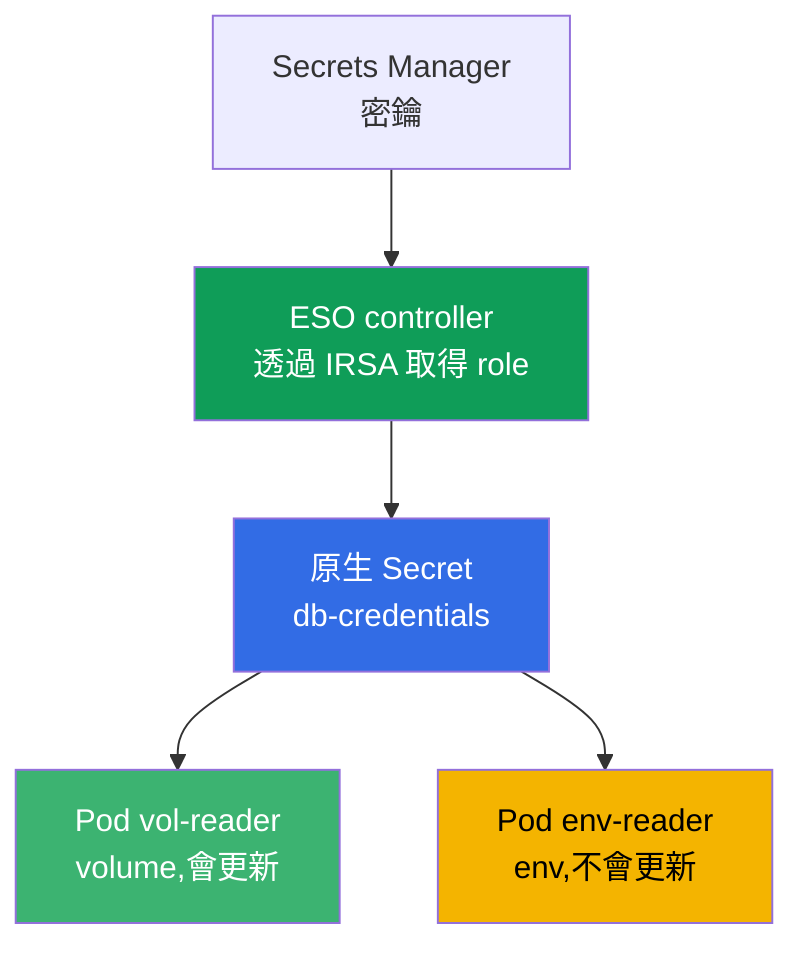
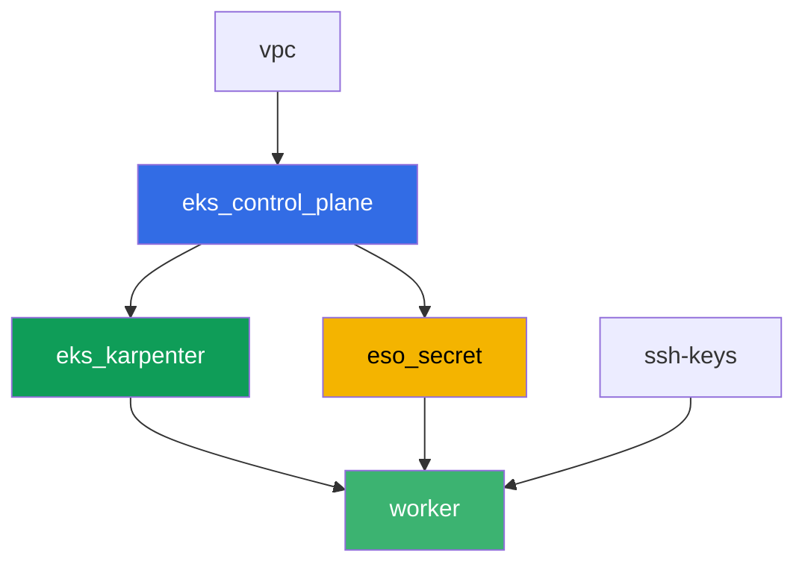

[Русская версия](README_RU.MD) · [Eng version](README.MD) · [Versión en español](README_ES.MD) · [Version française](README_FR.MD) · [Deutsche Version](README_DE.MD) · [ქართული ვერსია](README_GE.MD) · [日本語版](README_JP.MD)

# Lab 105 - 密鑰:KMS envelope encryption 與 External Secrets Operator

## 說明

應用程式需要一個資料庫密碼,把它存在 manifest 或 git 裡並不合適。在這個 lab 中,你要處理
EKS 中密鑰保護的兩個層次:確認 control plane 用 KMS 金鑰對 etcd 中的 `Secret` 物件進行加密
(第一層,預設已啟用),並設定 External Secrets Operator,它從真實的 AWS Secrets Manager
讀取密鑰,並據此建立一個原生 `Secret`(第二層)。最後你會重現輪換的經典症狀:掛載密鑰的
volume 會自動更新,而透過環境變數讀取同一密鑰的 pod 卻卡在舊的值上。

任務以 production 風格撰寫:一段簡短描述加上驗收標準。驗證是自動的,透過 `check_result`
命令進行。

## 目標

鞏固課程以下章節的內容:

- [第 18 章。密鑰:KMS、Secrets Manager 以及透過 External Secrets 的 SSM](../../course/18/tw.md)

## 我們要建立的內容

Terraform 預先建立了 Secrets Manager 的示範密鑰,以及 ESO controller 用的 IRSA role
(名稱可預測)。你透過 Helm 安裝 ESO,用 ServiceAccount 上的註解綁定這個 role,並設定密鑰
送達叢集的流程。

| 物件 | 是什麼 | 在這個 lab 中的作用 |
|--------|---------|-------------------|
| 元件 `eso_secret` | Secrets Manager 的密鑰、ESO 用的 IRSA role | 已就緒的 AWS 資源,對密鑰的權限已經描述好 |
| Namespace `eks-105` | lab 負載用的叢集區段 | 讓資源與系統資源分開 |
| 產物 `encryption_config.txt` | `describe-cluster` 的輸出 | 確認第一層:密鑰的 KMS envelope encryption 已啟用 |
| Release `external-secrets`(Helm) | 帶有透過 IRSA 取得 role 的 ESO controller | 第二層:從 Secrets Manager 讀取密鑰 |
| `SecretStore` `aws-sm` + `ExternalSecret` `db-credentials` | 與儲存端的連結,以及同步規則 | ESO 根據 AWS 中的值建立原生 `Secret` |
| Pod `vol-reader` | 透過 volume 讀取 `Secret` | 對值更新有韌性的同步路徑 |
| Pod `env-reader` + 產物 `rotation.txt` | 透過 env 讀取 `Secret`,輪換症狀 | 不重建 pod,env 就不會更新 |

密鑰從 AWS 到 pod 的路徑:



## 基礎架構

環境透過 Terragrunt 部署在 AWS(`eu-central-1`)上。基礎與 lab 101 相同(control plane、
系統 pod 用的 Fargate、負載用的 Karpenter),再加上一個獨立元件,用於密鑰和 ESO
controller 的 IRSA role。

### 模組與依賴關係

| 目錄(元件) | 模組(`terraform/modules/`) | 依賴於 | 建立內容 |
|---------------------|-------------------------------|------------|-------------|
| `vpc` | `vpc_v3` | - | VPC `10.10.0.0/16`,兩個 AZ 的子網,NAT |
| `ssh-keys` | `ssh-keys` | - | worker 機器與節點用的 SSH 金鑰對 |
| `eks_control_plane` | `eks_v2_control_plane` | `vpc` | EKS control plane `1.36`,OIDC provider |
| `eks_fargate_system` | `eks_v2_fargate` | `vpc`, `eks_control_plane` | `kube-system` 與 `karpenter` 的 Fargate profile |
| `eks_addons` | `eks_v2_addons` | `eks_control_plane`, `eks_fargate_system` | coredns、kube-proxy、vpc-cni、pod-identity |
| `eks_karpenter` | `eks_v2_karpenter` | `vpc`, `eks_control_plane`, `eks_addons`, `eks_fargate_system` | Karpenter controller,節點的 IAM role |
| `eks_karpenter_default_vng` | `eks_v2_karpenter_vng` | `vpc`, `eks_control_plane`, `eks_karpenter` | AL2023 上的預設 NodePool `default` |
| `eso_secret` | `eks_v2_eso_irsa` | `eks_control_plane` | Secrets Manager 的密鑰、ESO controller 的 IRSA role |
| `worker` | `eks_v2_work_pc` | `ssh-keys`, `vpc`, `eks_control_plane`, `eks_karpenter`, `eso_secret` | 帶有 kubectl、測試與 `check_result` 的 worker 機器 |

元件 `eso_secret` 建立一個 IRSA role,其 trust policy 精確地信任 `external-secrets`
namespace 中的 SA `external-secrets`(第 16 章的 `sub` 條件),還帶有一個 inline policy,
包含針對具體示範密鑰的 `secretsmanager:GetSecretValue`/`DescribeSecret` - 正是這個 role,
你會在透過 Helm 安裝時,用 ServiceAccount 上的註解把它附加給 ESO controller。

依賴關係圖(先套用的元件在箭頭下方):



元件 `eks_fargate_system`、`eks_addons` 與 `eks_karpenter_default_vng` 因為 8 個節點的
限制沒有在圖上顯示,但實際上位於 `eks_control_plane` 與 `eks_karpenter` 之間(見上表)。

### 可預測的資源名稱

`eso_secret` 根據 `prefix` 組裝名稱,因此 worker 不需要讀取 terraform output 就能找到它們。
登入時,所有這些名稱都在檔案 `~/lab105_hints.txt` 中:

| 資源 | 名稱 |
|--------|-----|
| Secrets Manager secret | `eks-task105-eso-demo-secret` |
| ESO controller 的 IRSA role | `eks-task105-eso-irsa-role` |

### 各項設定的位置

`env.hcl`(共用的環境參數):

| 參數 | lab 中的值 | 影響什麼 |
|----------|-----------------|---------------|
| `region` | `eu-central-1` | 所有資源的區域 |
| `prefix` | `eks-task105` | 資源名稱的前綴,包括密鑰與 role |
| `stack_name` | `eks105` | 由此組成 `env_name` - 叢集名稱 |
| `k8_version` | `1.36.0` | worker 機器上的 kubectl 版本 |

每個元件 `terragrunt.hcl` 中的 `inputs`:

| 檔案 | 主要設定 |
|------|--------------------|
| `eso_secret/terragrunt.hcl` | `eso.namespace = "external-secrets"`、`eso.service_account_name = "external-secrets"`、`kms_key_arn = null`(預設金鑰 `aws/secretsmanager`) |
| `worker/terragrunt.hcl` | 指向 lab 105 檔案的 `test_url` 與 `task_script_url`,依賴於 `eso_secret` |

## 部署

```bash
TASK=105 make run_eks_task
```

部署大約需要 15-20 分鐘。在輸出中找到連往 worker 機器的 SSH 連線那一行並連上去。那裡的
kubectl 已經設定好指向正確的叢集,而 lab 資源的名稱與 ARN 都在檔案 `~/lab105_hints.txt`
中。

worker 機器上的實用命令:

```bash
time_left       # 環境剩餘時間
check_result    # 檢查解答
cat ~/lab105_hints.txt   # 密鑰與 IRSA role 的名稱與 ARN
```

> 測試環境的安全性。`env.hcl` 中啟用了 `ssh_password_enable = true` 和
> `access_cidrs = ["0.0.0.0/0"]` - 這對訓練環境很方便,但在 production 中不應該這麼做。
> 依照課程標準(第 0.2、2、19 章),對 worker 機器的存取應該透過 AWS SSM Session Manager
> 開放,不對外暴露公開的 SSH port,而 `access_cidrs` 應該縮小到具體的位址。這裡保留公開 SSH
> 只是為了簡化啟動流程。

## 任務

---
|        **1**        | **lab 負載用的 Namespace**                             |
| :-----------------: | :---------------------------------------------------------- |
| 要做什麼          | 建立一個名為 `eks-105` 的 namespace。lab 的所有物件都在其中建立。 |
| 驗收標準    | - namespace `eks-105` 存在。 |
---
|        **2**        | **第一層:檢查 KMS envelope encryption**                 |
| :-----------------: | :---------------------------------------------------------- |
| 要做什麼          | 執行 `aws eks describe-cluster --name <cluster> --query 'cluster.encryptionConfig'`(叢集名稱是 `~/lab105_hints.txt` 中的 `cluster_name`),並把輸出存到 `/var/work/tests/artifacts/2/encryption_config.txt`。確認加密設定中有 `resources`,其值為 `secrets` - 這確認了 `Secret` 物件在寫入 etcd 時是用 KMS 金鑰加密的(在 EKS 1.28+ 上預設啟用)。 |
| 驗收標準    | - 檔案 `2/encryption_config.txt` 不為空,且包含 `resources` 與 `secrets`。 |
---
|        **3**        | **透過 Helm 安裝 External Secrets Operator**           |
| :-----------------: | :---------------------------------------------------------- |
| 要做什麼          | 加入 repository `https://charts.external-secrets.io`,並把 chart `external-secrets` 安裝到 `external-secrets` namespace 中(帶上 `--create-namespace` flag)。安裝時,用一個註解綁定 IRSA role(提示檔案中的 `role_arn`):`--set serviceAccount.annotations."eks\.amazonaws\.com/role-arn"=<role_arn>`。等到 controller 的 pod 變成 `Running`。 |
| 驗收標準    | - `external-secrets` 中的 ESO Deployment 至少有一個 ready replica;<br/>- controller 的 ServiceAccount 帶有註解 `eks.amazonaws.com/role-arn`,其值包含 `eso-irsa-role`。 |
---
|        **4**        | **SecretStore 與 ExternalSecret**                              |
| :-----------------: | :---------------------------------------------------------- |
| 要做什麼          | 在 `eks-105` 中建立 `SecretStore` `aws-sm`(`provider.aws.service: SecretsManager`、`region: eu-central-1`),以及一個引用示範密鑰(提示檔案中的 `secret_name`)的 `ExternalSecret` `db-credentials`,欄位 `password`、`target.name: db-credentials`、`refreshInterval` 設小一點(例如 `1m`,在任務 6 會用到)。等待 `SecretSynced` 狀態,並確認原生 `Secret` `db-credentials` 已出現且密碼值正確(`kubectl get secret ... -o jsonpath` 加上 `base64 -d`)。 |
| 驗收標準    | - `eks-105` 中的 `ExternalSecret` `db-credentials` 處於 `SecretSynced` 狀態;<br/>- `Secret` `db-credentials` 包含密碼 `S3cr3tPass123`。 |
---
|        **5**        | **帶 volume 的 Pod:有韌性的同步路徑**                |
| :-----------------: | :---------------------------------------------------------- |
| 要做什麼          | 建立 Pod `vol-reader`(image `amazon/aws-cli:2.15.0`,command `sleep 3600`),把 `Secret` `db-credentials` 掛載為 volume(`volumeMount`,不是 env)。從 volume 中的檔案讀取密碼,並把輸出存到 `/var/work/tests/artifacts/5/volume_password.txt`。 |
| 驗收標準    | - Pod `vol-reader` 將 `Secret` `db-credentials` 掛載為 volume;<br/>- 檔案 `5/volume_password.txt` 不為空,且包含 `S3cr3tPass123`。 |
---
|        **6**        | **帶 env 的 Pod:第二種方式讀取密鑰**                       |
| :-----------------: | :---------------------------------------------------------- |
| 要做什麼          | 建立 Pod `env-reader`(image `amazon/aws-cli:2.15.0`,command `sleep 3600`),透過 `secretKeyRef` 引用 `Secret` `db-credentials` 設定變數 `DB_PASSWORD`。確認在 pod 內部可以看到這個變數(`kubectl exec env-reader -n eks-105 -- printenv DB_PASSWORD`)。 |
| 驗收標準    | - Pod `env-reader` 透過 `secretKeyRef` 使用 `Secret` `db-credentials` 作為變數 `DB_PASSWORD`。 |
---
|        **7**        | **輪換症狀:env 不會更新**                       |
| :-----------------: | :---------------------------------------------------------- |
| 要做什麼          | 直接在 Secrets Manager 中修改密鑰的值:`aws secretsmanager put-secret-value --secret-id <secret_name> --secret-string '{"username":"appuser","password":"RotatedPass456"}'`。等待 `refreshInterval` 加上一些餘量,再透過 kubectl 重新檢查 `Secret` - 值會更新,ESO 已經重新同步過了。接著檢查任務 6 中的 `env-reader` pod - 它在 env 中看到的還是舊值。把解釋存到 `/var/work/tests/artifacts/7/rotation.txt`:為什麼 `Secret` 更新了,而 `env-reader` 看到的是舊值(提到 `env` 這個詞,以及不重建 pod 值就不會更新)。 |
| 驗收標準    | - 檔案 `7/rotation.txt` 不為空,包含 `env` 以及值不會更新的解釋(英文標記:`does not update`)。 |
---

## 檢查結果

在 worker 機器上執行自動檢查:

```bash
check_result
```

腳本會執行測試,並顯示已完成任務的百分比。

## 解答

參考解答:[worker/files/solutions/1_TW.MD](worker/files/solutions/1_TW.MD)

## 刪除叢集與資源

> **先移除負載和 ESO 的 Helm release,等 EC2 節點消失後,再拆除環境。** ESO 是透過 Helm
> 手動安裝的,不是用 terraform 裝的 - `TASK=105 make delete_eks_task` 對它一無所知。如果在
> `eks-105` 的 pod 和 ESO controller 還活著時就刪除叢集,Karpenter 的 EC2 節點會跟著叢集
> 一起消失,而 VPC CNI 的次要 ENI 會停留在 `available` 狀態,並繼續佔用節點的 security
> group - `destroy` 會卡在 `module.eks.aws_security_group.node[0]: Still destroying...`
> 上長達幾十分鐘。

```bash
# 1. 移除 lab 負載和 ESO
kubectl delete namespace eks-105 --ignore-not-found
helm uninstall external-secrets -n external-secrets
kubectl delete namespace external-secrets --ignore-not-found

# 2. 等待 Karpenter 移除 NodeClaim 和 EC2 節點(只應剩下 fargate-*)
while kubectl get nodeclaims --no-headers 2>/dev/null | grep -q .; do
  echo "NodeClaim 還活著,等待中..."; sleep 15
done
kubectl get nodes | grep -v fargate
```

只有這之後,才能拆除環境(Secrets Manager 的密鑰與 ESO 的 IRSA role 會跟著元件
`eso_secret` 一起消失):

```bash
TASK=105 make delete_eks_task
```

如果 `destroy` 還是卡在節點的 security group 上,說明留下了一個孤立的 ENI。找到並刪除它:

```bash
aws ec2 describe-network-interfaces --filters Name=status,Values=available \
  --query 'NetworkInterfaces[?Tags[?Key==`eks:eni:owner`]].[NetworkInterfaceId,Description]' \
  --output table
aws ec2 delete-network-interface --network-interface-id <eni-id>
```
