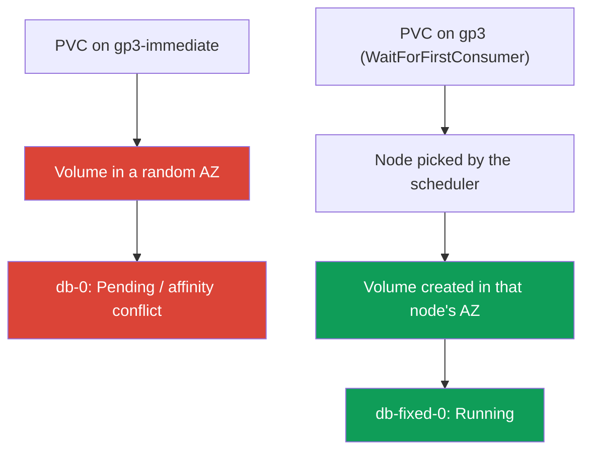
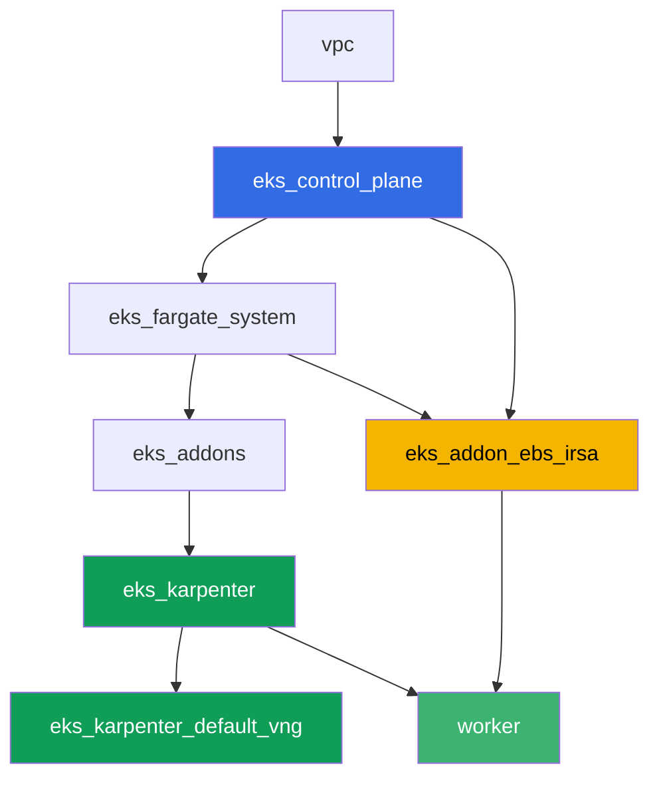

[Русская версия](README_RU.MD) · [Versión en español](README_ES.MD) · [Version française](README_FR.MD) · [Deutsche Version](README_DE.MD) · [ქართული ვერსია](README_GE.MD) · [繁體中文版](README_TW.MD) · [日本語版](README_JP.MD)

# Lab 106 - EBS CSI: gp3, AZ binding, expansion, snapshot

## Description

A lab about EBS block storage in EKS and a classic mistake almost everyone hits when
moving a StatefulSet to a fresh cluster: the pod sits in `Pending` even though the PVC is
already created and the PV already exists. The cause is `volumeBindingMode: Immediate` on
the StorageClass, which makes the EBS volume get created in a random availability zone
before the scheduler has decided where the pod will land. You'll reproduce this symptom,
diagnose it via `kubectl describe pod` and the volume's `nodeAffinity`, and then fix it
with `volumeBindingMode: WaitForFirstConsumer`. After that comes on-the-fly volume
expansion and a snapshot with restore.

Tasks are written in a production style: a short statement plus acceptance criteria.
Checking is automatic, via the `check_result` command.

## Goal

Reinforce the material from these course chapters:

- [Chapter 23. EBS CSI: gp3, StorageClass, expansion, snapshots, AZ binding](../../course/23/ru.md) - the core material for this lab
- [Chapter 9. Compute types: managed node groups, Fargate, Auto Mode](../../course/09/ru.md) - why the cluster has two AZs and where nodes live
- [Chapter 12. Karpenter: NodePool, consolidation, disruption](../../course/12/ru.md) - why consolidation doesn't move a pod between AZs once it has a volume
- [Chapters 16-17. IRSA and Pod Identity](../../course/16/ru.md) - how the driver gets permission for `CreateVolume`/`CreateSnapshot`

## What we're creating

| Object | What it is | Why it's in this lab |
|--------|---------|-------------------|
| Namespace `eks-106` | a cluster section for the lab's workload | keeps resources separate (chapter 4) |
| StorageClass `gp3-immediate` | a class with `volumeBindingMode: Immediate` | catches the symptom: a volume in a random AZ (chapter 23) |
| StatefulSet `db` (1 replica, `5Gi` volume) | workload on the broken class | reproduces `Pending`/`nodeAffinity` conflict (chapter 23) |
| Artifact `diagnosis.txt` | `describe pod` and `pv -o yaml` output plus an explanation | records the difference between "got lucky" and "guaranteed to work" |
| StorageClass `gp3` | a class with `volumeBindingMode: WaitForFirstConsumer` | the correct provisioning mode for EBS (chapter 23) |
| StatefulSet `db-fixed` | the same workload on the fixed class | pod `Running`, volume zone matches node zone (chapter 23) |
| PVC expansion to `10Gi` | `kubectl patch pvc` | learn to expand `gp3` without recreating the pod (chapter 23) |
| `VolumeSnapshot` and a restored PVC | a volume snapshot and a new PVC created from it | see that the snapshot is regional, but the restored volume is zonal again (chapter 23) |

The path from symptom to fix:



## Infrastructure

The environment is deployed in AWS (`eu-central-1`) via Terragrunt. Each lab directory is
one component with its own `terragrunt.hcl`, which references a shared module in
`terraform/modules/` and declares dependencies through `dependency` blocks. Terragrunt
builds a dependency graph and applies the components in the right order. The base is the
same as in lab 101 (control plane, Fargate for system pods, Karpenter for the workload),
plus a separate component for EBS CSI.

### Modules and dependencies

| Directory (component) | Module (`terraform/modules/`) | Depends on | What it creates |
|---------------------|-------------------------------|------------|-------------|
| `vpc` | `vpc_v3` | - | VPC `10.10.0.0/16`, subnets in two AZs (`eu-central-1a`, `eu-central-1b`), NAT |
| `ssh-keys` | `ssh-keys` | - | an SSH key pair for the worker machine and nodes |
| `eks_control_plane` | `eks_v2_control_plane` | `vpc` | EKS control plane `1.36`, OIDC, security groups |
| `eks_fargate_system` | `eks_v2_fargate` | `vpc`, `eks_control_plane` | Fargate profile for `kube-system` and `karpenter` |
| `eks_addons` | `eks_v2_addons` | `eks_control_plane`, `eks_fargate_system` | coredns, kube-proxy, vpc-cni, pod-identity, `snapshot-controller` |
| `eks_karpenter` | `eks_v2_karpenter` | `vpc`, `eks_control_plane`, `eks_addons`, `eks_fargate_system` | Karpenter controller, node IAM role |
| `eks_karpenter_default_vng` | `eks_v2_karpenter_vng` | `vpc`, `eks_control_plane`, `eks_karpenter` | default NodePool `default` on AL2023 |
| `eks_addon_ebs_irsa` | `eks_v2_ebs_irsa` | `eks_fargate_system`, `eks_control_plane` | managed addon `aws-ebs-csi-driver` and an IAM role via IRSA |
| `worker` | `eks_v2_work_pc` | `ssh-keys`, `vpc`, `eks_control_plane`, `eks_karpenter`, `eks_addon_ebs_irsa` | worker machine with kubectl, tests, and `check_result` |

The role for the EBS driver is already set up by the `eks_addon_ebs_irsa` component via
IRSA (chapters 16-17): there's no need to create it again in the tasks, the driver is
ready by the time you create your first PVC (`worker` depends on `eks_addon_ebs_irsa`).

Dependency graph (what gets applied earlier is lower down the arrow):



The cluster is brought up in two AZs - this matters for the lab's main scenario: with
`volumeBindingMode: Immediate` across two zones there's a real risk that the volume gets
created somewhere other than where a free node ends up being.

### Where things are configured

`env.hcl` (shared environment parameters, read by all components):

| Parameter | Value in the lab | What it affects |
|----------|-----------------|---------------|
| `region` | `eu-central-1` | region for all resources |
| `subnets` | private `eks1`/`eks2` in `eu-central-1a`/`eu-central-1b` | zones where Karpenter can bring up a node |
| `prefix` | `eks-task106` | prefix for resource names and tags |
| `stack_name` | `eks106` | used to build `env_name` - the cluster name |
| `k8_version` | `1.36.0` | kubectl version on the worker machine |

`inputs` in each component's `terragrunt.hcl` (settings specific to that module):

| File | Key settings |
|------|--------------------|
| `eks_addons/terragrunt.hcl` | besides the base add-ons, `snapshot-controller` is added (CRDs and controller for `VolumeSnapshot`) |
| `eks_addon_ebs_irsa/terragrunt.hcl` | managed addon `aws-ebs-csi-driver`, a role via IRSA on the cluster's `oidc_provider_arn` |
| `worker/terragrunt.hcl` | `test_url` and `task_script_url` for the lab 106 files, dependency on `eks_addon_ebs_irsa` |

## Deployment

```bash
TASK=106 make run_eks_task
```

Deployment takes roughly 15-20 minutes. In the output, find the line with the SSH
connection to the worker machine and connect to it. kubectl there is already configured
for the right cluster, and the EBS CSI driver is already installed and ready to accept
PVCs. The cluster starts with zero EC2 nodes (Fargate only), so before you start the
tasks the worker machine warms up exactly one EC2 node with a helper pod in namespace
`ebs-csi-warmup` - without it the CSI driver can't determine the volume's zone for
`volumeBindingMode: Immediate` (task 3), and Karpenter won't bring up a node for a pod
with an unbound Immediate PVC. Namespace `ebs-csi-warmup` isn't part of the lab's tasks,
leave it alone.

Useful commands on the worker machine:

```bash
time_left       # how much environment time is left
check_result    # check the solution
```

> Environment security. `env.hcl` has `ssh_password_enable = true` and
> `access_cidrs = ["0.0.0.0/0"]` enabled - convenient for a training environment, but this
> is not something to do in production. Per the course standards (chapters 0.2, 2, 19),
> access to worker machines should go through AWS SSM Session Manager without exposing
> public SSH ports, and `access_cidrs` should be narrowed down to specific addresses. Here
> public SSH is left in place only to keep the setup simple.

## Tasks

---
|        **1**        | **Namespace for the lab's workload**                             |
| :-----------------: | :---------------------------------------------------------- |
| What to do          | Create a namespace named `eks-106`. All objects in this lab are created inside it. |
| Acceptance criteria    | - namespace `eks-106` exists. |
---
|        **2**        | **StorageClass with a broken binding mode**              |
| :-----------------: | :---------------------------------------------------------- |
| What to do          | Create StorageClass `gp3-immediate`: `provisioner: ebs.csi.aws.com`, `volumeBindingMode: Immediate`, `allowVolumeExpansion: true`, `parameters.type: gp3`, `parameters.encrypted: "true"`. |
| Acceptance criteria    | - StorageClass `gp3-immediate` exists;<br/>- `provisioner: ebs.csi.aws.com`;<br/>- `volumeBindingMode: Immediate`. |
---
|        **3**        | **StatefulSet on the broken class (reproducing the symptom)** |
| :-----------------: | :---------------------------------------------------------- |
| What to do          | In `eks-106`, create StatefulSet `db`, image `viktoruj/ping_pong:latest`, `1` replica, `volumeClaimTemplates` named `data` on StorageClass `gp3-immediate`, requesting `5Gi`. Watch `db-0`: with `Immediate`, the volume is created right after the PVC appears, in a random one of the cluster's two AZs, before it's known where the scheduler will place the pod. In a two-zone cluster the pod may stay `Pending` (a `nodeAffinity` conflict on the volume), or, if the volume happened to land in the same zone as a free node, it may go `Running`. Either outcome is fine at this step - the diagnosis in task 4 is required either way. |
| Acceptance criteria    | - StatefulSet `db` in `eks-106`, image `viktoruj/ping_pong`;<br/>- `volumeClaimTemplates` on class `gp3-immediate`, requesting `5Gi`;<br/>- PVC `data-db-0` is created. |
---
|        **4**        | **Diagnosis: Immediate versus zone binding**           |
| :-----------------: | :---------------------------------------------------------- |
| What to do          | Work out what happened to the `db-0` volume, regardless of whether it's `Pending` or `Running`. Save `kubectl describe pod db-0 -n eks-106` (the `Events` section) to `/var/work/tests/artifacts/4/describe.txt` and `kubectl get pv <pv> -o yaml` (the volume for PVC `data-db-0`) to `/var/work/tests/artifacts/4/pv.yaml`. In file `/var/work/tests/artifacts/4/diagnosis.txt` write an explanation: why `volumeBindingMode: Immediate` creates the volume before the pod's zone is known, what the volume's `nodeAffinity` with key `topology.ebs.csi.aws.com/zone` means, and why `Running` in a two-AZ cluster is "got lucky" rather than "guaranteed to work". The text must contain the words `Immediate`, `nodeAffinity`, and `zone`. |
| Acceptance criteria    | - file `describe.txt` is not empty;<br/>- file `pv.yaml` is not empty;<br/>- file `diagnosis.txt` is not empty and contains `Immediate`, `nodeAffinity`, `zone`. |
---
|        **5**        | **The fix: WaitForFirstConsumer**                            |
| :-----------------: | :---------------------------------------------------------- |
| What to do          | A PVC binds to its StorageClass once, so the fix requires a new class and a new StatefulSet, not a patch to `gp3-immediate`. Create StorageClass `gp3`: `provisioner: ebs.csi.aws.com`, `volumeBindingMode: WaitForFirstConsumer`, `allowVolumeExpansion: true`, `parameters.type: gp3`, `parameters.encrypted: "true"`. Create StatefulSet `db-fixed` (same image, `1` replica) with `volumeClaimTemplates` on class `gp3`, requesting `5Gi`. Wait for `db-fixed-0` to go `Running`, and confirm that the volume's zone (PV `nodeAffinity`) matches the pod's node zone (`topology.kubernetes.io/zone`). |
| Acceptance criteria    | - StorageClass `gp3` with `volumeBindingMode: WaitForFirstConsumer` and `allowVolumeExpansion: true`;<br/>- pod `db-fixed-0` is `Running`;<br/>- the PV's zone from `nodeAffinity` matches the pod's node zone. |
---
|        **6**        | **Expanding a volume on the fly**                                  |
| :-----------------: | :---------------------------------------------------------- |
| What to do          | Increase PVC `data-db-fixed-0` from `5Gi` to `10Gi` via `kubectl patch pvc`. Wait until `status.capacity.storage` confirms the new size. |
| Acceptance criteria    | - `spec.resources.requests.storage` of PVC `data-db-fixed-0` equals `10Gi`;<br/>- `status.capacity.storage` equals `10Gi`. |
---
|        **7**        | **Volume snapshot and restore**                            |
| :-----------------: | :---------------------------------------------------------- |
| What to do          | Create a `VolumeSnapshotClass` (`driver: ebs.csi.aws.com`) and a `VolumeSnapshot` `db-snap` in `eks-106` referencing PVC `data-db-fixed-0` (`spec.source.persistentVolumeClaimName`). Wait for `readyToUse: true`. Create a new PVC `data-restored` on class `gp3` with `dataSource.kind: VolumeSnapshot`, `dataSource.name: db-snap`, `dataSource.apiGroup: snapshot.storage.k8s.io`. An EBS snapshot is a regional object, but the volume restored from it is zonal again: with the `WaitForFirstConsumer` class, PVC `data-restored` will stay `Pending` until a pod references it, and that's expected. |
| Acceptance criteria    | - `VolumeSnapshot` `db-snap` references PVC `data-db-fixed-0`;<br/>- PVC `data-restored` has `dataSource.kind: VolumeSnapshot`, `dataSource.name: db-snap`. |
---

## Checking the result

On the worker machine, run the automatic check:

```bash
check_result
```

The script will run the tests and show the percentage of completed tasks.

## Solution

Reference solution: [worker/files/solutions/1.MD](worker/files/solutions/1.MD)

## Deleting the cluster and resources

> **Delete PVCs and snapshots first, then the cluster.** EBS volumes behind dynamic PVCs
> are created by the EBS CSI driver, and it's also the one that deletes them - when the
> PVC is deleted (with `reclaimPolicy: Delete`). If you tear down the cluster while PVCs
> are still alive, the driver is gone too, and the volumes stay in the account as
> `available` forever, still being billed: terraform doesn't know about them. Same story
> with `VolumeSnapshot` - behind it sits an EBS snapshot, which the CSI driver deletes.
>
> **The order of deleting the snapshot matters.** PVC `data-restored` was restored from
> `db-snap`, and as long as that PVC exists, the snapshot carries the finalizer
> `snapshot.storage.kubernetes.io/volumesnapshot-as-source-protection` - `db-snap` will
> only reach `Terminating` and go no further. Symmetrically, the source PVC
> `data-db-fixed-0` carries `pvc-as-source-protection` while the snapshot is alive. If you
> delete the whole namespace and immediately run `destroy`, the EBS snapshot will outlive
> the cluster and stay in the account (confirmed on a live environment: after running the
> lab, a 10 GiB snapshot was found in the region). So delete the PVC restored from the
> snapshot first, then the snapshot itself, and only then everything else.

```bash
# 1. Remove the workload: while a pod holds the volume, the PVC won't be deleted
kubectl delete statefulset --all -n eks-106 --ignore-not-found
kubectl delete pod --all -n eks-106 --ignore-not-found

# 2. The PVC restored from the snapshot - it holds a finalizer on db-snap
kubectl delete pvc data-restored -n eks-106 --ignore-not-found

# 3. The snapshot: behind it is an EBS snapshot, deleted by the CSI driver (deletionPolicy: Delete)
kubectl delete volumesnapshot db-snap -n eks-106 --ignore-not-found
kubectl wait --for=delete volumesnapshot/db-snap -n eks-106 --timeout=300s 2>/dev/null || true
kubectl get volumesnapshot -n eks-106

# 4. The remaining PVCs: those from volumeClaimTemplates are NOT deleted along with the StatefulSet
kubectl delete pvc --all -n eks-106 --ignore-not-found
kubectl delete namespace eks-106 --ignore-not-found

# 5. Wait for Karpenter to remove its EC2 nodes
while kubectl get nodes --no-headers 2>/dev/null | grep -qv fargate; do
  echo "Karpenter's EC2 node is still alive, waiting..."; sleep 15
done
```

If `db-snap` gets stuck in `Terminating`, some PVC is still referencing it - find it by
`dataSource` and delete it, there's no need to remove the finalizer by hand:

```bash
kubectl get pvc -n eks-106 \
  -o custom-columns=NAME:.metadata.name,SOURCE:.spec.dataSource.name
kubectl get volumesnapshot db-snap -n eks-106 -o jsonpath='{.metadata.finalizers}'
```

Before running `destroy`, make sure no volumes or snapshots are left behind from the lab:
volumes from PVCs are tagged `kubernetes.io/created-for/pvc/name`, snapshots from the CSI
driver are tagged `CSIVolumeSnapshotName`. Both lists should be empty:

```bash
aws ec2 describe-volumes --filters Name=status,Values=available \
  --query 'Volumes[].[VolumeId,Size,Tags[?Key==`kubernetes.io/created-for/pvc/name`]|[0].Value]' \
  --output table
aws ec2 describe-snapshots --owner-ids self \
  --filters Name=tag-key,Values=CSIVolumeSnapshotName \
  --query 'Snapshots[].[SnapshotId,VolumeSize,StartTime]' --output table
# if anything is left, delete it by hand, terraform doesn't see these objects
aws ec2 delete-volume --volume-id <vol-id>
aws ec2 delete-snapshot --snapshot-id <snap-id>
```

```bash
TASK=106 make delete_eks_task
```
