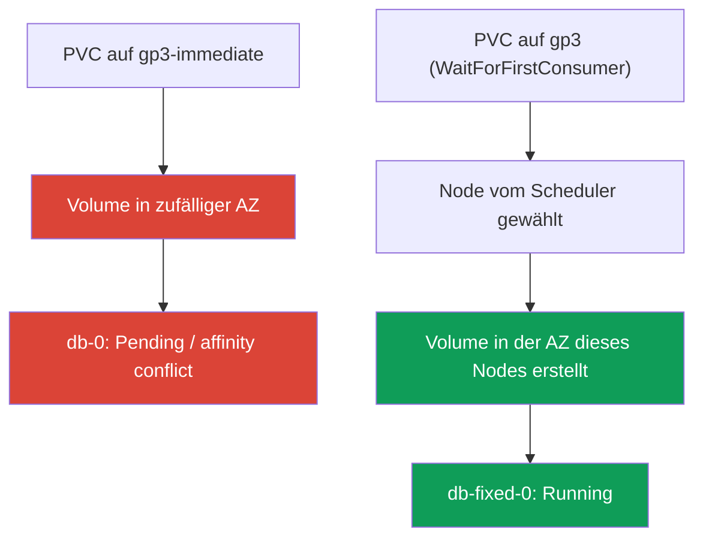
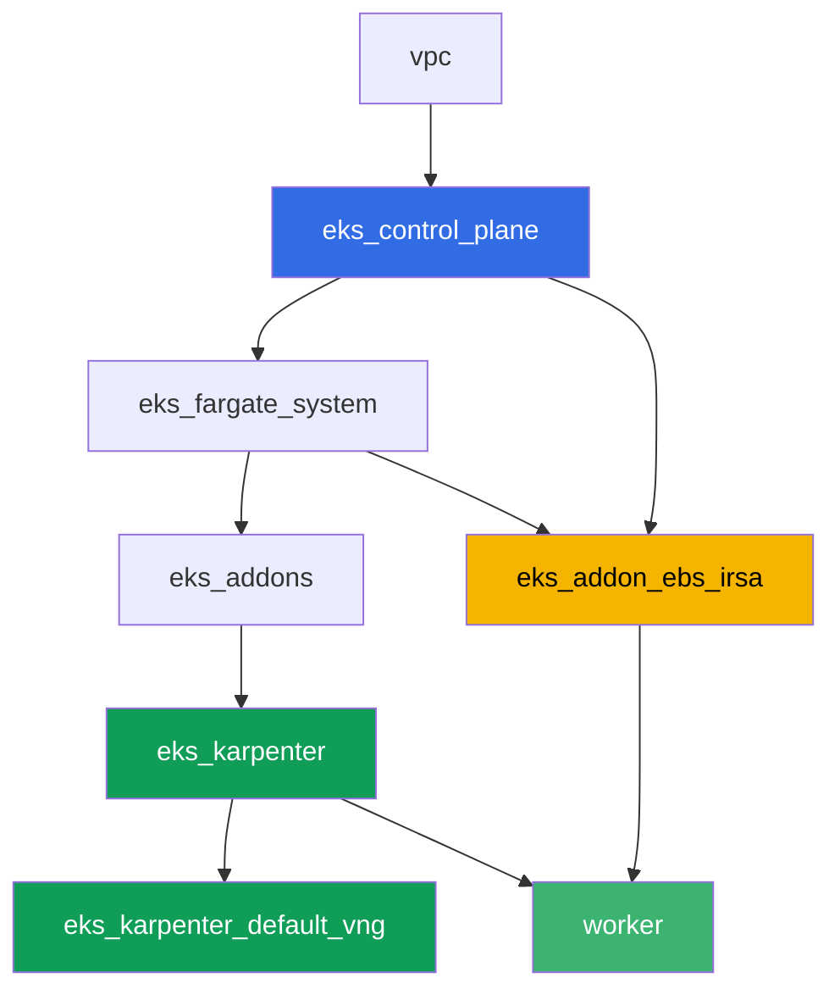

[Русская версия](README_RU.MD) · [Eng version](README.MD) · [Versión en español](README_ES.MD) · [Version française](README_FR.MD) · [ქართული ვერსია](README_GE.MD) · [繁體中文版](README_TW.MD) · [日本語版](README_JP.MD)

# Lab 106 - EBS CSI: gp3, Bindung an AZ, Erweiterung, Snapshot

## Beschreibung

Ein Lab über Block-Storage EBS in EKS und über einen typischen Fehler, auf den fast
jeder stößt, der ein StatefulSet auf einen frischen Cluster migriert: Der Pod hängt in
`Pending`, obwohl der PVC bereits erstellt ist und der PV bereits existiert. Die Ursache
ist `volumeBindingMode: Immediate` an der StorageClass, wodurch das EBS-Volume in einer
zufälligen Availability Zone erstellt wird, bevor der Scheduler entschieden hat, wohin der
Pod kommt. Sie reproduzieren dieses Symptom, analysieren es über `kubectl describe pod`
und die `nodeAffinity` des Volumes und beheben es anschließend über
`volumeBindingMode: WaitForFirstConsumer`. Danach folgen die Erweiterung eines Volumes im
laufenden Betrieb und ein Snapshot mit Wiederherstellung.

Die Aufgaben sind im Produktionsstil geschrieben: eine kurze Aufgabenstellung plus
Abnahmekriterien. Die Prüfung erfolgt automatisch über den Befehl `check_result`.

## Ziel

Den Stoff dieser Kurskapitel vertiefen:

- [Kapitel 23. EBS CSI: gp3, StorageClass, Erweiterung, Snapshots, Bindung an AZ](../../course/23/ru.md) - der Hauptstoff dieses Labs
- [Kapitel 9. Compute-Typen: Managed Node Groups, Fargate, Auto Mode](../../course/09/ru.md) - warum der Cluster zwei AZ hat und wo die Nodes leben
- [Kapitel 12. Karpenter: NodePool, Consolidation, Disruption](../../course/12/ru.md) - warum die Consolidation den Pod nicht zwischen AZ verschiebt, wenn er ein Volume hat
- [Kapitel 16-17. IRSA und Pod Identity](../../course/16/ru.md) - wie der Driver das Recht für `CreateVolume`/`CreateSnapshot` erhält

## Was wir erstellen

| Objekt | Was es ist | Wofür in diesem Lab |
|--------|---------|-------------------|
| Namespace `eks-106` | ein Cluster-Bereich für die Lab-Workload | hält Ressourcen getrennt (Kapitel 4) |
| StorageClass `gp3-immediate` | eine Klasse mit `volumeBindingMode: Immediate` | fängt das Symptom ein: Volume in zufälliger AZ (Kapitel 23) |
| StatefulSet `db` (1 Replica, Volume `5Gi`) | Workload auf der defekten Klasse | reproduziert `Pending`/Konflikt der `nodeAffinity` (Kapitel 23) |
| Artefakt `diagnosis.txt` | Ausgabe von `describe pod` und `pv -o yaml` plus Erklärung | hält den Unterschied zwischen "hatte Glück" und "funktioniert garantiert" fest |
| StorageClass `gp3` | eine Klasse mit `volumeBindingMode: WaitForFirstConsumer` | der korrekte Provisioning-Modus für EBS (Kapitel 23) |
| StatefulSet `db-fixed` | dieselbe Workload auf der behobenen Klasse | Pod `Running`, Zone des Volumes gleich Zone des Nodes (Kapitel 23) |
| Erweiterung des PVC auf `10Gi` | `kubectl patch pvc` | lernen, `gp3` ohne Neuerstellung des Pods zu erweitern (Kapitel 23) |
| `VolumeSnapshot` und wiederhergestellter PVC | Snapshot des Volumes und neuer PVC daraus | sehen, dass der Snapshot regional ist, das wiederhergestellte Volume aber wieder zonal (Kapitel 23) |

Der Weg vom Symptom zur Behebung:



## Infrastruktur

Die Umgebung wird in AWS (`eu-central-1`) über Terragrunt deployt. Jedes Lab-Verzeichnis ist
eine Komponente mit eigenem `terragrunt.hcl`, das auf ein gemeinsames Modul in
`terraform/modules/` verweist und seine Abhängigkeiten über `dependency`-Blöcke deklariert.
Terragrunt baut einen Abhängigkeitsgraphen und wendet die Komponenten in der richtigen
Reihenfolge an. Die Basis ist dieselbe wie in Lab 101 (Control Plane, Fargate für
System-Pods, Karpenter für die Workload), plus eine separate Komponente für EBS CSI.

### Module und Abhängigkeiten

| Verzeichnis (Komponente) | Modul (`terraform/modules/`) | Abhängig von | Was es erstellt |
|---------------------|-------------------------------|------------|-------------|
| `vpc` | `vpc_v3` | - | VPC `10.10.0.0/16`, Subnetze in zwei AZ (`eu-central-1a`, `eu-central-1b`), NAT |
| `ssh-keys` | `ssh-keys` | - | ein SSH-Schlüsselpaar für die Worker-Maschine und die Nodes |
| `eks_control_plane` | `eks_v2_control_plane` | `vpc` | EKS Control Plane `1.36`, OIDC, Security Groups |
| `eks_fargate_system` | `eks_v2_fargate` | `vpc`, `eks_control_plane` | Fargate-Profil für `kube-system` und `karpenter` |
| `eks_addons` | `eks_v2_addons` | `eks_control_plane`, `eks_fargate_system` | coredns, kube-proxy, vpc-cni, pod-identity, `snapshot-controller` |
| `eks_karpenter` | `eks_v2_karpenter` | `vpc`, `eks_control_plane`, `eks_addons`, `eks_fargate_system` | Karpenter-Controller, IAM-Rolle der Nodes |
| `eks_karpenter_default_vng` | `eks_v2_karpenter_vng` | `vpc`, `eks_control_plane`, `eks_karpenter` | Standard-NodePool `default` auf AL2023 |
| `eks_addon_ebs_irsa` | `eks_v2_ebs_irsa` | `eks_fargate_system`, `eks_control_plane` | Managed Addon `aws-ebs-csi-driver` und IAM-Rolle über IRSA |
| `worker` | `eks_v2_work_pc` | `ssh-keys`, `vpc`, `eks_control_plane`, `eks_karpenter`, `eks_addon_ebs_irsa` | Worker-Maschine mit kubectl, Tests und `check_result` |

Die Rolle für den EBS-Driver ist bereits über die Komponente `eks_addon_ebs_irsa` per IRSA
konfiguriert (Kapitel 16-17): Sie muss in den Aufgaben nicht neu erstellt werden, der Driver
ist bereit, sobald Sie den ersten PVC erstellen (`worker` hängt von `eks_addon_ebs_irsa` ab).

Abhängigkeitsgraph (was früher angewendet wird, steht weiter unten am Pfeil):



Der Cluster ist in zwei AZ aufgesetzt - das ist wichtig für das Hauptszenario dieses Labs:
Mit `volumeBindingMode: Immediate` besteht in zwei Zonen ein reales Risiko, dass das Volume
nicht dort erstellt wird, wo später ein freier Node zur Verfügung steht.

### Wo was konfiguriert wird

`env.hcl` (gemeinsame Umgebungsparameter, von allen Komponenten gelesen):

| Parameter | Wert im Lab | Was er beeinflusst |
|----------|-----------------|---------------|
| `region` | `eu-central-1` | Region aller Ressourcen |
| `subnets` | private `eks1`/`eks2` in `eu-central-1a`/`eu-central-1b` | Zonen, in denen Karpenter einen Node hochfahren kann |
| `prefix` | `eks-task106` | Präfix für Ressourcennamen und Tags |
| `stack_name` | `eks106` | daraus wird `env_name` - der Clustername - gebildet |
| `k8_version` | `1.36.0` | kubectl-Version auf der Worker-Maschine |

`inputs` im `terragrunt.hcl` jeder Komponente (Parameter des jeweiligen Moduls):

| Datei | Wichtige Einstellungen |
|------|--------------------|
| `eks_addons/terragrunt.hcl` | zusätzlich zu den Basis-Add-ons ist `snapshot-controller` hinzugefügt (CRD und Controller für `VolumeSnapshot`) |
| `eks_addon_ebs_irsa/terragrunt.hcl` | Managed Addon `aws-ebs-csi-driver`, Rolle über IRSA auf `oidc_provider_arn` des Clusters |
| `worker/terragrunt.hcl` | `test_url` und `task_script_url` für die Lab-106-Dateien, Abhängigkeit von `eks_addon_ebs_irsa` |

## Deployment

```bash
TASK=106 make run_eks_task
```

Das Deployment dauert etwa 15-20 Minuten. Suchen Sie in der Ausgabe die Zeile mit der
SSH-Verbindung zur Worker-Maschine und verbinden Sie sich damit. kubectl ist dort bereits
für den richtigen Cluster konfiguriert, der EBS-CSI-Driver ist bereits installiert und
bereit, PVCs anzunehmen. Der Cluster startet mit null EC2-Nodes (nur Fargate), daher wärmt
die Worker-Maschine vor Beginn der Aufgaben genau einen EC2-Node mit einem Hilfspod im
Namespace `ebs-csi-warmup` vor - ohne das kann der CSI-Driver die Zone des Volumes für
`volumeBindingMode: Immediate` (Aufgabe 3) nicht bestimmen, und Karpenter fährt keinen Node
für einen Pod mit ungebundenem Immediate-PVC hoch. Der Namespace `ebs-csi-warmup` gehört
nicht zu den Aufgaben des Labs, fassen Sie ihn nicht an.

Nützliche Befehle auf der Worker-Maschine:

```bash
time_left       # verbleibende Zeit der Umgebung
check_result    # Lösung prüfen
```

> Sicherheit der Testumgebung. In `env.hcl` sind `ssh_password_enable = true` und
> `access_cidrs = ["0.0.0.0/0"]` aktiviert - praktisch für eine Lernumgebung, aber so sollte
> man es in Produktion nicht machen. Nach den Standards des Kurses (Kapitel 0.2, 2, 19) wird
> der Zugriff auf Worker-Maschinen über AWS SSM Session Manager geöffnet, ohne öffentliche
> SSH-Ports nach außen, und `access_cidrs` wird auf konkrete Adressen eingeschränkt. Hier
> bleibt öffentliches SSH nur der Einfachheit halber bestehen.

## Aufgaben

---
|        **1**        | **Namespace für die Lab-Workload**                             |
| :-----------------: | :---------------------------------------------------------- |
| Was wir tun          | Erstellen Sie einen Namespace mit dem Namen `eks-106`. Alle Objekte des Labs werden darin erstellt. |
| Abnahmekriterien    | - Namespace `eks-106` existiert. |
---
|        **2**        | **StorageClass mit defektem Bindungsmodus**              |
| :-----------------: | :---------------------------------------------------------- |
| Was wir tun          | Erstellen Sie die StorageClass `gp3-immediate`: `provisioner: ebs.csi.aws.com`, `volumeBindingMode: Immediate`, `allowVolumeExpansion: true`, `parameters.type: gp3`, `parameters.encrypted: "true"`. |
| Abnahmekriterien    | - StorageClass `gp3-immediate` existiert;<br/>- `provisioner: ebs.csi.aws.com`;<br/>- `volumeBindingMode: Immediate`. |
---
|        **3**        | **StatefulSet auf der defekten Klasse (Symptom reproduzieren)** |
| :-----------------: | :---------------------------------------------------------- |
| Was wir tun          | Erstellen Sie in `eks-106` das StatefulSet `db`, Image `viktoruj/ping_pong:latest`, `1` Replica, `volumeClaimTemplates` mit dem Namen `data` auf der StorageClass `gp3-immediate`, Anforderung `5Gi`. Beobachten Sie `db-0`: Mit `Immediate` wird das Volume sofort nach dem Erscheinen des PVC erstellt, in einer zufälligen der beiden AZ des Clusters, bevor bekannt ist, wohin der Scheduler den Pod stellt. In einem Cluster mit zwei Zonen kann der Pod in `Pending` bleiben (Konflikt der `nodeAffinity` des Volumes) oder, falls das Volume zufällig in derselben Zone landet, in der ein freier Node existiert, in `Running` übergehen. Beide Ergebnisse sind an dieser Stelle zulässig - die Analyse in Aufgabe 4 ist in beiden Fällen verpflichtend. |
| Abnahmekriterien    | - StatefulSet `db` in `eks-106`, Image `viktoruj/ping_pong`;<br/>- `volumeClaimTemplates` auf die Klasse `gp3-immediate`, Anforderung `5Gi`;<br/>- PVC `data-db-0` erstellt. |
---
|        **4**        | **Diagnose: Immediate versus Bindung an die Zone**           |
| :-----------------: | :---------------------------------------------------------- |
| Was wir tun          | Analysieren Sie, was mit dem Volume von `db-0` passiert ist, unabhängig davon, ob es `Pending` oder `Running` ist. Speichern Sie `kubectl describe pod db-0 -n eks-106` (Abschnitt `Events`) in `/var/work/tests/artifacts/4/describe.txt` und `kubectl get pv <pv> -o yaml` (Volume des PVC `data-db-0`) in `/var/work/tests/artifacts/4/pv.yaml`. Schreiben Sie in die Datei `/var/work/tests/artifacts/4/diagnosis.txt` eine Erklärung: warum `volumeBindingMode: Immediate` das Volume erstellt, bevor die Zone des Pods bekannt ist, was die `nodeAffinity` des Volumes mit dem Schlüssel `topology.ebs.csi.aws.com/zone` bedeutet, und warum `Running` in einem Cluster mit zwei AZ "Glück" ist, aber nicht "funktioniert garantiert". Der Text muss die Wörter `Immediate`, `nodeAffinity` und `zone` enthalten. |
| Abnahmekriterien    | - die Datei `describe.txt` ist nicht leer;<br/>- die Datei `pv.yaml` ist nicht leer;<br/>- die Datei `diagnosis.txt` ist nicht leer und enthält `Immediate`, `nodeAffinity`, `zone`. |
---
|        **5**        | **Behebung: WaitForFirstConsumer**                            |
| :-----------------: | :---------------------------------------------------------- |
| Was wir tun          | Ein PVC bindet sich einmalig an seine StorageClass, daher muss man mit einer neuen Klasse und einem neuen StatefulSet beheben, nicht mit einem Patch auf `gp3-immediate`. Erstellen Sie die StorageClass `gp3`: `provisioner: ebs.csi.aws.com`, `volumeBindingMode: WaitForFirstConsumer`, `allowVolumeExpansion: true`, `parameters.type: gp3`, `parameters.encrypted: "true"`. Erstellen Sie das StatefulSet `db-fixed` (dasselbe Image, `1` Replica) mit `volumeClaimTemplates` auf der Klasse `gp3`, Anforderung `5Gi`. Warten Sie, bis `db-fixed-0` in `Running` übergeht, und stellen Sie sicher, dass die Zone des Volumes (`nodeAffinity` des PV) mit der Zone des Nodes des Pods übereinstimmt (`topology.kubernetes.io/zone`). |
| Abnahmekriterien    | - StorageClass `gp3` mit `volumeBindingMode: WaitForFirstConsumer` und `allowVolumeExpansion: true`;<br/>- Pod `db-fixed-0` in `Running`;<br/>- die Zone des PV aus `nodeAffinity` stimmt mit der Zone des Nodes des Pods überein. |
---
|        **6**        | **Erweiterung des Volumes im laufenden Betrieb**                                  |
| :-----------------: | :---------------------------------------------------------- |
| Was wir tun          | Erweitern Sie den PVC `data-db-fixed-0` von `5Gi` auf `10Gi` über `kubectl patch pvc`. Warten Sie, bis `status.capacity.storage` die neue Größe bestätigt. |
| Abnahmekriterien    | - `spec.resources.requests.storage` des PVC `data-db-fixed-0` ist gleich `10Gi`;<br/>- `status.capacity.storage` ist gleich `10Gi`. |
---
|        **7**        | **Snapshot des Volumes und Wiederherstellung**                            |
| :-----------------: | :---------------------------------------------------------- |
| Was wir tun          | Erstellen Sie eine `VolumeSnapshotClass` (`driver: ebs.csi.aws.com`) und einen `VolumeSnapshot` `db-snap` in `eks-106`, der auf den PVC `data-db-fixed-0` verweist (`spec.source.persistentVolumeClaimName`). Warten Sie auf `readyToUse: true`. Erstellen Sie einen neuen PVC `data-restored` auf der Klasse `gp3` mit `dataSource.kind: VolumeSnapshot`, `dataSource.name: db-snap`, `dataSource.apiGroup: snapshot.storage.k8s.io`. Der EBS-Snapshot ist ein regionales Objekt, aber das daraus wiederhergestellte Volume ist wieder zonal: Mit der Klasse `WaitForFirstConsumer` bleibt der PVC `data-restored` in `Pending`, bis ein Pod ihn anfordert, und das ist erwartet. |
| Abnahmekriterien    | - `VolumeSnapshot` `db-snap` verweist auf den PVC `data-db-fixed-0`;<br/>- der PVC `data-restored` hat `dataSource.kind: VolumeSnapshot`, `dataSource.name: db-snap`. |
---

## Ergebnis prüfen

Führen Sie auf der Worker-Maschine die automatische Prüfung aus:

```bash
check_result
```

Das Skript führt die Tests aus und zeigt den Prozentsatz erledigter Aufgaben.

## Lösung

Referenzlösung: [worker/files/solutions/1_DE.MD](worker/files/solutions/1_DE.MD)

## Cluster und Ressourcen löschen

> **Löschen Sie zuerst PVCs und Snapshots, dann den Cluster.** Die EBS-Volumes hinter
> dynamischen PVCs erstellt der EBS-CSI-Driver, und er löscht sie auch - sobald der PVC
> gelöscht wird (bei `reclaimPolicy: Delete`). Reißt man den Cluster mit noch lebenden PVCs
> ab, gibt es den Driver nicht mehr, und die Volumes bleiben im Konto als `available` für
> immer und werden weiter berechnet: Terraform weiß nichts von ihnen. Dasselbe gilt für
> `VolumeSnapshot` - dahinter steht ein EBS-Snapshot, den der CSI-Driver löscht.
>
> **Die Reihenfolge beim Löschen des Snapshots ist wichtig.** Der PVC `data-restored` ist
> aus `db-snap` wiederhergestellt, und solange dieser PVC existiert, hängt am Snapshot der
> Finalizer `snapshot.storage.kubernetes.io/volumesnapshot-as-source-protection` - `db-snap`
> geht nur nach `Terminating` über und nicht weiter. Symmetrisch dazu: Am ursprünglichen PVC
> `data-db-fixed-0` hängt `pvc-as-source-protection`, solange der Snapshot lebt. Löscht man
> den Namespace komplett und startet sofort `destroy`, überlebt der EBS-Snapshot den Cluster
> und bleibt im Konto (auf einer laufenden Testumgebung geprüft: nach einem Durchlauf des
> Labs fand sich in der Region ein Snapshot mit 10 GiB). Deshalb zuerst der aus dem Snapshot
> wiederhergestellte PVC, dann der Snapshot selbst, und erst danach alles andere.

```bash
# 1. Workload entfernen: solange der Pod das Volume hält, wird der PVC nicht gelöscht
kubectl delete statefulset --all -n eks-106 --ignore-not-found
kubectl delete pod --all -n eks-106 --ignore-not-found

# 2. PVC, der aus dem Snapshot wiederhergestellt wurde - er hält einen Finalizer auf db-snap
kubectl delete pvc data-restored -n eks-106 --ignore-not-found

# 3. Snapshot: dahinter steht ein EBS-Snapshot, den der CSI-Driver löscht (deletionPolicy: Delete)
kubectl delete volumesnapshot db-snap -n eks-106 --ignore-not-found
kubectl wait --for=delete volumesnapshot/db-snap -n eks-106 --timeout=300s 2>/dev/null || true
kubectl get volumesnapshot -n eks-106

# 4. Übrige PVCs: die von volumeClaimTemplates werden NICHT zusammen mit dem StatefulSet gelöscht
kubectl delete pvc --all -n eks-106 --ignore-not-found
kubectl delete namespace eks-106 --ignore-not-found

# 5. Warten, bis Karpenter seine EC2-Nodes entfernt
while kubectl get nodes --no-headers 2>/dev/null | grep -qv fargate; do
  echo "Karpenter-EC2-Node ist noch da, warte..."; sleep 15
done
```

Bleibt `db-snap` in `Terminating` hängen, verweist noch irgendein PVC darauf - finden Sie
ihn über `dataSource` und löschen Sie ihn, den Finalizer sollten Sie nicht manuell entfernen:

```bash
kubectl get pvc -n eks-106 \
  -o custom-columns=NAME:.metadata.name,SOURCE:.spec.dataSource.name
kubectl get volumesnapshot db-snap -n eks-106 -o jsonpath='{.metadata.finalizers}'
```

Stellen Sie vor `destroy` sicher, dass vom Lab keine Volumes oder Snapshots übrig geblieben
sind: Volumes von PVCs sind mit dem Tag `kubernetes.io/created-for/pvc/name` markiert,
Snapshots des CSI-Drivers mit dem Tag `CSIVolumeSnapshotName`. Beide Listen sollten leer
sein:

```bash
aws ec2 describe-volumes --filters Name=status,Values=available \
  --query 'Volumes[].[VolumeId,Size,Tags[?Key==`kubernetes.io/created-for/pvc/name`]|[0].Value]' \
  --output table
aws ec2 describe-snapshots --owner-ids self \
  --filters Name=tag-key,Values=CSIVolumeSnapshotName \
  --query 'Snapshots[].[SnapshotId,VolumeSize,StartTime]' --output table
# falls etwas übrig ist - manuell löschen, Terraform sieht diese Objekte nicht
aws ec2 delete-volume --volume-id <vol-id>
aws ec2 delete-snapshot --snapshot-id <snap-id>
```

```bash
TASK=106 make delete_eks_task
```
