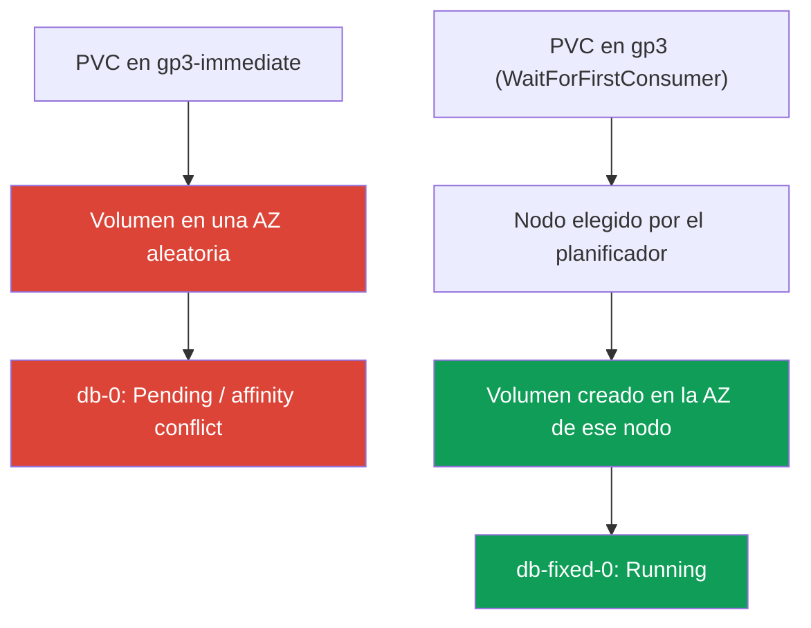
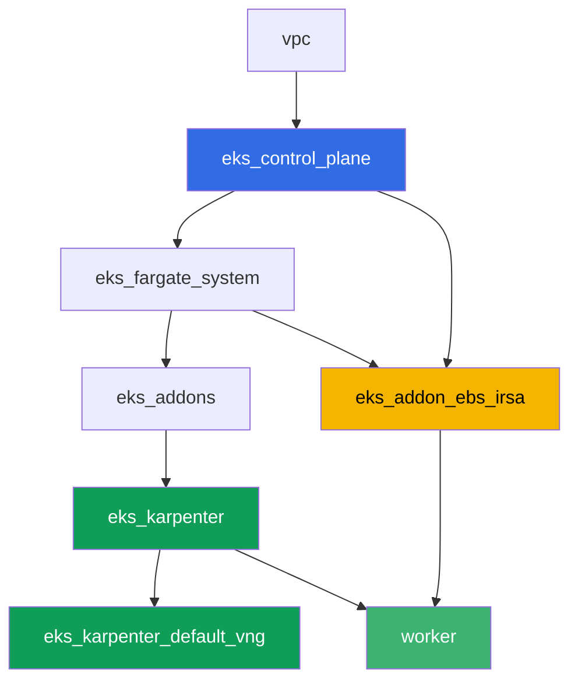

[Русская версия](README_RU.MD) · [Eng version](README.MD) · [Version française](README_FR.MD) · [Deutsche Version](README_DE.MD) · [ქართული ვერსია](README_GE.MD) · [繁體中文版](README_TW.MD) · [日本語版](README_JP.MD)

# Lab 106 - EBS CSI: gp3, vinculación a AZ, expansión, snapshot

## Descripción

Un laboratorio sobre el almacenamiento en bloque EBS en EKS y sobre el error típico con el
que se topa casi todo el que traslada un StatefulSet a un clúster nuevo: el pod se queda
colgado en `Pending`, aunque el PVC ya está creado y el PV ya existe. La causa es
`volumeBindingMode: Immediate` en el StorageClass, por el cual el volumen EBS se crea en una
zona de disponibilidad aleatoria antes de que el planificador haya decidido dónde irá el
pod. Reproducirás este síntoma, lo analizarás mediante `kubectl describe pod` y el
`nodeAffinity` del volumen, y luego lo corregirás con `volumeBindingMode:
WaitForFirstConsumer`. Después vienen la expansión de un volumen en caliente y un snapshot
con su restauración.

Las tareas están escritas en estilo de producción: un enunciado breve más criterios de
aceptación. La verificación es automática, mediante el comando `check_result`.

## Objetivo

Reforzar el material de estos capítulos del curso:

- [Capítulo 23. EBS CSI: gp3, StorageClass, expansión, snapshots, vinculación a AZ](../../course/23/ru.md) - material principal del laboratorio
- [Capítulo 9. Tipos de cómputo: managed node groups, Fargate, Auto Mode](../../course/09/ru.md) - por qué el clúster tiene dos AZ y dónde viven los nodos
- [Capítulo 12. Karpenter: NodePool, consolidation, disruption](../../course/12/ru.md) - por qué la consolidación no mueve el pod entre AZ si tiene un volumen
- [Capítulos 16-17. IRSA y Pod Identity](../../course/16/ru.md) - cómo obtiene el driver permiso para `CreateVolume`/`CreateSnapshot`

## Qué vamos a crear

| Objeto | Qué es | Para qué sirve en este laboratorio |
|--------|---------|-------------------|
| Namespace `eks-106` | una sección del clúster para la carga del laboratorio | mantiene los recursos separados (capítulo 4) |
| StorageClass `gp3-immediate` | clase con `volumeBindingMode: Immediate` | capturamos el síntoma: volumen en una AZ aleatoria (capítulo 23) |
| StatefulSet `db` (1 réplica, volumen `5Gi`) | carga sobre la clase rota | reproducimos `Pending`/conflicto de `nodeAffinity` (capítulo 23) |
| Artefacto `diagnosis.txt` | salida de `describe pod` y `pv -o yaml` más la explicación | registramos la diferencia entre "tuvo suerte" y "funciona de forma garantizada" |
| StorageClass `gp3` | clase con `volumeBindingMode: WaitForFirstConsumer` | modo correcto de aprovisionamiento para EBS (capítulo 23) |
| StatefulSet `db-fixed` | la misma carga sobre la clase corregida | pod en `Running`, la zona del volumen coincide con la zona del nodo (capítulo 23) |
| Expansión del PVC a `10Gi` | `kubectl patch pvc` | aprendemos a expandir `gp3` sin recrear el pod (capítulo 23) |
| `VolumeSnapshot` y PVC restaurado | snapshot del volumen y nuevo PVC a partir de él | vemos que el snapshot es regional, pero el volumen restaurado vuelve a ser zonal (capítulo 23) |

Camino desde el síntoma hasta la corrección:



## Infraestructura

El entorno se despliega en AWS (`eu-central-1`) mediante Terragrunt. Cada carpeta del
laboratorio es un componente con su propio `terragrunt.hcl`, que hace referencia a un módulo
compartido en `terraform/modules/` y declara sus dependencias mediante bloques `dependency`.
Terragrunt construye un grafo de dependencias y aplica los componentes en el orden correcto.
La base es la misma que en el laboratorio 101 (control plane, Fargate para los pods de
sistema, Karpenter para la carga de trabajo), más un componente adicional para EBS CSI.

### Módulos y dependencias

| Carpeta (componente) | Módulo (`terraform/modules/`) | Depende de | Qué crea |
|---------------------|-------------------------------|------------|-------------|
| `vpc` | `vpc_v3` | - | VPC `10.10.0.0/16`, subredes en dos AZ (`eu-central-1a`, `eu-central-1b`), NAT |
| `ssh-keys` | `ssh-keys` | - | un par de claves SSH para la máquina de trabajo y los nodos |
| `eks_control_plane` | `eks_v2_control_plane` | `vpc` | control plane de EKS `1.36`, OIDC, security groups |
| `eks_fargate_system` | `eks_v2_fargate` | `vpc`, `eks_control_plane` | perfil de Fargate para `kube-system` y `karpenter` |
| `eks_addons` | `eks_v2_addons` | `eks_control_plane`, `eks_fargate_system` | coredns, kube-proxy, vpc-cni, pod-identity, `snapshot-controller` |
| `eks_karpenter` | `eks_v2_karpenter` | `vpc`, `eks_control_plane`, `eks_addons`, `eks_fargate_system` | controlador de Karpenter, rol IAM de los nodos |
| `eks_karpenter_default_vng` | `eks_v2_karpenter_vng` | `vpc`, `eks_control_plane`, `eks_karpenter` | NodePool por defecto `default` sobre AL2023 |
| `eks_addon_ebs_irsa` | `eks_v2_ebs_irsa` | `eks_fargate_system`, `eks_control_plane` | managed addon `aws-ebs-csi-driver` y rol IAM mediante IRSA |
| `worker` | `eks_v2_work_pc` | `ssh-keys`, `vpc`, `eks_control_plane`, `eks_karpenter`, `eks_addon_ebs_irsa` | máquina de trabajo con kubectl, tests y `check_result` |

El rol para el driver de EBS ya está configurado por el componente `eks_addon_ebs_irsa`
mediante IRSA (capítulos 16-17): no hace falta crearlo de nuevo en las tareas, el driver está
listo en el momento en que creas el primer PVC (`worker` depende de `eks_addon_ebs_irsa`).

Grafo de dependencias (lo que se aplica antes está más abajo en la flecha):



El clúster está desplegado en dos AZ, lo cual es importante para el escenario principal del
laboratorio: con `volumeBindingMode: Immediate` en dos zonas existe un riesgo real de que el
volumen se cree donde luego no aparezca ningún nodo libre.

### Dónde se configura cada cosa

`env.hcl` (parámetros comunes del entorno, leídos por todos los componentes):

| Parámetro | Valor en el laboratorio | Qué afecta |
|----------|-----------------|---------------|
| `region` | `eu-central-1` | región de todos los recursos |
| `subnets` | privadas `eks1`/`eks2` en `eu-central-1a`/`eu-central-1b` | zonas donde Karpenter puede levantar un nodo |
| `prefix` | `eks-task106` | prefijo de nombres de recursos y etiquetas |
| `stack_name` | `eks106` | con él se construye `env_name`, el nombre del clúster |
| `k8_version` | `1.36.0` | versión de kubectl en la máquina de trabajo |

`inputs` en el `terragrunt.hcl` de cada componente (parámetros del módulo concreto):

| Archivo | Ajustes clave |
|------|--------------------|
| `eks_addons/terragrunt.hcl` | además de los add-ons básicos se añade `snapshot-controller` (CRD y controlador para `VolumeSnapshot`) |
| `eks_addon_ebs_irsa/terragrunt.hcl` | managed addon `aws-ebs-csi-driver`, rol mediante IRSA sobre el `oidc_provider_arn` del clúster |
| `worker/terragrunt.hcl` | `test_url` y `task_script_url` de los archivos del laboratorio 106, dependencia de `eks_addon_ebs_irsa` |

## Despliegue

```bash
TASK=106 make run_eks_task
```

El despliegue tarda aproximadamente 15-20 minutos. En la salida, busca la línea con la
conexión SSH a la máquina de trabajo y conéctate a ella. kubectl ya está configurado allí
para el clúster correcto, y el driver de EBS CSI ya está instalado y listo para aceptar
PVC. El clúster arranca sin nodos EC2 (solo Fargate), así que antes de empezar las tareas la
máquina de trabajo calienta exactamente un nodo EC2 con un pod de servicio en el namespace
`ebs-csi-warmup` - sin esto el driver CSI no puede determinar la zona del volumen para
`volumeBindingMode: Immediate` (tarea 3), y Karpenter no levanta un nodo para un pod con un
PVC Immediate sin vincular. El namespace `ebs-csi-warmup` no pertenece a las tareas del
laboratorio, no hace falta tocarlo.

Comandos útiles en la máquina de trabajo:

```bash
time_left       # cuánto tiempo queda del entorno
check_result    # verificar la solución
```

> Seguridad del entorno. En `env.hcl` están activados `ssh_password_enable = true` y
> `access_cidrs = ["0.0.0.0/0"]` - cómodo para un entorno de formación, pero no es algo que
> se deba hacer en producción. Según los estándares del curso (capítulos 0.2, 2, 19), el
> acceso a las máquinas de trabajo se abre mediante AWS SSM Session Manager sin puertos SSH
> públicos hacia el exterior, y `access_cidrs` se restringe a direcciones concretas. Aquí se
> deja SSH público solo para simplificar el arranque.

## Tareas

---
|        **1**        | **Namespace para la carga del laboratorio**                             |
| :-----------------: | :---------------------------------------------------------- |
| Qué hacemos          | Crea un namespace llamado `eks-106`. Todos los objetos del laboratorio se crean dentro de él. |
| Criterios de aceptación    | - el namespace `eks-106` existe. |
---
|        **2**        | **StorageClass con el modo de vinculación roto**              |
| :-----------------: | :---------------------------------------------------------- |
| Qué hacemos          | Crea el StorageClass `gp3-immediate`: `provisioner: ebs.csi.aws.com`, `volumeBindingMode: Immediate`, `allowVolumeExpansion: true`, `parameters.type: gp3`, `parameters.encrypted: "true"`. |
| Criterios de aceptación    | - el StorageClass `gp3-immediate` existe;<br/>- `provisioner: ebs.csi.aws.com`;<br/>- `volumeBindingMode: Immediate`. |
---
|        **3**        | **StatefulSet sobre la clase rota (reproducimos el síntoma)** |
| :-----------------: | :---------------------------------------------------------- |
| Qué hacemos          | En `eks-106` crea el StatefulSet `db`, imagen `viktoruj/ping_pong:latest`, `1` réplica, `volumeClaimTemplates` con el nombre `data` sobre el StorageClass `gp3-immediate`, petición de `5Gi`. Observa `db-0`: con `Immediate` el volumen se crea justo después de que aparece el PVC, en una AZ arbitraria de las dos del clúster, antes de que se sepa dónde el planificador colocará el pod. En un clúster de dos zonas el pod puede quedarse en `Pending` (conflicto de `nodeAffinity` del volumen) o, si el volumen cayó por azar en la misma zona donde hay un nodo libre, pasar a `Running`. Cualquiera de estos dos resultados es válido en este paso - el análisis de la tarea 4 es obligatorio en ambos casos. |
| Criterios de aceptación    | - StatefulSet `db` en `eks-106`, imagen `viktoruj/ping_pong`;<br/>- `volumeClaimTemplates` sobre la clase `gp3-immediate`, petición de `5Gi`;<br/>- PVC `data-db-0` creado. |
---
|        **4**        | **Diagnóstico: Immediate frente a la vinculación a la zona**           |
| :-----------------: | :---------------------------------------------------------- |
| Qué hacemos          | Analiza qué pasó con el volumen de `db-0`, sin importar si está en `Pending` o en `Running`. Guarda `kubectl describe pod db-0 -n eks-106` (sección `Events`) en `/var/work/tests/artifacts/4/describe.txt` y `kubectl get pv <pv> -o yaml` (el volumen del PVC `data-db-0`) en `/var/work/tests/artifacts/4/pv.yaml`. En el archivo `/var/work/tests/artifacts/4/diagnosis.txt` escribe una explicación: por qué `volumeBindingMode: Immediate` crea el volumen antes de que se conozca la zona del pod, qué significa el `nodeAffinity` del volumen con la clave `topology.ebs.csi.aws.com/zone`, y por qué `Running` en un clúster con dos AZ es "tuvo suerte" y no "funciona de forma garantizada". El texto debe contener las palabras `Immediate`, `nodeAffinity` y `zone` (o `zona`). |
| Criterios de aceptación    | - el archivo `describe.txt` no está vacío;<br/>- el archivo `pv.yaml` no está vacío;<br/>- el archivo `diagnosis.txt` no está vacío y contiene `Immediate`, `nodeAffinity`, `zone`/`zona`. |
---
|        **5**        | **Corrección: WaitForFirstConsumer**                            |
| :-----------------: | :---------------------------------------------------------- |
| Qué hacemos          | El PVC se vincula a su StorageClass una sola vez, así que la corrección se hace con una clase nueva y un StatefulSet nuevo, no con un patch sobre `gp3-immediate`. Crea el StorageClass `gp3`: `provisioner: ebs.csi.aws.com`, `volumeBindingMode: WaitForFirstConsumer`, `allowVolumeExpansion: true`, `parameters.type: gp3`, `parameters.encrypted: "true"`. Crea el StatefulSet `db-fixed` (la misma imagen, `1` réplica) con `volumeClaimTemplates` sobre la clase `gp3`, petición de `5Gi`. Espera a que `db-fixed-0` pase a `Running`, y comprueba que la zona del volumen (`nodeAffinity` del PV) coincide con la zona del nodo del pod (`topology.kubernetes.io/zone`). |
| Criterios de aceptación    | - StorageClass `gp3` con `volumeBindingMode: WaitForFirstConsumer` y `allowVolumeExpansion: true`;<br/>- el pod `db-fixed-0` está en `Running`;<br/>- la zona del PV según `nodeAffinity` coincide con la zona del nodo del pod. |
---
|        **6**        | **Expansión del volumen en caliente**                                  |
| :-----------------: | :---------------------------------------------------------- |
| Qué hacemos          | Aumenta el PVC `data-db-fixed-0` de `5Gi` a `10Gi` mediante `kubectl patch pvc`. Espera a que `status.capacity.storage` confirme el nuevo tamaño. |
| Criterios de aceptación    | - `spec.resources.requests.storage` del PVC `data-db-fixed-0` es igual a `10Gi`;<br/>- `status.capacity.storage` es igual a `10Gi`. |
---
|        **7**        | **Snapshot del volumen y restauración**                            |
| :-----------------: | :---------------------------------------------------------- |
| Qué hacemos          | Crea un `VolumeSnapshotClass` (`driver: ebs.csi.aws.com`) y un `VolumeSnapshot` `db-snap` en `eks-106`, que haga referencia al PVC `data-db-fixed-0` (`spec.source.persistentVolumeClaimName`). Espera a `readyToUse: true`. Crea un nuevo PVC `data-restored` sobre la clase `gp3` con `dataSource.kind: VolumeSnapshot`, `dataSource.name: db-snap`, `dataSource.apiGroup: snapshot.storage.k8s.io`. El snapshot de EBS es un objeto regional, pero el volumen restaurado a partir de él vuelve a ser zonal: con la clase `WaitForFirstConsumer` el PVC `data-restored` se quedará en `Pending` hasta que un pod lo reclame, y eso es lo esperado. |
| Criterios de aceptación    | - el `VolumeSnapshot` `db-snap` hace referencia al PVC `data-db-fixed-0`;<br/>- el PVC `data-restored` tiene `dataSource.kind: VolumeSnapshot`, `dataSource.name: db-snap`. |
---

## Verificación del resultado

En la máquina de trabajo, ejecuta la verificación automática:

```bash
check_result
```

El script ejecutará los tests y mostrará el porcentaje de tareas completadas.

## Solución

Solución de referencia: [worker/files/solutions/1_ES.MD](worker/files/solutions/1_ES.MD)

## Eliminación del clúster y los recursos

> **Primero elimina los PVC y los snapshots, luego el clúster.** Los volúmenes EBS detrás
> de los PVC dinámicos los crea el driver EBS CSI, y también es él quien los elimina, al
> borrarse el PVC (con `reclaimPolicy: Delete`). Si destruyes el clúster con PVC todavía
> vivos, el driver ya no estará disponible, y los volúmenes quedarán en la cuenta como
> `available` para siempre, siguiendo facturándose: terraform no sabe nada de ellos. Lo mismo
> ocurre con `VolumeSnapshot` - detrás hay un snapshot de EBS que elimina el driver CSI.
>
> **El orden de eliminación del snapshot es importante.** El PVC `data-restored` se restauró
> a partir de `db-snap`, y mientras ese PVC exista, el snapshot mantiene el finalizer
> `snapshot.storage.kubernetes.io/volumesnapshot-as-source-protection` - `db-snap` solo
> llegará a `Terminating` y no avanzará más. De forma simétrica: el PVC original
> `data-db-fixed-0` tiene `pvc-as-source-protection` mientras el snapshot esté vivo. Si borras
> el namespace entero y lanzas `destroy` de inmediato, el snapshot de EBS sobrevivirá al
> clúster y quedará en la cuenta (comprobado en un entorno real: tras ejecutar el laboratorio
> se encontró un snapshot de 10 GiB en la región). Por eso primero va el PVC restaurado a
> partir del snapshot, luego el propio snapshot, y solo después todo lo demás.

```bash
# 1. Retirar la carga: mientras el pod sostenga el volumen, el PVC no se elimina
kubectl delete statefulset --all -n eks-106 --ignore-not-found
kubectl delete pod --all -n eks-106 --ignore-not-found

# 2. PVC restaurado a partir del snapshot - mantiene un finalizer sobre db-snap
kubectl delete pvc data-restored -n eks-106 --ignore-not-found

# 3. Snapshot: detrás hay un snapshot de EBS, lo elimina el driver CSI (deletionPolicy: Delete)
kubectl delete volumesnapshot db-snap -n eks-106 --ignore-not-found
kubectl wait --for=delete volumesnapshot/db-snap -n eks-106 --timeout=300s 2>/dev/null || true
kubectl get volumesnapshot -n eks-106

# 4. Resto de PVC: los de volumeClaimTemplates NO se eliminan junto con el StatefulSet
kubectl delete pvc --all -n eks-106 --ignore-not-found
kubectl delete namespace eks-106 --ignore-not-found

# 5. Esperar a que Karpenter retire sus nodos EC2
while kubectl get nodes --no-headers 2>/dev/null | grep -qv fargate; do
  echo "Aún hay un nodo EC2 de Karpenter vivo, esperando..."; sleep 15
done
```

Si `db-snap` se queda atascado en `Terminating`, significa que algún PVC todavía lo
referencia - encuéntralo por `dataSource` y elimínalo, no hace falta quitar el finalizer a
mano:

```bash
kubectl get pvc -n eks-106 \
  -o custom-columns=NAME:.metadata.name,SOURCE:.spec.dataSource.name
kubectl get volumesnapshot db-snap -n eks-106 -o jsonpath='{.metadata.finalizers}'
```

Antes de `destroy`, comprueba que no ha quedado ningún volumen ni snapshot del laboratorio:
los volúmenes de los PVC están etiquetados con `kubernetes.io/created-for/pvc/name`, los
snapshots del driver CSI con `CSIVolumeSnapshotName`. Ambas listas deben estar vacías:

```bash
aws ec2 describe-volumes --filters Name=status,Values=available \
  --query 'Volumes[].[VolumeId,Size,Tags[?Key==`kubernetes.io/created-for/pvc/name`]|[0].Value]' \
  --output table
aws ec2 describe-snapshots --owner-ids self \
  --filters Name=tag-key,Values=CSIVolumeSnapshotName \
  --query 'Snapshots[].[SnapshotId,VolumeSize,StartTime]' --output table
# si queda algo - elimínalo a mano, terraform no ve estos objetos
aws ec2 delete-volume --volume-id <vol-id>
aws ec2 delete-snapshot --snapshot-id <snap-id>
```

```bash
TASK=106 make delete_eks_task
```
