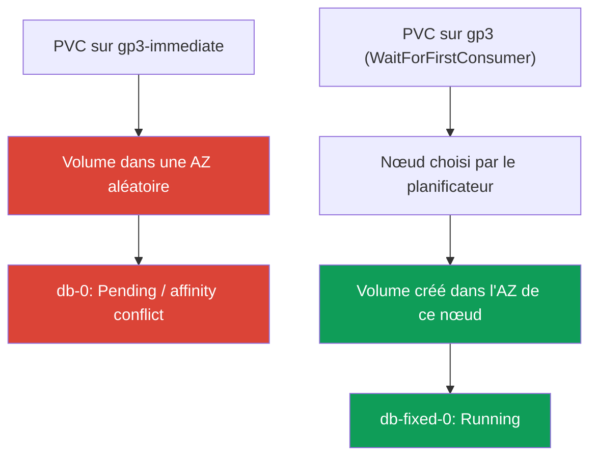
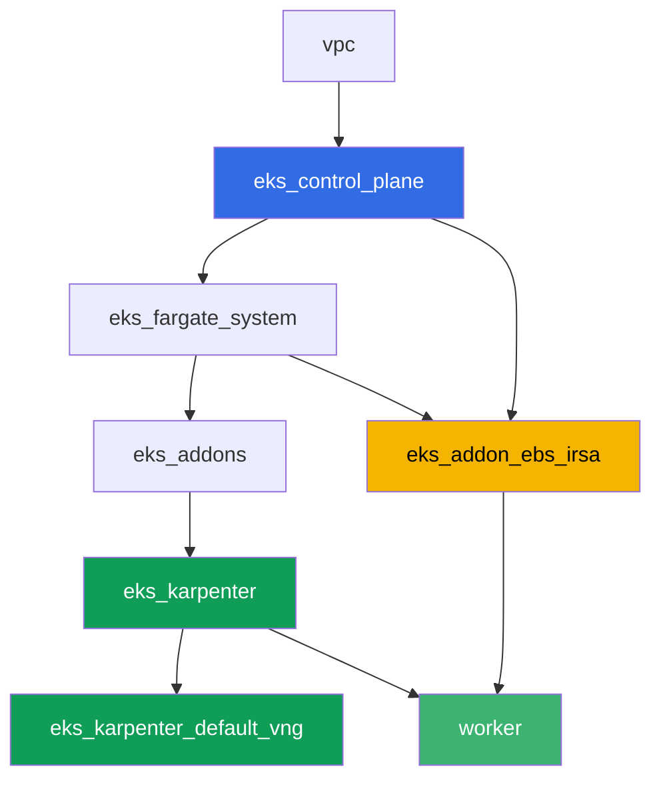

[Русская версия](README_RU.MD) · [Eng version](README.MD) · [Versión en español](README_ES.MD) · [Deutsche Version](README_DE.MD) · [ქართული ვერსია](README_GE.MD) · [繁體中文版](README_TW.MD) · [日本語版](README_JP.MD)

# Lab 106 - EBS CSI : gp3, rattachement à l'AZ, extension, snapshot

## Description

Lab sur le stockage bloc EBS dans EKS et sur une erreur classique que rencontre presque
tout le monde en migrant un StatefulSet vers un cluster tout neuf : le pod reste bloqué en
`Pending`, alors que le PVC est déjà créé et que le PV existe déjà. La cause -
`volumeBindingMode: Immediate` sur le StorageClass, qui fait que le volume EBS est créé
dans une zone de disponibilité aléatoire avant même que le planificateur ait décidé où
placer le pod. Vous allez reproduire ce symptôme, l'analyser via `kubectl describe pod` et
le `nodeAffinity` du volume, puis le corriger avec
`volumeBindingMode: WaitForFirstConsumer`. Ensuite - extension du volume à chaud et snapshot
avec restauration.

Les tâches sont écrites dans un style de production : un énoncé court plus des critères
d'acceptation. La vérification est automatique, via la commande `check_result`.

## Objectif

Consolider le contenu des chapitres suivants du cours :

- [Chapitre 23. EBS CSI : gp3, StorageClass, extension, snapshots, rattachement à l'AZ](../../course/23/ru.md) - le contenu principal du lab
- [Chapitre 9. Types de compute : managed node groups, Fargate, Auto Mode](../../course/09/ru.md) - pourquoi le cluster a deux AZ et où vivent les nœuds
- [Chapitre 12. Karpenter : NodePool, consolidation, disruption](../../course/12/ru.md) - pourquoi la consolidation ne déplace pas un pod entre AZ s'il a un volume
- [Chapitres 16-17. IRSA et Pod Identity](../../course/16/ru.md) - comment le driver obtient le droit de `CreateVolume`/`CreateSnapshot`

## Ce que nous créons

| Objet | Ce que c'est | Pourquoi dans ce laboratoire |
|--------|---------|-------------------|
| Namespace `eks-106` | une section du cluster pour la charge du laboratoire | on garde les ressources séparées (chapitre 4) |
| StorageClass `gp3-immediate` | classe avec `volumeBindingMode: Immediate` | on capture le symptôme : volume dans une AZ aléatoire (chapitre 23) |
| StatefulSet `db` (1 réplica, volume `5Gi`) | charge sur la classe cassée | on reproduit `Pending`/conflit `nodeAffinity` (chapitre 23) |
| Artefact `diagnosis.txt` | sortie de `describe pod` et de `pv -o yaml` plus une explication | on consigne la différence entre « ça a marché par chance » et « ça marche à coup sûr » |
| StorageClass `gp3` | classe avec `volumeBindingMode: WaitForFirstConsumer` | le bon mode de provisioning pour EBS (chapitre 23) |
| StatefulSet `db-fixed` | la même charge sur la classe corrigée | pod `Running`, la zone du volume est égale à la zone du nœud (chapitre 23) |
| Extension du PVC à `10Gi` | `kubectl patch pvc` | on apprend à agrandir `gp3` sans recréer le pod (chapitre 23) |
| `VolumeSnapshot` et PVC restauré | snapshot du volume et nouveau PVC créé à partir de lui | on constate que le snapshot est régional, mais le volume restauré redevient zonal (chapitre 23) |

Le chemin du symptôme à la correction :



## Infrastructure

L'environnement est déployé sur AWS (`eu-central-1`) via Terragrunt. Chaque dossier du
laboratoire est un composant avec son propre `terragrunt.hcl`, qui référence un module
partagé dans `terraform/modules/` et déclare ses dépendances via des blocs `dependency`.
Terragrunt construit un graphe de dépendances et applique les composants dans le bon ordre.
La base est la même que dans le lab 101 (control plane, Fargate pour les pods système,
Karpenter pour la charge de travail), plus un composant séparé pour EBS CSI.

### Modules et dépendances

| Dossier (composant) | Module (`terraform/modules/`) | Dépend de | Ce qu'il crée |
|---------------------|-------------------------------|------------|-------------|
| `vpc` | `vpc_v3` | - | VPC `10.10.0.0/16`, sous-réseaux dans deux AZ (`eu-central-1a`, `eu-central-1b`), NAT |
| `ssh-keys` | `ssh-keys` | - | une paire de clés SSH pour la machine de travail et les nœuds |
| `eks_control_plane` | `eks_v2_control_plane` | `vpc` | control plane EKS `1.36`, OIDC, security groups |
| `eks_fargate_system` | `eks_v2_fargate` | `vpc`, `eks_control_plane` | profil Fargate pour `kube-system` et `karpenter` |
| `eks_addons` | `eks_v2_addons` | `eks_control_plane`, `eks_fargate_system` | coredns, kube-proxy, vpc-cni, pod-identity, `snapshot-controller` |
| `eks_karpenter` | `eks_v2_karpenter` | `vpc`, `eks_control_plane`, `eks_addons`, `eks_fargate_system` | contrôleur Karpenter, rôle IAM des nœuds |
| `eks_karpenter_default_vng` | `eks_v2_karpenter_vng` | `vpc`, `eks_control_plane`, `eks_karpenter` | NodePool par défaut `default` sur AL2023 |
| `eks_addon_ebs_irsa` | `eks_v2_ebs_irsa` | `eks_fargate_system`, `eks_control_plane` | managed addon `aws-ebs-csi-driver` et rôle IAM via IRSA |
| `worker` | `eks_v2_work_pc` | `ssh-keys`, `vpc`, `eks_control_plane`, `eks_karpenter`, `eks_addon_ebs_irsa` | machine de travail avec kubectl, tests et `check_result` |

Le rôle pour le driver EBS est déjà configuré par le composant `eks_addon_ebs_irsa` via
IRSA (chapitres 16-17) : pas besoin de le recréer dans les tâches, le driver est prêt au
moment où vous créez le premier PVC (`worker` dépend de `eks_addon_ebs_irsa`).

Graphe de dépendances (ce qui est appliqué en premier est plus bas dans la flèche) :



Le cluster est déployé sur deux AZ - c'est important pour le scénario principal du lab :
avec `volumeBindingMode: Immediate` dans deux zones, il y a un vrai risque que le volume
soit créé là où, ensuite, il n'y aura pas de nœud disponible.

### Où chaque chose est configurée

`env.hcl` (paramètres communs de l'environnement, lus par tous les composants) :

| Paramètre | Valeur dans le laboratoire | Ce qu'il affecte |
|----------|-----------------|---------------|
| `region` | `eu-central-1` | région de toutes les ressources |
| `subnets` | privés `eks1`/`eks2` dans `eu-central-1a`/`eu-central-1b` | zones où Karpenter peut lever un nœud |
| `prefix` | `eks-task106` | préfixe des noms de ressources et des tags |
| `stack_name` | `eks106` | permet de construire `env_name`, le nom du cluster |
| `k8_version` | `1.36.0` | version de kubectl sur la machine de travail |

`inputs` dans le `terragrunt.hcl` de chaque composant (paramètres du module concerné) :

| Fichier | Réglages clés |
|------|--------------------|
| `eks_addons/terragrunt.hcl` | en plus des add-ons de base, `snapshot-controller` est ajouté (CRD et contrôleur pour `VolumeSnapshot`) |
| `eks_addon_ebs_irsa/terragrunt.hcl` | managed addon `aws-ebs-csi-driver`, rôle via IRSA sur `oidc_provider_arn` du cluster |
| `worker/terragrunt.hcl` | `test_url` et `task_script_url` des fichiers du laboratoire 106, dépendance à `eks_addon_ebs_irsa` |

## Déploiement

```bash
TASK=106 make run_eks_task
```

Le déploiement prend environ 15 à 20 minutes. Dans la sortie, repérez la ligne avec la
connexion SSH vers la machine de travail et connectez-vous. kubectl y est déjà configuré
pour le bon cluster, le driver EBS CSI est déjà installé et prêt à accepter des PVC. Le
cluster démarre avec zéro nœud EC2 (uniquement Fargate) ; c'est pourquoi, avant le début des
tâches, la machine de travail préchauffe exactement un nœud EC2 avec un pod de service dans
le namespace `ebs-csi-warmup` - sans cela, le driver CSI ne peut pas déterminer la zone du
volume pour `volumeBindingMode: Immediate` (tâche 3), et Karpenter ne lève pas de nœud pour
un pod avec un PVC Immediate non lié. Le namespace `ebs-csi-warmup` ne fait pas partie des
tâches du lab, il ne faut pas y toucher.

Commandes utiles sur la machine de travail :

```bash
time_left       # temps restant de l'environnement
check_result    # vérifier la solution
```

> Sécurité du banc de test. Dans `env.hcl`, `ssh_password_enable = true` et
> `access_cidrs = ["0.0.0.0/0"]` sont activés - pratique pour un environnement de formation,
> mais à ne pas faire en production. Selon les standards du cours (chapitres 0.2, 2, 19),
> l'accès aux machines de travail passe par AWS SSM Session Manager sans port SSH public
> exposé, et `access_cidrs` est restreint à des adresses précises. Ici, le SSH public est
> laissé uniquement pour simplifier le démarrage.

## Tâches

---
|        **1**        | **Namespace pour la charge du laboratoire**                             |
| :-----------------: | :---------------------------------------------------------- |
| Ce qu'on fait          | Créez un namespace nommé `eks-106`. Tous les objets du laboratoire sont créés à l'intérieur. |
| Critères d'acceptation    | - le namespace `eks-106` existe. |
---
|        **2**        | **StorageClass avec un mode de liaison cassé**              |
| :-----------------: | :---------------------------------------------------------- |
| Ce qu'on fait          | Créez le StorageClass `gp3-immediate` : `provisioner: ebs.csi.aws.com`, `volumeBindingMode: Immediate`, `allowVolumeExpansion: true`, `parameters.type: gp3`, `parameters.encrypted: "true"`. |
| Critères d'acceptation    | - le StorageClass `gp3-immediate` existe ;<br/>- `provisioner: ebs.csi.aws.com` ;<br/>- `volumeBindingMode: Immediate`. |
---
|        **3**        | **StatefulSet sur la classe cassée (on reproduit le symptôme)** |
| :-----------------: | :---------------------------------------------------------- |
| Ce qu'on fait          | Dans `eks-106`, créez le StatefulSet `db`, image `viktoruj/ping_pong:latest`, `1` réplica, `volumeClaimTemplates` nommé `data` sur le StorageClass `gp3-immediate`, requête `5Gi`. Observez `db-0` : avec `Immediate`, le volume est créé dès que le PVC apparaît, dans une AZ aléatoire parmi les deux du cluster, avant même que l'on sache où le planificateur va placer le pod. Dans un cluster à deux zones, le pod peut rester en `Pending` (conflit `nodeAffinity` du volume) ou, si le volume est tombé par hasard dans la même zone qu'un nœud disponible, passer en `Running`. Les deux issues sont acceptables à cette étape - l'analyse de la tâche 4 est obligatoire dans les deux cas. |
| Critères d'acceptation    | - StatefulSet `db` dans `eks-106`, image `viktoruj/ping_pong` ;<br/>- `volumeClaimTemplates` sur la classe `gp3-immediate`, requête `5Gi` ;<br/>- PVC `data-db-0` créé. |
---
|        **4**        | **Diagnostic : Immediate contre rattachement à la zone**           |
| :-----------------: | :---------------------------------------------------------- |
| Ce qu'on fait          | Analysez ce qui est arrivé au volume de `db-0`, que le pod soit `Pending` ou `Running`. Enregistrez `kubectl describe pod db-0 -n eks-106` (la section `Events`) dans `/var/work/tests/artifacts/4/describe.txt` et `kubectl get pv <pv> -o yaml` (le volume du PVC `data-db-0`) dans `/var/work/tests/artifacts/4/pv.yaml`. Dans le fichier `/var/work/tests/artifacts/4/diagnosis.txt`, écrivez une explication : pourquoi `volumeBindingMode: Immediate` crée le volume avant que la zone du pod soit connue, ce que signifie le `nodeAffinity` du volume avec la clé `topology.ebs.csi.aws.com/zone`, et pourquoi `Running` dans un cluster à deux AZ est un coup de chance, et non un fonctionnement garanti. Le texte doit contenir les mots `Immediate`, `nodeAffinity` et `zone`. |
| Critères d'acceptation    | - le fichier `describe.txt` n'est pas vide ;<br/>- le fichier `pv.yaml` n'est pas vide ;<br/>- le fichier `diagnosis.txt` n'est pas vide et contient `Immediate`, `nodeAffinity`, `zone`. |
---
|        **5**        | **Correction : WaitForFirstConsumer**                            |
| :-----------------: | :---------------------------------------------------------- |
| Ce qu'on fait          | Un PVC se lie à son StorageClass une seule fois, donc il faut corriger avec une nouvelle classe et un nouveau StatefulSet, pas avec un patch sur `gp3-immediate`. Créez le StorageClass `gp3` : `provisioner: ebs.csi.aws.com`, `volumeBindingMode: WaitForFirstConsumer`, `allowVolumeExpansion: true`, `parameters.type: gp3`, `parameters.encrypted: "true"`. Créez le StatefulSet `db-fixed` (même image, `1` réplica) avec `volumeClaimTemplates` sur la classe `gp3`, requête `5Gi`. Attendez que `db-fixed-0` passe en `Running`, et vérifiez que la zone du volume (`nodeAffinity` du PV) correspond à la zone du nœud du pod (`topology.kubernetes.io/zone`). |
| Critères d'acceptation    | - StorageClass `gp3` avec `volumeBindingMode: WaitForFirstConsumer` et `allowVolumeExpansion: true` ;<br/>- pod `db-fixed-0` en `Running` ;<br/>- la zone du PV issue de `nodeAffinity` correspond à la zone du nœud du pod. |
---
|        **6**        | **Extension du volume à chaud**                                  |
| :-----------------: | :---------------------------------------------------------- |
| Ce qu'on fait          | Augmentez le PVC `data-db-fixed-0` de `5Gi` à `10Gi` via `kubectl patch pvc`. Attendez que `status.capacity.storage` confirme la nouvelle taille. |
| Critères d'acceptation    | - `spec.resources.requests.storage` du PVC `data-db-fixed-0` égal à `10Gi` ;<br/>- `status.capacity.storage` égal à `10Gi`. |
---
|        **7**        | **Snapshot du volume et restauration**                            |
| :-----------------: | :---------------------------------------------------------- |
| Ce qu'on fait          | Créez un `VolumeSnapshotClass` (`driver: ebs.csi.aws.com`) et un `VolumeSnapshot` `db-snap` dans `eks-106`, référençant le PVC `data-db-fixed-0` (`spec.source.persistentVolumeClaimName`). Attendez `readyToUse: true`. Créez un nouveau PVC `data-restored` sur la classe `gp3` avec `dataSource.kind: VolumeSnapshot`, `dataSource.name: db-snap`, `dataSource.apiGroup: snapshot.storage.k8s.io`. Le snapshot EBS est un objet régional, mais le volume restauré à partir de lui redevient zonal : avec la classe `WaitForFirstConsumer`, le PVC `data-restored` restera en `Pending` tant qu'un pod ne le sollicite pas, et c'est attendu. |
| Critères d'acceptation    | - le `VolumeSnapshot` `db-snap` référence le PVC `data-db-fixed-0` ;<br/>- le PVC `data-restored` a `dataSource.kind: VolumeSnapshot`, `dataSource.name: db-snap`. |
---

## Vérification du résultat

Sur la machine de travail, lancez la vérification automatique :

```bash
check_result
```

Le script exécutera les tests et affichera le pourcentage de tâches accomplies.

## Solution

Solution de référence : [worker/files/solutions/1_FR.MD](worker/files/solutions/1_FR.MD)

## Suppression du cluster et des ressources

> **Supprimez d'abord les PVC et les snapshots, ensuite le cluster.** Les volumes EBS
> derrière les PVC dynamiques sont créés par le driver EBS CSI, et c'est lui aussi qui les
> supprime - au moment de la suppression du PVC (avec `reclaimPolicy: Delete`). Si vous
> détruisez le cluster alors que des PVC sont encore vivants, le driver n'existera plus, et
> les volumes resteront dans le compte à l'état `available` pour toujours, en continuant
> d'être facturés : terraform ne les connaît pas. Il en va de même pour `VolumeSnapshot` -
> derrière lui se trouve un snapshot EBS que le driver CSI supprime.
>
> **L'ordre de suppression du snapshot compte.** Le PVC `data-restored` est restauré à
> partir de `db-snap`, et tant que ce PVC existe, le snapshot porte le finalizer
> `snapshot.storage.kubernetes.io/volumesnapshot-as-source-protection` - `db-snap` passera
> seulement en `Terminating` et n'ira pas plus loin. Symétriquement, le PVC d'origine
> `data-db-fixed-0` porte `pvc-as-source-protection` tant que le snapshot est vivant. Si vous
> supprimez le namespace en entier puis lancez immédiatement `destroy`, le snapshot EBS
> survivra au cluster et restera dans le compte (constaté sur un banc de test réel : après
> un passage du lab, un snapshot de 10 GiB a été trouvé dans la région). Donc d'abord le PVC
> restauré à partir du snapshot, puis le snapshot lui-même, et enfin tout le reste.

```bash
# 1. Retirer la charge : tant que le pod détient le volume, le PVC ne sera pas supprimé
kubectl delete statefulset --all -n eks-106 --ignore-not-found
kubectl delete pod --all -n eks-106 --ignore-not-found

# 2. Le PVC restauré à partir du snapshot - il porte le finalizer sur db-snap
kubectl delete pvc data-restored -n eks-106 --ignore-not-found

# 3. Le snapshot : derrière lui il y a un snapshot EBS, supprimé par le driver CSI (deletionPolicy: Delete)
kubectl delete volumesnapshot db-snap -n eks-106 --ignore-not-found
kubectl wait --for=delete volumesnapshot/db-snap -n eks-106 --timeout=300s 2>/dev/null || true
kubectl get volumesnapshot -n eks-106

# 4. Les autres PVC : ceux issus de volumeClaimTemplates ne sont PAS supprimés avec le StatefulSet
kubectl delete pvc --all -n eks-106 --ignore-not-found
kubectl delete namespace eks-106 --ignore-not-found

# 5. Attendre que Karpenter retire ses nœuds EC2
while kubectl get nodes --no-headers 2>/dev/null | grep -qv fargate; do
  echo "Un nœud EC2 de Karpenter est encore vivant, on attend..."; sleep 15
done
```

Si `db-snap` reste bloqué en `Terminating`, c'est qu'un PVC y fait encore référence -
trouvez-le via `dataSource` et supprimez-le ; il n'est pas nécessaire de retirer le
finalizer à la main :

```bash
kubectl get pvc -n eks-106 \
  -o custom-columns=NAME:.metadata.name,SOURCE:.spec.dataSource.name
kubectl get volumesnapshot db-snap -n eks-106 -o jsonpath='{.metadata.finalizers}'
```

Avant `destroy`, vérifiez qu'il ne reste ni volume ni snapshot après le lab : les volumes
issus des PVC sont marqués par le tag `kubernetes.io/created-for/pvc/name`, les snapshots
issus du driver CSI par le tag `CSIVolumeSnapshotName`. Les deux listes doivent être vides :

```bash
aws ec2 describe-volumes --filters Name=status,Values=available \
  --query 'Volumes[].[VolumeId,Size,Tags[?Key==`kubernetes.io/created-for/pvc/name`]|[0].Value]' \
  --output table
aws ec2 describe-snapshots --owner-ids self \
  --filters Name=tag-key,Values=CSIVolumeSnapshotName \
  --query 'Snapshots[].[SnapshotId,VolumeSize,StartTime]' --output table
# s'il reste quelque chose - supprimez-le manuellement, terraform ne voit pas ces objets
aws ec2 delete-volume --volume-id <vol-id>
aws ec2 delete-snapshot --snapshot-id <snap-id>
```

```bash
TASK=106 make delete_eks_task
```
