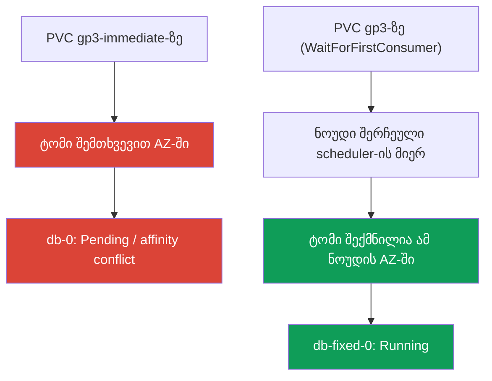
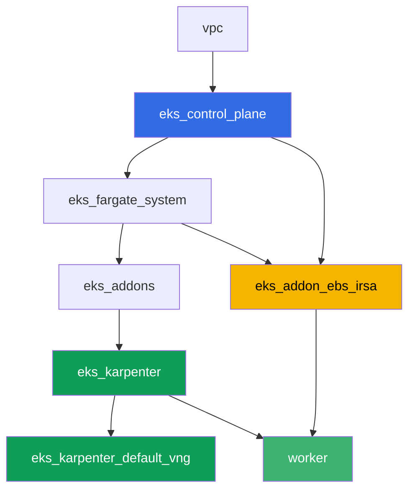

[Русская версия](README_RU.MD) · [Eng version](README.MD) · [Versión en español](README_ES.MD) · [Version française](README_FR.MD) · [Deutsche Version](README_DE.MD) · [繁體中文版](README_TW.MD) · [日本語版](README_JP.MD)

# ლაბა 106 - EBS CSI: gp3, AZ-ზე მიბმა, გაფართოება, სნეპშოტი

## აღწერა

ლაბა ბლოკურ EBS-საცავზეა EKS-ში და ტიპურ შეცდომაზე, რომელსაც ხვდება თითქმის ყველა,
ვინც StatefulSet-ს ახალ კლასტერზე გადაიტანს: პოდი კიდია `Pending`-ში, თუმცა PVC
უკვე შექმნილია და PV უკვე არსებობს. მიზეზი - `volumeBindingMode: Immediate`
StorageClass-ში, რის გამოც EBS-ტომი იქმნება შემთხვევით ხელმისაწვდომობის ზონაში,
ჯერ კიდევ სანამ scheduler-მა გადაწყვეტს, სად გაეშვება პოდი. თქვენ გამოიწვევთ ამ
სიმპტომს, გაარკვევთ მას `kubectl describe pod`-ისა და ტომის `nodeAffinity`-ის
მეშვეობით, შემდეგ გამოასწორებთ `volumeBindingMode: WaitForFirstConsumer`-ის
საშუალებით. შემდეგ - ტომის ონლაინ გაფართოება და სნეპშოტი აღდგენით.

დავალებები დაწერილია production-სტილში: მოკლე დავალება პლუს მიღების კრიტერიუმები.
შემოწმება ავტომატურია, ბრძანებით `check_result`.

## მიზანი

გავამყაროთ კურსის ამ თავების მასალა:

- [თავი 23. EBS CSI: gp3, StorageClass, გაფართოება, სნეპშოტები, AZ-ზე მიბმა](../../course/23/ru.md) - ლაბის ძირითადი მასალა
- [თავი 9. Compute-ის ტიპები: managed node groups, Fargate, Auto Mode](../../course/09/ru.md) - რატომ არსებობს კლასტერში ორი AZ და სად ცხოვრობენ ნოუდები
- [თავი 12. Karpenter: NodePool, consolidation, disruption](../../course/12/ru.md) - რატომ არ ატარებს consolidation პოდს AZ-ებს შორის, თუ მას აქვს ტომი
- [თავები 16-17. IRSA და Pod Identity](../../course/16/ru.md) - როგორ იღებს დრაივერი უფლებას `CreateVolume`/`CreateSnapshot`-ზე

## რას ვქმნით

| ობიექტი | რა არის ეს | რისთვის ამ ლაბაში |
|--------|---------|-------------------|
| Namespace `eks-106` | კლასტერის სექცია ლაბის დატვირთვისთვის | ვინახავთ რესურსებს განცალკევებულად (თავი 4) |
| StorageClass `gp3-immediate` | კლასი `volumeBindingMode: Immediate`-ით | ვიჭერთ სიმპტომს: ტომი შემთხვევით AZ-ში (თავი 23) |
| StatefulSet `db` (1 რეპლიკა, ტომი `5Gi`) | დატვირთვა გატეხილ კლასზე | ვიწვევთ `Pending`-ს/`nodeAffinity`-ის კონფლიქტს (თავი 23) |
| არტეფაქტი `diagnosis.txt` | `describe pod`-ისა და `pv -o yaml`-ის გამონატანი პლუს განმარტება | ვაფიქსირებთ განსხვავებას "გაგვიმართლა"-სა და "გარანტირებულად მუშაობს"-ს შორის |
| StorageClass `gp3` | კლასი `volumeBindingMode: WaitForFirstConsumer`-ით | EBS-ის სწორი provisioning-რეჟიმი (თავი 23) |
| StatefulSet `db-fixed` | იგივე დატვირთვა გამოსწორებულ კლასზე | პოდი `Running`-ში, ტომის ზონა ტოლია ნოუდის ზონისა (თავი 23) |
| PVC-ის გაფართოება `10Gi`-მდე | `kubectl patch pvc` | ვსწავლობთ `gp3`-ის გაფართოებას პოდის ხელახლა შექმნის გარეშე (თავი 23) |
| `VolumeSnapshot` და აღდგენილი PVC | ტომის სნეპშოტი და ახალი PVC მისგან | ვხედავთ, რომ სნეპშოტი რეგიონალურია, ხოლო აღდგენილი ტომი ისევ ზონალურია (თავი 23) |

გზა სიმპტომიდან გამოსწორებამდე:



## ინფრასტრუქტურა

გარემო დეპლოირდება AWS-ში (`eu-central-1`) Terragrunt-ის მეშვეობით. ლაბის ყოველი
დირექტორია ერთი კომპონენტია საკუთარი `terragrunt.hcl`-ით, რომელიც მიმართავს საერთო
მოდულს `terraform/modules/`-ში და აცხადებს დამოკიდებულებებს `dependency` ბლოკებით.
Terragrunt აწყობს დამოკიდებულებების გრაფს და აპლიკებს კომპონენტებს სწორი
თანმიმდევრობით. ბაზა იგივეა, რაც ლაბა 101-ში (control plane, Fargate სისტემური
პოდებისთვის, Karpenter დატვირთვისთვის), პლუს ცალკე კომპონენტი EBS CSI-სთვის.

### მოდულები და დამოკიდებულებები

| დირექტორია (კომპონენტი) | მოდული (`terraform/modules/`) | დამოკიდებულია | რას ქმნის |
|---------------------|-------------------------------|------------|-------------|
| `vpc` | `vpc_v3` | - | VPC `10.10.0.0/16`, ქვექსელები ორ AZ-ში (`eu-central-1a`, `eu-central-1b`), NAT |
| `ssh-keys` | `ssh-keys` | - | SSH-გასაღებების წყვილი სამუშაო მანქანისა და ნოუდებისთვის |
| `eks_control_plane` | `eks_v2_control_plane` | `vpc` | EKS control plane `1.36`, OIDC, security groups |
| `eks_fargate_system` | `eks_v2_fargate` | `vpc`, `eks_control_plane` | Fargate-პროფილი `kube-system`-ისთვის და `karpenter`-ისთვის |
| `eks_addons` | `eks_v2_addons` | `eks_control_plane`, `eks_fargate_system` | coredns, kube-proxy, vpc-cni, pod-identity, `snapshot-controller` |
| `eks_karpenter` | `eks_v2_karpenter` | `vpc`, `eks_control_plane`, `eks_addons`, `eks_fargate_system` | Karpenter-ის კონტროლერი, ნოუდების IAM-როლი |
| `eks_karpenter_default_vng` | `eks_v2_karpenter_vng` | `vpc`, `eks_control_plane`, `eks_karpenter` | ნაგულისხმევი NodePool `default` AL2023-ზე |
| `eks_addon_ebs_irsa` | `eks_v2_ebs_irsa` | `eks_fargate_system`, `eks_control_plane` | managed addon `aws-ebs-csi-driver` და IAM-როლი IRSA-ის მეშვეობით |
| `worker` | `eks_v2_work_pc` | `ssh-keys`, `vpc`, `eks_control_plane`, `eks_karpenter`, `eks_addon_ebs_irsa` | სამუშაო მანქანა kubectl-ით, ტესტებით და `check_result`-ით |

როლი EBS-დრაივერისთვის უკვე მორგებულია კომპონენტით `eks_addon_ebs_irsa` IRSA-ის
მეშვეობით (თავები 16-17): ხელახლა შექმნა დავალებებში საჭირო არ არის, დრაივერი
მზადაა იმ მომენტისთვის, როცა შექმნით პირველ PVC-ს (`worker` დამოკიდებულია
`eks_addon_ebs_irsa`-ზე).

დამოკიდებულებების გრაფი (რაც უფრო ადრე აპლიცირდება, ის ხრიხისკენ ქვემოთაა):



კლასტერი ამართულია ორ AZ-ში - ეს მნიშვნელოვანია ლაბის ძირითადი სცენარისთვის:
`volumeBindingMode: Immediate`-ით ორ ზონაში ნამდვილად ჩნდება რისკი, რომ ტომი
შეიქმნება არა იქ, სადაც შემდეგ აღმოჩნდება თავისუფალი ნოუდი.

### სად რა კონფიგურირდება

`env.hcl` (გარემოს საერთო პარამეტრები, წაკითხული ყველა კომპონენტის მიერ):

| პარამეტრი | მნიშვნელობა ლაბაში | რაზე ახდენს გავლენას |
|----------|-----------------|---------------|
| `region` | `eu-central-1` | ყველა რესურსის რეგიონი |
| `subnets` | პრივატული `eks1`/`eks2` `eu-central-1a`/`eu-central-1b`-ში | ზონები, სადაც Karpenter-ს შეუძლია ნოუდის ამართვა |
| `prefix` | `eks-task106` | რესურსების სახელებისა და ტეგების პრეფიქსი |
| `stack_name` | `eks106` | მისგან იწყობა `env_name` - კლასტერის სახელი |
| `k8_version` | `1.36.0` | kubectl-ის ვერსია სამუშაო მანქანაზე |

`inputs` თითოეული კომპონენტის `terragrunt.hcl`-ში (კონკრეტული მოდულის პარამეტრები):

| ფაილი | ძირითადი პარამეტრები |
|------|--------------------|
| `eks_addons/terragrunt.hcl` | ბაზისურ addon-ებთან ერთად დამატებულია `snapshot-controller` (CRD და კონტროლერი `VolumeSnapshot`-ისთვის) |
| `eks_addon_ebs_irsa/terragrunt.hcl` | managed addon `aws-ebs-csi-driver`, როლი IRSA-ის მეშვეობით კლასტერის `oidc_provider_arn`-ზე |
| `worker/terragrunt.hcl` | `test_url` და `task_script_url` ლაბა 106-ის ფაილებზე, დამოკიდებულება `eks_addon_ebs_irsa`-ზე |

## განლაგება

```bash
TASK=106 make run_eks_task
```

განლაგება გრძელდება დაახლოებით 15-20 წუთი. output-ში მოძებნეთ ხაზი SSH-შეერთებით
სამუშაო მანქანასთან და დაუკავშირდით მას. kubectl იქ უკვე კონფიგურირებულია საჭირო
კლასტერზე, EBS CSI-დრაივერი უკვე დაყენებულია და მზადაა PVC-ების მისაღებად. კლასტერი
სტარტდება ნულ EC2-ნოუდით (მხოლოდ Fargate), ამიტომ დავალებების დაწყებამდე სამუშაო
მანქანა ათბობს ზუსტად ერთ EC2-ნოუდს სამსახურეობრივი პოდით namespace-ში
`ebs-csi-warmup` - ამის გარეშე CSI-დრაივერს არ შეუძლია განსაზღვროს ტომის ზონა
`volumeBindingMode: Immediate`-სთვის (დავალება 3), ხოლო Karpenter არ ამართავს
ნოუდს პოდისთვის მიუბმელი Immediate PVC-ით. Namespace `ebs-csi-warmup` ლაბის
დავალებებს არ ეხება, მისი შეხება საჭირო არ არის.

სასარგებლო ბრძანებები სამუშაო მანქანაზე:

```bash
time_left       # რამდენი დრო დარჩა გარემოს
check_result    # გადამოწმება
```

> სტენდის უსაფრთხოება. `env.hcl`-ში ჩართულია `ssh_password_enable = true` და
> `access_cidrs = ["0.0.0.0/0"]` - ეს მოსახერხებელია სასწავლო გარემოსთვის, მაგრამ ასე არ
> უნდა გავხადოთ production-ში. კურსის სტანდარტების მიხედვით (თავები 0.2, 2, 19) სამუშაო
> მანქანებზე წვდომა იხსნება AWS SSM Session Manager-ის მეშვეობით, საჯარო SSH-პორტების
> გარეთ გამოტანის გარეშე, ხოლო `access_cidrs` ვიწროვდება კონკრეტულ მისამართებზე. აქ
> საჯარო SSH დარჩენილია მხოლოდ გაშვების გასამარტივებლად.

## დავალებები

---
|        **1**        | **Namespace ლაბის დატვირთვისთვის**                             |
| :-----------------: | :---------------------------------------------------------- |
| რას ვაკეთებთ          | შექმენით namespace სახელით `eks-106`. ლაბის ყველა ობიექტი შექმნილია მის შიგნით. |
| მიღების კრიტერიუმები    | - namespace `eks-106` არსებობს. |
---
|        **2**        | **StorageClass გატეხილი მიბმის რეჟიმით**              |
| :-----------------: | :---------------------------------------------------------- |
| რას ვაკეთებთ          | შექმენით StorageClass `gp3-immediate`: `provisioner: ebs.csi.aws.com`, `volumeBindingMode: Immediate`, `allowVolumeExpansion: true`, `parameters.type: gp3`, `parameters.encrypted: "true"`. |
| მიღების კრიტერიუმები    | - StorageClass `gp3-immediate` არსებობს;<br/>- `provisioner: ebs.csi.aws.com`;<br/>- `volumeBindingMode: Immediate`. |
---
|        **3**        | **StatefulSet გატეხილ კლასზე (ვიწვევთ სიმპტომს)** |
| :-----------------: | :---------------------------------------------------------- |
| რას ვაკეთებთ          | `eks-106`-ში შექმენით StatefulSet `db`, image `viktoruj/ping_pong:latest`, `1` რეპლიკა, `volumeClaimTemplates` სახელით `data` StorageClass `gp3-immediate`-ზე, მოთხოვნა `5Gi`. დააკვირდით `db-0`-ს: `Immediate`-ით ტომი იქმნება PVC-ის გამოჩენისთანავე, კლასტერის ორი AZ-იდან შემთხვევითში, სანამ ცნობილი გახდება, სად დაანთავს scheduler-ი პოდს. ორი ზონის კლასტერში პოდი შეიძლება დარჩეს `Pending`-ში (ტომის `nodeAffinity`-ის კონფლიქტი) ან, თუ ტომი შემთხვევით მოხვდა იმავე ზონაში, სადაც არსებობს თავისუფალი ნოუდი, გადავიდეს `Running`-ში. ორივე ეს შედეგი დასაშვებია ამ ეტაპზე - გარკვევა დავალება 4-ში ორივე შემთხვევაში სავალდებულოა. |
| მიღების კრიტერიუმები    | - StatefulSet `db` `eks-106`-ში, image `viktoruj/ping_pong`;<br/>- `volumeClaimTemplates` კლასზე `gp3-immediate`, მოთხოვნა `5Gi`;<br/>- PVC `data-db-0` შექმნილია. |
---
|        **4**        | **დიაგნოსტიკა: Immediate ზონაზე მიბმის წინააღმდეგ**           |
| :-----------------: | :---------------------------------------------------------- |
| რას ვაკეთებთ          | გაარკვიეთ, რა მოხდა ტომ `db-0`-თან, მიუხედავად იმისა, `Pending`-შია ის თუ `Running`-ში. შეინახეთ `kubectl describe pod db-0 -n eks-106` (სექცია `Events`) ფაილში `/var/work/tests/artifacts/4/describe.txt` და `kubectl get pv <pv> -o yaml` (PVC `data-db-0`-ის ტომი) ფაილში `/var/work/tests/artifacts/4/pv.yaml`. ფაილში `/var/work/tests/artifacts/4/diagnosis.txt` ჩაწერეთ განმარტება: რატომ ქმნის `volumeBindingMode: Immediate` ტომს უფრო ადრე, ვიდრე ცნობილი გახდება პოდის ზონა, რას ნიშნავს ტომის `nodeAffinity` გასაღებით `topology.ebs.csi.aws.com/zone`, და რატომ არის `Running` ორ AZ-ის კლასტერში "გაგვიმართლა", და არა "გარანტირებულად მუშაობს". ტექსტში უნდა იყოს სიტყვები `Immediate`, `nodeAffinity` და `zone` (ან `ზონა`). |
| მიღების კრიტერიუმები    | - ფაილი `describe.txt` არ არის ცარიელი;<br/>- ფაილი `pv.yaml` არ არის ცარიელი;<br/>- ფაილი `diagnosis.txt` არ არის ცარიელი და შეიცავს `Immediate`, `nodeAffinity`, `zone`/`ზონა`. |
---
|        **5**        | **გამოსწორება: WaitForFirstConsumer**                            |
| :-----------------: | :---------------------------------------------------------- |
| რას ვაკეთებთ          | PVC ერთხელ ერთვება საკუთარ StorageClass-ს, ამიტომ გამოსწორება საჭირო არის ახალი კლასით და ახალი StatefulSet-ით, არა `gp3-immediate`-ის პატჩით. შექმენით StorageClass `gp3`: `provisioner: ebs.csi.aws.com`, `volumeBindingMode: WaitForFirstConsumer`, `allowVolumeExpansion: true`, `parameters.type: gp3`, `parameters.encrypted: "true"`. შექმენით StatefulSet `db-fixed` (იგივე image, `1` რეპლიკა) `volumeClaimTemplates`-ით კლასზე `gp3`, მოთხოვნა `5Gi`. დაელოდეთ, სანამ `db-fixed-0` გადავა `Running`-ში, და დარწმუნდით, რომ ტომის ზონა (PV-ის `nodeAffinity`) ემთხვევა პოდის ნოუდის ზონას (`topology.kubernetes.io/zone`). |
| მიღების კრიტერიუმები    | - StorageClass `gp3` `volumeBindingMode: WaitForFirstConsumer`-ით და `allowVolumeExpansion: true`-ით;<br/>- პოდი `db-fixed-0` `Running`-ში;<br/>- PV-ის ზონა `nodeAffinity`-დან ემთხვევა პოდის ნოუდის ზონას. |
---
|        **6**        | **ტომის ონლაინ გაფართოება**                                  |
| :-----------------: | :---------------------------------------------------------- |
| რას ვაკეთებთ          | გაზარდეთ PVC `data-db-fixed-0` `5Gi`-დან `10Gi`-მდე `kubectl patch pvc`-ის მეშვეობით. დაელოდეთ, სანამ `status.capacity.storage` დაადასტურებს ახალ ზომას. |
| მიღების კრიტერიუმები    | - PVC `data-db-fixed-0`-ის `spec.resources.requests.storage` ტოლია `10Gi`;<br/>- `status.capacity.storage` ტოლია `10Gi`. |
---
|        **7**        | **ტომის სნეპშოტი და აღდგენა**                            |
| :-----------------: | :---------------------------------------------------------- |
| რას ვაკეთებთ          | შექმენით `VolumeSnapshotClass` (`driver: ebs.csi.aws.com`) და `VolumeSnapshot` `db-snap` `eks-106`-ში, რომელიც მიუთითებს PVC `data-db-fixed-0`-ზე (`spec.source.persistentVolumeClaimName`). დაელოდეთ `readyToUse: true`. შექმენით ახალი PVC `data-restored` კლასზე `gp3` `dataSource.kind: VolumeSnapshot`, `dataSource.name: db-snap`, `dataSource.apiGroup: snapshot.storage.k8s.io`-ით. EBS-სნეპშოტი რეგიონალური ობიექტია, მაგრამ მისგან აღდგენილი ტომი ისევ ზონალურია: `WaitForFirstConsumer`-ის კლასით PVC `data-restored` დარჩება `Pending`-ში, სანამ მას პოდი არ მიემართება, და ეს მოსალოდნელია. |
| მიღების კრიტერიუმები    | - `VolumeSnapshot` `db-snap` მიუთითებს PVC `data-db-fixed-0`-ზე;<br/>- PVC `data-restored`-ს აქვს `dataSource.kind: VolumeSnapshot`, `dataSource.name: db-snap`. |
---

## შედეგის შემოწმება

სამუშაო მანქანაზე გაუშვით ავტომატური შემოწმება:

```bash
check_result
```

სკრიპტი გაუშვებს ტესტებს და გამოაჩენს შესრულებული დავალებების პროცენტს.

## გადაწყვეტა

ეტალონური გადაწყვეტა: [worker/files/solutions/1_GE.MD](worker/files/solutions/1_GE.MD)

## კლასტერისა და რესურსების წაშლა

> **ჯერ წაშალეთ PVC და სნეპშოტები, შემდეგ კლასტერი.** დინამიური PVC-ების უკან EBS-ტომებს
> ქმნის EBS CSI-დრაივერი, და წაშლის მათაც ის - PVC-ის წაშლის ფაქტზე (`reclaimPolicy: Delete`-ის
> შემთხვევაში). თუ კლასტერს დანგრევთ ცოცხალი PVC-ებით ერთად, დრაივერი უკვე არ იარსებებს,
> და ტომები ანგარიშში დარჩება `available`-ში სამუდამოდ, ტარიფიცირების გაგრძელებით:
> terraform მათზე არაფერს იცის. იგივე `VolumeSnapshot`-ზეც - მის უკან EBS-სნეპშოტია,
> რომელსაც წაშლის CSI-დრაივერი.
>
> **სნეპშოტის წაშლის თანმიმდევრობა მნიშვნელოვანია.** PVC `data-restored` აღდგენილია
> `db-snap`-იდან, და სანამ ეს PVC არსებობს, სნეპშოტზე კიდია finalizer
> `snapshot.storage.kubernetes.io/volumesnapshot-as-source-protection` - `db-snap` წავა
> მხოლოდ `Terminating`-ში და არსად შემდეგ. სიმეტრიულად: საწყის PVC `data-db-fixed-0`-ზე
> დგას `pvc-as-source-protection`, სანამ სნეპშოტი ცოცხალია. თუ namespace-ს მთლიანად
> წაშლით და მაშინვე გაუშვებთ `destroy`-ს, EBS-სნეპშოტი გადაურჩება კლასტერს და დარჩება
> ანგარიშში (გადამოწმებულია ცოცხალ სტენდზე: ლაბის გაშვების შემდეგ რეგიონში ნაპოვნია
> სნეპშოტი 10 GiB-ზე). ამიტომ ჯერ PVC, აღდგენილი სნეპშოტიდან, შემდეგ თავად სნეპშოტი,
> და მხოლოდ მერე ყველა დანარჩენი.

```bash
# 1. მოვხსნათ დატვირთვა: სანამ პოდი ტომს ატარებს, PVC არ წაშლის
kubectl delete statefulset --all -n eks-106 --ignore-not-found
kubectl delete pod --all -n eks-106 --ignore-not-found

# 2. PVC, აღდგენილი სნეპშოტიდან - მას აქვს finalizer db-snap-ზე
kubectl delete pvc data-restored -n eks-106 --ignore-not-found

# 3. სნეპშოტი: მის უკან EBS-სნეპშოტია, წაშლის CSI-დრაივერი (deletionPolicy: Delete)
kubectl delete volumesnapshot db-snap -n eks-106 --ignore-not-found
kubectl wait --for=delete volumesnapshot/db-snap -n eks-106 --timeout=300s 2>/dev/null || true
kubectl get volumesnapshot -n eks-106

# 4. დანარჩენი PVC-ები: volumeClaimTemplates-იდან ისინი არ წაშლილა StatefulSet-თან ერთად
kubectl delete pvc --all -n eks-106 --ignore-not-found
kubectl delete namespace eks-106 --ignore-not-found

# 5. დაველოდოთ, სანამ Karpenter მოხსნის თავის EC2-ნოუდებს
while kubectl get nodes --no-headers 2>/dev/null | grep -qv fargate; do
  echo "Karpenter-ის EC2-ნოუდი ჯერ ისევ ცოცხალია, ველოდებით..."; sleep 15
done
```

თუ `db-snap` გაჭედილია `Terminating`-ში, ესე იგი მასზე ჯერ კიდევ მიუთითებს რომელიმე
PVC - მოძებნეთ ის `dataSource`-ით და წაშალეთ, finalizer ხელით მოხსნა საჭირო არ არის:

```bash
kubectl get pvc -n eks-106 \
  -o custom-columns=NAME:.metadata.name,SOURCE:.spec.dataSource.name
kubectl get volumesnapshot db-snap -n eks-106 -o jsonpath='{.metadata.finalizers}'
```

`destroy`-ის წინ დარწმუნდით, რომ ლაბის შემდეგ არ დარჩა არც ტომი, არც სნეპშოტი: PVC-ის
ტომები დატეგილია `kubernetes.io/created-for/pvc/name`-ით, CSI-დრაივერის სნეპშოტები -
`CSIVolumeSnapshotName`-ით. ორივე სია უნდა იყოს ცარიელი:

```bash
aws ec2 describe-volumes --filters Name=status,Values=available \
  --query 'Volumes[].[VolumeId,Size,Tags[?Key==`kubernetes.io/created-for/pvc/name`]|[0].Value]' \
  --output table
aws ec2 describe-snapshots --owner-ids self \
  --filters Name=tag-key,Values=CSIVolumeSnapshotName \
  --query 'Snapshots[].[SnapshotId,VolumeSize,StartTime]' --output table
# თუ რამე დარჩა - წაშალეთ ხელით, terraform ამ ობიექტებს არ ხედავს
aws ec2 delete-volume --volume-id <vol-id>
aws ec2 delete-snapshot --snapshot-id <snap-id>
```

```bash
TASK=106 make delete_eks_task
```
