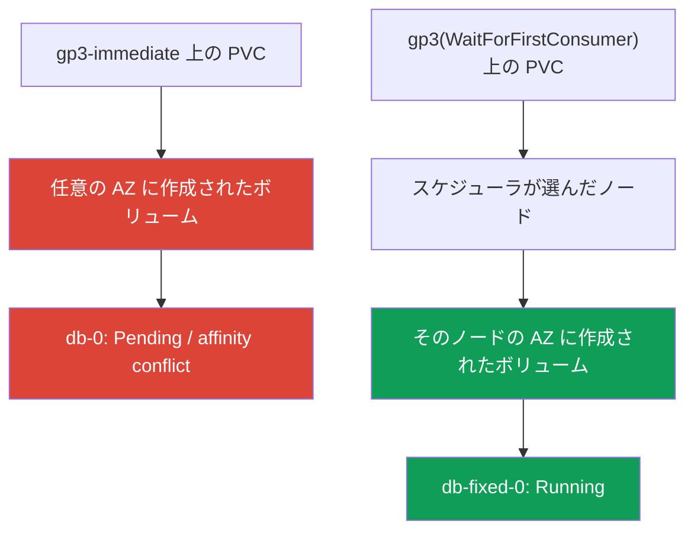
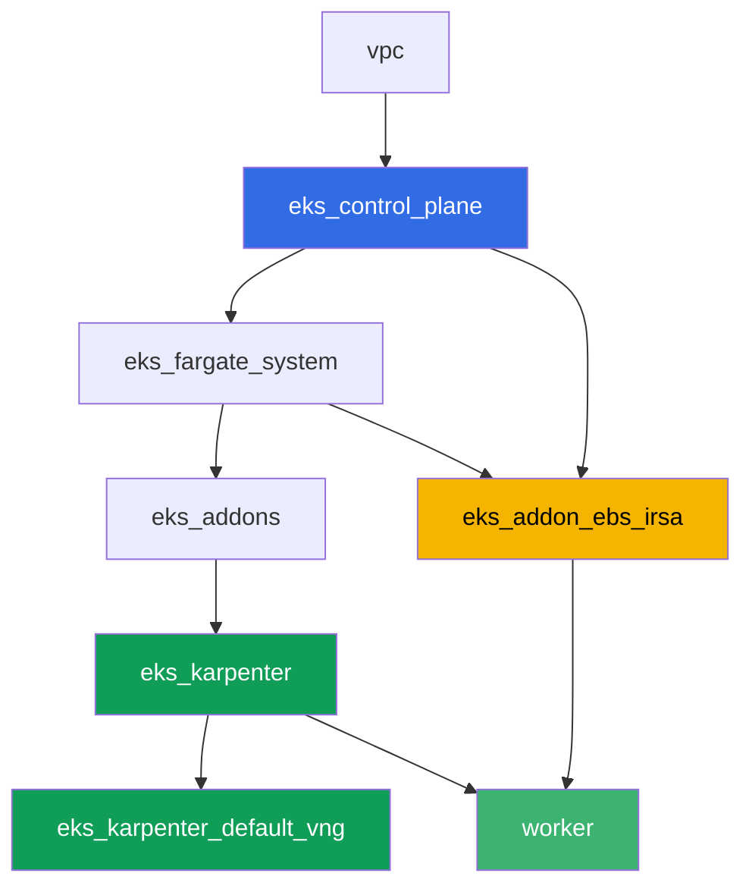

[Русская версия](README_RU.MD) · [Eng version](README.MD) · [Versión en español](README_ES.MD) · [Version française](README_FR.MD) · [Deutsche Version](README_DE.MD) · [ქართული ვერსია](README_GE.MD) · [繁體中文版](README_TW.MD)

# ラボ 106 - EBS CSI:gp3、AZ への紐付け、拡張、スナップショット

## 説明

EKS における EBS ブロックストレージについてのラボであり、StatefulSet を新しいクラスタに
移行するときにほぼ誰もが遭遇する典型的な失敗パターンを扱います:PVC はすでに作成され、
PV もすでに存在しているのに、Pod が `Pending` のまま止まってしまうというものです。原因は
StorageClass の `volumeBindingMode: Immediate` です。これにより、スケジューラがどの
ノードに Pod を配置するか決める前に、EBS ボリュームが任意のアベイラビリティゾーンに
作成されてしまいます。あなたはこの症状を再現し、`kubectl describe pod` とボリュームの
`nodeAffinity` を使って原因を突き止め、`volumeBindingMode: WaitForFirstConsumer` によって
修正します。その後、ボリュームのオンライン拡張と、スナップショットからの復元に進みます。

タスクは production スタイルで書かれています:短い課題文とアクセプタンス基準。検証は
`check_result` コマンドによって自動的に行われます。

## 目的

コースの以下の章の内容を定着させます:

- [第 23 章。EBS CSI:gp3、StorageClass、拡張、スナップショット、AZ への紐付け](../../course/23/ru.md) - このラボの中心となる内容
- [第 9 章。コンピュートの種類:managed node groups、Fargate、Auto Mode](../../course/09/ru.md) - クラスタに 2 つの AZ がある理由と、ノードがどこで動いているか
- [第 12 章。Karpenter:NodePool、consolidation、disruption](../../course/12/ru.md) - ボリュームを持つ Pod が AZ をまたいで移動しない理由
- [第 16-17 章。IRSA と Pod Identity](../../course/16/ru.md) - ドライバが `CreateVolume`/`CreateSnapshot` の権限をどのように取得するか

## 作成するもの

| オブジェクト | 何か | このラボでの目的 |
|--------|---------|-------------------|
| Namespace `eks-106` | ラボのワークロード用のクラスタ区画 | リソースを分離して保持する(第 4 章) |
| StorageClass `gp3-immediate` | `volumeBindingMode: Immediate` のクラス | 症状を捉える:ボリュームが任意の AZ に作成される(第 23 章) |
| StatefulSet `db`(1 レプリカ、ボリューム `5Gi`) | 壊れたクラス上のワークロード | `Pending`/`nodeAffinity` の競合を再現する(第 23 章) |
| アーティファクト `diagnosis.txt` | `describe pod` と `pv -o yaml` の出力、および説明 | 「運が良かった」と「確実に動く」の違いを記録する |
| StorageClass `gp3` | `volumeBindingMode: WaitForFirstConsumer` のクラス | EBS のための正しいプロビジョニングモード(第 23 章) |
| StatefulSet `db-fixed` | 修正済みクラス上の同じワークロード | Pod が `Running`、ボリュームのゾーンがノードのゾーンと一致する(第 23 章) |
| PVC の `10Gi` への拡張 | `kubectl patch pvc` | Pod を再作成せずに `gp3` を拡張する方法を学ぶ(第 23 章) |
| `VolumeSnapshot` と復元された PVC | ボリュームのスナップショットと、そこから作られた新しい PVC | スナップショットはリージョナルだが、復元されたボリュームは再びゾーナルであることを確認する(第 23 章) |

症状から修正までの流れ:



## インフラストラクチャ

環境は Terragrunt によって AWS(`eu-central-1`)にデプロイされます。ラボの各ディレクト
リは 1 つのコンポーネントであり、それぞれ独自の `terragrunt.hcl` を持ち、
`terraform/modules/` の共有モジュールを参照し、`dependency` ブロックで依存関係を宣言
します。Terragrunt は依存関係グラフを構築し、正しい順序でコンポーネントを適用します。
基盤はラボ 101 と同じ(control plane、システム Pod 用の Fargate、ワークロード用の
Karpenter)で、それに加えて EBS CSI 用の独立したコンポーネントがあります。

### モジュールと依存関係

| ディレクトリ(コンポーネント) | モジュール(`terraform/modules/`) | 依存先 | 作成されるもの |
|---------------------|-------------------------------|------------|-------------|
| `vpc` | `vpc_v3` | - | VPC `10.10.0.0/16`、2 つの AZ(`eu-central-1a`、`eu-central-1b`)のサブネット、NAT |
| `ssh-keys` | `ssh-keys` | - | ワーカーマシンとノード用の SSH キーペア |
| `eks_control_plane` | `eks_v2_control_plane` | `vpc` | EKS control plane `1.36`、OIDC、security groups |
| `eks_fargate_system` | `eks_v2_fargate` | `vpc`、`eks_control_plane` | `kube-system` と `karpenter` 用の Fargate profile |
| `eks_addons` | `eks_v2_addons` | `eks_control_plane`、`eks_fargate_system` | coredns、kube-proxy、vpc-cni、pod-identity、`snapshot-controller` |
| `eks_karpenter` | `eks_v2_karpenter` | `vpc`、`eks_control_plane`、`eks_addons`、`eks_fargate_system` | Karpenter コントローラ、ノードの IAM ロール |
| `eks_karpenter_default_vng` | `eks_v2_karpenter_vng` | `vpc`、`eks_control_plane`、`eks_karpenter` | AL2023 上のデフォルトの NodePool `default` |
| `eks_addon_ebs_irsa` | `eks_v2_ebs_irsa` | `eks_fargate_system`、`eks_control_plane` | managed addon `aws-ebs-csi-driver` と IRSA による IAM ロール |
| `worker` | `eks_v2_work_pc` | `ssh-keys`、`vpc`、`eks_control_plane`、`eks_karpenter`、`eks_addon_ebs_irsa` | kubectl、テスト、`check_result` を備えたワーカーマシン |

EBS ドライバ用のロールは、コンポーネント `eks_addon_ebs_irsa` によって IRSA(第 16-17
章)を通じてすでに設定済みです:タスクの中で改めて作成する必要はなく、最初の PVC を
作成する時点でドライバはすでに準備が整っています(`worker` は `eks_addon_ebs_irsa` に
依存しています)。

依存関係グラフ(先に適用されるものほど矢印の下側にある):



クラスタは 2 つの AZ 上に構築されています。これはこのラボの主要なシナリオにとって
重要です:`volumeBindingMode: Immediate` の状態で 2 つのゾーンがあると、ボリュームが
後で空きノードが見つかる場所とは違う場所に作成されるリスクが実際に生じます。

### どこで何が設定されるか

`env.hcl`(すべてのコンポーネントが読み込む共通の環境パラメータ):

| パラメータ | ラボでの値 | 影響範囲 |
|----------|-----------------|---------------|
| `region` | `eu-central-1` | すべてのリソースのリージョン |
| `subnets` | `eu-central-1a`/`eu-central-1b` のプライベートサブネット `eks1`/`eks2` | Karpenter がノードを立ち上げられるゾーン |
| `prefix` | `eks-task106` | リソース名とタグのプレフィックス |
| `stack_name` | `eks106` | ここから `env_name`(クラスタ名)が組み立てられる |
| `k8_version` | `1.36.0` | ワーカーマシン上の kubectl のバージョン |

各コンポーネントの `terragrunt.hcl` の `inputs`(そのモジュール固有のパラメータ):

| ファイル | 主な設定 |
|------|--------------------|
| `eks_addons/terragrunt.hcl` | 基本のアドオンに加えて `snapshot-controller`(`VolumeSnapshot` 用の CRD とコントローラ)が追加されている |
| `eks_addon_ebs_irsa/terragrunt.hcl` | managed addon `aws-ebs-csi-driver`、クラスタの `oidc_provider_arn` を使った IRSA によるロール |
| `worker/terragrunt.hcl` | ラボ 106 のファイルを指す `test_url` と `task_script_url`、`eks_addon_ebs_irsa` への依存 |

## デプロイ

```bash
TASK=106 make run_eks_task
```

デプロイには約 15-20 分かかります。出力の中からワーカーマシンへの SSH 接続の行を見つけ
て接続してください。そこでは kubectl が既に正しいクラスタ向けに設定されており、EBS CSI
ドライバも既にインストールされ、PVC を受け付けられる状態になっています。クラスタは
EC2 ノードが 0 個の状態で起動します(Fargate のみ)。そのため、タスクを始める前に、
ワーカーマシンが namespace `ebs-csi-warmup` 内のサービス用 Pod によって EC2 ノードを
ちょうど 1 個だけウォームアップします。これがないと、`volumeBindingMode: Immediate`
用にボリュームのゾーンを CSI ドライバが決定できず(タスク 3)、Karpenter も未紐付けの
Immediate PVC を持つ Pod のためにノードを立ち上げません。namespace `ebs-csi-warmup` は
ラボのタスクとは関係がなく、触る必要はありません。

ワーカーマシン上で使える便利なコマンド:

```bash
time_left       # 環境の残り時間
check_result    # 解答の確認
```

> 検証環境のセキュリティについて。`env.hcl` では `ssh_password_enable = true` と
> `access_cidrs = ["0.0.0.0/0"]` が有効になっています。学習用環境としては便利ですが、
> 本番環境ではこのようにしてはいけません。コースの標準(第 0.2、2、19 章)によれば、
> ワーカーマシンへのアクセスは公開 SSH ポートを外に出さずに AWS SSM Session Manager を
> 経由して開き、`access_cidrs` は具体的なアドレスに絞り込みます。ここでは、セットアップ
> を簡単にするためだけに公開 SSH を残しています。

## タスク

---
|        **1**        | **ラボのワークロード用の Namespace**                             |
| :-----------------: | :---------------------------------------------------------- |
| やること          | `eks-106` という名前の namespace を作成してください。ラボのすべてのオブジェクトはこの中に作成されます。 |
| アクセプタンス基準    | - namespace `eks-106` が存在する。 |
---
|        **2**        | **紐付けモードが壊れた StorageClass**              |
| :-----------------: | :---------------------------------------------------------- |
| やること          | StorageClass `gp3-immediate` を作成してください:`provisioner: ebs.csi.aws.com`、`volumeBindingMode: Immediate`、`allowVolumeExpansion: true`、`parameters.type: gp3`、`parameters.encrypted: "true"`。 |
| アクセプタンス基準    | - StorageClass `gp3-immediate` が存在する;<br/>- `provisioner: ebs.csi.aws.com`;<br/>- `volumeBindingMode: Immediate`。 |
---
|        **3**        | **壊れたクラス上の StatefulSet(症状を再現する)** |
| :-----------------: | :---------------------------------------------------------- |
| やること          | `eks-106` に StatefulSet `db` を作成してください。イメージは `viktoruj/ping_pong:latest`、レプリカ数は `1`、`volumeClaimTemplates` は名前 `data`、StorageClass `gp3-immediate`、要求サイズ `5Gi` です。`db-0` を観察してください:`Immediate` では PVC が現れた直後にボリュームが作成され、クラスタの 2 つの AZ のうち任意の一方に、スケジューラが Pod をどこに置くか決まる前に配置されます。2 つのゾーンを持つクラスタでは、Pod が `Pending`(ボリュームの `nodeAffinity` の競合)のままになることもあれば、ボリュームが偶然空きノードのあるゾーンに入った場合は `Running` になることもあります。この段階ではどちらの結果も許容されます - タスク 4 での原因分析はどちらの場合でも必須です。 |
| アクセプタンス基準    | - `eks-106` に StatefulSet `db`、イメージ `viktoruj/ping_pong`;<br/>- `volumeClaimTemplates` がクラス `gp3-immediate`、要求サイズ `5Gi`;<br/>- PVC `data-db-0` が作成されている。 |
---
|        **4**        | **診断:Immediate と AZ への紐付け**           |
| :-----------------: | :---------------------------------------------------------- |
| やること          | `db-0` のボリュームで何が起きたのかを、`Pending` か `Running` かに関わらず分析してください。`kubectl describe pod db-0 -n eks-106` の出力(`Events` セクション)を `/var/work/tests/artifacts/4/describe.txt` に、`kubectl get pv <pv> -o yaml`(PVC `data-db-0` のボリューム)の出力を `/var/work/tests/artifacts/4/pv.yaml` に保存してください。ファイル `/var/work/tests/artifacts/4/diagnosis.txt` に説明を記載してください:`volumeBindingMode: Immediate` が Pod のゾーンが分かる前にボリュームを作成してしまう理由、キー `topology.ebs.csi.aws.com/zone` を持つボリュームの `nodeAffinity` が何を意味するか、そして 2 つの AZ を持つクラスタでの `Running` が「確実に動く」ではなく「運が良かった」に過ぎない理由です。本文には `Immediate`、`nodeAffinity`、`zone` という単語を含める必要があります。 |
| アクセプタンス基準    | - ファイル `describe.txt` が空でない;<br/>- ファイル `pv.yaml` が空でない;<br/>- ファイル `diagnosis.txt` が空でなく、`Immediate`、`nodeAffinity`、`zone` を含む。 |
---
|        **5**        | **修正:WaitForFirstConsumer**                            |
| :-----------------: | :---------------------------------------------------------- |
| やること          | PVC は自分の StorageClass に一度だけ紐付けられるため、`gp3-immediate` にパッチを当てるのではなく、新しいクラスと新しい StatefulSet で修正する必要があります。StorageClass `gp3` を作成してください:`provisioner: ebs.csi.aws.com`、`volumeBindingMode: WaitForFirstConsumer`、`allowVolumeExpansion: true`、`parameters.type: gp3`、`parameters.encrypted: "true"`。StatefulSet `db-fixed`(同じイメージ、レプリカ数 `1`)を、クラス `gp3`、要求サイズ `5Gi` の `volumeClaimTemplates` で作成してください。`db-fixed-0` が `Running` になるまで待ち、ボリュームのゾーン(PV の `nodeAffinity`)が Pod のノードのゾーン(`topology.kubernetes.io/zone`)と一致することを確認してください。 |
| アクセプタンス基準    | - `volumeBindingMode: WaitForFirstConsumer` と `allowVolumeExpansion: true` を持つ StorageClass `gp3`;<br/>- Pod `db-fixed-0` が `Running`;<br/>- `nodeAffinity` から得られる PV のゾーンが Pod のノードのゾーンと一致する。 |
---
|        **6**        | **ボリュームのオンライン拡張**                                  |
| :-----------------: | :---------------------------------------------------------- |
| やること          | `kubectl patch pvc` を使って PVC `data-db-fixed-0` を `5Gi` から `10Gi` に拡張してください。`status.capacity.storage` が新しいサイズを示すまで待ってください。 |
| アクセプタンス基準    | - PVC `data-db-fixed-0` の `spec.resources.requests.storage` が `10Gi` である;<br/>- `status.capacity.storage` が `10Gi` である。 |
---
|        **7**        | **ボリュームのスナップショットと復元**                            |
| :-----------------: | :---------------------------------------------------------- |
| やること          | `VolumeSnapshotClass`(`driver: ebs.csi.aws.com`)と、`eks-106` 内で PVC `data-db-fixed-0` を参照する `VolumeSnapshot` `db-snap`(`spec.source.persistentVolumeClaimName`)を作成してください。`readyToUse: true` を待ってください。クラス `gp3` で `dataSource.kind: VolumeSnapshot`、`dataSource.name: db-snap`、`dataSource.apiGroup: snapshot.storage.k8s.io` を持つ新しい PVC `data-restored` を作成してください。EBS のスナップショットはリージョナルなオブジェクトですが、そこから復元されたボリュームは再びゾーナルになります:`WaitForFirstConsumer` のクラスでは、Pod がアクセスするまで PVC `data-restored` は `Pending` のままになり、これは想定どおりです。 |
| アクセプタンス基準    | - `VolumeSnapshot` `db-snap` が PVC `data-db-fixed-0` を参照している;<br/>- PVC `data-restored` が `dataSource.kind: VolumeSnapshot`、`dataSource.name: db-snap` を持つ。 |
---

## 結果の確認

ワーカーマシン上で自動チェックを実行してください:

```bash
check_result
```

スクリプトがテストを実行し、完了したタスクの割合を表示します。

## 解答

参考解答:[worker/files/solutions/1_JP.MD](worker/files/solutions/1_JP.MD)

## クラスタとリソースの削除

> **まず PVC とスナップショットを削除し、そのあとでクラスタを削除してください。** 動的
> PVC の背後にある EBS ボリュームは EBS CSI ドライバが作成し、PVC が削除された時点で
> (`reclaimPolicy: Delete` の場合)そのドライバが削除も行います。生きている PVC が
> 残った状態でクラスタを丸ごと削除すると、ドライバはもう存在しないため、ボリュームは
> アカウント内に `available` のまま永遠に残り、課金が続きます:terraform はそれらを
> 認識していません。`VolumeSnapshot` についても同様で、その背後には CSI ドライバが
> 削除する EBS スナップショットがあります。
>
> **スナップショットの削除順序が重要です。** PVC `data-restored` は `db-snap` から
> 復元されたものであり、この PVC が存在する限り、スナップショットには finalizer
> `snapshot.storage.kubernetes.io/volumesnapshot-as-source-protection` が付いたままに
> なります - `db-snap` は `Terminating` になるだけで、それ以上先には進みません。対称的
> に、元の PVC `data-db-fixed-0` にも、スナップショットが生きている間は
> `pvc-as-source-protection` が付いています。namespace をまるごと削除してすぐに
> `destroy` を実行すると、EBS スナップショットがクラスタより長く残ってアカウントに
> 残ってしまいます(実際の検証環境で確認済みです:ラボを実行した後、リージョンに
> 10 GiB のスナップショットが残っていました)。そのため、まずスナップショットから復元
> された PVC、次にスナップショット自体、それから残りのものを削除してください。

```bash
# 1. ワークロードを外す:Pod がボリュームを保持している間は PVC は削除されない
kubectl delete statefulset --all -n eks-106 --ignore-not-found
kubectl delete pod --all -n eks-106 --ignore-not-found

# 2. スナップショットから復元された PVC - db-snap に finalizer を保持している
kubectl delete pvc data-restored -n eks-106 --ignore-not-found

# 3. スナップショット:背後の EBS スナップショットは CSI ドライバが削除する(deletionPolicy: Delete)
kubectl delete volumesnapshot db-snap -n eks-106 --ignore-not-found
kubectl wait --for=delete volumesnapshot/db-snap -n eks-106 --timeout=300s 2>/dev/null || true
kubectl get volumesnapshot -n eks-106

# 4. 残りの PVC:volumeClaimTemplates によるものは StatefulSet と一緒には削除されない
kubectl delete pvc --all -n eks-106 --ignore-not-found
kubectl delete namespace eks-106 --ignore-not-found

# 5. Karpenter が自分の EC2 ノードを取り除くまで待つ
while kubectl get nodes --no-headers 2>/dev/null | grep -qv fargate; do
  echo "Karpenter の EC2 ノードはまだ残っています、待機中..."; sleep 15
done
```

`db-snap` が `Terminating` のまま止まっている場合、まだ何らかの PVC がそれを参照して
いることを意味します - `dataSource` からそれを見つけて削除してください。finalizer を
手動で外す必要はありません:

```bash
kubectl get pvc -n eks-106 \
  -o custom-columns=NAME:.metadata.name,SOURCE:.spec.dataSource.name
kubectl get volumesnapshot db-snap -n eks-106 -o jsonpath='{.metadata.finalizers}'
```

`destroy` の前に、ラボの後にボリュームやスナップショットが残っていないことを確認して
ください。PVC のボリュームには `kubernetes.io/created-for/pvc/name` タグが、CSI
ドライバによるスナップショットには `CSIVolumeSnapshotName` タグが付いています。両方の
リストが空であるべきです:

```bash
aws ec2 describe-volumes --filters Name=status,Values=available \
  --query 'Volumes[].[VolumeId,Size,Tags[?Key==`kubernetes.io/created-for/pvc/name`]|[0].Value]' \
  --output table
aws ec2 describe-snapshots --owner-ids self \
  --filters Name=tag-key,Values=CSIVolumeSnapshotName \
  --query 'Snapshots[].[SnapshotId,VolumeSize,StartTime]' --output table
# 何か残っていれば手動で削除する - terraform はこれらのオブジェクトを認識しない
aws ec2 delete-volume --volume-id <vol-id>
aws ec2 delete-snapshot --snapshot-id <snap-id>
```

```bash
TASK=106 make delete_eks_task
```
