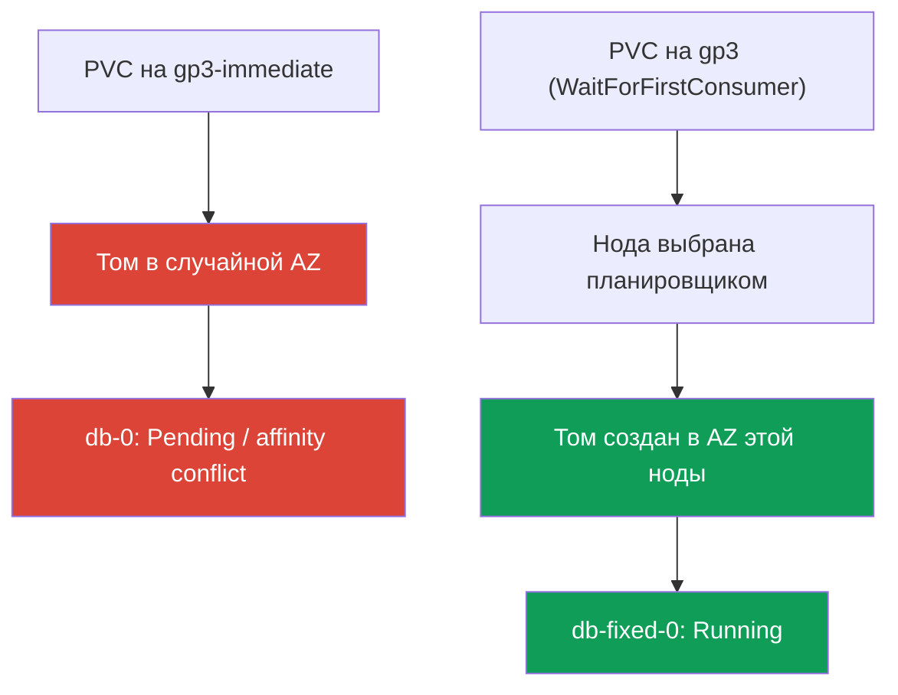
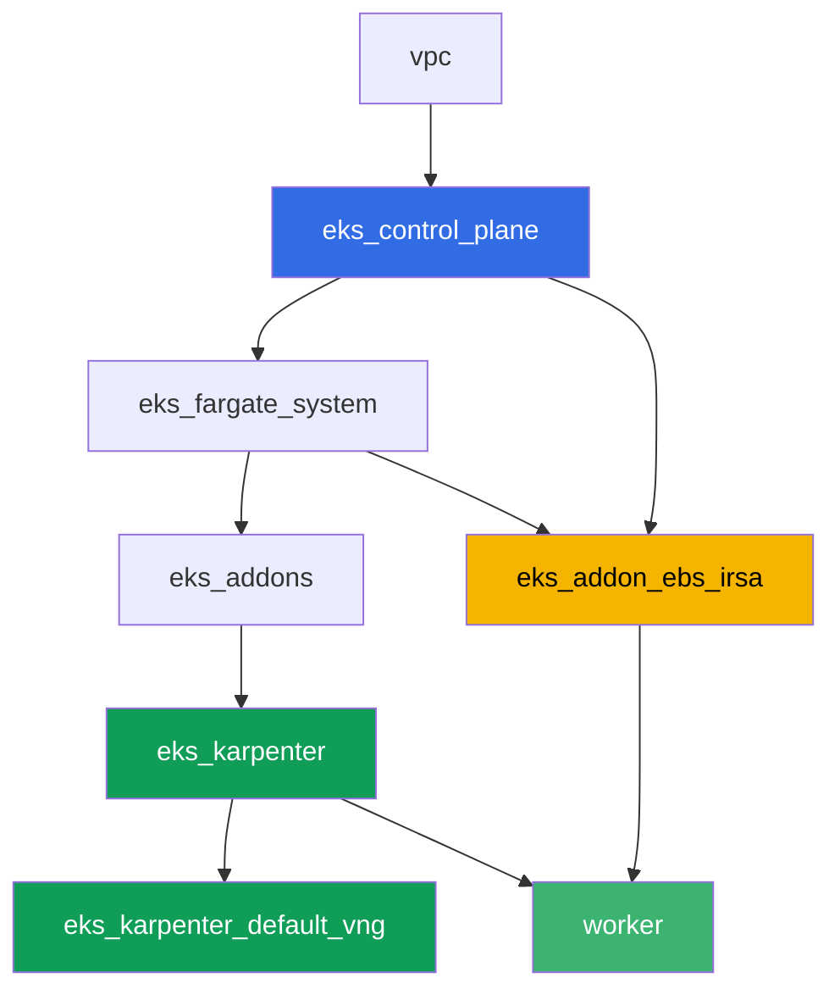

# Лаба 106 - EBS CSI: gp3, привязка к AZ, расширение, снапшот

## Описание

Лаба про блочное хранилище EBS в EKS и про типовую ошибку, с которой сталкивается
почти каждый, кто переносит StatefulSet на свежий кластер: под висит в `Pending`, хотя
PVC уже создан и PV уже существует. Причина - `volumeBindingMode: Immediate` у
StorageClass, из-за которого том EBS создаётся в случайной зоне доступности раньше, чем
планировщик решил, куда поедет под. Вы воспроизведёте этот симптом, разберёте его через
`kubectl describe pod` и `nodeAffinity` тома, а затем исправите через
`volumeBindingMode: WaitForFirstConsumer`. Дальше - расширение тома на лету и снапшот с
восстановлением.

Задания в продакшн-стиле: короткая постановка плюс критерии приёмки. Проверка -
автоматическая, командой `check_result`.

## Цель

Закрепить материал глав курса:

- [Глава 23. EBS CSI: gp3, StorageClass, расширение, снапшоты, привязка к AZ](../../course/23/ru.md) - основной материал лабы
- [Глава 9. Типы вычислений: managed node groups, Fargate, Auto Mode](../../course/09/ru.md) - почему в кластере две AZ и где живут ноды
- [Глава 12. Karpenter: NodePool, consolidation, disruption](../../course/12/ru.md) - почему консолидация не двигает под между AZ, если у него есть том
- [Главы 16-17. IRSA и Pod Identity](../../course/16/ru.md) - как драйвер получает право на `CreateVolume`/`CreateSnapshot`

## Что мы создаём

| Объект | Что это | Зачем в этой лабе |
|--------|---------|-------------------|
| Namespace `eks-106` | раздел кластера под нагрузку лабы | держим ресурсы отдельно (глава 4) |
| StorageClass `gp3-immediate` | класс с `volumeBindingMode: Immediate` | ловим симптом: том в случайной AZ (глава 23) |
| StatefulSet `db` (1 реплика, том `5Gi`) | нагрузка на сломанном классе | воспроизводим `Pending`/конфликт `nodeAffinity` (глава 23) |
| Артефакт `diagnosis.txt` | вывод `describe pod` и `pv -o yaml` плюс объяснение | фиксируем разницу «повезло» и «работает гарантированно» |
| StorageClass `gp3` | класс с `volumeBindingMode: WaitForFirstConsumer` | правильный режим провижининга для EBS (глава 23) |
| StatefulSet `db-fixed` | та же нагрузка на исправленном классе | под `Running`, зона тома равна зоне ноды (глава 23) |
| Расширение PVC до `10Gi` | `kubectl patch pvc` | учимся расширять `gp3` без пересоздания пода (глава 23) |
| `VolumeSnapshot` и восстановленный PVC | снапшот тома и новый PVC из него | видим, что снапшот региональный, а восстановленный том снова зональный (глава 23) |

Путь от симптома до починки:



## Инфраструктура

Окружение разворачивается в AWS (`eu-central-1`) через Terragrunt. Каждый каталог лабы -
это один компонент со своим `terragrunt.hcl`, который ссылается на общий модуль в
`terraform/modules/` и объявляет зависимости через блоки `dependency`. Terragrunt строит
граф зависимостей и применяет компоненты в правильном порядке. База - та же, что в лабе
101 (control plane, Fargate под системные поды, Karpenter под нагрузку), плюс отдельный
компонент под EBS CSI.

### Модули и зависимости

| Каталог (компонент) | Модуль (`terraform/modules/`) | Зависит от | Что создаёт |
|---------------------|-------------------------------|------------|-------------|
| `vpc` | `vpc_v3` | - | VPC `10.10.0.0/16`, подсети в двух AZ (`eu-central-1a`, `eu-central-1b`), NAT |
| `ssh-keys` | `ssh-keys` | - | пара SSH-ключей для рабочей машины и нод |
| `eks_control_plane` | `eks_v2_control_plane` | `vpc` | control plane EKS `1.36`, OIDC, security groups |
| `eks_fargate_system` | `eks_v2_fargate` | `vpc`, `eks_control_plane` | Fargate-профиль для `kube-system` и `karpenter` |
| `eks_addons` | `eks_v2_addons` | `eks_control_plane`, `eks_fargate_system` | coredns, kube-proxy, vpc-cni, pod-identity, `snapshot-controller` |
| `eks_karpenter` | `eks_v2_karpenter` | `vpc`, `eks_control_plane`, `eks_addons`, `eks_fargate_system` | контроллер Karpenter, IAM-роль нод |
| `eks_karpenter_default_vng` | `eks_v2_karpenter_vng` | `vpc`, `eks_control_plane`, `eks_karpenter` | дефолтный NodePool `default` на AL2023 |
| `eks_addon_ebs_irsa` | `eks_v2_ebs_irsa` | `eks_fargate_system`, `eks_control_plane` | managed addon `aws-ebs-csi-driver` и IAM-роль через IRSA |
| `worker` | `eks_v2_work_pc` | `ssh-keys`, `vpc`, `eks_control_plane`, `eks_karpenter`, `eks_addon_ebs_irsa` | рабочая машина с kubectl, тестами и `check_result` |

Роль для драйвера EBS уже настроена компонентом `eks_addon_ebs_irsa` через IRSA (главы
16-17): создавать её заново в заданиях не нужно, драйвер готов к моменту, когда вы
создаёте первый PVC (`worker` зависит от `eks_addon_ebs_irsa`).

Граф зависимостей (что применяется раньше, то ниже по стрелке):



Кластер поднят в двух AZ - это важно для основного сценария лабы: с
`volumeBindingMode: Immediate` в двух зонах реально возникает риск, что том создастся не
там, где потом окажется свободная нода.

### Где что настраивается

`env.hcl` (общие параметры окружения, читаются всеми компонентами):

| Параметр | Значение в лабе | На что влияет |
|----------|-----------------|---------------|
| `region` | `eu-central-1` | регион всех ресурсов |
| `subnets` | приватные `eks1`/`eks2` в `eu-central-1a`/`eu-central-1b` | зоны, куда Karpenter может поднять ноду |
| `prefix` | `eks-task106` | префикс имён ресурсов и тегов |
| `stack_name` | `eks106` | из него собирается `env_name` - имя кластера |
| `k8_version` | `1.36.0` | версия kubectl на рабочей машине |

`inputs` в `terragrunt.hcl` каждого компонента (параметры конкретного модуля):

| Файл | Ключевые настройки |
|------|--------------------|
| `eks_addons/terragrunt.hcl` | помимо базовых аддонов добавлен `snapshot-controller` (CRD и контроллер для `VolumeSnapshot`) |
| `eks_addon_ebs_irsa/terragrunt.hcl` | managed addon `aws-ebs-csi-driver`, роль через IRSA на `oidc_provider_arn` кластера |
| `worker/terragrunt.hcl` | `test_url` и `task_script_url` на файлы лабы 106, зависимость от `eks_addon_ebs_irsa` |

## Развёртывание

```bash
TASK=106 make run_eks_task
```

Развёртывание занимает примерно 15-20 минут. В выводе найдите строку с SSH-подключением к
рабочей машине и подключитесь к ней. kubectl там уже настроен на нужный кластер, драйвер
EBS CSI уже установлен и готов принимать PVC. Кластер стартует с нулём EC2-нод (только
Fargate), поэтому перед началом заданий рабочая машина прогревает ровно одну EC2-ноду
служебным подом в namespace `ebs-csi-warmup` - без этого CSI-драйвер не может определить
зону тома для `volumeBindingMode: Immediate` (задание 3), а Karpenter не поднимает ноду
под под с непривязанным Immediate PVC. Namespace `ebs-csi-warmup` не относится к заданиям
лабы, трогать его не нужно.

Полезные команды на рабочей машине:

```bash
time_left       # сколько осталось времени окружения
check_result    # проверить решение
```

> Безопасность стенда. В `env.hcl` включены `ssh_password_enable = true` и
> `access_cidrs = ["0.0.0.0/0"]` - это удобно для учебного окружения, но так делать в
> продакшене нельзя. По стандартам курса (главы 0.2, 2, 19) доступ к рабочим машинам
> открывают через AWS SSM Session Manager без публичных SSH-портов наружу, а `access_cidrs`
> сужают до конкретных адресов. Здесь публичный SSH оставлен только ради простоты запуска.

## Задания

---
|        **1**        | **Namespace для нагрузки лабы**                             |
| :-----------------: | :---------------------------------------------------------- |
| Что делаем          | Создайте namespace с именем `eks-106`. Все объекты лабы создаются внутри него. |
| Критерии приёмки    | - namespace `eks-106` существует. |
---
|        **2**        | **StorageClass со сломанным режимом привязки**              |
| :-----------------: | :---------------------------------------------------------- |
| Что делаем          | Создайте StorageClass `gp3-immediate`: `provisioner: ebs.csi.aws.com`, `volumeBindingMode: Immediate`, `allowVolumeExpansion: true`, `parameters.type: gp3`, `parameters.encrypted: "true"`. |
| Критерии приёмки    | - StorageClass `gp3-immediate` существует;<br/>- `provisioner: ebs.csi.aws.com`;<br/>- `volumeBindingMode: Immediate`. |
---
|        **3**        | **StatefulSet на сломанном классе (воспроизводим симптом)** |
| :-----------------: | :---------------------------------------------------------- |
| Что делаем          | В `eks-106` создайте StatefulSet `db`, образ `viktoruj/ping_pong:latest`, `1` реплика, `volumeClaimTemplates` с именем `data` на StorageClass `gp3-immediate`, запрос `5Gi`. Понаблюдайте за `db-0`: с `Immediate` том создаётся сразу после появления PVC, в произвольной из двух AZ кластера, до того как известно, куда планировщик поставит под. В кластере из двух зон под может остаться в `Pending` (конфликт `nodeAffinity` тома) или, если том случайно попал в ту же зону, где есть свободная нода, перейти в `Running`. Любой из этих исходов допустим на этом шаге - разбор в задании 4 обязателен в обоих случаях. |
| Критерии приёмки    | - StatefulSet `db` в `eks-106`, образ `viktoruj/ping_pong`;<br/>- `volumeClaimTemplates` на класс `gp3-immediate`, запрос `5Gi`;<br/>- PVC `data-db-0` создан. |
---
|        **4**        | **Диагностика: Immediate против привязки к зоне**           |
| :-----------------: | :---------------------------------------------------------- |
| Что делаем          | Разберите, что произошло с томом `db-0`, независимо от того, `Pending` он или `Running`. Сохраните `kubectl describe pod db-0 -n eks-106` (секцию `Events`) в `/var/work/tests/artifacts/4/describe.txt` и `kubectl get pv <pv> -o yaml` (том PVC `data-db-0`) в `/var/work/tests/artifacts/4/pv.yaml`. В файл `/var/work/tests/artifacts/4/diagnosis.txt` запишите объяснение: почему `volumeBindingMode: Immediate` создаёт том раньше, чем известна зона пода, что означает `nodeAffinity` тома с ключом `topology.ebs.csi.aws.com/zone`, и почему `Running` в кластере с двумя AZ - это «повезло», а не «работает гарантированно». В тексте должны быть слова `Immediate`, `nodeAffinity` и `zone` (или `зона`). |
| Критерии приёмки    | - файл `describe.txt` не пуст;<br/>- файл `pv.yaml` не пуст;<br/>- файл `diagnosis.txt` не пуст и содержит `Immediate`, `nodeAffinity`, `zone`/`зона`. |
---
|        **5**        | **Починка: WaitForFirstConsumer**                            |
| :-----------------: | :---------------------------------------------------------- |
| Что делаем          | PVC привязывается к своему StorageClass один раз, поэтому чинить нужно новым классом и новым StatefulSet, а не патчем `gp3-immediate`. Создайте StorageClass `gp3`: `provisioner: ebs.csi.aws.com`, `volumeBindingMode: WaitForFirstConsumer`, `allowVolumeExpansion: true`, `parameters.type: gp3`, `parameters.encrypted: "true"`. Создайте StatefulSet `db-fixed` (тот же образ, `1` реплика) с `volumeClaimTemplates` на класс `gp3`, запрос `5Gi`. Дождитесь, пока `db-fixed-0` перейдёт в `Running`, и убедитесь, что зона тома (`nodeAffinity` PV) совпадает с зоной ноды пода (`topology.kubernetes.io/zone`). |
| Критерии приёмки    | - StorageClass `gp3` с `volumeBindingMode: WaitForFirstConsumer` и `allowVolumeExpansion: true`;<br/>- под `db-fixed-0` в `Running`;<br/>- зона PV из `nodeAffinity` совпадает с зоной ноды пода. |
---
|        **6**        | **Расширение тома на лету**                                  |
| :-----------------: | :---------------------------------------------------------- |
| Что делаем          | Увеличьте PVC `data-db-fixed-0` с `5Gi` до `10Gi` через `kubectl patch pvc`. Дождитесь, пока `status.capacity.storage` подтвердит новый размер. |
| Критерии приёмки    | - `spec.resources.requests.storage` PVC `data-db-fixed-0` равен `10Gi`;<br/>- `status.capacity.storage` равен `10Gi`. |
---
|        **7**        | **Снапшот тома и восстановление**                            |
| :-----------------: | :---------------------------------------------------------- |
| Что делаем          | Создайте `VolumeSnapshotClass` (`driver: ebs.csi.aws.com`) и `VolumeSnapshot` `db-snap` в `eks-106`, ссылающийся на PVC `data-db-fixed-0` (`spec.source.persistentVolumeClaimName`). Дождитесь `readyToUse: true`. Создайте новый PVC `data-restored` на класс `gp3` с `dataSource.kind: VolumeSnapshot`, `dataSource.name: db-snap`, `dataSource.apiGroup: snapshot.storage.k8s.io`. Снапшот EBS - региональный объект, но восстановленный из него том снова зональный: с классом `WaitForFirstConsumer` PVC `data-restored` останется в `Pending`, пока к нему не обратится под, и это ожидаемо. |
| Критерии приёмки    | - `VolumeSnapshot` `db-snap` ссылается на PVC `data-db-fixed-0`;<br/>- PVC `data-restored` имеет `dataSource.kind: VolumeSnapshot`, `dataSource.name: db-snap`. |
---

## Проверка результата

На рабочей машине запустите автоматическую проверку:

```bash
check_result
```

Скрипт прогонит тесты и покажет процент выполненных заданий.

## Решение

Эталонное решение: [worker/files/solutions/1.MD](worker/files/solutions/1.MD)

## Удаление кластера и ресурсов

> **Сначала удалите PVC и снапшоты, потом кластер.** Тома EBS за динамическими PVC создаёт
> драйвер EBS CSI, и удаляет их тоже он - по факту удаления PVC (при `reclaimPolicy: Delete`).
> Если снести кластер вместе с живыми PVC, драйвера уже не будет, и тома останутся в аккаунте
> `available` навсегда, продолжая тарифицироваться: terraform о них не знает. То же с
> `VolumeSnapshot` - за ним стоит снапшот EBS, который удаляет CSI-драйвер.
>
> **Порядок удаления снапшота важен.** PVC `data-restored` восстановлен из `db-snap`, и пока
> этот PVC существует, на снапшоте висит finalizer
> `snapshot.storage.kubernetes.io/volumesnapshot-as-source-protection` - `db-snap` уйдёт
> только в `Terminating` и никуда дальше. Симметрично: на исходном PVC `data-db-fixed-0`
> стоит `pvc-as-source-protection`, пока жив снапшот. Если удалить namespace целиком и сразу
> запустить `destroy`, снапшот EBS переживёт кластер и останется в аккаунте (проверено на
> живом стенде: после прогона лабы в регионе нашёлся снапшот на 10 GiB). Поэтому сначала PVC,
> восстановленный из снапшота, потом сам снапшот, и только потом всё остальное.

```bash
# 1. Снять нагрузку: пока под держит том, PVC не удалится
kubectl delete statefulset --all -n eks-106 --ignore-not-found
kubectl delete pod --all -n eks-106 --ignore-not-found

# 2. PVC, восстановленный из снапшота - он держит finalizer на db-snap
kubectl delete pvc data-restored -n eks-106 --ignore-not-found

# 3. Снапшот: за ним стоит снапшот EBS, его удаляет CSI-драйвер (deletionPolicy: Delete)
kubectl delete volumesnapshot db-snap -n eks-106 --ignore-not-found
kubectl wait --for=delete volumesnapshot/db-snap -n eks-106 --timeout=300s 2>/dev/null || true
kubectl get volumesnapshot -n eks-106

# 4. Остальные PVC: от volumeClaimTemplates они НЕ удаляются вместе со StatefulSet
kubectl delete pvc --all -n eks-106 --ignore-not-found
kubectl delete namespace eks-106 --ignore-not-found

# 5. Дождаться, пока Karpenter уберёт свои EC2-ноды
while kubectl get nodes --no-headers 2>/dev/null | grep -qv fargate; do
  echo "EC2-нода Karpenter ещё жива, ждём..."; sleep 15
done
```

Если `db-snap` застрял в `Terminating`, значит на него всё ещё ссылается какой-то PVC -
найдите его по `dataSource` и удалите, снимать finalizer руками не нужно:

```bash
kubectl get pvc -n eks-106 \
  -o custom-columns=NAME:.metadata.name,SOURCE:.spec.dataSource.name
kubectl get volumesnapshot db-snap -n eks-106 -o jsonpath='{.metadata.finalizers}'
```

Перед `destroy` убедитесь, что за лабой не осталось ни томов, ни снапшотов: тома от PVC
помечены тегом `kubernetes.io/created-for/pvc/name`, снапшоты от CSI-драйвера - тегом
`CSIVolumeSnapshotName`. Оба списка должны быть пустыми:

```bash
aws ec2 describe-volumes --filters Name=status,Values=available \
  --query 'Volumes[].[VolumeId,Size,Tags[?Key==`kubernetes.io/created-for/pvc/name`]|[0].Value]' \
  --output table
aws ec2 describe-snapshots --owner-ids self \
  --filters Name=tag-key,Values=CSIVolumeSnapshotName \
  --query 'Snapshots[].[SnapshotId,VolumeSize,StartTime]' --output table
# если что-то осталось - удалить вручную, terraform эти объекты не видит
aws ec2 delete-volume --volume-id <vol-id>
aws ec2 delete-snapshot --snapshot-id <snap-id>
```

```bash
TASK=106 make delete_eks_task
```
