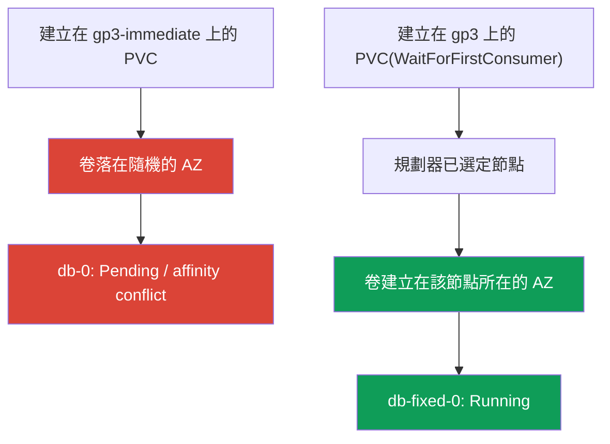
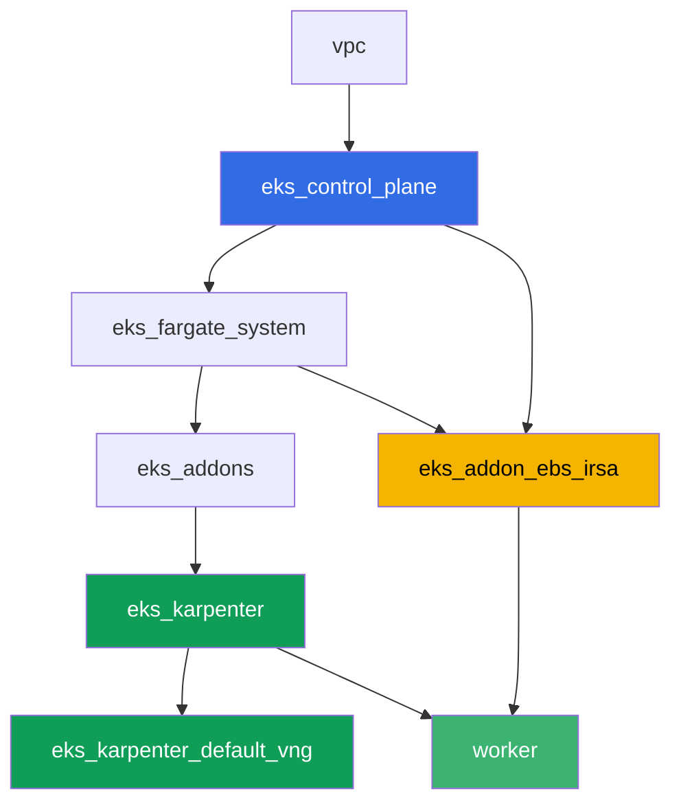

[Русская версия](README_RU.MD) · [Eng version](README.MD) · [Versión en español](README_ES.MD) · [Version française](README_FR.MD) · [Deutsche Version](README_DE.MD) · [ქართული ვერსია](README_GE.MD) · [日本語版](README_JP.MD)

# 實驗 106 - EBS CSI: gp3、AZ 綁定、擴容、快照

## 說明

這個實驗講的是 EKS 中的 EBS 區塊儲存,以及幾乎每個把 StatefulSet 遷移到新集群的人都會
遇到的典型錯誤:PVC 已經創建、PV 也已經存在,但 Pod 卻卡在 `Pending`。原因是
StorageClass 上的 `volumeBindingMode: Immediate`,它會導致 EBS 卷在規劃器決定 Pod 該去
哪之前,就在隨機的可用區中被創建出來。你會重現這個症狀,透過 `kubectl describe pod` 和
卷的 `nodeAffinity` 來分析它,然後用 `volumeBindingMode: WaitForFirstConsumer` 修復。之
後還有卷的線上擴容以及快照與還原。

任務以生產風格編寫:簡短的任務描述加驗收標準。驗證是自動的,透過 `check_result` 命令
完成。

## 目標

鞏固以下課程章節的內容:

- [第 23 章。EBS CSI: gp3、StorageClass、擴容、快照、AZ 綁定](../../course/23/ru.md) - 這個實驗的主要內容
- [第 9 章。計算類型:managed node groups、Fargate、Auto Mode](../../course/09/ru.md) - 為什麼集群有兩個 AZ,以及節點在哪裡運行
- [第 12 章。Karpenter: NodePool、consolidation、disruption](../../course/12/ru.md) - 為什麼 consolidation 不會在 Pod 有卷的情況下把它移到別的 AZ
- [第 16-17 章。IRSA 與 Pod Identity](../../course/16/ru.md) - 驅動程式如何取得 `CreateVolume`/`CreateSnapshot` 的權限

## 我們要創建什麼

| 對象 | 這是什麼 | 在這個實驗中的作用 |
|--------|---------|-------------------|
| Namespace `eks-106` | 供實驗負載使用的集群區域 | 讓資源保持隔離(第 4 章) |
| StorageClass `gp3-immediate` | 帶有 `volumeBindingMode: Immediate` 的類別 | 捕捉症狀:卷落在隨機的 AZ(第 23 章) |
| StatefulSet `db`(1 個副本,卷 `5Gi`) | 建立在故障類別上的負載 | 重現 `Pending`/`nodeAffinity` 衝突(第 23 章) |
| 產物 `diagnosis.txt` | `describe pod` 與 `pv -o yaml` 的輸出加上說明 | 記錄「運氣好」與「保證可行」之間的差異 |
| StorageClass `gp3` | 帶有 `volumeBindingMode: WaitForFirstConsumer` 的類別 | EBS 正確的供應模式(第 23 章) |
| StatefulSet `db-fixed` | 建立在修復後類別上的同一個負載 | Pod 為 `Running`,卷所在的 AZ 等於節點所在的 AZ(第 23 章) |
| PVC 擴容到 `10Gi` | `kubectl patch pvc` | 學習在不重建 Pod 的情況下擴容 `gp3`(第 23 章) |
| `VolumeSnapshot` 與還原後的 PVC | 卷的快照以及從中創建的新 PVC | 觀察到快照是區域性的,但還原後的卷仍然是分區的(第 23 章) |

從症狀到修復的路徑:



## 基礎設施

環境透過 Terragrunt 部署在 AWS(`eu-central-1`)。實驗中的每個目錄都是一個組件,擁有
自己的 `terragrunt.hcl`,它引用 `terraform/modules/` 中的共用模組,並透過 `dependency`
區塊聲明依賴關係。Terragrunt 會構建依賴關係圖並按正確的順序套用各個組件。基礎與實驗
101 相同(control plane、Fargate 承載系統 Pod、Karpenter 承載負載),另外再加上一個獨立
的 EBS CSI 組件。

### 模組與依賴關係

| 目錄(組件) | 模組(`terraform/modules/`) | 依賴於 | 創建了什麼 |
|---------------------|-------------------------------|------------|-------------|
| `vpc` | `vpc_v3` | - | VPC `10.10.0.0/16`,兩個 AZ 中的子網(`eu-central-1a`、`eu-central-1b`),NAT |
| `ssh-keys` | `ssh-keys` | - | 供工作機與節點使用的一對 SSH 金鑰 |
| `eks_control_plane` | `eks_v2_control_plane` | `vpc` | EKS control plane `1.36`、OIDC、security groups |
| `eks_fargate_system` | `eks_v2_fargate` | `vpc`、`eks_control_plane` | `kube-system` 與 `karpenter` 的 Fargate 配置檔 |
| `eks_addons` | `eks_v2_addons` | `eks_control_plane`、`eks_fargate_system` | coredns、kube-proxy、vpc-cni、pod-identity、`snapshot-controller` |
| `eks_karpenter` | `eks_v2_karpenter` | `vpc`、`eks_control_plane`、`eks_addons`、`eks_fargate_system` | Karpenter 控制器、節點 IAM 角色 |
| `eks_karpenter_default_vng` | `eks_v2_karpenter_vng` | `vpc`、`eks_control_plane`、`eks_karpenter` | 建立在 AL2023 上的預設 NodePool `default` |
| `eks_addon_ebs_irsa` | `eks_v2_ebs_irsa` | `eks_fargate_system`、`eks_control_plane` | managed addon `aws-ebs-csi-driver` 以及透過 IRSA 建立的 IAM 角色 |
| `worker` | `eks_v2_work_pc` | `ssh-keys`、`vpc`、`eks_control_plane`、`eks_karpenter`、`eks_addon_ebs_irsa` | 帶有 kubectl、測試腳本和 `check_result` 的工作機 |

EBS 驅動程式所需的角色已經由組件 `eks_addon_ebs_irsa` 透過 IRSA(第 16-17 章)配置好:
在任務中不需要重新創建,當你創建第一個 PVC 時驅動程式已經就緒了(`worker` 依賴於
`eks_addon_ebs_irsa`)。

依賴關係圖(較早套用的組件位於箭頭下方):



集群建立在兩個 AZ 中 - 這對於這個實驗的主要情境很重要:在 `volumeBindingMode: Immediate`
的情況下,兩個區域確實存在卷建立的位置和後續有空閒節點的位置不一致的風險。

### 各項設定在哪裡配置

`env.hcl`(所有組件共用並讀取的環境參數):

| 參數 | 實驗中的值 | 影響什麼 |
|----------|-----------------|---------------|
| `region` | `eu-central-1` | 所有資源的區域 |
| `subnets` | `eu-central-1a`/`eu-central-1b` 中的私有子網 `eks1`/`eks2` | Karpenter 可以在哪些區域建立節點 |
| `prefix` | `eks-task106` | 資源名稱與標籤的前綴 |
| `stack_name` | `eks106` | 用於構建 `env_name` - 集群名稱 |
| `k8_version` | `1.36.0` | 工作機上 kubectl 的版本 |

每個組件 `terragrunt.hcl` 中的 `inputs`(該模組特定的參數):

| 檔案 | 關鍵設定 |
|------|--------------------|
| `eks_addons/terragrunt.hcl` | 除了基礎附加元件外,還加入了 `snapshot-controller`(供 `VolumeSnapshot` 使用的 CRD 與控制器) |
| `eks_addon_ebs_irsa/terragrunt.hcl` | managed addon `aws-ebs-csi-driver`,角色透過 IRSA 建立在集群的 `oidc_provider_arn` 上 |
| `worker/terragrunt.hcl` | 指向實驗 106 檔案的 `test_url` 與 `task_script_url`,依賴於 `eks_addon_ebs_irsa` |

## 部署

```bash
TASK=106 make run_eks_task
```

部署大約需要 15-20 分鐘。在輸出中找到連接工作機的 SSH 那一行並連接上去。kubectl 在那
裡已經配置好指向正確的集群,EBS CSI 驅動程式已經安裝好並準備接收 PVC。集群啟動時沒有
任何 EC2 節點(只有 Fargate),因此在開始任務之前,工作機會在 namespace
`ebs-csi-warmup` 中用一個服務用 Pod 預先加熱恰好一個 EC2 節點 - 否則 CSI 驅動程式無法
為 `volumeBindingMode: Immediate`(任務 3)確定卷的區域,而 Karpenter 也不會為一個帶有
未綁定 Immediate PVC 的 Pod 建立節點。Namespace `ebs-csi-warmup` 與實驗任務無關,不需要
去動它。

工作機上的常用命令:

```bash
time_left       # 環境剩餘的時間
check_result    # 檢查解答
```

> 測試環境的安全性。`env.hcl` 中啟用了 `ssh_password_enable = true` 和
> `access_cidrs = ["0.0.0.0/0"]` - 這對於學習環境很方便,但在生產環境中不應該這樣做。
> 依照課程標準(第 0.2、2、19 章),對工作機的存取應透過 AWS SSM Session Manager 進行,
> 不對外暴露公開的 SSH 端口,並將 `access_cidrs` 限制到具體的位址。這裡保留公開 SSH 只
> 是為了簡化啟動流程。

## 任務

---
|        **1**        | **供實驗負載使用的 Namespace**                             |
| :-----------------: | :---------------------------------------------------------- |
| 我們要做什麼          | 創建一個名為 `eks-106` 的 namespace。實驗中的所有對象都在其中創建。 |
| 驗收標準    | - namespace `eks-106` 存在。 |
---
|        **2**        | **綁定模式故障的 StorageClass**              |
| :-----------------: | :---------------------------------------------------------- |
| 我們要做什麼          | 創建 StorageClass `gp3-immediate`:`provisioner: ebs.csi.aws.com`、`volumeBindingMode: Immediate`、`allowVolumeExpansion: true`、`parameters.type: gp3`、`parameters.encrypted: "true"`。 |
| 驗收標準    | - StorageClass `gp3-immediate` 存在;<br/>- `provisioner: ebs.csi.aws.com`;<br/>- `volumeBindingMode: Immediate`。 |
---
|        **3**        | **建立在故障類別上的 StatefulSet(重現症狀)** |
| :-----------------: | :---------------------------------------------------------- |
| 我們要做什麼          | 在 `eks-106` 中創建 StatefulSet `db`,映像 `viktoruj/ping_pong:latest`,`1` 個副本,`volumeClaimTemplates` 名稱為 `data`,建立在 StorageClass `gp3-immediate` 上,請求 `5Gi`。觀察 `db-0`:在 `Immediate` 模式下,卷會在 PVC 出現之後立即建立,落在集群兩個 AZ 中任意一個,而規劃器此時還不知道 Pod 會被排到哪裡。在有兩個區域的集群中,Pod 可能停留在 `Pending`(卷的 `nodeAffinity` 衝突),也可能因為卷恰好落在有空閒節點的那個區域而變為 `Running`。這一步無論哪種結果都是可以接受的 - 任務 4 中的分析在兩種情況下都是必須的。 |
| 驗收標準    | - StatefulSet `db` 位於 `eks-106`,映像為 `viktoruj/ping_pong`;<br/>- `volumeClaimTemplates` 建立在類別 `gp3-immediate` 上,請求 `5Gi`;<br/>- PVC `data-db-0` 已創建。 |
---
|        **4**        | **診斷:Immediate 與 AZ 綁定的對比**           |
| :-----------------: | :---------------------------------------------------------- |
| 我們要做什麼          | 分析卷 `db-0` 發生了什麼,無論它是 `Pending` 還是 `Running`。將 `kubectl describe pod db-0 -n eks-106` 的輸出(`Events` 部分)保存到 `/var/work/tests/artifacts/4/describe.txt`,將 `kubectl get pv <pv> -o yaml`(PVC `data-db-0` 對應的卷)保存到 `/var/work/tests/artifacts/4/pv.yaml`。在 `/var/work/tests/artifacts/4/diagnosis.txt` 中寫下說明:為什麼 `volumeBindingMode: Immediate` 會在 Pod 所在區域尚未確定之前就創建卷,鍵為 `topology.ebs.csi.aws.com/zone` 的卷 `nodeAffinity` 意味著什麼,以及為什麼在有兩個 AZ 的集群中出現 `Running` 只是「運氣好」,而不是「保證可行」。文字中必須包含 `Immediate`、`nodeAffinity` 和 `zone`(或「區域」)這幾個詞。 |
| 驗收標準    | - 檔案 `describe.txt` 不為空;<br/>- 檔案 `pv.yaml` 不為空;<br/>- 檔案 `diagnosis.txt` 不為空,並包含 `Immediate`、`nodeAffinity`、`zone`/「區域」。 |
---
|        **5**        | **修復:WaitForFirstConsumer**                            |
| :-----------------: | :---------------------------------------------------------- |
| 我們要做什麼          | PVC 只會綁定一次自己的 StorageClass,所以修復需要用新的類別和新的 StatefulSet,而不是對 `gp3-immediate` 打補丁。創建 StorageClass `gp3`:`provisioner: ebs.csi.aws.com`、`volumeBindingMode: WaitForFirstConsumer`、`allowVolumeExpansion: true`、`parameters.type: gp3`、`parameters.encrypted: "true"`。創建 StatefulSet `db-fixed`(同一映像,`1` 個副本),`volumeClaimTemplates` 建立在類別 `gp3` 上,請求 `5Gi`。等待 `db-fixed-0` 變為 `Running`,並確認卷所在的區域(PV 的 `nodeAffinity`)與 Pod 所在節點的區域(`topology.kubernetes.io/zone`)一致。 |
| 驗收標準    | - StorageClass `gp3` 帶有 `volumeBindingMode: WaitForFirstConsumer` 和 `allowVolumeExpansion: true`;<br/>- Pod `db-fixed-0` 為 `Running`;<br/>- 從 `nodeAffinity` 得到的 PV 區域與 Pod 所在節點的區域一致。 |
---
|        **6**        | **線上擴容卷**                                  |
| :-----------------: | :---------------------------------------------------------- |
| 我們要做什麼          | 透過 `kubectl patch pvc` 將 PVC `data-db-fixed-0` 從 `5Gi` 擴容到 `10Gi`。等待 `status.capacity.storage` 確認新的容量。 |
| 驗收標準    | - PVC `data-db-fixed-0` 的 `spec.resources.requests.storage` 等於 `10Gi`;<br/>- `status.capacity.storage` 等於 `10Gi`。 |
---
|        **7**        | **卷的快照與還原**                            |
| :-----------------: | :---------------------------------------------------------- |
| 我們要做什麼          | 創建 `VolumeSnapshotClass`(`driver: ebs.csi.aws.com`)以及在 `eks-106` 中創建引用 PVC `data-db-fixed-0`(`spec.source.persistentVolumeClaimName`)的 `VolumeSnapshot` `db-snap`。等待 `readyToUse: true`。創建新的 PVC `data-restored`,建立在類別 `gp3` 上,設定 `dataSource.kind: VolumeSnapshot`、`dataSource.name: db-snap`、`dataSource.apiGroup: snapshot.storage.k8s.io`。EBS 快照是區域性(regional)物件,但從它還原出來的卷仍然是分區(zonal)的:由於類別是 `WaitForFirstConsumer`,PVC `data-restored` 會停留在 `Pending`,直到有 Pod 使用它,這是預期行為。 |
| 驗收標準    | - `VolumeSnapshot` `db-snap` 引用了 PVC `data-db-fixed-0`;<br/>- PVC `data-restored` 具有 `dataSource.kind: VolumeSnapshot`、`dataSource.name: db-snap`。 |
---

## 檢查結果

在工作機上執行自動檢查:

```bash
check_result
```

腳本會執行測試並顯示已完成任務的百分比。

## 解答

參考解答:[worker/files/solutions/1_TW.MD](worker/files/solutions/1_TW.MD)

## 刪除集群與資源

> **先刪除 PVC 與快照,再刪除集群。** 動態 PVC 背後的 EBS 卷是由 EBS CSI 驅動程式創建
> 的,也是由它負責刪除的 - 具體來說,是在 PVC 被刪除時(當 `reclaimPolicy: Delete` 時)。
> 如果把集群連同還存活的 PVC 一起拆掉,驅動程式已經不存在了,那些卷就會永遠以
> `available` 狀態留在帳戶中,持續產生費用:terraform 並不知道它們的存在。`VolumeSnapshot`
> 也是同樣的道理 - 它背後對應著一個 EBS 快照,由 CSI 驅動程式負責刪除。
>
> **刪除快照的順序很重要。** PVC `data-restored` 是從 `db-snap` 還原出來的,只要這個
> PVC 還存在,快照上就會掛著 finalizer
> `snapshot.storage.kubernetes.io/volumesnapshot-as-source-protection` - `db-snap` 只會
> 進入 `Terminating` 狀態,無法再往下走。對稱地,只要快照還存在,原始 PVC
> `data-db-fixed-0` 上就會有 `pvc-as-source-protection`。如果整個刪除 namespace 後立刻
> 執行 `destroy`,EBS 快照會比集群活得更久,並留在帳戶中(在實際環境中驗證過:實驗跑完
> 之後,在該區域確實找到了一個 10 GiB 的快照)。所以順序是:先刪除從快照還原出來的 PVC,
> 再刪除快照本身,最後才是其他一切。

```bash
# 1. 移除負載:只要 Pod 還持有卷,PVC 就不會被刪除
kubectl delete statefulset --all -n eks-106 --ignore-not-found
kubectl delete pod --all -n eks-106 --ignore-not-found

# 2. 從快照還原出來的 PVC - 它在 db-snap 上掛著 finalizer
kubectl delete pvc data-restored -n eks-106 --ignore-not-found

# 3. 快照:背後對應一個 EBS 快照,由 CSI 驅動程式負責刪除(deletionPolicy: Delete)
kubectl delete volumesnapshot db-snap -n eks-106 --ignore-not-found
kubectl wait --for=delete volumesnapshot/db-snap -n eks-106 --timeout=300s 2>/dev/null || true
kubectl get volumesnapshot -n eks-106

# 4. 其餘的 PVC:來自 volumeClaimTemplates 的 PVC 不會隨 StatefulSet 一起刪除
kubectl delete pvc --all -n eks-106 --ignore-not-found
kubectl delete namespace eks-106 --ignore-not-found

# 5. 等待 Karpenter 移除它的 EC2 節點
while kubectl get nodes --no-headers 2>/dev/null | grep -qv fargate; do
  echo "Karpenter 的 EC2 節點還活著,等待中..."; sleep 15
done
```

如果 `db-snap` 卡在 `Terminating`,說明還有某個 PVC 在引用它 - 透過 `dataSource` 找到
它並刪除,不需要手動移除 finalizer:

```bash
kubectl get pvc -n eks-106 \
  -o custom-columns=NAME:.metadata.name,SOURCE:.spec.dataSource.name
kubectl get volumesnapshot db-snap -n eks-106 -o jsonpath='{.metadata.finalizers}'
```

執行 `destroy` 之前,確認沒有留下任何卷或快照:來自 PVC 的卷帶有標籤
`kubernetes.io/created-for/pvc/name`,來自 CSI 驅動程式的快照帶有標籤
`CSIVolumeSnapshotName`。兩個列表都應該是空的:

```bash
aws ec2 describe-volumes --filters Name=status,Values=available \
  --query 'Volumes[].[VolumeId,Size,Tags[?Key==`kubernetes.io/created-for/pvc/name`]|[0].Value]' \
  --output table
aws ec2 describe-snapshots --owner-ids self \
  --filters Name=tag-key,Values=CSIVolumeSnapshotName \
  --query 'Snapshots[].[SnapshotId,VolumeSize,StartTime]' --output table
# 如果還有殘留 - 手動刪除,terraform 看不到這些物件
aws ec2 delete-volume --volume-id <vol-id>
aws ec2 delete-snapshot --snapshot-id <snap-id>
```

```bash
TASK=106 make delete_eks_task
```
