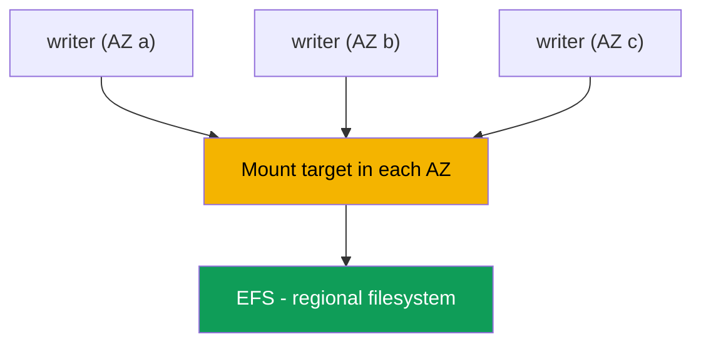
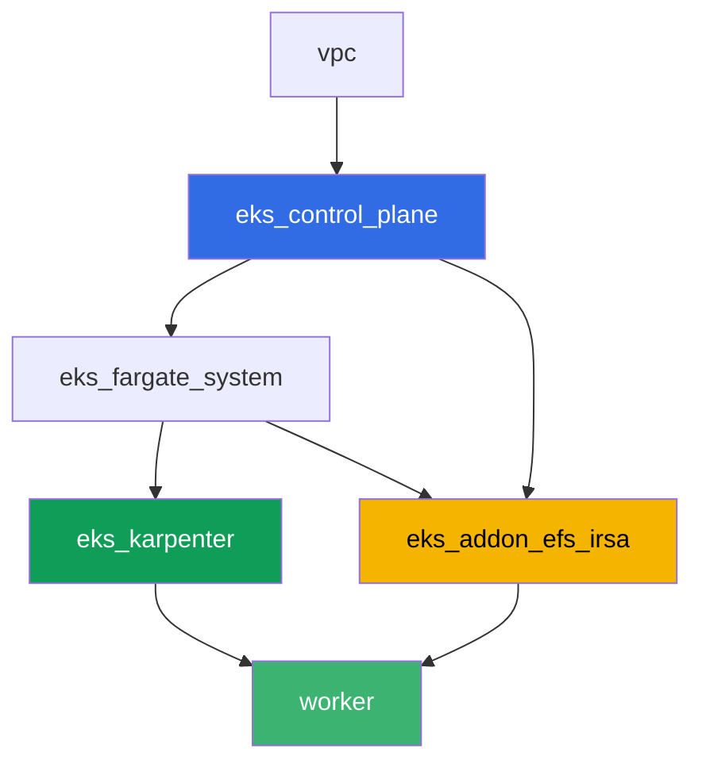

[Русская версия](README_RU.MD) · [Versión en español](README_ES.MD) · [Version française](README_FR.MD) · [Deutsche Version](README_DE.MD) · [ქართული ვერსია](README_GE.MD) · [繁體中文版](README_TW.MD) · [日本語版](README_JP.MD)

# Lab 107 - EFS CSI: ReadWriteMany across availability zones

## Description

This lab is about network storage EFS in EKS and its main difference from block storage
EBS (chapter 23): several pods in different availability zones can simultaneously write to
and read from the same volume. You set up dynamic provisioning via `efs.csi.aws.com`,
spread a Deployment across several AZs with `topologySpreadConstraints`, confirm that data
written from one replica is visible from another, and figure out why a PV on EFS has no
zonal `nodeAffinity`. A separate task is a read-only diagnostic via AWS CLI: how to check
that the mount target's security group allows NFS (port 2049) from the cluster nodes, and
what happens if that rule is removed.

Tasks are written in a production style: a short statement plus acceptance criteria.
Checking is automatic, via the `check_result` command.

## Goal

Reinforce the material from these course chapters:

- [Chapter 24. EFS and FSx: shared storage for workloads across AZs](../../course/24/en.md) - the main material for this lab
- [Chapter 23. EBS CSI: gp3, StorageClass, expansion, snapshots, AZ binding](../../course/23/en.md) - what we're comparing against: a zonal block volume vs. a regional network one
- [Chapter 9. Compute types: managed node groups, Fargate, Auto Mode](../../course/09/en.md) - why the cluster has several AZs and where the nodes live
- [Chapters 16-17. IRSA and Pod Identity](../../course/16/en.md) - how the driver gets permission to manage EFS

## What we're creating

| Object | What it is | Why it's in this lab |
|--------|---------|-------------------|
| Namespace `eks-107` | a cluster section for the lab's workload | keeps resources separate (chapter 4) |
| StorageClass `efs-sc` | a class with `provisioningMode: efs-ap` pointing at a real `fileSystemId` | dynamic provisioning via access points (chapter 24) |
| PVC `shared-data` (`ReadWriteMany`, `5Gi`) | a shared volume | one data point for all replicas (chapter 24) |
| Deployment `writer` (3 replicas, different AZs) | a workload on the shared volume | all replicas are `Running` at once and mount the same PVC (chapter 24) |
| Artifact `readback.txt` | a line written in one AZ and read in another | confirms shared network access, not a local copy (chapter 24) |
| Artifact `pv.yaml` + `explanation.txt` | the volume's PV and an explanation | no zonal `nodeAffinity`, unlike EBS (chapters 23-24) |
| Artifact `sg-rule.txt` + `diagnosis.txt` | the SG rule on 2049 and an explanation | NFS diagnostics via AWS CLI, the symptom when the rule is missing (chapter 24) |

The data path from a pod to the shared volume:



## Infrastructure

The environment is deployed in AWS (`eu-central-1`) via Terragrunt. Each lab directory is
one component with its own `terragrunt.hcl`, which references a shared module in
`terraform/modules/` and declares dependencies through `dependency` blocks. Terragrunt
builds a dependency graph and applies the components in the right order. The base is the
same as in lab 101 (control plane, Fargate for system pods, Karpenter for workloads), plus
a separate component for EFS CSI.

### Modules and dependencies

| Directory (component) | Module (`terraform/modules/`) | Depends on | What it creates |
|---------------------|-------------------------------|------------|-------------|
| `vpc` | `vpc_v3` | - | VPC `10.10.0.0/16`, subnets in two AZs (`eu-central-1a`, `eu-central-1b`), NAT |
| `ssh-keys` | `ssh-keys` | - | an SSH key pair for the worker machine and nodes |
| `eks_control_plane` | `eks_v2_control_plane` | `vpc` | EKS control plane `1.36`, OIDC, security groups |
| `eks_fargate_system` | `eks_v2_fargate` | `vpc`, `eks_control_plane` | Fargate profile for `kube-system` and `karpenter` |
| `eks_addons` | `eks_v2_addons` | `eks_control_plane`, `eks_fargate_system` | coredns, kube-proxy, vpc-cni, pod-identity |
| `eks_karpenter` | `eks_v2_karpenter` | `vpc`, `eks_control_plane`, `eks_addons`, `eks_fargate_system` | Karpenter controller, node IAM role |
| `eks_karpenter_default_vng` | `eks_v2_karpenter_vng` | `vpc`, `eks_control_plane`, `eks_karpenter` | default NodePool `default` on AL2023 |
| `eks_addon_efs_irsa` | `eks_v2_efs_irsa` | `vpc`, `eks_control_plane`, `eks_fargate_system` | EFS filesystem, mount target in each AZ, SG on 2049, managed addon `aws-efs-csi-driver`, IAM role via IRSA |
| `worker` | `eks_v2_work_pc` | `ssh-keys`, `vpc`, `eks_control_plane`, `eks_karpenter`, `eks_addon_efs_irsa` | worker machine with kubectl, tests, and `check_result` |

The EFS filesystem, mount target, and the driver's role are already set up by the
`eks_addon_efs_irsa` component (chapters 16-17, 24): you don't need to create them again in
the tasks, the driver is ready by the time you create the first PVC (`worker` depends on
`eks_addon_efs_irsa`).

Dependency graph (what gets applied earlier is lower down the arrow):



The cluster is built across two AZs - that's enough to see the lab's main scenario: EFS is
reachable from both zones through its own mount target in each, unlike EBS, where a volume
is bound to one specific AZ.

### Where things are configured

`env.hcl` (shared environment parameters, read by all components):

| Parameter | Value in the lab | What it affects |
|----------|-----------------|---------------|
| `region` | `eu-central-1` | region for all resources |
| `subnets` | private `eks1`/`eks2` in `eu-central-1a`/`eu-central-1b` | zones where Karpenter brings up nodes and where EFS mount targets are created |
| `prefix` | `eks-task107` | prefix for resource names and tags |
| `stack_name` | `eks107` | used to build `env_name` - the cluster name |
| `k8_version` | `1.36.0` | kubectl version on the worker machine |

`inputs` in each component's `terragrunt.hcl` (settings specific to that module):

| File | Key settings |
|------|--------------------|
| `eks_addon_efs_irsa/terragrunt.hcl` | `subnet_ids` of private subnets (one per AZ), `security_group_source_id` = cluster node SG, managed addon `aws-efs-csi-driver` |
| `worker/terragrunt.hcl` | `test_url` and `task_script_url` for the lab 107 files, dependency on `eks_addon_efs_irsa` |

## Deployment

```bash
TASK=107 make run_eks_task
```

Deployment takes roughly 15-20 minutes. In the output, find the line with the SSH connection
to the worker machine and connect to it. kubectl there is already configured for the right
cluster, the EFS CSI driver is already installed and ready to accept PVCs, and the EFS
filesystem is already created. The cluster starts with zero EC2 nodes (Fargate only), so
before you start the tasks the worker machine warms up exactly one EC2 node with a service
pod in namespace `efs-csi-warmup` - without this, the csi-provisioner can't generate
accessibility requirements even for a regional EFS, because it waits for at least one node
with a registered CSINode topology. Namespace `efs-csi-warmup` has nothing to do with the
lab's tasks, don't touch it.

Useful commands on the worker machine:

```bash
time_left       # how much environment time is left
check_result    # check the solution
```

> Environment security. `env.hcl` has `ssh_password_enable = true` and
> `access_cidrs = ["0.0.0.0/0"]` enabled - convenient for a training environment, but this
> is not something to do in production. Per the course standards (chapters 0.2, 2, 19),
> access to worker machines should go through AWS SSM Session Manager without exposing
> public SSH ports, and `access_cidrs` should be narrowed down to specific addresses. Here
> public SSH is left in place only to keep the setup simple.

## Tasks

---
|        **1**        | **Namespace for the lab's workload**                             |
| :-----------------: | :---------------------------------------------------------- |
| What to do          | Create a namespace named `eks-107`. All objects in this lab are created inside it. |
| Acceptance criteria    | - namespace `eks-107` exists. |
---
|        **2**        | **StorageClass on a real EFS filesystem**           |
| :-----------------: | :---------------------------------------------------------- |
| What to do          | The EFS filesystem is already created by terraform. Find its `fileSystemId` via `aws efs describe-file-systems` (tag `Name` = `eks-task107-efs`) and create StorageClass `efs-sc`: `provisioner: efs.csi.aws.com`, `parameters.provisioningMode: efs-ap`, `parameters.fileSystemId` - the real ID, `parameters.directoryPerms: "755"`, `mountOptions: ["tls"]`. |
| Acceptance criteria    | - StorageClass `efs-sc` exists;<br/>- `provisioner: efs.csi.aws.com`;<br/>- `parameters.provisioningMode: efs-ap`;<br/>- `parameters.fileSystemId` matches the real filesystem ID. |
---
|        **3**        | **PVC with ReadWriteMany access**                            |
| :-----------------: | :---------------------------------------------------------- |
| What to do          | In `eks-107`, create PVC `shared-data` on StorageClass `efs-sc`, `accessModes: ["ReadWriteMany"]`, requesting `5Gi`. Wait for `Bound`. |
| Acceptance criteria    | - PVC `shared-data` on class `efs-sc`;<br/>- `accessModes` contains `ReadWriteMany`;<br/>- request of `5Gi`;<br/>- status `Bound`. |
---
|        **4**        | **Deployment on a shared volume across several AZs**                |
| :-----------------: | :---------------------------------------------------------- |
| What to do          | In `eks-107`, create Deployment `writer`, image `viktoruj/ping_pong:alpine` (needs a shell for task 5), `3` replicas, volume `shared-data` mounted in each replica. Add `topologySpreadConstraints` on key `topology.kubernetes.io/zone` so replicas spread across different AZs. Make sure all `3` replicas are `Running` at the same time and mount the same PVC - with EBS (`ReadWriteOnce`) this is impossible across zones (`Multi-Attach error`, chapter 23). |
| Acceptance criteria    | - Deployment `writer` in `eks-107`, image `viktoruj/ping_pong`, `3` ready replicas;<br/>- a volume from PVC `shared-data` mounted in the pod;<br/>- `topologySpreadConstraints` on `topology.kubernetes.io/zone`;<br/>- replicas physically in `2` or more different zones. |
---
|        **5**        | **Confirming shared access across AZs**                   |
| :-----------------: | :---------------------------------------------------------- |
| What to do          | From one `writer` replica, append a line containing the marker `efs-rwx-test` to file `/data/shared.txt` on the shared volume. From ANOTHER replica (a different AZ), read that file and save the result to `/var/work/tests/artifacts/5/readback.txt`. |
| Acceptance criteria    | - file `readback.txt` is not empty;<br/>- contains a line with marker `efs-rwx-test`. |
---
|        **6**        | **Checking for the absence of zonal nodeAffinity**                |
| :-----------------: | :---------------------------------------------------------- |
| What to do          | Save `kubectl get pv <pv> -o yaml` for the volume of PVC `shared-data` to `/var/work/tests/artifacts/6/pv.yaml`. Make sure that, unlike EBS (chapter 23), this PV has no `spec.nodeAffinity` section. Write an explanation to `/var/work/tests/artifacts/6/explanation.txt`: why EFS doesn't bind the PV to a zone, and what that means for the pod if it's recreated in another AZ. The text must mention `nodeAffinity`. |
| Acceptance criteria    | - file `pv.yaml` is not empty;<br/>- the PV has no `nodeAffinity` section;<br/>- file `explanation.txt` is not empty and mentions `nodeAffinity`. |
---
|        **7**        | **Diagnostics: mount target security group and port 2049**   |
| :-----------------: | :---------------------------------------------------------- |
| What to do          | Actually breaking infrastructure is risky, so this task is read-only. Using `aws efs describe-mount-targets`, find the security group of your EFS's mount target, and using `aws ec2 describe-security-groups`, confirm it has an inbound rule for TCP `2049` from the cluster node security group. Save the rule's output to `/var/work/tests/artifacts/7/sg-rule.txt`. In file `/var/work/tests/artifacts/7/diagnosis.txt`, explain what would happen if this rule were missing: the pod won't get an explicit access error, mounting will hang on a TCP timeout to port `2049`, and `kubectl describe pod` will show a `FailedMount` event. |
| Acceptance criteria    | - file `sg-rule.txt` is not empty and contains `2049`;<br/>- file `diagnosis.txt` is not empty, contains `2049` and a word about the timeout (`FailedMount`/`timeout`). |
---

## Checking the result

On the worker machine, run the automatic check:

```bash
check_result
```

The script will run the tests and show the percentage of completed tasks.

## Solution

Reference solution: [worker/files/solutions/1.MD](worker/files/solutions/1.MD)

## Deleting the cluster and resources

> **First remove the PVCs, then the cluster.** With dynamic provisioning, the EFS CSI
> driver creates its own **access point** inside the filesystem for each PVC. Terraform
> created the filesystem itself, but access points are created by the driver, and it also
> removes them once the PVC is deleted. If you tear down the cluster while PVCs are still
> alive, the driver will be gone, the access points will remain, and deleting the filesystem
> will fail with `FileSystemInUse`, and `destroy` will get stuck on it.

```bash
kubectl delete namespace eks-107 --ignore-not-found
kubectl delete pvc --all -n eks-107 --ignore-not-found 2>/dev/null

while kubectl get nodes --no-headers 2>/dev/null | grep -qv fargate; do
  echo "Karpenter's EC2 node is still alive, waiting..."; sleep 15
done
```

Check that no access points created by the driver are left in the filesystem:

```bash
FS_ID=$(aws efs describe-file-systems \
  --query 'FileSystems[?contains(Name, `eks-task107`)].FileSystemId' --output text)
aws efs describe-access-points --file-system-id "$FS_ID" \
  --query 'AccessPoints[].[AccessPointId,RootDirectory.Path]' --output table
# delete any leftovers
aws efs delete-access-point --access-point-id <fsap-id>
```

```bash
TASK=107 make delete_eks_task
```
