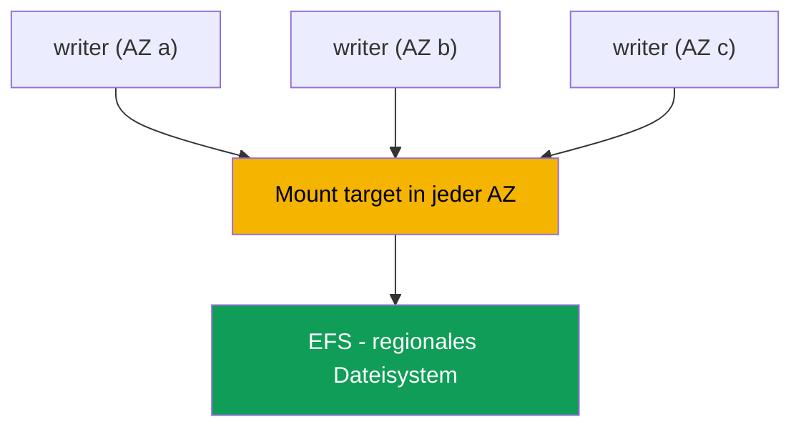
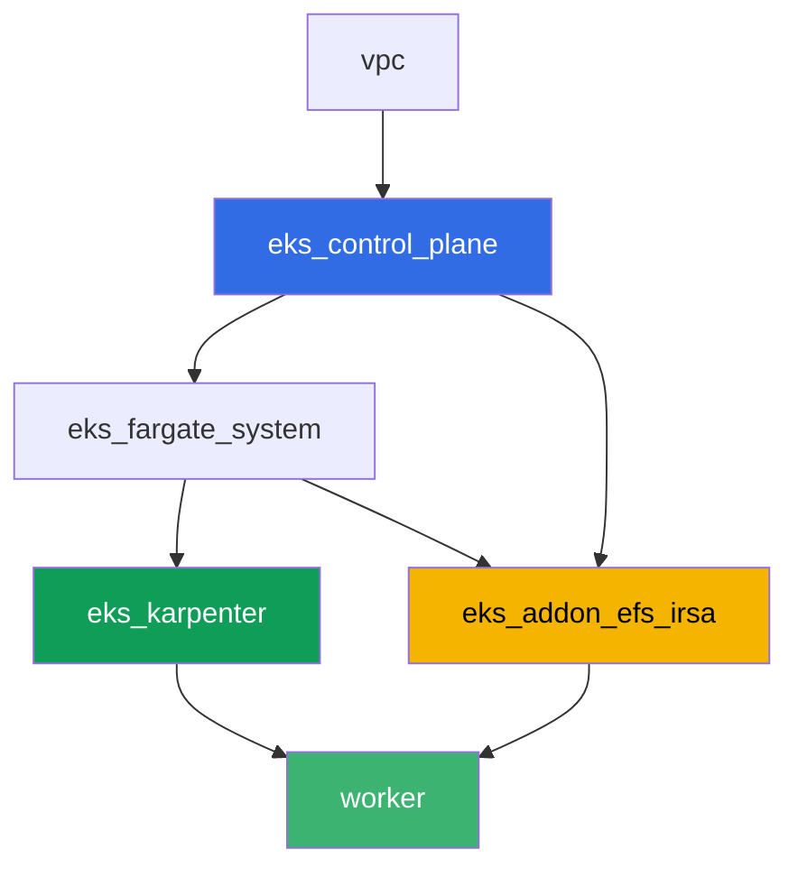

[Русская версия](README_RU.MD) · [Eng version](README.MD) · [Versión en español](README_ES.MD) · [Version française](README_FR.MD) · [ქართული ვერსია](README_GE.MD) · [繁體中文版](README_TW.MD) · [日本語版](README_JP.MD)

# Lab 107 - EFS CSI: ReadWriteMany über mehrere Availability Zones

## Beschreibung

In diesem Lab geht es um den Netzwerkspeicher EFS in EKS und seinen wesentlichen
Unterschied zum Blockspeicher EBS (Kapitel 23): mehrere Pods in unterschiedlichen
Availability Zones können gleichzeitig in dasselbe Volume schreiben und daraus lesen. Sie
richten dynamisches Provisioning über `efs.csi.aws.com` ein, verteilen ein Deployment mit
`topologySpreadConstraints` über mehrere AZ, bestätigen, dass Daten, die aus einer Replik
geschrieben wurden, aus einer anderen sichtbar sind, und finden heraus, warum ein PV auf
EFS keine zonale `nodeAffinity` hat. Eine separate Aufgabe ist eine reine
Lesediagnose über die AWS CLI: wie man prüft, dass die Security Group des Mount Targets
NFS (Port 2049) von den Cluster-Nodes zulässt, und was passiert, wenn diese Regel entfernt
wird.

Die Aufgaben sind im Produktionsstil geschrieben: eine kurze Aufgabenstellung plus
Abnahmekriterien. Die Prüfung erfolgt automatisch über den Befehl `check_result`.

## Ziel

Den Stoff dieser Kurskapitel vertiefen:

- [Kapitel 24. EFS und FSx: gemeinsamer Speicher für Workloads über AZ hinweg](../../course/24/de.md) - das Hauptmaterial für dieses Lab
- [Kapitel 23. EBS CSI: gp3, StorageClass, Erweiterung, Snapshots, AZ-Bindung](../../course/23/de.md) - der Vergleichsmaßstab: ein zonales Block-Volume gegenüber einem regionalen Netzwerk-Volume
- [Kapitel 9. Compute-Typen: Managed Node Groups, Fargate, Auto Mode](../../course/09/de.md) - warum der Cluster mehrere AZ hat und wo die Nodes leben
- [Kapitel 16-17. IRSA und Pod Identity](../../course/16/de.md) - wie der Driver die Berechtigung erhält, EFS zu verwalten

## Was wir erstellen

| Objekt | Was es ist | Wofür in diesem Lab |
|--------|---------|-------------------|
| Namespace `eks-107` | ein Cluster-Bereich für die Workload dieses Labs | trennt Ressourcen (Kapitel 4) |
| StorageClass `efs-sc` | eine Klasse mit `provisioningMode: efs-ap`, die auf eine reale `fileSystemId` verweist | dynamisches Provisioning über Access Points (Kapitel 24) |
| PVC `shared-data` (`ReadWriteMany`, `5Gi`) | ein gemeinsam genutztes Volume | ein Datenpunkt für alle Repliken (Kapitel 24) |
| Deployment `writer` (3 Repliken, unterschiedliche AZ) | eine Workload auf dem gemeinsamen Volume | alle Repliken sind gleichzeitig `Running` und mounten dieselbe PVC (Kapitel 24) |
| Artefakt `readback.txt` | eine in einer AZ geschriebene und in einer anderen gelesene Zeile | bestätigt gemeinsamen Netzwerkzugriff, keine lokale Kopie (Kapitel 24) |
| Artefakte `pv.yaml` + `explanation.txt` | das PV des Volumes und eine Erklärung | keine zonale `nodeAffinity`, im Unterschied zu EBS (Kapitel 23-24) |
| Artefakte `sg-rule.txt` + `diagnosis.txt` | die SG-Regel auf 2049 und eine Erklärung | NFS-Diagnose über die AWS CLI, das Symptom bei fehlender Regel (Kapitel 24) |

Der Datenpfad von einem Pod zum gemeinsamen Volume:



## Infrastruktur

Die Umgebung wird in AWS (`eu-central-1`) über Terragrunt deployt. Jedes Lab-Verzeichnis
ist eine Komponente mit eigenem `terragrunt.hcl`, das auf ein gemeinsames Modul in
`terraform/modules/` verweist und seine Abhängigkeiten über `dependency`-Blöcke deklariert.
Terragrunt baut einen Abhängigkeitsgraphen und wendet die Komponenten in der richtigen
Reihenfolge an. Die Basis ist dieselbe wie in Lab 101 (Control Plane, Fargate für
System-Pods, Karpenter für Workloads), zuzüglich einer separaten Komponente für EFS CSI.

### Module und Abhängigkeiten

| Verzeichnis (Komponente) | Modul (`terraform/modules/`) | Abhängig von | Was es erstellt |
|---------------------|-------------------------------|------------|-------------|
| `vpc` | `vpc_v3` | - | VPC `10.10.0.0/16`, Subnetze in zwei AZ (`eu-central-1a`, `eu-central-1b`), NAT |
| `ssh-keys` | `ssh-keys` | - | ein SSH-Schlüsselpaar für die Worker-Maschine und die Nodes |
| `eks_control_plane` | `eks_v2_control_plane` | `vpc` | EKS Control Plane `1.36`, OIDC, Security Groups |
| `eks_fargate_system` | `eks_v2_fargate` | `vpc`, `eks_control_plane` | Fargate-Profil für `kube-system` und `karpenter` |
| `eks_addons` | `eks_v2_addons` | `eks_control_plane`, `eks_fargate_system` | coredns, kube-proxy, vpc-cni, pod-identity |
| `eks_karpenter` | `eks_v2_karpenter` | `vpc`, `eks_control_plane`, `eks_addons`, `eks_fargate_system` | Karpenter-Controller, IAM-Rolle der Nodes |
| `eks_karpenter_default_vng` | `eks_v2_karpenter_vng` | `vpc`, `eks_control_plane`, `eks_karpenter` | Standard-NodePool `default` auf AL2023 |
| `eks_addon_efs_irsa` | `eks_v2_efs_irsa` | `vpc`, `eks_control_plane`, `eks_fargate_system` | EFS-Dateisystem, Mount Target in jeder AZ, SG auf 2049, Managed Addon `aws-efs-csi-driver`, IAM-Rolle über IRSA |
| `worker` | `eks_v2_work_pc` | `ssh-keys`, `vpc`, `eks_control_plane`, `eks_karpenter`, `eks_addon_efs_irsa` | Worker-Maschine mit kubectl, Tests und `check_result` |

Das EFS-Dateisystem, das Mount Target und die Rolle des Drivers werden bereits von der
Komponente `eks_addon_efs_irsa` eingerichtet (Kapitel 16-17, 24): Sie müssen sie in den
Aufgaben nicht erneut erstellen, der Driver ist bereits fertig, wenn Sie die erste PVC
erstellen (`worker` hängt von `eks_addon_efs_irsa` ab).

Abhängigkeitsgraph (was früher angewendet wird, steht weiter unten am Pfeil):



Der Cluster wird über zwei AZ aufgebaut - das reicht aus, um das Hauptszenario des Labs zu
sehen: EFS ist über sein eigenes Mount Target in jeder Zone aus beiden Zonen erreichbar,
im Unterschied zu EBS, wo ein Volume an eine bestimmte AZ gebunden ist.

### Wo die Konfiguration liegt

`env.hcl` (gemeinsame Umgebungsparameter, die von allen Komponenten gelesen werden):

| Parameter | Wert im Lab | Was es beeinflusst |
|----------|-----------------|---------------|
| `region` | `eu-central-1` | Region für alle Ressourcen |
| `subnets` | private `eks1`/`eks2` in `eu-central-1a`/`eu-central-1b` | Zonen, in denen Karpenter Nodes hochfährt und in denen EFS-Mount-Targets erstellt werden |
| `prefix` | `eks-task107` | Präfix für Ressourcennamen und Tags |
| `stack_name` | `eks107` | wird verwendet, um `env_name` zu bilden - den Cluster-Namen |
| `k8_version` | `1.36.0` | kubectl-Version auf der Worker-Maschine |

`inputs` in der `terragrunt.hcl` jeder Komponente (Einstellungen speziell für dieses
Modul):

| Datei | Wichtige Einstellungen |
|------|--------------------|
| `eks_addon_efs_irsa/terragrunt.hcl` | `subnet_ids` der privaten Subnetze (eines pro AZ), `security_group_source_id` = SG der Cluster-Nodes, Managed Addon `aws-efs-csi-driver` |
| `worker/terragrunt.hcl` | `test_url` und `task_script_url` für die Dateien von Lab 107, Abhängigkeit von `eks_addon_efs_irsa` |

## Deployment

```bash
TASK=107 make run_eks_task
```

Das Deployment dauert etwa 15-20 Minuten. Suchen Sie in der Ausgabe die Zeile mit der
SSH-Verbindung zur Worker-Maschine und verbinden Sie sich damit. kubectl ist dort bereits
für den richtigen Cluster konfiguriert, der EFS-CSI-Driver ist bereits installiert und
bereit, PVCs anzunehmen, und das EFS-Dateisystem ist bereits erstellt. Der Cluster startet
mit null EC2-Nodes (nur Fargate), daher wärmt die Worker-Maschine vor Beginn der Aufgaben
genau einen EC2-Node mit einem Service-Pod im Namespace `efs-csi-warmup` auf - ohne das
kann der csi-provisioner selbst für ein regionales EFS keine Erreichbarkeitsanforderungen
erzeugen, weil er auf mindestens einen Node mit registrierter CSINode-Topologie wartet.
Der Namespace `efs-csi-warmup` hat nichts mit den Aufgaben des Labs zu tun, fassen Sie ihn
nicht an.

Nützliche Befehle auf der Worker-Maschine:

```bash
time_left       # verbleibende Zeit der Umgebung
check_result    # Lösung prüfen
```

> Sicherheit der Umgebung. In `env.hcl` sind `ssh_password_enable = true` und
> `access_cidrs = ["0.0.0.0/0"]` aktiviert - praktisch für eine Trainingsumgebung, aber so
> sollte man es in Produktion nicht machen. Nach den Standards des Kurses (Kapitel 0.2, 2,
> 19) sollte der Zugriff auf Worker-Maschinen über AWS SSM Session Manager erfolgen, ohne
> öffentliche SSH-Ports freizugeben, und `access_cidrs` sollte auf konkrete Adressen
> eingeschränkt werden. Hier bleibt öffentliches SSH nur bestehen, um die Einrichtung
> einfach zu halten.

## Aufgaben

---
|        **1**        | **Namespace für die Workload des Labs**                             |
| :-----------------: | :---------------------------------------------------------- |
| Was wir tun          | Erstellen Sie einen Namespace mit dem Namen `eks-107`. Alle Objekte dieses Labs werden darin erstellt. |
| Abnahmekriterien    | - der Namespace `eks-107` existiert. |
---
|        **2**        | **StorageClass auf einem realen EFS-Dateisystem**           |
| :-----------------: | :---------------------------------------------------------- |
| Was wir tun          | Das EFS-Dateisystem ist bereits von Terraform erstellt worden. Finden Sie seine `fileSystemId` über `aws efs describe-file-systems` (Tag `Name` = `eks-task107-efs`) und erstellen Sie die StorageClass `efs-sc`: `provisioner: efs.csi.aws.com`, `parameters.provisioningMode: efs-ap`, `parameters.fileSystemId` - die reale ID, `parameters.directoryPerms: "755"`, `mountOptions: ["tls"]`. |
| Abnahmekriterien    | - StorageClass `efs-sc` existiert;<br/>- `provisioner: efs.csi.aws.com`;<br/>- `parameters.provisioningMode: efs-ap`;<br/>- `parameters.fileSystemId` entspricht der realen Dateisystem-ID. |
---
|        **3**        | **PVC mit ReadWriteMany-Zugriff**                            |
| :-----------------: | :---------------------------------------------------------- |
| Was wir tun          | Erstellen Sie in `eks-107` die PVC `shared-data` auf der StorageClass `efs-sc`, `accessModes: ["ReadWriteMany"]`, mit einer Anfrage von `5Gi`. Warten Sie auf `Bound`. |
| Abnahmekriterien    | - PVC `shared-data` auf der Klasse `efs-sc`;<br/>- `accessModes` enthält `ReadWriteMany`;<br/>- Anfrage von `5Gi`;<br/>- Status `Bound`. |
---
|        **4**        | **Deployment auf einem gemeinsamen Volume über mehrere AZ**                |
| :-----------------: | :---------------------------------------------------------- |
| Was wir tun          | Erstellen Sie in `eks-107` das Deployment `writer`, Image `viktoruj/ping_pong:alpine` (braucht eine Shell für Aufgabe 5), `3` Repliken, das Volume `shared-data` in jeder Replik gemountet. Fügen Sie `topologySpreadConstraints` auf dem Key `topology.kubernetes.io/zone` hinzu, damit sich die Repliken über verschiedene AZ verteilen. Stellen Sie sicher, dass alle `3` Repliken gleichzeitig `Running` sind und dieselbe PVC mounten - mit EBS (`ReadWriteOnce`) ist das über Zonen hinweg unmöglich (`Multi-Attach error`, Kapitel 23). |
| Abnahmekriterien    | - Deployment `writer` in `eks-107`, Image `viktoruj/ping_pong`, `3` bereite Repliken;<br/>- ein Volume aus PVC `shared-data` im Pod gemountet;<br/>- `topologySpreadConstraints` auf `topology.kubernetes.io/zone`;<br/>- Repliken physisch in `2` oder mehr unterschiedlichen Zonen. |
---
|        **5**        | **Bestätigung des gemeinsamen Zugriffs über AZ hinweg**                   |
| :-----------------: | :---------------------------------------------------------- |
| Was wir tun          | Hängen Sie von einer `writer`-Replik aus eine Zeile mit dem Marker `efs-rwx-test` an die Datei `/data/shared.txt` auf dem gemeinsamen Volume an. Lesen Sie von EINER ANDEREN Replik (einer anderen AZ) diese Datei und speichern Sie das Ergebnis in `/var/work/tests/artifacts/5/readback.txt`. |
| Abnahmekriterien    | - die Datei `readback.txt` ist nicht leer;<br/>- enthält eine Zeile mit dem Marker `efs-rwx-test`. |
---
|        **6**        | **Prüfung auf das Fehlen einer zonalen nodeAffinity**                |
| :-----------------: | :---------------------------------------------------------- |
| Was wir tun          | Speichern Sie `kubectl get pv <pv> -o yaml` für das Volume der PVC `shared-data` in `/var/work/tests/artifacts/6/pv.yaml`. Stellen Sie sicher, dass dieses PV, im Unterschied zu EBS (Kapitel 23), keinen Abschnitt `spec.nodeAffinity` hat. Schreiben Sie eine Erklärung in `/var/work/tests/artifacts/6/explanation.txt`: warum EFS das PV nicht an eine Zone bindet und was das für den Pod bedeutet, wenn er in einer anderen AZ neu erstellt wird. Der Text muss `nodeAffinity` erwähnen. |
| Abnahmekriterien    | - die Datei `pv.yaml` ist nicht leer;<br/>- das PV hat keinen Abschnitt `nodeAffinity`;<br/>- die Datei `explanation.txt` ist nicht leer und erwähnt `nodeAffinity`. |
---
|        **7**        | **Diagnose: Security Group des Mount Targets und Port 2049**   |
| :-----------------: | :---------------------------------------------------------- |
| Was wir tun          | Reale Infrastruktur zu beschädigen ist riskant, daher ist diese Aufgabe reine Lesediagnose. Finden Sie über `aws efs describe-mount-targets` die Security Group des Mount Targets Ihres EFS, und bestätigen Sie über `aws ec2 describe-security-groups`, dass sie eine eingehende Regel für TCP `2049` von der Security Group der Cluster-Nodes hat. Speichern Sie die Ausgabe der Regel in `/var/work/tests/artifacts/7/sg-rule.txt`. Erklären Sie in der Datei `/var/work/tests/artifacts/7/diagnosis.txt`, was passieren würde, wenn diese Regel fehlen würde: der Pod erhält keinen expliziten Zugriffsfehler, das Mounten hängt an einem TCP-Timeout auf Port `2049`, und `kubectl describe pod` zeigt ein `FailedMount`-Ereignis. |
| Abnahmekriterien    | - die Datei `sg-rule.txt` ist nicht leer und enthält `2049`;<br/>- die Datei `diagnosis.txt` ist nicht leer, enthält `2049` und ein Wort über den Timeout (`FailedMount`/`timeout`). |
---

## Ergebnis prüfen

Führen Sie auf der Worker-Maschine die automatische Prüfung aus:

```bash
check_result
```

Das Skript führt die Tests aus und zeigt den Prozentsatz erledigter Aufgaben.

## Lösung

Referenzlösung: [worker/files/solutions/1_DE.MD](worker/files/solutions/1_DE.MD)

## Cluster und Ressourcen löschen

> **Entfernen Sie zuerst die PVCs, dann den Cluster.** Bei dynamischem Provisioning
> erstellt der EFS-CSI-Driver für jede PVC einen eigenen **Access Point** innerhalb des
> Dateisystems. Terraform hat das Dateisystem selbst erstellt, aber Access Points werden
> vom Driver erstellt, und er entfernt sie auch, sobald die PVC gelöscht wird. Wenn Sie den
> Cluster abbauen, während noch PVCs am Leben sind, ist der Driver weg, die Access Points
> bleiben zurück, und das Löschen des Dateisystems schlägt mit `FileSystemInUse` fehl, und
> `destroy` bleibt daran hängen.

```bash
kubectl delete namespace eks-107 --ignore-not-found
kubectl delete pvc --all -n eks-107 --ignore-not-found 2>/dev/null

while kubectl get nodes --no-headers 2>/dev/null | grep -qv fargate; do
  echo "Karpenters EC2-Node lebt noch, warte..."; sleep 15
done
```

Stellen Sie sicher, dass keine vom Driver erstellten Access Points im Dateisystem übrig
sind:

```bash
FS_ID=$(aws efs describe-file-systems \
  --query 'FileSystems[?contains(Name, `eks-task107`)].FileSystemId' --output text)
aws efs describe-access-points --file-system-id "$FS_ID" \
  --query 'AccessPoints[].[AccessPointId,RootDirectory.Path]' --output table
# Überbleibsel entfernen
aws efs delete-access-point --access-point-id <fsap-id>
```

```bash
TASK=107 make delete_eks_task
```
