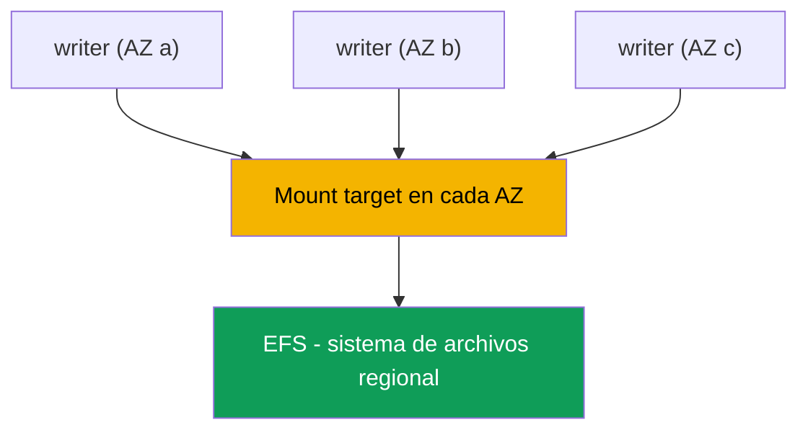
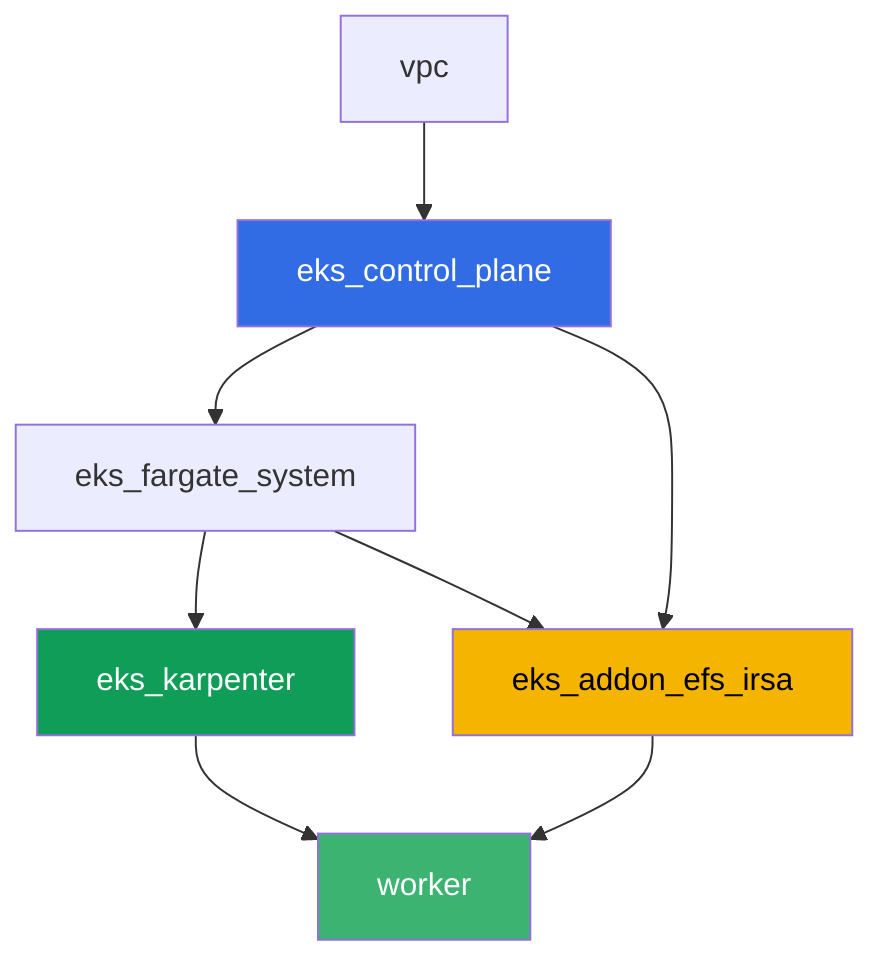

[Русская версия](README_RU.MD) · [Eng version](README.MD) · [Version française](README_FR.MD) · [Deutsche Version](README_DE.MD) · [ქართული ვერსია](README_GE.MD) · [繁體中文版](README_TW.MD) · [日本語版](README_JP.MD)

# Lab 107 - EFS CSI: ReadWriteMany entre zonas de disponibilidad

## Descripción

Este laboratorio trata sobre el almacenamiento de red EFS en EKS y su principal diferencia
respecto al almacenamiento de bloques EBS (capítulo 23): varios pods en distintas zonas de
disponibilidad pueden escribir y leer simultáneamente el mismo volumen. Configurarás el
aprovisionamiento dinámico mediante `efs.csi.aws.com`, distribuirás un Deployment entre
varias AZ con `topologySpreadConstraints`, confirmarás que los datos escritos desde una
réplica son visibles desde otra, y averiguarás por qué un PV en EFS no tiene `nodeAffinity`
zonal. Una tarea aparte es un diagnóstico de solo lectura mediante AWS CLI: cómo comprobar
que el security group del mount target permite NFS (puerto 2049) desde los nodos del
clúster, y qué ocurre si se elimina esa regla.

Las tareas están escritas en un estilo de producción: un enunciado breve más criterios de
aceptación. La comprobación es automática, mediante el comando `check_result`.

## Objetivo

Reforzar el material de estos capítulos del curso:

- [Capítulo 24. EFS y FSx: almacenamiento compartido para workloads entre AZ](../../course/24/ru.md) - el material principal para este laboratorio
- [Capítulo 23. EBS CSI: gp3, StorageClass, expansión, snapshots, vinculación a AZ](../../course/23/ru.md) - con qué lo comparamos: un volumen de bloques zonal frente a uno de red regional
- [Capítulo 9. Tipos de cómputo: managed node groups, Fargate, Auto Mode](../../course/09/ru.md) - por qué el clúster tiene varias AZ y dónde viven los nodos
- [Capítulos 16-17. IRSA y Pod Identity](../../course/16/ru.md) - cómo obtiene el driver permiso para gestionar EFS

## Qué creamos

| Objeto | Qué es | Por qué está en este laboratorio |
|--------|---------|-------------------|
| Namespace `eks-107` | una sección del clúster para el workload del laboratorio | mantiene los recursos separados (capítulo 4) |
| StorageClass `efs-sc` | una clase con `provisioningMode: efs-ap` que apunta a un `fileSystemId` real | aprovisionamiento dinámico mediante access points (capítulo 24) |
| PVC `shared-data` (`ReadWriteMany`, `5Gi`) | un volumen compartido | un único punto de datos para todas las réplicas (capítulo 24) |
| Deployment `writer` (3 réplicas, distintas AZ) | un workload sobre el volumen compartido | todas las réplicas están `Running` a la vez y montan el mismo PVC (capítulo 24) |
| Artefacto `readback.txt` | una línea escrita en una AZ y leída en otra | confirma el acceso de red compartido, no una copia local (capítulo 24) |
| Artefacto `pv.yaml` + `explanation.txt` | el PV del volumen y una explicación | sin sección `nodeAffinity` zonal, a diferencia de EBS (capítulos 23-24) |
| Artefacto `sg-rule.txt` + `diagnosis.txt` | la regla del SG en el puerto 2049 y una explicación | diagnóstico de NFS mediante AWS CLI, el síntoma cuando falta la regla (capítulo 24) |

La ruta de los datos desde un pod hasta el volumen compartido:



## Infraestructura

El entorno se despliega en AWS (`eu-central-1`) mediante Terragrunt. Cada directorio de
laboratorio es un componente con su propio `terragrunt.hcl`, que hace referencia a un
módulo compartido en `terraform/modules/` y declara dependencias mediante bloques
`dependency`. Terragrunt construye un grafo de dependencias y aplica los componentes en el
orden correcto. La base es la misma que en el laboratorio 101 (control plane, Fargate para
los pods de sistema, Karpenter para los workloads), más un componente aparte para EFS CSI.

### Módulos y dependencias

| Directorio (componente) | Módulo (`terraform/modules/`) | Depende de | Qué crea |
|---------------------|-------------------------------|------------|-------------|
| `vpc` | `vpc_v3` | - | VPC `10.10.0.0/16`, subredes en dos AZ (`eu-central-1a`, `eu-central-1b`), NAT |
| `ssh-keys` | `ssh-keys` | - | un par de claves SSH para la máquina worker y los nodos |
| `eks_control_plane` | `eks_v2_control_plane` | `vpc` | control plane de EKS `1.36`, OIDC, security groups |
| `eks_fargate_system` | `eks_v2_fargate` | `vpc`, `eks_control_plane` | perfil de Fargate para `kube-system` y `karpenter` |
| `eks_addons` | `eks_v2_addons` | `eks_control_plane`, `eks_fargate_system` | coredns, kube-proxy, vpc-cni, pod-identity |
| `eks_karpenter` | `eks_v2_karpenter` | `vpc`, `eks_control_plane`, `eks_addons`, `eks_fargate_system` | controlador de Karpenter, rol IAM de nodo |
| `eks_karpenter_default_vng` | `eks_v2_karpenter_vng` | `vpc`, `eks_control_plane`, `eks_karpenter` | NodePool por defecto `default` en AL2023 |
| `eks_addon_efs_irsa` | `eks_v2_efs_irsa` | `vpc`, `eks_control_plane`, `eks_fargate_system` | sistema de archivos EFS, mount target en cada AZ, SG en el puerto 2049, addon gestionado `aws-efs-csi-driver`, rol IAM mediante IRSA |
| `worker` | `eks_v2_work_pc` | `ssh-keys`, `vpc`, `eks_control_plane`, `eks_karpenter`, `eks_addon_efs_irsa` | máquina worker con kubectl, tests y `check_result` |

El sistema de archivos EFS, el mount target y el rol del driver ya están configurados por
el componente `eks_addon_efs_irsa` (capítulos 16-17, 24): no necesitas crearlos de nuevo en
las tareas, el driver está listo cuando creas el primer PVC (`worker` depende de
`eks_addon_efs_irsa`).

Grafo de dependencias (lo que se aplica antes está más abajo en la flecha):



El clúster se construye en dos AZ - eso es suficiente para ver el escenario principal del
laboratorio: EFS es accesible desde ambas zonas a través de su propio mount target en cada
una, a diferencia de EBS, donde un volumen está vinculado a una AZ concreta.

### Dónde se configura todo

`env.hcl` (parámetros de entorno compartidos, leídos por todos los componentes):

| Parámetro | Valor en el laboratorio | A qué afecta |
|----------|-----------------|---------------|
| `region` | `eu-central-1` | región para todos los recursos |
| `subnets` | privadas `eks1`/`eks2` en `eu-central-1a`/`eu-central-1b` | zonas donde Karpenter levanta nodos y donde se crean los mount targets de EFS |
| `prefix` | `eks-task107` | prefijo para nombres y etiquetas de recursos |
| `stack_name` | `eks107` | se usa para construir `env_name` - el nombre del clúster |
| `k8_version` | `1.36.0` | versión de kubectl en la máquina worker |

`inputs` en el `terragrunt.hcl` de cada componente (ajustes específicos de ese módulo):

| Archivo | Ajustes clave |
|------|--------------------|
| `eks_addon_efs_irsa/terragrunt.hcl` | `subnet_ids` de las subredes privadas (una por AZ), `security_group_source_id` = SG de nodos del clúster, addon gestionado `aws-efs-csi-driver` |
| `worker/terragrunt.hcl` | `test_url` y `task_script_url` para los archivos del laboratorio 107, dependencia de `eks_addon_efs_irsa` |

## Despliegue

```bash
TASK=107 make run_eks_task
```

El despliegue tarda aproximadamente 15-20 minutos. En la salida, busca la línea con la
conexión SSH a la máquina worker y conéctate a ella. kubectl ya está configurado allí para
el clúster correcto, el driver EFS CSI ya está instalado y listo para aceptar PVC, y el
sistema de archivos EFS ya está creado. El clúster arranca con cero nodos EC2 (solo
Fargate), así que antes de empezar las tareas la máquina worker calienta exactamente un
nodo EC2 con un pod de servicio en el namespace `efs-csi-warmup` - sin esto, el
csi-provisioner no puede generar los requisitos de accesibilidad ni para un EFS regional,
porque espera al menos un nodo con una topología CSINode registrada. El namespace
`efs-csi-warmup` no tiene nada que ver con las tareas del laboratorio, no lo toques.

Comandos útiles en la máquina worker:

```bash
time_left       # cuánto tiempo queda de entorno
check_result    # comprobar la solución
```

> Seguridad del entorno. `env.hcl` tiene habilitados `ssh_password_enable = true` y
> `access_cidrs = ["0.0.0.0/0"]` - convenientes para un entorno de formación, pero no es
> algo que se deba hacer en producción. Según los estándares del curso (capítulos 0.2, 2,
> 19), el acceso a las máquinas worker debería pasar por AWS SSM Session Manager sin
> exponer puertos SSH públicos, y `access_cidrs` debería restringirse a direcciones
> concretas. Aquí se deja el SSH público solo para mantener la configuración sencilla.

## Tareas

---
|        **1**        | **Namespace para el workload del laboratorio**                             |
| :-----------------: | :---------------------------------------------------------- |
| Qué hacer          | Crea un namespace llamado `eks-107`. Todos los objetos de este laboratorio se crean dentro de él. |
| Criterios de aceptación    | - existe el namespace `eks-107`. |
---
|        **2**        | **StorageClass sobre un sistema de archivos EFS real**           |
| :-----------------: | :---------------------------------------------------------- |
| Qué hacer          | El sistema de archivos EFS ya está creado por terraform. Encuentra su `fileSystemId` mediante `aws efs describe-file-systems` (etiqueta `Name` = `eks-task107-efs`) y crea el StorageClass `efs-sc`: `provisioner: efs.csi.aws.com`, `parameters.provisioningMode: efs-ap`, `parameters.fileSystemId` - el ID real, `parameters.directoryPerms: "755"`, `mountOptions: ["tls"]`. |
| Criterios de aceptación    | - existe el StorageClass `efs-sc`;<br/>- `provisioner: efs.csi.aws.com`;<br/>- `parameters.provisioningMode: efs-ap`;<br/>- `parameters.fileSystemId` coincide con el ID real del sistema de archivos. |
---
|        **3**        | **PVC con acceso ReadWriteMany**                            |
| :-----------------: | :---------------------------------------------------------- |
| Qué hacer          | En `eks-107`, crea el PVC `shared-data` sobre el StorageClass `efs-sc`, `accessModes: ["ReadWriteMany"]`, solicitando `5Gi`. Espera a que quede `Bound`. |
| Criterios de aceptación    | - PVC `shared-data` sobre la clase `efs-sc`;<br/>- `accessModes` contiene `ReadWriteMany`;<br/>- solicitud de `5Gi`;<br/>- estado `Bound`. |
---
|        **4**        | **Deployment sobre un volumen compartido en varias AZ**                |
| :-----------------: | :---------------------------------------------------------- |
| Qué hacer          | En `eks-107`, crea el Deployment `writer`, imagen `viktoruj/ping_pong:alpine` (necesita una shell para la tarea 5), `3` réplicas, el volumen `shared-data` montado en cada réplica. Añade `topologySpreadConstraints` en la clave `topology.kubernetes.io/zone` para que las réplicas se distribuyan entre distintas AZ. Asegúrate de que las `3` réplicas estén `Running` al mismo tiempo y monten el mismo PVC - con EBS (`ReadWriteOnce`) esto es imposible entre zonas (`Multi-Attach error`, capítulo 23). |
| Criterios de aceptación    | - Deployment `writer` en `eks-107`, imagen `viktoruj/ping_pong`, `3` réplicas listas;<br/>- un volumen del PVC `shared-data` montado en el pod;<br/>- `topologySpreadConstraints` en `topology.kubernetes.io/zone`;<br/>- réplicas físicamente en `2` o más zonas distintas. |
---
|        **5**        | **Confirmación del acceso compartido entre AZ**                   |
| :-----------------: | :---------------------------------------------------------- |
| Qué hacer          | Desde una réplica de `writer`, añade una línea que contenga el marcador `efs-rwx-test` al archivo `/data/shared.txt` en el volumen compartido. Desde OTRA réplica (en otra AZ), lee ese archivo y guarda el resultado en `/var/work/tests/artifacts/5/readback.txt`. |
| Criterios de aceptación    | - el archivo `readback.txt` no está vacío;<br/>- contiene una línea con el marcador `efs-rwx-test`. |
---
|        **6**        | **Comprobación de la ausencia de nodeAffinity zonal**                |
| :-----------------: | :---------------------------------------------------------- |
| Qué hacer          | Guarda `kubectl get pv <pv> -o yaml` del volumen del PVC `shared-data` en `/var/work/tests/artifacts/6/pv.yaml`. Comprueba que, a diferencia de EBS (capítulo 23), este PV no tiene sección `spec.nodeAffinity`. Escribe una explicación en `/var/work/tests/artifacts/6/explanation.txt`: por qué EFS no vincula el PV a una zona, y qué significa eso para el pod si se recrea en otra AZ. El texto debe mencionar `nodeAffinity`. |
| Criterios de aceptación    | - el archivo `pv.yaml` no está vacío;<br/>- el PV no tiene sección `nodeAffinity`;<br/>- el archivo `explanation.txt` no está vacío y menciona `nodeAffinity`. |
---
|        **7**        | **Diagnóstico: security group del mount target y puerto 2049**   |
| :-----------------: | :---------------------------------------------------------- |
| Qué hacer          | Romper realmente la infraestructura es arriesgado, así que esta tarea es de solo lectura. Usando `aws efs describe-mount-targets`, encuentra el security group del mount target de tu EFS, y usando `aws ec2 describe-security-groups`, confirma que tiene una regla de entrada para TCP `2049` desde el security group de los nodos del clúster. Guarda la salida de la regla en `/var/work/tests/artifacts/7/sg-rule.txt`. En el archivo `/var/work/tests/artifacts/7/diagnosis.txt`, explica qué ocurriría si faltara esa regla: el pod no recibirá un error de acceso explícito, el montaje se quedará colgado en un timeout de TCP hacia el puerto `2049`, y `kubectl describe pod` mostrará un evento `FailedMount`. |
| Criterios de aceptación    | - el archivo `sg-rule.txt` no está vacío y contiene `2049`;<br/>- el archivo `diagnosis.txt` no está vacío, contiene `2049` y una palabra sobre el timeout (`FailedMount`/`timeout`). |
---

## Comprobación del resultado

En la máquina worker, ejecuta la comprobación automática:

```bash
check_result
```

El script ejecutará los tests y mostrará el porcentaje de tareas completadas.

## Solución

Solución de referencia: [worker/files/solutions/1_ES.MD](worker/files/solutions/1_ES.MD)

## Eliminación del clúster y los recursos

> **Primero elimina los PVC, luego el clúster.** Con el aprovisionamiento dinámico, el
> driver EFS CSI crea su propio **access point** dentro del sistema de archivos para cada
> PVC. Terraform creó el sistema de archivos en sí, pero los access points los crea el
> driver, y también los elimina una vez que se borra el PVC. Si desmontas el clúster
> mientras los PVC todavía están vivos, el driver desaparecerá, los access points se
> quedarán, y eliminar el sistema de archivos fallará con `FileSystemInUse`, y `destroy` se
> quedará atascado en ese punto.

```bash
kubectl delete namespace eks-107 --ignore-not-found
kubectl delete pvc --all -n eks-107 --ignore-not-found 2>/dev/null

while kubectl get nodes --no-headers 2>/dev/null | grep -qv fargate; do
  echo "El nodo EC2 de Karpenter sigue vivo, esperando..."; sleep 15
done
```

Comprueba que no quedan access points creados por el driver en el sistema de archivos:

```bash
FS_ID=$(aws efs describe-file-systems \
  --query 'FileSystems[?contains(Name, `eks-task107`)].FileSystemId' --output text)
aws efs describe-access-points --file-system-id "$FS_ID" \
  --query 'AccessPoints[].[AccessPointId,RootDirectory.Path]' --output table
# eliminar los restos
aws efs delete-access-point --access-point-id <fsap-id>
```

```bash
TASK=107 make delete_eks_task
```
