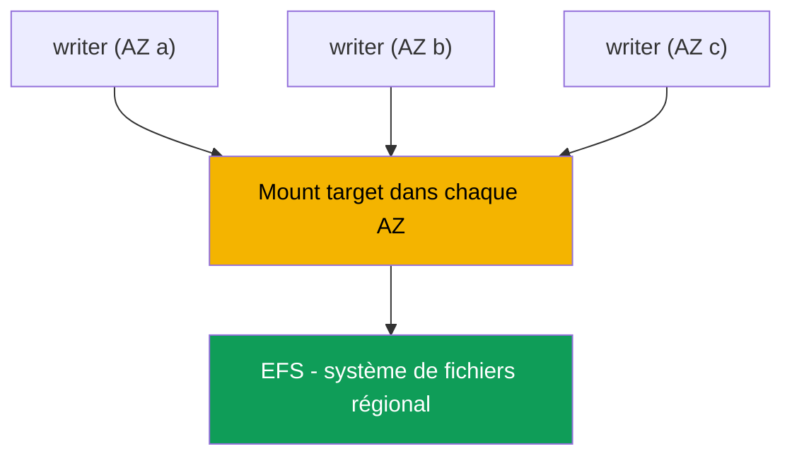
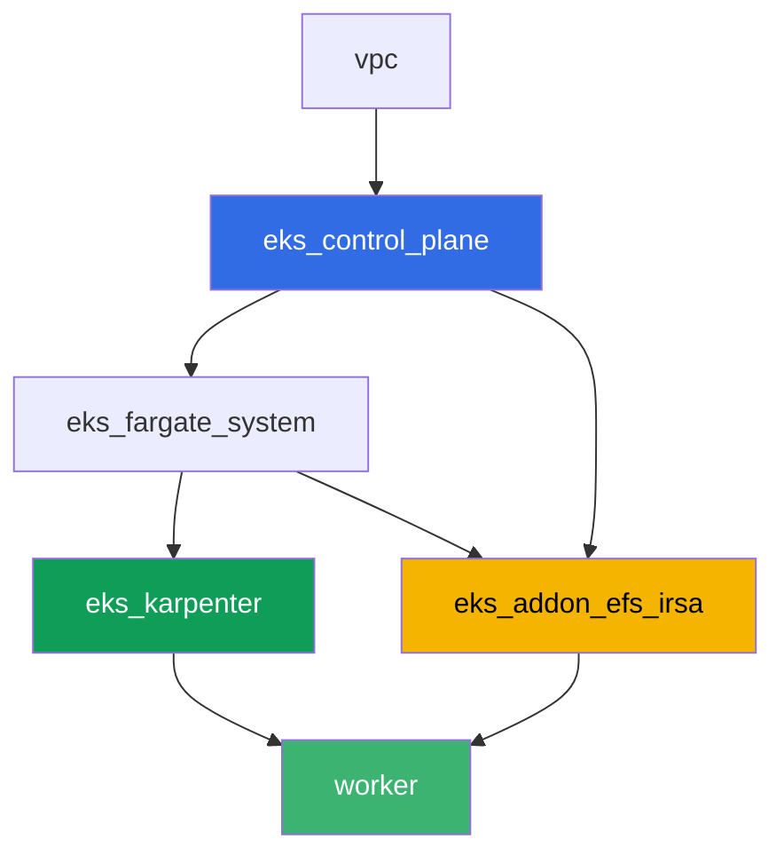

[Русская версия](README_RU.MD) · [Eng version](README.MD) · [Versión en español](README_ES.MD) · [Deutsche Version](README_DE.MD) · [ქართული ვერსია](README_GE.MD) · [繁體中文版](README_TW.MD) · [日本語版](README_JP.MD)

# Lab 107 - EFS CSI : ReadWriteMany entre zones de disponibilité

## Description

Ce lab porte sur le stockage réseau EFS dans EKS et sa principale différence par rapport au
stockage bloc EBS (chapitre 23) : plusieurs pods situés dans des zones de disponibilité
différentes peuvent écrire et lire simultanément sur le même volume. Vous mettez en place le
provisionnement dynamique via `efs.csi.aws.com`, répartissez un Deployment sur plusieurs AZ
avec `topologySpreadConstraints`, confirmez que les données écrites depuis une réplique sont
visibles depuis une autre, et comprenez pourquoi un PV sur EFS n'a pas de `nodeAffinity`
zonale. Une tâche à part est un diagnostic en lecture seule via AWS CLI : comment vérifier que
le security group du mount target autorise le NFS (port 2049) depuis les nœuds du cluster, et
ce qui se passe si cette règle est retirée.

Les tâches sont rédigées dans un style production : un énoncé court plus des critères
d'acceptation. La vérification est automatique, via la commande `check_result`.

## Objectif

Consolider les notions des chapitres du cours suivants :

- [Chapitre 24. EFS et FSx : stockage partagé pour les workloads entre AZ](../../course/24/ru.md) - le contenu principal de ce lab
- [Chapitre 23. EBS CSI : gp3, StorageClass, expansion, snapshots, ancrage à l'AZ](../../course/23/ru.md) - ce à quoi on compare : un volume bloc zonal contre un volume réseau régional
- [Chapitre 9. Types de compute : managed node groups, Fargate, Auto Mode](../../course/09/ru.md) - pourquoi le cluster possède plusieurs AZ et où vivent les nœuds
- [Chapitres 16-17. IRSA et Pod Identity](../../course/16/ru.md) - comment le driver obtient le droit de gérer EFS

## Ce que nous créons

| Objet | Ce que c'est | Pourquoi il est dans ce lab |
|--------|---------|-------------------|
| Namespace `eks-107` | une section du cluster pour le workload du lab | isole les ressources (chapitre 4) |
| StorageClass `efs-sc` | une classe avec `provisioningMode: efs-ap` pointant vers un vrai `fileSystemId` | provisionnement dynamique via des access points (chapitre 24) |
| PVC `shared-data` (`ReadWriteMany`, `5Gi`) | un volume partagé | un point de données unique pour toutes les répliques (chapitre 24) |
| Deployment `writer` (3 répliques, AZ différentes) | un workload sur le volume partagé | toutes les répliques sont `Running` en même temps et montent le même PVC (chapitre 24) |
| Artefact `readback.txt` | une ligne écrite dans une AZ et lue dans une autre | confirme un accès réseau partagé, pas une copie locale (chapitre 24) |
| Artefact `pv.yaml` + `explanation.txt` | le PV du volume et une explication | pas de `nodeAffinity` zonale, contrairement à EBS (chapitres 23-24) |
| Artefact `sg-rule.txt` + `diagnosis.txt` | la règle du SG sur le port 2049 et une explication | diagnostic NFS via AWS CLI, le symptôme quand la règle est absente (chapitre 24) |

Le chemin des données d'un pod vers le volume partagé :



## Infrastructure

L'environnement est déployé sur AWS (`eu-central-1`) via Terragrunt. Chaque répertoire de lab
est un composant avec son propre `terragrunt.hcl`, qui référence un module partagé dans
`terraform/modules/` et déclare des dépendances via des blocs `dependency`. Terragrunt
construit un graphe de dépendances et applique les composants dans le bon ordre. La base est
la même que dans le lab 101 (control plane, Fargate pour les pods système, Karpenter pour les
workloads), plus un composant séparé pour EFS CSI.

### Modules et dépendances

| Répertoire (composant) | Module (`terraform/modules/`) | Dépend de | Ce qu'il crée |
|---------------------|-------------------------------|------------|-------------|
| `vpc` | `vpc_v3` | - | VPC `10.10.0.0/16`, sous-réseaux dans deux AZ (`eu-central-1a`, `eu-central-1b`), NAT |
| `ssh-keys` | `ssh-keys` | - | une paire de clés SSH pour la worker machine et les nœuds |
| `eks_control_plane` | `eks_v2_control_plane` | `vpc` | control plane EKS `1.36`, OIDC, security groups |
| `eks_fargate_system` | `eks_v2_fargate` | `vpc`, `eks_control_plane` | Fargate profile pour `kube-system` et `karpenter` |
| `eks_addons` | `eks_v2_addons` | `eks_control_plane`, `eks_fargate_system` | coredns, kube-proxy, vpc-cni, pod-identity |
| `eks_karpenter` | `eks_v2_karpenter` | `vpc`, `eks_control_plane`, `eks_addons`, `eks_fargate_system` | contrôleur Karpenter, rôle IAM du nœud |
| `eks_karpenter_default_vng` | `eks_v2_karpenter_vng` | `vpc`, `eks_control_plane`, `eks_karpenter` | NodePool par défaut `default` sur AL2023 |
| `eks_addon_efs_irsa` | `eks_v2_efs_irsa` | `vpc`, `eks_control_plane`, `eks_fargate_system` | système de fichiers EFS, mount target dans chaque AZ, SG sur le port 2049, addon managé `aws-efs-csi-driver`, rôle IAM via IRSA |
| `worker` | `eks_v2_work_pc` | `ssh-keys`, `vpc`, `eks_control_plane`, `eks_karpenter`, `eks_addon_efs_irsa` | worker machine avec kubectl, les tests et `check_result` |

Le système de fichiers EFS, le mount target et le rôle du driver sont déjà mis en place par
le composant `eks_addon_efs_irsa` (chapitres 16-17, 24) : il n'est pas nécessaire de les
recréer dans les tâches, le driver est prêt au moment où vous créez le premier PVC (`worker`
dépend de `eks_addon_efs_irsa`).

Graphe de dépendances (ce qui est appliqué en premier est plus bas dans la flèche) :



Le cluster est construit sur deux AZ - c'est suffisant pour voir le scénario principal du
lab : EFS est accessible depuis les deux zones via son propre mount target dans chacune,
contrairement à EBS, où un volume est ancré à une seule AZ précise.

### Où les choses sont configurées

`env.hcl` (paramètres d'environnement partagés, lus par tous les composants) :

| Paramètre | Valeur dans le lab | Ce qu'il affecte |
|----------|-----------------|---------------|
| `region` | `eu-central-1` | région pour toutes les ressources |
| `subnets` | privés `eks1`/`eks2` dans `eu-central-1a`/`eu-central-1b` | zones où Karpenter fait apparaître les nœuds et où les mount targets EFS sont créés |
| `prefix` | `eks-task107` | préfixe pour les noms de ressources et les tags |
| `stack_name` | `eks107` | utilisé pour construire `env_name` - le nom du cluster |
| `k8_version` | `1.36.0` | version de kubectl sur la worker machine |

`inputs` dans le `terragrunt.hcl` de chaque composant (paramètres spécifiques à ce module) :

| Fichier | Paramètres clés |
|------|--------------------|
| `eks_addon_efs_irsa/terragrunt.hcl` | `subnet_ids` des sous-réseaux privés (un par AZ), `security_group_source_id` = SG des nœuds du cluster, addon managé `aws-efs-csi-driver` |
| `worker/terragrunt.hcl` | `test_url` et `task_script_url` pour les fichiers du lab 107, dépendance sur `eks_addon_efs_irsa` |

## Déploiement

```bash
TASK=107 make run_eks_task
```

Le déploiement prend environ 15-20 minutes. Dans la sortie, trouvez la ligne de connexion SSH
à la worker machine et connectez-vous. kubectl y est déjà configuré pour le bon cluster, le
driver EFS CSI est déjà installé et prêt à accepter des PVC, et le système de fichiers EFS est
déjà créé. Le cluster démarre avec zéro nœud EC2 (uniquement Fargate), donc avant de commencer
les tâches, la worker machine réchauffe exactement un nœud EC2 avec un pod de service dans le
namespace `efs-csi-warmup` - sans cela, le csi-provisioner ne peut pas générer les exigences
d'accessibilité, même pour un EFS régional, car il attend au moins un nœud avec une topologie
CSINode enregistrée. Le namespace `efs-csi-warmup` n'a rien à voir avec les tâches du lab, n'y
touchez pas.

Commandes utiles sur la worker machine :

```bash
time_left       # combien de temps d'environnement il reste
check_result    # vérifier la solution
```

> Sécurité de l'environnement. `env.hcl` a `ssh_password_enable = true` et
> `access_cidrs = ["0.0.0.0/0"]` activés - pratique pour un environnement de formation, mais
> ce n'est pas à faire en production. Selon les standards du cours (chapitres 0.2, 2, 19),
> l'accès aux worker machines devrait passer par AWS SSM Session Manager sans exposer de ports
> SSH publics, et `access_cidrs` devrait être restreint à des adresses spécifiques. Ici, le SSH
> public est laissé en place uniquement pour garder la mise en place simple.

## Tâches

---
|        **1**        | **Namespace pour le workload du lab**                             |
| :-----------------: | :---------------------------------------------------------- |
| Quoi faire          | Créez un namespace nommé `eks-107`. Tous les objets de ce lab sont créés à l'intérieur. |
| Critères d'acceptation    | - le namespace `eks-107` existe. |
---
|        **2**        | **StorageClass sur un vrai système de fichiers EFS**           |
| :-----------------: | :---------------------------------------------------------- |
| Quoi faire          | Le système de fichiers EFS est déjà créé par terraform. Trouvez son `fileSystemId` via `aws efs describe-file-systems` (tag `Name` = `eks-task107-efs`) et créez la StorageClass `efs-sc` : `provisioner: efs.csi.aws.com`, `parameters.provisioningMode: efs-ap`, `parameters.fileSystemId` - l'ID réel, `parameters.directoryPerms: "755"`, `mountOptions: ["tls"]`. |
| Critères d'acceptation    | - la StorageClass `efs-sc` existe ;<br/>- `provisioner: efs.csi.aws.com` ;<br/>- `parameters.provisioningMode: efs-ap` ;<br/>- `parameters.fileSystemId` correspond à l'ID réel du système de fichiers. |
---
|        **3**        | **PVC avec accès ReadWriteMany**                            |
| :-----------------: | :---------------------------------------------------------- |
| Quoi faire          | Dans `eks-107`, créez le PVC `shared-data` sur la StorageClass `efs-sc`, `accessModes: ["ReadWriteMany"]`, en demandant `5Gi`. Attendez le statut `Bound`. |
| Critères d'acceptation    | - PVC `shared-data` sur la classe `efs-sc` ;<br/>- `accessModes` contient `ReadWriteMany` ;<br/>- demande de `5Gi` ;<br/>- statut `Bound`. |
---
|        **4**        | **Deployment sur un volume partagé entre plusieurs AZ**                |
| :-----------------: | :---------------------------------------------------------- |
| Quoi faire          | Dans `eks-107`, créez le Deployment `writer`, image `viktoruj/ping_pong:alpine` (nécessite un shell pour la tâche 5), `3` répliques, volume `shared-data` monté dans chaque réplique. Ajoutez `topologySpreadConstraints` sur la clé `topology.kubernetes.io/zone` pour que les répliques se répartissent sur des AZ différentes. Assurez-vous que les `3` répliques sont `Running` en même temps et montent le même PVC - avec EBS (`ReadWriteOnce`) c'est impossible entre zones (`Multi-Attach error`, chapitre 23). |
| Critères d'acceptation    | - Deployment `writer` dans `eks-107`, image `viktoruj/ping_pong`, `3` répliques prêtes ;<br/>- un volume issu du PVC `shared-data` monté dans le pod ;<br/>- `topologySpreadConstraints` sur `topology.kubernetes.io/zone` ;<br/>- répliques physiquement dans `2` zones différentes ou plus. |
---
|        **5**        | **Confirmation de l'accès partagé entre AZ**                   |
| :-----------------: | :---------------------------------------------------------- |
| Quoi faire          | Depuis une réplique `writer`, ajoutez une ligne contenant le marqueur `efs-rwx-test` au fichier `/data/shared.txt` sur le volume partagé. Depuis une AUTRE réplique (une AZ différente), lisez ce fichier et enregistrez le résultat dans `/var/work/tests/artifacts/5/readback.txt`. |
| Critères d'acceptation    | - le fichier `readback.txt` n'est pas vide ;<br/>- il contient une ligne avec le marqueur `efs-rwx-test`. |
---
|        **6**        | **Vérification de l'absence de nodeAffinity zonale**                |
| :-----------------: | :---------------------------------------------------------- |
| Quoi faire          | Enregistrez `kubectl get pv <pv> -o yaml` pour le volume du PVC `shared-data` dans `/var/work/tests/artifacts/6/pv.yaml`. Assurez-vous que, contrairement à EBS (chapitre 23), ce PV n'a pas de section `spec.nodeAffinity`. Rédigez une explication dans `/var/work/tests/artifacts/6/explanation.txt` : pourquoi EFS n'ancre pas le PV à une zone, et ce que cela signifie pour le pod s'il est recréé dans une autre AZ. Le texte doit mentionner `nodeAffinity`. |
| Critères d'acceptation    | - le fichier `pv.yaml` n'est pas vide ;<br/>- le PV n'a pas de section `nodeAffinity` ;<br/>- le fichier `explanation.txt` n'est pas vide et mentionne `nodeAffinity`. |
---
|        **7**        | **Diagnostic : security group du mount target et port 2049**   |
| :-----------------: | :---------------------------------------------------------- |
| Quoi faire          | Casser réellement l'infrastructure est risqué, donc cette tâche est en lecture seule. En utilisant `aws efs describe-mount-targets`, trouvez le security group du mount target de votre EFS, et en utilisant `aws ec2 describe-security-groups`, confirmez qu'il possède une règle entrante pour TCP `2049` depuis le security group des nœuds du cluster. Enregistrez la sortie de la règle dans `/var/work/tests/artifacts/7/sg-rule.txt`. Dans le fichier `/var/work/tests/artifacts/7/diagnosis.txt`, expliquez ce qui se passerait si cette règle était absente : le pod ne recevra pas d'erreur d'accès explicite, le montage restera bloqué sur un timeout TCP vers le port `2049`, et `kubectl describe pod` affichera un événement `FailedMount`. |
| Critères d'acceptation    | - le fichier `sg-rule.txt` n'est pas vide et contient `2049` ;<br/>- le fichier `diagnosis.txt` n'est pas vide, contient `2049` et un mot sur le timeout (`FailedMount`/`timeout`). |
---

## Vérification du résultat

Sur la worker machine, lancez la vérification automatique :

```bash
check_result
```

Le script exécute les tests et affiche le pourcentage de tâches accomplies.

## Solution

Solution de référence : [worker/files/solutions/1_FR.MD](worker/files/solutions/1_FR.MD)

## Suppression du cluster et des ressources

> **Supprimez d'abord les PVC, puis le cluster.** Avec le provisionnement dynamique, le
> driver EFS CSI crée son propre **access point** dans le système de fichiers pour chaque
> PVC. Terraform a créé le système de fichiers lui-même, mais les access points sont créés
> par le driver, qui les supprime également une fois le PVC supprimé. Si vous détruisez le
> cluster alors que des PVC sont encore vivants, le driver aura disparu, les access points
> resteront, et la suppression du système de fichiers échouera avec `FileSystemInUse`, et
> `destroy` restera bloqué là-dessus.

```bash
kubectl delete namespace eks-107 --ignore-not-found
kubectl delete pvc --all -n eks-107 --ignore-not-found 2>/dev/null

while kubectl get nodes --no-headers 2>/dev/null | grep -qv fargate; do
  echo "Karpenter's EC2 node is still alive, waiting..."; sleep 15
done
```

Vérifiez qu'aucun access point créé par le driver ne reste dans le système de fichiers :

```bash
FS_ID=$(aws efs describe-file-systems \
  --query 'FileSystems[?contains(Name, `eks-task107`)].FileSystemId' --output text)
aws efs describe-access-points --file-system-id "$FS_ID" \
  --query 'AccessPoints[].[AccessPointId,RootDirectory.Path]' --output table
# delete any leftovers
aws efs delete-access-point --access-point-id <fsap-id>
```

```bash
TASK=107 make delete_eks_task
```
