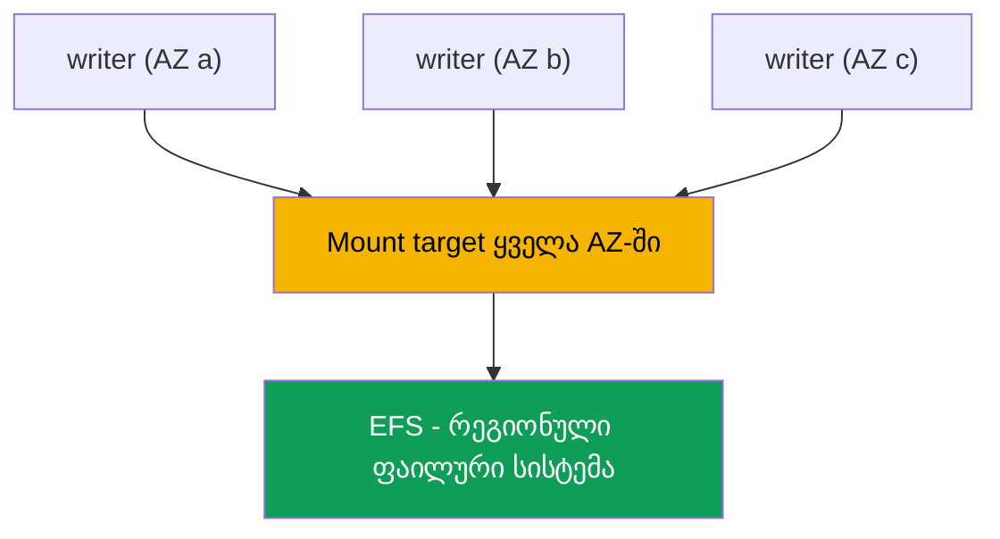
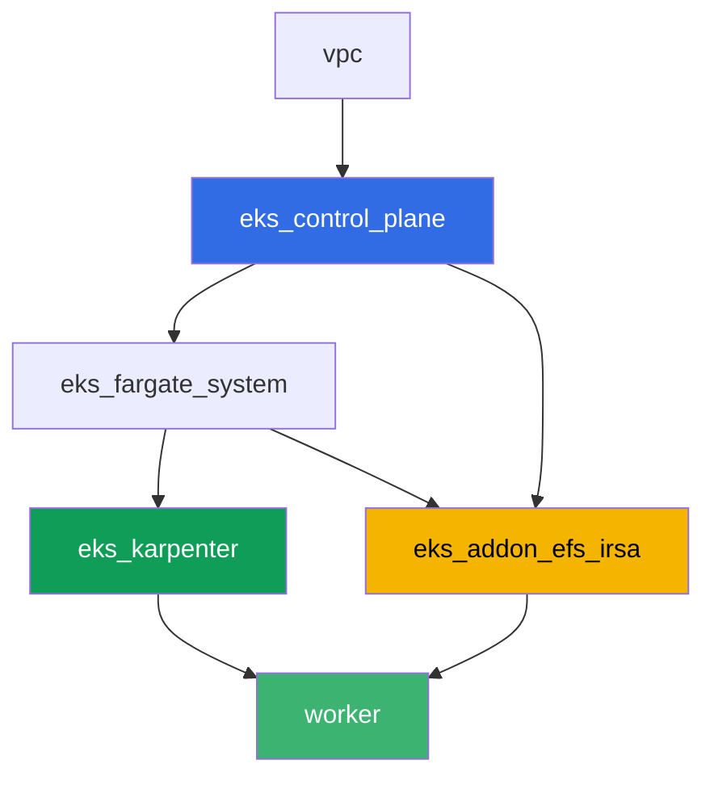

[Русская версия](README_RU.MD) · [Eng version](README.MD) · [Versión en español](README_ES.MD) · [Version française](README_FR.MD) · [Deutsche Version](README_DE.MD) · [繁體中文版](README_TW.MD) · [日本語版](README_JP.MD)

# ლაბა 107 - EFS CSI: ReadWriteMany ხელმისაწვდომობის ზონებს შორის

## აღწერა

ეს ლაბა ეხება EFS ქსელურ საცავს EKS-ში და მის მთავარ განსხვავებას ბლოკურ საცავ EBS-თან
(თავი 23) შედარებით: რამდენიმე pod სხვადასხვა ხელმისაწვდომობის ზონაში ერთდროულად
შეუძლია ჩაწეროს და წაიკითხოს ერთი და იმავე ტომიდან. თქვენ დააკონფიგურირებთ დინამიურ
პროვიზირებას `efs.csi.aws.com`-ის მეშვეობით, გაანაწილებთ Deployment-ს რამდენიმე AZ-ს
შორის `topologySpreadConstraints`-ის დახმარებით, დაადასტურებთ, რომ ერთი რეპლიკიდან
ჩაწერილი მონაცემები ხილვადია მეორედან, და გაარკვევთ, რატომ არ აქვს EFS-ზე PV-ს ზონალურ
`nodeAffinity`. ცალკე დავალება არის მხოლოდ წაკითხვის დიაგნოსტიკა AWS CLI-ის მეშვეობით:
როგორ შევამოწმოთ, რომ mount target-ის security group უშვებს NFS-ს (პორტი 2049)
კლასტერის ნოუდებიდან, და რა ხდება, თუ ეს წესი მოშორდება.

დავალებები დაწერილია პროდაქშენ სტილში: მოკლე ფორმულირება პლუს მიღების კრიტერიუმები.
შემოწმება ავტომატურია, `check_result` ბრძანების მეშვეობით.

## მიზანი

გაიმეორეთ და გაიმყაროთ მასალა კურსის შემდეგი თავებიდან:

- [თავი 24. EFS და FSx: გაზიარებული საცავი დატვირთვებისთვის AZ-ებს შორის](../../course/24/ru.md) - ამ ლაბის მთავარი მასალა
- [თავი 23. EBS CSI: gp3, StorageClass, გაფართოება, snapshots, AZ-სთან მიბმა](../../course/23/ru.md) - რასთან ვადარებთ: ზონალური ბლოკური ტომი რეგიონული ქსელური ტომის წინააღმდეგ
- [თავი 9. გამოთვლის ტიპები: managed node groups, Fargate, Auto Mode](../../course/09/ru.md) - რატომ აქვს კლასტერს რამდენიმე AZ და სად ცხოვრობენ ნოუდები
- [თავები 16-17. IRSA და Pod Identity](../../course/16/ru.md) - როგორ იღებს დრაივერი უფლებას EFS-ის მართვისთვის

## რას ვქმნით

| ობიექტი | რა არის ეს | რატომ არის ეს ლაბაში |
|--------|---------|-------------------|
| Namespace `eks-107` | კლასტერის სექცია ლაბის დატვირთვისთვის | რესურსებს ინახავს ცალკე (თავი 4) |
| StorageClass `efs-sc` | კლასი `provisioningMode: efs-ap`-ით, რომელიც მიმართავს ნამდვილ `fileSystemId`-ს | დინამიური პროვიზირება access point-ების მეშვეობით (თავი 24) |
| PVC `shared-data` (`ReadWriteMany`, `5Gi`) | გაზიარებული ტომი | ერთი მონაცემთა წერტილი ყველა რეპლიკისთვის (თავი 24) |
| Deployment `writer` (3 რეპლიკა, სხვადასხვა AZ) | დატვირთვა გაზიარებულ ტომზე | ყველა რეპლიკა ერთდროულად `Running`-ია და მონტავს ერთსა და იმავე PVC-ს (თავი 24) |
| არტეფაქტი `readback.txt` | ერთ AZ-ში ჩაწერილი და მეორეში წაკითხული ხაზი | ადასტურებს გაზიარებულ ქსელურ წვდომას, არა ლოკალურ კოპიას (თავი 24) |
| არტეფაქტი `pv.yaml` + `explanation.txt` | ტომის PV და განმარტება | არ აქვს ზონალურ `nodeAffinity`, EBS-ისგან განსხვავებით (თავები 23-24) |
| არტეფაქტი `sg-rule.txt` + `diagnosis.txt` | SG წესი 2049-ზე და განმარტება | NFS დიაგნოსტიკა AWS CLI-ის მეშვეობით, სიმპტომი, როცა წესი არ არსებობს (თავი 24) |

მონაცემების გზა pod-იდან გაზიარებულ ტომამდე:



## ინფრასტრუქტურა

გარემო განლაგებულია AWS-ში (`eu-central-1`) Terragrunt-ის მეშვეობით. ლაბის ყოველი
დირექტორია არის ერთი კომპონენტი საკუთარი `terragrunt.hcl`-ით, რომელიც მიმართავს
გაზიარებულ მოდულს `terraform/modules/`-ში და აცხადებს დამოკიდებულებებს `dependency`
ბლოკების მეშვეობით. Terragrunt აგებს დამოკიდებულებების გრაფს და აპლიცირებს
კომპონენტებს სწორი თანმიმდევრობით. ბაზა იგივეა, რაც ლაბა 101-ში (კონტროლის სიბრტყე,
Fargate სისტემური pod-ებისთვის, Karpenter დატვირთვებისთვის), პლუს ცალკე კომპონენტი
EFS CSI-სთვის.

### მოდულები და დამოკიდებულებები

| დირექტორია (კომპონენტი) | მოდული (`terraform/modules/`) | დამოკიდებულია | რას ქმნის |
|---------------------|-------------------------------|------------|-------------|
| `vpc` | `vpc_v3` | - | VPC `10.10.0.0/16`, subnet-ები ორ AZ-ში (`eu-central-1a`, `eu-central-1b`), NAT |
| `ssh-keys` | `ssh-keys` | - | SSH-გასაღებების წყვილი worker მანქანისა და ნოუდებისთვის |
| `eks_control_plane` | `eks_v2_control_plane` | `vpc` | EKS control plane `1.36`, OIDC, security groups |
| `eks_fargate_system` | `eks_v2_fargate` | `vpc`, `eks_control_plane` | Fargate პროფილი `kube-system`-ისთვის და `karpenter`-ისთვის |
| `eks_addons` | `eks_v2_addons` | `eks_control_plane`, `eks_fargate_system` | coredns, kube-proxy, vpc-cni, pod-identity |
| `eks_karpenter` | `eks_v2_karpenter` | `vpc`, `eks_control_plane`, `eks_addons`, `eks_fargate_system` | Karpenter კონტროლერი, ნოუდის IAM როლი |
| `eks_karpenter_default_vng` | `eks_v2_karpenter_vng` | `vpc`, `eks_control_plane`, `eks_karpenter` | ნაგულისხმევი NodePool `default` AL2023-ზე |
| `eks_addon_efs_irsa` | `eks_v2_efs_irsa` | `vpc`, `eks_control_plane`, `eks_fargate_system` | EFS ფაილური სისტემა, mount target ყველა AZ-ში, SG 2049-ზე, managed addon `aws-efs-csi-driver`, IAM როლი IRSA-ის მეშვეობით |
| `worker` | `eks_v2_work_pc` | `ssh-keys`, `vpc`, `eks_control_plane`, `eks_karpenter`, `eks_addon_efs_irsa` | worker მანქანა kubectl-ით, ტესტებით და `check_result`-ით |

EFS ფაილური სისტემა, mount target და დრაივერის როლი უკვე დაყენებულია კომპონენტ
`eks_addon_efs_irsa`-ს მიერ (თავები 16-17, 24): დავალებებში მათი ხელახლა შექმნა არ არის
საჭირო, დრაივერი მზადაა მანამ, სანამ პირველ PVC-ს შექმნით (`worker` დამოკიდებულია
`eks_addon_efs_irsa`-ზე).

დამოკიდებულებების გრაფი (რაც უფრო ადრე აპლიცირდება, ის ისარზე უფრო დაბლა არის):



კლასტერი აგებულია ორ AZ-ს ზემოთ - ეს საკმარისია ლაბის მთავარი სცენარის დასანახავად:
EFS ხელმისაწვდომია ორივე ზონიდან საკუთარი mount target-ის მეშვეობით თითოეულში,
EBS-ისგან განსხვავებით, სადაც ტომი მიბმულია ერთ კონკრეტულ AZ-ზე.

### სად არის კონფიგურირებული

`env.hcl` (გაზიარებული გარემოს პარამეტრები, რომელსაც კითხულობს ყველა კომპონენტი):

| პარამეტრი | მნიშვნელობა ლაბაში | რაზე ახდენს გავლენას |
|----------|-----------------|---------------|
| `region` | `eu-central-1` | რეგიონი ყველა რესურსისთვის |
| `subnets` | პრივატული `eks1`/`eks2` `eu-central-1a`/`eu-central-1b`-ში | ზონები, სადაც Karpenter აღმართავს ნოუდებს და სადაც იქმნება EFS mount target-ები |
| `prefix` | `eks-task107` | პრეფიქსი რესურსების სახელებისა და თეგებისთვის |
| `stack_name` | `eks107` | გამოიყენება `env_name`-ის ფორმირებისთვის - კლასტერის სახელი |
| `k8_version` | `1.36.0` | kubectl-ის ვერსია worker მანქანაზე |

`inputs` თითოეული კომპონენტის `terragrunt.hcl`-ში (ამ მოდულისთვის სპეციფიკური
პარამეტრები):

| ფაილი | ძირითადი პარამეტრები |
|------|--------------------|
| `eks_addon_efs_irsa/terragrunt.hcl` | `subnet_ids` პრივატული subnet-ებისთვის (თითო AZ-ზე), `security_group_source_id` = კლასტერის ნოუდის SG, managed addon `aws-efs-csi-driver` |
| `worker/terragrunt.hcl` | `test_url` და `task_script_url` ლაბა 107-ის ფაილებისთვის, დამოკიდებულება `eks_addon_efs_irsa`-ზე |

## განლაგება

```bash
TASK=107 make run_eks_task
```

განლაგება სავარაუდოდ 15-20 წუთს გრძელდება. გამოტანაში მოძებნეთ ხაზი SSH-კავშირით
worker მანქანასთან და დაუკავშირდით მას. kubectl იქ უკვე კონფიგურირებულია სწორ
კლასტერზე, EFS CSI დრაივერი უკვე დაინსტალირებულია და მზადაა PVC-ების მისაღებად, EFS
ფაილური სისტემა უკვე შექმნილია. კლასტერი იწყება ნულოვანი EC2 ნოუდით (მხოლოდ Fargate),
ამიტომ დავალებების დაწყებამდე worker მანქანა ათბობს ზუსტად ერთ EC2 ნოუდს სერვისული
pod-ით namespace `efs-csi-warmup`-ში - ამის გარეშე csi-provisioner-ს არ შეუძლია
დაგენერიროს accessibility requirements-ები რეგიონული EFS-ისთვისაც კი, რადგან ის
ელოდება მინიმუმ ერთ ნოუდს დარეგისტრირებული CSINode ტოპოლოგიით. Namespace
`efs-csi-warmup` არავითარ კავშირში არ არის ლაბის დავალებებთან, არ შეეხოთ მას.

სასარგებლო ბრძანებები worker მანქანაზე:

```bash
time_left       # how much environment time is left
check_result    # check the solution
```

> გარემოს უსაფრთხოება. `env.hcl`-ში ჩართულია `ssh_password_enable = true` და
> `access_cidrs = ["0.0.0.0/0"]` - მოსახერხებელია სასწავლო გარემოსთვის, მაგრამ ეს არ
> არის რაღაც, რისი გაკეთებაც ღირს პროდაქშენში. კურსის სტანდარტების მიხედვით (თავები
> 0.2, 2, 19), წვდომა worker მანქანებზე უნდა ხდებოდეს AWS SSM Session Manager-ის
> მეშვეობით, საჯარო SSH პორტების გამოჩენის გარეშე, ხოლო `access_cidrs` უნდა შევზღუდოთ
> კონკრეტულ მისამართებამდე. აქ საჯარო SSH დარჩენილია მხოლოდ კონფიგურაციის
> გასამარტივებლად.

## დავალებები

---
|        **1**        | **Namespace ლაბის დატვირთვისთვის**                             |
| :-----------------: | :---------------------------------------------------------- |
| რა უნდა გაკეთდეს          | შექმენით namespace სახელით `eks-107`. ამ ლაბის ყველა ობიექტი იქმნება მის შიგნით. |
| მიღების კრიტერიუმები    | - namespace `eks-107` არსებობს. |
---
|        **2**        | **StorageClass ნამდვილ EFS ფაილურ სისტემაზე**           |
| :-----------------: | :---------------------------------------------------------- |
| რა უნდა გაკეთდეს          | EFS ფაილური სისტემა უკვე შექმნილია terraform-ის მიერ. მოძებნეთ მისი `fileSystemId` `aws efs describe-file-systems`-ის მეშვეობით (თეგი `Name` = `eks-task107-efs`) და შექმენით StorageClass `efs-sc`: `provisioner: efs.csi.aws.com`, `parameters.provisioningMode: efs-ap`, `parameters.fileSystemId` - ნამდვილი ID, `parameters.directoryPerms: "755"`, `mountOptions: ["tls"]`. |
| მიღების კრიტერიუმები    | - StorageClass `efs-sc` არსებობს;<br/>- `provisioner: efs.csi.aws.com`;<br/>- `parameters.provisioningMode: efs-ap`;<br/>- `parameters.fileSystemId` ემთხვევა ნამდვილ ფაილური სისტემის ID-ს. |
---
|        **3**        | **PVC ReadWriteMany წვდომით**                            |
| :-----------------: | :---------------------------------------------------------- |
| რა უნდა გაკეთდეს          | `eks-107`-ში შექმენით PVC `shared-data` StorageClass `efs-sc`-ზე, `accessModes: ["ReadWriteMany"]`, მოთხოვნით `5Gi`. დაელოდეთ `Bound` სტატუსს. |
| მიღების კრიტერიუმები    | - PVC `shared-data` კლასზე `efs-sc`;<br/>- `accessModes` შეიცავს `ReadWriteMany`-ს;<br/>- მოთხოვნა `5Gi`;<br/>- სტატუსი `Bound`. |
---
|        **4**        | **Deployment გაზიარებულ ტომზე რამდენიმე AZ-ს ზემოთ**                |
| :-----------------: | :---------------------------------------------------------- |
| რა უნდა გაკეთდეს          | `eks-107`-ში შექმენით Deployment `writer`, image `viktoruj/ping_pong:alpine` (საჭიროა shell დავალება 5-ისთვის), `3` რეპლიკა, ტომი `shared-data` მონტირებული ყოველ რეპლიკაში. დაამატეთ `topologySpreadConstraints` გასაღებზე `topology.kubernetes.io/zone`, რომ რეპლიკები გადანაწილდნენ სხვადასხვა AZ-ს შორის. დარწმუნდით, რომ ყველა `3` რეპლიკა ერთდროულად არის `Running` და მონტავს ერთსა და იმავე PVC-ს - EBS-ით (`ReadWriteOnce`) ეს შეუძლებელია ზონებს შორის (`Multi-Attach error`, თავი 23). |
| მიღების კრიტერიუმები    | - Deployment `writer` `eks-107`-ში, image `viktoruj/ping_pong`, `3` მზა რეპლიკა;<br/>- PVC `shared-data`-დან ტომი მონტირებული pod-ში;<br/>- `topologySpreadConstraints` `topology.kubernetes.io/zone`-ზე;<br/>- რეპლიკები ფიზიკურად `2` ან მეტ სხვადასხვა ზონაში. |
---
|        **5**        | **გაზიარებული წვდომის დადასტურება AZ-ებს შორის**                   |
| :-----------------: | :---------------------------------------------------------- |
| რა უნდა გაკეთდეს          | ერთი `writer` რეპლიკიდან დაამატეთ ხაზი, რომელიც შეიცავს მარკერს `efs-rwx-test`, ფაილში `/data/shared.txt` გაზიარებულ ტომზე. სხვა რეპლიკიდან (სხვა AZ-დან) წაიკითხეთ ეს ფაილი და შედეგი შეინახეთ `/var/work/tests/artifacts/5/readback.txt`-ში. |
| მიღების კრიტერიუმები    | - ფაილი `readback.txt` არ არის ცარიელი;<br/>- შეიცავს ხაზს მარკერით `efs-rwx-test`. |
---
|        **6**        | **ზონალური nodeAffinity-ის არარსებობის შემოწმება**                |
| :-----------------: | :---------------------------------------------------------- |
| რა უნდა გაკეთდეს          | შეინახეთ `kubectl get pv <pv> -o yaml` PVC `shared-data`-ის ტომისთვის `/var/work/tests/artifacts/6/pv.yaml`-ში. დარწმუნდით, რომ EBS-ისგან განსხვავებით (თავი 23), ამ PV-ს არ აქვს `spec.nodeAffinity` სექცია. დაწერეთ განმარტება `/var/work/tests/artifacts/6/explanation.txt`-ში: რატომ არ მიაბამს EFS PV-ს ზონას, და რას ნიშნავს ეს pod-ისთვის, თუ ის ხელახლა შეიქმნება სხვა AZ-ში. ტექსტში აუცილებლად უნდა იხსენიებოდეს `nodeAffinity`. |
| მიღების კრიტერიუმები    | - ფაილი `pv.yaml` არ არის ცარიელი;<br/>- PV-ს არ აქვს `nodeAffinity` სექცია;<br/>- ფაილი `explanation.txt` არ არის ცარიელი და იხსენიებს `nodeAffinity`-ს. |
---
|        **7**        | **დიაგნოსტიკა: mount target-ის security group და პორტი 2049**   |
| :-----------------: | :---------------------------------------------------------- |
| რა უნდა გაკეთდეს          | ინფრასტრუქტურის ნამდვილად დამტვრევა რისკიანია, ამიტომ ეს დავალება მხოლოდ წაკითხვის ხასიათისაა. `aws efs describe-mount-targets`-ის მეშვეობით მოძებნეთ თქვენი EFS-ის mount target-ის security group, და `aws ec2 describe-security-groups`-ის მეშვეობით დაადასტურეთ, რომ მას აქვს inbound წესი TCP `2049`-ისთვის კლასტერის ნოუდის security group-იდან. შეინახეთ წესის გამოტანა `/var/work/tests/artifacts/7/sg-rule.txt`-ში. ფაილში `/var/work/tests/artifacts/7/diagnosis.txt` განმარტეთ, რა მოხდებოდა, ეს წესი რომ არ ყოფილიყო: pod არ მიიღებს ცხადად გამოხატულ წვდომის შეცდომას, მონტირება ჩაიკეტება TCP timeout-ზე პორტ `2049`-ისთვის, და `kubectl describe pod` გამოაჩენს `FailedMount` event-ს. |
| მიღების კრიტერიუმები    | - ფაილი `sg-rule.txt` არ არის ცარიელი და შეიცავს `2049`-ს;<br/>- ფაილი `diagnosis.txt` არ არის ცარიელი, შეიცავს `2049`-ს და სიტყვას timeout-ის შესახებ (`FailedMount`/`timeout`). |
---

## შედეგის შემოწმება

worker მანქანაზე გაუშვით ავტომატური შემოწმება:

```bash
check_result
```

სკრიპტი გაუშვებს ტესტებს და აჩვენებს დასრულებული დავალებების პროცენტს.

## გადაწყვეტა

ეტალონური გადაწყვეტა: [worker/files/solutions/1_GE.MD](worker/files/solutions/1_GE.MD)

## კლასტერისა და რესურსების წაშლა

> **ჯერ წაშალეთ PVC-ები, შემდეგ კლასტერი.** დინამიური პროვიზირებისას EFS CSI
> დრაივერი ქმნის საკუთარ **access point**-ს ფაილური სისტემის შიგნით თითოეული
> PVC-სთვის. Terraform-მა შექმნა თავად ფაილური სისტემა, მაგრამ access point-ებს ქმნის
> დრაივერი, და ის ასევე შლის მათ PVC-ის წაშლის შემდეგ. თუ კლასტერს დაანგრევთ, სანამ
> PVC-ები ჯერ კიდევ ცოცხალია, დრაივერი გაქრება, access point-ები დარჩება, და ფაილური
> სისტემის წაშლა ჩავარდება `FileSystemInUse`-ით, და `destroy` მასზე გაჭედება.

```bash
kubectl delete namespace eks-107 --ignore-not-found
kubectl delete pvc --all -n eks-107 --ignore-not-found 2>/dev/null

while kubectl get nodes --no-headers 2>/dev/null | grep -qv fargate; do
  echo "Karpenter's EC2 node is still alive, waiting..."; sleep 15
done
```

დარწმუნდით, რომ ფაილურ სისტემაში არ დარჩა დრაივერის მიერ შექმნილი access point-ები:

```bash
FS_ID=$(aws efs describe-file-systems \
  --query 'FileSystems[?contains(Name, `eks-task107`)].FileSystemId' --output text)
aws efs describe-access-points --file-system-id "$FS_ID" \
  --query 'AccessPoints[].[AccessPointId,RootDirectory.Path]' --output table
# delete any leftovers
aws efs delete-access-point --access-point-id <fsap-id>
```

```bash
TASK=107 make delete_eks_task
```
