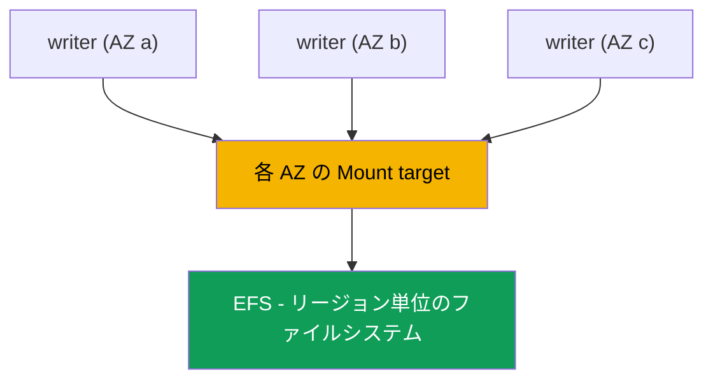
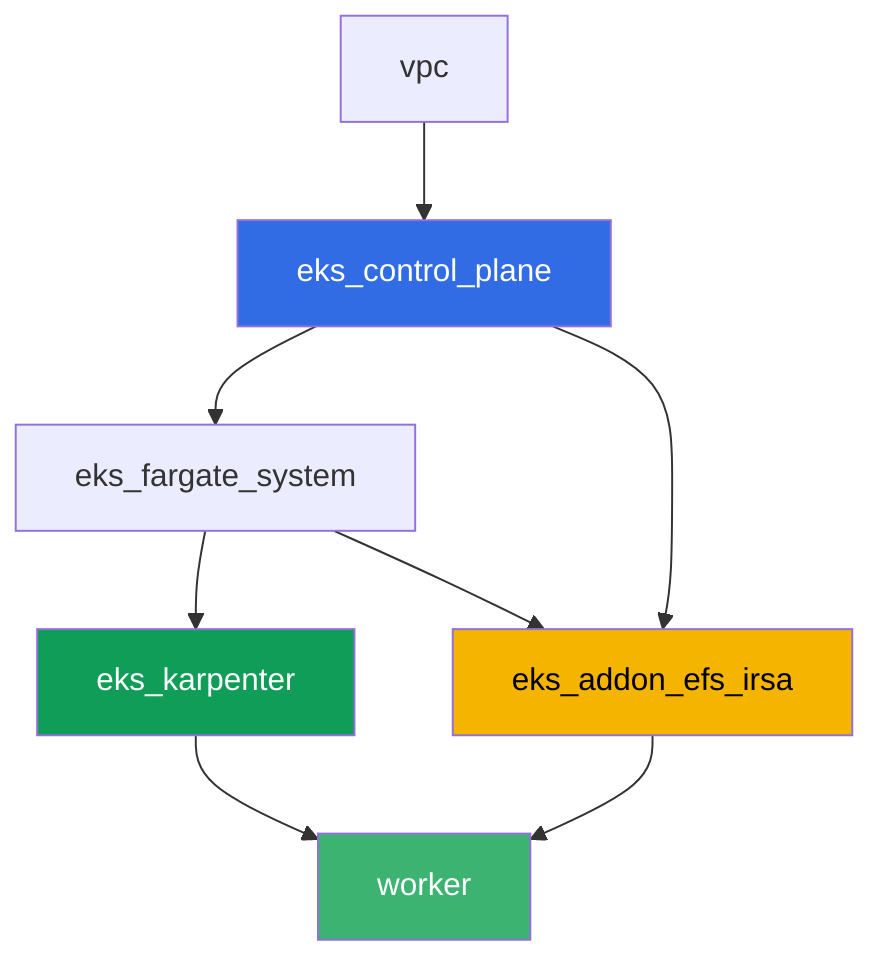

[Русская версия](README_RU.MD) · [Eng version](README.MD) · [Versión en español](README_ES.MD) · [Version française](README_FR.MD) · [Deutsche Version](README_DE.MD) · [ქართული ვერსია](README_GE.MD) · [繁體中文版](README_TW.MD)

# Lab 107 - EFS CSI: アベイラビリティゾーン間の ReadWriteMany

## 説明

このラボは EKS におけるネットワークストレージ EFS と、ブロックストレージ EBS(第 23 章)
との主な違いについて扱います。異なるアベイラビリティゾーンにある複数の Pod が、同じ
volume に対して同時に書き込みと読み取りを行えます。`efs.csi.aws.com` を使って動的
プロビジョニングを設定し、`topologySpreadConstraints` で Deployment を複数の AZ に
分散させ、あるレプリカで書き込んだデータが別のレプリカから見えることを確認し、EFS 上の
PV になぜゾーンごとの `nodeAffinity` がないのかを調べます。別のタスクとして、AWS CLI
による読み取り専用の診断もあります: mount target の security group がクラスターノード
からの NFS(port 2049)を許可しているかどうかの確認方法、そしてそのルールが削除された
場合に何が起こるかです。

タスクはプロダクションスタイルで書かれています: 短い説明文と受け入れ基準です。チェックは
`check_result` コマンドで自動的に行われます。

## 目標

以下のコース章の内容を強化します:

- [第 24 章。EFS と FSx: AZ をまたぐワークロード用の共有ストレージ](../../course/24/jp.md) - このラボの主要な材料
- [第 23 章。EBS CSI: gp3、StorageClass、拡張、スナップショット、AZ バインディング](../../course/23/jp.md) - 比較対象: ゾーン単位のブロック volume とリージョン単位のネットワーク volume
- [第 9 章。コンピュートタイプ: managed node group、Fargate、Auto Mode](../../course/09/jp.md) - クラスターに複数の AZ がある理由と、ノードがどこにあるか
- [第 16-17 章。IRSA と Pod Identity](../../course/16/jp.md) - driver が EFS を管理する権限をどのように得るか

## 作成するもの

| オブジェクト | それは何か | このラボでの役割 |
|--------|---------|-------------------|
| Namespace `eks-107` | ラボのワークロード用のクラスター区画 | 他のリソースと分離する(第 4 章) |
| StorageClass `efs-sc` | `provisioningMode: efs-ap` を持ち、実際の `fileSystemId` を指すクラス | access point による動的プロビジョニング(第 24 章) |
| PVC `shared-data`(`ReadWriteMany`、`5Gi`) | 共有 volume | すべてのレプリカにとって単一のデータポイント(第 24 章) |
| Deployment `writer`(3 レプリカ、異なる AZ) | 共有 volume 上のワークロード | すべてのレプリカが同時に `Running` になり、同じ PVC をマウントする(第 24 章) |
| アーティファクト `readback.txt` | 1 つの AZ で書き込み、別の AZ で読み取った行 | ローカルコピーではなく共有ネットワークアクセスであることの確認(第 24 章) |
| アーティファクト `pv.yaml` + `explanation.txt` | volume の PV とその説明 | EBS と異なり、ゾーンごとの `nodeAffinity` がない(第 23-24 章) |
| アーティファクト `sg-rule.txt` + `diagnosis.txt` | 2049 番ポートの SG ルールとその説明 | AWS CLI による NFS 診断、ルールが欠けている場合の症状(第 24 章) |

Pod から共有 volume までのデータパス:



## インフラ

環境は Terragrunt を使って AWS(`eu-central-1`)にデプロイされます。各ラボディレクトリは
独自の `terragrunt.hcl` を持つ 1 つのコンポーネントで、`terraform/modules/` 内の共有
モジュールを参照し、`dependency` ブロックを通じて依存関係を宣言します。Terragrunt は
依存関係グラフを構築し、正しい順序でコンポーネントを適用します。ベースはラボ 101 と同じ
(control plane、システム Pod 用の Fargate、ワークロード用の Karpenter)で、これに加えて
EFS CSI 用の独立したコンポーネントがあります。

### モジュールと依存関係

| ディレクトリ(コンポーネント) | モジュール(`terraform/modules/`) | 依存先 | 作成するもの |
|---------------------|-------------------------------|------------|-------------|
| `vpc` | `vpc_v3` | - | VPC `10.10.0.0/16`、2 つの AZ(`eu-central-1a`、`eu-central-1b`)のサブネット、NAT |
| `ssh-keys` | `ssh-keys` | - | worker マシンとノード用の SSH キーペア |
| `eks_control_plane` | `eks_v2_control_plane` | `vpc` | EKS control plane `1.36`、OIDC、security group |
| `eks_fargate_system` | `eks_v2_fargate` | `vpc`, `eks_control_plane` | `kube-system` と `karpenter` 用の Fargate profile |
| `eks_addons` | `eks_v2_addons` | `eks_control_plane`, `eks_fargate_system` | coredns、kube-proxy、vpc-cni、pod-identity |
| `eks_karpenter` | `eks_v2_karpenter` | `vpc`, `eks_control_plane`, `eks_addons`, `eks_fargate_system` | Karpenter controller、ノードの IAM role |
| `eks_karpenter_default_vng` | `eks_v2_karpenter_vng` | `vpc`, `eks_control_plane`, `eks_karpenter` | AL2023 上のデフォルト NodePool `default` |
| `eks_addon_efs_irsa` | `eks_v2_efs_irsa` | `vpc`, `eks_control_plane`, `eks_fargate_system` | EFS ファイルシステム、各 AZ の mount target、2049 番ポートの SG、managed addon `aws-efs-csi-driver`、IRSA による IAM role |
| `worker` | `eks_v2_work_pc` | `ssh-keys`, `vpc`, `eks_control_plane`, `eks_karpenter`, `eks_addon_efs_irsa` | kubectl、テスト、`check_result` を備えた worker マシン |

EFS ファイルシステム、mount target、driver の role は、すでに `eks_addon_efs_irsa`
コンポーネントによって用意されています(第 16-17、24 章): タスクの中で再度作成する必要は
なく、最初の PVC を作成する時点で driver は準備済みです(`worker` は
`eks_addon_efs_irsa` に依存します)。

依存関係グラフ(先に適用されるものが矢印の下側):



クラスターは 2 つの AZ にわたって構築されています - これでこのラボの主要なシナリオを
確認するのに十分です: EFS は各ゾーンに自身の mount target を持ち、両方のゾーンから
到達可能です。これに対して EBS では、volume は特定の 1 つの AZ にバインドされます。

### 設定箇所

`env.hcl`(すべてのコンポーネントが読み込む共通の環境パラメータ):

| パラメータ | ラボでの値 | 影響する範囲 |
|----------|-----------------|---------------|
| `region` | `eu-central-1` | すべてのリソースのリージョン |
| `subnets` | `eu-central-1a`/`eu-central-1b` のプライベートサブネット `eks1`/`eks2` | Karpenter がノードを起動し、EFS mount target が作成されるゾーン |
| `prefix` | `eks-task107` | リソース名とタグのプレフィックス |
| `stack_name` | `eks107` | `env_name`(クラスター名)の構築に使用 |
| `k8_version` | `1.36.0` | worker マシン上の kubectl バージョン |

各コンポーネントの `terragrunt.hcl` 内の `inputs`(そのモジュール固有の設定):

| ファイル | 主な設定 |
|------|--------------------|
| `eks_addon_efs_irsa/terragrunt.hcl` | プライベートサブネット(各 AZ に 1 つ)の `subnet_ids`、`security_group_source_id` = クラスターノードの SG、managed addon `aws-efs-csi-driver` |
| `worker/terragrunt.hcl` | ラボ 107 のファイル用の `test_url` と `task_script_url`、`eks_addon_efs_irsa` への依存 |

## デプロイ

```bash
TASK=107 make run_eks_task
```

デプロイにはおおよそ 15-20 分かかります。出力の中から worker マシンへの SSH 接続の行を
見つけて接続してください。そこの kubectl は正しいクラスターに対してすでに設定されており、
EFS CSI driver はすでにインストールされ PVC を受け付ける準備が整っており、EFS
ファイルシステムもすでに作成済みです。クラスターは EC2 ノードが 0 個の状態で始まります
(Fargate のみ)。そのため、タスクを始める前に worker マシンが namespace
`efs-csi-warmup` 内のサービス Pod を使って、ちょうど 1 つの EC2 ノードをウォームアップ
します - これがないと、リージョン単位の EFS であっても、csi-provisioner は
accessibility 要件を生成できません。これは、CSINode topology が登録されたノードが
少なくとも 1 つ存在するまで待つためです。namespace `efs-csi-warmup` はこのラボの
タスクとは無関係なので、触らないでください。

worker マシン上で使える便利なコマンド:

```bash
time_left       # 環境の残り時間
check_result    # 解答をチェック
```

> 環境のセキュリティについて。`env.hcl` では `ssh_password_enable = true` と
> `access_cidrs = ["0.0.0.0/0"]` が有効になっています - トレーニング環境としては
> 便利ですが、プロダクションで行うべきことではありません。コースの基準(第 0.2、2、19 章)
> に従えば、worker マシンへのアクセスは公開 SSH ポートを晒すことなく AWS SSM Session
> Manager 経由で行うべきであり、`access_cidrs` は特定のアドレスに絞るべきです。ここでは
> 設定を簡単にするためだけに公開 SSH をそのままにしています。

## タスク

---
|        **1**        | **ラボのワークロード用の Namespace**                             |
| :-----------------: | :---------------------------------------------------------- |
| やること          | `eks-107` という名前の namespace を作成してください。このラボのすべてのオブジェクトはこの中に作成されます。 |
| 受け入れ基準    | - namespace `eks-107` が存在する。 |
---
|        **2**        | **実際の EFS ファイルシステムを指す StorageClass**           |
| :-----------------: | :---------------------------------------------------------- |
| やること          | EFS ファイルシステムはすでに terraform によって作成されています。`aws efs describe-file-systems`(タグ `Name` = `eks-task107-efs`)を使ってその `fileSystemId` を見つけ、StorageClass `efs-sc` を作成してください: `provisioner: efs.csi.aws.com`、`parameters.provisioningMode: efs-ap`、`parameters.fileSystemId` - 実際の ID、`parameters.directoryPerms: "755"`、`mountOptions: ["tls"]`。 |
| 受け入れ基準    | - StorageClass `efs-sc` が存在する;<br/>- `provisioner: efs.csi.aws.com`;<br/>- `parameters.provisioningMode: efs-ap`;<br/>- `parameters.fileSystemId` が実際のファイルシステム ID と一致する。 |
---
|        **3**        | **ReadWriteMany アクセスを持つ PVC**                            |
| :-----------------: | :---------------------------------------------------------- |
| やること          | `eks-107` 内に、StorageClass `efs-sc` を使う PVC `shared-data` を作成してください。`accessModes: ["ReadWriteMany"]`、要求サイズ `5Gi`。`Bound` になるまで待ってください。 |
| 受け入れ基準    | - PVC `shared-data` がクラス `efs-sc` を使用している;<br/>- `accessModes` に `ReadWriteMany` が含まれる;<br/>- 要求サイズが `5Gi`;<br/>- ステータスが `Bound`。 |
---
|        **4**        | **複数の AZ にわたる共有 volume 上の Deployment**                |
| :-----------------: | :---------------------------------------------------------- |
| やること          | `eks-107` 内に、Deployment `writer` を作成してください。image は `viktoruj/ping_pong:alpine`(タスク 5 でシェルが必要)、`3` レプリカ、各レプリカに volume `shared-data` をマウントします。key `topology.kubernetes.io/zone` に対する `topologySpreadConstraints` を追加し、レプリカが異なる AZ に分散するようにしてください。`3` レプリカすべてが同時に `Running` になり、同じ PVC をマウントすることを確認してください - EBS(`ReadWriteOnce`)ではゾーンをまたいでこれは不可能です(`Multi-Attach error`、第 23 章)。 |
| 受け入れ基準    | - `eks-107` 内の Deployment `writer`、image `viktoruj/ping_pong`、`3` レプリカが ready;<br/>- PVC `shared-data` からの volume が Pod にマウントされている;<br/>- `topology.kubernetes.io/zone` に対する `topologySpreadConstraints`;<br/>- レプリカが物理的に `2` 個以上の異なるゾーンに存在する。 |
---
|        **5**        | **AZ をまたぐ共有アクセスの確認**                   |
| :-----------------: | :---------------------------------------------------------- |
| やること          | 1 つの `writer` レプリカから、マーカー `efs-rwx-test` を含む行を共有 volume 上のファイル `/data/shared.txt` に追記してください。別のレプリカ(異なる AZ)からそのファイルを読み取り、結果を `/var/work/tests/artifacts/5/readback.txt` に保存してください。 |
| 受け入れ基準    | - ファイル `readback.txt` が空でない;<br/>- マーカー `efs-rwx-test` を含む行がある。 |
---
|        **6**        | **ゾーンごとの nodeAffinity が存在しないことの確認**                |
| :-----------------: | :---------------------------------------------------------- |
| やること          | PVC `shared-data` の volume に対する `kubectl get pv <pv> -o yaml` の結果を `/var/work/tests/artifacts/6/pv.yaml` に保存してください。EBS(第 23 章)と異なり、この PV に `spec.nodeAffinity` セクションが無いことを確認してください。`/var/work/tests/artifacts/6/explanation.txt` に説明を書いてください: EFS が PV をゾーンに固定しない理由、そして Pod が別の AZ で再作成された場合にそれが何を意味するかです。テキストには `nodeAffinity` という語を含めてください。 |
| 受け入れ基準    | - ファイル `pv.yaml` が空でない;<br/>- PV に `nodeAffinity` セクションが無い;<br/>- ファイル `explanation.txt` が空でなく、`nodeAffinity` に言及している。 |
---
|        **7**        | **診断: mount target の security group と 2049 番ポート**   |
| :-----------------: | :---------------------------------------------------------- |
| やること          | 実際にインフラを壊すのはリスクが高いため、このタスクは読み取り専用です。`aws efs describe-mount-targets` を使って EFS の mount target の security group を見つけ、`aws ec2 describe-security-groups` を使って、クラスターノードの security group からの TCP `2049` に対する inbound ルールがあることを確認してください。ルールの出力を `/var/work/tests/artifacts/7/sg-rule.txt` に保存してください。ファイル `/var/work/tests/artifacts/7/diagnosis.txt` に、このルールが無かった場合にどうなるかを説明してください: Pod は明示的なアクセスエラーを受け取らず、マウント処理は `2049` 番ポートへの TCP タイムアウトでハングし、`kubectl describe pod` には `FailedMount` イベントが表示されます。 |
| 受け入れ基準    | - ファイル `sg-rule.txt` が空でなく、`2049` を含む;<br/>- ファイル `diagnosis.txt` が空でなく、`2049` とタイムアウトに関する語(`FailedMount`/`timeout`)を含む。 |
---

## 結果の確認

worker マシン上で自動チェックを実行してください:

```bash
check_result
```

スクリプトはテストを実行し、完了したタスクの割合を表示します。

## 解答

参考解答: [worker/files/solutions/1_JP.MD](worker/files/solutions/1_JP.MD)

## クラスターとリソースの削除

> **まず PVC を削除し、その後クラスターを削除してください。** 動的プロビジョニングでは、
> EFS CSI driver が PVC ごとにファイルシステム内に自身の **access point** を作成します。
> ファイルシステム自体は Terraform が作成しましたが、access point は driver によって
> 作成され、PVC が削除されると driver がそれも削除します。PVC がまだ存在する状態で
> クラスターを解体すると、driver が消えてしまい、access point が残ったままになり、
> ファイルシステムの削除は `FileSystemInUse` で失敗し、`destroy` はそこで止まってしまいます。

```bash
kubectl delete namespace eks-107 --ignore-not-found
kubectl delete pvc --all -n eks-107 --ignore-not-found 2>/dev/null

while kubectl get nodes --no-headers 2>/dev/null | grep -qv fargate; do
  echo "Karpenter の EC2 ノードがまだ稼働中です。待機しています..."; sleep 15
done
```

driver によって作成された access point がファイルシステムに残っていないか確認してください:

```bash
FS_ID=$(aws efs describe-file-systems \
  --query 'FileSystems[?contains(Name, `eks-task107`)].FileSystemId' --output text)
aws efs describe-access-points --file-system-id "$FS_ID" \
  --query 'AccessPoints[].[AccessPointId,RootDirectory.Path]' --output table
# 残っているものを削除
aws efs delete-access-point --access-point-id <fsap-id>
```

```bash
TASK=107 make delete_eks_task
```
