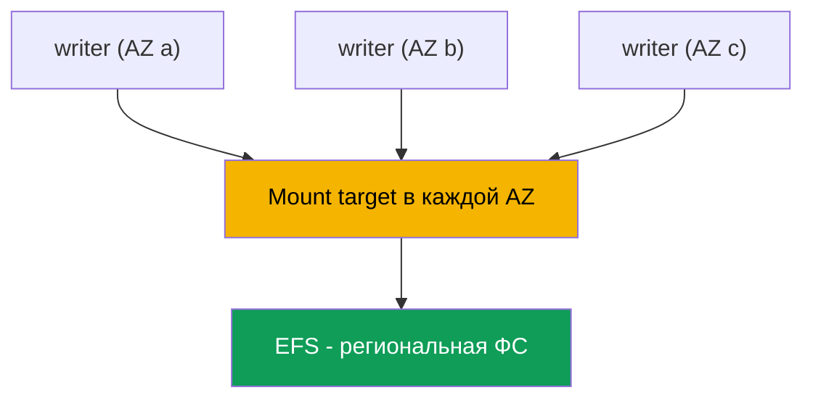
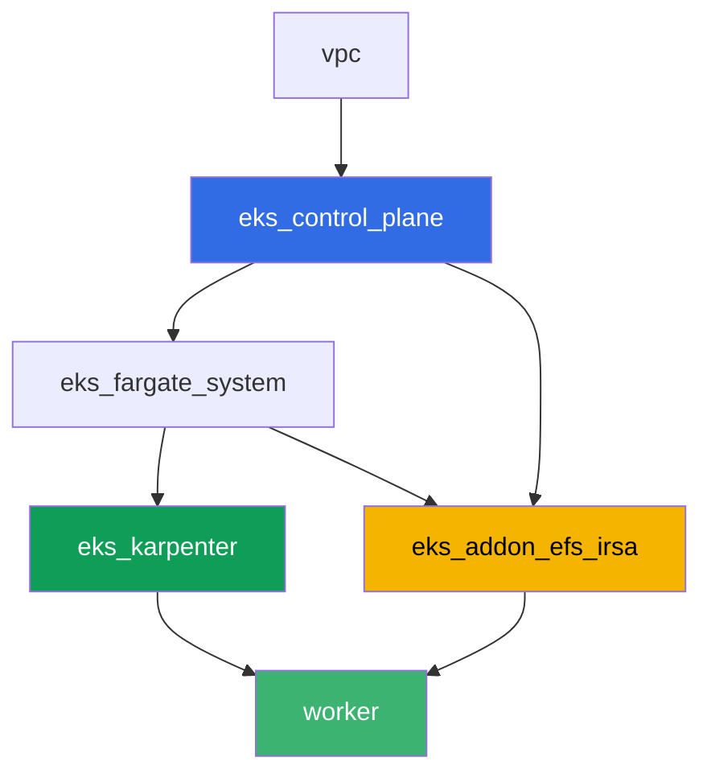

# Лаба 107 - EFS CSI: ReadWriteMany между зонами доступности

## Описание

Лаба про сетевое хранилище EFS в EKS и про главное отличие от блочного EBS (глава 23):
несколько подов в разных зонах доступности могут одновременно писать и читать один и тот
же том. Вы разворачиваете динамический провижининг через `efs.csi.aws.com`, раскладываете
Deployment по нескольким AZ через `topologySpreadConstraints`, подтверждаете, что данные,
записанные из одной реплики, видны из другой, и разбираетесь, почему у PV на EFS нет
`nodeAffinity` на зону. Отдельное задание - read-only диагностика через AWS CLI: как
проверить, что security group mount target разрешает NFS (порт 2049) от нод кластера, и
что произойдёт, если это правило убрать.

Задания в продакшн-стиле: короткая постановка плюс критерии приёмки. Проверка -
автоматическая, командой `check_result`.

## Цель

Закрепить материал глав курса:

- [Глава 24. EFS и FSx: shared storage для нагрузок между AZ](../../course/24/ru.md) - основной материал лабы
- [Глава 23. EBS CSI: gp3, StorageClass, расширение, снапшоты, привязка к AZ](../../course/23/ru.md) - с чем сравниваем: зональный блочный том против регионального сетевого
- [Глава 9. Типы вычислений: managed node groups, Fargate, Auto Mode](../../course/09/ru.md) - почему в кластере несколько AZ и где живут ноды
- [Главы 16-17. IRSA и Pod Identity](../../course/16/ru.md) - как драйвер получает право на управление EFS

## Что мы создаём

| Объект | Что это | Зачем в этой лабе |
|--------|---------|-------------------|
| Namespace `eks-107` | раздел кластера под нагрузку лабы | держим ресурсы отдельно (глава 4) |
| StorageClass `efs-sc` | класс с `provisioningMode: efs-ap` на реальный `fileSystemId` | динамический провижининг через access point (глава 24) |
| PVC `shared-data` (`ReadWriteMany`, `5Gi`) | общий том | одна точка данных для всех реплик (глава 24) |
| Deployment `writer` (3 реплики, разные AZ) | нагрузка на общем томе | все реплики одновременно `Running` и монтируют один PVC (глава 24) |
| Артефакт `readback.txt` | строка, записанная в одной AZ и прочитанная в другой | подтверждаем сетевой общий доступ, а не локальную копию (глава 24) |
| Артефакт `pv.yaml` + `explanation.txt` | PV тома и объяснение | нет `nodeAffinity` на зону, в отличие от EBS (главы 23-24) |
| Артефакт `sg-rule.txt` + `diagnosis.txt` | правило SG на 2049 и объяснение | диагностика NFS через AWS CLI, симптом при отсутствии правила (глава 24) |

Путь данных от пода к общему тому:



## Инфраструктура

Окружение разворачивается в AWS (`eu-central-1`) через Terragrunt. Каждый каталог лабы -
это один компонент со своим `terragrunt.hcl`, который ссылается на общий модуль в
`terraform/modules/` и объявляет зависимости через блоки `dependency`. Terragrunt строит
граф зависимостей и применяет компоненты в правильном порядке. База - та же, что в лабе
101 (control plane, Fargate под системные поды, Karpenter под нагрузку), плюс отдельный
компонент под EFS CSI.

### Модули и зависимости

| Каталог (компонент) | Модуль (`terraform/modules/`) | Зависит от | Что создаёт |
|---------------------|-------------------------------|------------|-------------|
| `vpc` | `vpc_v3` | - | VPC `10.10.0.0/16`, подсети в двух AZ (`eu-central-1a`, `eu-central-1b`), NAT |
| `ssh-keys` | `ssh-keys` | - | пара SSH-ключей для рабочей машины и нод |
| `eks_control_plane` | `eks_v2_control_plane` | `vpc` | control plane EKS `1.36`, OIDC, security groups |
| `eks_fargate_system` | `eks_v2_fargate` | `vpc`, `eks_control_plane` | Fargate-профиль для `kube-system` и `karpenter` |
| `eks_addons` | `eks_v2_addons` | `eks_control_plane`, `eks_fargate_system` | coredns, kube-proxy, vpc-cni, pod-identity |
| `eks_karpenter` | `eks_v2_karpenter` | `vpc`, `eks_control_plane`, `eks_addons`, `eks_fargate_system` | контроллер Karpenter, IAM-роль нод |
| `eks_karpenter_default_vng` | `eks_v2_karpenter_vng` | `vpc`, `eks_control_plane`, `eks_karpenter` | дефолтный NodePool `default` на AL2023 |
| `eks_addon_efs_irsa` | `eks_v2_efs_irsa` | `vpc`, `eks_control_plane`, `eks_fargate_system` | файловая система EFS, mount target в каждой AZ, SG на 2049, managed addon `aws-efs-csi-driver`, IAM-роль через IRSA |
| `worker` | `eks_v2_work_pc` | `ssh-keys`, `vpc`, `eks_control_plane`, `eks_karpenter`, `eks_addon_efs_irsa` | рабочая машина с kubectl, тестами и `check_result` |

Файловая система EFS, mount target и роль для драйвера уже настроены компонентом
`eks_addon_efs_irsa` (главы 16-17, 24): создавать их заново в заданиях не нужно, драйвер
готов к моменту, когда вы создаёте первый PVC (`worker` зависит от `eks_addon_efs_irsa`).

Граф зависимостей (что применяется раньше, то ниже по стрелке):



Кластер поднят в двух AZ - этого достаточно, чтобы увидеть основной сценарий лабы: EFS
доступна из обеих зон через собственный mount target в каждой, в отличие от EBS, где том
привязан к одной конкретной AZ.

### Где что настраивается

`env.hcl` (общие параметры окружения, читаются всеми компонентами):

| Параметр | Значение в лабе | На что влияет |
|----------|-----------------|---------------|
| `region` | `eu-central-1` | регион всех ресурсов |
| `subnets` | приватные `eks1`/`eks2` в `eu-central-1a`/`eu-central-1b` | зоны, куда Karpenter поднимает ноды и куда создаются mount target EFS |
| `prefix` | `eks-task107` | префикс имён ресурсов и тегов |
| `stack_name` | `eks107` | из него собирается `env_name` - имя кластера |
| `k8_version` | `1.36.0` | версия kubectl на рабочей машине |

`inputs` в `terragrunt.hcl` каждого компонента (параметры конкретного модуля):

| Файл | Ключевые настройки |
|------|--------------------|
| `eks_addon_efs_irsa/terragrunt.hcl` | `subnet_ids` приватных подсетей (по одной на AZ), `security_group_source_id` = SG нод кластера, managed addon `aws-efs-csi-driver` |
| `worker/terragrunt.hcl` | `test_url` и `task_script_url` на файлы лабы 107, зависимость от `eks_addon_efs_irsa` |

## Развёртывание

```bash
TASK=107 make run_eks_task
```

Развёртывание занимает примерно 15-20 минут. В выводе найдите строку с SSH-подключением к
рабочей машине и подключитесь к ней. kubectl там уже настроен на нужный кластер, драйвер
EFS CSI уже установлен и готов принимать PVC, файловая система EFS уже создана. Кластер
стартует с нулём EC2-нод (только Fargate), поэтому перед началом заданий рабочая машина
прогревает ровно одну EC2-ноду служебным подом в namespace `efs-csi-warmup` - без этого
csi-provisioner не может сгенерировать accessibility requirements даже для регионального
EFS, потому что ждёт хотя бы одну ноду с зарегистрированной CSINode topology. Namespace
`efs-csi-warmup` не относится к заданиям лабы, трогать его не нужно.

Полезные команды на рабочей машине:

```bash
time_left       # сколько осталось времени окружения
check_result    # проверить решение
```

> Безопасность стенда. В `env.hcl` включены `ssh_password_enable = true` и
> `access_cidrs = ["0.0.0.0/0"]` - это удобно для учебного окружения, но так делать в
> продакшене нельзя. По стандартам курса (главы 0.2, 2, 19) доступ к рабочим машинам
> открывают через AWS SSM Session Manager без публичных SSH-портов наружу, а `access_cidrs`
> сужают до конкретных адресов. Здесь публичный SSH оставлен только ради простоты запуска.

## Задания

---
|        **1**        | **Namespace для нагрузки лабы**                             |
| :-----------------: | :---------------------------------------------------------- |
| Что делаем          | Создайте namespace с именем `eks-107`. Все объекты лабы создаются внутри него. |
| Критерии приёмки    | - namespace `eks-107` существует. |
---
|        **2**        | **StorageClass на реальную файловую систему EFS**           |
| :-----------------: | :---------------------------------------------------------- |
| Что делаем          | Файловая система EFS уже создана terraform. Найдите её `fileSystemId` через `aws efs describe-file-systems` (тег `Name` = `eks-task107-efs`) и создайте StorageClass `efs-sc`: `provisioner: efs.csi.aws.com`, `parameters.provisioningMode: efs-ap`, `parameters.fileSystemId` - реальный ID, `parameters.directoryPerms: "755"`, `mountOptions: ["tls"]`. |
| Критерии приёмки    | - StorageClass `efs-sc` существует;<br/>- `provisioner: efs.csi.aws.com`;<br/>- `parameters.provisioningMode: efs-ap`;<br/>- `parameters.fileSystemId` совпадает с реальным ID файловой системы. |
---
|        **3**        | **PVC с доступом ReadWriteMany**                            |
| :-----------------: | :---------------------------------------------------------- |
| Что делаем          | В `eks-107` создайте PVC `shared-data` на StorageClass `efs-sc`, `accessModes: ["ReadWriteMany"]`, запрос `5Gi`. Дождитесь `Bound`. |
| Критерии приёмки    | - PVC `shared-data` на классе `efs-sc`;<br/>- `accessModes` содержит `ReadWriteMany`;<br/>- запрос `5Gi`;<br/>- статус `Bound`. |
---
|        **4**        | **Deployment на общем томе в нескольких AZ**                |
| :-----------------: | :---------------------------------------------------------- |
| Что делаем          | В `eks-107` создайте Deployment `writer`, образ `viktoruj/ping_pong:alpine` (нужен shell для задания 5), `3` реплики, том `shared-data` смонтирован в каждую реплику. Добавьте `topologySpreadConstraints` по ключу `topology.kubernetes.io/zone`, чтобы реплики разъехались по разным AZ. Убедитесь, что все `3` реплики одновременно `Running` и монтируют один и тот же PVC - с EBS (`ReadWriteOnce`) это невозможно между зонами (`Multi-Attach error`, глава 23). |
| Критерии приёмки    | - Deployment `writer` в `eks-107`, образ `viktoruj/ping_pong`, `3` готовые реплики;<br/>- том из PVC `shared-data` смонтирован в под;<br/>- `topologySpreadConstraints` по `topology.kubernetes.io/zone`;<br/>- реплики физически в `2` или более разных зонах. |
---
|        **5**        | **Подтверждение общего доступа между AZ**                   |
| :-----------------: | :---------------------------------------------------------- |
| Что делаем          | Из одной реплики `writer` допишите в файл `/data/shared.txt` на общем томе строку, содержащую маркер `efs-rwx-test`. Из ДРУГОЙ реплики (другая AZ) прочитайте этот файл и сохраните результат в `/var/work/tests/artifacts/5/readback.txt`. |
| Критерии приёмки    | - файл `readback.txt` не пуст;<br/>- содержит строку с маркером `efs-rwx-test`. |
---
|        **6**        | **Проверка отсутствия nodeAffinity на зону**                |
| :-----------------: | :---------------------------------------------------------- |
| Что делаем          | Сохраните `kubectl get pv <pv> -o yaml` тома PVC `shared-data` в `/var/work/tests/artifacts/6/pv.yaml`. Убедитесь, что в отличие от EBS (глава 23) секции `spec.nodeAffinity` в этом PV нет. Запишите объяснение в `/var/work/tests/artifacts/6/explanation.txt`: почему EFS не привязывает PV к зоне и что это значит для пода, если его пересоздать в другой AZ. Текст должен упоминать `nodeAffinity`. |
| Критерии приёмки    | - файл `pv.yaml` не пуст;<br/>- в PV нет секции `nodeAffinity`;<br/>- файл `explanation.txt` не пуст и упоминает `nodeAffinity`. |
---
|        **7**        | **Диагностика: security group mount target и порт 2049**   |
| :-----------------: | :---------------------------------------------------------- |
| Что делаем          | Реально ломать инфраструктуру рискованно, поэтому задание read-only. Через `aws efs describe-mount-targets` найдите security group mount target вашей EFS, через `aws ec2 describe-security-groups` подтвердите, что в ней есть inbound-правило на TCP `2049` от security group нод кластера. Сохраните вывод правила в `/var/work/tests/artifacts/7/sg-rule.txt`. В файл `/var/work/tests/artifacts/7/diagnosis.txt` объясните, что произошло бы при отсутствии этого правила: под не получит явную ошибку доступа, монтирование зависнет по таймауту TCP на порт `2049`, и `kubectl describe pod` покажет событие `FailedMount`. |
| Критерии приёмки    | - файл `sg-rule.txt` не пуст и содержит `2049`;<br/>- файл `diagnosis.txt` не пуст, содержит `2049` и слово про таймаут (`FailedMount`/`таймаут`/`timeout`). |
---

## Проверка результата

На рабочей машине запустите автоматическую проверку:

```bash
check_result
```

Скрипт прогонит тесты и покажет процент выполненных заданий.

## Решение

Эталонное решение: [worker/files/solutions/1.MD](worker/files/solutions/1.MD)

## Удаление кластера и ресурсов

```bash
TASK=107 make delete_eks_task
```
