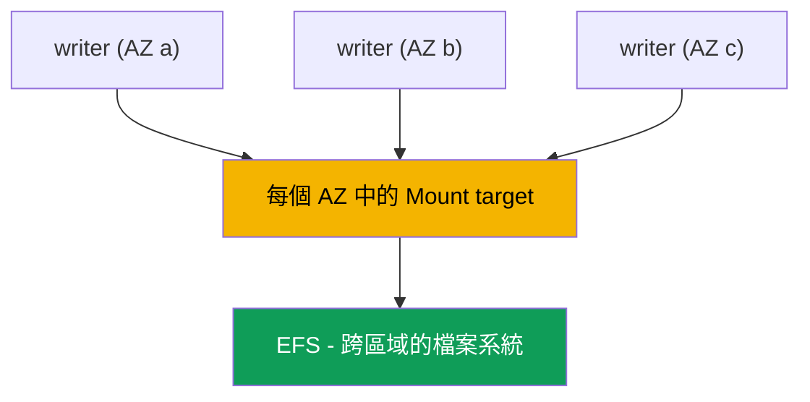
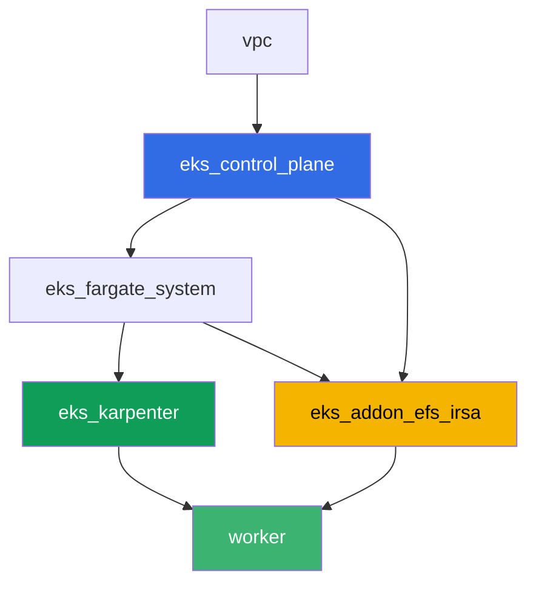

[Русская версия](README_RU.MD) · [Eng version](README.MD) · [Versión en español](README_ES.MD) · [Version française](README_FR.MD) · [Deutsche Version](README_DE.MD) · [ქართული ვერსია](README_GE.MD) · [日本語版](README_JP.MD)

# Lab 107 - EFS CSI:跨可用區的 ReadWriteMany

## 說明

這個 lab 講的是 EKS 中的網路儲存 EFS,以及它與區塊儲存 EBS(第 23 章)的主要差異:
不同可用區的多個 pod 可以同時對同一個 volume 進行寫入和讀取。你會透過 `efs.csi.aws.com`
設定動態佈建,用 `topologySpreadConstraints` 把一個 Deployment 分散到多個 AZ,確認從一個
replica 寫入的資料能在另一個 replica 中被看到,並搞清楚為什麼 EFS 上的 PV 沒有區域性的
`nodeAffinity`。另外還有一個只讀的診斷任務,透過 AWS CLI 完成:如何檢查 mount target 的
security group 是否允許叢集節點的 NFS 流量(port 2049),以及移除這條規則後會發生什麼。

任務以 production 風格撰寫:一段簡短描述加上驗收標準。驗證是自動的,透過 `check_result`
命令進行。

## 目標

鞏固課程以下章節的內容:

- [第 24 章。EFS 與 FSx:跨 AZ 的工作負載共用儲存](../../course/24/ru.md) - 這個 lab 的主要材料
- [第 23 章。EBS CSI:gp3、StorageClass、擴容、快照、AZ 綁定](../../course/23/ru.md) - 用來對比的對象:區域性區塊 volume 與跨區域網路 volume
- [第 9 章。運算類型:managed node group、Fargate、Auto Mode](../../course/09/ru.md) - 為什麼叢集有多個 AZ,節點又在哪裡
- [第 16-17 章。IRSA 與 Pod Identity](../../course/16/ru.md) - driver 如何取得管理 EFS 的權限

## 我們要建立的內容

| 物件 | 是什麼 | 在這個 lab 中的作用 |
|--------|---------|-------------------|
| Namespace `eks-107` | lab 負載用的叢集區段 | 讓資源與其他資源分開(第 4 章) |
| StorageClass `efs-sc` | 一個 `provisioningMode: efs-ap` 的類別,指向真實的 `fileSystemId` | 透過 access point 進行動態佈建(第 24 章) |
| PVC `shared-data`(`ReadWriteMany`,`5Gi`) | 一個共用 volume | 所有 replica 的同一個資料點(第 24 章) |
| Deployment `writer`(3 個 replica,不同 AZ) | 使用共用 volume 的工作負載 | 所有 replica 同時 `Running`,並掛載同一個 PVC(第 24 章) |
| 產物 `readback.txt` | 在一個 AZ 寫入、在另一個 AZ 讀取的一行資料 | 確認的是共用網路存取,不是本機副本(第 24 章) |
| 產物 `pv.yaml` + `explanation.txt` | volume 的 PV 及其解釋 | 沒有區域性的 `nodeAffinity`,與 EBS 不同(第 23-24 章) |
| 產物 `sg-rule.txt` + `diagnosis.txt` | 2049 port 上的 SG 規則及其解釋 | 透過 AWS CLI 進行 NFS 診斷,規則缺失時的症狀(第 24 章) |

從 pod 到共用 volume 的資料路徑:



## 基礎架構

環境透過 Terragrunt 部署在 AWS(`eu-central-1`)上。每個 lab 目錄都是一個帶有自己
`terragrunt.hcl` 的元件,它引用 `terraform/modules/` 中的共用模組,並透過 `dependency`
區塊宣告依賴關係。Terragrunt 會建立依賴關係圖,並按正確的順序套用各元件。基礎與 lab 101
相同(control plane、系統 pod 用的 Fargate、負載用的 Karpenter),再加上一個獨立元件,
用於 EFS CSI。

### 模組與依賴關係

| 目錄(元件) | 模組(`terraform/modules/`) | 依賴於 | 建立內容 |
|---------------------|-------------------------------|------------|-------------|
| `vpc` | `vpc_v3` | - | VPC `10.10.0.0/16`,兩個 AZ(`eu-central-1a`、`eu-central-1b`)的子網,NAT |
| `ssh-keys` | `ssh-keys` | - | worker 機器與節點用的 SSH 金鑰對 |
| `eks_control_plane` | `eks_v2_control_plane` | `vpc` | EKS control plane `1.36`,OIDC,security group |
| `eks_fargate_system` | `eks_v2_fargate` | `vpc`, `eks_control_plane` | `kube-system` 與 `karpenter` 的 Fargate profile |
| `eks_addons` | `eks_v2_addons` | `eks_control_plane`, `eks_fargate_system` | coredns、kube-proxy、vpc-cni、pod-identity |
| `eks_karpenter` | `eks_v2_karpenter` | `vpc`, `eks_control_plane`, `eks_addons`, `eks_fargate_system` | Karpenter controller,節點的 IAM role |
| `eks_karpenter_default_vng` | `eks_v2_karpenter_vng` | `vpc`, `eks_control_plane`, `eks_karpenter` | AL2023 上的預設 NodePool `default` |
| `eks_addon_efs_irsa` | `eks_v2_efs_irsa` | `vpc`, `eks_control_plane`, `eks_fargate_system` | EFS 檔案系統、每個 AZ 的 mount target、2049 port 上的 SG、managed addon `aws-efs-csi-driver`、透過 IRSA 取得的 IAM role |
| `worker` | `eks_v2_work_pc` | `ssh-keys`, `vpc`, `eks_control_plane`, `eks_karpenter`, `eks_addon_efs_irsa` | 帶有 kubectl、測試與 `check_result` 的 worker 機器 |

EFS 檔案系統、mount target,以及 driver 的 role,都已經由 `eks_addon_efs_irsa` 元件建立好
(第 16-17、24 章):在任務中不需要再重新建立它們,在你建立第一個 PVC 之前,driver 已經
就緒(`worker` 依賴於 `eks_addon_efs_irsa`)。

依賴關係圖(先套用的元件在箭頭下方):



叢集跨兩個 AZ 建立 - 這足以看到這個 lab 的主要情境:EFS 透過每個 AZ 中自己的 mount target
從兩個區域都能存取,而 EBS 的 volume 則綁定在某一個特定的 AZ 上。

### 各項設定的位置

`env.hcl`(所有元件共用的環境參數):

| 參數 | lab 中的值 | 影響什麼 |
|----------|-----------------|---------------|
| `region` | `eu-central-1` | 所有資源的區域 |
| `subnets` | `eu-central-1a`/`eu-central-1b` 中的私有子網 `eks1`/`eks2` | Karpenter 建立節點,以及建立 EFS mount target 的區域 |
| `prefix` | `eks-task107` | 資源名稱與標籤的前綴 |
| `stack_name` | `eks107` | 用於組成 `env_name` - 叢集名稱 |
| `k8_version` | `1.36.0` | worker 機器上的 kubectl 版本 |

每個元件 `terragrunt.hcl` 中的 `inputs`(該模組特有的設定):

| 檔案 | 主要設定 |
|------|--------------------|
| `eks_addon_efs_irsa/terragrunt.hcl` | 私有子網的 `subnet_ids`(每個 AZ 一個)、`security_group_source_id` = 叢集節點 SG、managed addon `aws-efs-csi-driver` |
| `worker/terragrunt.hcl` | 指向 lab 107 檔案的 `test_url` 與 `task_script_url`,依賴於 `eks_addon_efs_irsa` |

## 部署

```bash
TASK=107 make run_eks_task
```

部署大約需要 15-20 分鐘。在輸出中找到連往 worker 機器的 SSH 連線那一行並連上去。那裡的
kubectl 已經設定好指向正確的叢集,EFS CSI driver 已經安裝好,可以接受 PVC,EFS 檔案系統
也已經建立好。叢集一開始沒有任何 EC2 節點(只有 Fargate),所以在你開始做任務之前,worker
機器會先在 namespace `efs-csi-warmup` 中用一個服務 pod 預熱恰好一個 EC2 節點 - 沒有這一步,
即使是跨區域的 EFS,csi-provisioner 也無法生成 accessibility 需求,因為它要等到至少有一個
節點註冊了 CSINode topology。namespace `efs-csi-warmup` 與這個 lab 的任務無關,不要動它。

worker 機器上的實用命令:

```bash
time_left       # 環境剩餘時間
check_result    # 檢查解答
```

> 環境安全性。`env.hcl` 中啟用了 `ssh_password_enable = true` 和
> `access_cidrs = ["0.0.0.0/0"]` - 這對訓練環境很方便,但在 production 中不應該這麼做。
> 依照課程標準(第 0.2、2、19 章),對 worker 機器的存取應該透過 AWS SSM Session Manager
> 開放,不對外暴露公開的 SSH port,而 `access_cidrs` 應該縮小到具體的位址。這裡保留公開
> SSH 只是為了簡化設定。

## 任務

---
|        **1**        | **lab 負載用的 Namespace**                             |
| :-----------------: | :---------------------------------------------------------- |
| 要做什麼          | 建立一個名為 `eks-107` 的 namespace。這個 lab 的所有物件都在其中建立。 |
| 驗收標準    | - namespace `eks-107` 存在。 |
---
|        **2**        | **基於真實 EFS 檔案系統的 StorageClass**           |
| :-----------------: | :---------------------------------------------------------- |
| 要做什麼          | EFS 檔案系統已經由 terraform 建立好。透過 `aws efs describe-file-systems`(標籤 `Name` = `eks-task107-efs`)找到它的 `fileSystemId`,並建立 StorageClass `efs-sc`:`provisioner: efs.csi.aws.com`、`parameters.provisioningMode: efs-ap`、`parameters.fileSystemId` - 真實的 ID、`parameters.directoryPerms: "755"`、`mountOptions: ["tls"]`。 |
| 驗收標準    | - StorageClass `efs-sc` 存在;<br/>- `provisioner: efs.csi.aws.com`;<br/>- `parameters.provisioningMode: efs-ap`;<br/>- `parameters.fileSystemId` 與真實的檔案系統 ID 相符。 |
---
|        **3**        | **具有 ReadWriteMany 存取模式的 PVC**                            |
| :-----------------: | :---------------------------------------------------------- |
| 要做什麼          | 在 `eks-107` 中,在 StorageClass `efs-sc` 上建立 PVC `shared-data`,`accessModes: ["ReadWriteMany"]`,請求 `5Gi`。等待狀態變為 `Bound`。 |
| 驗收標準    | - PVC `shared-data` 使用類別 `efs-sc`;<br/>- `accessModes` 包含 `ReadWriteMany`;<br/>- 請求 `5Gi`;<br/>- 狀態為 `Bound`。 |
---
|        **4**        | **跨多個 AZ、使用共用 volume 的 Deployment**                |
| :-----------------: | :---------------------------------------------------------- |
| 要做什麼          | 在 `eks-107` 中,建立 Deployment `writer`,image `viktoruj/ping_pong:alpine`(任務 5 需要用到 shell),`3` 個 replica,每個 replica 都掛載 volume `shared-data`。加上針對 key `topology.kubernetes.io/zone` 的 `topologySpreadConstraints`,讓 replica 分散到不同的 AZ。確保所有 `3` 個 replica 同時處於 `Running` 狀態,並掛載同一個 PVC - 用 EBS(`ReadWriteOnce`)的話這在跨區域是不可能的(`Multi-Attach error`,第 23 章)。 |
| 驗收標準    | - `eks-107` 中的 Deployment `writer`,image `viktoruj/ping_pong`,`3` 個 ready replica;<br/>- pod 中掛載了來自 PVC `shared-data` 的 volume;<br/>- 針對 `topology.kubernetes.io/zone` 的 `topologySpreadConstraints`;<br/>- replica 實際分布在 `2` 個或更多不同的區域。 |
---
|        **5**        | **確認跨 AZ 的共用存取**                   |
| :-----------------: | :---------------------------------------------------------- |
| 要做什麼          | 從一個 `writer` replica 開始,把一行包含標記 `efs-rwx-test` 的內容追加到共用 volume 上的檔案 `/data/shared.txt`。從另一個 replica(不同的 AZ)讀取這個檔案,並把結果存到 `/var/work/tests/artifacts/5/readback.txt`。 |
| 驗收標準    | - 檔案 `readback.txt` 不為空;<br/>- 包含帶有標記 `efs-rwx-test` 的那一行。 |
---
|        **6**        | **檢查是否缺少區域性的 nodeAffinity**                |
| :-----------------: | :---------------------------------------------------------- |
| 要做什麼          | 把 PVC `shared-data` 的 volume 的 `kubectl get pv <pv> -o yaml` 存到 `/var/work/tests/artifacts/6/pv.yaml`。確認與 EBS(第 23 章)不同,這個 PV 沒有 `spec.nodeAffinity` 區塊。把解釋寫到 `/var/work/tests/artifacts/6/explanation.txt`:為什麼 EFS 不會把 PV 綁定到某個區域,以及如果 pod 在另一個 AZ 中被重建,這意味著什麼。文字內容必須提到 `nodeAffinity`。 |
| 驗收標準    | - 檔案 `pv.yaml` 不為空;<br/>- PV 沒有 `nodeAffinity` 區塊;<br/>- 檔案 `explanation.txt` 不為空,且提到 `nodeAffinity`。 |
---
|        **7**        | **診斷:mount target 的 security group 與 2049 port**   |
| :-----------------: | :---------------------------------------------------------- |
| 要做什麼          | 實際破壞基礎架構的風險太大,所以這個任務是只讀的。使用 `aws efs describe-mount-targets` 找到你的 EFS 的 mount target 的 security group,並使用 `aws ec2 describe-security-groups` 確認它有一條允許叢集節點 security group 存取 TCP `2049` 的 inbound 規則。把規則的輸出存到 `/var/work/tests/artifacts/7/sg-rule.txt`。在檔案 `/var/work/tests/artifacts/7/diagnosis.txt` 中,解釋如果這條規則缺失會發生什麼:pod 不會收到明確的存取錯誤,mount 過程會在對 `2049` port 的 TCP timeout 上卡住,`kubectl describe pod` 會顯示 `FailedMount` 事件。 |
| 驗收標準    | - 檔案 `sg-rule.txt` 不為空,且包含 `2049`;<br/>- 檔案 `diagnosis.txt` 不為空,包含 `2049` 以及關於 timeout 的說明(`FailedMount`/`timeout`)。 |
---

## 檢查結果

在 worker 機器上執行自動檢查:

```bash
check_result
```

腳本會執行測試,並顯示已完成任務的百分比。

## 解答

參考解答:[worker/files/solutions/1_TW.MD](worker/files/solutions/1_TW.MD)

## 刪除叢集與資源

> **先移除 PVC,再刪除叢集。** 在動態佈建下,EFS CSI driver 會為每個 PVC 在檔案系統內部
> 建立自己的 **access point**。檔案系統本身是由 Terraform 建立的,但 access point 是由
> driver 建立的,PVC 被刪除後也是由它負責移除。如果在 PVC 還存在時就拆除叢集,driver 會
> 消失,access point 會被留下來,刪除檔案系統時會出現 `FileSystemInUse` 錯誤,`destroy`
> 也會卡在這一步。

```bash
kubectl delete namespace eks-107 --ignore-not-found
kubectl delete pvc --all -n eks-107 --ignore-not-found 2>/dev/null

while kubectl get nodes --no-headers 2>/dev/null | grep -qv fargate; do
  echo "Karpenter's EC2 node is still alive, waiting..."; sleep 15
done
```

檢查檔案系統中是否還留有 driver 建立的 access point:

```bash
FS_ID=$(aws efs describe-file-systems \
  --query 'FileSystems[?contains(Name, `eks-task107`)].FileSystemId' --output text)
aws efs describe-access-points --file-system-id "$FS_ID" \
  --query 'AccessPoints[].[AccessPointId,RootDirectory.Path]' --output table
# delete any leftovers
aws efs delete-access-point --access-point-id <fsap-id>
```

```bash
TASK=107 make delete_eks_task
```
