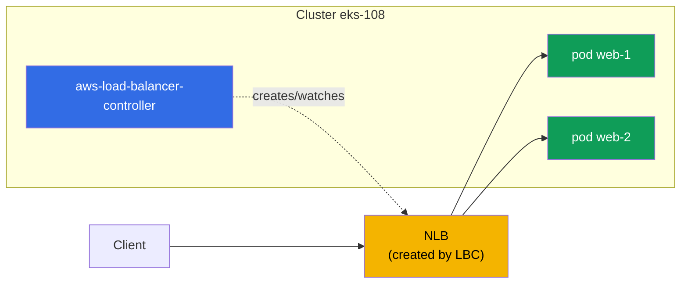
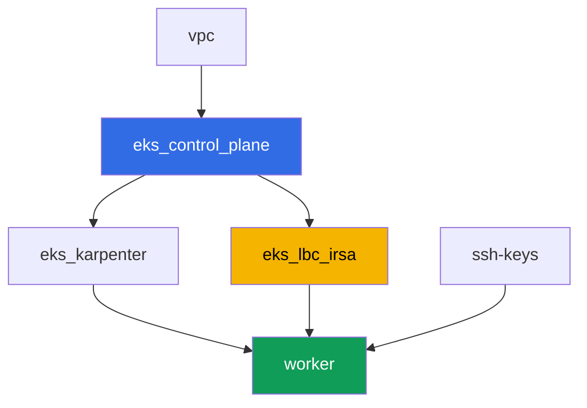

[Русская версия](README_RU.MD) · [Versión en español](README_ES.MD) · [Version française](README_FR.MD) · [Deutsche Version](README_DE.MD) · [ქართული ვერსია](README_GE.MD) · [繁體中文版](README_TW.MD) · [日本語版](README_JP.MD)

# Lab 108 - AWS Load Balancer Controller: NLB for a Service of type LoadBalancer

## Description

The first lab of Part 5 of the course - networking and traffic. Here you install the AWS
Load Balancer Controller (LBC) and switch reconciliation of a Service of type LoadBalancer
from the legacy in-tree cloud provider to the modern controller, which creates a Network
Load Balancer (NLB) - an L4 load balancer with targets on pod IPs. You'll see how the
Service annotation decides which controller picks up the object, how to choose the target
type and access scheme, and how to read the controller logs to tell normal reconciliation
apart from an IAM permission failure.

Tasks are written in a production style: a short statement plus acceptance criteria.
Checking is automatic, via the `check_result` command.

## Goal

Reinforce the material from the course chapter:

- [Chapter 26. AWS Load Balancer Controller and a Service of type LoadBalancer: NLB](../../course/26/ru.md) - the controller, annotations, NLB vs. CLB

## What we're creating

The cluster is already deployed as code (control plane, Fargate for system pods, Karpenter
for workload). You install the LBC and build a workload plus a Service around it.

| Object | What it is | Why it's in this lab |
|--------|---------|-------------------|
| Namespace `eks-108` | a cluster section for the lab's workload | keeps resources separate from system ones |
| ServiceAccount `aws-load-balancer-controller` | an SA in `kube-system` with an IRSA role | gives the controller access to the ELBv2 API |
| Deployment `aws-load-balancer-controller` | the controller itself (Helm chart `eks/aws-load-balancer-controller`) | watches Service/Ingress objects and creates load balancers |
| Deployment `web` (2 replicas) | the ping_pong application | the workload we expose externally |
| Service `web` (LoadBalancer) | a Service with annotations `external`, `nlb-target-type: ip`, `scheme` | forces LBC to create an NLB with targets on pod IPs |
| Artifacts `nlb.txt`, `targets.txt`, `reconcile.txt` | AWS CLI output and log explanation | confirm the load balancer type, target type, and the IAM responsibility boundary |

The resulting traffic picture:



## Infrastructure

The environment is deployed in AWS (`eu-central-1`) via Terragrunt. Each lab directory is
one component with its own `terragrunt.hcl`, which references a shared module in
`terraform/modules/` and declares dependencies through `dependency` blocks.

### Modules and dependencies

| Directory (component) | Module (`terraform/modules/`) | Depends on | What it creates |
|---------------------|-------------------------------|------------|-------------|
| `vpc` | `vpc_v3` | - | VPC `10.10.0.0/16`, subnets in two AZs, NAT |
| `ssh-keys` | `ssh-keys` | - | an SSH key pair for the worker machine |
| `eks_control_plane` | `eks_v2_control_plane` | `vpc` | EKS control plane `1.36`, OIDC provider |
| `eks_fargate_system` | `eks_v2_fargate` | `vpc`, `eks_control_plane` | Fargate profile for `kube-system` and `karpenter` |
| `eks_addons` | `eks_v2_addons` | `eks_control_plane`, `eks_fargate_system` | coredns, kube-proxy, vpc-cni, pod-identity |
| `eks_karpenter` | `eks_v2_karpenter` | `vpc`, `eks_control_plane`, `eks_addons`, `eks_fargate_system` | Karpenter controller, node IAM role |
| `eks_karpenter_default_vng` | `eks_v2_karpenter_vng` | `vpc`, `eks_control_plane`, `eks_karpenter` | default NodePool on AL2023 |
| `eks_lbc_irsa` | `eks_v2_lbc_irsa` | `eks_control_plane` | IRSA IAM role and policy for the AWS Load Balancer Controller |
| `worker` | `eks_v2_work_pc` | `ssh-keys`, `vpc`, `eks_control_plane`, `eks_karpenter`, `eks_lbc_irsa` | worker machine with kubectl, tests and `check_result` |

The `eks_v2_lbc_irsa` module only creates an IAM role trusting the cluster's OIDC provider
(a `sub` condition on `system:serviceaccount:kube-system:aws-load-balancer-controller`) and
a policy with the ELBv2/EC2 permissions the controller needs. The controller itself is not
a managed EKS add-on - the student installs it manually via Helm in task 2.

Dependency graph (what gets applied earlier is lower down the arrow):



Components `eks_fargate_system`, `eks_addons`, `eks_karpenter_default_vng` are left out of
the graph above for readability (no more than 8 nodes) - they are applied in the standard
order between `eks_control_plane` and `eks_karpenter`, as in lab 101.

### Where things are configured

`env.hcl` (shared environment parameters):

| Parameter | Value in the lab | What it affects |
|----------|-----------------|---------------|
| `region` | `eu-central-1` | region for all resources |
| `vpc_default_cidr`, `subnets` | `10.10.0.0/16`, subnets per AZ | VPC address plan, source of the NLB's IP targets |
| `prefix` | `eks-task108` | prefix for resource names and tags |
| `stack_name` | `eks108` | used to build `env_name` - the cluster name |
| `k8_version` | `1.36.0` | kubectl version on the worker machine |
| `instance_type_worker` | `t3.medium` | worker machine instance type |
| `ssh_password_enable`, `access_cidrs` | `true`, `0.0.0.0/0` | SSH access to the worker machine |

`inputs` in each component's `terragrunt.hcl`:

| File | Key settings |
|------|--------------------|
| `eks_control_plane/terragrunt.hcl` | `eks.version = "1.36"`, subnets for the control plane and nodes |
| `eks_lbc_irsa/terragrunt.hcl` | `name` (cluster) and `oidc_provider_arn` for the role's trust policy |
| `eks_karpenter_default_vng/terragrunt.hcl` | NodePool `requirements`, `disruption`, `budgets` |
| `worker/terragrunt.hcl` | `test_url`, `task_script_url` for the lab 108 files; dependency on `eks_lbc_irsa` |

## Deployment

```bash
TASK=108 make run_eks_task
```

Deployment takes roughly 15-20 minutes. In the output, find the line with the SSH connection
to the worker machine and connect to it. kubectl there is already configured for the right
cluster.

Useful commands on the worker machine:

```bash
time_left       # how much environment time is left
check_result    # check the solution
```

> Environment security. `env.hcl` has `ssh_password_enable = true` and
> `access_cidrs = ["0.0.0.0/0"]` enabled - convenient for a training environment, but this
> is not something to do in production. Per the course standards (chapters 0.2, 2, 19),
> access to worker machines should go through AWS SSM Session Manager without exposing
> public SSH ports, and `access_cidrs` should be narrowed down to specific addresses. Here
> public SSH is left in place only to keep the setup simple.

## Tasks

---
|        **1**        | **Namespace for the lab's workload**                             |
| :-----------------: | :---------------------------------------------------------- |
| What to do          | Create a namespace named `eks-108`. All lab objects (except the controller and its ServiceAccount, which live in `kube-system`) are created inside it. |
| Acceptance criteria    | - namespace `eks-108` exists. |
---
|        **2**        | **ServiceAccount and installing the AWS Load Balancer Controller**  |
| :-----------------: | :---------------------------------------------------------- |
| What to do          | Find the ARN of the IAM role terraform created for the controller (role name `<cluster-name>-lbc-irsa`), and create ServiceAccount `aws-load-balancer-controller` in `kube-system` with the `eks.amazonaws.com/role-arn` annotation pointing to that role. Then install the AWS Load Balancer Controller via Helm (repository `https://aws.github.io/eks-charts`, chart `aws-load-balancer-controller`) with the flags `--set serviceAccount.create=false --set serviceAccount.name=aws-load-balancer-controller`, `--set clusterName=<cluster-name>`, `--set region=eu-central-1` and `--set vpcId=<lab-VPC-ID>`. The `region`/`vpcId` flags are required: the controller runs on Fargate (namespace `kube-system` under the Fargate profile), and Fargate has no EC2 instance metadata - without these flags the controller tries to determine the VPC ID via IMDS and crashes into `CrashLoopBackOff`. You can get the VPC ID via `aws eks describe-cluster --name <cluster-name> --query 'cluster.resourcesVpcConfig.vpcId'`. Wait until the Deployment `aws-load-balancer-controller` in `kube-system` becomes `Running` (all replicas Ready). |
| Acceptance criteria    | - ServiceAccount `aws-load-balancer-controller` in `kube-system` with an annotation pointing to the `lbc-irsa` role;<br/>- Deployment `aws-load-balancer-controller` in `kube-system` has at least one ready replica. |
---
|        **3**        | **Workload for external exposure**                           |
| :-----------------: | :---------------------------------------------------------- |
| What to do          | In namespace `eks-108`, create Deployment `web`, image `viktoruj/ping_pong:latest`, `2` replicas. Wait until both replicas become Ready. |
| Acceptance criteria    | - Deployment `web` in `eks-108`, image `viktoruj/ping_pong`;<br/>- `2` ready replicas. |
---
|        **4**        | **Service of type LoadBalancer: NLB instead of Classic Load Balancer** |
| :-----------------: | :---------------------------------------------------------- |
| What to do          | Create Service `web` of type `LoadBalancer` with selector `app: web`, port `80` to `targetPort: 8080`, and three annotations: `service.beta.kubernetes.io/aws-load-balancer-type: external` (hands reconciliation over to LBC instead of the in-tree provider, which would create a legacy Classic Load Balancer), `service.beta.kubernetes.io/aws-load-balancer-nlb-target-type: ip`, `service.beta.kubernetes.io/aws-load-balancer-scheme: internet-facing`. Wait for the external address (`kubectl get svc web -n eks-108 -w`). Via `aws elbv2 describe-load-balancers` confirm that a load balancer of `Type: network` (NLB, not `classic`) with `Scheme: internet-facing` was created, and save the output to `/var/work/tests/artifacts/4/nlb.txt`. |
| Acceptance criteria    | - Service `web` in `eks-108` with the three annotations and an external address (`status.loadBalancer.ingress[0].hostname`);<br/>- file `nlb.txt` is not empty and contains `network` and `internet-facing`. |
---
|        **5**        | **Checking targets: pod IPs, not node IDs**                 |
| :-----------------: | :---------------------------------------------------------- |
| What to do          | Via `aws elbv2 describe-target-groups` find the target group of the created NLB, then via `aws elbv2 describe-target-health` look at the list of targets. Save both outputs to `/var/work/tests/artifacts/5/targets.txt`. Make sure `TargetType` equals `ip`, and target identifiers are IP addresses from `10.10.0.0/16` (pod addresses), not `i-...` (node instance IDs). |
| Acceptance criteria    | - file `targets.txt` is not empty;<br/>- it contains `"TargetType": "ip"` and at least one target with an address from `10.10.0.0/16`;<br/>- it contains no targets of the form `i-...`. |
---
|        **6**        | **Diagnostics: successful reconciliation vs. AccessDenied**  |
| :-----------------: | :---------------------------------------------------------- |
| What to do          | Look at the controller log (`kubectl logs -n kube-system deploy/aws-load-balancer-controller`) and find the lines of successful reconciliation of Service `web` - they contain the ARN of the created load balancer (`arn:aws:elasticloadbalancing:...`). In the artifact `/var/work/tests/artifacts/6/reconcile.txt` describe both situations: what a normal reconciliation looks like (with that ARN) and what an error caused by missing IAM permissions would look like - an `AccessDenied` message on the `elasticloadbalancing:CreateLoadBalancer` call, which would leave the Service without an external address. |
| Acceptance criteria    | - file `reconcile.txt` is not empty;<br/>- it contains a line with `arn:aws:elasticloadbalancing` (the real log of successful reconciliation);<br/>- it contains the word `AccessDenied` (a description of the expected symptom when permissions are missing). |
---

## Checking the result

On the worker machine, run the automatic check:

```bash
check_result
```

The script will run the tests and show the percentage of completed tasks.

## Solution

Reference solution: [worker/files/solutions/1.MD](worker/files/solutions/1.MD)

## Deleting the cluster and resources

> Before deleting. Service `web` of type `LoadBalancer` from task 4 created a real NLB and
> two security groups directly through the ELBv2/EC2 API (AWS Load Balancer Controller),
> not terraform - the state knows nothing about them. The right way to remove them is to
> delete the Service and let LBC call the AWS API to delete them itself (a finalizer on the
> Service won't let the object be removed from etcd until LBC confirms that the NLB and both
> SGs are really gone) - this is more reliable and simpler than cleaning up the NLB/SG by
> hand via AWS CLI:
>
> ```bash
> kubectl delete svc web -n eks-108
> # wait until the finalizer is removed - that's what "LBC deleted the NLB and SG" means
> kubectl wait --for=delete svc/web -n eks-108 --timeout=120s
> ```
>
> Be sure to do this BEFORE `terragrunt destroy`. If the control plane is already deleted
> before the Service (LBC can no longer execute the finalizer), the NLB and its SGs will be
> left orphaned and will hold ENIs in the public subnets - the VPC and Internet Gateway will
> get stuck in `Still destroying...` forever. In that case LBC can no longer help, and the
> only option left is manual cleanup via AWS CLI:
>
> ```bash
> VPC_ID=<this-lab's-VPC-ID>
> LB_ARN=$(aws elbv2 describe-load-balancers \
>   --query "LoadBalancers[?contains(LoadBalancerName,'eks108')].LoadBalancerArn" --output text)
> aws elbv2 delete-load-balancer --load-balancer-arn "$LB_ARN"
> # wait for the ENIs in the subnets to free up, then delete the remaining SGs:
> aws ec2 describe-security-groups --filters "Name=vpc-id,Values=$VPC_ID" \
>   --query "SecurityGroups[?GroupName!='default'].GroupId" --output text | \
>   xargs -n1 aws ec2 delete-security-group --group-id
> ```

```bash
TASK=108 make delete_eks_task
```
