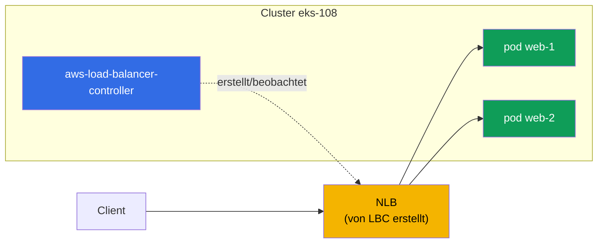
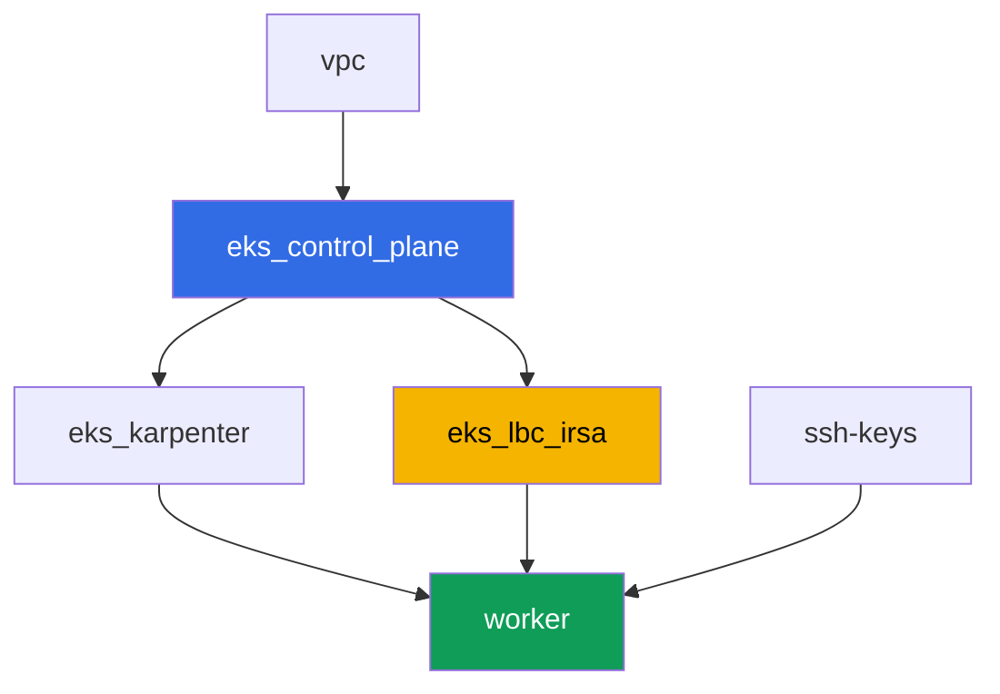

[Русская версия](README_RU.MD) · [Eng version](README.MD) · [Versión en español](README_ES.MD) · [Version française](README_FR.MD) · [ქართული ვერსია](README_GE.MD) · [繁體中文版](README_TW.MD) · [日本語版](README_JP.MD)

# Lab 108 - AWS Load Balancer Controller: NLB für einen Service vom Typ LoadBalancer

## Beschreibung

Das erste Lab von Teil 5 des Kurses - Netzwerk und Traffic. Hier installieren Sie den AWS
Load Balancer Controller (LBC) und schalten die Reconciliation eines Service vom Typ
LoadBalancer vom veralteten in-tree cloud provider auf den modernen Controller um, der
einen Network Load Balancer (NLB) erstellt - einen L4-Load-Balancer mit Targets auf
Pod-IPs. Sie sehen, wie die Service-Annotation entscheidet, welcher Controller das Objekt
übernimmt, wie man den Target-Typ und das Access-Schema wählt, und wie man die
Controller-Logs liest, um eine normale Reconciliation von einem Fehler wegen fehlender
IAM-Rechte zu unterscheiden.

Die Aufgaben sind im Produktionsstil geschrieben: eine kurze Aufgabenstellung plus
Abnahmekriterien. Die Prüfung erfolgt automatisch über den Befehl `check_result`.

## Ziel

Den Stoff des folgenden Kurskapitels vertiefen:

- [Kapitel 26. AWS Load Balancer Controller und ein Service vom Typ LoadBalancer: NLB](../../course/26/de.md) - der Controller, Annotationen, NLB gegen CLB

## Was wir erstellen

Der Cluster ist bereits als Code deployt (Control Plane, Fargate für System-Pods, Karpenter
für die Workload). Sie installieren den LBC und bauen darum eine Workload und einen Service
auf.

| Objekt | Was es ist | Wofür in diesem Lab |
|--------|---------|-------------------|
| Namespace `eks-108` | ein Cluster-Bereich für die Lab-Workload | hält Ressourcen getrennt von den System-Ressourcen |
| ServiceAccount `aws-load-balancer-controller` | eine SA in `kube-system` mit einer IRSA-Rolle | gibt dem Controller Zugriff auf die ELBv2-API |
| Deployment `aws-load-balancer-controller` | der Controller selbst (Helm-Chart `eks/aws-load-balancer-controller`) | beobachtet Service/Ingress-Objekte und erstellt Load Balancer |
| Deployment `web` (2 Replicas) | die ping_pong-Anwendung | die Workload, die wir nach außen veröffentlichen |
| Service `web` (LoadBalancer) | ein Service mit den Annotationen `external`, `nlb-target-type: ip`, `scheme` | zwingt LBC dazu, einen NLB mit Targets auf Pod-IPs zu erstellen |
| Artefakte `nlb.txt`, `targets.txt`, `reconcile.txt` | AWS-CLI-Ausgabe und Log-Erklärung | bestätigen den Load-Balancer-Typ, den Target-Typ und die IAM-Verantwortungsgrenze |

Das resultierende Traffic-Bild:



## Infrastruktur

Die Umgebung wird in AWS (`eu-central-1`) über Terragrunt deployt. Jedes Lab-Verzeichnis ist
eine Komponente mit eigenem `terragrunt.hcl`, das auf ein gemeinsames Modul in
`terraform/modules/` verweist und seine Abhängigkeiten über `dependency`-Blöcke deklariert.

### Module und Abhängigkeiten

| Verzeichnis (Komponente) | Modul (`terraform/modules/`) | Abhängig von | Was es erstellt |
|---------------------|-------------------------------|------------|-------------|
| `vpc` | `vpc_v3` | - | VPC `10.10.0.0/16`, Subnetze in zwei AZ, NAT |
| `ssh-keys` | `ssh-keys` | - | ein SSH-Schlüsselpaar für die Worker-Maschine |
| `eks_control_plane` | `eks_v2_control_plane` | `vpc` | EKS Control Plane `1.36`, OIDC-Provider |
| `eks_fargate_system` | `eks_v2_fargate` | `vpc`, `eks_control_plane` | Fargate-Profil für `kube-system` und `karpenter` |
| `eks_addons` | `eks_v2_addons` | `eks_control_plane`, `eks_fargate_system` | coredns, kube-proxy, vpc-cni, pod-identity |
| `eks_karpenter` | `eks_v2_karpenter` | `vpc`, `eks_control_plane`, `eks_addons`, `eks_fargate_system` | Karpenter-Controller, IAM-Rolle der Nodes |
| `eks_karpenter_default_vng` | `eks_v2_karpenter_vng` | `vpc`, `eks_control_plane`, `eks_karpenter` | Standard-NodePool auf AL2023 |
| `eks_lbc_irsa` | `eks_v2_lbc_irsa` | `eks_control_plane` | IRSA-IAM-Rolle und -Policy für den AWS Load Balancer Controller |
| `worker` | `eks_v2_work_pc` | `ssh-keys`, `vpc`, `eks_control_plane`, `eks_karpenter`, `eks_lbc_irsa` | Worker-Maschine mit kubectl, Tests und `check_result` |

Das Modul `eks_v2_lbc_irsa` erstellt nur eine IAM-Rolle, die dem OIDC-Provider des Clusters
vertraut (eine `sub`-Bedingung auf
`system:serviceaccount:kube-system:aws-load-balancer-controller`), und eine Policy mit den
ELBv2/EC2-Berechtigungen, die der Controller braucht. Der Controller selbst ist kein
verwalteter EKS-Add-on - der Student installiert ihn in Aufgabe 2 manuell über Helm.

Abhängigkeitsgraph (was früher angewendet wird, steht weiter unten am Pfeil):



Die Komponenten `eks_fargate_system`, `eks_addons`, `eks_karpenter_default_vng` sind aus
Gründen der Lesbarkeit nicht im obigen Graphen enthalten (nicht mehr als 8 Knoten) - sie
werden in der Standardreihenfolge zwischen `eks_control_plane` und `eks_karpenter`
angewendet, wie in Lab 101.

### Wo was konfiguriert wird

`env.hcl` (gemeinsame Umgebungsparameter):

| Parameter | Wert im Lab | Was er beeinflusst |
|----------|-----------------|---------------|
| `region` | `eu-central-1` | Region aller Ressourcen |
| `vpc_default_cidr`, `subnets` | `10.10.0.0/16`, Subnetze pro AZ | Adressplan der VPC, Quelle der IP-Targets des NLB |
| `prefix` | `eks-task108` | Präfix für Ressourcennamen und Tags |
| `stack_name` | `eks108` | daraus wird `env_name` - der Clustername - gebildet |
| `k8_version` | `1.36.0` | kubectl-Version auf der Worker-Maschine |
| `instance_type_worker` | `t3.medium` | Instanztyp der Worker-Maschine |
| `ssh_password_enable`, `access_cidrs` | `true`, `0.0.0.0/0` | SSH-Zugriff auf die Worker-Maschine |

`inputs` im `terragrunt.hcl` jeder Komponente:

| Datei | Wichtige Einstellungen |
|------|--------------------|
| `eks_control_plane/terragrunt.hcl` | `eks.version = "1.36"`, Subnetze für Control Plane und Nodes |
| `eks_lbc_irsa/terragrunt.hcl` | `name` (Cluster) und `oidc_provider_arn` für die Trust-Policy der Rolle |
| `eks_karpenter_default_vng/terragrunt.hcl` | `requirements` des NodePool, `disruption`, `budgets` |
| `worker/terragrunt.hcl` | `test_url`, `task_script_url` für die Lab-108-Dateien; Abhängigkeit von `eks_lbc_irsa` |

## Deployment

```bash
TASK=108 make run_eks_task
```

Das Deployment dauert etwa 15-20 Minuten. Suchen Sie in der Ausgabe die Zeile mit der
SSH-Verbindung zur Worker-Maschine und verbinden Sie sich damit. kubectl ist dort bereits
für den richtigen Cluster konfiguriert.

Nützliche Befehle auf der Worker-Maschine:

```bash
time_left       # verbleibende Zeit der Umgebung
check_result    # Lösung prüfen
```

> Sicherheit der Testumgebung. In `env.hcl` sind `ssh_password_enable = true` und
> `access_cidrs = ["0.0.0.0/0"]` aktiviert - praktisch für eine Lernumgebung, aber so sollte
> man es in Produktion nicht machen. Nach den Standards des Kurses (Kapitel 0.2, 2, 19) wird
> der Zugriff auf Worker-Maschinen über AWS SSM Session Manager geöffnet, ohne öffentliche
> SSH-Ports nach außen, und `access_cidrs` wird auf konkrete Adressen eingeschränkt. Hier
> bleibt öffentliches SSH nur der Einfachheit halber bestehen.

## Aufgaben

---
|        **1**        | **Namespace für die Lab-Workload**                             |
| :-----------------: | :---------------------------------------------------------- |
| Was wir tun          | Erstellen Sie einen Namespace mit dem Namen `eks-108`. Alle Objekte des Labs (außer dem Controller und seinem ServiceAccount, die in `kube-system` leben) werden darin erstellt. |
| Abnahmekriterien    | - Namespace `eks-108` existiert. |
---
|        **2**        | **ServiceAccount und Installation des AWS Load Balancer Controllers**  |
| :-----------------: | :---------------------------------------------------------- |
| Was wir tun          | Finden Sie den ARN der von terraform für den Controller erstellten IAM-Rolle (Rollenname `<cluster-name>-lbc-irsa`), und erstellen Sie das ServiceAccount `aws-load-balancer-controller` in `kube-system` mit der Annotation `eks.amazonaws.com/role-arn`, die auf diese Rolle zeigt. Installieren Sie dann den AWS Load Balancer Controller über Helm (Repository `https://aws.github.io/eks-charts`, Chart `aws-load-balancer-controller`) mit den Flags `--set serviceAccount.create=false --set serviceAccount.name=aws-load-balancer-controller`, `--set clusterName=<cluster-name>`, `--set region=eu-central-1` und `--set vpcId=<VPC-ID-des-Labs>`. Die Flags `region`/`vpcId` sind erforderlich: Der Controller läuft auf Fargate (Namespace `kube-system` unter dem Fargate-Profil), und auf Fargate gibt es keine EC2-Instance-Metadaten - ohne diese Flags versucht der Controller, die VPC-ID über IMDS zu bestimmen, und fällt in `CrashLoopBackOff`. Die VPC-ID erhalten Sie über `aws eks describe-cluster --name <cluster-name> --query 'cluster.resourcesVpcConfig.vpcId'`. Warten Sie, bis das Deployment `aws-load-balancer-controller` in `kube-system` `Running` wird (alle Replicas Ready). |
| Abnahmekriterien    | - ServiceAccount `aws-load-balancer-controller` in `kube-system` mit einer Annotation zur Rolle `lbc-irsa`;<br/>- Deployment `aws-load-balancer-controller` in `kube-system` hat mindestens eine bereite Replica. |
---
|        **3**        | **Workload für die Veröffentlichung nach außen**                           |
| :-----------------: | :---------------------------------------------------------- |
| Was wir tun          | Erstellen Sie im Namespace `eks-108` das Deployment `web`, Image `viktoruj/ping_pong:latest`, `2` Replicas. Warten Sie, bis beide Replicas Ready sind. |
| Abnahmekriterien    | - Deployment `web` in `eks-108`, Image `viktoruj/ping_pong`;<br/>- `2` bereite Replicas. |
---
|        **4**        | **Service vom Typ LoadBalancer: NLB statt Classic Load Balancer** |
| :-----------------: | :---------------------------------------------------------- |
| Was wir tun          | Erstellen Sie den Service `web` vom Typ `LoadBalancer` mit Selector `app: web`, Port `80` auf `targetPort: 8080`, und drei Annotationen: `service.beta.kubernetes.io/aws-load-balancer-type: external` (übergibt die Reconciliation an LBC statt an den in-tree provider, der einen veralteten Classic Load Balancer erstellt hätte), `service.beta.kubernetes.io/aws-load-balancer-nlb-target-type: ip`, `service.beta.kubernetes.io/aws-load-balancer-scheme: internet-facing`. Warten Sie auf die externe Adresse (`kubectl get svc web -n eks-108 -w`). Bestätigen Sie über `aws elbv2 describe-load-balancers`, dass ein Load Balancer mit `Type: network` (NLB, nicht `classic`) und `Scheme: internet-facing` erstellt wurde, und speichern Sie die Ausgabe in `/var/work/tests/artifacts/4/nlb.txt`. |
| Abnahmekriterien    | - Service `web` in `eks-108` mit den drei Annotationen und einer externen Adresse (`status.loadBalancer.ingress[0].hostname`);<br/>- die Datei `nlb.txt` ist nicht leer und enthält `network` und `internet-facing`. |
---
|        **5**        | **Überprüfung der Targets: Pod-IPs statt Node-IDs**                 |
| :-----------------: | :---------------------------------------------------------- |
| Was wir tun          | Finden Sie über `aws elbv2 describe-target-groups` die Target Group des erstellten NLB, dann sehen Sie sich über `aws elbv2 describe-target-health` die Liste der Targets an. Speichern Sie beide Ausgaben in `/var/work/tests/artifacts/5/targets.txt`. Stellen Sie sicher, dass `TargetType` gleich `ip` ist, und dass die Target-Kennungen IP-Adressen aus `10.10.0.0/16` sind (Pod-Adressen), nicht `i-...` (Instance-IDs der Nodes). |
| Abnahmekriterien    | - die Datei `targets.txt` ist nicht leer;<br/>- sie enthält `"TargetType": "ip"` und mindestens ein Target mit einer Adresse aus `10.10.0.0/16`;<br/>- sie enthält keine Targets der Form `i-...`. |
---
|        **6**        | **Diagnose: erfolgreiche Reconciliation versus AccessDenied**  |
| :-----------------: | :---------------------------------------------------------- |
| Was wir tun          | Schauen Sie sich das Controller-Log an (`kubectl logs -n kube-system deploy/aws-load-balancer-controller`) und finden Sie die Zeilen der erfolgreichen Reconciliation des Service `web` - darin taucht der ARN des erstellten Load Balancers auf (`arn:aws:elasticloadbalancing:...`). Beschreiben Sie im Artefakt `/var/work/tests/artifacts/6/reconcile.txt` beide Situationen: wie eine normale Reconciliation aussieht (mit diesem ARN) und wie ein Fehler wegen fehlender IAM-Rechte aussehen würde - eine `AccessDenied`-Meldung beim Aufruf von `elasticloadbalancing:CreateLoadBalancer`, wegen der der Service ohne externe Adresse bliebe. |
| Abnahmekriterien    | - die Datei `reconcile.txt` ist nicht leer;<br/>- sie enthält eine Zeile mit `arn:aws:elasticloadbalancing` (das echte Log der erfolgreichen Reconciliation);<br/>- sie enthält das Wort `AccessDenied` (Beschreibung des erwarteten Symptoms bei fehlenden Rechten). |
---

## Ergebnis prüfen

Führen Sie auf der Worker-Maschine die automatische Prüfung aus:

```bash
check_result
```

Das Skript führt die Tests aus und zeigt den Prozentsatz erledigter Aufgaben.

## Lösung

Referenzlösung: [worker/files/solutions/1_DE.MD](worker/files/solutions/1_DE.MD)

## Cluster und Ressourcen löschen

> Vor dem Löschen. Der Service `web` vom Typ `LoadBalancer` aus Aufgabe 4 hat einen echten
> NLB und zwei Security Groups direkt über die ELBv2/EC2-API erstellt (AWS Load Balancer
> Controller), nicht terraform - der State weiß nichts davon. Der richtige Weg, sie zu
> entfernen, ist, den Service zu löschen und LBC selbst die AWS-API zum Löschen aufrufen zu
> lassen (ein Finalizer am Service lässt das Objekt erst dann aus etcd entfernen, wenn LBC
> bestätigt hat, dass der NLB und beide SGs tatsächlich entfernt wurden) - das ist
> zuverlässiger und einfacher, als NLB/SG von Hand über AWS CLI aufzuräumen:
>
> ```bash
> kubectl delete svc web -n eks-108
> # wir warten, bis der Finalizer entfernt wird - das bedeutet "LBC hat NLB und SG gelöscht"
> kubectl wait --for=delete svc/web -n eks-108 --timeout=120s
> ```
>
> Tun Sie das unbedingt VOR `terragrunt destroy`. Wenn die Control Plane bereits vor dem
> Service gelöscht wurde (LBC kann den Finalizer nicht mehr ausführen), bleiben der NLB und
> seine SGs verwaist und halten ENIs in den öffentlichen Subnetzen fest - VPC und Internet
> Gateway bleiben für immer bei `Still destroying...` hängen. In diesem Fall kann LBC nicht
> mehr helfen, und es bleibt nur die manuelle Bereinigung über AWS CLI:
>
> ```bash
> VPC_ID=<VPC-ID-dieses-Labs>
> LB_ARN=$(aws elbv2 describe-load-balancers \
>   --query "LoadBalancers[?contains(LoadBalancerName,'eks108')].LoadBalancerArn" --output text)
> aws elbv2 delete-load-balancer --load-balancer-arn "$LB_ARN"
> # warten Sie, bis sich die ENIs in den Subnetzen befreien, und löschen Sie dann die verbleibenden SGs:
> aws ec2 describe-security-groups --filters "Name=vpc-id,Values=$VPC_ID" \
>   --query "SecurityGroups[?GroupName!='default'].GroupId" --output text | \
>   xargs -n1 aws ec2 delete-security-group --group-id
> ```

```bash
TASK=108 make delete_eks_task
```
