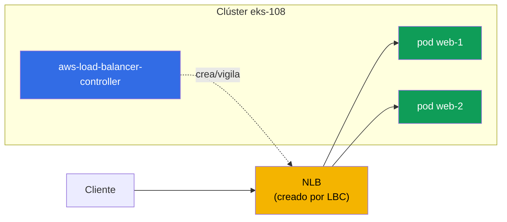
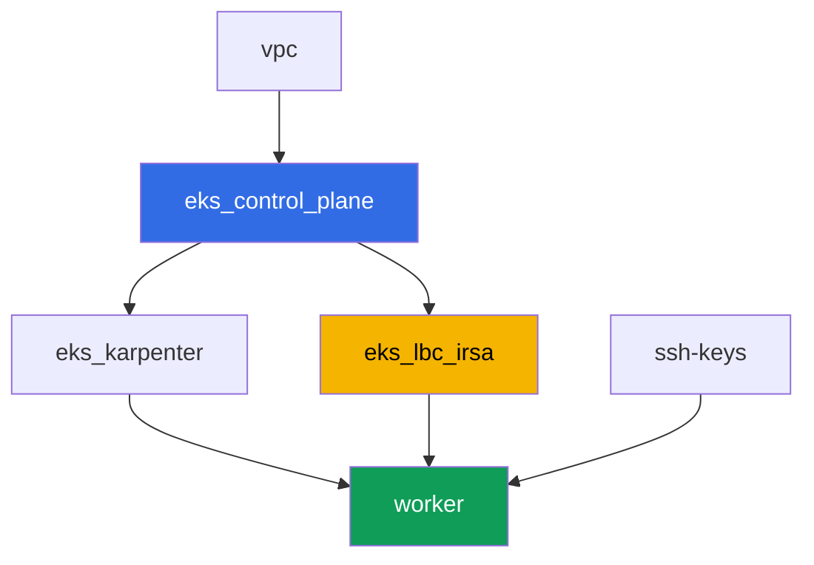

[Русская версия](README_RU.MD) · [Eng version](README.MD) · [Version française](README_FR.MD) · [Deutsche Version](README_DE.MD) · [ქართული ვერსია](README_GE.MD) · [繁體中文版](README_TW.MD) · [日本語版](README_JP.MD)

# Lab 108 - AWS Load Balancer Controller: NLB para un Service de tipo LoadBalancer

## Descripción

El primer laboratorio de la Parte 5 del curso - red y tráfico. Aquí instalas el AWS Load
Balancer Controller (LBC) y cambias la reconciliación de un Service de tipo LoadBalancer
del in-tree cloud provider obsoleto al controlador moderno, que crea un Network Load
Balancer (NLB) - un balanceador L4 con targets sobre las IP de los pods. Verás cómo la
anotación del Service decide qué controlador se hace cargo del objeto, cómo elegir el tipo
de target y el esquema de acceso, y cómo leer los logs del controlador para distinguir una
reconciliación normal de un fallo por permisos de IAM.

Las tareas están escritas en estilo de producción: un enunciado breve más criterios de
aceptación. La verificación es automática, mediante el comando `check_result`.

## Objetivo

Reforzar el material del siguiente capítulo del curso:

- [Capítulo 26. AWS Load Balancer Controller y un Service de tipo LoadBalancer: NLB](../../course/26/ru.md) - el controlador, anotaciones, NLB frente a CLB

## Qué vamos a crear

El clúster ya está desplegado como código (control plane, Fargate para los pods de
sistema, Karpenter para la carga de trabajo). Instalas el LBC y construyes una carga de
trabajo y un Service alrededor de él.

| Objeto | Qué es | Para qué sirve en este laboratorio |
|--------|---------|-------------------|
| Namespace `eks-108` | una sección del clúster para la carga del laboratorio | mantiene los recursos separados de los de sistema |
| ServiceAccount `aws-load-balancer-controller` | una SA en `kube-system` con un rol IRSA | da al controlador acceso a la API de ELBv2 |
| Deployment `aws-load-balancer-controller` | el controlador en sí (chart de Helm `eks/aws-load-balancer-controller`) | vigila los objetos Service/Ingress y crea balanceadores |
| Deployment `web` (2 réplicas) | la aplicación ping_pong | la carga de trabajo que publicamos hacia afuera |
| Service `web` (LoadBalancer) | un Service con anotaciones `external`, `nlb-target-type: ip`, `scheme` | obliga a LBC a crear un NLB con targets sobre las IP de los pods |
| Artefactos `nlb.txt`, `targets.txt`, `reconcile.txt` | salida de AWS CLI y explicación del log | confirman el tipo de balanceador, el tipo de target y la frontera de responsabilidad de IAM |

Imagen final del tráfico:



## Infraestructura

El entorno se despliega en AWS (`eu-central-1`) mediante Terragrunt. Cada carpeta del
laboratorio es un componente con su propio `terragrunt.hcl`, que hace referencia a un
módulo compartido en `terraform/modules/` y declara sus dependencias mediante bloques
`dependency`.

### Módulos y dependencias

| Carpeta (componente) | Módulo (`terraform/modules/`) | Depende de | Qué crea |
|---------------------|-------------------------------|------------|-------------|
| `vpc` | `vpc_v3` | - | VPC `10.10.0.0/16`, subredes en dos AZ, NAT |
| `ssh-keys` | `ssh-keys` | - | un par de claves SSH para la máquina de trabajo |
| `eks_control_plane` | `eks_v2_control_plane` | `vpc` | control plane de EKS `1.36`, proveedor OIDC |
| `eks_fargate_system` | `eks_v2_fargate` | `vpc`, `eks_control_plane` | perfil de Fargate para `kube-system` y `karpenter` |
| `eks_addons` | `eks_v2_addons` | `eks_control_plane`, `eks_fargate_system` | coredns, kube-proxy, vpc-cni, pod-identity |
| `eks_karpenter` | `eks_v2_karpenter` | `vpc`, `eks_control_plane`, `eks_addons`, `eks_fargate_system` | controlador de Karpenter, rol IAM de los nodos |
| `eks_karpenter_default_vng` | `eks_v2_karpenter_vng` | `vpc`, `eks_control_plane`, `eks_karpenter` | NodePool por defecto sobre AL2023 |
| `eks_lbc_irsa` | `eks_v2_lbc_irsa` | `eks_control_plane` | rol y política IAM de IRSA para el AWS Load Balancer Controller |
| `worker` | `eks_v2_work_pc` | `ssh-keys`, `vpc`, `eks_control_plane`, `eks_karpenter`, `eks_lbc_irsa` | máquina de trabajo con kubectl, tests y `check_result` |

El módulo `eks_v2_lbc_irsa` solo crea un rol IAM que confía en el proveedor OIDC del clúster
(una condición `sub` sobre `system:serviceaccount:kube-system:aws-load-balancer-controller`)
y una política con los permisos de ELBv2/EC2 que necesita el controlador. El controlador en
sí no es un add-on gestionado de EKS - lo instala el estudiante a mano mediante Helm en la
tarea 2.

Grafo de dependencias (lo que se aplica antes está más abajo en la flecha):



Los componentes `eks_fargate_system`, `eks_addons`, `eks_karpenter_default_vng` no se
incluyen en el grafo anterior por legibilidad (no más de 8 nodos) - se aplican en el orden
estándar entre `eks_control_plane` y `eks_karpenter`, como en el laboratorio 101.

### Dónde se configura cada cosa

`env.hcl` (parámetros comunes del entorno):

| Parámetro | Valor en el laboratorio | Qué afecta |
|----------|-----------------|---------------|
| `region` | `eu-central-1` | región de todos los recursos |
| `vpc_default_cidr`, `subnets` | `10.10.0.0/16`, subredes por AZ | plan de direcciones de la VPC, de ahí salen las IP de los targets del NLB |
| `prefix` | `eks-task108` | prefijo de nombres de recursos y etiquetas |
| `stack_name` | `eks108` | con él se construye `env_name` - el nombre del clúster |
| `k8_version` | `1.36.0` | versión de kubectl en la máquina de trabajo |
| `instance_type_worker` | `t3.medium` | tipo de instancia de la máquina de trabajo |
| `ssh_password_enable`, `access_cidrs` | `true`, `0.0.0.0/0` | acceso SSH a la máquina de trabajo |

`inputs` en el `terragrunt.hcl` de cada componente:

| Archivo | Ajustes clave |
|------|--------------------|
| `eks_control_plane/terragrunt.hcl` | `eks.version = "1.36"`, subredes para el control plane y los nodos |
| `eks_lbc_irsa/terragrunt.hcl` | `name` (clúster) y `oidc_provider_arn` para la política de confianza del rol |
| `eks_karpenter_default_vng/terragrunt.hcl` | `requirements` del NodePool, `disruption`, `budgets` |
| `worker/terragrunt.hcl` | `test_url`, `task_script_url` de los archivos del laboratorio 108; dependencia de `eks_lbc_irsa` |

## Despliegue

```bash
TASK=108 make run_eks_task
```

El despliegue tarda aproximadamente 15-20 minutos. En la salida, busca la línea con la
conexión SSH a la máquina de trabajo y conéctate a ella. kubectl ya está configurado allí
para el clúster correcto.

Comandos útiles en la máquina de trabajo:

```bash
time_left       # cuánto tiempo queda del entorno
check_result    # verificar la solución
```

> Seguridad del entorno. En `env.hcl` están activados `ssh_password_enable = true` y
> `access_cidrs = ["0.0.0.0/0"]` - cómodo para un entorno de formación, pero no es algo que
> se deba hacer en producción. Según los estándares del curso (capítulos 0.2, 2, 19), el
> acceso a las máquinas de trabajo se abre mediante AWS SSM Session Manager sin puertos SSH
> públicos hacia el exterior, y `access_cidrs` se restringe a direcciones concretas. Aquí se
> deja SSH público solo para simplificar el arranque.

## Tareas

---
|        **1**        | **Namespace para la carga del laboratorio**                             |
| :-----------------: | :---------------------------------------------------------- |
| Qué hacemos          | Crea un namespace llamado `eks-108`. Todos los objetos del laboratorio (excepto el controlador y su ServiceAccount, que viven en `kube-system`) se crean dentro de él. |
| Criterios de aceptación    | - el namespace `eks-108` existe. |
---
|        **2**        | **ServiceAccount e instalación del AWS Load Balancer Controller**  |
| :-----------------: | :---------------------------------------------------------- |
| Qué hacemos          | Busca el ARN del rol IAM que terraform creó para el controlador (nombre del rol `<cluster-name>-lbc-irsa`), y crea el ServiceAccount `aws-load-balancer-controller` en `kube-system` con la anotación `eks.amazonaws.com/role-arn` apuntando a ese rol. Luego instala el AWS Load Balancer Controller mediante Helm (repositorio `https://aws.github.io/eks-charts`, chart `aws-load-balancer-controller`) con las banderas `--set serviceAccount.create=false --set serviceAccount.name=aws-load-balancer-controller`, `--set clusterName=<nombre-del-clúster>`, `--set region=eu-central-1` y `--set vpcId=<ID-de-la-VPC-del-laboratorio>`. Las banderas `region`/`vpcId` son obligatorias: el controlador corre en Fargate (namespace `kube-system` bajo el perfil de Fargate), y en Fargate no hay instance metadata de EC2 - sin estas banderas el controlador intenta determinar el VPC ID a través de IMDS y cae en `CrashLoopBackOff`. Puedes obtener el VPC ID mediante `aws eks describe-cluster --name <cluster-name> --query 'cluster.resourcesVpcConfig.vpcId'`. Espera a que el Deployment `aws-load-balancer-controller` en `kube-system` quede `Running` (todas las réplicas Ready). |
| Criterios de aceptación    | - ServiceAccount `aws-load-balancer-controller` en `kube-system` con una anotación hacia el rol `lbc-irsa`;<br/>- Deployment `aws-load-balancer-controller` en `kube-system` tiene al menos una réplica lista. |
---
|        **3**        | **Carga de trabajo para publicar hacia afuera**                           |
| :-----------------: | :---------------------------------------------------------- |
| Qué hacemos          | En el namespace `eks-108` crea el Deployment `web`, imagen `viktoruj/ping_pong:latest`, `2` réplicas. Espera a que ambas réplicas queden Ready. |
| Criterios de aceptación    | - Deployment `web` en `eks-108`, imagen `viktoruj/ping_pong`;<br/>- `2` réplicas listas. |
---
|        **4**        | **Service de tipo LoadBalancer: NLB en vez de Classic Load Balancer** |
| :-----------------: | :---------------------------------------------------------- |
| Qué hacemos          | Crea el Service `web` de tipo `LoadBalancer` con selector `app: web`, puerto `80` hacia `targetPort: 8080`, y tres anotaciones: `service.beta.kubernetes.io/aws-load-balancer-type: external` (transfiere la reconciliación a LBC en vez del in-tree provider, que habría creado un Classic Load Balancer obsoleto), `service.beta.kubernetes.io/aws-load-balancer-nlb-target-type: ip`, `service.beta.kubernetes.io/aws-load-balancer-scheme: internet-facing`. Espera la dirección externa (`kubectl get svc web -n eks-108 -w`). A través de `aws elbv2 describe-load-balancers` confirma que se creó un balanceador `Type: network` (NLB, no `classic`) con `Scheme: internet-facing`, y guarda la salida en `/var/work/tests/artifacts/4/nlb.txt`. |
| Criterios de aceptación    | - Service `web` en `eks-108` con las tres anotaciones y una dirección externa (`status.loadBalancer.ingress[0].hostname`);<br/>- el archivo `nlb.txt` no está vacío y contiene `network` e `internet-facing`. |
---
|        **5**        | **Verificación de los targets: IP de los pods, no ID de los nodos**                 |
| :-----------------: | :---------------------------------------------------------- |
| Qué hacemos          | A través de `aws elbv2 describe-target-groups` encuentra el target group del NLB creado, y luego con `aws elbv2 describe-target-health` mira la lista de targets. Guarda ambas salidas en `/var/work/tests/artifacts/5/targets.txt`. Asegúrate de que `TargetType` sea `ip`, y que los identificadores de los targets sean direcciones IP de `10.10.0.0/16` (direcciones de los pods), no `i-...` (ID de instancia de los nodos). |
| Criterios de aceptación    | - el archivo `targets.txt` no está vacío;<br/>- contiene `"TargetType": "ip"` y al menos un target con una dirección de `10.10.0.0/16`;<br/>- no contiene targets de la forma `i-...`. |
---
|        **6**        | **Diagnóstico: reconciliación exitosa frente a AccessDenied**  |
| :-----------------: | :---------------------------------------------------------- |
| Qué hacemos          | Mira el log del controlador (`kubectl logs -n kube-system deploy/aws-load-balancer-controller`) y encuentra las líneas de reconciliación exitosa del Service `web` - en ellas aparece el ARN del balanceador creado (`arn:aws:elasticloadbalancing:...`). En el artefacto `/var/work/tests/artifacts/6/reconcile.txt` describe ambas situaciones: cómo se ve una reconciliación normal (con ese ARN) y cómo se vería un error por falta de permisos de IAM - un mensaje `AccessDenied` en la llamada a `elasticloadbalancing:CreateLoadBalancer`, que dejaría al Service sin dirección externa. |
| Criterios de aceptación    | - el archivo `reconcile.txt` no está vacío;<br/>- contiene una línea con `arn:aws:elasticloadbalancing` (el log real de la reconciliación exitosa);<br/>- contiene la palabra `AccessDenied` (descripción del síntoma esperado cuando faltan permisos). |
---

## Verificación del resultado

En la máquina de trabajo, ejecuta la verificación automática:

```bash
check_result
```

El script ejecutará los tests y mostrará el porcentaje de tareas completadas.

## Solución

Solución de referencia: [worker/files/solutions/1_ES.MD](worker/files/solutions/1_ES.MD)

## Eliminación del clúster y los recursos

> Antes de eliminar. El Service `web` de tipo `LoadBalancer` de la tarea 4 creó un NLB real
> y dos security groups directamente mediante la API de ELBv2/EC2 (AWS Load Balancer
> Controller), no terraform - el state no sabe nada de ellos. La forma correcta de
> eliminarlos es borrar el Service y dejar que LBC llame por sí mismo a la API de AWS para
> eliminarlos (un finalizer en el Service no permitirá que el objeto se elimine de etcd
> hasta que LBC confirme que el NLB y ambos SG realmente fueron eliminados) - esto es más
> fiable y sencillo que limpiar el NLB/SG a mano mediante AWS CLI:
>
> ```bash
> kubectl delete svc web -n eks-108
> # esperamos a que se retire el finalizer - eso significa "LBC eliminó el NLB y el SG"
> kubectl wait --for=delete svc/web -n eks-108 --timeout=120s
> ```
>
> Asegúrate de hacer esto ANTES de `terragrunt destroy`. Si el control plane ya se eliminó
> antes que el Service (LBC ya no puede ejecutar el finalizer), el NLB y sus SG quedarán
> huérfanos y seguirán reteniendo ENI en las subredes públicas - la VPC y el Internet
> Gateway se quedarán atascados en `Still destroying...` para siempre. En ese caso LBC ya
> no puede ayudar, y solo queda limpiar a mano mediante AWS CLI:
>
> ```bash
> VPC_ID=<ID-de-la-VPC-de-este-laboratorio>
> LB_ARN=$(aws elbv2 describe-load-balancers \
>   --query "LoadBalancers[?contains(LoadBalancerName,'eks108')].LoadBalancerArn" --output text)
> aws elbv2 delete-load-balancer --load-balancer-arn "$LB_ARN"
> # espera a que se liberen los ENI en las subredes, luego elimina los SG restantes:
> aws ec2 describe-security-groups --filters "Name=vpc-id,Values=$VPC_ID" \
>   --query "SecurityGroups[?GroupName!='default'].GroupId" --output text | \
>   xargs -n1 aws ec2 delete-security-group --group-id
> ```

```bash
TASK=108 make delete_eks_task
```
